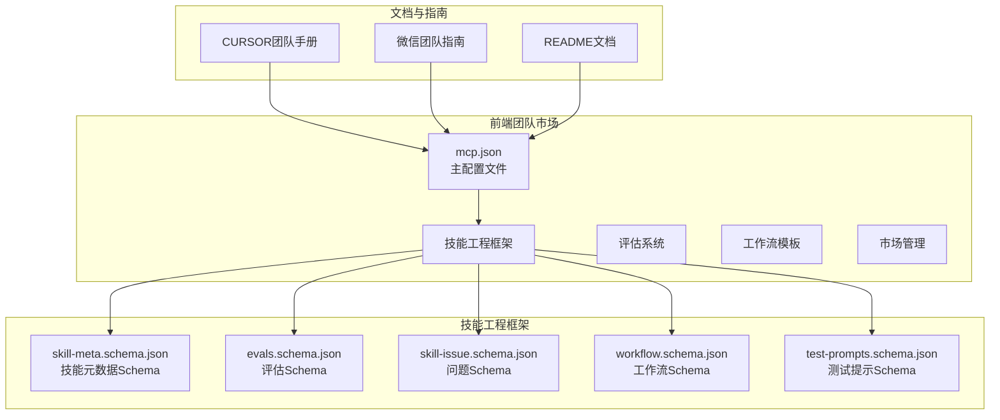
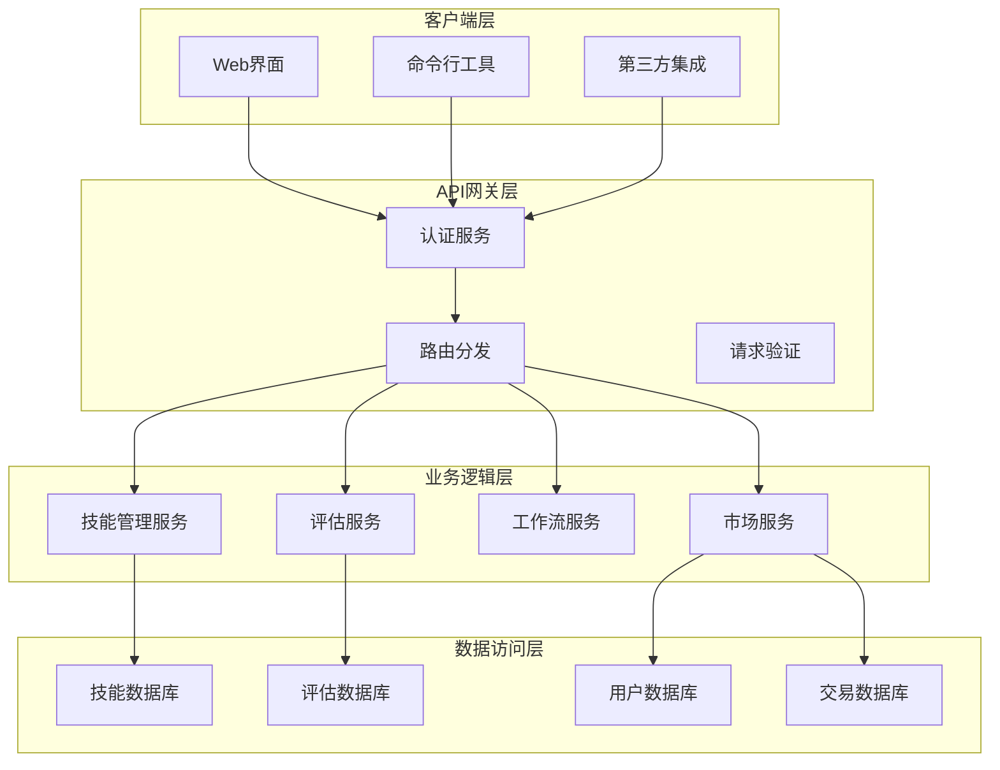
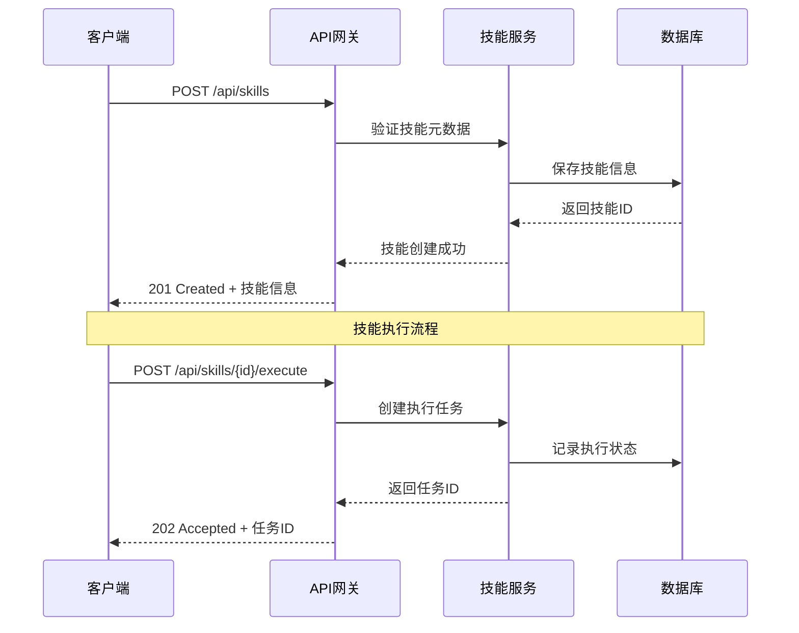
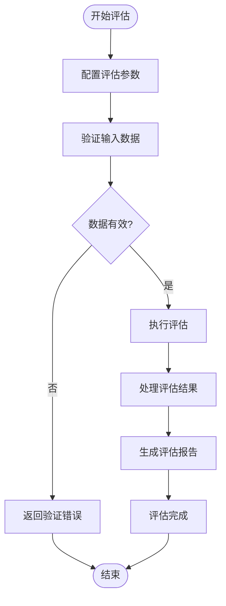
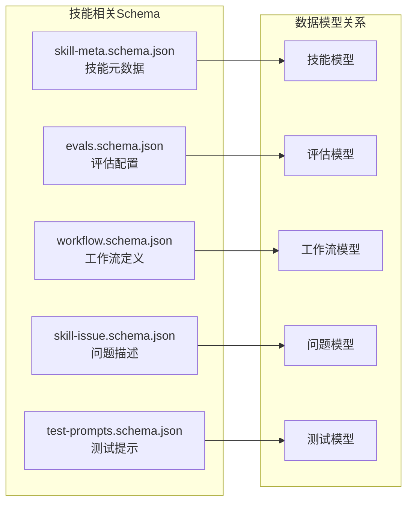

# API参考文档

<cite>
**本文档引用的文件**
- [mcp.json](file://plugins/frontend-team-toolkit/mcp.json)
- [skill-meta.schema.json](file://plugins/frontend-team-toolkit/skill-engineering/schemas/skill-meta.schema.json)
- [evals.schema.json](file://plugins/frontend-team-toolkit/skill-engineering/schemas/evals.schema.json)
- [skill-issue.schema.json](file://plugins/frontend-team-toolkit/skill-engineering/schemas/skill-issue.schema.json)
- [workflow.schema.json](file://plugins/frontend-team-toolkit/skill-engineering/schemas/workflow.schema.json)
- [test-prompts.schema.json](file://plugins/frontend-team-toolkit/skill-engineering/schemas/test-prompts.schema.json)
- [README.md](file://plugins/frontend-team-toolkit/README.md)
- [skill-engineering/README.md](file://plugins/frontend-team-toolkit/skill-engineering/README.md)
- [CURSOR_TEAM_MARKETPLACE_PLUGIN_HANDBOOK.md](file://CURSOR_TEAM_MARKETPLACE_PLUGIN_HANDBOOK.md)
- [WECHAT_TEAM_MARKETPLACE_PLUGIN_GUIDE.md](file://WECHAT_TEAM_MARKETPLACE_PLUGIN_GUIDE.md)
</cite>

## 目录
1. [简介](#简介)
2. [项目结构](#项目结构)
3. [核心组件](#核心组件)
4. [架构概览](#架构概览)
5. [详细组件分析](#详细组件分析)
6. [依赖关系分析](#依赖关系分析)
7. [性能考虑](#性能考虑)
8. [故障排除指南](#故障排除指南)
9. [结论](#结论)
10. [附录](#附录)

## 简介
本项目是一个前端团队市场平台，提供技能（Skill）的创建、执行、评估和管理能力。系统围绕技能工程框架构建，包含完整的技能生命周期管理、评估体系和市场交易功能。本文档详细说明了技能API、评估API和市场API的设计与实现，包括HTTP方法、URL模式、请求响应格式、认证机制、JSON Schema定义、数据模型以及错误处理策略。

## 项目结构
项目采用模块化组织方式，核心功能集中在frontend-team-toolkit插件中，包含技能工程框架、评估系统、工作流模板和市场管理工具。

**图表来源**
- [mcp.json](file://plugins/frontend-team-toolkit/mcp.json)
- [skill-meta.schema.json](file://plugins/frontend-team-toolkit/skill-engineering/schemas/skill-meta.schema.json)
- [evals.schema.json](file://plugins/frontend-team-toolkit/skill-engineering/schemas/evals.schema.json)

**章节来源**
- [mcp.json](file://plugins/frontend-team-toolkit/mcp.json)
- [README.md](file://plugins/frontend-team-toolkit/README.md)

## 核心组件
系统的核心组件包括技能管理、评估引擎、工作流执行和市场交易四个主要模块。每个模块都有明确的职责边界和接口规范。

### 技能管理模块
负责技能的全生命周期管理，包括创建、更新、查询和状态变更。支持多种技能类型和复杂的工作流配置。

### 评估引擎模块  
提供多维度的技能评估能力，包括自动化评估、人工评审和回归测试。支持自定义评分标准和评估流程。

### 工作流执行模块
实现复杂的技能执行流程，支持串行、并行、条件分支等执行模式。提供可视化的工作流设计和调试工具。

### 市场交易模块
管理技能的市场交易功能，包括上架、下架、购买和评价。提供完整的交易记录和评价体系。

**章节来源**
- [skill-engineering/README.md](file://plugins/frontend-team-toolkit/skill-engineering/README.md)
- [skill-meta.schema.json](file://plugins/frontend-team-toolkit/skill-engineering/schemas/skill-meta.schema.json)

## 架构概览
系统的整体架构采用分层设计，从底层的数据存储到上层的业务逻辑，形成了清晰的职责分离。

**图表来源**
- [mcp.json](file://plugins/frontend-team-toolkit/mcp.json)
- [skill-meta.schema.json](file://plugins/frontend-team-toolkit/skill-engineering/schemas/skill-meta.schema.json)

## 详细组件分析

### 技能API设计

#### 技能创建接口
技能创建接口支持多种技能类型的创建，包括代码生成、文档编写、测试用例等。接口提供完整的技能元数据定义和执行参数配置。

**HTTP方法**: POST
**URL模式**: `/api/skills`
**请求体**: 技能元数据JSON对象
**响应体**: 创建成功的技能信息

#### 技能执行接口
技能执行接口支持同步和异步两种执行模式。提供实时反馈和结果查询功能。

**HTTP方法**: POST  
**URL模式**: `/api/skills/{skillId}/execute`
**请求体**: 执行参数配置
**响应体**: 执行任务ID和初始状态

#### 技能查询接口
提供多种查询维度，包括按ID查询、按类型过滤、按状态筛选等。

**HTTP方法**: GET
**URL模式**: `/api/skills/{skillId}` 或 `/api/skills?filter=...`
**响应体**: 技能详情或技能列表

#### 技能更新接口
支持技能元数据的动态更新和状态变更。

**HTTP方法**: PUT/PATCH
**URL模式**: `/api/skills/{skillId}`
**请求体**: 更新字段集合
**响应体**: 更新后的技能信息

**图表来源**
- [mcp.json](file://plugins/frontend-team-toolkit/mcp.json)
- [skill-meta.schema.json](file://plugins/frontend-team-toolkit/skill-engineering/schemas/skill-meta.schema.json)

**章节来源**
- [mcp.json](file://plugins/frontend-team-toolkit/mcp.json)
- [skill-meta.schema.json](file://plugins/frontend-team-toolkit/skill-engineering/schemas/skill-meta.schema.json)

### 评估API设计

#### 评估执行接口
支持批量评估和单次评估，提供详细的评估报告和统计信息。

**HTTP方法**: POST
**URL模式**: `/api/evals/run`
**请求体**: 评估配置和输入数据
**响应体**: 评估任务ID和结果摘要

#### 评估查询接口
提供评估历史查询和结果详情查看功能。

**HTTP方法**: GET
**URL模式**: `/api/evals/{evalId}` 或 `/api/evals?status=...`
**响应体**: 评估详情或评估列表

#### 评估报告接口
生成标准化的评估报告，支持多种格式导出。

**HTTP方法**: GET
**URL模式**: `/api/evals/{evalId}/report`
**响应体**: 评估报告内容

**图表来源**
- [evals.schema.json](file://plugins/frontend-team-toolkit/skill-engineering/schemas/evals.schema.json)

**章节来源**
- [evals.schema.json](file://plugins/frontend-team-toolkit/skill-engineering/schemas/evals.schema.json)

### 市场API设计

#### 技能上架接口
支持技能的市场发布和定价设置。

**HTTP方法**: POST
**URL模式**: `/api/market/list`
**请求体**: 上架配置和价格信息
**响应体**: 上架确认信息

#### 技能下架接口
提供技能的暂停销售和下架功能。

**HTTP方法**: DELETE
**URL模式**: `/api/market/unlist/{skillId}`
**响应体**: 下架确认信息

#### 交易执行接口
处理技能购买和交付流程。

**HTTP方法**: POST
**URL模式**: `/api/market/buy/{skillId}`
**请求体**: 购买参数和支付信息
**响应体**: 交易确认和交付信息

#### 评价管理接口
支持买家对技能进行评价和反馈。

**HTTP方法**: POST
**URL模式**: `/api/market/reviews`
**请求体**: 评价内容和评分
**响应体**: 评价记录信息

**章节来源**
- [skill-meta.schema.json](file://plugins/frontend-team-toolkit/skill-engineering/schemas/skill-meta.schema.json)

## 依赖关系分析

### JSON Schema定义
系统使用严格的JSON Schema来确保数据的一致性和完整性。

**图表来源**
- [skill-meta.schema.json](file://plugins/frontend-team-toolkit/skill-engineering/schemas/skill-meta.schema.json)
- [evals.schema.json](file://plugins/frontend-team-toolkit/skill-engineering/schemas/evals.schema.json)
- [skill-issue.schema.json](file://plugins/frontend-team-toolkit/skill-engineering/schemas/skill-issue.schema.json)
- [workflow.schema.json](file://plugins/frontend-team-toolkit/skill-engineering/schemas/workflow.schema.json)
- [test-prompts.schema.json](file://plugins/frontend-team-toolkit/skill-engineering/schemas/test-prompts.schema.json)

### 数据模型说明

#### 技能元数据模型
技能元数据包含技能的基本信息、技术栈、复杂度等级和执行要求等属性。

#### 评估配置模型
评估配置定义了评估的标准、权重分配和通过条件等规则。

#### 工作流模型
工作流模型描述了技能执行的具体步骤、条件判断和异常处理机制。

**章节来源**
- [skill-meta.schema.json](file://plugins/frontend-team-toolkit/skill-engineering/schemas/skill-meta.schema.json)
- [evals.schema.json](file://plugins/frontend-team-toolkit/skill-engineering/schemas/evals.schema.json)
- [workflow.schema.json](file://plugins/frontend-team-toolkit/skill-engineering/schemas/workflow.schema.json)

## 性能考虑
系统在设计时充分考虑了性能优化，包括缓存策略、并发控制和资源管理等方面。

### 缓存策略
- 技能元数据缓存：减少重复查询数据库的开销
- 评估结果缓存：避免重复计算相同输入的评估结果
- 用户会话缓存：提高认证和授权的响应速度

### 并发控制
- 任务队列管理：有序处理大量技能执行请求
- 连接池管理：优化数据库连接的使用效率
- 资源限制：防止恶意请求导致的资源耗尽

### 监控指标
- 请求延迟分布
- 错误率统计
- 资源使用率监控
- 用户活跃度分析

## 故障排除指南

### 常见错误类型
系统定义了完整的错误码体系，用于快速定位和解决问题。

#### 技能相关错误
- 技能不存在：404 Not Found
- 技能状态不正确：400 Bad Request
- 技能执行失败：500 Internal Server Error

#### 评估相关错误
- 评估配置无效：400 Bad Request
- 评估数据格式错误：400 Bad Request
- 评估超时：504 Gateway Timeout

#### 市场相关错误
- 技能未上架：400 Bad Request
- 余额不足：402 Payment Required
- 交易冲突：409 Conflict

### 错误处理策略
- 统一错误响应格式
- 详细的错误描述信息
- 自动重试机制
- 完整的日志记录

**章节来源**
- [mcp.json](file://plugins/frontend-team-toolkit/mcp.json)

## 结论
本API参考文档全面介绍了前端团队市场的技能管理、评估和市场交易功能。系统采用模块化设计，提供了完整的技能生命周期管理能力和企业级的安全保障。通过严格的JSON Schema定义和完善的错误处理机制，确保了系统的稳定性和可维护性。

## 附录

### API版本管理
系统采用语义化版本控制，确保向后兼容性和平滑升级。

#### 版本号规则
- 主版本号：重大功能变更
- 次版本号：新增功能但保持兼容
- 修订号：bug修复和小改进

#### 兼容性保证
- 向后兼容的新功能
- 弃用功能的迁移路径
- 版本降级支持

### 认证方法
系统支持多种认证方式，满足不同场景的需求。

#### API密钥认证
适用于服务间通信和自动化脚本。

#### OAuth 2.0认证
适用于用户登录和第三方集成。

#### JWT令牌认证
适用于移动端和单点登录场景。

### 开发者指南
为开发者提供完整的集成指南和最佳实践建议。

**章节来源**
- [CURSOR_TEAM_MARKETPLACE_PLUGIN_HANDBOOK.md](file://CURSOR_TEAM_MARKETPLACE_PLUGIN_HANDBOOK.md)
- [WECHAT_TEAM_MARKETPLACE_PLUGIN_GUIDE.md](file://WECHAT_TEAM_MARKETPLACE_PLUGIN_GUIDE.md)