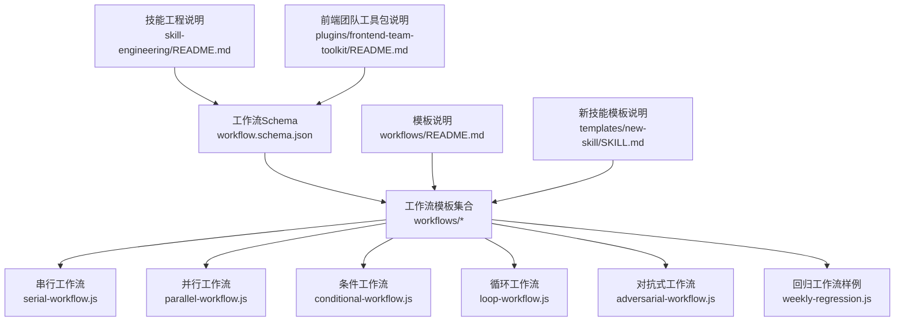
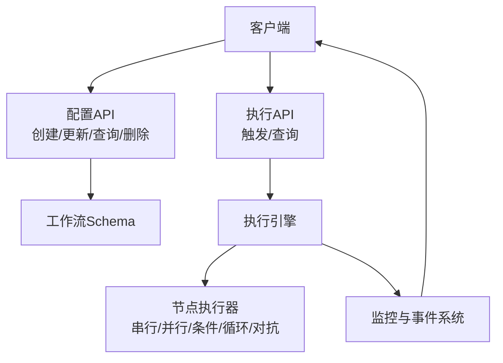
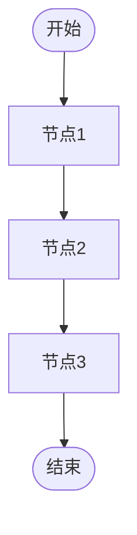
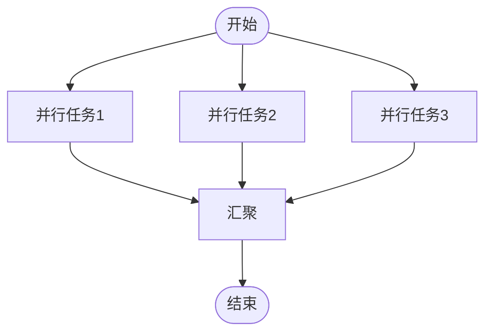
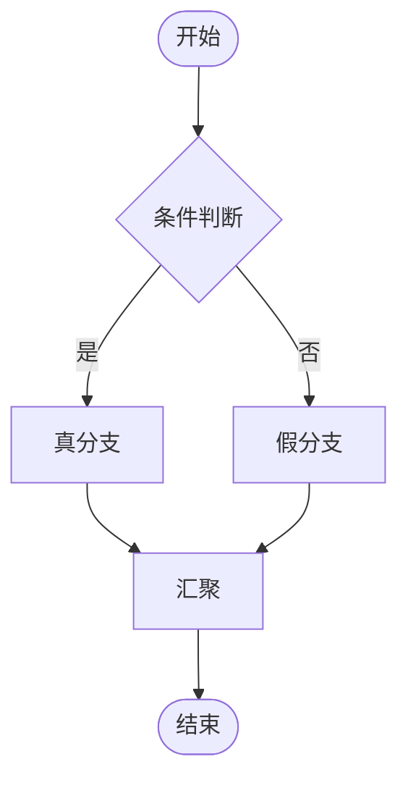
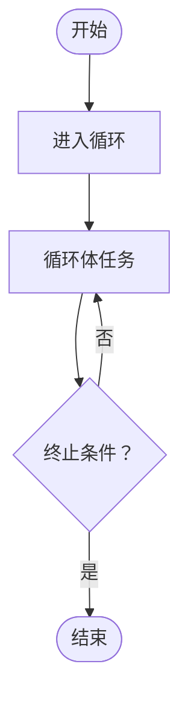
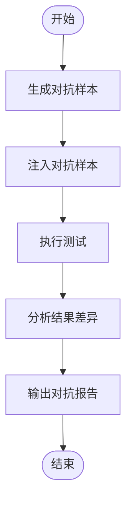
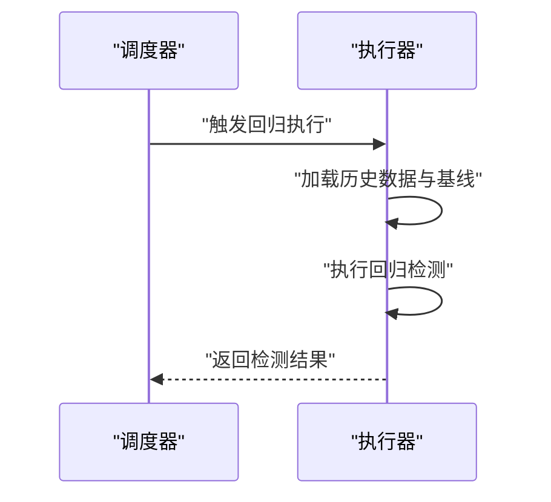
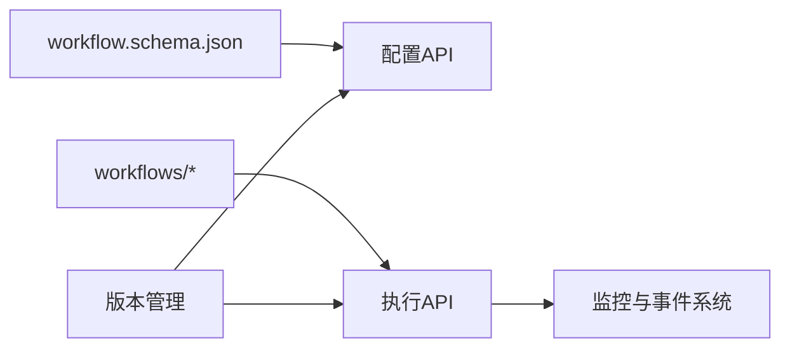

# 工作流API

<cite>
**本文引用的文件**
- [workflow.schema.json](file://plugins/frontend-team-toolkit/skill-engineering/schemas/workflow.schema.json)
- [adversarial-workflow.js](file://plugins/frontend-team-toolkit/skill-engineering/templates/new-skill/workflows/adversarial-workflow.js)
- [conditional-workflow.js](file://plugins/frontend-team-toolkit/skill-engineering/templates/new-skill/workflows/conditional-workflow.js)
- [loop-workflow.js](file://plugins/frontend-team-toolkit/skill-engineering/templates/new-skill/workflows/loop-workflow.js)
- [parallel-workflow.js](file://plugins/frontend-team-toolkit/skill-engineering/templates/new-skill/workflows/parallel-workflow.js)
- [serial-workflow.js](file://plugins/frontend-team-toolkit/skill-engineering/templates/new-skill/workflows/serial-workflow.js)
- [weekly-regression.js](file://plugins/frontend-team-toolkit/skill-engineering/templates/new-skill/workflows/weekly-regression.js)
- [README.md（工作流模板）](file://plugins/frontend-team-toolkit/skill-engineering/templates/new-skill/workflows/README.md)
- [SKILL.md（新技能模板）](file://plugins/frontend-team-toolkit/skill-engineering/templates/new-skill/SKILL.md)
- [README.md（技能工程）](file://plugins/frontend-team-toolkit/skill-engineering/README.md)
- [README.md（前端团队工具包）](file://plugins/frontend-team-toolkit/README.md)
- [CURSOR_TEAM_MARKETPLACE_PLUGIN_HANDBOOK.md](file://CURSOR_TEAM_MARKETPLACE_PLUGIN_HANDBOOK.md)
- [WECHAT_TEAM_MARKETPLACE_PLUGIN_GUIDE.md](file://WECHAT_TEAM_MARKETPLACE_PLUGIN_GUIDE.md)
</cite>

## 目录
1. [简介](#简介)
2. [项目结构](#项目结构)
3. [核心组件](#核心组件)
4. [架构总览](#架构总览)
5. [详细组件分析](#详细组件分析)
6. [依赖关系分析](#依赖关系分析)
7. [性能考虑](#性能考虑)
8. [故障排除指南](#故障排除指南)
9. [结论](#结论)
10. [附录](#附录)

## 简介
本文件面向“工作流API”的设计与使用，结合仓库中的工作流模板与Schema定义，系统化阐述工作流配置、执行与监控的接口模型、数据结构与最佳实践。需要特别说明的是：当前仓库未包含后端服务或REST API的具体实现代码；本文档以“工作流配置与执行”为视角，基于现有Schema与模板进行抽象建模，帮助读者理解工作流在该体系内的组织方式与调用边界。

## 项目结构
围绕工作流API，仓库中与之直接相关的目录与文件包括：
- 工作流Schema定义：用于约束工作流配置的数据结构与字段含义
- 工作流模板：提供五种典型工作流类型的实现样例（串行、并行、条件、循环、对抗）
- 模板说明文档：介绍如何在新技能模板中使用工作流
- 技能工程与工具包的顶层说明文档：提供上下文背景与集成指引

**图示来源**
- [workflow.schema.json](file://plugins/frontend-team-toolkit/skill-engineering/schemas/workflow.schema.json)
- [serial-workflow.js](file://plugins/frontend-team-toolkit/skill-engineering/templates/new-skill/workflows/serial-workflow.js)
- [parallel-workflow.js](file://plugins/frontend-team-toolkit/skill-engineering/templates/new-skill/workflows/parallel-workflow.js)
- [conditional-workflow.js](file://plugins/frontend-team-toolkit/skill-engineering/templates/new-skill/workflows/conditional-workflow.js)
- [loop-workflow.js](file://plugins/frontend-team-toolkit/skill-engineering/templates/new-skill/workflows/loop-workflow.js)
- [adversarial-workflow.js](file://plugins/frontend-team-toolkit/skill-engineering/templates/new-skill/workflows/adversarial-workflow.js)
- [weekly-regression.js](file://plugins/frontend-team-toolkit/skill-engineering/templates/new-skill/workflows/weekly-regression.js)
- [README.md（工作流模板）](file://plugins/frontend-team-toolkit/skill-engineering/templates/new-skill/workflows/README.md)
- [SKILL.md（新技能模板）](file://plugins/frontend-team-toolkit/skill-engineering/templates/new-skill/SKILL.md)
- [README.md（技能工程）](file://plugins/frontend-team-toolkit/skill-engineering/README.md)
- [README.md（前端团队工具包）](file://plugins/frontend-team-toolkit/README.md)

**章节来源**
- [workflow.schema.json](file://plugins/frontend-team-toolkit/skill-engineering/schemas/workflow.schema.json)
- [README.md（工作流模板）](file://plugins/frontend-team-toolkit/skill-engineering/templates/new-skill/workflows/README.md)
- [SKILL.md（新技能模板）](file://plugins/frontend-team-toolkit/skill-engineering/templates/new-skill/SKILL.md)
- [README.md（技能工程）](file://plugins/frontend-team-toolkit/skill-engineering/README.md)
- [README.md（前端团队工具包）](file://plugins/frontend-team-toolkit/README.md)

## 核心组件
本节从“工作流配置API”的角度，抽象出以下核心组件与职责：
- 配置数据模型：由工作流Schema定义，描述工作流的节点、连接、参数与控制逻辑
- 执行引擎：根据配置解析并调度任务，支持串行、并行、条件、循环与对抗等模式
- 监控与状态管理：记录执行状态、节点进度、错误信息与重试策略
- 版本与回滚：通过变更日志与模板快照实现版本追踪与回滚

为便于理解，下表给出工作流配置API的接口抽象（注意：以下为概念性接口模型，非具体HTTP实现）：

- 配置创建/更新
  - 方法：POST/PUT
  - 路径：/api/workflows/{workflowId}
  - 请求体：符合 workflow.schema.json 的工作流配置对象
  - 响应：200 成功；400 参数校验失败；401/403 认证/授权失败
  - 认证：Bearer Token 或 Cookie（依据部署环境）

- 配置查询
  - 方法：GET
  - 路径：/api/workflows/{workflowId}
  - 响应：200 返回完整配置；404 未找到；401/403 权限不足

- 配置删除
  - 方法：DELETE
  - 路径：/api/workflows/{workflowId}
  - 响应：204 无内容；404 未找到；401/403 权限不足

- 执行触发
  - 方法：POST
  - 路径：/api/workflows/{workflowId}/executions
  - 请求体：可选执行参数（如输入上下文、并发度、重试策略）
  - 响应：202 接受执行；400/409 状态冲突；401/403 权限不足

- 执行查询
  - 方法：GET
  - 路径：/api/workflows/{workflowId}/executions/{executionId}
  - 响应：200 返回执行详情；404 未找到；401/403 权限不足

- 执行状态订阅（事件推送）
  - 方法：Server-Sent Events 或 Webhook
  - 路径：/api/workflows/{workflowId}/executions/{executionId}/events
  - 事件：节点开始/完成、分支选择、循环迭代、对抗阶段切换、异常与重试

- 版本管理
  - 方法：GET/POST
  - 路径：/api/workflows/{workflowId}/versions
  - 行为：列出版本、创建快照、回滚到指定版本

**章节来源**
- [workflow.schema.json](file://plugins/frontend-team-toolkit/skill-engineering/schemas/workflow.schema.json)
- [README.md（工作流模板）](file://plugins/frontend-team-toolkit/skill-engineering/templates/new-skill/workflows/README.md)

## 架构总览
下图展示工作流API的概念性架构：客户端通过配置API提交工作流定义，执行API启动执行，执行引擎按配置调度节点，监控系统记录状态并通过事件通道通知客户端。

**图示来源**
- [workflow.schema.json](file://plugins/frontend-team-toolkit/skill-engineering/schemas/workflow.schema.json)
- [README.md（工作流模板）](file://plugins/frontend-team-toolkit/skill-engineering/templates/new-skill/workflows/README.md)

## 详细组件分析

### 串行工作流（Serial Workflow）
- 定义：任务按顺序依次执行，前一任务完成后才进入下一任务
- 典型场景：数据预处理→特征工程→模型训练→评估
- 关键点：顺序依赖强，容错性低，适合线性流程
- 参考模板：[serial-workflow.js](file://plugins/frontend-team-toolkit/skill-engineering/templates/new-skill/workflows/serial-workflow.js)

**图示来源**
- [serial-workflow.js](file://plugins/frontend-team-toolkit/skill-engineering/templates/new-skill/workflows/serial-workflow.js)

**章节来源**
- [serial-workflow.js](file://plugins/frontend-team-toolkit/skill-engineering/templates/new-skill/workflows/serial-workflow.js)

### 并行工作流（Parallel Workflow）
- 定义：多个任务同时执行，适用于独立且可并行的任务
- 典型场景：多模型并行推理、多数据源采集
- 关键点：资源竞争与收敛同步，需统一聚合策略
- 参考模板：[parallel-workflow.js](file://plugins/frontend-team-toolkit/skill-engineering/templates/new-skill/workflows/parallel-workflow.js)

**图示来源**
- [parallel-workflow.js](file://plugins/frontend-team-toolkit/skill-engineering/templates/new-skill/workflows/parallel-workflow.js)

**章节来源**
- [parallel-workflow.js](file://plugins/frontend-team-toolkit/skill-engineering/templates/new-skill/workflows/parallel-workflow.js)

### 条件工作流（Conditional Workflow）
- 定义：根据条件表达式选择不同分支执行
- 典型场景：A/B测试分流、阈值判断后的不同处理路径
- 关键点：条件表达式可嵌套，分支合并需明确收敛点
- 参考模板：[conditional-workflow.js](file://plugins/frontend-team-toolkit/skill-engineering/templates/new-skill/workflows/conditional-workflow.js)

**图示来源**
- [conditional-workflow.js](file://plugins/frontend-team-toolkit/skill-engineering/templates/new-skill/workflows/conditional-workflow.js)

**章节来源**
- [conditional-workflow.js](file://plugins/frontend-team-toolkit/skill-engineering/templates/new-skill/workflows/conditional-workflow.js)

### 循环工作流（Loop Workflow）
- 定义：重复执行一段任务直到满足终止条件
- 典型场景：批量数据分页处理、自适应采样、收敛迭代
- 关键点：必须设置安全上限与收敛判定，避免无限循环
- 参考模板：[loop-workflow.js](file://plugins/frontend-team-toolkit/skill-engineering/templates/new-skill/workflows/loop-workflow.js)

**图示来源**
- [loop-workflow.js](file://plugins/frontend-team-toolkit/skill-engineering/templates/new-skill/workflows/loop-workflow.js)

**章节来源**
- [loop-workflow.js](file://plugins/frontend-team-toolkit/skill-engineering/templates/new-skill/workflows/loop-workflow.js)

### 对抗式工作流（Adversarial Workflow）
- 定义：引入对抗样本或对抗性测试，验证鲁棒性
- 典型场景：安全测试、边界扰动、竞品对比
- 关键点：对抗样本生成与注入策略、结果对比与报告
- 参考模板：[adversarial-workflow.js](file://plugins/frontend-team-toolkit/skill-engineering/templates/new-skill/workflows/adversarial-workflow.js)

**图示来源**
- [adversarial-workflow.js](file://plugins/frontend-team-toolkit/skill-engineering/templates/new-skill/workflows/adversarial-workflow.js)

**章节来源**
- [adversarial-workflow.js](file://plugins/frontend-team-toolkit/skill-engineering/templates/new-skill/workflows/adversarial-workflow.js)

### 回归工作流样例（Weekly Regression）
- 定义：定期运行以检测回归问题
- 典型场景：持续集成回归检测、指标漂移监控
- 参考模板：[weekly-regression.js](file://plugins/frontend-team-toolkit/skill-engineering/templates/new-skill/workflows/weekly-regression.js)

**图示来源**
- [weekly-regression.js](file://plugins/frontend-team-toolkit/skill-engineering/templates/new-skill/workflows/weekly-regression.js)

**章节来源**
- [weekly-regression.js](file://plugins/frontend-team-toolkit/skill-engineering/templates/new-skill/workflows/weekly-regression.js)

## 依赖关系分析
工作流配置API与模板之间的依赖关系如下：
- 配置API依赖工作流Schema进行参数校验
- 执行API依赖各工作流模板的执行逻辑
- 监控与事件系统依赖执行API的状态上报
- 版本管理依赖变更日志与快照

**图示来源**
- [workflow.schema.json](file://plugins/frontend-team-toolkit/skill-engineering/schemas/workflow.schema.json)
- [README.md（工作流模板）](file://plugins/frontend-team-toolkit/skill-engineering/templates/new-skill/workflows/README.md)

**章节来源**
- [workflow.schema.json](file://plugins/frontend-team-toolkit/skill-engineering/schemas/workflow.schema.json)
- [README.md（工作流模板）](file://plugins/frontend-team-toolkit/skill-engineering/templates/new-skill/workflows/README.md)

## 性能考虑
- 并行度控制：合理设置并行任务数量，避免资源争用
- 节点超时与重试：为易失败节点配置指数退避重试
- 分片与批处理：对大数据量场景采用分片与批处理降低内存峰值
- 缓存与去重：对重复输入与中间结果进行缓存与去重
- 监控与告警：建立关键节点耗时与失败率的监控阈值
- 回滚与灰度：通过版本管理与灰度发布降低风险

## 故障排除指南
- 配置校验失败
  - 现象：提交配置时报400
  - 排查：对照工作流Schema核对字段类型与必填项
  - 参考：[workflow.schema.json](file://plugins/frontend-team-toolkit/skill-engineering/schemas/workflow.schema.json)

- 执行阻塞或卡死
  - 现象：执行长时间无进展
  - 排查：检查循环工作流的终止条件是否可达；查看并行任务的收敛点
  - 参考：[loop-workflow.js](file://plugins/frontend-team-toolkit/skill-engineering/templates/new-skill/workflows/loop-workflow.js)、[parallel-workflow.js](file://plugins/frontend-team-toolkit/skill-engineering/templates/new-skill/workflows/parallel-workflow.js)

- 条件分支误判
  - 现象：分支选择不符合预期
  - 排查：核对条件表达式与输入数据类型；增加分支日志
  - 参考：[conditional-workflow.js](file://plugins/frontend-team-toolkit/skill-engineering/templates/new-skill/workflows/conditional-workflow.js)

- 对抗样本无效
  - 现象：对抗测试未触发或结果异常
  - 排查：确认对抗样本生成策略与注入点；比对正常与对抗输出
  - 参考：[adversarial-workflow.js](file://plugins/frontend-team-toolkit/skill-engineering/templates/new-skill/workflows/adversarial-workflow.js)

- 回归检测误报
  - 现象：回归检测频繁报警
  - 排查：调整阈值与统计窗口；区分真实回归与噪声波动
  - 参考：[weekly-regression.js](file://plugins/frontend-team-toolkit/skill-engineering/templates/new-skill/workflows/weekly-regression.js)

**章节来源**
- [workflow.schema.json](file://plugins/frontend-team-toolkit/skill-engineering/schemas/workflow.schema.json)
- [loop-workflow.js](file://plugins/frontend-team-toolkit/skill-engineering/templates/new-skill/workflows/loop-workflow.js)
- [parallel-workflow.js](file://plugins/frontend-team-toolkit/skill-engineering/templates/new-skill/workflows/parallel-workflow.js)
- [conditional-workflow.js](file://plugins/frontend-team-toolkit/skill-engineering/templates/new-skill/workflows/conditional-workflow.js)
- [adversarial-workflow.js](file://plugins/frontend-team-toolkit/skill-engineering/templates/new-skill/workflows/adversarial-workflow.js)
- [weekly-regression.js](file://plugins/frontend-team-toolkit/skill-engineering/templates/new-skill/workflows/weekly-regression.js)

## 结论
本文件基于仓库中的工作流Schema与模板，构建了工作流API的概念性接口模型与执行框架。尽管当前仓库未包含后端服务实现，但通过标准化的配置数据模型与丰富的模板样例，可以指导后续服务端的开发与集成。建议在实际落地时，优先完善认证鉴权、事件推送与版本管理能力，并结合监控体系持续优化性能与稳定性。

## 附录
- 新技能模板使用指南与工作流集成要点：[SKILL.md（新技能模板）](file://plugins/frontend-team-toolkit/skill-engineering/templates/new-skill/SKILL.md)
- 技能工程与工作流生态说明：[README.md（技能工程）](file://plugins/frontend-team-toolkit/skill-engineering/README.md)
- 前端团队工具包与插件生态说明：[README.md（前端团队工具包）](file://plugins/frontend-team-toolkit/README.md)
- 插件市场手册与指南：[CURSOR_TEAM_MARKETPLACE_PLUGIN_HANDBOOK.md](file://CURSOR_TEAM_MARKETPLACE_PLUGIN_HANDBOOK.md)、[WECHAT_TEAM_MARKETPLACE_PLUGIN_GUIDE.md](file://WECHAT_TEAM_MARKETPLACE_PLUGIN_GUIDE.md)