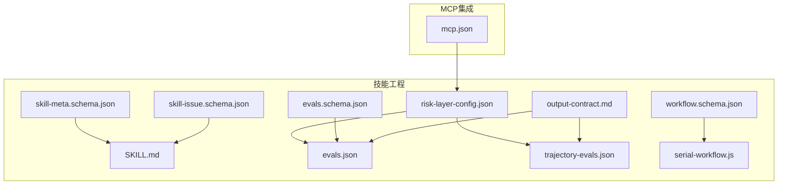
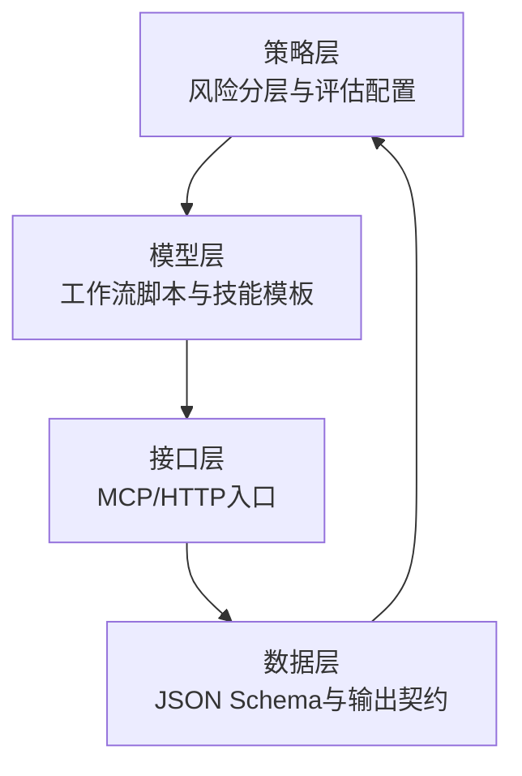
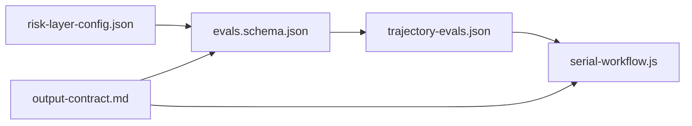
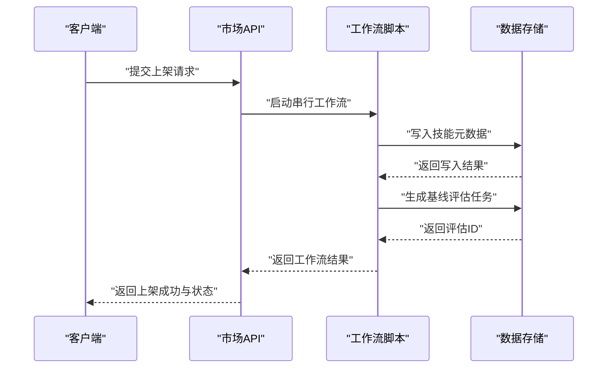

# 市场API

<cite>
**本文引用的文件**
- [mcp.json](file://plugins/frontend-team-toolkit/mcp.json)
- [risk-layer-config.json](file://plugins/frontend-team-toolkit/skill-engineering/config/risk-layer-config.json)
- [skill-meta.schema.json](file://plugins/frontend-team-toolkit/skill-engineering/schemas/skill-meta.schema.json)
- [evals.schema.json](file://plugins/frontend-team-toolkit/skill-engineering/schemas/evals.schema.json)
- [skill-issue.schema.json](file://plugins/frontend-team-toolkit/skill-engineering/schemas/skill-issue.schema.json)
- [workflow.schema.json](file://plugins/frontend-team-toolkit/skill-engineering/schemas/workflow.schema.json)
- [SKILL.md](file://plugins/frontend-team-toolkit/skill-engineering/templates/new-skill/SKILL.md)
- [output-contract.md](file://plugins/frontend-team-toolkit/skill-engineering/templates/new-skill/references/output-contract.md)
- [evals.json](file://plugins/frontend-team-toolkit/skill-engineering/templates/new-skill/evals/evals.json)
- [trajectory-evals.json](file://plugins/frontend-team-toolkit/skill-engineering/templates/new-skill/evals/trajectory-evals.json)
- [serial-workflow.js](file://plugins/frontend-team-toolkit/skill-engineering/templates/new-skill/workflows/serial-workflow.js)
</cite>

## 目录
1. [简介](#简介)
2. [项目结构](#项目结构)
3. [核心组件](#核心组件)
4. [架构总览](#架构总览)
5. [详细组件分析](#详细组件分析)
6. [依赖分析](#依赖分析)
7. [性能考虑](#性能考虑)
8. [故障排查指南](#故障排查指南)
9. [结论](#结论)
10. [附录](#附录)

## 简介
本仓库聚焦于“技能工程”与“市场API”的协同实践，围绕技能生命周期管理、工作流编排、质量评估与风险控制，形成一套可复用的模板与规范。尽管当前仓库未直接包含市场API的后端服务源码，但通过技能工程的JSON Schema、工作流脚本与评估体系，可以抽象出市场API在“技能上架/下架/交易/评价/搜索/推荐/统计分析”等场景下的数据模型、接口契约与质量保障机制。本文将基于现有文件，系统化梳理市场API的接口设计思路、数据模型与安全策略，并给出可落地的实现指南。

## 项目结构
仓库采用“插件 + 模板 + 规范 + 评估”的组织方式，核心模块包括：
- MCP集成配置：用于对接外部开发平台（如YAPI、Figma等），便于统一开发与协作。
- 技能工程配置：定义风险分层、评分规则、红线条与通知策略。
- JSON Schema：定义技能元数据、评估用例、问题单与工作流脚本的数据结构。
- 技能模板：提供标准化的技能文档、输出契约、评估清单与工作流脚本模板。
- 工作流脚本：演示串行、并行、条件、循环等编排模式，作为API交互流程的参考实现。

**图表来源**
- [mcp.json:1-26](file://plugins/frontend-team-toolkit/mcp.json#L1-L26)
- [risk-layer-config.json:1-70](file://plugins/frontend-team-toolkit/skill-engineering/config/risk-layer-config.json#L1-L70)
- [skill-meta.schema.json:1-25](file://plugins/frontend-team-toolkit/skill-engineering/schemas/skill-meta.schema.json#L1-L25)
- [evals.schema.json:1-40](file://plugins/frontend-team-toolkit/skill-engineering/schemas/evals.schema.json#L1-L40)
- [skill-issue.schema.json:1-21](file://plugins/frontend-team-toolkit/skill-engineering/schemas/skill-issue.schema.json#L1-L21)
- [workflow.schema.json:1-101](file://plugins/frontend-team-toolkit/skill-engineering/schemas/workflow.schema.json#L1-L101)
- [SKILL.md:1-97](file://plugins/frontend-team-toolkit/skill-engineering/templates/new-skill/SKILL.md#L1-L97)
- [output-contract.md:1-42](file://plugins/frontend-team-toolkit/skill-engineering/templates/new-skill/references/output-contract.md#L1-L42)
- [evals.json:1-47](file://plugins/frontend-team-toolkit/skill-engineering/templates/new-skill/evals/evals.json#L1-L47)
- [trajectory-evals.json:1-78](file://plugins/frontend-team-toolkit/skill-engineering/templates/new-skill/evals/trajectory-evals.json#L1-L78)
- [serial-workflow.js:1-53](file://plugins/frontend-team-toolkit/skill-engineering/templates/new-skill/workflows/serial-workflow.js#L1-L53)

**章节来源**
- [mcp.json:1-26](file://plugins/frontend-team-toolkit/mcp.json#L1-L26)
- [risk-layer-config.json:1-70](file://plugins/frontend-team-toolkit/skill-engineering/config/risk-layer-config.json#L1-L70)
- [skill-meta.schema.json:1-25](file://plugins/frontend-team-toolkit/skill-engineering/schemas/skill-meta.schema.json#L1-L25)
- [evals.schema.json:1-40](file://plugins/frontend-team-toolkit/skill-engineering/schemas/evals.schema.json#L1-L40)
- [skill-issue.schema.json:1-21](file://plugins/frontend-team-toolkit/skill-engineering/schemas/skill-issue.schema.json#L1-L21)
- [workflow.schema.json:1-101](file://plugins/frontend-team-toolkit/skill-engineering/schemas/workflow.schema.json#L1-L101)
- [SKILL.md:1-97](file://plugins/frontend-team-toolkit/skill-engineering/templates/new-skill/SKILL.md#L1-L97)
- [output-contract.md:1-42](file://plugins/frontend-team-toolkit/skill-engineering/templates/new-skill/references/output-contract.md#L1-L42)
- [evals.json:1-47](file://plugins/frontend-team-toolkit/skill-engineering/templates/new-skill/evals/evals.json#L1-L47)
- [trajectory-evals.json:1-78](file://plugins/frontend-team-toolkit/skill-engineering/templates/new-skill/evals/trajectory-evals.json#L1-L78)
- [serial-workflow.js:1-53](file://plugins/frontend-team-toolkit/skill-engineering/templates/new-skill/workflows/serial-workflow.js#L1-L53)

## 核心组件
- MCP集成：通过命令行或HTTP入口对接外部平台，支持开发者在统一环境中进行API开发与联调。
- 风险分层配置：定义PR模式、发布模式与定时模式下的回归阻断策略、评分阈值与人工评审触发条件。
- JSON Schema：为技能元数据、评估用例、问题单与工作流脚本提供强类型约束，确保数据一致性与可验证性。
- 技能模板与输出契约：规范技能的激活条件、工作流编排、检查点与交付物格式，支撑API交互的可预期性。
- 评估与轨迹评估：通过规则、结构、轨迹与模型评分器对API行为进行自动化验证，降低回归风险。

**章节来源**
- [mcp.json:1-26](file://plugins/frontend-team-toolkit/mcp.json#L1-L26)
- [risk-layer-config.json:1-70](file://plugins/frontend-team-toolkit/skill-engineering/config/risk-layer-config.json#L1-L70)
- [evals.schema.json:1-40](file://plugins/frontend-team-toolkit/skill-engineering/schemas/evals.schema.json#L1-L40)
- [workflow.schema.json:1-101](file://plugins/frontend-team-toolkit/skill-engineering/schemas/workflow.schema.json#L1-L101)
- [SKILL.md:1-97](file://plugins/frontend-team-toolkit/skill-engineering/templates/new-skill/SKILL.md#L1-L97)
- [output-contract.md:1-42](file://plugins/frontend-team-toolkit/skill-engineering/templates/new-skill/references/output-contract.md#L1-L42)

## 架构总览
市场API的实现可抽象为“策略层（风险与评估）—模型层（工作流与脚本）—接口层（MCP/HTTP）—数据层（Schema/契约）”。策略层决定API变更的准入与阻断；模型层通过工作流脚本模拟API交互流程；接口层负责对外暴露REST风格的资源与操作；数据层以JSON Schema与输出契约保证一致性与可验证性。

[此图为概念性架构图，不直接映射具体源文件，故无需图表来源]

## 详细组件分析

### 技能上架API（设计建议）
- HTTP方法与URL模式
  - POST /skills 上架新技能，请求体遵循技能元数据Schema。
  - GET /skills/{skillId} 获取技能详情，返回技能元数据与状态。
- 请求响应模式
  - 请求：包含技能名称、版本、成熟度、基线指标等字段。
  - 响应：返回技能标识、状态（draft/beta/stable/deprecated）、创建/更新时间、基线评估结果等。
- 认证方法
  - 建议采用令牌认证（Bearer Token），仅授权用户可提交上架申请；管理员审核后方可进入稳定态。
- 数据模型与JSON Schema
  - 使用技能元数据Schema定义必需字段与枚举值，确保上架数据的合法性与一致性。
- 质量保障
  - PR模式下对上架变更进行high/medium风险过滤；发布前模式要求全量回归通过。

**章节来源**
- [skill-meta.schema.json:1-25](file://plugins/frontend-team-toolkit/skill-engineering/schemas/skill-meta.schema.json#L1-L25)
- [risk-layer-config.json:1-70](file://plugins/frontend-team-toolkit/skill-engineering/config/risk-layer-config.json#L1-L70)

### 技能下架API（设计建议）
- HTTP方法与URL模式
  - PUT /skills/{skillId}/status 将技能状态置为 deprecated 或移除。
- 请求响应模式
  - 请求：包含技能ID与目标状态。
  - 响应：返回更新后的技能状态与审计信息。
- 安全与访问控制
  - 仅管理员或技能所有者可发起下架；高风险技能下架需人工复核。
- 数据模型
  - 状态字段来自成熟度枚举，结合基线评估结果决定是否允许下架。

**章节来源**
- [skill-meta.schema.json:1-25](file://plugins/frontend-team-toolkit/skill-engineering/schemas/skill-meta.schema.json#L1-L25)
- [risk-layer-config.json:1-70](file://plugins/frontend-team-toolkit/skill-engineering/config/risk-layer-config.json#L1-L70)

### 交易与评价接口（设计建议）
- 交易接口
  - POST /transactions 创建交易订单，携带技能ID、购买方、价格、数量等。
  - GET /transactions/{orderId} 查询交易详情。
- 评价接口
  - POST /evaluations 提交评价，包含技能ID、评分（1-5）、评论文本、匿名标记等。
  - GET /evaluations?skillId={id} 分页查询某技能的评价列表。
- 数据模型
  - 交易与评价均遵循强类型Schema，确保字段完整性与一致性。
- 质量保障
  - 采用规则与轨迹评估验证交易流程与评价提交的正确性。

**章节来源**
- [evals.schema.json:1-40](file://plugins/frontend-team-toolkit/skill-engineering/schemas/evals.schema.json#L1-L40)
- [trajectory-evals.json:1-78](file://plugins/frontend-team-toolkit/skill-engineering/templates/new-skill/evals/trajectory-evals.json#L1-L78)

### 技能搜索与推荐算法API（设计建议）
- 搜索接口
  - GET /skills/search?q={关键词}&filters={过滤条件} 支持关键词检索与多维过滤。
- 推荐接口
  - GET /skills/recommend?userId={id}&limit={N} 基于用户画像与历史行为生成推荐列表。
- 数据模型
  - 搜索与推荐结果遵循技能元数据Schema，包含评分、标签、分类等字段。
- 质量保障
  - 通过capability类型的评估用例验证搜索召回与推荐排序的合理性。

**章节来源**
- [evals.schema.json:1-40](file://plugins/frontend-team-toolkit/skill-engineering/schemas/evals.schema.json#L1-L40)
- [SKILL.md:1-97](file://plugins/frontend-team-toolkit/skill-engineering/templates/new-skill/SKILL.md#L1-L97)

### 用户评价与评分系统实现指南
- 评分维度
  - 设计多维评分（如功能满足度、易用性、稳定性），支持加权计算。
- 评价流程
  - 用户提交评价后，系统自动校验字段合法性；高风险评价需人工审核。
- 输出契约
  - 评价展示遵循输出契约，确保UI渲染的一致性与可维护性。

**章节来源**
- [output-contract.md:1-42](file://plugins/frontend-team-toolkit/skill-engineering/templates/new-skill/references/output-contract.md#L1-L42)
- [evals.schema.json:1-40](file://plugins/frontend-team-toolkit/skill-engineering/schemas/evals.schema.json#L1-L40)

### 市场安全机制与访问控制策略
- 访问控制
  - 管理员角色：拥有上架/下架、评价审核、风控策略调整权限。
  - 普通用户：仅可浏览、搜索、购买与评价。
- 审计与阻断
  - 高风险变更（如高危回归）阻断发布；中低风险变更按策略放行。
- MCP集成
  - 通过MCP服务器统一接入外部平台，集中管理环境变量与认证参数。

**章节来源**
- [mcp.json:1-26](file://plugins/frontend-team-toolkit/mcp.json#L1-L26)
- [risk-layer-config.json:1-70](file://plugins/frontend-team-toolkit/skill-engineering/config/risk-layer-config.json#L1-L70)

### 市场统计与分析API使用示例
- 统计接口
  - GET /analytics/skills/statuses 统计各状态技能数量。
  - GET /analytics/transactions/daily 查询日交易额与订单数。
  - GET /analytics/evaluations/scores 统计平均评分分布。
- 数据模型
  - 返回聚合指标与时间序列数据，支持分页与筛选。
- 质量保障
  - 通过规则与轨迹评估验证统计口径与计算逻辑的正确性。

**章节来源**
- [evals.schema.json:1-40](file://plugins/frontend-team-toolkit/skill-engineering/schemas/evals.schema.json#L1-L40)
- [trajectory-evals.json:1-78](file://plugins/frontend-team-toolkit/skill-engineering/templates/new-skill/evals/trajectory-evals.json#L1-L78)

## 依赖分析
- 组件耦合
  - 风险分层配置驱动评估策略；评估用例与轨迹评估共同验证API行为；工作流脚本模拟交互流程；输出契约约束交付格式。
- 外部依赖
  - MCP服务器提供统一入口与环境配置；外部平台（如YAPI、Figma）通过命令行或HTTP接入。
- 循环依赖规避
  - 通过Schema与模板的单向依赖关系避免循环；策略与实现分离，降低耦合度。

**图表来源**
- [risk-layer-config.json:1-70](file://plugins/frontend-team-toolkit/skill-engineering/config/risk-layer-config.json#L1-L70)
- [evals.schema.json:1-40](file://plugins/frontend-team-toolkit/skill-engineering/schemas/evals.schema.json#L1-L40)
- [trajectory-evals.json:1-78](file://plugins/frontend-team-toolkit/skill-engineering/templates/new-skill/evals/trajectory-evals.json#L1-L78)
- [serial-workflow.js:1-53](file://plugins/frontend-team-toolkit/skill-engineering/templates/new-skill/workflows/serial-workflow.js#L1-L53)
- [output-contract.md:1-42](file://plugins/frontend-team-toolkit/skill-engineering/templates/new-skill/references/output-contract.md#L1-L42)

**章节来源**
- [risk-layer-config.json:1-70](file://plugins/frontend-team-toolkit/skill-engineering/config/risk-layer-config.json#L1-L70)
- [evals.schema.json:1-40](file://plugins/frontend-team-toolkit/skill-engineering/schemas/evals.schema.json#L1-L40)
- [trajectory-evals.json:1-78](file://plugins/frontend-team-toolkit/skill-engineering/templates/new-skill/evals/trajectory-evals.json#L1-L78)
- [serial-workflow.js:1-53](file://plugins/frontend-team-toolkit/skill-engineering/templates/new-skill/workflows/serial-workflow.js#L1-L53)
- [output-contract.md:1-42](file://plugins/frontend-team-toolkit/skill-engineering/templates/new-skill/references/output-contract.md#L1-L42)

## 性能考虑
- 评估批量化：将评估用例批量执行，减少重复初始化成本。
- 缓存策略：对热门技能与推荐结果进行缓存，降低数据库压力。
- 并行编排：在工作流中采用并行执行提升吞吐，但需注意资源竞争与一致性。
- 监控与告警：对高风险变更与异常流量设置阈值告警，及时阻断。

[本节为通用指导，不直接分析具体文件]

## 故障排查指南
- 评估失败定位
  - 检查评估用例中的“禁止行为”与“必须出现”的期望是否被满足。
  - 关注轨迹评估对执行顺序与并发性的约束。
- 风险阻断处理
  - 若触发高风险阻断，优先修复回归问题并重新评估。
  - 通过人工评审通道进行例外放行。
- MCP接入问题
  - 核对环境变量与服务器地址配置，确保命令行参数正确。

**章节来源**
- [evals.schema.json:1-40](file://plugins/frontend-team-toolkit/skill-engineering/schemas/evals.schema.json#L1-L40)
- [trajectory-evals.json:1-78](file://plugins/frontend-team-toolkit/skill-engineering/templates/new-skill/evals/trajectory-evals.json#L1-L78)
- [risk-layer-config.json:1-70](file://plugins/frontend-team-toolkit/skill-engineering/config/risk-layer-config.json#L1-L70)
- [mcp.json:1-26](file://plugins/frontend-team-toolkit/mcp.json#L1-L26)

## 结论
本仓库通过“技能工程”与“市场API”的协同，提供了从数据模型、工作流编排到质量评估与风险控制的完整实践框架。尽管未直接包含市场API后端源码，但基于现有Schema与模板，可快速构建符合企业级标准的市场API：具备清晰的接口契约、强一致的数据模型、完善的评估与风控体系以及可扩展的安全与统计能力。

[本节为总结性内容，不直接分析具体文件]

## 附录
- 关键流程示意（以串行工作流为例）

**图表来源**
- [serial-workflow.js:14-40](file://plugins/frontend-team-toolkit/skill-engineering/templates/new-skill/workflows/serial-workflow.js#L14-L40)
- [evals.schema.json:1-40](file://plugins/frontend-team-toolkit/skill-engineering/schemas/evals.schema.json#L1-L40)