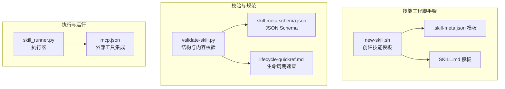
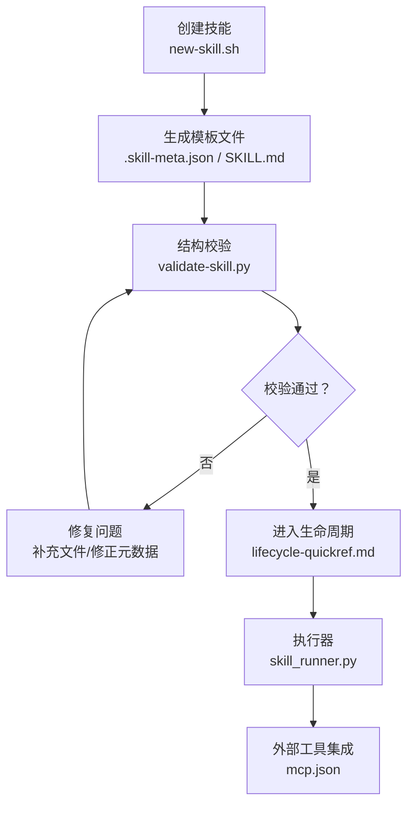
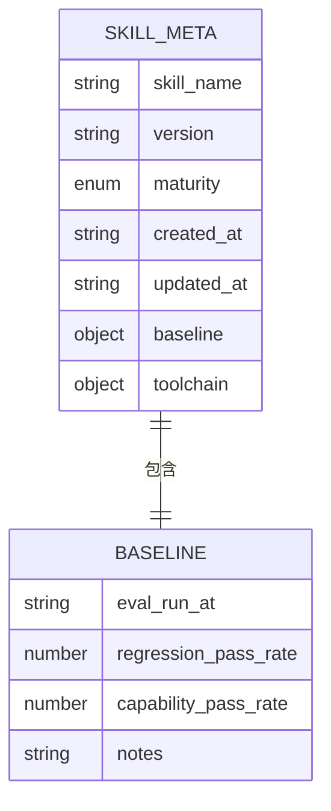
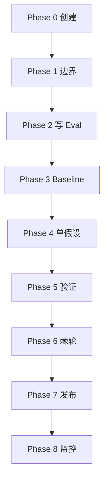
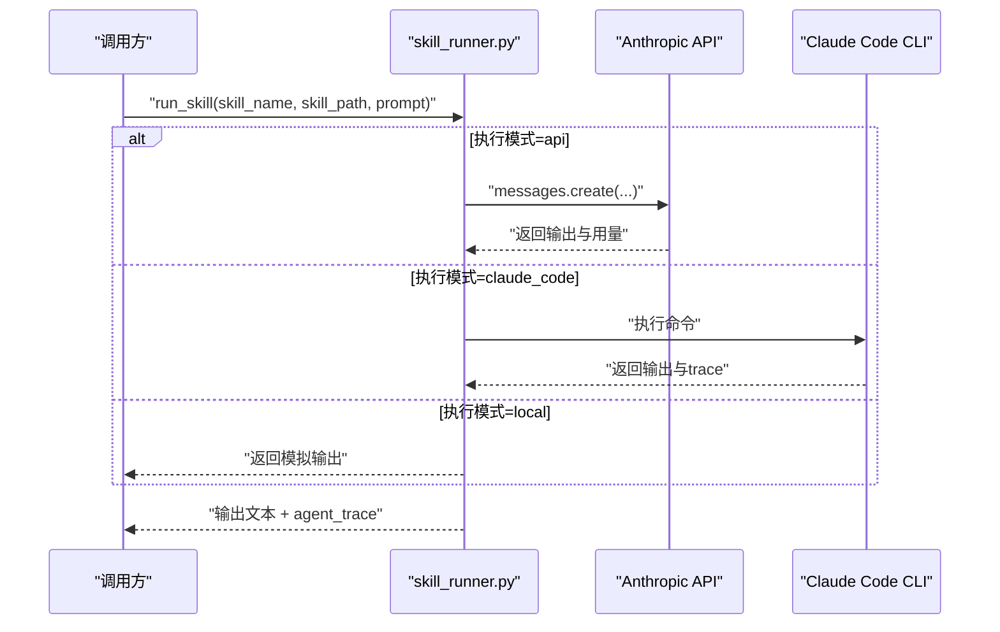
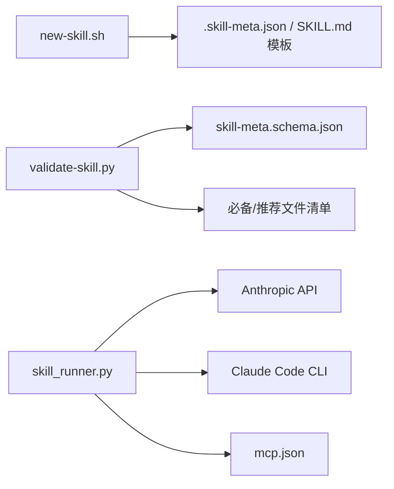

# 技能API

<cite>
**本文引用的文件**   
- [plugins/frontend-team-toolkit/skill-engineering/schemas/skill-meta.schema.json](file://plugins/frontend-team-toolkit/skill-engineering/schemas/skill-meta.schema.json)
- [plugins/frontend-team-toolkit/skill-engineering/docs/lifecycle-quickref.md](file://plugins/frontend-team-toolkit/skill-engineering/docs/lifecycle-quickref.md)
- [plugins/frontend-team-toolkit/skill-engineering/bin/validate-skill.py](file://plugins/frontend-team-toolkit/skill-engineering/bin/validate-skill.py)
- [plugins/frontend-team-toolkit/skill-engineering/bin/new-skill.sh](file://plugins/frontend-team-toolkit/skill-engineering/bin/new-skill.sh)
- [plugins/frontend-team-toolkit/skill-engineering/scripts/skill_runner.py](file://plugins/frontend-team-toolkit/skill-engineering/scripts/skill_runner.py)
- [plugins/frontend-team-toolkit/skill-engineering/templates/new-skill/.skill-meta.json](file://plugins/frontend-team-toolkit/skill-engineering/templates/new-skill/.skill-meta.json)
- [plugins/frontend-team-toolkit/skill-engineering/templates/new-skill/SKILL.md](file://plugins/frontend-team-toolkit/skill-engineering/templates/new-skill/SKILL.md)
- [plugins/frontend-team-toolkit/skill-engineering/README.md](file://plugins/frontend-team-toolkit/skill-engineering/README.md)
- [plugins/frontend-team-toolkit/mcp.json](file://plugins/frontend-team-toolkit/mcp.json)
</cite>

## 目录
1. [简介](#简介)
2. [项目结构](#项目结构)
3. [核心组件](#核心组件)
4. [架构总览](#架构总览)
5. [详细组件分析](#详细组件分析)
6. [依赖分析](#依赖分析)
7. [性能考量](#性能考量)
8. [故障排查指南](#故障排查指南)
9. [结论](#结论)
10. [附录](#附录)

## 简介
本文件系统化梳理“技能API”的设计与实现，面向技能的创建、更新、查询与删除等操作，给出技能元数据结构定义与验证规则、生命周期管理流程、错误处理策略与常见问题解决方案，并重点说明版本管理与向后兼容性考虑。当前代码库以本地脚本与模板为主，未提供统一的REST服务端点；本文在不虚构接口的前提下，基于现有工具链与模板，给出可落地的API设计建议与最佳实践。

## 项目结构
围绕技能工程的核心目录与文件如下：
- 模板与脚手架：用于生成标准化技能目录结构与初始文件
- 校验脚本：对技能目录进行结构与内容校验
- 生命周期文档：定义从草稿到稳定版本的完整流程
- 执行器：支持本地模拟、Anthropic API直连与Claude Code集成三种执行模式
- MCP配置：展示外部工具集成方式（与技能API无直接耦合）

图表来源
- [plugins/frontend-team-toolkit/skill-engineering/bin/new-skill.sh:1-121](file://plugins/frontend-team-toolkit/skill-engineering/bin/new-skill.sh#L1-L121)
- [plugins/frontend-team-toolkit/skill-engineering/templates/new-skill/.skill-meta.json:1-32](file://plugins/frontend-team-toolkit/skill-engineering/templates/new-skill/.skill-meta.json#L1-L32)
- [plugins/frontend-team-toolkit/skill-engineering/templates/new-skill/SKILL.md:1-97](file://plugins/frontend-team-toolkit/skill-engineering/templates/new-skill/SKILL.md#L1-L97)
- [plugins/frontend-team-toolkit/skill-engineering/bin/validate-skill.py:1-193](file://plugins/frontend-team-toolkit/skill-engineering/bin/validate-skill.py#L1-L193)
- [plugins/frontend-team-toolkit/skill-engineering/schemas/skill-meta.schema.json:1-25](file://plugins/frontend-team-toolkit/skill-engineering/schemas/skill-meta.schema.json#L1-L25)
- [plugins/frontend-team-toolkit/skill-engineering/docs/lifecycle-quickref.md:1-32](file://plugins/frontend-team-toolkit/skill-engineering/docs/lifecycle-quickref.md#L1-L32)
- [plugins/frontend-team-toolkit/skill-engineering/scripts/skill_runner.py:1-378](file://plugins/frontend-team-toolkit/skill-engineering/scripts/skill_runner.py#L1-L378)
- [plugins/frontend-team-toolkit/mcp.json:1-26](file://plugins/frontend-team-toolkit/mcp.json#L1-L26)

章节来源
- [plugins/frontend-team-toolkit/skill-engineering/README.md:1-33](file://plugins/frontend-team-toolkit/skill-engineering/README.md#L1-L33)
- [plugins/frontend-team-toolkit/skill-engineering/bin/new-skill.sh:1-121](file://plugins/frontend-team-toolkit/skill-engineering/bin/new-skill.sh#L1-L121)
- [plugins/frontend-team-toolkit/skill-engineering/bin/validate-skill.py:1-193](file://plugins/frontend-team-toolkit/skill-engineering/bin/validate-skill.py#L1-L193)
- [plugins/frontend-team-toolkit/skill-engineering/docs/lifecycle-quickref.md:1-32](file://plugins/frontend-team-toolkit/skill-engineering/docs/lifecycle-quickref.md#L1-L32)
- [plugins/frontend-team-toolkit/skill-engineering/schemas/skill-meta.schema.json:1-25](file://plugins/frontend-team-toolkit/skill-engineering/schemas/skill-meta.schema.json#L1-L25)
- [plugins/frontend-team-toolkit/skill-engineering/scripts/skill_runner.py:1-378](file://plugins/frontend-team-toolkit/skill-engineering/scripts/skill_runner.py#L1-L378)
- [plugins/frontend-team-toolkit/mcp.json:1-26](file://plugins/frontend-team-toolkit/mcp.json#L1-L26)

## 核心组件
- 技能元数据模型：基于JSON Schema定义，约束必填字段与枚举值，确保元数据一致性
- 生命周期规范：定义从创建、边界、写Eval、Baseline、单假设、验证、棘轮、发布、监控的完整流程
- 结构校验脚本：对技能目录进行强制性与推荐性检查，保障工业级质量门槛
- 执行器：支持本地模拟、Anthropic API直连与Claude Code集成，便于离线与在线执行
- 模板与脚手架：提供标准化的技能目录结构与初始文件，降低心智负担

章节来源
- [plugins/frontend-team-toolkit/skill-engineering/schemas/skill-meta.schema.json:1-25](file://plugins/frontend-team-toolkit/skill-engineering/schemas/skill-meta.schema.json#L1-L25)
- [plugins/frontend-team-toolkit/skill-engineering/docs/lifecycle-quickref.md:1-32](file://plugins/frontend-team-toolkit/skill-engineering/docs/lifecycle-quickref.md#L1-L32)
- [plugins/frontend-team-toolkit/skill-engineering/bin/validate-skill.py:1-193](file://plugins/frontend-team-toolkit/skill-engineering/bin/validate-skill.py#L1-L193)
- [plugins/frontend-team-toolkit/skill-engineering/scripts/skill_runner.py:1-378](file://plugins/frontend-team-toolkit/skill-engineering/scripts/skill_runner.py#L1-L378)
- [plugins/frontend-team-toolkit/skill-engineering/bin/new-skill.sh:1-121](file://plugins/frontend-team-toolkit/skill-engineering/bin/new-skill.sh#L1-L121)

## 架构总览
下图展示了技能从创建到执行的关键路径，以及与校验、生命周期、模板的关系：

图表来源
- [plugins/frontend-team-toolkit/skill-engineering/bin/new-skill.sh:1-121](file://plugins/frontend-team-toolkit/skill-engineering/bin/new-skill.sh#L1-L121)
- [plugins/frontend-team-toolkit/skill-engineering/bin/validate-skill.py:1-193](file://plugins/frontend-team-toolkit/skill-engineering/bin/validate-skill.py#L1-L193)
- [plugins/frontend-team-toolkit/skill-engineering/docs/lifecycle-quickref.md:1-32](file://plugins/frontend-team-toolkit/skill-engineering/docs/lifecycle-quickref.md#L1-L32)
- [plugins/frontend-team-toolkit/skill-engineering/scripts/skill_runner.py:1-378](file://plugins/frontend-team-toolkit/skill-engineering/scripts/skill_runner.py#L1-L378)
- [plugins/frontend-team-toolkit/mcp.json:1-26](file://plugins/frontend-team-toolkit/mcp.json#L1-L26)

## 详细组件分析

### 技能元数据结构与验证规则
- 元数据模型定义于JSON Schema，包含必填字段与枚举值，确保跨模块一致性
- 关键字段
  - skill_name：字符串，技能名称，与目录名一致
  - version：字符串，语义化版本号
  - maturity：枚举，取值为 draft、beta、stable、deprecated
  - created_at/updated_at：字符串，时间戳
  - baseline：对象，包含回归/能力评估指标与备注
  - toolchain：对象，记录工具链信息
- 验证规则
  - 目录名必须为kebab-case
  - 必备文件齐全（如SKILL.md、CHANGELOG.md、.skill-meta.json、evals/evals.json、test-prompts.json、references/output-contract.md）
  - frontmatter校验：name与description长度与格式限制、禁止特定字符、建议包含触发短语
  - .skill-meta.json中的skill_name需与目录名一致
  - evals与test-prompts的JSON结构与类型校验

图表来源
- [plugins/frontend-team-toolkit/skill-engineering/schemas/skill-meta.schema.json:1-25](file://plugins/frontend-team-toolkit/skill-engineering/schemas/skill-meta.schema.json#L1-L25)
- [plugins/frontend-team-toolkit/skill-engineering/bin/validate-skill.py:134-167](file://plugins/frontend-team-toolkit/skill-engineering/bin/validate-skill.py#L134-L167)
- [plugins/frontend-team-toolkit/skill-engineering/templates/new-skill/.skill-meta.json:1-32](file://plugins/frontend-team-toolkit/skill-engineering/templates/new-skill/.skill-meta.json#L1-L32)

章节来源
- [plugins/frontend-team-toolkit/skill-engineering/schemas/skill-meta.schema.json:1-25](file://plugins/frontend-team-toolkit/skill-engineering/schemas/skill-meta.schema.json#L1-L25)
- [plugins/frontend-team-toolkit/skill-engineering/bin/validate-skill.py:83-167](file://plugins/frontend-team-toolkit/skill-engineering/bin/validate-skill.py#L83-L167)
- [plugins/frontend-team-toolkit/skill-engineering/templates/new-skill/.skill-meta.json:1-32](file://plugins/frontend-team-toolkit/skill-engineering/templates/new-skill/.skill-meta.json#L1-L32)

### 技能生命周期管理
- 生命周期阶段（8 Phase）
  - 0 创建：new-skill.sh生成标准目录
  - 1 边界：访谈与输出契约，形成references/output-contract.md
  - 2 写Eval：≥3个用例，先评估再修改技能，生成evals/evals.json
  - 3 Baseline：干跑/基准，写入results.tsv首行
  - 4 单假设：每次只改触发/步骤/模板之一
  - 5 验证：Spot→Targeted→Regression，追加results.tsv
  - 6 棘轮：通过则保留，否则回滚或版本号提升
  - 7 发布：更新CHANGELOG与元数据，生成CHANGELOG.md
  - 8 监控：真实任务问题收集，生成skill-issues.jsonl
- 发布门禁（最小）
  - validate-skill.py通过
  - Regression评估无退步
  - CHANGELOG已写动机与风险
  - .skill-meta.json的baseline已更新

图表来源
- [plugins/frontend-team-toolkit/skill-engineering/docs/lifecycle-quickref.md:5-15](file://plugins/frontend-team-toolkit/skill-engineering/docs/lifecycle-quickref.md#L5-L15)

章节来源
- [plugins/frontend-team-toolkit/skill-engineering/docs/lifecycle-quickref.md:1-32](file://plugins/frontend-team-toolkit/skill-engineering/docs/lifecycle-quickref.md#L1-L32)

### 结构校验与模板
- 模板文件
  - .skill-meta.json：包含默认版本、成熟度、baseline、workflows、toolchain等
  - SKILL.md：包含frontmatter（name、description、license、disable-model-invocation、metadata等）
- 校验要点
  - 目录名格式与存在性
  - 必备/推荐文件清单
  - frontmatter键值合法性与长度限制
  - evals与test-prompts的结构与类型
  - .skill-meta.json与目录名一致性

章节来源
- [plugins/frontend-team-toolkit/skill-engineering/bin/new-skill.sh:92-121](file://plugins/frontend-team-toolkit/skill-engineering/bin/new-skill.sh#L92-L121)
- [plugins/frontend-team-toolkit/skill-engineering/templates/new-skill/.skill-meta.json:1-32](file://plugins/frontend-team-toolkit/skill-engineering/templates/new-skill/.skill-meta.json#L1-L32)
- [plugins/frontend-team-toolkit/skill-engineering/templates/new-skill/SKILL.md:1-11](file://plugins/frontend-team-toolkit/skill-engineering/templates/new-skill/SKILL.md#L1-L11)
- [plugins/frontend-team-toolkit/skill-engineering/bin/validate-skill.py:83-167](file://plugins/frontend-team-toolkit/skill-engineering/bin/validate-skill.py#L83-L167)

### 执行器与外部集成
- 执行模式
  - local：本地模拟，便于测试与离线验证
  - api：Anthropic API直连，需设置API密钥
  - claude_code：调用Claude Code CLI，需安装并配置
- 上下文构建：从SKILL.md、output-contract、scoring-rubric等文件构建执行上下文
- 错误处理：依赖缺失、超时、导入失败等均有降级与告警策略

图表来源
- [plugins/frontend-team-toolkit/skill-engineering/scripts/skill_runner.py:308-326](file://plugins/frontend-team-toolkit/skill-engineering/scripts/skill_runner.py#L308-L326)
- [plugins/frontend-team-toolkit/skill-engineering/scripts/skill_runner.py:199-257](file://plugins/frontend-team-toolkit/skill-engineering/scripts/skill_runner.py#L199-L257)
- [plugins/frontend-team-toolkit/skill-engineering/scripts/skill_runner.py:260-306](file://plugins/frontend-team-toolkit/skill-engineering/scripts/skill_runner.py#L260-L306)

章节来源
- [plugins/frontend-team-toolkit/skill-engineering/scripts/skill_runner.py:1-378](file://plugins/frontend-team-toolkit/skill-engineering/scripts/skill_runner.py#L1-L378)
- [plugins/frontend-team-toolkit/mcp.json:1-26](file://plugins/frontend-team-toolkit/mcp.json#L1-L26)

### 版本管理与向后兼容性
- 版本号：采用语义化版本（语义由元数据字段version承载）
- 成熟度：draft→beta→stable→deprecated，作为发布与弃用的信号
- 棘轮机制：通过回归评估决定是否回滚或提升版本
- 兼容性建议
  - 保持输出契约稳定
  - 评估用例覆盖关键路径与边界条件
  - 变更遵循“单假设”原则，避免多处同时改动
  - 发布前更新CHANGELOG与baseline指标

章节来源
- [plugins/frontend-team-toolkit/skill-engineering/docs/lifecycle-quickref.md:17-22](file://plugins/frontend-team-toolkit/skill-engineering/docs/lifecycle-quickref.md#L17-L22)
- [plugins/frontend-team-toolkit/skill-engineering/schemas/skill-meta.schema.json:10-10](file://plugins/frontend-team-toolkit/skill-engineering/schemas/skill-meta.schema.json#L10-L10)
- [plugins/frontend-team-toolkit/skill-engineering/templates/new-skill/.skill-meta.json:3-4](file://plugins/frontend-team-toolkit/skill-engineering/templates/new-skill/.skill-meta.json#L3-L4)

## 依赖分析
- 组件内聚与耦合
  - new-skill.sh与模板高度耦合，负责生成标准化目录
  - validate-skill.py依赖JSON Schema与文件清单，耦合度中等
  - skill_runner.py依赖外部工具（API/CLI），通过环境变量解耦
- 外部依赖
  - Anthropic SDK（可选）
  - Claude Code CLI（可选）
  - MCP服务器（可选）

图表来源
- [plugins/frontend-team-toolkit/skill-engineering/bin/new-skill.sh:92-121](file://plugins/frontend-team-toolkit/skill-engineering/bin/new-skill.sh#L92-L121)
- [plugins/frontend-team-toolkit/skill-engineering/bin/validate-skill.py:26-39](file://plugins/frontend-team-toolkit/skill-engineering/bin/validate-skill.py#L26-L39)
- [plugins/frontend-team-toolkit/skill-engineering/schemas/skill-meta.schema.json:1-25](file://plugins/frontend-team-toolkit/skill-engineering/schemas/skill-meta.schema.json#L1-L25)
- [plugins/frontend-team-toolkit/skill-engineering/scripts/skill_runner.py:25-29](file://plugins/frontend-team-toolkit/skill-engineering/scripts/skill_runner.py#L25-L29)
- [plugins/frontend-team-toolkit/mcp.json:1-26](file://plugins/frontend-team-toolkit/mcp.json#L1-L26)

章节来源
- [plugins/frontend-team-toolkit/skill-engineering/bin/validate-skill.py:1-193](file://plugins/frontend-team-toolkit/skill-engineering/bin/validate-skill.py#L1-L193)
- [plugins/frontend-team-toolkit/skill-engineering/scripts/skill_runner.py:1-378](file://plugins/frontend-team-toolkit/skill-engineering/scripts/skill_runner.py#L1-L378)

## 性能考量
- 执行模式选择
  - local：零网络开销，适合快速迭代与离线测试
  - api：网络延迟与Token用量，建议批量或合并请求
  - claude_code：本地CLI，受系统资源与超时限制
- 上下文构建
  - 将SKILL.md、output-contract、scoring-rubric拼接为上下文，注意文件大小与编码
- 超时与重试
  - CLI执行设置超时，API调用建议指数退避与熔断

## 故障排查指南
- 目录结构问题
  - 目录名不符合kebab-case或不存在
  - 缺少必备文件（SKILL.md、CHANGELOG.md、.skill-meta.json、evals/evals.json、test-prompts.json、references/output-contract.md）
- frontmatter与元数据
  - name与description长度或格式不符
  - .skill-meta.json中的skill_name与目录名不一致
- 评估与提示
  - evals/evals.json缺少id或prompt字段
  - test-prompts.json不是数组或为空
- 执行失败
  - API密钥未配置或SDK未安装：自动降级至local模式
  - Claude Code未安装或不可执行：自动降级至local模式
  - 超时或异常：捕获并返回错误信息

章节来源
- [plugins/frontend-team-toolkit/skill-engineering/bin/validate-skill.py:83-167](file://plugins/frontend-team-toolkit/skill-engineering/bin/validate-skill.py#L83-L167)
- [plugins/frontend-team-toolkit/skill-engineering/scripts/skill_runner.py:205-257](file://plugins/frontend-team-toolkit/skill-engineering/scripts/skill_runner.py#L205-L257)
- [plugins/frontend-team-toolkit/skill-engineering/scripts/skill_runner.py:298-305](file://plugins/frontend-team-toolkit/skill-engineering/scripts/skill_runner.py#L298-L305)

## 结论
本仓库以脚手架、模板与校验为核心，提供了标准化的技能工程能力与生命周期规范。虽然未提供统一的REST API，但通过本地执行器与外部工具集成，已具备完整的技能开发、评估与上线能力。建议在此基础上扩展REST服务端点，以支持技能的统一创建、更新、查询与删除，并将校验与生命周期流程纳入API层，实现端到端的技能API体系。

## 附录

### 技能API设计建议（概念性）
- HTTP方法与URL模式
  - 创建技能：POST /api/v1/skills
  - 查询技能：GET /api/v1/skills/{skill_name}
  - 更新技能：PUT /api/v1/skills/{skill_name}
  - 删除技能：DELETE /api/v1/skills/{skill_name}
- 请求/响应模式
  - 请求体：包含技能元数据（skill_name、version、maturity等）与上下文文件（SKILL.md、evals/evals.json等）
  - 响应体：返回技能状态、版本、基线指标与变更历史
- 认证方法
  - 建议使用Bearer Token或企业SSO，结合RBAC控制访问
- 生命周期集成
  - 创建后自动触发validate-skill.py
  - 发布前校验回归评估与CHANGELOG
- 版本与兼容
  - 严格遵循语义化版本，发布前更新baseline
  - 提供向后兼容的评估用例与输出契约

[本节为概念性说明，不直接对应具体源码文件]