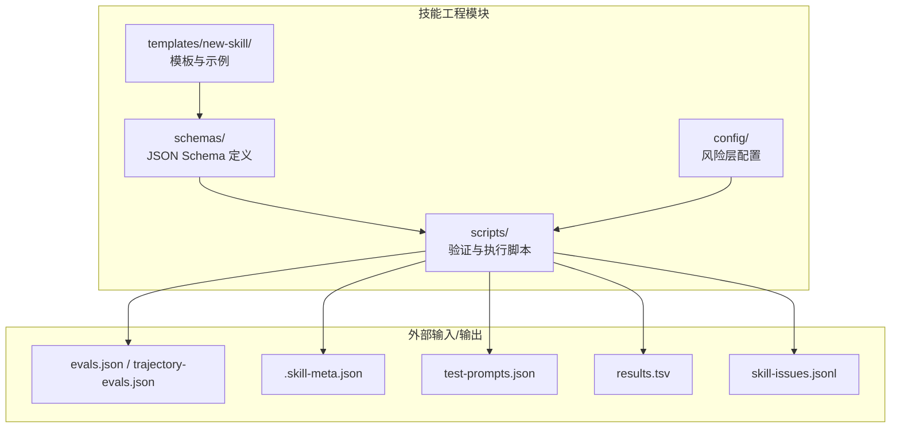
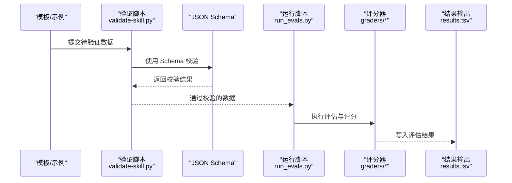
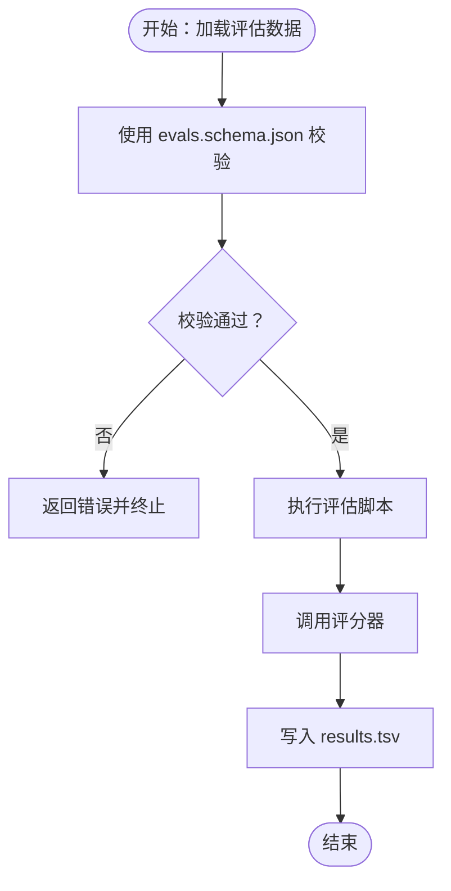
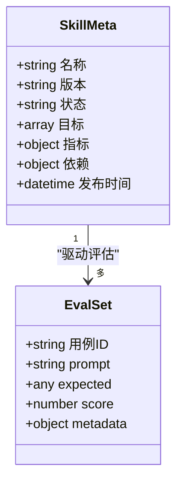
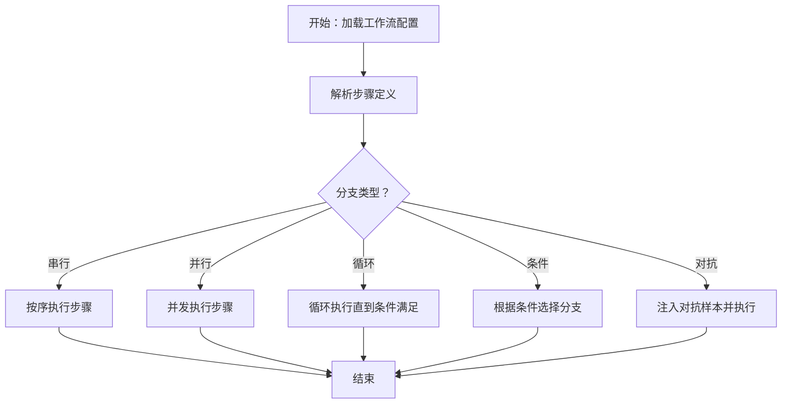
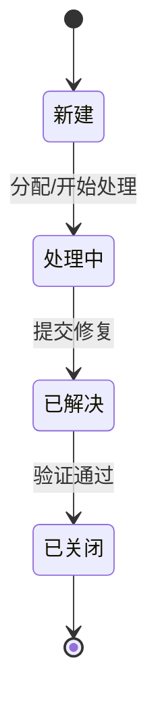
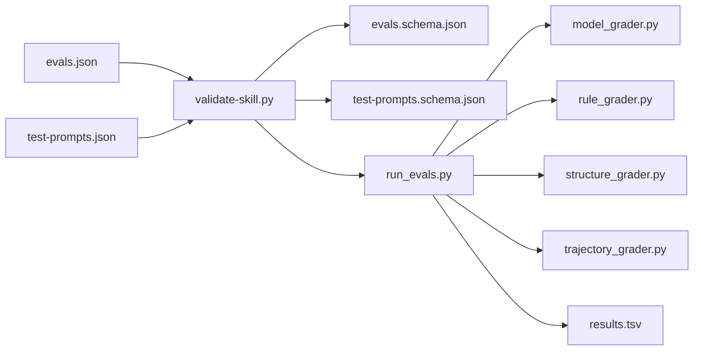
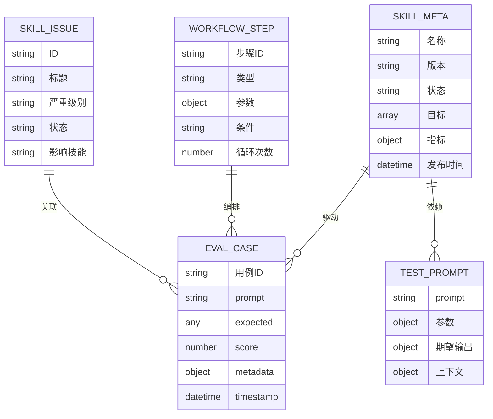

# 数据模型

<cite>
**本文引用的文件**
- [evals.schema.json](file://plugins/frontend-team-toolkit/skill-engineering/schemas/evals.schema.json)
- [skill-issue.schema.json](file://plugins/frontend-team-toolkit/skill-engineering/schemas/skill-issue.schema.json)
- [skill-meta.schema.json](file://plugins/frontend-team-toolkit/skill-engineering/schemas/skill-meta.schema.json)
- [test-prompts.schema.json](file://plugins/frontend-team-toolkit/skill-engineering/schemas/test-prompts.schema.json)
- [workflow.schema.json](file://plugins/frontend-team-toolkit/skill-engineering/schemas/workflow.schema.json)
- [run_evals.py](file://plugins/frontend-team-toolkit/skill-engineering/scripts/run_evals.py)
- [check_new_evals.py](file://plugins/frontend-team-toolkit/skill-engineering/scripts/check_new_evals.py)
- [check_regression.py](file://plugins/frontend-team-toolkit/skill-engineering/scripts/check_regression.py)
- [model_grader.py](file://plugins/frontend-team-toolkit/skill-engineering/scripts/graders/model_grader.py)
- [rule_grader.py](file://plugins/frontend-team-toolkit/skill-engineering/scripts/graders/rule_grader.py)
- [structure_grader.py](file://plugins/frontend-team-toolkit/skill-engineering/scripts/graders/structure_grader.py)
- [trajectory_grader.py](file://plugins/frontend-team-toolkit/skill-engineering/scripts/graders/trajectory_grader.py)
- [validate-skill.py](file://plugins/frontend-team-toolkit/skill-engineering/bin/validate-skill.py)
- [new-skill.sh](file://plugins/frontend-team-toolkit/skill-engineering/bin/new-skill.sh)
- [evals.json](file://plugins/frontend-team-toolkit/skill-engineering/templates/new-skill/evals/evals.json)
- [trajectory-evals.json](file://plugins/frontend-team-toolkit/skill-engineering/templates/new-skill/evals/trajectory-evals.json)
- [adversarial-workflow.js](file://plugins/frontend-team-toolkit/skill-engineering/templates/new-skill/workflows/adversarial-workflow.js)
- [conditional-workflow.js](file://plugins/frontend-team-toolkit/skill-engineering/templates/new-skill/workflows/conditional-workflow.js)
- [loop-workflow.js](file://plugins/frontend-team-toolkit/skill-engineering/templates/new-skill/workflows/loop-workflow.js)
- [parallel-workflow.js](file://plugins/frontend-team-toolkit/skill-engineering/templates/new-skill/workflows/parallel-workflow.js)
- [serial-workflow.js](file://plugins/frontend-team-toolkit/skill-engineering/templates/new-skill/workflows/serial-workflow.js)
- [weekly-regression.js](file://plugins/frontend-team-toolkit/skill-engineering/templates/new-skill/workflows/weekly-regression.js)
- [SKILL.md](file://plugins/frontend-team-toolkit/skill-engineering/templates/new-skill/SKILL.md)
- [.skill-meta.json](file://plugins/frontend-team-toolkit/skill-engineering/templates/new-skill/.skill-meta.json)
- [results.tsv](file://plugins/frontend-team-toolkit/skill-engineering/templates/new-skill/results.tsv)
- [skill-issues.jsonl.example](file://plugins/frontend-team-toolkit/skill-engineering/templates/new-skill/skill-issues.jsonl.example)
- [test-prompts.json](file://plugins/frontend-team-toolkit/skill-engineering/templates/new-skill/test-prompts.json)
- [output-contract.md](file://plugins/frontend-team-toolkit/skill-engineering/templates/new-skill/references/output-contract.md)
- [risk-layer-config.json](file://plugins/frontend-team-toolkit/skill-engineering/config/risk-layer-config.json)
</cite>

## 目录
1. [简介](#简介)
2. [项目结构](#项目结构)
3. [核心组件](#核心组件)
4. [架构总览](#架构总览)
5. [详细组件分析](#详细组件分析)
6. [依赖分析](#依赖分析)
7. [性能考虑](#性能考虑)
8. [故障排除指南](#故障排除指南)
9. [结论](#结论)
10. [附录](#附录)

## 简介
本文件系统性梳理前端团队市场项目中的数据模型与验证机制，重点覆盖以下方面：
- JSON Schema 定义与验证流程：对评估数据、技能元数据、问题记录、测试提示、工作流配置进行结构化约束与校验。
- 核心数据模型：技能元数据、评估结果、工作流配置、问题与提示等实体的字段定义、约束与业务规则。
- 实体关系图（ERD）与数据流图：展示各模型之间的关联关系及典型数据处理流程。
- 版本管理与迁移策略：Schema 进化、向后兼容与迁移建议。
- 最佳实践与性能优化：Schema 设计、验证性能、缓存与批处理策略。
- 数据安全与隐私：敏感字段标记、最小暴露原则与合规要求。

## 项目结构
该项目围绕“技能工程”插件构建，数据模型主要位于 schemas 目录，并通过 Python 脚本与 JavaScript 模板完成数据生成、验证与执行。

**图表来源**
- [evals.schema.json:1-200](file://plugins/frontend-team-toolkit/skill-engineering/schemas/evals.schema.json#L1-L200)
- [skill-meta.schema.json:1-200](file://plugins/frontend-team-toolkit/skill-engineering/schemas/skill-meta.schema.json#L1-L200)
- [workflow.schema.json:1-200](file://plugins/frontend-team-toolkit/skill-engineering/schemas/workflow.schema.json#L1-L200)
- [run_evals.py:1-200](file://plugins/frontend-team-toolkit/skill-engineering/scripts/run_evals.py#L1-L200)

**章节来源**
- [evals.schema.json:1-200](file://plugins/frontend-team-toolkit/skill-engineering/schemas/evals.schema.json#L1-L200)
- [skill-meta.schema.json:1-200](file://plugins/frontend-team-toolkit/skill-engineering/schemas/skill-meta.schema.json#L1-L200)
- [workflow.schema.json:1-200](file://plugins/frontend-team-toolkit/skill-engineering/schemas/workflow.schema.json#L1-L200)
- [run_evals.py:1-200](file://plugins/frontend-team-toolkit/skill-engineering/scripts/run_evals.py#L1-L200)

## 核心组件
本节概述五类核心数据模型及其职责：
- 评估数据模型（evals.schema.json）：描述评估用例、输入输出、评分与轨迹信息。
- 技能元数据模型（skill-meta.schema.json）：描述技能的生命周期、目标、指标与配置。
- 工作流配置模型（workflow.schema.json）：描述自动化执行流程（串行、并行、循环、条件、对抗）。
- 问题记录模型（skill-issue.schema.json）：描述技能开发过程中的问题条目与状态。
- 测试提示模型（test-prompts.schema.json）：描述用于测试的提示词集合与期望输出。

每类模型均通过 JSON Schema 提供强类型约束、必填字段、枚举值与格式校验，确保数据一致性与可验证性。

**章节来源**
- [evals.schema.json:1-200](file://plugins/frontend-team-toolkit/skill-engineering/schemas/evals.schema.json#L1-L200)
- [skill-meta.schema.json:1-200](file://plugins/frontend-team-toolkit/skill-engineering/schemas/skill-meta.schema.json#L1-L200)
- [workflow.schema.json:1-200](file://plugins/frontend-team-toolkit/skill-engineering/schemas/workflow.schema.json#L1-L200)
- [skill-issue.schema.json:1-200](file://plugins/frontend-team-toolkit/skill-engineering/schemas/skill-issue.schema.json#L1-L200)
- [test-prompts.schema.json:1-200](file://plugins/frontend-team-toolkit/skill-engineering/schemas/test-prompts.schema.json#L1-L200)

## 架构总览
下图展示从模板到执行再到结果输出的完整数据流，以及 Schema 驱动的验证环节。

**图表来源**
- [validate-skill.py:1-200](file://plugins/frontend-team-toolkit/skill-engineering/bin/validate-skill.py#L1-L200)
- [evals.schema.json:1-200](file://plugins/frontend-team-toolkit/skill-engineering/schemas/evals.schema.json#L1-L200)
- [run_evals.py:1-200](file://plugins/frontend-team-toolkit/skill-engineering/scripts/run_evals.py#L1-L200)
- [model_grader.py:1-200](file://plugins/frontend-team-toolkit/skill-engineering/scripts/graders/model_grader.py#L1-L200)
- [results.tsv:1-200](file://plugins/frontend-team-toolkit/skill-engineering/templates/new-skill/results.tsv#L1-L200)

## 详细组件分析

### 评估数据模型（evals.schema.json）
- 主要用途：定义评估用例的输入、期望输出、评分维度与轨迹信息。
- 关键字段族：
  - 用例标识：唯一 ID、标签、难度等级
  - 输入输出：prompt、input、expected、actual、score
  - 轨迹与上下文：trace、metadata、timestamp
- 约束与规则：
  - 必填字段：用例 ID、prompt、expected
  - 类型约束：score 为数值范围校验；timestamp 采用标准时间格式
  - 互斥/组合：根据评分器需求，某些字段需成对出现或互斥
- 典型流程：模板生成 -> Schema 校验 -> 执行评估 -> 写入 results.tsv

**图表来源**
- [evals.schema.json:1-200](file://plugins/frontend-team-toolkit/skill-engineering/schemas/evals.schema.json#L1-L200)
- [run_evals.py:1-200](file://plugins/frontend-team-toolkit/skill-engineering/scripts/run_evals.py#L1-L200)
- [results.tsv:1-200](file://plugins/frontend-team-toolkit/skill-engineering/templates/new-skill/results.tsv#L1-L200)

**章节来源**
- [evals.schema.json:1-200](file://plugins/frontend-team-toolkit/skill-engineering/schemas/evals.schema.json#L1-L200)
- [evals.json:1-200](file://plugins/frontend-team-toolkit/skill-engineering/templates/new-skill/evals/evals.json#L1-L200)
- [trajectory-evals.json:1-200](file://plugins/frontend-team-toolkit/skill-engineering/templates/new-skill/evals/trajectory-evals.json#L1-L200)
- [run_evals.py:1-200](file://plugins/frontend-team-toolkit/skill-engineering/scripts/run_evals.py#L1-L200)

### 技能元数据模型（skill-meta.schema.json）
- 主要用途：描述技能的元信息、目标、关键指标与生命周期状态。
- 关键字段族：
  - 基本信息：名称、描述、版本、作者
  - 目标与指标：目标列表、KPI、阈值
  - 生命周期：状态（草稿/发布/归档）、发布时间、更新日志
  - 依赖与配置：依赖技能、环境变量、默认参数
- 约束与规则：
  - 版本号遵循语义化版本规范
  - 状态枚举受控，禁止非法跳转
  - KPI 字段与评估指标保持一致
- 与评估数据的关系：元数据驱动评估计划与结果解读。

**图表来源**
- [skill-meta.schema.json:1-200](file://plugins/frontend-team-toolkit/skill-engineering/schemas/skill-meta.schema.json#L1-L200)
- [evals.schema.json:1-200](file://plugins/frontend-team-toolkit/skill-engineering/schemas/evals.schema.json#L1-L200)

**章节来源**
- [skill-meta.schema.json:1-200](file://plugins/frontend-team-toolkit/skill-engineering/schemas/skill-meta.schema.json#L1-L200)
- [.skill-meta.json:1-200](file://plugins/frontend-team-toolkit/skill-engineering/templates/new-skill/.skill-meta.json#L1-L200)

### 工作流配置模型（workflow.schema.json）
- 主要用途：描述自动化执行流程，支持串行、并行、循环、条件与对抗式工作流。
- 关键字段族：
  - 步骤定义：步骤 ID、类型（串行/并行/循环/条件/对抗）、参数
  - 条件表达式：基于评估结果或指标的分支逻辑
  - 循环控制：最大迭代次数、退出条件
  - 对抗设置：对抗样本生成与注入策略
- 约束与规则：
  - 步骤 ID 唯一且可引用
  - 条件表达式必须可解析
  - 循环与对抗需有明确的终止条件
- 与评估数据的关系：工作流编排评估执行顺序与并发策略。

**图表来源**
- [workflow.schema.json:1-200](file://plugins/frontend-team-toolkit/skill-engineering/schemas/workflow.schema.json#L1-L200)
- [serial-workflow.js:1-200](file://plugins/frontend-team-toolkit/skill-engineering/templates/new-skill/workflows/serial-workflow.js#L1-L200)
- [parallel-workflow.js:1-200](file://plugins/frontend-team-toolkit/skill-engineering/templates/new-skill/workflows/parallel-workflow.js#L1-L200)
- [loop-workflow.js:1-200](file://plugins/frontend-team-toolkit/skill-engineering/templates/new-skill/workflows/loop-workflow.js#L1-L200)
- [conditional-workflow.js:1-200](file://plugins/frontend-team-toolkit/skill-engineering/templates/new-skill/workflows/conditional-workflow.js#L1-L200)
- [adversarial-workflow.js:1-200](file://plugins/frontend-team-toolkit/skill-engineering/templates/new-skill/workflows/adversarial-workflow.js#L1-L200)
- [weekly-regression.js:1-200](file://plugins/frontend-team-toolkit/skill-engineering/templates/new-skill/workflows/weekly-regression.js#L1-L200)

**章节来源**
- [workflow.schema.json:1-200](file://plugins/frontend-team-toolkit/skill-engineering/schemas/workflow.schema.json#L1-L200)
- [serial-workflow.js:1-200](file://plugins/frontend-team-toolkit/skill-engineering/templates/new-skill/workflows/serial-workflow.js#L1-L200)
- [parallel-workflow.js:1-200](file://plugins/frontend-team-toolkit/skill-engineering/templates/new-skill/workflows/parallel-workflow.js#L1-L200)
- [loop-workflow.js:1-200](file://plugins/frontend-team-toolkit/skill-engineering/templates/new-skill/workflows/loop-workflow.js#L1-L200)
- [conditional-workflow.js:1-200](file://plugins/frontend-team-toolkit/skill-engineering/templates/new-skill/workflows/conditional-workflow.js#L1-L200)
- [adversarial-workflow.js:1-200](file://plugins/frontend-team-toolkit/skill-engineering/templates/new-skill/workflows/adversarial-workflow.js#L1-L200)
- [weekly-regression.js:1-200](file://plugins/frontend-team-toolkit/skill-engineering/templates/new-skill/workflows/weekly-regression.js#L1-L200)

### 问题记录模型（skill-issue.schema.json）
- 主要用途：记录技能开发过程中的问题条目，便于追踪与回归。
- 关键字段族：
  - 问题标识：ID、标题、严重级别
  - 状态流转：新建/处理中/已解决/已关闭
  - 关联信息：影响的技能、评估用例、修复方案
- 约束与规则：
  - 状态机受控，禁止非法跳转
  - 关联字段需指向有效实体
- 与评估数据的关系：问题驱动回归测试与修复验证。

**图表来源**
- [skill-issue.schema.json:1-200](file://plugins/frontend-team-toolkit/skill-engineering/schemas/skill-issue.schema.json#L1-L200)
- [skill-issues.jsonl.example:1-200](file://plugins/frontend-team-toolkit/skill-engineering/templates/new-skill/skill-issues.jsonl.example#L1-L200)

**章节来源**
- [skill-issue.schema.json:1-200](file://plugins/frontend-team-toolkit/skill-engineering/schemas/skill-issue.schema.json#L1-L200)
- [skill-issues.jsonl.example:1-200](file://plugins/frontend-team-toolkit/skill-engineering/templates/new-skill/skill-issues.jsonl.example#L1-L200)

### 测试提示模型（test-prompts.schema.json）
- 主要用途：描述测试用的提示词集合与期望输出，支撑一致性与回归验证。
- 关键字段族：
  - 提示词：prompt 文本、参数占位符
  - 期望输出：expected 结构、评分维度
  - 上下文：context、metadata
- 约束与规则：
  - 参数占位符与实际传入需匹配
  - 期望输出结构需与评估模型一致
- 与评估数据的关系：测试提示作为评估输入的标准化来源。

**章节来源**
- [test-prompts.schema.json:1-200](file://plugins/frontend-team-toolkit/skill-engineering/schemas/test-prompts.schema.json#L1-L200)
- [test-prompts.json:1-200](file://plugins/frontend-team-toolkit/skill-engineering/templates/new-skill/test-prompts.json#L1-L200)

## 依赖分析
- 模板到 Schema：模板文件（如 evals.json、test-prompts.json）遵循对应 Schema 的约束。
- 执行脚本到 Schema：验证脚本在执行前对数据进行 Schema 校验。
- 评分器到评估数据：评分器依赖评估数据的结构与字段完整性。
- 工作流到评估数据：工作流配置决定评估执行顺序与并发策略。

**图表来源**
- [validate-skill.py:1-200](file://plugins/frontend-team-toolkit/skill-engineering/bin/validate-skill.py#L1-L200)
- [evals.schema.json:1-200](file://plugins/frontend-team-toolkit/skill-engineering/schemas/evals.schema.json#L1-L200)
- [test-prompts.schema.json:1-200](file://plugins/frontend-team-toolkit/skill-engineering/schemas/test-prompts.schema.json#L1-L200)
- [run_evals.py:1-200](file://plugins/frontend-team-toolkit/skill-engineering/scripts/run_evals.py#L1-L200)
- [model_grader.py:1-200](file://plugins/frontend-team-toolkit/skill-engineering/scripts/graders/model_grader.py#L1-L200)
- [results.tsv:1-200](file://plugins/frontend-team-toolkit/skill-engineering/templates/new-skill/results.tsv#L1-L200)

**章节来源**
- [validate-skill.py:1-200](file://plugins/frontend-team-toolkit/skill-engineering/bin/validate-skill.py#L1-L200)
- [run_evals.py:1-200](file://plugins/frontend-team-toolkit/skill-engineering/scripts/run_evals.py#L1-L200)
- [model_grader.py:1-200](file://plugins/frontend-team-toolkit/skill-engineering/scripts/graders/model_grader.py#L1-L200)

## 性能考虑
- Schema 校验性能：
  - 将大型数据集分批校验，避免一次性加载导致内存峰值过高。
  - 缓存已通过的校验结果，减少重复校验开销。
- 评估执行性能：
  - 并行执行独立评估用例，充分利用 CPU/GPU 资源。
  - 对耗时评分器（如模型评分器）启用异步队列与结果缓存。
- 输出写入性能：
  - 使用流式写入 results.tsv，避免大文件内存占用。
- 缓存与索引：
  - 对频繁访问的提示词与元数据建立本地缓存，降低 I/O 延迟。

[本节为通用性能建议，不直接分析具体文件]

## 故障排除指南
- Schema 校验失败：
  - 检查必填字段是否缺失、类型是否匹配、枚举值是否合法。
  - 参考对应 Schema 的字段注释与示例文件定位问题。
- 评估执行异常：
  - 查看评分器日志，确认输入格式与评分器依赖是否满足。
  - 检查工作流配置的步骤 ID 引用与条件表达式。
- 结果输出异常：
  - 确认写入权限与磁盘空间，检查结果文件编码与分隔符。
- 回归与问题追踪：
  - 使用 skill-issues.jsonl 记录问题并关联相关评估用例，便于回溯。

**章节来源**
- [check_new_evals.py:1-200](file://plugins/frontend-team-toolkit/skill-engineering/scripts/check_new_evals.py#L1-L200)
- [check_regression.py:1-200](file://plugins/frontend-team-toolkit/skill-engineering/scripts/check_regression.py#L1-L200)
- [skill-issues.jsonl.example:1-200](file://plugins/frontend-team-toolkit/skill-engineering/templates/new-skill/skill-issues.jsonl.example#L1-L200)

## 结论
本项目以 JSON Schema 为核心，构建了从模板到执行再到结果输出的闭环数据模型体系。通过严格的字段约束、状态机与流程编排，确保评估数据的一致性与可验证性。建议在实践中持续完善 Schema 的演进策略与性能优化方案，以支撑更大规模的技能工程实践。

[本节为总结性内容，不直接分析具体文件]

## 附录

### 实体关系图（ERD）

**图表来源**
- [skill-meta.schema.json:1-200](file://plugins/frontend-team-toolkit/skill-engineering/schemas/skill-meta.schema.json#L1-L200)
- [evals.schema.json:1-200](file://plugins/frontend-team-toolkit/skill-engineering/schemas/evals.schema.json#L1-L200)
- [test-prompts.schema.json:1-200](file://plugins/frontend-team-toolkit/skill-engineering/schemas/test-prompts.schema.json#L1-L200)
- [workflow.schema.json:1-200](file://plugins/frontend-team-toolkit/skill-engineering/schemas/workflow.schema.json#L1-L200)
- [skill-issue.schema.json:1-200](file://plugins/frontend-team-toolkit/skill-engineering/schemas/skill-issue.schema.json#L1-L200)

### 数据类型定义与约束摘要
- 字符串：统一 UTF-8 编码，长度限制与正则约束见各 Schema。
- 数字：整数与浮点数，评分与阈值需在指定范围内。
- 布尔：仅允许 true/false。
- 时间戳：ISO 8601 格式字符串。
- 枚举：状态、严重级别、工作流类型等字段限定取值集合。
- 对象与数组：严格嵌套结构，字段名大小写敏感。

**章节来源**
- [evals.schema.json:1-200](file://plugins/frontend-team-toolkit/skill-engineering/schemas/evals.schema.json#L1-L200)
- [skill-meta.schema.json:1-200](file://plugins/frontend-team-toolkit/skill-engineering/schemas/skill-meta.schema.json#L1-L200)
- [workflow.schema.json:1-200](file://plugins/frontend-team-toolkit/skill-engineering/schemas/workflow.schema.json#L1-L200)
- [skill-issue.schema.json:1-200](file://plugins/frontend-team-toolkit/skill-engineering/schemas/skill-issue.schema.json#L1-L200)
- [test-prompts.schema.json:1-200](file://plugins/frontend-team-toolkit/skill-engineering/schemas/test-prompts.schema.json#L1-L200)

### 版本管理与迁移策略
- 语义化版本：主版本号变更表示破坏性修改，次版本号变更表示新增功能但兼容，修订号变更表示修复。
- 向后兼容：新增字段应具备默认值或可选；删除字段需保留过渡期并在文档中标注弃用。
- 迁移脚本：提供自动迁移工具，将旧版数据转换为新 Schema；迁移前后进行双轨验证。
- 风险层配置：通过 risk-layer-config.json 控制不同阶段的验证强度与容忍度。

**章节来源**
- [risk-layer-config.json:1-200](file://plugins/frontend-team-toolkit/skill-engineering/config/risk-layer-config.json#L1-L200)

### 数据安全与隐私保护
- 最小暴露原则：仅在必要字段中包含敏感信息，优先使用标识符而非明文。
- 加密与脱敏：对存储的敏感字段进行加密；对外输出结果进行脱敏处理。
- 访问控制：限制对评估数据与结果文件的访问权限，遵循最小权限原则。
- 合规审计：记录数据访问与变更日志，支持合规审计与追溯。

[本节为通用安全建议，不直接分析具体文件]