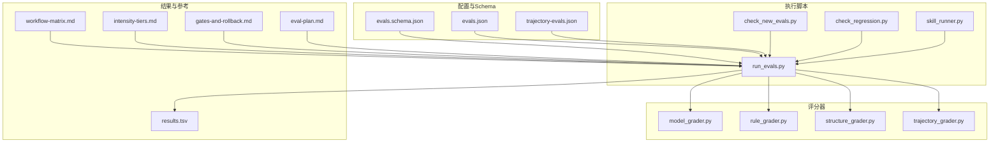
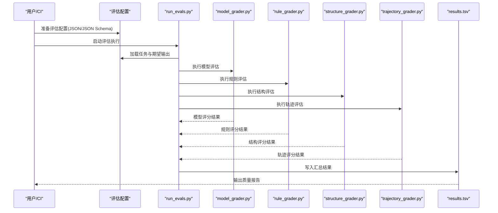
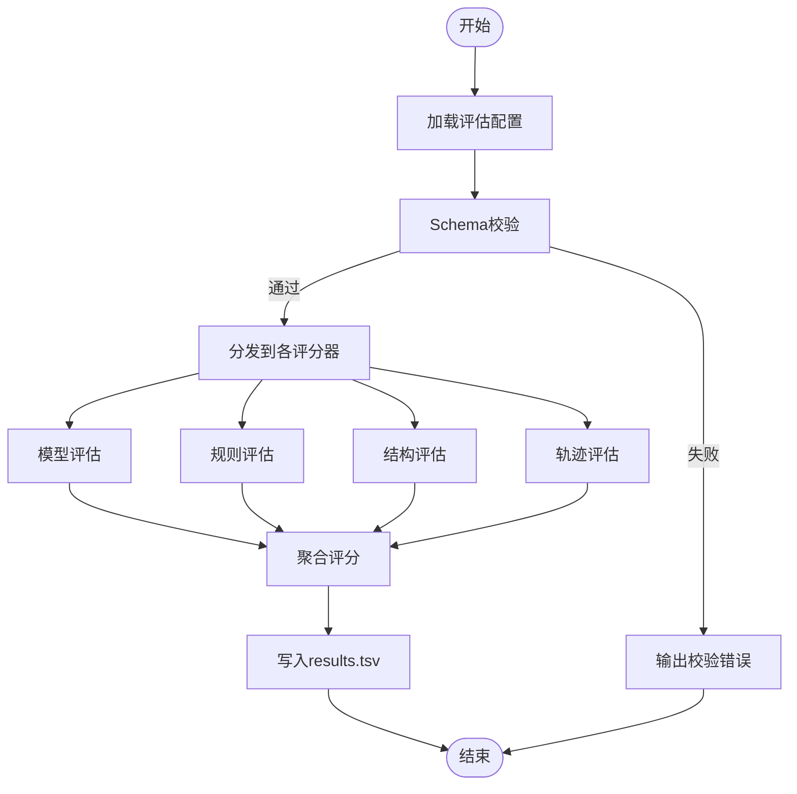
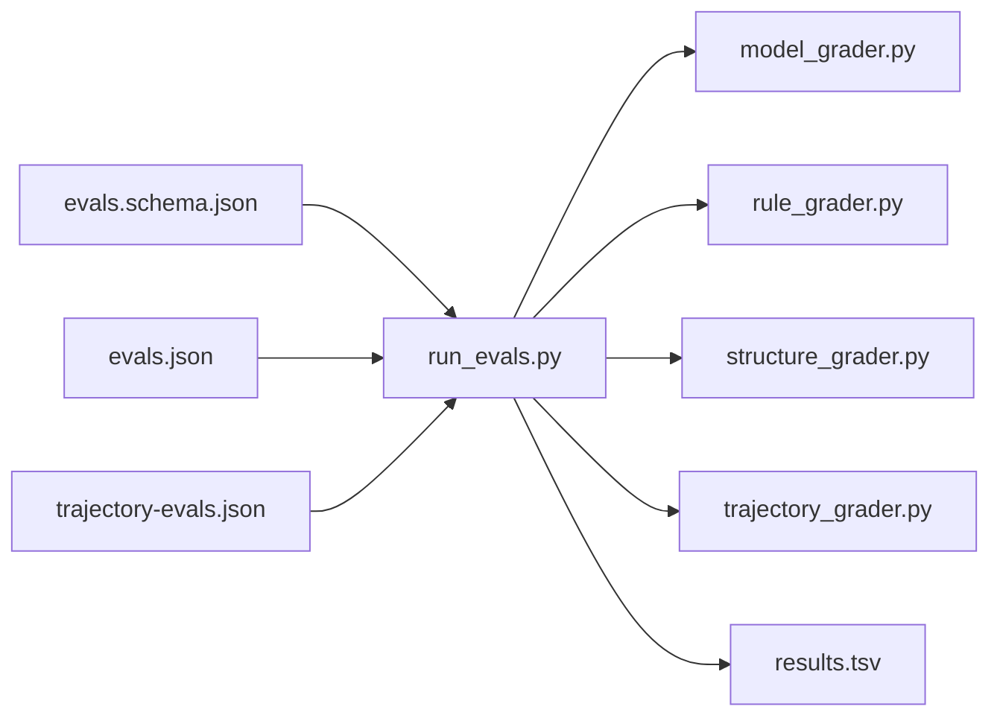

# 评估API

<cite>
**本文引用的文件**
- [evals.schema.json](file://plugins/frontend-team-toolkit/skill-engineering/schemas/evals.schema.json)
- [run_evals.py](file://plugins/frontend-team-toolkit/skill-engineering/scripts/run_evals.py)
- [model_grader.py](file://plugins/frontend-team-toolkit/skill-engineering/scripts/graders/model_grader.py)
- [rule_grader.py](file://plugins/frontend-team-toolkit/skill-engineering/scripts/graders/rule_grader.py)
- [structure_grader.py](file://plugins/frontend-team-toolkit/skill-engineering/scripts/graders/structure_grader.py)
- [trajectory_grader.py](file://plugins/frontend-team-toolkit/skill-engineering/scripts/graders/trajectory_grader.py)
- [evals.json](file://plugins/frontend-team-toolkit/skill-engineering/templates/new-skill/evals/evals.json)
- [trajectory-evals.json](file://plugins/frontend-team-toolkit/skill-engineering/templates/new-skill/evals/trajectory-evals.json)
- [results.tsv](file://plugins/frontend-team-toolkit/skill-engineering/templates/new-skill/results.tsv)
- [check_new_evals.py](file://plugins/frontend-team-toolkit/skill-engineering/scripts/check_new_evals.py)
- [check_regression.py](file://plugins/frontend-team-toolkit/skill-engineering/scripts/check_regression.py)
- [skill_runner.py](file://plugins/frontend-team-toolkit/skill-engineering/scripts/skill_runner.py)
- [workflow-matrix.md](file://plugins/frontend-team-toolkit/skill-engineering/references/workflow-matrix.md)
- [intensity-tiers.md](file://plugins/frontend-team-toolkit/skill-engineering/references/intensity-tiers.md)
- [gates-and-rollback.md](file://plugins/frontend-team-toolkit/skill-engineering/references/gates-and-rollback.md)
- [eval-plan.md](file://plugins/frontend-team-toolkit/skill-engineering/skills/skills-quality/eval-plan.md)
- [README.md](file://plugins/frontend-team-toolkit/skill-engineering/README.md)
</cite>

## 目录
1. [简介](#简介)
2. [项目结构](#项目结构)
3. [核心组件](#核心组件)
4. [架构总览](#架构总览)
5. [详细组件分析](#详细组件分析)
6. [依赖关系分析](#依赖关系分析)
7. [性能考虑](#性能考虑)
8. [故障排查指南](#故障排查指南)
9. [结论](#结论)
10. [附录](#附录)

## 简介
本文件系统化梳理评估API的设计与实现，覆盖以下方面：
- 评估执行流程与数据契约（评估配置、评分器、结果输出）
- 四种评估维度（模型评估、规则评估、结构评估、轨迹评估）的职责边界与典型用法
- 评估配置文件的JSON Schema定义与校验规则
- 评估脚本编写指南与最佳实践
- 结果分析与质量报告生成的建议方案
- 性能优化与并发处理策略

## 项目结构
该仓库围绕“技能工程”能力构建了完整的评估体系，主要由以下部分组成：
- 配置与Schema：定义评估任务的输入、期望输出与评分规则
- 评分器：针对不同维度的自动化打分逻辑
- 执行脚本：统一调度与运行评估任务
- 模板与参考材料：提供评估计划、工作流矩阵、强度等级等指导性内容

图表来源
- [evals.schema.json](file://plugins/frontend-team-toolkit/skill-engineering/schemas/evals.schema.json)
- [run_evals.py](file://plugins/frontend-team-toolkit/skill-engineering/scripts/run_evals.py)
- [model_grader.py](file://plugins/frontend-team-toolkit/skill-engineering/scripts/graders/model_grader.py)
- [rule_grader.py](file://plugins/frontend-team-toolkit/skill-engineering/scripts/graders/rule_grader.py)
- [structure_grader.py](file://plugins/frontend-team-toolkit/skill-engineering/scripts/graders/structure_grader.py)
- [trajectory_grader.py](file://plugins/frontend-team-toolkit/skill-engineering/scripts/graders/trajectory_grader.py)
- [evals.json](file://plugins/frontend-team-toolkit/skill-engineering/templates/new-skill/evals/evals.json)
- [trajectory-evals.json](file://plugins/frontend-team-toolkit/skill-engineering/templates/new-skill/evals/trajectory-evals.json)
- [results.tsv](file://plugins/frontend-team-toolkit/skill-engineering/templates/new-skill/results.tsv)
- [check_new_evals.py](file://plugins/frontend-team-toolkit/skill-engineering/scripts/check_new_evals.py)
- [check_regression.py](file://plugins/frontend-team-toolkit/skill-engineering/scripts/check_regression.py)
- [skill_runner.py](file://plugins/frontend-team-toolkit/skill-engineering/scripts/skill_runner.py)
- [workflow-matrix.md](file://plugins/frontend-team-toolkit/skill-engineering/references/workflow-matrix.md)
- [intensity-tiers.md](file://plugins/frontend-team-toolkit/skill-engineering/references/intensity-tiers.md)
- [gates-and-rollback.md](file://plugins/frontend-team-toolkit/skill-engineering/references/gates-and-rollback.md)
- [eval-plan.md](file://plugins/frontend-team-toolkit/skill-engineering/skills/skills-quality/eval-plan.md)

章节来源
- [README.md](file://plugins/frontend-team-toolkit/skill-engineering/README.md)

## 核心组件
- 评估配置与Schema
  - 通过JSON Schema约束评估任务的字段、类型与必填项，确保配置一致性与可验证性
  - 提供评估任务的输入样本、期望输出、评分维度与阈值等元数据
- 评分器
  - 模型评估：对模型输出与期望目标进行语义/事实一致性评分
  - 规则评估：基于预定义规则集检查输出是否满足合规性与规范性要求
  - 结构评估：验证输出结构、格式与字段完整性
  - 轨迹评估：跟踪多轮对话或流程中的行为序列，评估连贯性与目标达成度
- 执行脚本
  - 统一入口负责加载配置、调用评分器、聚合结果并输出报告
  - 包含新增评估检查与回归检测脚本，保障评估质量与稳定性
- 模板与参考
  - 提供标准化的评估模板、TSV结果格式与质量门禁参考文档

章节来源
- [evals.schema.json](file://plugins/frontend-team-toolkit/skill-engineering/schemas/evals.schema.json)
- [run_evals.py](file://plugins/frontend-team-toolkit/skill-engineering/scripts/run_evals.py)
- [model_grader.py](file://plugins/frontend-team-toolkit/skill-engineering/scripts/graders/model_grader.py)
- [rule_grader.py](file://plugins/frontend-team-toolkit/skill-engineering/scripts/graders/rule_grader.py)
- [structure_grader.py](file://plugins/frontend-team-toolkit/skill-engineering/scripts/graders/structure_grader.py)
- [trajectory_grader.py](file://plugins/frontend-team-toolkit/skill-engineering/scripts/graders/trajectory_grader.py)
- [evals.json](file://plugins/frontend-team-toolkit/skill-engineering/templates/new-skill/evals/evals.json)
- [trajectory-evals.json](file://plugins/frontend-team-toolkit/skill-engineering/templates/new-skill/evals/trajectory-evals.json)
- [results.tsv](file://plugins/frontend-team-toolkit/skill-engineering/templates/new-skill/results.tsv)
- [check_new_evals.py](file://plugins/frontend-team-toolkit/skill-engineering/scripts/check_new_evals.py)
- [check_regression.py](file://plugins/frontend-team-toolkit/skill-engineering/scripts/check_regression.py)
- [skill_runner.py](file://plugins/frontend-team-toolkit/skill-engineering/scripts/skill_runner.py)
- [workflow-matrix.md](file://plugins/frontend-team-toolkit/skill-engineering/references/workflow-matrix.md)
- [intensity-tiers.md](file://plugins/frontend-team-toolkit/skill-engineering/references/intensity-tiers.md)
- [gates-and-rollback.md](file://plugins/frontend-team-toolkit/skill-engineering/references/gates-and-rollback.md)
- [eval-plan.md](file://plugins/frontend-team-toolkit/skill-engineering/skills/skills-quality/eval-plan.md)

## 架构总览
评估系统采用“配置驱动 + 多维评分器 + 统一执行”的分层架构。执行流程如下：

图表来源
- [run_evals.py](file://plugins/frontend-team-toolkit/skill-engineering/scripts/run_evals.py)
- [model_grader.py](file://plugins/frontend-team-toolkit/skill-engineering/scripts/graders/model_grader.py)
- [rule_grader.py](file://plugins/frontend-team-toolkit/skill-engineering/scripts/graders/rule_grader.py)
- [structure_grader.py](file://plugins/frontend-team-toolkit/skill-engineering/scripts/graders/structure_grader.py)
- [trajectory_grader.py](file://plugins/frontend-team-toolkit/skill-engineering/scripts/graders/trajectory_grader.py)
- [results.tsv](file://plugins/frontend-team-toolkit/skill-engineering/templates/new-skill/results.tsv)

## 详细组件分析

### 评估配置与JSON Schema
- 目标
  - 定义评估任务的输入、期望输出、评分维度、阈值与元信息
  - 通过Schema实现配置的自描述与可验证性
- 关键字段（示例）
  - 任务标识、评估维度列表、输入样本集合、期望输出集合、评分阈值、是否启用并发
- 校验规则
  - 必填字段校验、类型匹配、枚举值限制、数值范围校验、依赖字段联动校验
- 使用建议
  - 将评估配置与模板结合，保证新评估的一致性与可复用性

章节来源
- [evals.schema.json](file://plugins/frontend-team-toolkit/skill-engineering/schemas/evals.schema.json)
- [evals.json](file://plugins/frontend-team-toolkit/skill-engineering/templates/new-skill/evals/evals.json)
- [trajectory-evals.json](file://plugins/frontend-team-toolkit/skill-engineering/templates/new-skill/evals/trajectory-evals.json)

### 四种评估维度

#### 模型评估（Model Grading）
- 职责
  - 对模型输出与期望目标在语义、事实层面进行一致性评分
- 典型场景
  - 自然语言问答、摘要生成、意图识别等
- 实现要点
  - 基于预设的评分模板与阈值，输出得分与理由
- 与执行流程的关系
  - 在统一执行脚本中被调用，并合并到最终结果

章节来源
- [model_grader.py](file://plugins/frontend-team-toolkit/skill-engineering/scripts/graders/model_grader.py)
- [run_evals.py](file://plugins/frontend-team-toolkit/skill-engineering/scripts/run_evals.py)

#### 规则评估（Rule Grading）
- 职责
  - 检查输出是否满足预定义规则，如合规性、格式规范、安全限制等
- 典型场景
  - 输出过滤、敏感词检测、字段完整性检查
- 实现要点
  - 规则集合可扩展，支持正则、白名单/黑名单、条件组合
- 与执行流程的关系
  - 作为独立评分器参与统一执行

章节来源
- [rule_grader.py](file://plugins/frontend-team-toolkit/skill-engineering/scripts/graders/rule_grader.py)
- [run_evals.py](file://plugins/frontend-team-toolkit/skill-engineering/scripts/run_evals.py)

#### 结构评估（Structure Grading）
- 职责
  - 验证输出结构、字段与格式是否符合预期
- 典型场景
  - JSON/CSV/XML等结构化输出的schema一致性检查
- 实现要点
  - 与Schema对比、字段存在性与类型校验、嵌套结构递归检查
- 与执行流程的关系
  - 作为独立评分器参与统一执行

章节来源
- [structure_grader.py](file://plugins/frontend-team-toolkit/skill-engineering/scripts/graders/structure_grader.py)
- [run_evals.py](file://plugins/frontend-team-toolkit/skill-engineering/scripts/run_evals.py)

#### 轨迹评估（Trajectory Grading）
- 职责
  - 跟踪多轮对话或流程中的行为序列，评估连贯性与目标达成度
- 典型场景
  - 对话系统、工作流编排、A/B测试中的行为序列分析
- 实现要点
  - 序列相似度、状态转移合法性、关键步骤覆盖率
- 与执行流程的关系
  - 作为独立评分器参与统一执行

章节来源
- [trajectory_grader.py](file://plugins/frontend-team-toolkit/skill-engineering/scripts/graders/trajectory_grader.py)
- [run_evals.py](file://plugins/frontend-team-toolkit/skill-engineering/scripts/run_evals.py)

### 执行脚本与调度
- run_evals.py
  - 负责加载配置、调用各评分器、聚合结果并输出TSV
  - 支持批量样本、阈值控制与失败重试策略
- check_new_evals.py
  - 新增评估检查，确保新任务符合模板与Schema
- check_regression.py
  - 回归检测，对比历史结果，发现性能退化
- skill_runner.py
  - 技能级评估运行器，封装评估生命周期与资源管理

图表来源
- [run_evals.py](file://plugins/frontend-team-toolkit/skill-engineering/scripts/run_evals.py)
- [check_new_evals.py](file://plugins/frontend-team-toolkit/skill-engineering/scripts/check_new_evals.py)
- [check_regression.py](file://plugins/frontend-team-toolkit/skill-engineering/scripts/check_regression.py)
- [skill_runner.py](file://plugins/frontend-team-toolkit/skill-engineering/scripts/skill_runner.py)
- [results.tsv](file://plugins/frontend-team-toolkit/skill-engineering/templates/new-skill/results.tsv)

章节来源
- [run_evals.py](file://plugins/frontend-team-toolkit/skill-engineering/scripts/run_evals.py)
- [check_new_evals.py](file://plugins/frontend-team-toolkit/skill-engineering/scripts/check_new_evals.py)
- [check_regression.py](file://plugins/frontend-team-toolkit/skill-engineering/scripts/check_regression.py)
- [skill_runner.py](file://plugins/frontend-team-toolkit/skill-engineering/scripts/skill_runner.py)
- [results.tsv](file://plugins/frontend-team-toolkit/skill-engineering/templates/new-skill/results.tsv)

### 结果分析与质量报告
- 结果格式
  - 使用TSV作为标准输出，便于导入表格工具与自动化处理
- 报告维度
  - 各维度得分分布、通过率、失败样本清单、趋势对比
- 质量门禁
  - 参考“工作流矩阵”“强度等级”“门禁与回滚”文档，设定阈值与拦截策略

章节来源
- [results.tsv](file://plugins/frontend-team-toolkit/skill-engineering/templates/new-skill/results.tsv)
- [workflow-matrix.md](file://plugins/frontend-team-toolkit/skill-engineering/references/workflow-matrix.md)
- [intensity-tiers.md](file://plugins/frontend-team-toolkit/skill-engineering/references/intensity-tiers.md)
- [gates-and-rollback.md](file://plugins/frontend-team-toolkit/skill-engineering/references/gates-and-rollback.md)

## 依赖关系分析
- 组件耦合
  - 执行脚本与评分器为松耦合设计，便于独立扩展与替换
  - 评分器之间无直接依赖，避免环形依赖
- 外部依赖
  - JSON Schema校验、文件I/O、进程/线程池（用于并发）
- 接口契约
  - 评分器统一输入样本与期望输出，统一输出评分与理由

图表来源
- [run_evals.py](file://plugins/frontend-team-toolkit/skill-engineering/scripts/run_evals.py)
- [model_grader.py](file://plugins/frontend-team-toolkit/skill-engineering/scripts/graders/model_grader.py)
- [rule_grader.py](file://plugins/frontend-team-toolkit/skill-engineering/scripts/graders/rule_grader.py)
- [structure_grader.py](file://plugins/frontend-team-toolkit/skill-engineering/scripts/graders/structure_grader.py)
- [trajectory_grader.py](file://plugins/frontend-team-toolkit/skill-engineering/scripts/graders/trajectory_grader.py)
- [evals.schema.json](file://plugins/frontend-team-toolkit/skill-engineering/schemas/evals.schema.json)
- [evals.json](file://plugins/frontend-team-toolkit/skill-engineering/templates/new-skill/evals/evals.json)
- [trajectory-evals.json](file://plugins/frontend-team-toolkit/skill-engineering/templates/new-skill/evals/trajectory-evals.json)
- [results.tsv](file://plugins/frontend-team-toolkit/skill-engineering/templates/new-skill/results.tsv)

## 性能考虑
- 并发策略
  - 对独立样本进行批处理与并发执行，减少总耗时
  - 控制并发度上限，避免资源争用
- 缓存与去重
  - 对重复输入或已知期望输出进行缓存，降低重复计算
- I/O优化
  - 使用流式写入TSV，避免大文件内存占用
- 超时与重试
  - 为外部评分服务设置超时与指数退避重试
- 监控与采样
  - 记录每个样本的耗时与错误，定期抽样分析瓶颈

## 故障排查指南
- 配置问题
  - 使用Schema校验评估配置，定位缺失字段与类型不匹配
- 评分异常
  - 分别检查各评分器日志，确认输入样本与期望输出是否正确
- 结果不一致
  - 对比历史TSV，使用回归检测脚本定位退化点
- CI集成
  - 通过新增评估检查脚本确保新任务符合模板与Schema

章节来源
- [evals.schema.json](file://plugins/frontend-team-toolkit/skill-engineering/schemas/evals.schema.json)
- [check_new_evals.py](file://plugins/frontend-team-toolkit/skill-engineering/scripts/check_new_evals.py)
- [check_regression.py](file://plugins/frontend-team-toolkit/skill-engineering/scripts/check_regression.py)

## 结论
该评估API以配置驱动为核心，通过多维评分器与统一执行脚本实现高内聚、低耦合的评估流水线。配合标准化模板与参考文档，能够稳定支撑模型评估、规则评估、结构评估与轨迹评估的全场景应用，并为质量报告与门禁策略提供可靠的数据基础。

## 附录
- 评估计划与质量门禁
  - 参考评估计划文档，明确评估周期、覆盖范围与验收标准
- 工作流矩阵与强度等级
  - 依据工作流矩阵选择合适的评估策略，按强度等级调整样本规模与阈值
- 门禁与回滚
  - 当评估未达标时，触发门禁并执行回滚流程，保障交付质量

章节来源
- [eval-plan.md](file://plugins/frontend-team-toolkit/skill-engineering/skills/skills-quality/eval-plan.md)
- [workflow-matrix.md](file://plugins/frontend-team-toolkit/skill-engineering/references/workflow-matrix.md)
- [intensity-tiers.md](file://plugins/frontend-team-toolkit/skill-engineering/references/intensity-tiers.md)
- [gates-and-rollback.md](file://plugins/frontend-team-toolkit/skill-engineering/references/gates-and-rollback.md)