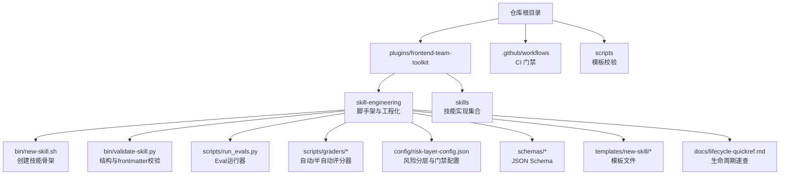
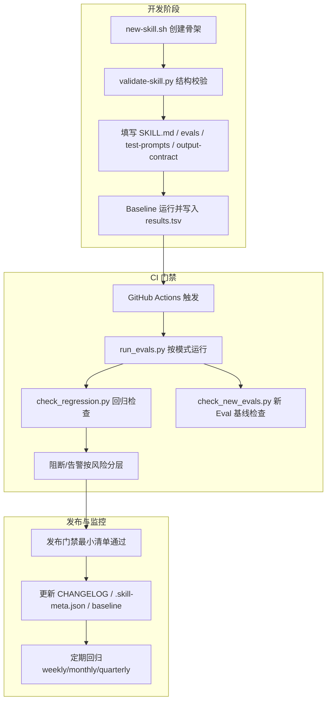
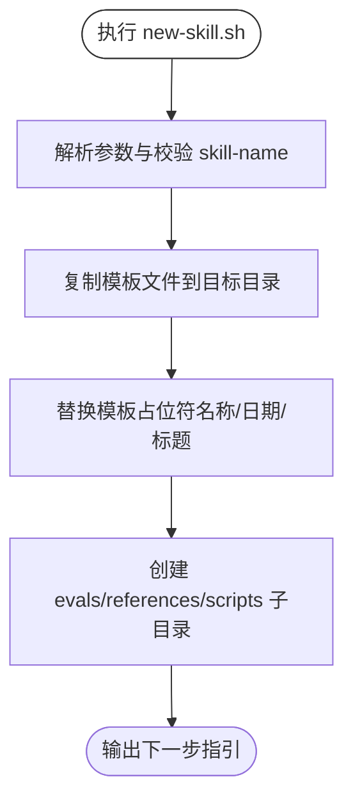
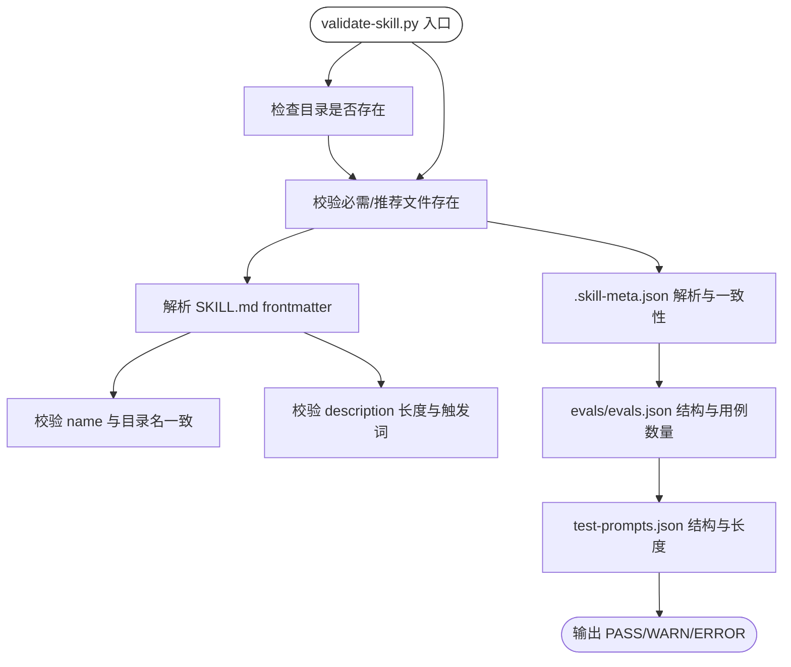
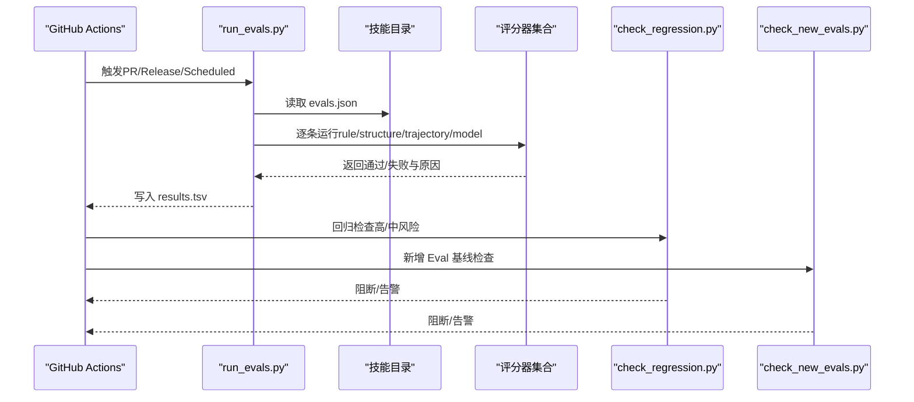
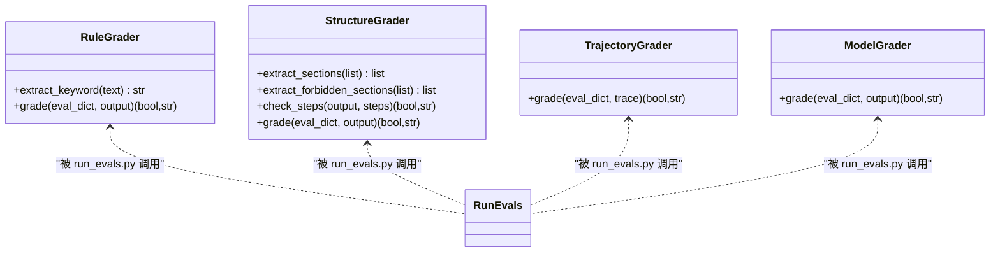
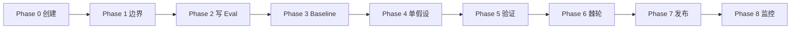
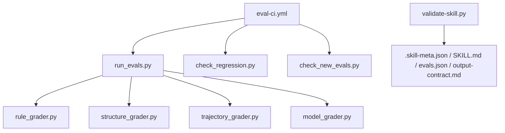

# 开发指南

<cite>
**本文引用的文件**
- [plugins/frontend-team-toolkit/README.md](file://plugins/frontend-team-toolkit/README.md)
- [plugins/frontend-team-toolkit/skill-engineering/README.md](file://plugins/frontend-team-toolkit/skill-engineering/README.md)
- [plugins/frontend-team-toolkit/skill-engineering/bin/new-skill.sh](file://plugins/frontend-team-toolkit/skill-engineering/bin/new-skill.sh)
- [plugins/frontend-team-toolkit/skill-engineering/bin/validate-skill.py](file://plugins/frontend-team-toolkit/skill-engineering/bin/validate-skill.py)
- [plugins/frontend-team-toolkit/skill-engineering/docs/lifecycle-quickref.md](file://plugins/frontend-team-toolkit/skill-engineering/docs/lifecycle-quickref.md)
- [plugins/frontend-team-toolkit/skill-engineering/templates/new-skill/.skill-meta.json](file://plugins/frontend-team-toolkit/skill-engineering/templates/new-skill/.skill-meta.json)
- [plugins/frontend-team-toolkit/skill-engineering/templates/new-skill/SKILL.md](file://plugins/frontend-team-toolkit/skill-engineering/templates/new-skill/SKILL.md)
- [plugins/frontend-team-toolkit/skill-engineering/templates/new-skill/evals/evals.json](file://plugins/frontend-team-toolkit/skill-engineering/templates/new-skill/evals/evals.json)
- [plugins/frontend-team-toolkit/skill-engineering/templates/new-skill/references/output-contract.md](file://plugins/frontend-team-toolkit/skill-engineering/templates/new-skill/references/output-contract.md)
- [plugins/frontend-team-toolkit/skill-engineering/scripts/run_evals.py](file://plugins/frontend-team-toolkit/skill-engineering/scripts/run_evals.py)
- [plugins/frontend-team-toolkit/skill-engineering/scripts/check_regression.py](file://plugins/frontend-team-toolkit/skill-engineering/scripts/check_regression.py)
- [plugins/frontend-team-toolkit/skill-engineering/scripts/check_new_evals.py](file://plugins/frontend-team-toolkit/skill-engineering/scripts/check_new_evals.py)
- [plugins/frontend-team-toolkit/skill-engineering/scripts/graders/rule_grader.py](file://plugins/frontend-team-toolkit/skill-engineering/scripts/graders/rule_grader.py)
- [plugins/frontend-team-toolkit/skill-engineering/scripts/graders/structure_grader.py](file://plugins/frontend-team-toolkit/skill-engineering/scripts/graders/structure_grader.py)
- [plugins/frontend-team-toolkit/skill-engineering/scripts/graders/trajectory_grader.py](file://plugins/frontend-team-toolkit/skill-engineering/scripts/graders/trajectory_grader.py)
- [plugins/frontend-team-toolkit/skill-engineering/scripts/graders/model_grader.py](file://plugins/frontend-team-toolkit/skill-engineering/scripts/graders/model_grader.py)
- [plugins/frontend-team-toolkit/skill-engineering/config/risk-layer-config.json](file://plugins/frontend-team-toolkit/skill-engineering/config/risk-layer-config.json)
- [.github/workflows/eval-ci.yml](file://.github/workflows/eval-ci.yml)
- [plugins/frontend-team-toolkit/skills/wechat-article-review/SKILL.md](file://plugins/frontend-team-toolkit/skills/wechat-article-review/SKILL.md)
</cite>

## 目录
1. [简介](#简介)
2. [项目结构](#项目结构)
3. [核心组件](#核心组件)
4. [架构总览](#架构总览)
5. [详细组件分析](#详细组件分析)
6. [依赖分析](#依赖分析)
7. [性能考虑](#性能考虑)
8. [故障排除指南](#故障排除指南)
9. [结论](#结论)
10. [附录](#附录)

## 简介
本指南面向希望参与“技能工程”项目的开发者，系统讲解如何基于脚手架创建、校验、评测与发布高质量 Agent Skill。内容涵盖：
- 新技能开发全流程（模板使用、目录结构、规范与测试）
- CI 门禁与回归策略
- 调试技巧与日志分析
- 贡献指南与社区协作
- 最佳实践与常见陷阱
- 版本管理与发布流程

## 项目结构
本仓库以“插件工具包 + 技能集合”的方式组织，核心位于 plugins/frontend-team-toolkit：
- skill-engineering：脚手架与工程化工具（模板、校验、CI 脚本、Schema）
- skills：实际技能实现（随插件分发）
- .github/workflows：GitHub Actions CI 门禁
- scripts：仓库级模板校验脚本

图表来源
- [plugins/frontend-team-toolkit/README.md:19-27](file://plugins/frontend-team-toolkit/README.md#L19-L27)
- [plugins/frontend-team-toolkit/skill-engineering/README.md:34-69](file://plugins/frontend-team-toolkit/skill-engineering/README.md#L34-L69)

章节来源
- [plugins/frontend-team-toolkit/README.md:1-50](file://plugins/frontend-team-toolkit/README.md#L1-L50)
- [plugins/frontend-team-toolkit/skill-engineering/README.md:1-294](file://plugins/frontend-team-toolkit/skill-engineering/README.md#L1-L294)

## 核心组件
- 脚手架与模板
  - new-skill.sh：从模板复制并填充变量，生成标准技能目录
  - templates/new-skill：包含 SKILL.md、.skill-meta.json、evals、references、scripts 等模板文件
- 结构校验
  - validate-skill.py：校验目录结构、frontmatter、必要/推荐文件、evals/test-prompts 等
- CI 门禁与评测
  - run_evals.py：按模式（PR/Release/Scheduled）筛选并运行 Eval，输出 results.tsv
  - check_regression.py / check_new_evals.py：回归门禁与新增 Eval 基线检查
  - graders/*：rule/structure/trajectory/model 评分器
- 配置与规范
  - risk-layer-config.json：风险分层、门禁红线、通知策略
  - schemas/*：JSON Schema 校验
  - lifecycle-quickref.md：生命周期八阶段与发布门禁最小清单

章节来源
- [plugins/frontend-team-toolkit/skill-engineering/bin/new-skill.sh:1-121](file://plugins/frontend-team-toolkit/skill-engineering/bin/new-skill.sh#L1-L121)
- [plugins/frontend-team-toolkit/skill-engineering/bin/validate-skill.py:1-193](file://plugins/frontend-team-toolkit/skill-engineering/bin/validate-skill.py#L1-L193)
- [plugins/frontend-team-toolkit/skill-engineering/scripts/run_evals.py:1-227](file://plugins/frontend-team-toolkit/skill-engineering/scripts/run_evals.py#L1-L227)
- [plugins/frontend-team-toolkit/skill-engineering/scripts/check_regression.py](file://plugins/frontend-team-toolkit/skill-engineering/scripts/check_regression.py)
- [plugins/frontend-team-toolkit/skill-engineering/scripts/check_new_evals.py](file://plugins/frontend-team-toolkit/skill-engineering/scripts/check_new_evals.py)
- [plugins/frontend-team-toolkit/skill-engineering/scripts/graders/rule_grader.py:1-110](file://plugins/frontend-team-toolkit/skill-engineering/scripts/graders/rule_grader.py#L1-L110)
- [plugins/frontend-team-toolkit/skill-engineering/scripts/graders/structure_grader.py:1-155](file://plugins/frontend-team-toolkit/skill-engineering/scripts/graders/structure_grader.py#L1-L155)
- [plugins/frontend-team-toolkit/skill-engineering/config/risk-layer-config.json:1-70](file://plugins/frontend-team-toolkit/skill-engineering/config/risk-layer-config.json#L1-L70)
- [plugins/frontend-team-toolkit/skill-engineering/docs/lifecycle-quickref.md:1-32](file://plugins/frontend-team-toolkit/skill-engineering/docs/lifecycle-quickref.md#L1-L32)

## 架构总览
技能工程的“创建—评测—回归—发布”闭环如下：

图表来源
- [plugins/frontend-team-toolkit/skill-engineering/README.md:139-149](file://plugins/frontend-team-toolkit/skill-engineering/README.md#L139-L149)
- [.github/workflows/eval-ci.yml:1-208](file://.github/workflows/eval-ci.yml#L1-L208)
- [plugins/frontend-team-toolkit/skill-engineering/config/risk-layer-config.json:1-70](file://plugins/frontend-team-toolkit/skill-engineering/config/risk-layer-config.json#L1-L70)

## 详细组件分析

### 组件一：新技能创建与模板使用
- 目标：通过 new-skill.sh 一键生成符合工业标准的技能目录，内置模板文件与脚本
- 关键点
  - 目录命名：kebab-case，与模板变量替换
  - 必备文件：SKILL.md、.skill-meta.json、evals/evals.json、test-prompts.json、references/output-contract.md 等
  - 可选文件：results.tsv、skill-issues.jsonl.example、scripts/validate-output.sh
  - 模板填充：模板中的占位符（名称、日期、标题）在复制时被替换

图表来源
- [plugins/frontend-team-toolkit/skill-engineering/bin/new-skill.sh:66-121](file://plugins/frontend-team-toolkit/skill-engineering/bin/new-skill.sh#L66-L121)

章节来源
- [plugins/frontend-team-toolkit/skill-engineering/bin/new-skill.sh:1-121](file://plugins/frontend-team-toolkit/skill-engineering/bin/new-skill.sh#L1-L121)
- [plugins/frontend-team-toolkit/skill-engineering/templates/new-skill/.skill-meta.json:1-32](file://plugins/frontend-team-toolkit/skill-engineering/templates/new-skill/.skill-meta.json#L1-L32)
- [plugins/frontend-team-toolkit/skill-engineering/templates/new-skill/SKILL.md:1-97](file://plugins/frontend-team-toolkit/skill-engineering/templates/new-skill/SKILL.md#L1-L97)
- [plugins/frontend-team-toolkit/skill-engineering/templates/new-skill/evals/evals.json:1-47](file://plugins/frontend-team-toolkit/skill-engineering/templates/new-skill/evals/evals.json#L1-L47)
- [plugins/frontend-team-toolkit/skill-engineering/templates/new-skill/references/output-contract.md:1-42](file://plugins/frontend-team-toolkit/skill-engineering/templates/new-skill/references/output-contract.md#L1-L42)

### 组件二：结构校验与代码规范
- 目标：确保每个技能目录满足工业级规范，避免遗漏关键文件与 frontmatter
- 关键点
  - 目录名与文件存在性校验
  - SKILL.md frontmatter 校验（name/description/allowed-tools/metadata 等）
  - .skill-meta.json 与目录名一致性
  - evals/evals.json 与 test-prompts.json 的基本结构与完整性
  - 推荐文件缺失给出 warning，便于逐步补齐

图表来源
- [plugins/frontend-team-toolkit/skill-engineering/bin/validate-skill.py:83-167](file://plugins/frontend-team-toolkit/skill-engineering/bin/validate-skill.py#L83-L167)

章节来源
- [plugins/frontend-team-toolkit/skill-engineering/bin/validate-skill.py:1-193](file://plugins/frontend-team-toolkit/skill-engineering/bin/validate-skill.py#L1-L193)

### 组件三：CI 门禁与评测运行
- 目标：在 PR/Release/Scheduled 三种模式下自动运行 Eval，阻断回归并生成结果
- 关键点
  - 模式过滤：PR 仅运行 high/medium；Release 全量；Scheduled 按频率与随机抽查
  - 评分器组合：rule/structure/trajectory/model/human 多种组合
  - 结果输出：results.tsv，包含 eval_id、pass、date、version、grader、risk、reviewer、notes
  - 回归与新增基线检查：阻断高风险回归与新增 Eval 未 baseline

图表来源
- [.github/workflows/eval-ci.yml:36-158](file://.github/workflows/eval-ci.yml#L36-L158)
- [plugins/frontend-team-toolkit/skill-engineering/scripts/run_evals.py:135-174](file://plugins/frontend-team-toolkit/skill-engineering/scripts/run_evals.py#L135-L174)

章节来源
- [.github/workflows/eval-ci.yml:1-208](file://.github/workflows/eval-ci.yml#L1-L208)
- [plugins/frontend-team-toolkit/skill-engineering/scripts/run_evals.py:1-227](file://plugins/frontend-team-toolkit/skill-engineering/scripts/run_evals.py#L1-L227)
- [plugins/frontend-team-toolkit/skill-engineering/scripts/check_regression.py](file://plugins/frontend-team-toolkit/skill-engineering/scripts/check_regression.py)
- [plugins/frontend-team-toolkit/skill-engineering/scripts/check_new_evals.py](file://plugins/frontend-team-toolkit/skill-engineering/scripts/check_new_evals.py)

### 组件四：评分器与自动化判定
- rule_grader：关键词/路径/章节/禁用词规则检查
- structure_grader：章节/步骤/frontmatter 结构检查
- trajectory_grader：Agent 调用轨迹顺序检查（自动）
- model_grader：LLM Judge 语义判定（半自动，多次采样降低漂移）
- 评分器配置：risk-layer-config.json 控制自动/半自动与漂移风险等级

图表来源
- [plugins/frontend-team-toolkit/skill-engineering/scripts/graders/rule_grader.py:41-92](file://plugins/frontend-team-toolkit/skill-engineering/scripts/graders/rule_grader.py#L41-L92)
- [plugins/frontend-team-toolkit/skill-engineering/scripts/graders/structure_grader.py:63-122](file://plugins/frontend-team-toolkit/skill-engineering/scripts/graders/structure_grader.py#L63-L122)
- [plugins/frontend-team-toolkit/skill-engineering/scripts/graders/trajectory_grader.py](file://plugins/frontend-team-toolkit/skill-engineering/scripts/graders/trajectory_grader.py)
- [plugins/frontend-team-toolkit/skill-engineering/scripts/graders/model_grader.py](file://plugins/frontend-team-toolkit/skill-engineering/scripts/graders/model_grader.py)
- [plugins/frontend-team-toolkit/skill-engineering/scripts/run_evals.py:84-132](file://plugins/frontend-team-toolkit/skill-engineering/scripts/run_evals.py#L84-L132)

章节来源
- [plugins/frontend-team-toolkit/skill-engineering/scripts/graders/rule_grader.py:1-110](file://plugins/frontend-team-toolkit/skill-engineering/scripts/graders/rule_grader.py#L1-L110)
- [plugins/frontend-team-toolkit/skill-engineering/scripts/graders/structure_grader.py:1-155](file://plugins/frontend-team-toolkit/skill-engineering/scripts/graders/structure_grader.py#L1-L155)
- [plugins/frontend-team-toolkit/skill-engineering/scripts/run_evals.py:1-227](file://plugins/frontend-team-toolkit/skill-engineering/scripts/run_evals.py#L1-L227)

### 组件五：生命周期与发布门禁
- 生命周期八阶段：创建→边界→写 Eval→Baseline→单假设→验证→棘轮→发布→监控
- 发布门禁最小清单：validate-skill.py 通过、无回归退化、CHANGELOG 已写、.skill-meta.json baseline 更新
- 与现有技能的关系：用 validate-skill.py 检查缺口，逐步补齐 evals 与 output-contract

图表来源
- [plugins/frontend-team-toolkit/skill-engineering/docs/lifecycle-quickref.md:5-15](file://plugins/frontend-team-toolkit/skill-engineering/docs/lifecycle-quickref.md#L5-L15)

章节来源
- [plugins/frontend-team-toolkit/skill-engineering/docs/lifecycle-quickref.md:1-32](file://plugins/frontend-team-toolkit/skill-engineering/docs/lifecycle-quickref.md#L1-L32)

## 依赖分析
- 组件耦合
  - run_evals.py 依赖 graders/* 与 skill_runner（内部模块），并通过 risk-layer-config.json 控制模式与风险过滤
  - CI 门禁依赖 run_evals.py、check_regression.py、check_new_evals.py 与 GitHub Actions 事件
  - validate-skill.py 与模板文件强耦合，保证目录结构一致性
- 外部依赖
  - Python 依赖（requirements.txt）与 anthropic（用于模型评分器）
- 潜在循环依赖
  - 当前脚本均为单向调用，无明显循环

图表来源
- [.github/workflows/eval-ci.yml:36-158](file://.github/workflows/eval-ci.yml#L36-L158)
- [plugins/frontend-team-toolkit/skill-engineering/scripts/run_evals.py:25-35](file://plugins/frontend-team-toolkit/skill-engineering/scripts/run_evals.py#L25-L35)
- [plugins/frontend-team-toolkit/skill-engineering/bin/validate-skill.py:26-39](file://plugins/frontend-team-toolkit/skill-engineering/bin/validate-skill.py#L26-L39)

章节来源
- [.github/workflows/eval-ci.yml:1-208](file://.github/workflows/eval-ci.yml#L1-L208)
- [plugins/frontend-team-toolkit/skill-engineering/scripts/run_evals.py:1-227](file://plugins/frontend-team-toolkit/skill-engineering/scripts/run_evals.py#L1-L227)
- [plugins/frontend-team-toolkit/skill-engineering/bin/validate-skill.py:1-193](file://plugins/frontend-team-toolkit/skill-engineering/bin/validate-skill.py#L1-L193)

## 性能考虑
- 评测规模控制
  - PR 模式仅运行 high/medium，减少耗时
  - Scheduled 模式按频率与随机抽查平衡覆盖率与成本
- 评分器选择
  - rule/structure/trajectory 为纯文本/轨迹检查，开销低
  - model_grader 采用多次采样降低漂移，但成本较高，建议合理配置采样次数
- I/O 优化
  - results.tsv 采用简单列分隔，便于快速解析与聚合
- 建议
  - 将大型资源（如图片/长文本）放在 references/scripts 中引用而非内嵌
  - 合理拆分 eval 用例，避免单条用例过于复杂

## 故障排除指南
- 常见错误与定位
  - 目录名非 kebab-case 或 frontmatter 缺失：validate-skill.py 会报错
  - evals.json 缺少 id/prompt 或 test-prompts.json 非数组：校验失败
  - 回归检查失败（高风险）：CI 直接阻断；中风险仅告警
  - 新增 Eval 未 baseline：阻断合并
- 日志与结果分析
  - results.tsv：查看每条用例的通过/失败与原因
  - GitHub Actions 步骤摘要：汇总结果与失败评论
- 调试技巧
  - 本地运行 run_evals.py 模拟 CI 行为
  - 使用 check_regression.py 与 check_new_evals.py 精确验证门禁
  - 逐步注释 graders 组合，定位具体评分器问题
- 参考示例
  - wechat-article-review 技能展示了完整的 SKILL.md 结构与工作流

章节来源
- [plugins/frontend-team-toolkit/skill-engineering/bin/validate-skill.py:170-193](file://plugins/frontend-team-toolkit/skill-engineering/bin/validate-skill.py#L170-L193)
- [.github/workflows/eval-ci.yml:116-141](file://.github/workflows/eval-ci.yml#L116-L141)
- [plugins/frontend-team-toolkit/skill-engineering/scripts/run_evals.py:189-227](file://plugins/frontend-team-toolkit/skill-engineering/scripts/run_evals.py#L189-L227)
- [plugins/frontend-team-toolkit/skills/wechat-article-review/SKILL.md:1-105](file://plugins/frontend-team-toolkit/skills/wechat-article-review/SKILL.md#L1-L105)

## 结论
本指南提供了从“创建—评测—回归—发布”的完整开发路径与工程化工具链。遵循模板与规范、严格使用 CI 门禁、持续完善 Eval 与输出契约，是保障技能质量与可维护性的关键。

## 附录

### A. 新技能开发流程（步骤清单）
- 使用 new-skill.sh 创建骨架
- 填写 SKILL.md（触发条件、契约、工作流、检查点）
- 编写 evals/evals.json 与 test-prompts.json
- 运行 validate-skill.py 通过校验
- 跑 baseline 并写入 results.tsv
- 将真实问题沉淀至 skill-issues.jsonl
- 按发布门禁最小清单准备发布
- CI 自动回归（PR/Release/定期）

章节来源
- [plugins/frontend-team-toolkit/skill-engineering/README.md:9-31](file://plugins/frontend-team-toolkit/skill-engineering/README.md#L9-L31)
- [plugins/frontend-team-toolkit/skill-engineering/docs/lifecycle-quickref.md:17-23](file://plugins/frontend-team-toolkit/skill-engineering/docs/lifecycle-quickref.md#L17-L23)

### B. 贡献指南与社区参与
- 在本仓库内维护与迭代技能
- 新增规则/代理等可参考 Cursor 插件结构说明
- 注册新插件时同步修改根目录 marketplace.json
- 与上游模板对齐，保持结构一致性

章节来源
- [plugins/frontend-team-toolkit/README.md:47-50](file://plugins/frontend-team-toolkit/README.md#L47-L50)

### C. 版本管理与发布流程
- 版本号与成熟度：.skill-meta.json 中 version/maturity
- Baseline 记录：.skill-meta.json 的 baseline 字段
- 发布门禁：validate-skill.py 通过、无回归退化、CHANGELOG 已写、baseline 已更新
- 定期回归：按周/月/季度自动运行

章节来源
- [plugins/frontend-team-toolkit/skill-engineering/templates/new-skill/.skill-meta.json:1-32](file://plugins/frontend-team-toolkit/skill-engineering/templates/new-skill/.skill-meta.json#L1-L32)
- [plugins/frontend-team-toolkit/skill-engineering/docs/lifecycle-quickref.md:17-23](file://plugins/frontend-team-toolkit/skill-engineering/docs/lifecycle-quickref.md#L17-L23)
- [.github/workflows/eval-ci.yml:13-16](file://.github/workflows/eval-ci.yml#L13-L16)