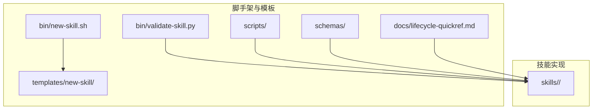
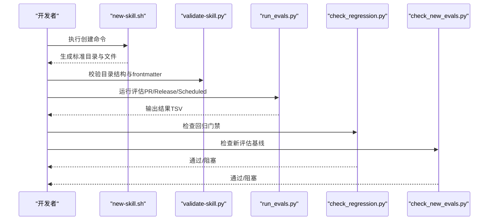
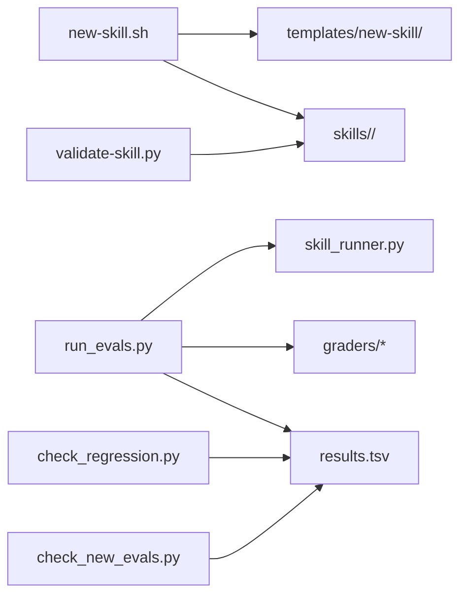

# 新技能开发

<cite>
**本文引用的文件**
- [plugins/frontend-team-toolkit/skill-engineering/bin/new-skill.sh](file://plugins/frontend-team-toolkit/skill-engineering/bin/new-skill.sh)
- [plugins/frontend-team-toolkit/skill-engineering/bin/validate-skill.py](file://plugins/frontend-team-toolkit/skill-engineering/bin/validate-skill.py)
- [plugins/frontend-team-toolkit/skill-engineering/templates/new-skill/.skill-meta.json](file://plugins/frontend-team-toolkit/skill-engineering/templates/new-skill/.skill-meta.json)
- [plugins/frontend-team-toolkit/skill-engineering/templates/new-skill/references/output-contract.md](file://plugins/frontend-team-toolkit/skill-engineering/templates/new-skill/references/output-contract.md)
- [plugins/frontend-team-toolkit/skill-engineering/templates/new-skill/SKILL.md](file://plugins/frontend-team-toolkit/skill-engineering/templates/new-skill/SKILL.md)
- [plugins/frontend-team-toolkit/skill-engineering/templates/new-skill/evals/evals.json](file://plugins/frontend-team-toolkit/skill-engineering/templates/new-skill/evals/evals.json)
- [plugins/frontend-team-toolkit/skill-engineering/docs/lifecycle-quickref.md](file://plugins/frontend-team-toolkit/skill-engineering/docs/lifecycle-quickref.md)
- [plugins/frontend-team-toolkit/skill-engineering/README.md](file://plugins/frontend-toolkit/skill-engineering/README.md)
- [plugins/frontend-team-toolkit/skill-engineering/scripts/skill_runner.py](file://plugins/frontend-team-toolkit/skill-engineering/scripts/skill_runner.py)
- [plugins/frontend-team-toolkit/skill-engineering/scripts/run_evals.py](file://plugins/frontend-team-toolkit/skill-engineering/scripts/run_evals.py)
- [plugins/frontend-team-toolkit/skill-engineering/scripts/check_regression.py](file://plugins/frontend-team-toolkit/skill-engineering/scripts/check_regression.py)
- [plugins/frontend-team-toolkit/skill-engineering/scripts/check_new_evals.py](file://plugins/frontend-team-toolkit/skill-engineering/scripts/check_new_evals.py)
- [plugins/frontend-team-toolkit/skill-engineering/scripts/graders/rule_grader.py](file://plugins/frontend-team-toolkit/skill-engineering/scripts/graders/rule_grader.py)
- [plugins/frontend-team-toolkit/skill-engineering/scripts/graders/structure_grader.py](file://plugins/frontend-team-toolkit/skill-engineering/scripts/graders/structure_grader.py)
- [plugins/frontend-team-toolkit/skills/wechat-article-review/.skill-meta.json](file://plugins/frontend-team-toolkit/skills/wechat-article-review/.skill-meta.json)
</cite>

## 目录
1. [引言](#引言)
2. [项目结构](#项目结构)
3. [核心组件](#核心组件)
4. [架构总览](#架构总览)
5. [详细组件分析](#详细组件分析)
6. [依赖分析](#依赖分析)
7. [性能考虑](#性能考虑)
8. [故障排查指南](#故障排查指南)
9. [结论](#结论)
10. [附录](#附录)

## 引言
本指南面向希望在前端团队市场插件生态中开发“技能”（Skill）的工程师与产品同学。文档围绕技能生命周期的8个阶段，系统讲解从创建到发布的完整流程，并重点说明 new-skill.sh 脚本的使用方法、模板生成与目录结构、元数据配置文件的编写要点、输出契约（output-contract）的重要性和编写规范，以及基于仓库内脚本与模板的开发示例与最佳实践。

## 项目结构
本仓库以“脚手架 + 模板 + 示例技能”的方式组织技能工程能力：
- skill-engineering：提供 new-skill.sh、validate-skill.py、模板与脚本集合，支撑标准化的技能创建、校验与评估。
- skills：存放实际技能实现，随插件发布。
- 示例技能：如 wechat-article-review，展示成熟技能的目录结构与元数据。

图表来源
- [plugins/frontend-team-toolkit/skill-engineering/bin/new-skill.sh:1-121](file://plugins/frontend-team-toolkit/skill-engineering/bin/new-skill.sh#L1-L121)
- [plugins/frontend-team-toolkit/skill-engineering/bin/validate-skill.py:1-193](file://plugins/frontend-team-toolkit/skill-engineering/bin/validate-skill.py#L1-L193)
- [plugins/frontend-team-toolkit/skill-engineering/README.md:34-96](file://plugins/frontend-team-toolkit/skill-engineering/README.md#L34-L96)

章节来源
- [plugins/frontend-team-toolkit/skill-engineering/README.md:34-96](file://plugins/frontend-team-toolkit/skill-engineering/README.md#L34-L96)

## 核心组件
- new-skill.sh：从模板复制技能骨架，自动注入名称、标题、时间戳等变量，生成标准目录结构与初始文件。
- validate-skill.py：对技能目录进行结构与 frontmatter 校验，确保符合团队规范。
- 模板与脚本：包含 SKILL.md、.skill-meta.json、evals/evals.json、references/output-contract.md、scripts/validate-output.sh 等。
- 评估流水线：run_evals.py、check_regression.py、check_new_evals.py 与 rule_grader.py、structure_grader.py 等，构成 CI 门禁与回归自动化。

章节来源
- [plugins/frontend-team-toolkit/skill-engineering/bin/new-skill.sh:1-121](file://plugins/frontend-team-toolkit/skill-engineering/bin/new-skill.sh#L1-L121)
- [plugins/frontend-team-toolkit/skill-engineering/bin/validate-skill.py:1-193](file://plugins/frontend-team-toolkit/skill-engineering/bin/validate-skill.py#L1-L193)
- [plugins/frontend-team-toolkit/skill-engineering/README.md:153-205](file://plugins/frontend-team-toolkit/skill-engineering/README.md#L153-L205)

## 架构总览
下图展示了从创建技能到评估回归的关键交互：

图表来源
- [plugins/frontend-team-toolkit/skill-engineering/bin/new-skill.sh:114-121](file://plugins/frontend-team-toolkit/skill-engineering/bin/new-skill.sh#L114-L121)
- [plugins/frontend-team-toolkit/skill-engineering/bin/validate-skill.py:170-189](file://plugins/frontend-team-toolkit/skill-engineering/bin/validate-skill.py#L170-L189)
- [plugins/frontend-team-toolkit/skill-engineering/scripts/run_evals.py:135-174](file://plugins/frontend-team-toolkit/skill-engineering/scripts/run_evals.py#L135-L174)
- [plugins/frontend-team-toolkit/skill-engineering/scripts/check_regression.py:57-96](file://plugins/frontend-team-toolkit/skill-engineering/scripts/check_regression.py#L57-L96)
- [plugins/frontend-team-toolkit/skill-engineering/scripts/check_new_evals.py:45-83](file://plugins/frontend-team-toolkit/skill-engineering/scripts/check_new_evals.py#L45-L83)

## 详细组件分析

### new-skill.sh 使用指南与模板生成
- 作用：从模板复制技能骨架，自动替换模板变量（名称、标题、日期），创建标准目录与文件。
- 使用方式：
  - 默认输出到团队技能目录：plugins/frontend-team-toolkit/skills/<skill-name>/
  - 可通过 --path 指定输出父目录（例如个人 Cursor 技能目录）
- 模板变量：
  - {{SKILL_NAME}}：kebab-case 技能标识
  - {{SKILL_TITLE}}：首字母大写的标题
  - {{DATE_ISO}}：创建日期（YYYY-MM-DD）
  - {{DATE_TIME}}：创建时间（ISO 8601 UTC）
- 生成的目录与文件：
  - SKILL.md、CHANGELOG.md、.skill-meta.json、evals/evals.json、test-prompts.json、results.tsv、skill-issues.jsonl.example、references/output-contract.md、scripts/validate-output.sh、workflows/*、scripts/*
- 下一步提示：编辑 SKILL.md、填充 evals/evals.json、运行 validate-skill.py、注册到团队 README（如需随插件发布）

章节来源
- [plugins/frontend-team-toolkit/skill-engineering/bin/new-skill.sh:12-28](file://plugins/frontend-team-toolkit/skill-engineering/bin/new-skill.sh#L12-L28)
- [plugins/frontend-team-toolkit/skill-engineering/bin/new-skill.sh:66-69](file://plugins/frontend-team-toolkit/skill-engineering/bin/new-skill.sh#L66-L69)
- [plugins/frontend-team-toolkit/skill-engineering/bin/new-skill.sh:103-112](file://plugins/frontend-team-toolkit/skill-engineering/bin/new-skill.sh#L103-L112)
- [plugins/frontend-team-toolkit/skill-engineering/bin/new-skill.sh:114-121](file://plugins/frontend-team-toolkit/skill-engineering/bin/new-skill.sh#L114-L121)
- [plugins/frontend-team-toolkit/skill-engineering/README.md:73-96](file://plugins/frontend-team-toolkit/skill-engineering/README.md#L73-L96)

### 模板文件与目录结构详解
- SKILL.md：技能静态知识，包含 frontmatter（name、description、license、disable-model-invocation、metadata）、工作流、契约、反模式、动态编排等。
- .skill-meta.json：技能元数据，包含版本、成熟度、基准指标、工作流启用与轨迹评估配置、工具链信息等。
- evals/evals.json：输出评估用例集合，包含 id、name、type、prompt、expected、must_not、grader、risk、source 等字段。
- references/output-contract.md：输出契约，定义必须交付节、禁止事项、格式示例与与 Eval 对齐的检查点映射。
- scripts/validate-output.sh：可选的输出校验脚本（模板已赋予执行权限）。
- workflows/*：动态编排脚本模板（串行、并行、条件、循环、对抗）。
- test-prompts.json、results.tsv、skill-issues.jsonl.example：测试提示、评估结果记录与问题池示例。

章节来源
- [plugins/frontend-team-toolkit/skill-engineering/templates/new-skill/SKILL.md:1-97](file://plugins/frontend-team-toolkit/skill-engineering/templates/new-skill/SKILL.md#L1-L97)
- [plugins/frontend-team-toolkit/skill-engineering/templates/new-skill/.skill-meta.json:1-32](file://plugins/frontend-team-toolkit/skill-engineering/templates/new-skill/.skill-meta.json#L1-L32)
- [plugins/frontend-team-toolkit/skill-engineering/templates/new-skill/evals/evals.json:1-47](file://plugins/frontend-team-toolkit/skill-engineering/templates/new-skill/evals/evals.json#L1-L47)
- [plugins/frontend-team-toolkit/skill-engineering/templates/new-skill/references/output-contract.md:1-42](file://plugins/frontend-team-toolkit/skill-engineering/templates/new-skill/references/output-contract.md#L1-L42)
- [plugins/frontend-team-toolkit/skill-engineering/README.md:73-96](file://plugins/frontend-team-toolkit/skill-engineering/README.md#L73-L96)

### 输出契约（Output Contract）的重要性与编写规范
- 重要性：输出契约是技能交付物的“格式说明书”，要求 Agent 在执行第二步前必须阅读，确保输出结构、内容与风险可控。
- 必交付节（Must Have）：摘要、主交付物、假设与缺口、下一步行动。
- 禁止（Must Not）：不得编造未提供文件/接口/数据；未过检查点不得宣称“已完成/可发布”。
- 格式示例：提供 Markdown 结构示例，便于统一交付。
- 与 Eval 对齐：建立契约与 Eval 检查点的映射，保证评估一致性。

章节来源
- [plugins/frontend-team-toolkit/skill-engineering/templates/new-skill/references/output-contract.md:1-42](file://plugins/frontend-team-toolkit/skill-engineering/templates/new-skill/references/output-contract.md#L1-L42)
- [plugins/frontend-team-toolkit/skill-engineering/templates/new-skill/SKILL.md:43-45](file://plugins/frontend-team-toolkit/skill-engineering/templates/new-skill/SKILL.md#L43-L45)

### 技能生命周期（8 Phase）与发布门禁
- 0 创建：使用 new-skill.sh 生成标准目录
- 1 边界：访谈 + 输出契约，形成 references/output-contract.md
- 2 写 Eval：≥3 个用例，先写 Eval 再改技能，生成 evals/evals.json
- 3 Baseline：干跑/基准，写入 results.tsv 首行
- 4 单假设：每次只改触发/步骤/模板之一
- 5 验证：Spot → Targeted → Regression，追加 results.tsv
- 6 棘轮：通过则保留，否则回滚；必要时版本回退
- 7 发布：更新 CHANGELOG 与元数据
- 8 监控：真实任务问题进入 skill-issues.jsonl
- 发布门禁（最小）：validate-skill.py 通过、Regression 无退步、CHANGELOG 已写动机与风险、.skill-meta.json 的 baseline 已更新

章节来源
- [plugins/frontend-team-toolkit/skill-engineering/docs/lifecycle-quickref.md:1-32](file://plugins/frontend-team-toolkit/skill-engineering/docs/lifecycle-quickref.md#L1-L32)
- [plugins/frontend-team-toolkit/skill-engineering/README.md:17-31](file://plugins/frontend-team-toolkit/skill-engineering/README.md#L17-L31)

### validate-skill.py：结构与 frontmatter 校验
- 校验内容：
  - 目录名必须为 kebab-case
  - 必备文件：SKILL.md、CHANGELOG.md、.skill-meta.json、evals/evals.json、test-prompts.json、references/output-contract.md
  - 推荐文件：results.tsv、skill-issues.jsonl.example、scripts/validate-output.sh
  - SKILL.md frontmatter：name 与目录一致且格式正确、description 长度与触发词规范、必需章节缺失给出警告
  - .skill-meta.json：skill_name 与目录一致
  - evals/evals.json：至少一条用例、每条用例包含 id 与 prompt
  - test-prompts.json：必须为数组、非空更佳
- 返回：错误与警告列表，错误导致失败

章节来源
- [plugins/frontend-team-toolkit/skill-engineering/bin/validate-skill.py:26-39](file://plugins/frontend-team-toolkit/skill-engineering/bin/validate-skill.py#L26-L39)
- [plugins/frontend-team-toolkit/skill-engineering/bin/validate-skill.py:83-167](file://plugins/frontend-team-toolkit/skill-engineering/bin/validate-skill.py#L83-L167)

### 评估流水线与 CI 门禁
- run_evals.py：按模式（PR/Release/Scheduled）筛选评估集，调用 skill_runner 执行并使用规则/结构/轨迹/模型/人工评分器打分，输出 results.tsv。
- check_regression.py：检查 regression 类型评估是否通过，支持按风险级别与阻塞策略。
- check_new_evals.py：检查新评估是否已有基线记录，防止未基线评估合并。
- rule_grader.py / structure_grader.py：规则与结构化检查，作为自动门禁的一部分。

章节来源
- [plugins/frontend-team-toolkit/skill-engineering/scripts/run_evals.py:135-174](file://plugins/frontend-team-toolkit/skill-engineering/scripts/run_evals.py#L135-L174)
- [plugins/frontend-team-toolkit/skill-engineering/scripts/check_regression.py:37-54](file://plugins/frontend-team-toolkit/skill-engineering/scripts/check_regression.py#L37-L54)
- [plugins/frontend-team-toolkit/skill-engineering/scripts/check_new_evals.py:66-67](file://plugins/frontend-team-toolkit/skill-engineering/scripts/check_new_evals.py#L66-L67)
- [plugins/frontend-team-toolkit/skill-engineering/scripts/graders/rule_grader.py:41-92](file://plugins/frontend-team-toolkit/skill-engineering/scripts/graders/rule_grader.py#L41-L92)
- [plugins/frontend-team-toolkit/skill-engineering/scripts/graders/structure_grader.py:63-122](file://plugins/frontend-team-toolkit/skill-engineering/scripts/graders/structure_grader.py#L63-L122)

### 开发示例：从零到一的技能创建
- 步骤 1：使用 new-skill.sh 创建骨架
  - 命令示例：plugins/frontend-team-toolkit/skill-engineering/bin/new-skill.sh my-skill-name
  - 输出目录：plugins/frontend-team-toolkit/skills/my-skill-name/
- 步骤 2：编辑 SKILL.md
  - 填写 description 的触发词与 Use when 说明
  - 明确工作流、契约、检查点与反模式
- 步骤 3：编写 evals/evals.json
  - 至少包含 happy-path、缺失输入、边界场景等用例
  - 为每个用例提供 prompt、expected、must_not、grader、risk、source
- 步骤 4：运行 validate-skill.py
  - python3 plugins/frontend-team-toolkit/skill-engineering/bin/validate-skill.py plugins/frontend-team-toolkit/skills/my-skill-name
- 步骤 5：执行评估并记录结果
  - python3 plugins/frontend-team-toolkit/skill-engineering/scripts/run_evals.py --mode pr --skill my-skill-name --output results.tsv
  - 将结果写入 results.tsv
- 步骤 6：回归门禁与新评估基线检查
  - python3 plugins/frontend-team-toolkit/skill-engineering/scripts/check_regression.py --results results.tsv --risk high --block true
  - python3 plugins/frontend-team-toolkit/skill-engineering/scripts/check_new_evals.py --skill my-skill-name --results results.tsv
- 步骤 7：更新 .skill-meta.json 与 CHANGELOG.md，准备发布

章节来源
- [plugins/frontend-team-toolkit/skill-engineering/bin/new-skill.sh:114-121](file://plugins/frontend-team-toolkit/skill-engineering/bin/new-skill.sh#L114-L121)
- [plugins/frontend-team-toolkit/skill-engineering/README.md:25-30](file://plugins/frontend-team-toolkit/skill-engineering/README.md#L25-L30)
- [plugins/frontend-team-toolkit/skill-engineering/scripts/run_evals.py:189-223](file://plugins/frontend-team-toolkit/skill-engineering/scripts/run_evals.py#L189-L223)
- [plugins/frontend-team-toolkit/skill-engineering/scripts/check_regression.py:57-96](file://plugins/frontend-team-toolkit/skill-engineering/scripts/check_regression.py#L57-L96)
- [plugins/frontend-team-toolkit/skill-engineering/scripts/check_new_evals.py:45-83](file://plugins/frontend-team-toolkit/skill-engineering/scripts/check_new_evals.py#L45-L83)

### 最佳实践与常见错误规避
- 目录与命名
  - 技能目录与 name 必须为 kebab-case，避免大小写与特殊字符
- frontmatter 与描述
  - description 必须包含触发词（Use when），长度与格式限制
- 评估设计
  - 至少包含 happy-path、缺失输入、边界场景三类用例
  - 用例必须包含 id 与 prompt，risk 与 grader 合理分配
- 契约与流程
  - 输出契约必须存在并被 Workflow 严格遵循
  - 每轮只改一个假设，避免多假设并发变更
- CI 门禁
  - PR 仅运行 high/medium 风险评估；Release 运行全量
  - 新评估必须先有基线记录；回归失败阻塞合并
- 结构校验
  - 使用 validate-skill.py 逐项补齐缺失文件与 frontmatter 问题

章节来源
- [plugins/frontend-team-toolkit/skill-engineering/bin/validate-skill.py:113-127](file://plugins/frontend-team-toolkit/skill-engineering/bin/validate-skill.py#L113-L127)
- [plugins/frontend-team-toolkit/skill-engineering/README.md:250-256](file://plugins/frontend-team-toolkit/skill-engineering/README.md#L250-L256)
- [plugins/frontend-team-toolkit/skill-engineering/scripts/run_evals.py:144-160](file://plugins/frontend-team-toolkit/skill-engineering/scripts/run_evals.py#L144-L160)
- [plugins/frontend-team-toolkit/skill-engineering/scripts/check_new_evals.py:66-79](file://plugins/frontend-team-toolkit/skill-engineering/scripts/check_new_evals.py#L66-L79)
- [plugins/frontend-team-toolkit/skill-engineering/scripts/check_regression.py:82-92](file://plugins/frontend-team-toolkit/skill-engineering/scripts/check_regression.py#L82-L92)

## 依赖分析
- new-skill.sh 依赖模板目录与 Bash 环境，生成标准目录与文件。
- validate-skill.py 依赖 Python 标准库，校验文件存在性与结构。
- 评估流水线依赖 skill_runner 执行技能，再由各评分器打分，最终汇总到 results.tsv。
- CI 门禁脚本依赖 results.tsv 的格式与字段约定。

图表来源
- [plugins/frontend-team-toolkit/skill-engineering/bin/new-skill.sh:92-112](file://plugins/frontend-team-toolkit/skill-engineering/bin/new-skill.sh#L92-L112)
- [plugins/frontend-team-toolkit/skill-engineering/bin/validate-skill.py:83-167](file://plugins/frontend-team-toolkit/skill-engineering/bin/validate-skill.py#L83-L167)
- [plugins/frontend-team-toolkit/skill-engineering/scripts/run_evals.py:33-35](file://plugins/frontend-team-toolkit/skill-engineering/scripts/run_evals.py#L33-L35)
- [plugins/frontend-team-toolkit/skill-engineering/scripts/skill_runner.py:31-81](file://plugins/frontend-team-toolkit/skill-engineering/scripts/skill_runner.py#L31-L81)
- [plugins/frontend-team-toolkit/skill-engineering/scripts/check_regression.py:22-34](file://plugins/frontend-team-toolkit/skill-engineering/scripts/check_regression.py#L22-L34)
- [plugins/frontend-team-toolkit/skill-engineering/scripts/check_new_evals.py:31-42](file://plugins/frontend-team-toolkit/skill-engineering/scripts/check_new_evals.py#L31-L42)

章节来源
- [plugins/frontend-team-toolkit/skill-engineering/scripts/run_evals.py:1-227](file://plugins/frontend-team-toolkit/skill-engineering/scripts/run_evals.py#L1-L227)
- [plugins/frontend-team-toolkit/skill-engineering/scripts/skill_runner.py:1-378](file://plugins/frontend-team-toolkit/skill-engineering/scripts/skill_runner.py#L1-L378)

## 性能考虑
- 评估运行效率：PR 模式仅运行 high/medium 风险评估，减少等待时间；Scheduled 模式可按频率抽样。
- 评分器选择：规则与结构评分器为纯文本匹配，速度快；轨迹评分器依赖 trace 数据；模型评分器可半自动缓解漂移。
- 本地执行：skill_runner 支持本地模拟执行，便于快速迭代与调试。

## 故障排查指南
- new-skill.sh
  - 错误：模板未找到、目标目录已存在、参数非法
  - 建议：确认 TEMPLATE_DIR 存在，检查输出目录权限，使用 --help 查看用法
- validate-skill.py
  - 错误：缺少必备文件、frontmatter 格式或字段不合法、evals 用例缺失、test-prompts 非数组
  - 建议：按错误提示补齐文件与字段，确保 evals 至少有一条用例
- run_evals.py
  - 错误：模式未知、配置加载失败、评分器导入异常
  - 建议：确认传入模式与 risk 层配置，检查 graders 目录与依赖
- check_regression.py / check_new_evals.py
  - 错误：results.tsv 不存在或格式不符
  - 建议：先运行 run_evals.py 生成 results.tsv，再执行门禁检查

章节来源
- [plugins/frontend-team-toolkit/skill-engineering/bin/new-skill.sh:75-86](file://plugins/frontend-team-toolkit/skill-engineering/bin/new-skill.sh#L75-L86)
- [plugins/frontend-team-toolkit/skill-engineering/bin/validate-skill.py:170-189](file://plugins/frontend-team-toolkit/skill-engineering/bin/validate-skill.py#L170-L189)
- [plugins/frontend-team-toolkit/skill-engineering/scripts/run_evals.py:161-163](file://plugins/frontend-team-toolkit/skill-engineering/scripts/run_evals.py#L161-L163)
- [plugins/frontend-team-toolkit/skill-engineering/scripts/check_regression.py:24-26](file://plugins/frontend-team-toolkit/skill-engineering/scripts/check_regression.py#L24-L26)
- [plugins/frontend-team-toolkit/skill-engineering/scripts/check_new_evals.py:33-34](file://plugins/frontend-team-toolkit/skill-engineering/scripts/check_new_evals.py#L33-L34)

## 结论
通过 new-skill.sh 与模板，团队实现了技能创建的标准化；validate-skill.py 保障了结构与 frontmatter 的合规；评估流水线与 CI 门禁确保了质量与稳定性。遵循生命周期八阶段与发布门禁，结合输出契约与评估用例，可显著降低技能开发风险，提升交付质量。

## 附录
- 示例技能元数据参考：wechat-article-review/.skill-meta.json，展示 baseline 字段、评估统计与工具链信息的实际形态。
- 动态编排：workflows 目录下的脚本模板与 README，指导如何将触发词与工作流模式对应。

章节来源
- [plugins/frontend-team-toolkit/skills/wechat-article-review/.skill-meta.json:1-40](file://plugins/frontend-team-toolkit/skills/wechat-article-review/.skill-meta.json#L1-L40)
- [plugins/frontend-team-toolkit/skill-engineering/README.md:102-121](file://plugins/frontend-team-toolkit/skill-engineering/README.md#L102-L121)