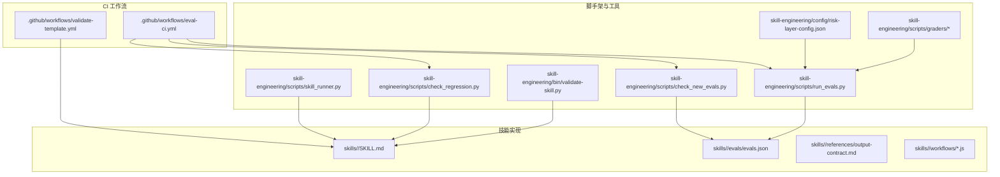
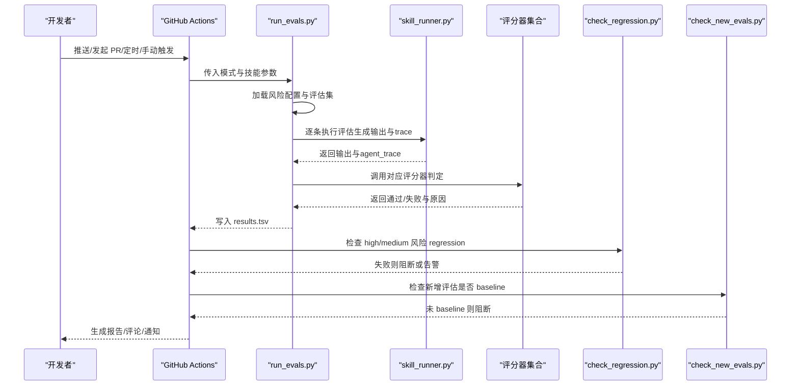
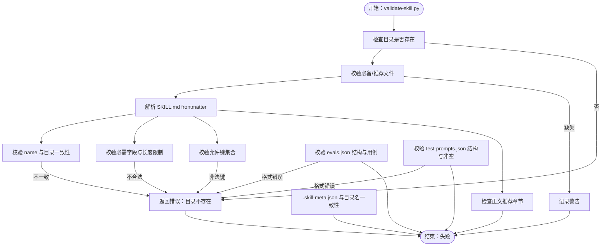
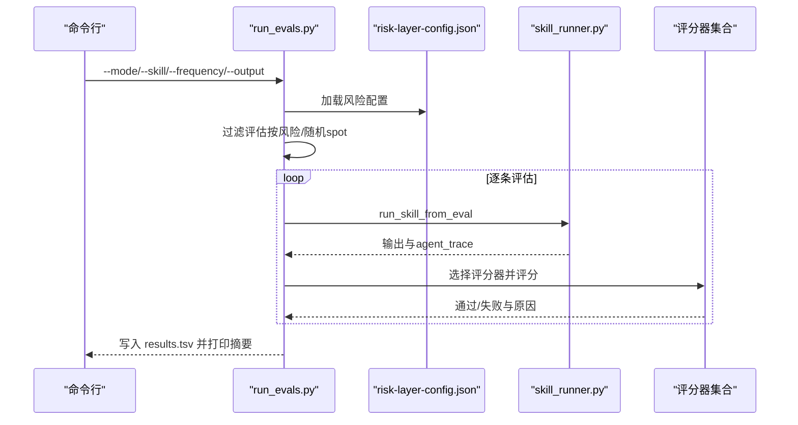
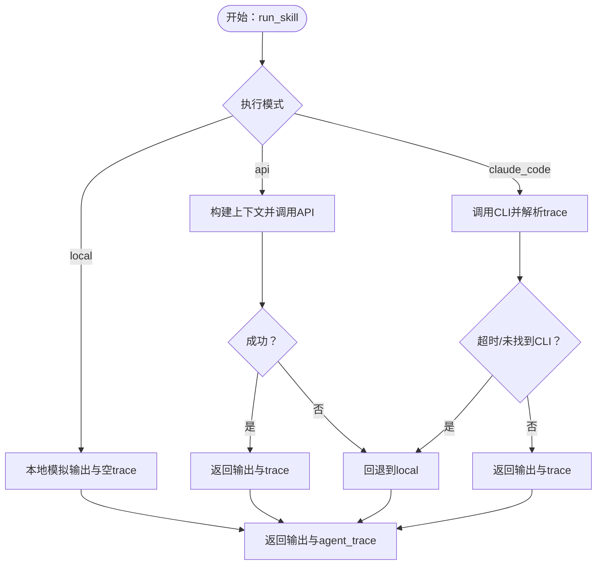
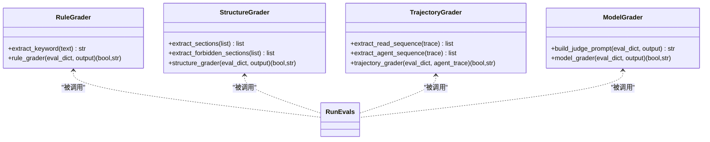
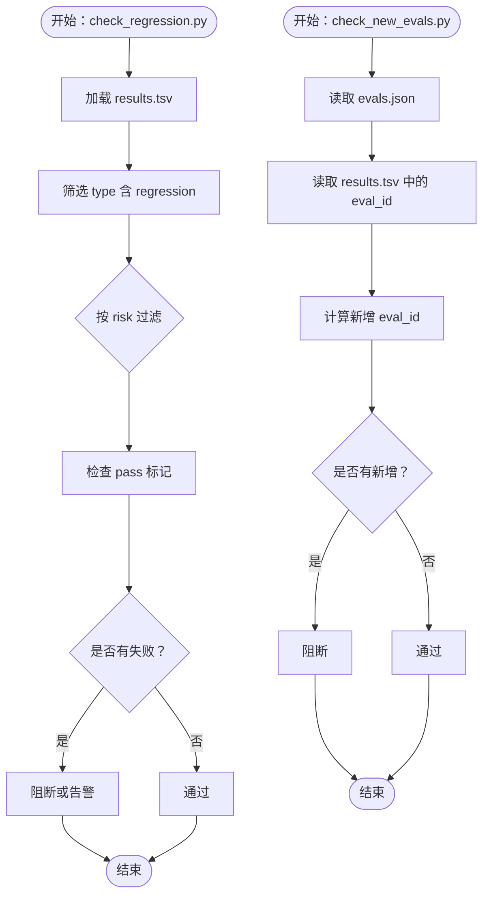
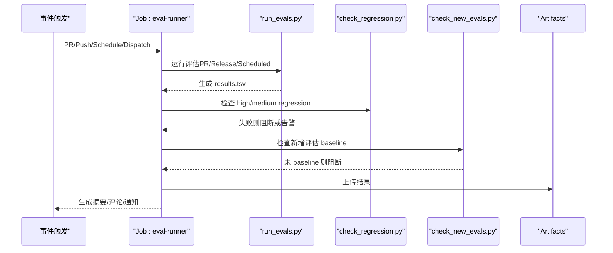
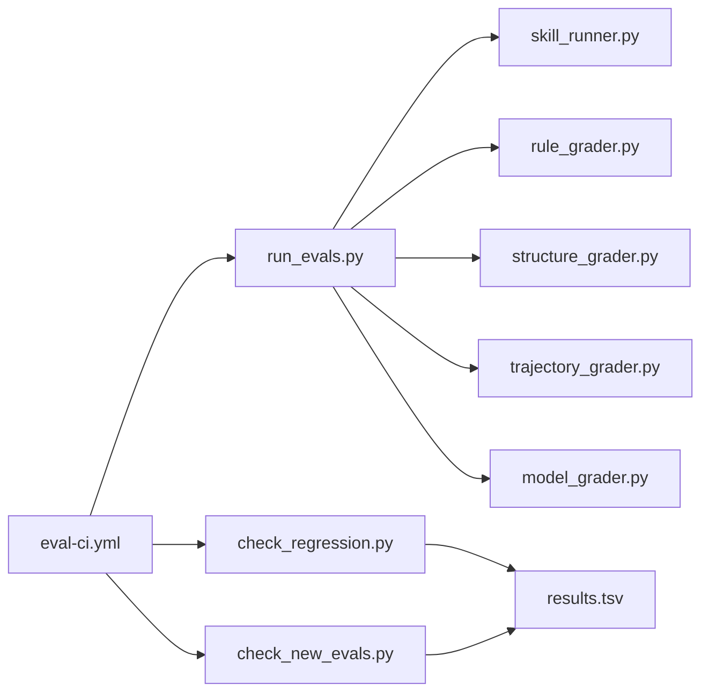

# 调试与故障排除

<cite>
**本文引用的文件**
- [validate-skill.py](file://plugins/frontend-team-toolkit/skill-engineering/bin/validate-skill.py)
- [check_regression.py](file://plugins/frontend-team-toolkit/skill-engineering/scripts/check_regression.py)
- [check_new_evals.py](file://plugins/frontend-team-toolkit/skill-engineering/scripts/check_new_evals.py)
- [run_evals.py](file://plugins/frontend-team-toolkit/skill-engineering/scripts/run_evals.py)
- [skill_runner.py](file://plugins/frontend-team-toolkit/skill-engineering/scripts/skill_runner.py)
- [rule_grader.py](file://plugins/frontend-team-toolkit/skill-engineering/scripts/graders/rule_grader.py)
- [structure_grader.py](file://plugins/frontend-team-toolkit/skill-engineering/scripts/graders/structure_grader.py)
- [trajectory_grader.py](file://plugins/frontend-team-toolkit/skill-engineering/scripts/graders/trajectory_grader.py)
- [model_grader.py](file://plugins/frontend-team-toolkit/skill-engineering/scripts/graders/model_grader.py)
- [risk-layer-config.json](file://plugins/frontend-team-toolkit/skill-engineering/config/risk-layer-config.json)
- [eval-ci.yml](file://.github/workflows/eval-ci.yml)
- [validate-template.yml](file://.github/workflows/validate-template.yml)
- [SKILL.md（模板）](file://plugins/frontend-team-toolkit/skill-engineering/templates/new-skill/SKILL.md)
- [.skill-meta.json（模板）](file://plugins/frontend-team-toolkit/skill-engineering/templates/new-skill/.skill-meta.json)
- [SKILL.md（示例：微信文章评审）](file://plugins/frontend-team-toolkit/skills/wechat-article-review/SKILL.md)
- [evals.json（示例：微信文章评审）](file://plugins/frontend-team-toolkit/skills/wechat-article-review/evals/evals.json)
- [skill-engineering/README.md](file://plugins/frontend-team-toolkit/skill-engineering/README.md)
</cite>

## 目录
1. [简介](#简介)
2. [项目结构](#项目结构)
3. [核心组件](#核心组件)
4. [架构总览](#架构总览)
5. [详细组件分析](#详细组件分析)
6. [依赖关系分析](#依赖关系分析)
7. [性能考虑](#性能考虑)
8. [故障排除指南](#故障排除指南)
9. [结论](#结论)
10. [附录](#附录)

## 简介
本指南聚焦于前端团队市场项目的调试与故障排除，围绕以下目标展开：
- 详尽说明 validate-skill.py 的使用方法，涵盖技能结构完整性、配置正确性与代码质量检查要点
- 解释回归测试与新评估检查脚本的工作原理与使用场景
- 提供常见问题的诊断方法，包括技能执行失败、评估结果异常、性能问题等
- 介绍日志分析技巧与调试工具的使用
- 总结性能优化与内存管理最佳实践
- 给出具体故障排除案例与解决方案
- 说明如何使用 GitHub Actions 进行自动化测试与 CI/CD 集成

## 项目结构
该仓库采用“脚手架 + 技能实现 + CI 工作流”的分层组织方式：
- 脚手架与工具：位于 plugins/frontend-team-toolkit/skill-engineering 下，包含模板、校验脚本、评估运行器与评分器
- 技能实现：位于 plugins/frontend-team-toolkit/skills 下，每个技能是一个独立目录，包含 SKILL.md、evals、references、workflows 等
- CI 工作流：位于 .github/workflows 下，定义 PR/Release/Schedule/手动触发的评估流水线

图表来源
- [validate-skill.py:1-193](file://plugins/frontend-team-toolkit/skill-engineering/bin/validate-skill.py#L1-L193)
- [run_evals.py:1-227](file://plugins/frontend-team-toolkit/skill-engineering/scripts/run_evals.py#L1-L227)
- [check_regression.py:1-100](file://plugins/frontend-team-toolkit/skill-engineering/scripts/check_regression.py#L1-L100)
- [check_new_evals.py:1-87](file://plugins/frontend-team-toolkit/skill-engineering/scripts/check_new_evals.py#L1-L87)
- [skill_runner.py:1-378](file://plugins/frontend-team-toolkit/skill-engineering/scripts/skill_runner.py#L1-L378)
- [risk-layer-config.json:1-70](file://plugins/frontend-team-toolkit/skill-engineering/config/risk-layer-config.json#L1-L70)
- [eval-ci.yml:1-208](file://.github/workflows/eval-ci.yml#L1-L208)
- [validate-template.yml:1-33](file://.github/workflows/validate-template.yml#L1-L33)

章节来源
- [skill-engineering/README.md:1-294](file://plugins/frontend-team-toolkit/skill-engineering/README.md#L1-L294)

## 核心组件
- validate-skill.py：校验技能目录结构、SKILL.md frontmatter、必要文件存在性与基本约束
- run_evals.py：按 CI 模式（PR/Release/Scheduled）筛选并运行评估，聚合结果
- skill_runner.py：执行技能并捕获输出与 agent_trace，支持本地/Anthropic API/Claude Code 三种执行模式
- 四类评分器：rule_grader、structure_grader、trajectory_grader、model_grader，分别负责关键词/路径/禁用词、章节/步骤/元数据、调用序列、语义质量
- check_regression.py：基于 results.tsv 检查 regression 评估失败并按风险级别控制是否阻断
- check_new_evals.py：检查新增评估是否已有 baseline 记录，未 baseline 则阻断
- risk-layer-config.json：定义 PR/Release/Scheduled 模式的风险过滤、阻断策略与评分器配置
- GitHub Actions 工作流：eval-ci.yml 与 validate-template.yml，分别驱动评估门禁与模板校验

章节来源
- [validate-skill.py:1-193](file://plugins/frontend-team-toolkit/skill-engineering/bin/validate-skill.py#L1-L193)
- [run_evals.py:1-227](file://plugins/frontend-team-toolkit/skill-engineering/scripts/run_evals.py#L1-L227)
- [skill_runner.py:1-378](file://plugins/frontend-team-toolkit/skill-engineering/scripts/skill_runner.py#L1-L378)
- [check_regression.py:1-100](file://plugins/frontend-team-toolkit/skill-engineering/scripts/check_regression.py#L1-L100)
- [check_new_evals.py:1-87](file://plugins/frontend-team-toolkit/skill-engineering/scripts/check_new_evals.py#L1-L87)
- [risk-layer-config.json:1-70](file://plugins/frontend-team-toolkit/skill-engineering/config/risk-layer-config.json#L1-L70)
- [eval-ci.yml:1-208](file://.github/workflows/eval-ci.yml#L1-L208)
- [validate-template.yml:1-33](file://.github/workflows/validate-template.yml#L1-L33)

## 架构总览
评估与门禁的整体流程如下：

图表来源
- [eval-ci.yml:36-158](file://.github/workflows/eval-ci.yml#L36-L158)
- [run_evals.py:135-174](file://plugins/frontend-team-toolkit/skill-engineering/scripts/run_evals.py#L135-L174)
- [skill_runner.py:328-356](file://plugins/frontend-team-toolkit/skill-engineering/scripts/skill_runner.py#L328-L356)
- [check_regression.py:57-96](file://plugins/frontend-team-toolkit/skill-engineering/scripts/check_regression.py#L57-L96)
- [check_new_evals.py:45-83](file://plugins/frontend-team-toolkit/skill-engineering/scripts/check_new_evals.py#L45-L83)

## 详细组件分析

### validate-skill.py：技能结构与配置校验
- 校验内容
  - 目录命名规范（kebab-case）
  - 必备文件存在性（SKILL.md、CHANGELOG.md、.skill-meta.json、evals/evals.json、test-prompts.json、references/output-contract.md）
  - 推荐文件存在性（results.tsv、skill-issues.jsonl.example、scripts/validate-output.sh）
  - SKILL.md frontmatter 键值合法性与必需字段（name、description 等）
  - SKILL.md 正文推荐章节完整性（when not to use、workflow、checkpoint）
  - .skill-meta.json 与目录名一致性
  - evals/evals.json 结构与用例完整性
  - test-prompts.json 类型与非空性
- 输出
  - 错误与警告列表，返回码用于 CI 门禁
- 使用建议
  - 在本地与 CI 中均运行，确保 PR 合并前无致命错误
  - 将 warnings 作为持续改进项逐步补齐

图表来源
- [validate-skill.py:83-167](file://plugins/frontend-team-toolkit/skill-engineering/bin/validate-skill.py#L83-L167)

章节来源
- [validate-skill.py:1-193](file://plugins/frontend-team-toolkit/skill-engineering/bin/validate-skill.py#L1-L193)

### run_evals.py：评估运行器与结果聚合
- 功能
  - 加载风险层配置（PR/Release/Scheduled）
  - 读取技能评估集，按风险过滤与随机 spot check
  - 逐条执行技能（skill_runner），调用评分器（rule/structure/trajectory/model/human）
  - 写入 TSV 结果，汇总统计并通过返回码控制 CI
- 关键点
  - 支持复合评分器（rule+human、structure+human 等）
  - trajectory 评估依赖 agent_trace
  - model 评分器支持多样本投票
- 使用场景
  - PR 触发：高/中风险评估
  - Release 触发：全量评估
  - Scheduled 触发：按频率（weekly/monthly/quarterly）与 spot check

图表来源
- [run_evals.py:135-174](file://plugins/frontend-team-toolkit/skill-engineering/scripts/run_evals.py#L135-L174)
- [skill_runner.py:328-356](file://plugins/frontend-team-toolkit/skill-engineering/scripts/skill_runner.py#L328-L356)
- [risk-layer-config.json:1-70](file://plugins/frontend-team-toolkit/skill-engineering/config/risk-layer-config.json#L1-L70)

章节来源
- [run_evals.py:1-227](file://plugins/frontend-team-toolkit/skill-engineering/scripts/run_evals.py#L1-L227)

### skill_runner.py：技能执行与 trace 捕获
- 执行模式
  - local：本地模拟输出（适合测试）
  - api：调用 Anthropic API（需密钥）
  - claude_code：调用 Claude Code CLI（需安装）
- 上下文构建
  - 从 SKILL.md 与 references/* 生成技能上下文
- trace 解析
  - 从输出中解析 [TRACE] 标记，提取工具调用序列
- 超时与错误处理
  - Claude Code 执行超时与异常捕获
  - API 调用失败回退至 local 模式

图表来源
- [skill_runner.py:84-326](file://plugins/frontend-team-toolkit/skill-engineering/scripts/skill_runner.py#L84-L326)

章节来源
- [skill_runner.py:1-378](file://plugins/frontend-team-toolkit/skill-engineering/scripts/skill_runner.py#L1-L378)

### 评分器：rule/structure/trajectory/model
- rule_grader
  - 检查“必须包含/不得包含”关键词、路径、章节
  - 支持多种中文表达与引号包裹
- structure_grader
  - 检查章节存在性、禁用章节、frontmatter 存在与字段
  - 支持 step/步骤检查
- trajectory_grader
  - 从 agent_trace 提取 Read/Agent 调用序列
  - 检查顺序、串行/并行约束、是否跳过子技能
- model_grader
  - LLM Judge 语义评分，支持本地模拟与 API 模式
  - 多样本投票以降低漂移风险

图表来源
- [rule_grader.py:1-110](file://plugins/frontend-team-toolkit/skill-engineering/scripts/graders/rule_grader.py#L1-L110)
- [structure_grader.py:1-155](file://plugins/frontend-team-toolkit/skill-engineering/scripts/graders/structure_grader.py#L1-L155)
- [trajectory_grader.py:1-163](file://plugins/frontend-team-toolkit/skill-engineering/scripts/graders/trajectory_grader.py#L1-L163)
- [model_grader.py:1-273](file://plugins/frontend-team-toolkit/skill-engineering/scripts/graders/model_grader.py#L1-L273)
- [run_evals.py:84-132](file://plugins/frontend-team-toolkit/skill-engineering/scripts/run_evals.py#L84-L132)

章节来源
- [rule_grader.py:1-110](file://plugins/frontend-team-toolkit/skill-engineering/scripts/graders/rule_grader.py#L1-L110)
- [structure_grader.py:1-155](file://plugins/frontend-team-toolkit/skill-engineering/scripts/graders/structure_grader.py#L1-L155)
- [trajectory_grader.py:1-163](file://plugins/frontend-team-toolkit/skill-engineering/scripts/graders/trajectory_grader.py#L1-L163)
- [model_grader.py:1-273](file://plugins/frontend-team-toolkit/skill-engineering/scripts/graders/model_grader.py#L1-L273)

### 回归与新评估检查：check_regression.py 与 check_new_evals.py
- check_regression.py
  - 从 results.tsv 读取评估记录，筛选 type 含 “regression”
  - 支持 risk 过滤（all/high/medium/low）
  - 支持 block 控制是否阻断
- check_new_evals.py
  - 读取技能 evals.json，对比 results.tsv 中已存在的 eval_id
  - 未 baseline 的新增评估阻断合并

图表来源
- [check_regression.py:22-96](file://plugins/frontend-team-toolkit/skill-engineering/scripts/check_regression.py#L22-L96)
- [check_new_evals.py:22-83](file://plugins/frontend-team-toolkit/skill-engineering/scripts/check_new_evals.py#L22-L83)

章节来源
- [check_regression.py:1-100](file://plugins/frontend-team-toolkit/skill-engineering/scripts/check_regression.py#L1-L100)
- [check_new_evals.py:1-87](file://plugins/frontend-team-toolkit/skill-engineering/scripts/check_new_evals.py#L1-L87)

### GitHub Actions：CI/CD 集成
- eval-ci.yml
  - 触发时机：PR、Push main、Schedule、workflow_dispatch
  - 步骤：安装依赖、检测变更技能、按模式运行评估、门禁检查、上传结果、生成摘要、PR 失败评论、Slack 通知
  - 人类审核门禁：Release 时创建 Issue 触发人工审核
- validate-template.yml
  - 仓库级 marketplace 模板校验

图表来源
- [eval-ci.yml:36-158](file://.github/workflows/eval-ci.yml#L36-L158)

章节来源
- [eval-ci.yml:1-208](file://.github/workflows/eval-ci.yml#L1-L208)
- [validate-template.yml:1-33](file://.github/workflows/validate-template.yml#L1-L33)

## 依赖关系分析
- 组件耦合
  - run_evals.py 依赖 skill_runner.py 与各评分器
  - check_regression.py 与 check_new_evals.py 依赖 results.tsv 的稳定格式
  - GitHub Actions 依赖脚本的返回码与输出文件
- 外部依赖
  - Anthropic API（可选，用于 model_grader 与 skill_runner 的 API 模式）
  - Claude Code CLI（可选，用于 skill_runner 的 claude_code 模式）

图表来源
- [run_evals.py:25-35](file://plugins/frontend-team-toolkit/skill-engineering/scripts/run_evals.py#L25-L35)
- [skill_runner.py:1-378](file://plugins/frontend-team-toolkit/skill-engineering/scripts/skill_runner.py#L1-L378)
- [check_regression.py:22-34](file://plugins/frontend-team-toolkit/skill-engineering/scripts/check_regression.py#L22-L34)
- [check_new_evals.py:22-42](file://plugins/frontend-team-toolkit/skill-engineering/scripts/check_new_evals.py#L22-L42)
- [eval-ci.yml:66-141](file://.github/workflows/eval-ci.yml#L66-L141)

章节来源
- [run_evals.py:1-227](file://plugins/frontend-team-toolkit/skill-engineering/scripts/run_evals.py#L1-L227)
- [skill_runner.py:1-378](file://plugins/frontend-team-toolkit/skill-engineering/scripts/skill_runner.py#L1-L378)
- [check_regression.py:1-100](file://plugins/frontend-team-toolkit/skill-engineering/scripts/check_regression.py#L1-L100)
- [check_new_evals.py:1-87](file://plugins/frontend-team-toolkit/skill-engineering/scripts/check_new_evals.py#L1-L87)
- [eval-ci.yml:1-208](file://.github/workflows/eval-ci.yml#L1-L208)

## 性能考虑
- 评估运行性能
  - PR 模式仅运行 high/medium 风险，减少耗时
  - Scheduled 模式按频率与 spot check 控制评估规模
  - model 评分器支持多样本投票，平衡成本与稳定性
- 执行模式选择
  - 本地模式适合快速验证与开发
  - API/CLI 模式更贴近生产，但需注意网络与超时
- trace 解析与日志
  - 通过 [TRACE] 标记与 agent_trace 字段定位工具调用链
  - 将关键信息写入输出便于后续分析

[本节为通用指导，无需特定文件引用]

## 故障排除指南

### validate-skill.py 常见问题
- 目录名不符合 kebab-case
  - 现象：错误提示目录名格式不合法
  - 处理：统一改为小写字母、数字与短横线组合
- 缺失必备文件
  - 现象：错误提示缺少 SKILL.md/CHANGELOG.md/.skill-meta.json/evals/evals.json/test-prompts.json/references/output-contract.md
  - 处理：使用 new-skill.sh 生成模板并补齐
- frontmatter 键不合法或缺失
  - 现象：错误提示非法键或缺少 name/description
  - 处理：参考模板 SKILL.md，确保键在允许集合内且满足长度与格式要求
- evals.json 格式错误或用例不完整
  - 现象：错误提示 JSON 解析失败或用例缺少 id/prompt
  - 处理：参照示例 evals.json，补齐字段并保证结构正确
- test-prompts.json 非数组或为空
  - 现象：错误提示类型不符或为空
  - 处理：确保为 JSON 数组且包含有效提示

章节来源
- [validate-skill.py:83-167](file://plugins/frontend-team-toolkit/skill-engineering/bin/validate-skill.py#L83-L167)
- [SKILL.md（模板）:1-97](file://plugins/frontend-team-toolkit/skill-engineering/templates/new-skill/SKILL.md#L1-L97)
- [.skill-meta.json（模板）:1-32](file://plugins/frontend-team-toolkit/skill-engineering/templates/new-skill/.skill-meta.json#L1-L32)
- [evals.json（示例：微信文章评审）:1-213](file://plugins/frontend-team-toolkit/skills/wechat-article-review/evals/evals.json#L1-L213)

### 评估运行失败（run_evals.py）
- 评估用例未通过
  - 现象：results.tsv 中某条 pass 为 ❌ 或 ⚠️
  - 诊断：查看该条 reason 字段，结合 rule/structure/trajectory/model 评分器规则定位
  - 处理：修正技能实现或调整评估用例
- agent_trace 为空导致 trajectory 评估失败
  - 现象：轨迹评估返回“agent_trace 为空”
  - 诊断：确认执行模式是否产生 trace（仅 API/CLI 模式可生成 trace）
  - 处理：切换到 API/CLI 模式或在本地模式下避免 trajectory 评估
- 评分器异常
  - 现象：model 评分器报错或返回不确定结果
  - 诊断：检查 LLM 密钥与模型配置
  - 处理：配置 ANTHROPIC_API_KEY 或切换本地模式

章节来源
- [run_evals.py:84-132](file://plugins/frontend-team-toolkit/skill-engineering/scripts/run_evals.py#L84-L132)
- [skill_runner.py:298-305](file://plugins/frontend-team-toolkit/skill-engineering/scripts/skill_runner.py#L298-L305)
- [model_grader.py:71-94](file://plugins/frontend-team-toolkit/skill-engineering/scripts/graders/model_grader.py#L71-L94)

### 回归检查失败（check_regression.py）
- high 风险 regression 失败
  - 现象：阻断合并
  - 处理：修复导致退化的变更，重新运行评估并更新 results.tsv
- medium 风险 regression 失败
  - 现象：告警但不阻断
  - 处理：记录问题并尽快修复
- risk 过滤不当
  - 现象：误判或漏判
  - 处理：调整 risk-layer-config.json 中的风险过滤策略

章节来源
- [check_regression.py:37-96](file://plugins/frontend-team-toolkit/skill-engineering/scripts/check_regression.py#L37-L96)
- [risk-layer-config.json:1-70](file://plugins/frontend-team-toolkit/skill-engineering/config/risk-layer-config.json#L1-L70)

### 新评估未 baseline（check_new_evals.py）
- 现象：新增评估未在 results.tsv 中出现
- 处理：先运行 baseline，将结果写入 results.tsv，再允许合并

章节来源
- [check_new_evals.py:62-83](file://plugins/frontend-team-toolkit/skill-engineering/scripts/check_new_evals.py#L62-L83)

### GitHub Actions 失败
- PR 门禁失败
  - 现象：PR 评论与 Slack 通知
  - 处理：修复 regression 或新增评估 baseline 后重新提交
- Release 门禁
  - 现象：创建人工审核 Issue
  - 处理：按要求完成人工审核后再发布
- 依赖安装失败
  - 现象：安装 anthropic 或 requirements.txt 失败
  - 处理：检查网络与权限，必要时缓存依赖

章节来源
- [eval-ci.yml:116-184](file://.github/workflows/eval-ci.yml#L116-L184)

### 日志分析与调试技巧
- 本地复现
  - 使用 run_evals.py 的本地模式与最小化评估集快速定位问题
- trace 分析
  - 在输出中查找 [TRACE] 标记，结合 skill_runner 的 trace 解析逻辑排查工具调用顺序
- 模板与示例对照
  - 对照 SKILL.md（模板）与示例技能（如 wechat-article-review）的结构与字段，确保一致性

章节来源
- [skill_runner.py:286-294](file://plugins/frontend-team-toolkit/skill-engineering/scripts/skill_runner.py#L286-L294)
- [SKILL.md（模板）:1-97](file://plugins/frontend-team-toolkit/skill-engineering/templates/new-skill/SKILL.md#L1-L97)
- [SKILL.md（示例：微信文章评审）:1-105](file://plugins/frontend-team-toolkit/skills/wechat-article-review/SKILL.md#L1-L105)

### 性能优化与内存管理最佳实践
- 控制评估规模
  - PR 模式仅运行高/中风险；Scheduled 模式按频率与 spot check 限制
- 评分器选择
  - rule/structure/trajectory 为纯文本分析，成本低；model 评分器按需启用多样本投票
- 执行模式
  - 开发阶段使用本地模式；生产验证使用 API/CLI 模式
- 超时与重试
  - CLI 执行设置合理超时；API 调用失败时回退本地模式

章节来源
- [run_evals.py:144-159](file://plugins/frontend-team-toolkit/skill-engineering/scripts/run_evals.py#L144-L159)
- [skill_runner.py:298-305](file://plugins/frontend-team-toolkit/skill-engineering/scripts/skill_runner.py#L298-L305)
- [model_grader.py:202-226](file://plugins/frontend-team-toolkit/skill-engineering/scripts/graders/model_grader.py#L202-L226)

### 典型故障排除案例
- 案例1：SKILL.md frontmatter 缺少 description
  - 现象：validate-skill.py 报错“Frontmatter missing 'description'”
  - 处理：补齐 description 并确保长度与格式符合要求
- 案例2：trajectory 评估失败（agent_trace 为空）
  - 现象：轨迹评估返回“agent_trace 为空”
  - 处理：切换到 API/CLI 模式或在本地模式下避免 trajectory 评估
- 案例3：PR 合并被阻断（regression high 失败）
  - 现象：CI 评论与 Slack 通知
  - 处理：修复导致退化的变更，重新运行评估并更新 results.tsv

章节来源
- [validate-skill.py:109-127](file://plugins/frontend-team-toolkit/skill-engineering/bin/validate-skill.py#L109-L127)
- [skill_runner.py:298-305](file://plugins/frontend-team-toolkit/skill-engineering/scripts/skill_runner.py#L298-L305)
- [eval-ci.yml:159-175](file://.github/workflows/eval-ci.yml#L159-L175)

## 结论
本指南系统梳理了 validate-skill.py、评估运行器、评分器、回归与新评估检查脚本以及 GitHub Actions 的使用与故障排除方法。通过本地校验、CI 门禁与 trace 分析，可以高效定位并解决技能执行失败、评估结果异常与性能问题，保障技能质量与发布安全。

[本节为总结，无需特定文件引用]

## 附录
- 快速参考
  - 本地校验技能结构：python3 plugins/frontend-team-toolkit/skill-engineering/bin/validate-skill.py <skill-path>
  - 本地运行评估（PR 模式）：python3 plugins/frontend-team-toolkit/skill-engineering/scripts/run_evals.py --mode pr --skill <skill-name> --output results.tsv
  - 检查 regression：python3 plugins/frontend-team-toolkit/skill-engineering/scripts/check_regression.py --results results.tsv --risk high --block true
  - 检查新增评估 baseline：python3 plugins/frontend-team-toolkit/skill-engineering/scripts/check_new_evals.py --skill <skill-name> --results results.tsv
- 参考模板与示例
  - SKILL.md（模板）：plugins/frontend-team-toolkit/skill-engineering/templates/new-skill/SKILL.md
  - .skill-meta.json（模板）：plugins/frontend-team-toolkit/skill-engineering/templates/new-skill/.skill-meta.json
  - 示例技能（微信文章评审）：plugins/frontend-team-toolkit/skills/wechat-article-review/SKILL.md
  - 示例评估集：plugins/frontend-team-toolkit/skills/wechat-article-review/evals/evals.json

章节来源
- [skill-engineering/README.md:208-224](file://plugins/frontend-team-toolkit/skill-engineering/README.md#L208-L224)
- [SKILL.md（模板）:1-97](file://plugins/frontend-team-toolkit/skill-engineering/templates/new-skill/SKILL.md#L1-L97)
- [.skill-meta.json（模板）:1-32](file://plugins/frontend-team-toolkit/skill-engineering/templates/new-skill/.skill-meta.json#L1-L32)
- [SKILL.md（示例：微信文章评审）:1-105](file://plugins/frontend-team-toolkit/skills/wechat-article-review/SKILL.md#L1-L105)
- [evals.json（示例：微信文章评审）:1-213](file://plugins/frontend-team-toolkit/skills/wechat-article-review/evals/evals.json#L1-L213)