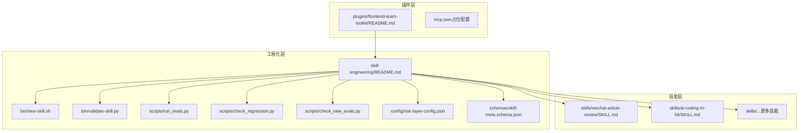
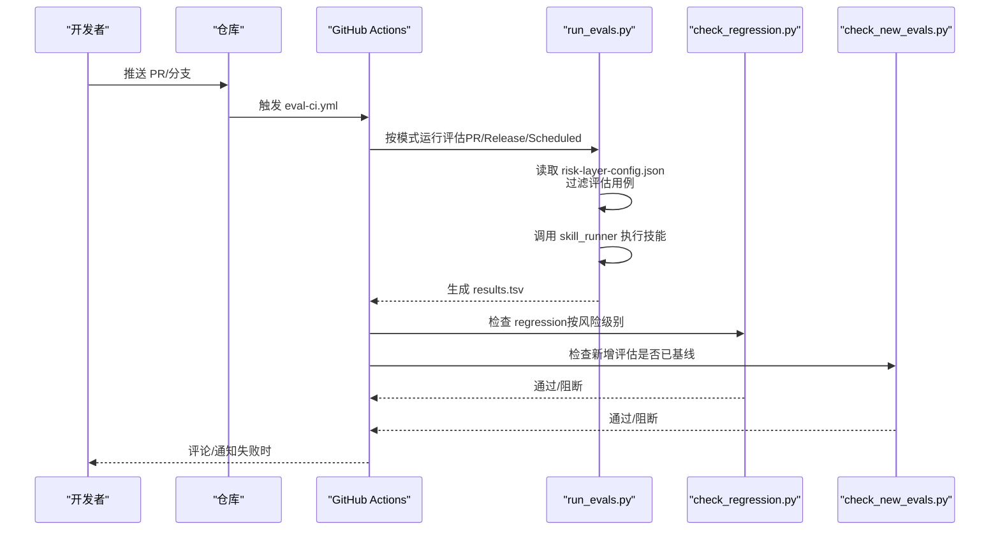
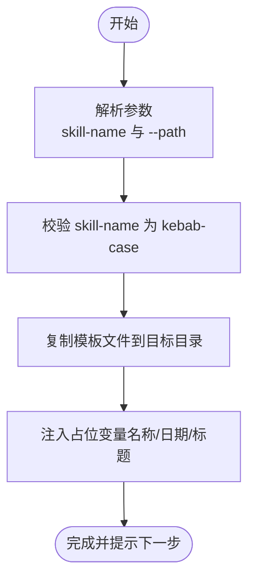
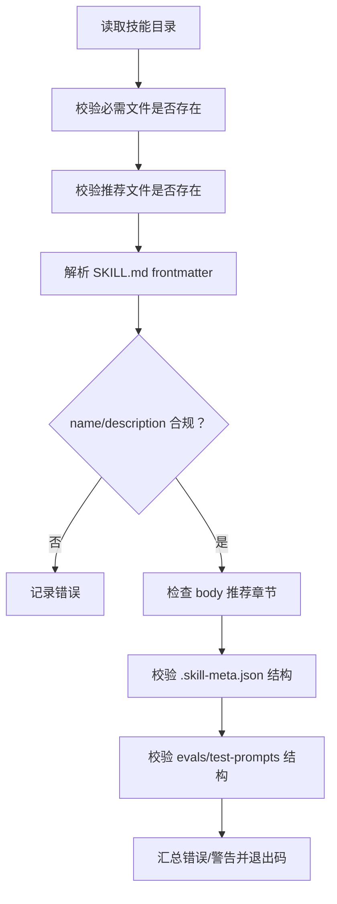
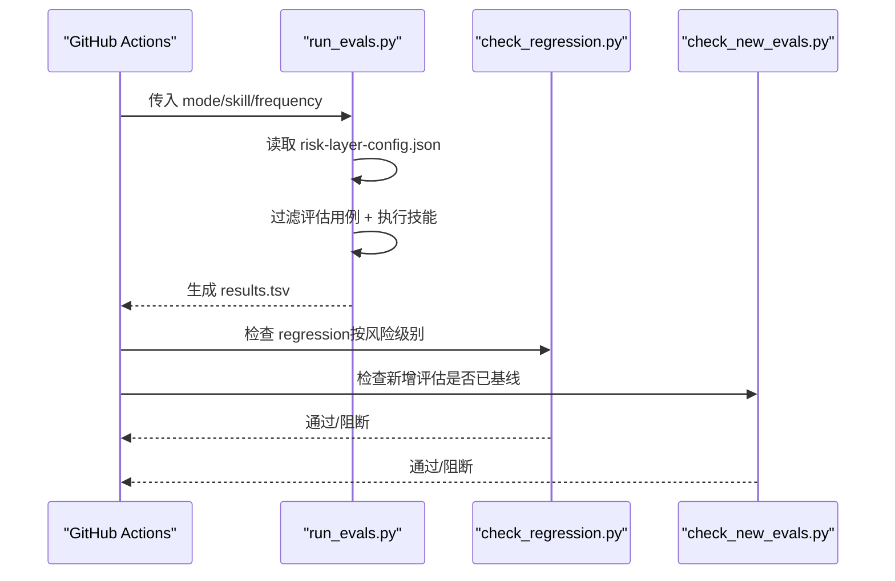
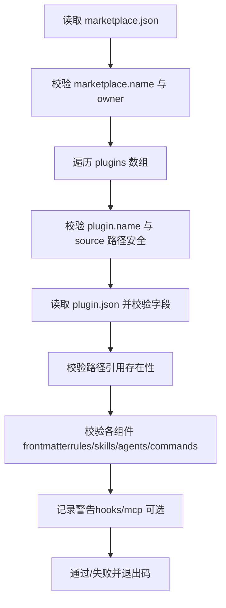
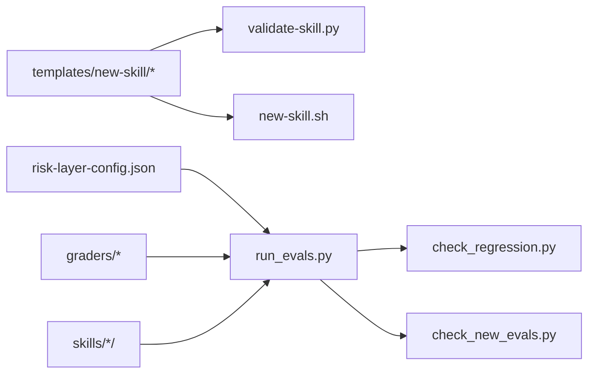

# 贡献指南

<cite>
**本文档引用的文件**
- [plugins/frontend-team-toolkit/README.md](file://plugins/frontend-team-toolkit/README.md)
- [plugins/frontend-team-toolkit/skill-engineering/README.md](file://plugins/frontend-team-toolkit/skill-engineering/README.md)
- [.github/workflows/eval-ci.yml](file://.github/workflows/eval-ci.yml)
- [.github/workflows/validate-template.yml](file://.github/workflows/validate-template.yml)
- [scripts/validate-template.mjs](file://scripts/validate-template.mjs)
- [plugins/frontend-team-toolkit/skill-engineering/bin/new-skill.sh](file://plugins/frontend-team-toolkit/skill-engineering/bin/new-skill.sh)
- [plugins/frontend-team-toolkit/skill-engineering/bin/validate-skill.py](file://plugins/frontend-team-toolkit/skill-engineering/bin/validate-skill.py)
- [plugins/frontend-team-toolkit/skill-engineering/scripts/run_evals.py](file://plugins/frontend-team-toolkit/skill-engineering/scripts/run_evals.py)
- [plugins/frontend-team-toolkit/skill-engineering/scripts/check_regression.py](file://plugins/frontend-team-toolkit/skill-engineering/scripts/check_regression.py)
- [plugins/frontend-team-toolkit/skill-engineering/scripts/check_new_evals.py](file://plugins/frontend-team-toolkit/skill-engineering/scripts/check_new_evals.py)
- [plugins/frontend-team-toolkit/skill-engineering/scripts/skill_runner.py](file://plugins/frontend-team-toolkit/skill-engineering/scripts/skill_runner.py)
- [plugins/frontend-team-toolkit/skill-engineering/scripts/graders/rule_grader.py](file://plugins/frontend-team-toolkit/skill-engineering/scripts/graders/rule_grader.py)
- [plugins/frontend-team-toolkit/skill-engineering/scripts/graders/structure_grader.py](file://plugins/frontend-team-toolkit/skill-engineering/scripts/graders/structure_grader.py)
- [plugins/frontend-team-toolkit/skill-engineering/config/risk-layer-config.json](file://plugins/frontend-team-toolkit/skill-engineering/config/risk-layer-config.json)
- [plugins/frontend-team-toolkit/skill-engineering/schemas/skill-meta.schema.json](file://plugins/frontend-team-toolkit/skill-engineering/schemas/skill-meta.schema.json)
- [plugins/frontend-team-toolkit/skill-engineering/templates/new-skill/.skill-meta.json](file://plugins/frontend-team-toolkit/skill-engineering/templates/new-skill/.skill-meta.json)
- [plugins/frontend-team-toolkit/skills/wechat-article-review/SKILL.md](file://plugins/frontend-team-toolkit/skills/wechat-article-review/SKILL.md)
</cite>

## 目录
1. [简介](#简介)
2. [项目结构](#项目结构)
3. [核心组件](#核心组件)
4. [架构总览](#架构总览)
5. [详细组件分析](#详细组件分析)
6. [依赖关系分析](#依赖关系分析)
7. [性能考虑](#性能考虑)
8. [故障排查指南](#故障排查指南)
9. [版本管理与发布流程](#版本管理与发布流程)
10. [贡献示例与模板](#贡献示例与模板)
11. [结语](#结语)

## 简介
本指南面向希望参与“前端团队市场插件”（Frontend Team Toolkit）开发的社区成员，帮助你高效地提交新技能、修复缺陷、改进现有功能。文档涵盖从本地开发到CI/CD门禁的全流程，包括：
- 如何创建新技能骨架与结构校验
- CI/CD 工作流（评估CI与模板验证）的配置与使用
- 代码与文档规范、测试要求
- 社区协作方式（讨论、问题与建议）
- 版本管理与发布流程（变更日志、版本标记）

## 项目结构
该项目以“插件 + 技能 + 工程化脚手架”的三层组织方式构建：
- 插件层：插件清单与占位配置，用于注册与分发
- 技能层：实际可被 Cursor 使用的 Agent Skill 实现
- 工程化层：脚手架、校验器、CI 门禁脚本与 JSON Schema

图表来源
- [plugins/frontend-team-toolkit/README.md:1-50](file://plugins/frontend-team-toolkit/README.md#L1-L50)
- [plugins/frontend-team-toolkit/skill-engineering/README.md:1-294](file://plugins/frontend-team-toolkit/skill-engineering/README.md#L1-L294)

章节来源
- [plugins/frontend-team-toolkit/README.md:1-50](file://plugins/frontend-team-toolkit/README.md#L1-L50)
- [plugins/frontend-team-toolkit/skill-engineering/README.md:1-294](file://plugins/frontend-team-toolkit/skill-engineering/README.md#L1-L294)

## 核心组件
- 脚手架与模板：提供标准化的新技能骨架与动态编排模板
- 结构校验器：确保 SKILL.md frontmatter 与必备文件齐全
- CI 门禁：基于风险分层的评估回归、新增评估基线检查
- JSON Schema：约束 evals、test-prompts、meta、issues、workflows 等结构
- 模板验证：校验市场清单与插件清单一致性

章节来源
- [plugins/frontend-team-toolkit/skill-engineering/README.md:130-165](file://plugins/frontend-team-toolkit/skill-engineering/README.md#L130-L165)
- [plugins/frontend-team-toolkit/skill-engineering/bin/validate-skill.py:26-39](file://plugins/frontend-team-toolkit/skill-engineering/bin/validate-skill.py#L26-L39)
- [plugins/frontend-team-toolkit/skill-engineering/schemas/skill-meta.schema.json:1-25](file://plugins/frontend-team-toolkit/skill-engineering/schemas/skill-meta.schema.json#L1-L25)

## 架构总览
下图展示了从“提交代码”到“CI 门禁”的端到端流程，包括 PR 触发、发布前全量回归与定期回归。

图表来源
- [.github/workflows/eval-ci.yml:36-185](file://.github/workflows/eval-ci.yml#L36-L185)
- [plugins/frontend-team-toolkit/skill-engineering/scripts/run_evals.py:135-174](file://plugins/frontend-team-toolkit/skill-engineering/scripts/run_evals.py#L135-L174)
- [plugins/frontend-team-toolkit/skill-engineering/scripts/check_regression.py:37-54](file://plugins/frontend-team-toolkit/skill-engineering/scripts/check_regression.py#L37-L54)
- [plugins/frontend-team-toolkit/skill-engineering/scripts/check_new_evals.py:45-83](file://plugins/frontend-team-toolkit/skill-engineering/scripts/check_new_evals.py#L45-L83)

章节来源
- [.github/workflows/eval-ci.yml:1-208](file://.github/workflows/eval-ci.yml#L1-L208)
- [plugins/frontend-team-toolkit/skill-engineering/scripts/run_evals.py:1-227](file://plugins/frontend-team-toolkit/skill-engineering/scripts/run_evals.py#L1-L227)

## 详细组件分析

### 新建技能脚本 new-skill.sh
- 作用：从模板生成标准化技能目录，填充基础文件与占位信息
- 用法：支持指定输出目录，默认输出到插件内置 skills 目录
- 输出：提示下一步编辑 SKILL.md、添加 evals、结构校验与注册

图表来源
- [plugins/frontend-team-toolkit/skill-engineering/bin/new-skill.sh:12-121](file://plugins/frontend-team-toolkit/skill-engineering/bin/new-skill.sh#L12-L121)

章节来源
- [plugins/frontend-team-toolkit/skill-engineering/bin/new-skill.sh:1-121](file://plugins/frontend-team-toolkit/skill-engineering/bin/new-skill.sh#L1-L121)

### 结构校验器 validate-skill.py
- 作用：校验技能目录结构、SKILL.md frontmatter、必备/推荐文件
- 覆盖：目录命名、frontmatter 键、description 触发词、evals/test-prompts 结构等
- 输出：错误与警告列表，便于快速补齐

图表来源
- [plugins/frontend-team-toolkit/skill-engineering/bin/validate-skill.py:83-167](file://plugins/frontend-team-toolkit/skill-engineering/bin/validate-skill.py#L83-L167)

章节来源
- [plugins/frontend-team-toolkit/skill-engineering/bin/validate-skill.py:1-193](file://plugins/frontend-team-toolkit/skill-engineering/bin/validate-skill.py#L1-L193)

### CI 门禁：评估运行与回归检查
- 评估运行 run_evals.py：根据模式（PR/Release/Scheduled）加载风险配置，过滤评估用例并执行
- 回归检查 check_regression.py：筛选 regression 类型用例，按风险级别决定阻断策略
- 新增评估基线 check_new_evals.py：确保新增评估用例已跑过基线

图表来源
- [plugins/frontend-team-toolkit/skill-engineering/scripts/run_evals.py:135-174](file://plugins/frontend-team-toolkit/skill-engineering/scripts/run_evals.py#L135-L174)
- [plugins/frontend-team-toolkit/skill-engineering/scripts/check_regression.py:37-54](file://plugins/frontend-team-toolkit/skill-engineering/scripts/check_regression.py#L37-L54)
- [plugins/frontend-team-toolkit/skill-engineering/scripts/check_new_evals.py:45-83](file://plugins/frontend-team-toolkit/skill-engineering/scripts/check_new_evals.py#L45-L83)

章节来源
- [plugins/frontend-team-toolkit/skill-engineering/scripts/run_evals.py:1-227](file://plugins/frontend-team-toolkit/skill-engineering/scripts/run_evals.py#L1-L227)
- [plugins/frontend-team-toolkit/skill-engineering/scripts/check_regression.py:1-100](file://plugins/frontend-team-toolkit/skill-engineering/scripts/check_regression.py#L1-L100)
- [plugins/frontend-team-toolkit/skill-engineering/scripts/check_new_evals.py:1-87](file://plugins/frontend-team-toolkit/skill-engineering/scripts/check_new_evals.py#L1-L87)

### 模板验证脚本 validate-template.mjs
- 作用：校验市场清单与插件清单一致性，检查 frontmatter、路径引用、hooks/mcp 文件存在性
- 触发：PR/Push 到主分支时自动运行

图表来源
- [scripts/validate-template.mjs:250-359](file://scripts/validate-template.mjs#L250-L359)

章节来源
- [.github/workflows/validate-template.yml:1-33](file://.github/workflows/validate-template.yml#L1-L33)
- [scripts/validate-template.mjs:1-382](file://scripts/validate-template.mjs#L1-L382)

### 风险分层与门禁配置 risk-layer-config.json
- PR 模式：仅运行 high/medium 风险评估，high regression 挂必阻
- 发布前模式：运行全量评估，任何 regression 挂必阻
- 定期回归：按频率（weekly/monthly/quarterly）运行，支持随机 spot check
- 红线规则：新增评估未基线、技能变更未跑基线等必阻

章节来源
- [plugins/frontend-team-toolkit/skill-engineering/config/risk-layer-config.json:1-70](file://plugins/frontend-team-toolkit/skill-engineering/config/risk-layer-config.json#L1-L70)

### JSON Schema 与模板元数据
- skill-meta.schema.json：约束 .skill-meta.json 的结构与字段
- 模板 .skill-meta.json：提供默认元数据与工作流配置

章节来源
- [plugins/frontend-team-toolkit/skill-engineering/schemas/skill-meta.schema.json:1-25](file://plugins/frontend-team-toolkit/skill-engineering/schemas/skill-meta.schema.json#L1-L25)
- [plugins/frontend-team-toolkit/skill-engineering/templates/new-skill/.skill-meta.json:1-32](file://plugins/frontend-team-toolkit/skill-engineering/templates/new-skill/.skill-meta.json#L1-L32)

## 依赖关系分析
- 工程化层依赖关系：脚手架与校验器依赖模板与 Schema；CI 门禁脚本依赖风险配置与 graders；技能层依赖工程化层提供的结构与规范
- 外部依赖：Anthropic SDK（可选），Claude Code CLI（可选），Node.js（模板验证）

图表来源
- [plugins/frontend-team-toolkit/skill-engineering/bin/new-skill.sh:92-112](file://plugins/frontend-team-toolkit/skill-engineering/bin/new-skill.sh#L92-L112)
- [plugins/frontend-team-toolkit/skill-engineering/bin/validate-skill.py:83-167](file://plugins/frontend-team-toolkit/skill-engineering/bin/validate-skill.py#L83-L167)
- [plugins/frontend-team-toolkit/skill-engineering/scripts/run_evals.py:135-174](file://plugins/frontend-team-toolkit/skill-engineering/scripts/run_evals.py#L135-L174)
- [plugins/frontend-team-toolkit/skill-engineering/scripts/check_regression.py:37-54](file://plugins/frontend-team-toolkit/skill-engineering/scripts/check_regression.py#L37-L54)
- [plugins/frontend-team-toolkit/skill-engineering/scripts/check_new_evals.py:45-83](file://plugins/frontend-team-toolkit/skill-engineering/scripts/check_new_evals.py#L45-L83)

章节来源
- [plugins/frontend-team-toolkit/skill-engineering/README.md:130-205](file://plugins/frontend-team-toolkit/skill-engineering/README.md#L130-L205)

## 性能考虑
- 评估过滤：按风险分层减少 PR 与 Scheduled 模式下的评估数量，提高响应速度
- 随机 spot check：在定期回归中引入随机抽样，平衡覆盖率与成本
- 执行模式：支持本地模拟、API 直连与 Claude Code CLI，按环境选择最优执行路径

章节来源
- [plugins/frontend-team-toolkit/skill-engineering/scripts/run_evals.py:76-82](file://plugins/frontend-team-toolkit/skill-engineering/scripts/run_evals.py#L76-L82)
- [plugins/frontend-team-toolkit/skill-engineering/scripts/skill_runner.py:25-29](file://plugins/frontend-team-toolkit/skill-engineering/scripts/skill_runner.py#L25-L29)

## 故障排查指南
- CI 评估失败
  - 检查 results.tsv 中 regression 用例是否失败
  - 确认新增评估是否已跑过基线
  - 按风险级别决定是否阻断合并
- 结构校验失败
  - 按错误/警告提示补齐 SKILL.md frontmatter 与必备文件
  - 确保 evals/test-prompts 结构正确
- 模板验证失败
  - 检查 marketplace 与 plugin 清单字段、路径引用是否安全且存在
  - 确保各组件 frontmatter 字段齐全

章节来源
- [plugins/frontend-team-toolkit/skill-engineering/scripts/check_regression.py:57-96](file://plugins/frontend-team-toolkit/skill-engineering/scripts/check_regression.py#L57-L96)
- [plugins/frontend-team-toolkit/skill-engineering/scripts/check_new_evals.py:45-83](file://plugins/frontend-team-toolkit/skill-engineering/scripts/check_new_evals.py#L45-L83)
- [plugins/frontend-team-toolkit/skill-engineering/bin/validate-skill.py:170-189](file://plugins/frontend-team-toolkit/skill-engineering/bin/validate-skill.py#L170-L189)
- [scripts/validate-template.mjs:250-359](file://scripts/validate-template.mjs#L250-L359)

## 版本管理与发布流程
- 版本标记：.skill-meta.json 中 version 字段用于标识技能版本
- 变更日志：每个技能维护 CHANGELOG.md，记录重大变更与迁移
- 发布门禁：发布前需通过全量评估与人工复核（如配置了人类审核）
- 回归策略：PR 阻断 high 风险 regression；发布前阻断任何 regression；定期回归发现长期退化

章节来源
- [plugins/frontend-team-toolkit/skill-engineering/templates/new-skill/.skill-meta.json:3-7](file://plugins/frontend-team-toolkit/skill-engineering/templates/new-skill/.skill-meta.json#L3-L7)
- [plugins/frontend-team-toolkit/skill-engineering/README.md:172-188](file://plugins/frontend-team-toolkit/skill-engineering/README.md#L172-L188)
- [.github/workflows/eval-ci.yml:186-208](file://.github/workflows/eval-ci.yml#L186-L208)

## 贡献示例与模板

### 提交新技能的完整流程
- 使用脚手架创建骨架
  - 示例命令：[plugins/frontend-team-toolkit/skill-engineering/bin/new-skill.sh:12-28](file://plugins/frontend-team-toolkit/skill-engineering/bin/new-skill.sh#L12-L28)
- 本地结构校验
  - 示例命令：[plugins/frontend-team-toolkit/skill-engineering/bin/validate-skill.py:170-174](file://plugins/frontend-team-toolkit/skill-engineering/bin/validate-skill.py#L170-L174)
- 填写 SKILL.md、evals 与 test-prompts
  - 参考示例技能：[plugins/frontend-team-toolkit/skills/wechat-article-review/SKILL.md:1-105](file://plugins/frontend-team-toolkit/skills/wechat-article-review/SKILL.md#L1-L105)
- 跑基线并写入 results.tsv
  - 示例命令：[plugins/frontend-team-toolkit/skill-engineering/scripts/run_evals.py:189-208](file://plugins/frontend-team-toolkit/skill-engineering/scripts/run_evals.py#L189-L208)
- 注册到插件说明（如随团队发布）
  - 参考说明：[plugins/frontend-team-toolkit/README.md:27](file://plugins/frontend-team-toolkit/README.md#L27)

章节来源
- [plugins/frontend-team-toolkit/skill-engineering/README.md:9-32](file://plugins/frontend-team-toolkit/skill-engineering/README.md#L9-L32)
- [plugins/frontend-team-toolkit/skill-engineering/bin/new-skill.sh:12-121](file://plugins/frontend-team-toolkit/skill-engineering/bin/new-skill.sh#L12-L121)
- [plugins/frontend-team-toolkit/skill-engineering/bin/validate-skill.py:170-189](file://plugins/frontend-team-toolkit/skill-engineering/bin/validate-skill.py#L170-L189)
- [plugins/frontend-team-toolkit/skills/wechat-article-review/SKILL.md:1-105](file://plugins/frontend-team-toolkit/skills/wechat-article-review/SKILL.md#L1-L105)
- [plugins/frontend-team-toolkit/skill-engineering/scripts/run_evals.py:189-227](file://plugins/frontend-team-toolkit/skill-engineering/scripts/run_evals.py#L189-L227)
- [plugins/frontend-team-toolkit/README.md:27](file://plugins/frontend-team-toolkit/README.md#L27)

### CI/CD 使用示例
- 手动触发评估（测试）
  - 示例命令：[plugins/frontend-team-toolkit/skill-engineering/scripts/run_evals.py:209-216](file://plugins/frontend-team-toolkit/skill-engineering/scripts/run_evals.py#L209-L216)
- 本地回归检查
  - 示例命令：[plugins/frontend-team-toolkit/skill-engineering/scripts/check_regression.py:57-96](file://plugins/frontend-team-toolkit/skill-engineering/scripts/check_regression.py#L57-L96)
- 新增评估基线检查
  - 示例命令：[plugins/frontend-team-toolkit/skill-engineering/scripts/check_new_evals.py:45-83](file://plugins/frontend-team-toolkit/skill-engineering/scripts/check_new_evals.py#L45-L83)

章节来源
- [plugins/frontend-team-toolkit/skill-engineering/scripts/run_evals.py:209-224](file://plugins/frontend-team-toolkit/skill-engineering/scripts/run_evals.py#L209-L224)
- [plugins/frontend-team-toolkit/skill-engineering/scripts/check_regression.py:57-96](file://plugins/frontend-team-toolkit/skill-engineering/scripts/check_regression.py#L57-L96)
- [plugins/frontend-team-toolkit/skill-engineering/scripts/check_new_evals.py:45-83](file://plugins/frontend-team-toolkit/skill-engineering/scripts/check_new_evals.py#L45-L83)

### 代码规范与最佳实践
- 目录与文件命名
  - 技能目录使用 kebab-case（如 my-skill-name）
  - 必备文件：SKILL.md、CHANGELOG.md、.skill-meta.json、evals/evals.json、test-prompts.json、references/output-contract.md
  - 推荐文件：results.tsv、skill-issues.jsonl.example、scripts/validate-output.sh
- SKILL.md frontmatter
  - 必填：name、description
  - description 应包含“Use when”与触发词，长度限制与字符限制
- JSON Schema 校验
  - 使用对应 schema 校验 evals、test-prompts、skill-meta、issues、workflows
- 评估与回归
  - 优先补齐 test-prompts + results.tsv
  - 一轮只改一个假设，高风险 regression 失败不发布

章节来源
- [plugins/frontend-team-toolkit/skill-engineering/bin/validate-skill.py:26-39](file://plugins/frontend-team-toolkit/skill-engineering/bin/validate-skill.py#L26-L39)
- [plugins/frontend-team-toolkit/skill-engineering/bin/validate-skill.py:102-133](file://plugins/frontend-team-toolkit/skill-engineering/bin/validate-skill.py#L102-L133)
- [plugins/frontend-team-toolkit/skill-engineering/schemas/skill-meta.schema.json:1-25](file://plugins/frontend-team-toolkit/skill-engineering/schemas/skill-meta.schema.json#L1-L25)
- [plugins/frontend-team-toolkit/skill-engineering/README.md:250-257](file://plugins/frontend-team-toolkit/skill-engineering/README.md#L250-L257)

### 社区协作与沟通
- 讨论与问题
  - 在仓库 Issues 中创建问题，描述背景、期望与复现步骤
- 功能建议
  - 在 Issues 中提出建议，附带动机、影响范围与验收标准
- Pull Request 要求
  - 保持每次 PR 只解决一个问题
  - 提供评估用例与基线结果（如涉及技能）
  - 通过 CI 门禁与模板验证

章节来源
- [.github/workflows/eval-ci.yml:159-176](file://.github/workflows/eval-ci.yml#L159-L176)
- [.github/workflows/validate-template.yml:19-33](file://.github/workflows/validate-template.yml#L19-L33)

## 结语
感谢你对技能工程框架的关注与贡献。请遵循上述流程与规范，确保每次改动都经过充分评估与校验，共同提升技能质量与交付稳定性。