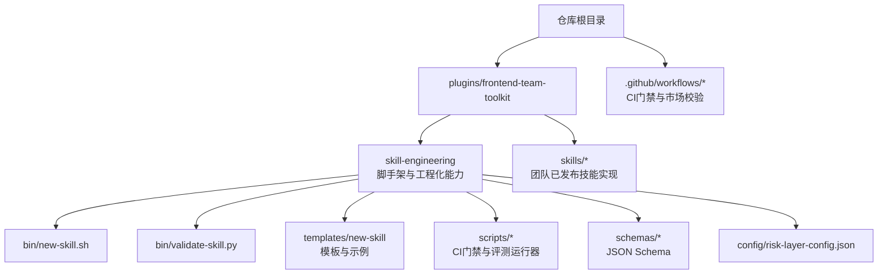
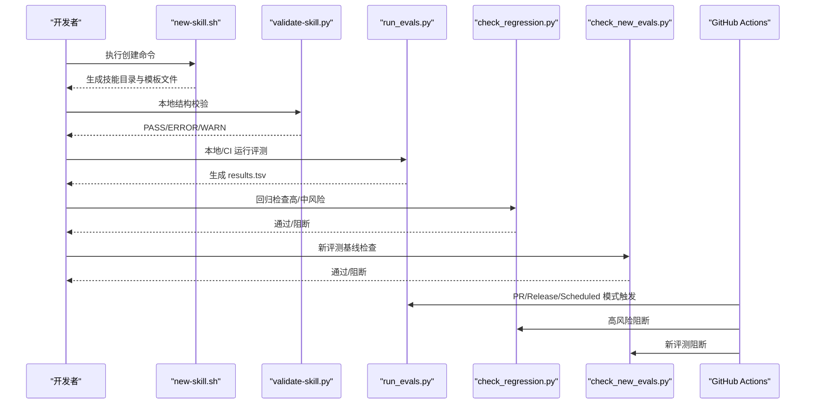
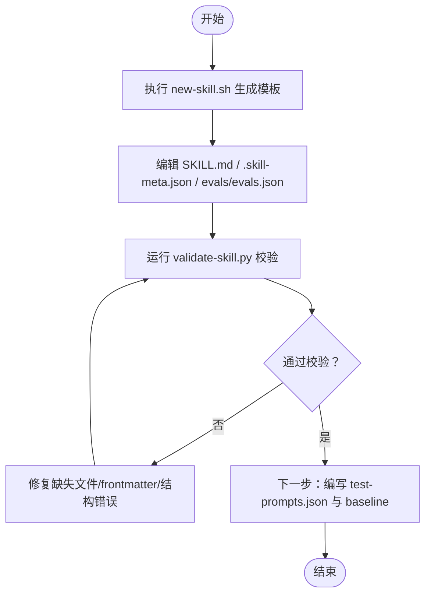
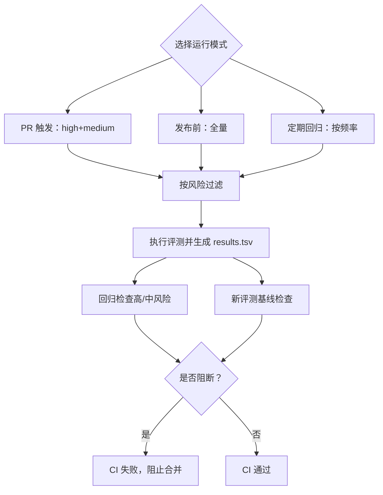
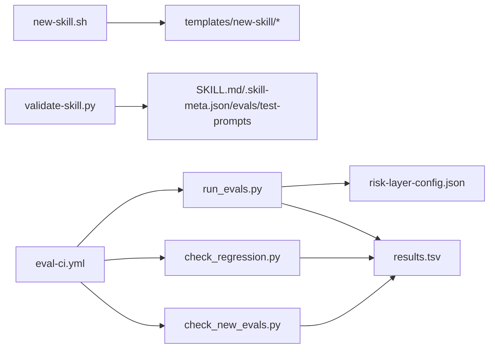

# 快速开始

<cite>
**本文引用的文件**
- [plugins/frontend-team-toolkit/skill-engineering/bin/new-skill.sh](file://plugins/frontend-team-toolkit/skill-engineering/bin/new-skill.sh)
- [plugins/frontend-team-toolkit/skill-engineering/bin/validate-skill.py](file://plugins/frontend-team-toolkit/skill-engineering/bin/validate-skill.py)
- [plugins/frontend-team-toolkit/skill-engineering/README.md](file://plugins/frontend-team-toolkit/skill-engineering/README.md)
- [plugins/frontend-team-toolkit/skill-engineering/templates/new-skill/.skill-meta.json](file://plugins/frontend-team-toolkit/skill-engineering/templates/new-skill/.skill-meta.json)
- [plugins/frontend-team-toolkit/skill-engineering/templates/new-skill/SKILL.md](file://plugins/frontend-team-toolkit/skill-engineering/templates/new-skill/SKILL.md)
- [plugins/frontend-team-toolkit/skill-engineering/templates/new-skill/evals/evals.json](file://plugins/frontend-team-toolkit/skill-engineering/templates/new-skill/evals/evals.json)
- [plugins/frontend-team-toolkit/skill-engineering/schemas/skill-meta.schema.json](file://plugins/frontend-team-toolkit/skill-engineering/schemas/skill-meta.schema.json)
- [plugins/frontend-team-toolkit/skill-engineering/scripts/run_evals.py](file://plugins/frontend-team-toolkit/skill-engineering/scripts/run_evals.py)
- [plugins/frontend-team-toolkit/skill-engineering/scripts/check_regression.py](file://plugins/frontend-team-toolkit/skill-engineering/scripts/check_regression.py)
- [plugins/frontend-team-toolkit/skill-engineering/scripts/check_new_evals.py](file://plugins/frontend-team-toolkit/skill-engineering/scripts/check_new_evals.py)
- [plugins/frontend-team-toolkit/skill-engineering/config/risk-layer-config.json](file://plugins/frontend-team-toolkit/skill-engineering/config/risk-layer-config.json)
- [plugins/frontend-team-toolkit/README.md](file://plugins/frontend-team-toolkit/README.md)
- [.github/workflows/eval-ci.yml](file://.github/workflows/eval-ci.yml)
- [.github/workflows/validate-template.yml](file://.github/workflows/validate-template.yml)
</cite>

## 目录
1. [简介](#简介)
2. [项目结构](#项目结构)
3. [核心组件](#核心组件)
4. [架构总览](#架构总览)
5. [详细组件解析](#详细组件解析)
6. [依赖关系分析](#依赖关系分析)
7. [性能与实践建议](#性能与实践建议)
8. [故障排除指南](#故障排除指南)
9. [结论](#结论)
10. [附录](#附录)

## 简介
本指南面向首次接触前端团队市场项目的工程师，帮助你在约 30 分钟内完成“技能（Skill）”的创建、结构校验与基础验证。你将学会：
- 环境准备与必要工具
- 使用 new-skill.sh 生成模板
- 基本编辑与结构校验
- 运行 Eval 门禁与回归检查
- 常见问题排查与最佳实践

## 项目结构
本项目围绕“技能工程化”能力组织，核心位于 plugins/frontend-team-toolkit/skill-engineering，包含脚手架、模板、校验脚本、CI 门禁与配置。

图表来源
- [plugins/frontend-team-toolkit/skill-engineering/README.md:34-69](file://plugins/frontend-team-toolkit/skill-engineering/README.md#L34-L69)
- [.github/workflows/eval-ci.yml:1-208](file://.github/workflows/eval-ci.yml#L1-L208)

章节来源
- [plugins/frontend-team-toolkit/skill-engineering/README.md:34-69](file://plugins/frontend-team-toolkit/skill-engineering/README.md#L34-L69)
- [plugins/frontend-team-toolkit/README.md:19-27](file://plugins/frontend-team-toolkit/README.md#L19-L27)

## 核心组件
- new-skill.sh：从模板生成新的技能目录骨架，自动填充名称、标题、时间戳等变量。
- validate-skill.py：对 SKILL.md frontmatter、关键文件存在性、evals/test-prompts 结构进行校验。
- templates/new-skill：包含 SKILL.md、.skill-meta.json、evals/evals.json、workflows/ 等模板文件。
- scripts/*：run_evals.py、check_regression.py、check_new_evals.py 构成 CI 门禁链路。
- config/risk-layer-config.json：定义 PR/Release/Scheduled 三种模式的风险过滤与门禁策略。
- schemas/*：JSON Schema，用于结构约束与自动化校验。
- CI 工作流：eval-ci.yml、validate-template.yml，分别负责技能评测与市场模板校验。

章节来源
- [plugins/frontend-team-toolkit/skill-engineering/README.md:40-51](file://plugins/frontend-team-toolkit/skill-engineering/README.md#L40-L51)
- [plugins/frontend-team-toolkit/skill-engineering/README.md:168-205](file://plugins/frontend-team-toolkit/skill-engineering/README.md#L168-L205)

## 架构总览
下图展示了从“创建技能”到“CI 门禁”的端到端流程。

图表来源
- [plugins/frontend-team-toolkit/skill-engineering/bin/new-skill.sh:114-121](file://plugins/frontend-team-toolkit/skill-engineering/bin/new-skill.sh#L114-L121)
- [plugins/frontend-team-toolkit/skill-engineering/bin/validate-skill.py:170-193](file://plugins/frontend-team-toolkit/skill-engineering/bin/validate-skill.py#L170-L193)
- [plugins/frontend-team-toolkit/skill-engineering/scripts/run_evals.py:189-227](file://plugins/frontend-team-toolkit/skill-engineering/scripts/run_evals.py#L189-L227)
- [plugins/frontend-team-toolkit/skill-engineering/scripts/check_regression.py:57-100](file://plugins/frontend-team-toolkit/skill-engineering/scripts/check_regression.py#L57-100)
- [plugins/frontend-team-toolkit/skill-engineering/scripts/check_new_evals.py:45-87](file://plugins/frontend-team-toolkit/skill-engineering/scripts/check_new_evals.py#L45-87)
- [.github/workflows/eval-ci.yml:66-141](file://.github/workflows/eval-ci.yml#L66-L141)

## 详细组件解析

### 1) 环境准备与安装
- Python 3.11（CI 使用版本），建议本地也使用相同版本以避免差异。
- Node.js 20（用于市场模板校验脚本）。
- Bash 环境（new-skill.sh 为 Bash 脚本）。
- Git 仓库克隆至本地，具备推送权限以便后续提交。

章节来源
- [.github/workflows/eval-ci.yml:46-54](file://.github/workflows/eval-ci.yml#L46-L54)
- [.github/workflows/validate-template.yml:26-29](file://.github/workflows/validate-template.yml#L26-L29)

### 2) 技能创建流程（从 new-skill.sh 到结构验证）
- 步骤一：使用 new-skill.sh 生成模板
  - 命令示例（默认输出到团队技能目录）：
    - [plugins/frontend-team-toolkit/skill-engineering/README.md:13-23](file://plugins/frontend-team-toolkit/skill-engineering/README.md#L13-L23)
  - 命令示例（指定输出路径，如个人 Cursor skills）：
    - [plugins/frontend-team-toolkit/skill-engineering/README.md:17-18](file://plugins/frontend-team-toolkit/skill-engineering/README.md#L17-L18)
- 步骤二：编辑模板文件
  - SKILL.md：填写 description、Workflow、Checkpoints、输出契约等。
    - [plugins/frontend-team-toolkit/skill-engineering/templates/new-skill/SKILL.md:1-97](file://plugins/frontend-team-toolkit/skill-engineering/templates/new-skill/SKILL.md#L1-L97)
  - .skill-meta.json：填充版本、成熟度、工作流启用与轨迹 Eval 配置。
    - [plugins/frontend-team-toolkit/skill-engineering/templates/new-skill/.skill-meta.json:1-32](file://plugins/frontend-team-toolkit/skill-engineering/templates/new-skill/.skill-meta.json#L1-L32)
  - evals/evals.json：至少包含一条回归用例（happy-path）与一条边界用例。
    - [plugins/frontend-team-toolkit/skill-engineering/templates/new-skill/evals/evals.json:1-47](file://plugins/frontend-team-toolkit/skill-engineering/templates/new-skill/evals/evals.json#L1-L47)
- 步骤三：结构校验
  - 本地运行 validate-skill.py 校验目录结构与 frontmatter。
    - [plugins/frontend-team-toolkit/skill-engineering/bin/validate-skill.py:170-193](file://plugins/frontend-team-toolkit/skill-engineering/bin/validate-skill.py#L170-L193)
  - 校验关注点：
    - 目录名必须为 kebab-case
    - 必备文件存在（SKILL.md、CHANGELOG.md、.skill-meta.json、evals/evals.json、test-prompts.json、references/output-contract.md）
    - 推荐文件存在（results.tsv、skill-issues.jsonl.example、scripts/validate-output.sh）
    - SKILL.md frontmatter 合法且 name 与目录名一致
    - .skill-meta.json 与目录名一致
    - evals/test-prompts 结构合法
  - 参考说明与结构清单：
    - [plugins/frontend-team-toolkit/skill-engineering/README.md:73-96](file://plugins/frontend-team-toolkit/skill-engineering/README.md#L73-L96)
    - [plugins/frontend-team-toolkit/skill-engineering/bin/validate-skill.py:26-39](file://plugins/frontend-team-toolkit/skill-engineering/bin/validate-skill.py#L26-L39)

图表来源
- [plugins/frontend-team-toolkit/skill-engineering/bin/new-skill.sh:114-121](file://plugins/frontend-team-toolkit/skill-engineering/bin/new-skill.sh#L114-L121)
- [plugins/frontend-team-toolkit/skill-engineering/bin/validate-skill.py:83-167](file://plugins/frontend-team-toolkit/skill-engineering/bin/validate-skill.py#L83-L167)

章节来源
- [plugins/frontend-team-toolkit/skill-engineering/bin/new-skill.sh:12-28](file://plugins/frontend-team-toolkit/skill-engineering/bin/new-skill.sh#L12-L28)
- [plugins/frontend-team-toolkit/skill-engineering/bin/validate-skill.py:83-167](file://plugins/frontend-team-toolkit/skill-engineering/bin/validate-skill.py#L83-L167)

### 3) 基本概念说明
- 技能（Skill）：面向特定任务的可复用能力单元，包含静态知识（SKILL.md）、契约（output-contract）、评测（evals/test-prompts）、结果记录（results.tsv）等。
- 评估（Eval）：对技能输出或执行轨迹进行判定的测试用例集合，分为“输出评估（regression/capability）”和“过程评估（trajectory）”。
- 工作流（Workflow）：动态编排脚本，提供串行、并行、条件、循环、对抗等模式，用于确定性执行与复杂编排。
- 基线（Baseline）：首次运行评测后写入 results.tsv 的记录，作为后续回归对比的基准。
- 门禁（Gate）：CI 中对 regression、新增评测未 baseline、未跑 baseline 等红线的阻断策略。

章节来源
- [plugins/frontend-team-toolkit/skill-engineering/README.md:102-121](file://plugins/frontend-team-toolkit/skill-engineering/README.md#L102-L121)
- [plugins/frontend-team-toolkit/skill-engineering/README.md:172-187](file://plugins/frontend-team-toolkit/skill-engineering/README.md#L172-L187)

### 4) CI 门禁与运行模式
- PR 触发模式：仅运行 high/medium 风险的评测，高风险 regression 挂起阻断。
- 发布前模式：运行全部评测，regression 挂起阻断。
- 定期回归模式：按周/月/季度运行，加入随机 spot check。
- 新评测基线检查：新增评测必须先有 baseline 记录，否则阻断。
- 回归检查：筛选 type=regression 的评测，按风险级别决定是否阻断。

图表来源
- [plugins/frontend-team-toolkit/skill-engineering/scripts/run_evals.py:135-174](file://plugins/frontend-team-toolkit/skill-engineering/scripts/run_evals.py#L135-L174)
- [plugins/frontend-team-toolkit/skill-engineering/scripts/check_regression.py:37-54](file://plugins/frontend-team-toolkit/skill-engineering/scripts/check_regression.py#L37-L54)
- [plugins/frontend-team-toolkit/skill-engineering/scripts/check_new_evals.py:67-68](file://plugins/frontend-team-toolkit/skill-engineering/scripts/check_new_evals.py#L67-L68)
- [.github/workflows/eval-ci.yml:66-141](file://.github/workflows/eval-ci.yml#L66-L141)

章节来源
- [plugins/frontend-team-toolkit/skill-engineering/scripts/run_evals.py:10-14](file://plugins/frontend-team-toolkit/skill-engineering/scripts/run_evals.py#L10-L14)
- [plugins/frontend-team-toolkit/skill-engineering/scripts/check_regression.py:1-12](file://plugins/frontend-team-toolkit/skill-engineering/scripts/check_regression.py#L1-L12)
- [plugins/frontend-team-toolkit/skill-engineering/scripts/check_new_evals.py:1-11](file://plugins/frontend-team-toolkit/skill-engineering/scripts/check_new_evals.py#L1-L11)
- [plugins/frontend-team-toolkit/skill-engineering/config/risk-layer-config.json:1-70](file://plugins/frontend-team-toolkit/skill-engineering/config/risk-layer-config.json#L1-L70)
- [.github/workflows/eval-ci.yml:66-141](file://.github/workflows/eval-ci.yml#L66-L141)

### 5) 本地运行与命令示例
- 本地运行评测（模拟 CI）：
  - [plugins/frontend-team-toolkit/skill-engineering/README.md:214-215](file://plugins/frontend-team-toolkit/skill-engineering/README.md#L214-L215)
- 回归检查（高/中风险）：
  - [plugins/frontend-team-toolkit/skill-engineering/README.md:218-219](file://plugins/frontend-team-toolkit/skill-engineering/README.md#L218-L219)
- 新评测基线检查：
  - [plugins/frontend-team-toolkit/skill-engineering/README.md:222-223](file://plugins/frontend-team-toolkit/skill-engineering/README.md#L222-L223)
- 市场模板校验：
  - [plugins/frontend-team-toolkit/skill-engineering/README.md:286-287](file://plugins/frontend-team-toolkit/skill-engineering/README.md#L286-L287)

章节来源
- [plugins/frontend-team-toolkit/skill-engineering/README.md:207-224](file://plugins/frontend-team-toolkit/skill-engineering/README.md#L207-L224)
- [plugins/frontend-team-toolkit/skill-engineering/README.md:282-291](file://plugins/frontend-team-toolkit/skill-engineering/README.md#L282-L291)

## 依赖关系分析
- new-skill.sh 依赖模板目录 templates/new-skill 与 Bash 环境。
- validate-skill.py 依赖 Python 标准库，校验 SKILL.md frontmatter、关键文件与 evals/test-prompts 结构。
- CI 门禁依赖 run_evals.py、check_regression.py、check_new_evals.py 与 risk-layer-config.json。
- GitHub Actions 工作流触发 run_evals.py 并串联回归与新评测检查。

图表来源
- [plugins/frontend-team-toolkit/skill-engineering/bin/new-skill.sh:9-10](file://plugins/frontend-team-toolkit/skill-engineering/bin/new-skill.sh#L9-L10)
- [plugins/frontend-team-toolkit/skill-engineering/bin/validate-skill.py:16-24](file://plugins/frontend-team-toolkit/skill-engineering/bin/validate-skill.py#L16-L24)
- [plugins/frontend-team-toolkit/skill-engineering/scripts/run_evals.py:38-59](file://plugins/frontend-team-toolkit/skill-engineering/scripts/run_evals.py#L38-L59)
- [.github/workflows/eval-ci.yml:66-141](file://.github/workflows/eval-ci.yml#L66-L141)

章节来源
- [plugins/frontend-team-toolkit/skill-engineering/bin/validate-skill.py:16-24](file://plugins/frontend-team-toolkit/skill-engineering/bin/validate-skill.py#L16-L24)
- [plugins/frontend-team-toolkit/skill-engineering/scripts/run_evals.py:38-59](file://plugins/frontend-team-toolkit/skill-engineering/scripts/run_evals.py#L38-L59)
- [.github/workflows/eval-ci.yml:66-141](file://.github/workflows/eval-ci.yml#L66-L141)

## 性能与实践建议
- 评测规模控制：PR 模式仅运行 high/medium，减少等待时间；发布前与定期回归再扩大覆盖面。
- 基线先行：新增评测必须先有 baseline，避免频繁阻断。
- 用例设计：优先覆盖 happy-path、缺失输入、边界与对抗场景，降低 drift 风险。
- 本地预检：先本地运行 validate-skill.py 与 run_evals.py，减少 CI 失败概率。

章节来源
- [plugins/frontend-team-toolkit/skill-engineering/README.md:172-187](file://plugins/frontend-team-toolkit/skill-engineering/README.md#L172-L187)
- [plugins/frontend-team-toolkit/skill-engineering/README.md:250-257](file://plugins/frontend-team-toolkit/skill-engineering/README.md#L250-L257)

## 故障排除指南
- new-skill.sh 报错“模板不存在”
  - 检查 templates/new-skill 是否存在，确认脚本路径正确。
  - 参考：
    - [plugins/frontend-team-toolkit/skill-engineering/bin/new-skill.sh:75-78](file://plugins/frontend-team-toolkit/skill-engineering/bin/new-skill.sh#L75-L78)
- 目录名不符合 kebab-case
  - 修改为小写字母、数字与短横线组合。
  - 参考：
    - [plugins/frontend-team-toolkit/skill-engineering/bin/validate-skill.py:90-92](file://plugins/frontend-team-toolkit/skill-engineering/bin/validate-skill.py#L90-L92)
- 缺少必备文件
  - 确保 SKILL.md、CHANGELOG.md、.skill-meta.json、evals/evals.json、test-prompts.json、references/output-contract.md 均存在。
  - 参考：
    - [plugins/frontend-team-toolkit/skill-engineering/bin/validate-skill.py:94-100](file://plugins/frontend-team-toolkit/skill-engineering/bin/validate-skill.py#L94-L100)
- SKILL.md frontmatter 校验失败
  - name 必填且与目录名一致；description 必填且包含触发词；metadata 结构需合法。
  - 参考：
    - [plugins/frontend-team-toolkit/skill-engineering/bin/validate-skill.py:103-132](file://plugins/frontend-team-toolkit/skill-engineering/bin/validate-skill.py#L103-L132)
- evals/evals.json 结构非法
  - 确保包含 id 与 prompt 字段；至少有一条用例。
  - 参考：
    - [plugins/frontend-team-toolkit/skill-engineering/bin/validate-skill.py:143-154](file://plugins/frontend-team-toolkit/skill-engineering/bin/validate-skill.py#L143-L154)
- test-prompts.json 非数组或为空
  - 确保为 JSON 数组且非空。
  - 参考：
    - [plugins/frontend-team-toolkit/skill-engineering/bin/validate-skill.py:156-165](file://plugins/frontend-team-toolkit/skill-engineering/bin/validate-skill.py#L156-L165)
- CI 回归失败（高风险）
  - 修复导致 regression 的变更，重新运行评测并通过回归检查。
  - 参考：
    - [.github/workflows/eval-ci.yml:116-132](file://.github/workflows/eval-ci.yml#L116-L132)
- 新评测未 baseline
  - 先运行评测生成 baseline，再允许合并。
  - 参考：
    - [.github/workflows/eval-ci.yml:134-140](file://.github/workflows/eval-ci.yml#L134-L140)

章节来源
- [plugins/frontend-team-toolkit/skill-engineering/bin/new-skill.sh:75-78](file://plugins/frontend-team-toolkit/skill-engineering/bin/new-skill.sh#L75-L78)
- [plugins/frontend-team-toolkit/skill-engineering/bin/validate-skill.py:90-165](file://plugins/frontend-team-toolkit/skill-engineering/bin/validate-skill.py#L90-L165)
- [.github/workflows/eval-ci.yml:116-140](file://.github/workflows/eval-ci.yml#L116-L140)

## 结论
通过本指南，你可以在 30 分钟内完成从“创建技能模板”到“本地结构校验与基础评测”的全流程。建议在日常开发中坚持“先基线、后变更”的原则，并结合 CI 门禁确保质量与稳定性。

## 附录
- 市场模板校验（仓库级）
  - [plugins/frontend-team-toolkit/skill-engineering/README.md:286-287](file://plugins/frontend-team-toolkit/skill-engineering/README.md#L286-L287)
- 团队技能清单与工程化说明
  - [plugins/frontend-team-toolkit/README.md:5-27](file://plugins/frontend-team-toolkit/README.md#L5-L27)
- JSON Schema（用于结构约束）
  - [plugins/frontend-team-toolkit/skill-engineering/schemas/skill-meta.schema.json:1-25](file://plugins/frontend-team-toolkit/skill-engineering/schemas/skill-meta.schema.json#L1-L25)