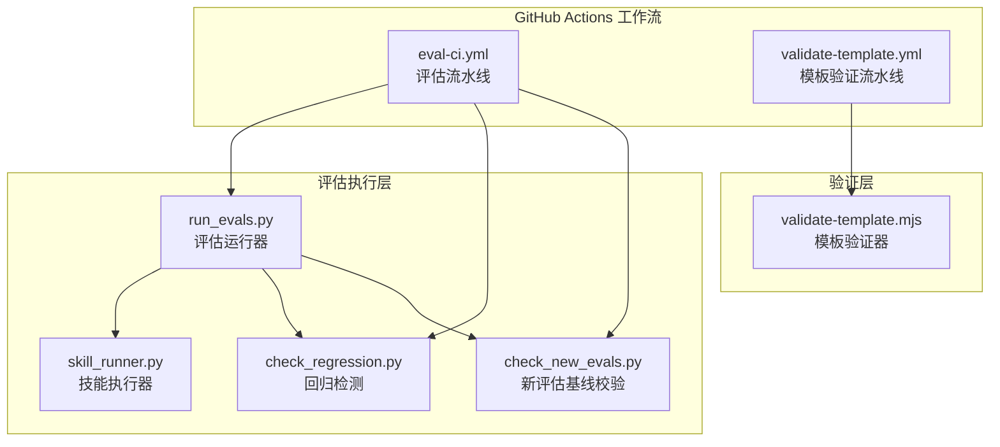
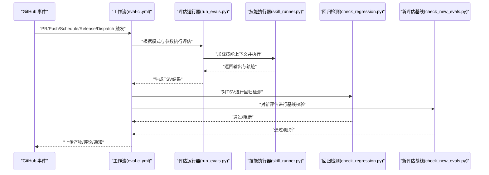
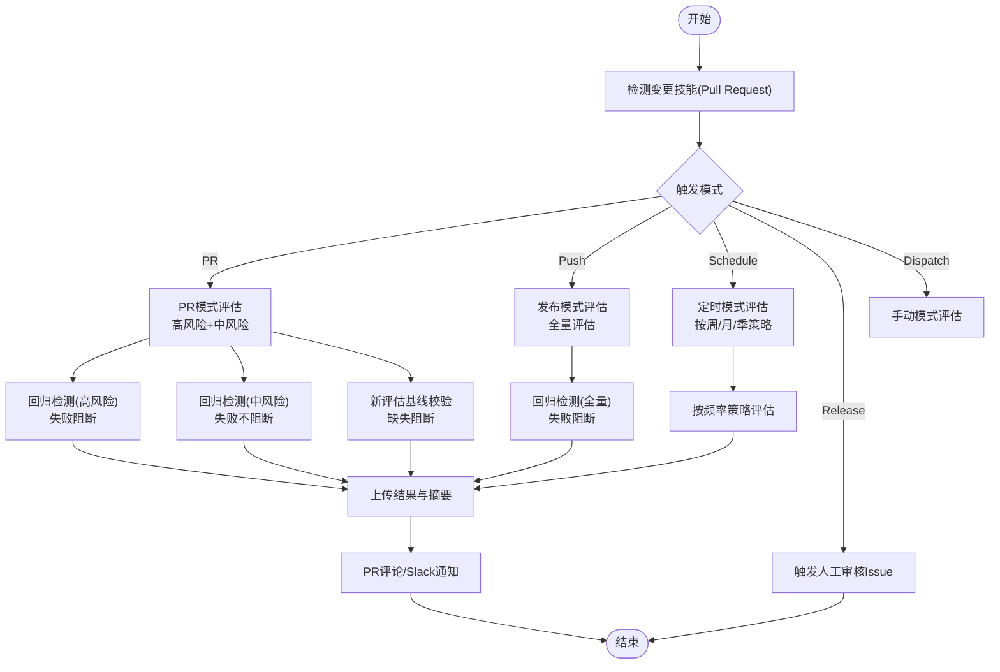
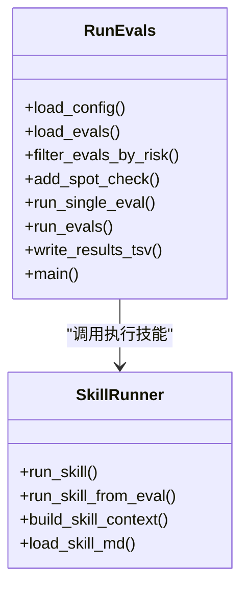
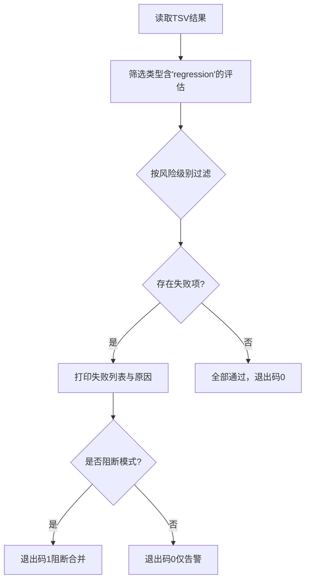
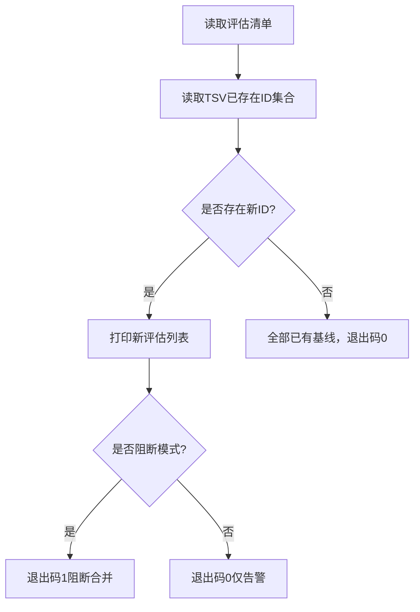
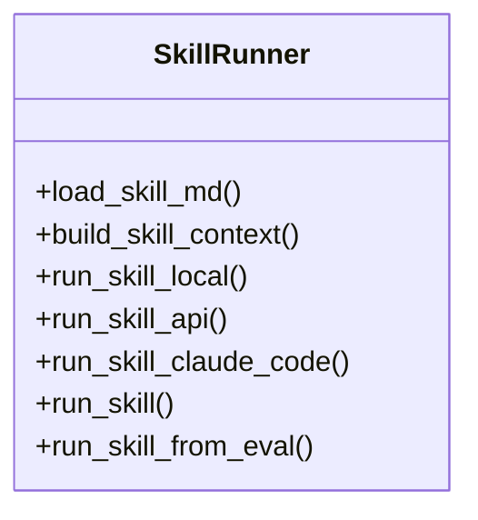
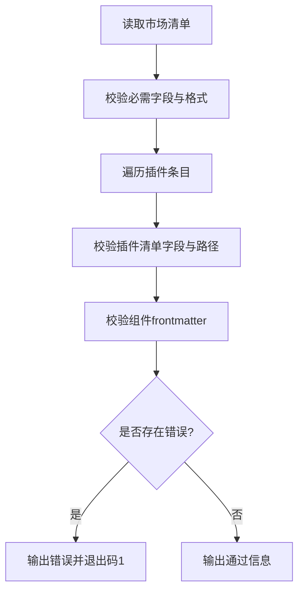
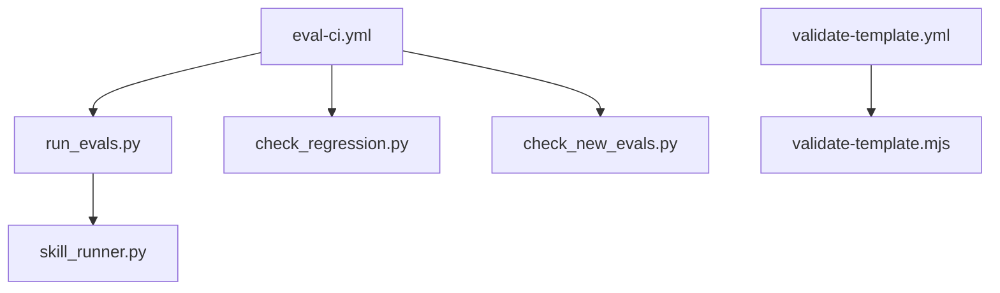

# CI/CD集成

<cite>
**本文档引用的文件**
- [.github/workflows/eval-ci.yml](file://.github/workflows/eval-ci.yml)
- [.github/workflows/validate-template.yml](file://.github/workflows/validate-template.yml)
- [scripts/validate-template.mjs](file://scripts/validate-template.mjs)
- [plugins/frontend-team-toolkit/skill-engineering/scripts/run_evals.py](file://plugins/frontend-team-toolkit/skill-engineering/scripts/run_evals.py)
- [plugins/frontend-team-toolkit/skill-engineering/scripts/check_regression.py](file://plugins/frontend-team-toolkit/skill-engineering/scripts/check_regression.py)
- [plugins/frontend-team-toolkit/skill-engineering/scripts/check_new_evals.py](file://plugins/frontend-team-toolkit/skill-engineering/scripts/check_new_evals.py)
- [plugins/frontend-team-toolkit/skill-engineering/scripts/skill_runner.py](file://plugins/frontend-team-toolkit/skill-engineering/scripts/skill_runner.py)
</cite>

## 目录
1. [简介](#简介)
2. [项目结构](#项目结构)
3. [核心组件](#核心组件)
4. [架构总览](#架构总览)
5. [详细组件分析](#详细组件分析)
6. [依赖关系分析](#依赖关系分析)
7. [性能考虑](#性能考虑)
8. [故障排除指南](#故障排除指南)
9. [结论](#结论)
10. [附录](#附录)

## 简介
本项目构建了一套完整的CI/CD集成体系，围绕技能工程评估与市场模板验证两大核心能力展开。系统通过GitHub Actions工作流实现自动化门禁机制，确保代码变更在合并前经过严格的质量评估与回归测试。评估流水线支持PR触发、发布触发、定时触发以及手动触发等多种模式，覆盖高风险、中风险与低风险评估等级，并内置回归检测与新评估基线校验。模板验证流水线则保障市场清单与插件清单的结构完整性与一致性。

## 项目结构
仓库采用“功能模块+流水线配置”的组织方式：
- `.github/workflows/`: 定义CI/CD工作流，包含评估流水线与模板验证流水线
- `plugins/frontend-team-toolkit/skill-engineering/scripts/`: 评估执行与质量控制脚本集合
- `scripts/validate-template.mjs`: 市场模板验证器
- `plugins/frontend-team-toolkit/skills/`: 技能工程目录，包含各技能的评估配置与结果输出

图表来源
- [.github/workflows/eval-ci.yml:1-208](file://.github/workflows/eval-ci.yml#L1-L208)
- [.github/workflows/validate-template.yml:1-33](file://.github/workflows/validate-template.yml#L1-L33)
- [plugins/frontend-team-toolkit/skill-engineering/scripts/run_evals.py:1-227](file://plugins/frontend-team-toolkit/skill-engineering/scripts/run_evals.py#L1-L227)
- [plugins/frontend-team-toolkit/skill-engineering/scripts/check_regression.py:1-100](file://plugins/frontend-team-toolkit/skill-engineering/scripts/check_regression.py#L1-L100)
- [plugins/frontend-team-toolkit/skill-engineering/scripts/check_new_evals.py:1-87](file://plugins/frontend-team-toolkit/skill-engineering/scripts/check_new_evals.py#L1-L87)
- [plugins/frontend-team-toolkit/skill-engineering/scripts/skill_runner.py:1-378](file://plugins/frontend-team-toolkit/skill-engineering/scripts/skill_runner.py#L1-L378)
- [scripts/validate-template.mjs:1-382](file://scripts/validate-template.mjs#L1-L382)

章节来源
- [.github/workflows/eval-ci.yml:1-208](file://.github/workflows/eval-ci.yml#L1-L208)
- [.github/workflows/validate-template.yml:1-33](file://.github/workflows/validate-template.yml#L1-L33)
- [scripts/validate-template.mjs:1-382](file://scripts/validate-template.mjs#L1-L382)

## 核心组件
- 评估流水线（eval-ci.yml）：负责在多种触发条件下执行技能评估，生成TSV结果并进行回归与新评估基线检测，必要时阻断合并。
- 模板验证流水线（validate-template.yml）：对市场清单与插件清单进行结构与一致性校验，确保清单字段与路径有效。
- 评估运行器（run_evals.py）：根据模式与频率筛选评估项，调用技能执行器执行评估，汇总评分并输出TSV。
- 回归检测（check_regression.py）：识别失败的回归评估，按风险级别决定是否阻断。
- 新评估基线校验（check_new_evals.py）：确保新评估在合并前具备历史基线记录。
- 技能执行器（skill_runner.py）：支持本地模拟、Anthropic API与Claude Code三种执行模式，统一输出与轨迹记录。
- 模板验证器（validate-template.mjs）：校验市场清单字段、插件清单一致性、相对路径安全性与组件frontmatter完整性。

章节来源
- [.github/workflows/eval-ci.yml:36-208](file://.github/workflows/eval-ci.yml#L36-L208)
- [plugins/frontend-team-toolkit/skill-engineering/scripts/run_evals.py:135-175](file://plugins/frontend-team-toolkit/skill-engineering/scripts/run_evals.py#L135-L175)
- [plugins/frontend-team-toolkit/skill-engineering/scripts/check_regression.py:57-96](file://plugins/frontend-team-toolkit/skill-engineering/scripts/check_regression.py#L57-L96)
- [plugins/frontend-team-toolkit/skill-engineering/scripts/check_new_evals.py:45-83](file://plugins/frontend-team-toolkit/skill-engineering/scripts/check_new_evals.py#L45-L83)
- [plugins/frontend-team-toolkit/skill-engineering/scripts/skill_runner.py:308-356](file://plugins/frontend-team-toolkit/skill-engineering/scripts/skill_runner.py#L308-L356)
- [.github/workflows/validate-template.yml:19-33](file://.github/workflows/validate-template.yml#L19-L33)
- [scripts/validate-template.mjs:250-359](file://scripts/validate-template.mjs#L250-L359)

## 架构总览
评估流水线以事件驱动为核心，通过多阶段作业串联评估执行、质量控制与通知反馈；模板验证流水线独立于评估流水线，专注于清单结构与一致性。

图表来源
- [.github/workflows/eval-ci.yml:66-158](file://.github/workflows/eval-ci.yml#L66-L158)
- [plugins/frontend-team-toolkit/skill-engineering/scripts/run_evals.py:135-175](file://plugins/frontend-team-toolkit/skill-engineering/scripts/run_evals.py#L135-L175)
- [plugins/frontend-team-toolkit/skill-engineering/scripts/skill_runner.py:308-356](file://plugins/frontend-team-toolkit/skill-engineering/scripts/skill_runner.py#L308-L356)
- [plugins/frontend-team-toolkit/skill-engineering/scripts/check_regression.py:57-96](file://plugins/frontend-team-toolkit/skill-engineering/scripts/check_regression.py#L57-L96)
- [plugins/frontend-team-toolkit/skill-engineering/scripts/check_new_evals.py:45-83](file://plugins/frontend-team-toolkit/skill-engineering/scripts/check_new_evals.py#L45-L83)

## 详细组件分析

### 评估流水线（eval-ci.yml）
- 触发条件
  - PR进入main分支且变更路径命中技能工程目录时触发
  - Push到main分支时对所有技能执行发布模式评估
  - 定时触发：每周一、每月1日、每季度首月周一上午9点
  - 发布事件：当发布被创建时触发人工审核门禁
  - 手动触发：支持指定技能与模式
- 作业拆分
  - eval-runner：安装Python环境与依赖，检测变更技能，按模式执行评估，进行回归与新评估基线检测，上传结果并生成摘要
  - human-review：发布模式下触发人工审核Issue，用于高风险评估的人工复核
- 关键行为
  - PR模式仅评估高风险与中风险评估
  - 发布模式评估全部风险等级
  - 定时模式根据cron频率选择周/月/季评估策略
  - 高风险回归失败直接阻断合并，中风险回归失败不阻断但记录警告
  - 新增评估必须具备基线记录，否则阻断合并
  - 失败时在PR评论区提示并发送Slack通知

图表来源
- [.github/workflows/eval-ci.yml:36-208](file://.github/workflows/eval-ci.yml#L36-L208)

章节来源
- [.github/workflows/eval-ci.yml:3-35](file://.github/workflows/eval-ci.yml#L3-L35)
- [.github/workflows/eval-ci.yml:36-208](file://.github/workflows/eval-ci.yml#L36-L208)

### 评估运行器（run_evals.py）
- 配置加载：从风险层配置文件读取不同模式下的风险过滤策略与阻断规则
- 评估筛选：按模式与频率筛选评估项，支持随机抽查低风险评估
- 执行流程：逐条调用技能执行器，根据评估类型选择对应评分器（规则/结构/轨迹/模型/复合）
- 结果输出：生成标准化TSV文件，包含评估ID、通过状态、时间戳、评分器类型、风险等级等字段

图表来源
- [plugins/frontend-team-toolkit/skill-engineering/scripts/run_evals.py:135-175](file://plugins/frontend-team-toolkit/skill-engineering/scripts/run_evals.py#L135-L175)
- [plugins/frontend-team-toolkit/skill-engineering/scripts/skill_runner.py:308-356](file://plugins/frontend-team-toolkit/skill-engineering/scripts/skill_runner.py#L308-L356)

章节来源
- [plugins/frontend-team-toolkit/skill-engineering/scripts/run_evals.py:38-82](file://plugins/frontend-team-toolkit/skill-engineering/scripts/run_evals.py#L38-L82)
- [plugins/frontend-team-toolkit/skill-engineering/scripts/run_evals.py:135-175](file://plugins/frontend-team-toolkit/skill-engineering/scripts/run_evals.py#L135-L175)

### 回归检测（check_regression.py）
- 功能：从TSV中筛选类型包含“regression”的评估，按风险级别过滤，统计失败数量
- 行为：支持阻断与非阻断两种模式，失败时打印失败列表与原因，必要时退出码为1阻断

图表来源
- [plugins/frontend-team-toolkit/skill-engineering/scripts/check_regression.py:22-54](file://plugins/frontend-team-toolkit/skill-engineering/scripts/check_regression.py#L22-L54)
- [plugins/frontend-team-toolkit/skill-engineering/scripts/check_regression.py:57-96](file://plugins/frontend-team-toolkit/skill-engineering/scripts/check_regression.py#L57-L96)

章节来源
- [plugins/frontend-team-toolkit/skill-engineering/scripts/check_regression.py:57-96](file://plugins/frontend-team-toolkit/skill-engineering/scripts/check_regression.py#L57-L96)

### 新评估基线校验（check_new_evals.py）
- 功能：对比评估清单中的ID与现有TSV记录，识别未产生过基线的新评估
- 行为：若存在新评估且配置为阻断，则阻断合并；否则仅发出告警

图表来源
- [plugins/frontend-team-toolkit/skill-engineering/scripts/check_new_evals.py:31-43](file://plugins/frontend-team-toolkit/skill-engineering/scripts/check_new_evals.py#L31-L43)
- [plugins/frontend-team-toolkit/skill-engineering/scripts/check_new_evals.py:45-83](file://plugins/frontend-team-toolkit/skill-engineering/scripts/check_new_evals.py#L45-L83)

章节来源
- [plugins/frontend-team-toolkit/skill-engineering/scripts/check_new_evals.py:45-83](file://plugins/frontend-team-toolkit/skill-engineering/scripts/check_new_evals.py#L45-L83)

### 技能执行器（skill_runner.py）
- 支持三种执行模式：本地模拟、Anthropic API直连、Claude Code CLI
- 上下文构建：从SKILL.md与参考文件构建技能上下文
- 输出与轨迹：统一返回技能输出文本与工具调用轨迹，便于审计与调试
- 错误处理：在API不可用或超时时回退至本地模式并输出错误信息

图表来源
- [plugins/frontend-team-toolkit/skill-engineering/scripts/skill_runner.py:308-356](file://plugins/frontend-team-toolkit/skill-engineering/scripts/skill_runner.py#L308-L356)

章节来源
- [plugins/frontend-team-toolkit/skill-engineering/scripts/skill_runner.py:308-356](file://plugins/frontend-team-toolkit/skill-engineering/scripts/skill_runner.py#L308-L356)

### 模板验证流水线（validate-template.yml）与验证器（validate-template.mjs）
- 触发条件：PR/Push进入main分支且变更涉及插件或模板验证脚本
- 验证范围：市场清单字段校验、插件清单一致性、相对路径安全性、组件frontmatter完整性
- 行为：出现错误时终止流程并输出详细错误信息，出现告警时输出警告但不阻断

图表来源
- [.github/workflows/validate-template.yml:19-33](file://.github/workflows/validate-template.yml#L19-L33)
- [scripts/validate-template.mjs:250-359](file://scripts/validate-template.mjs#L250-L359)

章节来源
- [.github/workflows/validate-template.yml:19-33](file://.github/workflows/validate-template.yml#L19-L33)
- [scripts/validate-template.mjs:250-359](file://scripts/validate-template.mjs#L250-L359)

## 依赖关系分析
- 工作流对脚本的依赖：评估流水线依赖run_evals.py、check_regression.py、check_new_evals.py与skill_runner.py；模板验证流水线依赖validate-template.mjs
- 脚本间耦合：run_evals.py依赖skill_runner.py执行技能；check_regression.py与check_new_evals.py依赖TSV结果文件
- 外部依赖：评估流水线需要Python环境与第三方包；API模式需要Anthropic API密钥；Claude Code模式需要CLI可用

图表来源
- [.github/workflows/eval-ci.yml:36-208](file://.github/workflows/eval-ci.yml#L36-L208)
- [.github/workflows/validate-template.yml:19-33](file://.github/workflows/validate-template.yml#L19-L33)
- [plugins/frontend-team-toolkit/skill-engineering/scripts/run_evals.py:135-175](file://plugins/frontend-team-toolkit/skill-engineering/scripts/run_evals.py#L135-L175)
- [plugins/frontend-team-toolkit/skill-engineering/scripts/skill_runner.py:308-356](file://plugins/frontend-team-toolkit/skill-engineering/scripts/skill_runner.py#L308-L356)
- [plugins/frontend-team-toolkit/skill-engineering/scripts/check_regression.py:57-96](file://plugins/frontend-team-toolkit/skill-engineering/scripts/check_regression.py#L57-L96)
- [plugins/frontend-team-toolkit/skill-engineering/scripts/check_new_evals.py:45-83](file://plugins/frontend-team-toolkit/skill-engineering/scripts/check_new_evals.py#L45-L83)
- [scripts/validate-template.mjs:250-359](file://scripts/validate-template.mjs#L250-L359)

章节来源
- [.github/workflows/eval-ci.yml:36-208](file://.github/workflows/eval-ci.yml#L36-L208)
- [.github/workflows/validate-template.yml:19-33](file://.github/workflows/validate-template.yml#L19-L33)

## 性能考虑
- 评估筛选与抽样：通过风险过滤与随机抽查降低评估成本，定时模式按频率调整评估粒度
- 执行模式选择：本地模拟适合快速验证，API/Claude Code适合真实行为验证，应根据资源与准确性需求选择
- 依赖安装幂等：脚本中对依赖安装使用“允许失败”策略，避免重复安装导致的冗余等待
- 结果缓存：评估结果作为制品上传，便于后续审计与重放

## 故障排除指南
- 评估失败
  - 检查TSV中失败的回归评估ID与原因，确认是否为真实退化或配置问题
  - 若为新评估未产生基线，先在历史环境中运行并生成基线后再提交
  - 在PR评论区查看失败详情链接，定位具体评估项
- API模式失败
  - 确认已配置Anthropic API密钥，检查网络连通性与API配额
  - 回退至本地模式进行最小化验证
- Claude Code模式失败
  - 确认CLI可执行文件路径正确，检查超时设置与权限
- 模板验证失败
  - 依据错误信息修正市场清单字段、插件清单名称与路径
  - 确保frontmatter字段齐全且格式正确
- 通知未到达
  - 检查Slack Webhook配置与网络访问权限
  - 确认PR评论权限与GitHub Script权限

章节来源
- [.github/workflows/eval-ci.yml:159-184](file://.github/workflows/eval-ci.yml#L159-L184)
- [plugins/frontend-team-toolkit/skill-engineering/scripts/skill_runner.py:205-257](file://plugins/frontend-team-toolkit/skill-engineering/scripts/skill_runner.py#L205-L257)
- [scripts/validate-template.mjs:361-379](file://scripts/validate-template.mjs#L361-L379)

## 结论
该CI/CD集成体系通过评估流水线与模板验证流水线形成闭环，实现了从代码提交到自动评估、回归检测与基线校验的全流程自动化。评估流水线支持多种触发模式与风险策略，结合人工审核门禁，确保高质量交付；模板验证流水线保障市场与插件清单的结构一致性。建议团队在实际使用中根据业务规模与资源情况选择合适的执行模式，并持续完善评估清单与风险策略配置。

## 附录
- 最佳实践
  - 在PR中优先提交评估清单与测试提示，确保评估先行
  - 对高风险评估保持严格阈值，中低风险评估采用定期抽查
  - 使用本地模拟快速验证，真实API/Claude Code用于最终确认
  - 定期审查与更新风险层配置，确保评估策略与业务目标一致
- 常见问题
  - 评估结果与预期不符：检查技能上下文与prompt构造，确认执行模式
  - 回归检测频繁失败：核查上游变更影响范围，必要时调整风险过滤
  - 模板验证告警较多：集中清理frontmatter与路径问题，提升清单质量