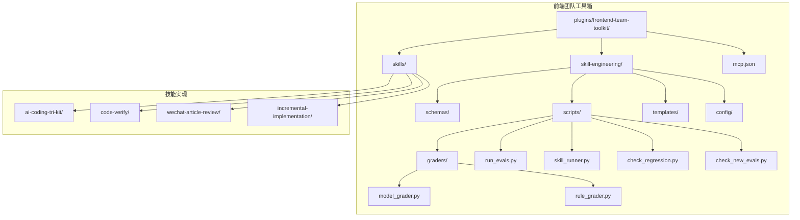
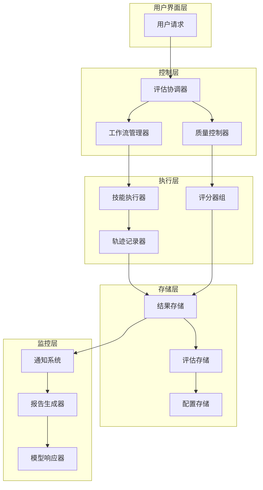
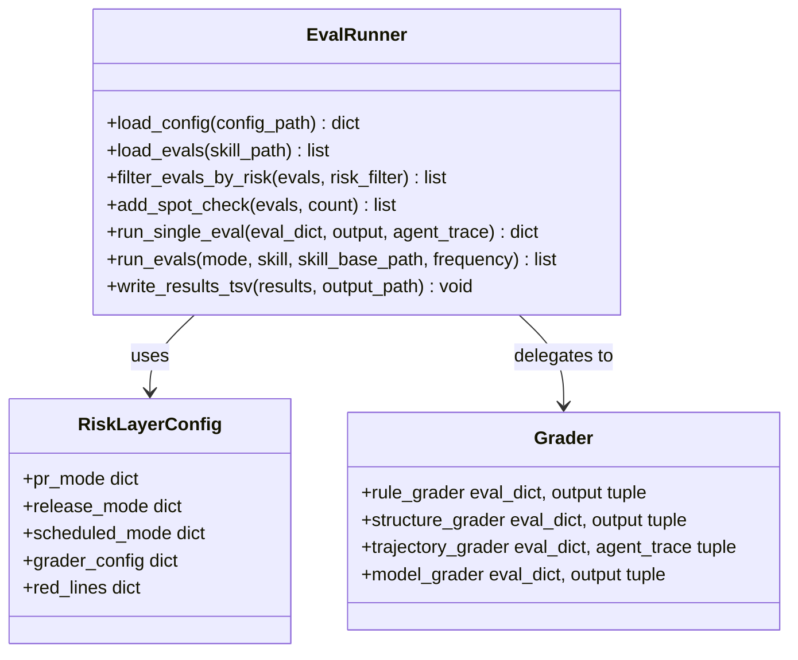
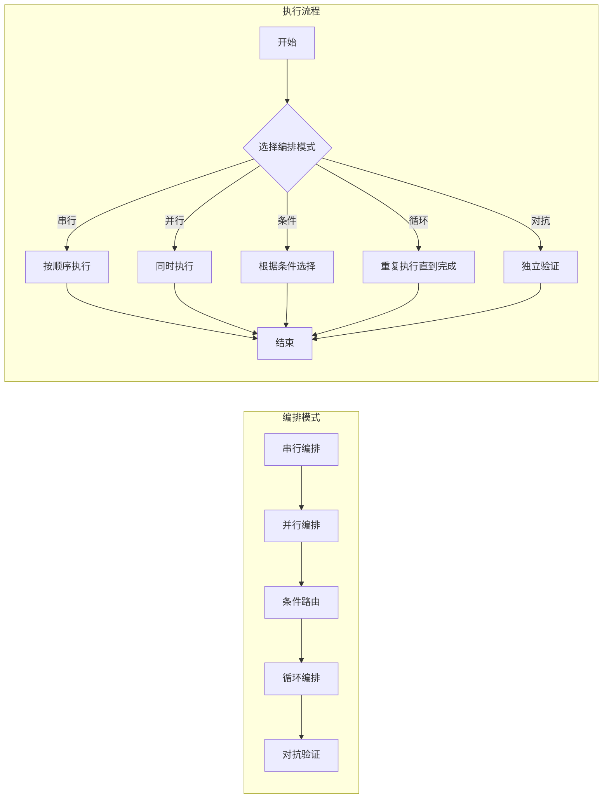
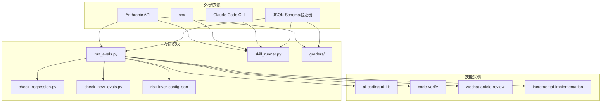

# 反馈循环系统

<cite>
**本文档引用的文件**
- [README.md](file://plugins/frontend-team-toolkit/README.md)
- [mcp.json](file://plugins/frontend-team-toolkit/mcp.json)
- [skill-engineering/README.md](file://plugins/frontend-team-toolkit/skill-engineering/README.md)
- [run_evals.py](file://plugins/frontend-team-toolkit/skill-engineering/scripts/run_evals.py)
- [skill_runner.py](file://plugins/frontend-team-toolkit/skill-engineering/scripts/skill_runner.py)
- [model_grader.py](file://plugins/frontend-team-toolkit/skill-engineering/scripts/graders/model_grader.py)
- [rule_grader.py](file://plugins/frontend-team-toolkit/skill-engineering/scripts/graders/rule_grader.py)
- [check_regression.py](file://plugins/frontend-team-toolkit/skill-engineering/scripts/check_regression.py)
- [check_new_evals.py](file://plugins/frontend-team-toolkit/skill-engineering/scripts/check_new_evals.py)
- [risk-layer-config.json](file://plugins/frontend-team-toolkit/skill-engineering/config/risk-layer-config.json)
</cite>

## 目录
1. [简介](#简介)
2. [项目结构](#项目结构)
3. [核心组件](#核心组件)
4. [架构概览](#架构概览)
5. [详细组件分析](#详细组件分析)
6. [依赖关系分析](#依赖关系分析)
7. [性能考虑](#性能考虑)
8. [故障排除指南](#故障排除指南)
9. [结论](#结论)

## 简介

反馈循环系统是前端团队市场平台的核心质量保障机制，旨在通过自动化评估、持续集成和智能监控确保技能（Skills）的质量稳定性和一致性。该系统采用多层次的评估策略，结合人工审核和AI辅助判断，构建了一个完整的质量闭环。

系统主要包含三个核心功能模块：
- **评估执行引擎**：负责运行各种类型的评估任务
- **质量门禁系统**：通过回归检测和基线检查确保质量标准
- **动态反馈机制**：提供实时的质量反馈和改进建议

## 项目结构

前端团队市场平台采用模块化的组织方式，核心结构如下：

**图表来源**
- [README.md:1-50](file://plugins/frontend-team-toolkit/README.md#L1-L50)
- [skill-engineering/README.md:34-96](file://plugins/frontend-team-toolkit/skill-engineering/README.md#L34-L96)

**章节来源**
- [README.md:1-50](file://plugins/frontend-team-toolkit/README.md#L1-L50)
- [skill-engineering/README.md:34-96](file://plugins/frontend-team-toolkit/skill-engineering/README.md#L34-L96)

## 核心组件

反馈循环系统由以下核心组件构成：

### 1. 评估执行引擎
负责协调和管理各类评估任务的执行，包括评估过滤、结果收集和报告生成。

### 2. 质量门禁系统
通过回归检测和新评估基线检查，确保代码变更不会降低现有质量水平。

### 3. 动态编排组件
支持多种工作流编排模式，包括串行、并行、条件路由、循环和对抗验证。

### 4. 智能评分器
提供多种评分策略，从简单的规则检查到复杂的语义分析。

**章节来源**
- [skill-engineering/README.md:102-121](file://plugins/frontend-team-toolkit/skill-engineering/README.md#L102-L121)
- [skill-engineering/README.md:168-205](file://plugins/frontend-team-toolkit/skill-engineering/README.md#L168-L205)

## 架构概览

反馈循环系统采用分层架构设计，实现了高度的模块化和可扩展性：

**图表来源**
- [run_evals.py:135-174](file://plugins/frontend-team-toolkit/skill-engineering/scripts/run_evals.py#L135-L174)
- [skill_runner.py:308-356](file://plugins/frontend-team-toolkit/skill-engineering/scripts/skill_runner.py#L308-L356)

## 详细组件分析

### 评估执行引擎

评估执行引擎是整个反馈循环系统的大脑，负责协调各个组件的工作。

**图表来源**
- [run_evals.py:38-174](file://plugins/frontend-team-toolkit/skill-engineering/scripts/run_evals.py#L38-L174)
- [risk-layer-config.json:1-70](file://plugins/frontend-team-toolkit/skill-engineering/config/risk-layer-config.json#L1-L70)

#### 评估模式详解

系统支持三种评估模式，每种模式都有特定的风险过滤策略：

| 模式 | 风险级别 | 目的 | 合并策略 |
|------|----------|------|----------|
| PR模式 | high, medium | 阻止回归退化 | high风险失败必阻 |
| 发布模式 | high, medium, low | 全能力回归验证 | 任何回归失败必阻 |
| 定期模式 | high | 发现长期退化 | 高风险为主 |

**章节来源**
- [run_evals.py:10-14](file://plugins/frontend-team-toolkit/skill-engineering/scripts/run_evals.py#L10-L14)
- [risk-layer-config.json:2-28](file://plugins/frontend-team-toolkit/skill-engineering/config/risk-layer-config.json#L2-L28)

### 质量门禁系统

质量门禁系统通过两个关键检查点确保代码质量：

**图表来源**
- [check_regression.py:37-54](file://plugins/frontend-team-toolkit/skill-engineering/scripts/check_regression.py#L37-L54)
- [check_new_evals.py:66-67](file://plugins/frontend-team-toolkit/skill-engineering/scripts/check_new_evals.py#L66-L67)

#### 门禁红线机制

系统定义了严格的门禁红线，确保关键质量问题不会被忽略：

| 红线类型 | 风险级别 | 触发条件 | 处理方式 |
|----------|----------|----------|----------|
| regression_high_fail | high | 高风险回归失败 | 必须阻止合并 |
| regression_medium_fail | medium | 中风险回归失败 | 警告但允许合并 |
| new_eval_no_baseline | - | 新评估无基线记录 | 必须阻止合并 |
| skill_change_no_baseline | - | 技能变更无基线 | 必须阻止合并 |

**章节来源**
- [check_regression.py:82-96](file://plugins/frontend-team-toolkit/skill-engineering/scripts/check_regression.py#L82-L96)
- [check_new_evals.py:70-83](file://plugins/frontend-team-toolkit/skill-engineering/scripts/check_new_evals.py#L70-L83)
- [risk-layer-config.json:53-63](file://plugins/frontend-team-toolkit/skill-engineering/config/risk-layer-config.json#L53-L63)

### 动态编排组件

系统支持多种工作流编排模式，适应不同的技能执行需求：

**图表来源**
- [skill-engineering/README.md:106-112](file://plugins/frontend-team-toolkit/skill-engineering/README.md#L106-L112)

#### 编排模式特点

| 模式 | 适用场景 | 特点 | 复杂度 |
|------|----------|------|--------|
| 串行编排 | 子技能有依赖关系 | 确定性执行，顺序严格 | 简单 |
| 并行编排 | 子技能可独立执行 | 提高执行效率 | 中等 |
| 条件路由 | 根据输入选择执行路径 | 智能决策 | 中等 |
| 循环编排 | 不确定工作量的任务 | 自动终止机制 | 较复杂 |
| 对抗验证 | 独立Agent验证输出 | 质量保证 | 复杂 |

**章节来源**
- [skill-engineering/README.md:102-121](file://plugins/frontend-team-toolkit/skill-engineering/README.md#L102-L121)

### 智能评分器

评分器系统提供了多层次的质量评估能力：

**图表来源**
- [rule_grader.py:41-92](file://plugins/frontend-team-toolkit/skill-engineering/scripts/graders/rule_grader.py#L41-L92)
- [model_grader.py:184-226](file://plugins/frontend-team-toolkit/skill-engineering/scripts/graders/model_grader.py#L184-L226)

#### 评分器能力矩阵

| 评分器类型 | 自动化程度 | 漂移风险 | 数据来源 | 适用场景 |
|------------|------------|----------|----------|----------|
| rule | 完全自动 | 无 | 输出文本 | 关键词/路径检查 |
| structure | 完全自动 | 无 | 输出文本 | 结构完整性检查 |
| trajectory | 完全自动 | 无 | Agent trace | 调用顺序验证 |
| model | 半自动 | 中等 | LLM Judge | 语义质量评估 |
| human | 人工 | 无 | 人工审核 | 复杂场景判断 |

**章节来源**
- [skill-engineering/README.md:238-246](file://plugins/frontend-team-toolkit/skill-engineering/README.md#L238-L246)

## 依赖关系分析

反馈循环系统的依赖关系呈现清晰的层次结构：

**图表来源**
- [run_evals.py:25-35](file://plugins/frontend-team-toolkit/skill-engineering/scripts/run_evals.py#L25-L35)
- [skill_runner.py:25-28](file://plugins/frontend-team-toolkit/skill-engineering/scripts/skill_runner.py#L25-L28)

### 关键依赖特性

1. **API依赖**：系统主要依赖Anthropic API进行模型调用
2. **CLI依赖**：支持Claude Code CLI和npx命令
3. **配置依赖**：通过JSON Schema确保配置正确性
4. **技能依赖**：与具体技能实现解耦，支持动态加载

**章节来源**
- [skill-runner.py:25-28](file://plugins/frontend-team-toolkit/skill-engineering/scripts/skill_runner.py#L25-L28)
- [run_evals.py:25-35](file://plugins/frontend-team-toolkit/skill-engineering/scripts/run_evals.py#L25-L35)

## 性能考虑

反馈循环系统在设计时充分考虑了性能优化：

### 1. 评估执行优化
- **并行处理**：支持并行评估多个技能
- **缓存机制**：避免重复计算相同评估
- **资源限制**：设置超时和内存限制

### 2. 网络通信优化
- **批量请求**：减少API调用次数
- **连接复用**：重用网络连接
- **错误重试**：智能重试机制

### 3. 存储优化
- **增量更新**：只更新变化的数据
- **压缩存储**：减少存储空间占用
- **索引优化**：提高查询效率

## 故障排除指南

### 常见问题及解决方案

#### 1. API调用失败
**症状**：评估执行中断，显示API错误
**解决方案**：
- 检查API密钥配置
- 验证网络连接
- 查看API限流状态

#### 2. 评估超时
**症状**：评估长时间无响应
**解决方案**：
- 增加超时时间
- 检查技能执行效率
- 优化模型调用

#### 3. 配置错误
**症状**：系统无法启动或运行异常
**解决方案**：
- 验证JSON Schema
- 检查环境变量
- 确认文件权限

#### 4. 门禁触发
**症状**：合并被阻止
**解决方案**：
- 查看失败的具体评估
- 更新评估基线
- 修复相关问题

**章节来源**
- [skill-runner.py:298-305](file://plugins/frontend-team-toolkit/skill-engineering/scripts/skill_runner.py#L298-L305)
- [model-grader.py:89-94](file://plugins/frontend-team-toolkit/skill-engineering/scripts/graders/model_grader.py#L89-L94)

## 结论

反馈循环系统通过其模块化设计和多层次的质量保障机制，为前端团队提供了一个强大而灵活的质量管理平台。系统的主要优势包括：

1. **全面的质量覆盖**：从规则检查到语义分析的全方位评估
2. **灵活的执行模式**：支持多种编排模式适应不同场景
3. **智能的门禁机制**：通过风险分层和门禁红线确保质量标准
4. **高效的反馈循环**：快速发现问题并提供改进建议

该系统不仅提高了技能开发的质量和效率，还为团队建立了可持续的质量改进机制。通过持续的评估和反馈，团队可以不断优化技能实现，提升整体开发质量。

未来的发展方向包括增强AI辅助能力、扩展评估范围和支持更多类型的技能实现。这些改进将进一步提升系统的智能化水平和适用性。