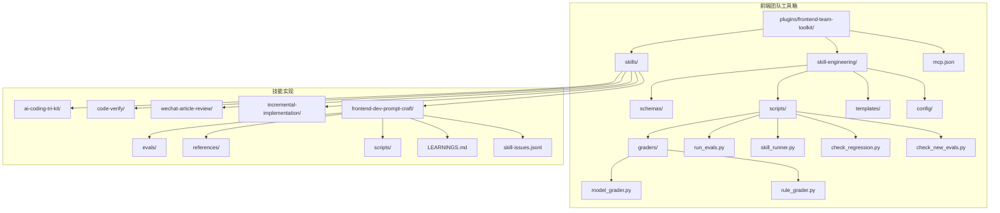
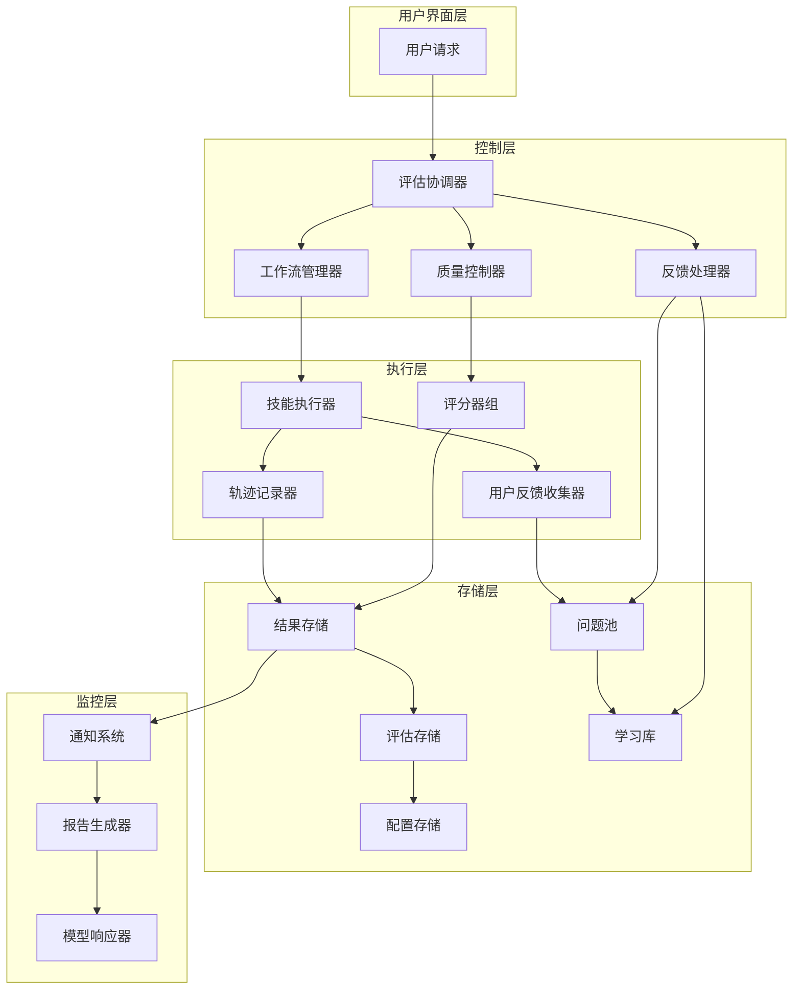
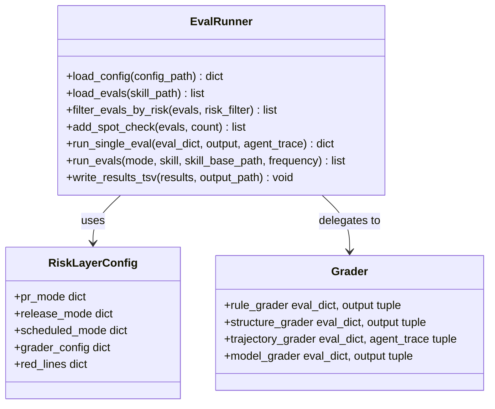
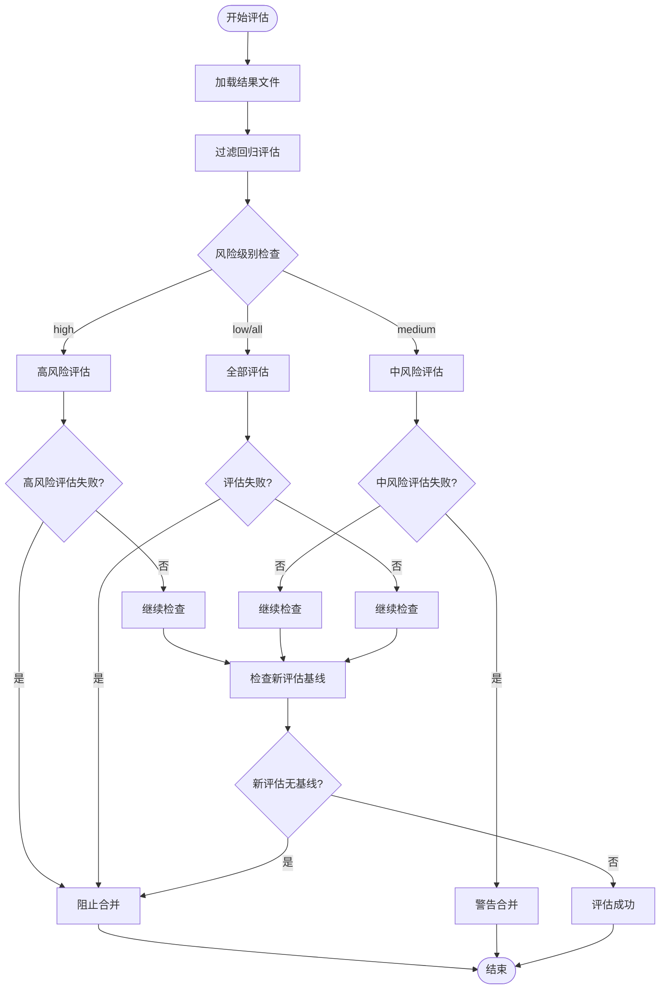
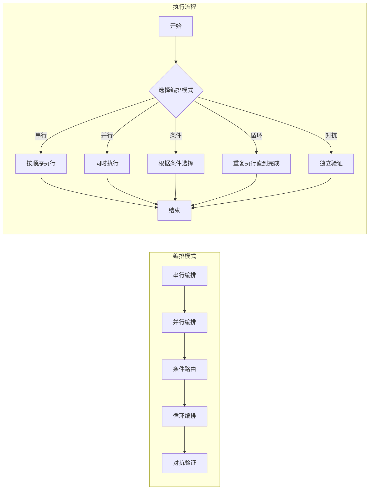
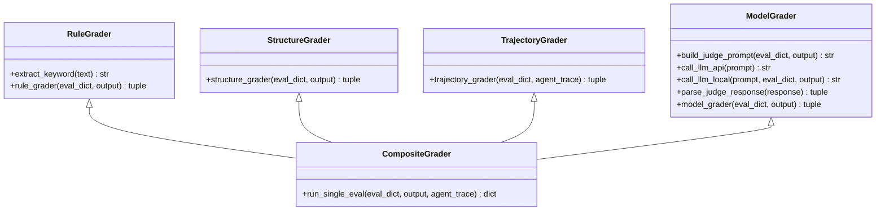
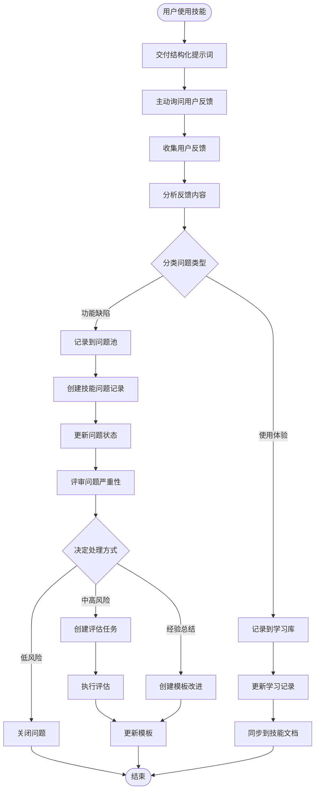
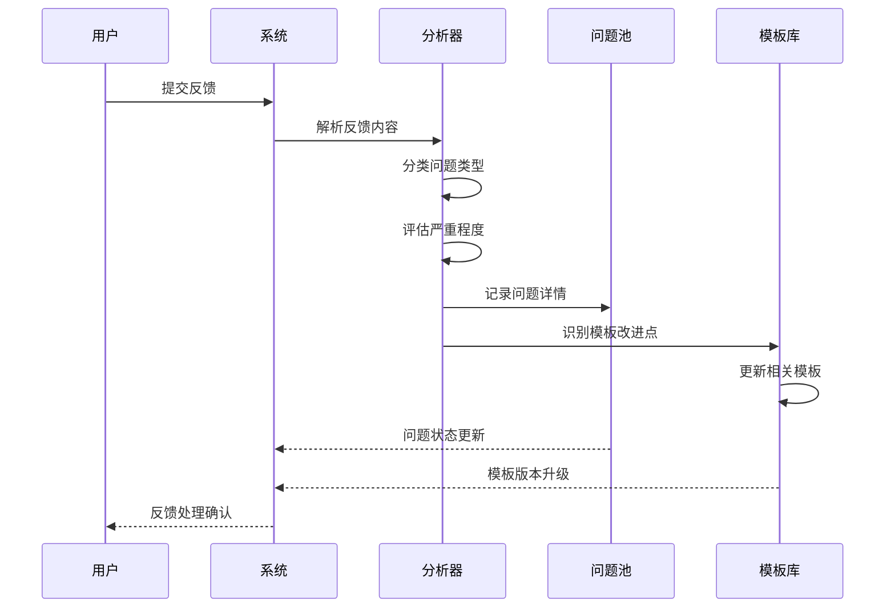
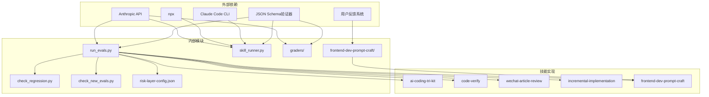

# 反馈循环系统

<cite>
**本文档引用的文件**
- [README.md](file://plugins/frontend-team-toolkit/README.md)
- [mcp.json](file://plugins/frontend-team-toolkit/mcp.json)
- [skill-engineering/README.md](file://plugins/frontend-team-toolkit/skill-engineering/README.md)
- [run_evals.py](file://plugins/frontend-team-toolkit/skill-engineering/scripts/run_evals.py)
- [skill_runner.py](file://plugins/frontend-team-toolkit/skill-engineering/scripts/skill_runner.py)
- [model_grader.py](file://plugins/frontend-team-toolkit/skill-engineering/scripts/graders/model_grader.py)
- [rule_grader.py](file://plugins/frontend-team-toolkit/skill-engineering/scripts/graders/rule_grader.py)
- [check_regression.py](file://plugins/frontend-team-toolkit/skill-engineering/scripts/check_regression.py)
- [check_new_evals.py](file://plugins/frontend-team-toolkit/skill-engineering/scripts/check_new_evals.py)
- [risk-layer-config.json](file://plugins/frontend-team-toolkit/skill-engineering/config/risk-layer-config.json)
- [frontend-dev-prompt-craft/SKILL.md](file://plugins/frontend-team-toolkit/skills/frontend-dev-prompt-craft/SKILL.md)
- [frontend-dev-prompt-craft/LEARNINGS.md](file://plugins/frontend-team-toolkit/skills/frontend-dev-prompt-craft/LEARNINGS.md)
- [frontend-dev-prompt-craft/references/output-contract.md](file://plugins/frontend-team-toolkit/skills/frontend-dev-prompt-craft/references/output-contract.md)
- [frontend-dev-prompt-craft/references/prompt-templates.md](file://plugins/frontend-team-toolkit/skills/frontend-dev-prompt-craft/references/prompt-templates.md)
- [frontend-dev-prompt-craft/skill-issues.jsonl](file://plugins/frontend-team-toolkit/skills/frontend-dev-prompt-craft/skill-issues.jsonl)
</cite>

## 更新摘要
**所做更改**
- 新增前端开发提示词创作技能的用户反馈闭环机制章节
- 更新反馈循环系统架构图以包含用户反馈处理流程
- 添加用户反馈收集、分析和转化的具体实现细节
- 完善反馈闭环的四个关键步骤说明
- 增强技能学习和改进的文档结构

## 目录
1. [简介](#简介)
2. [项目结构](#项目结构)
3. [核心组件](#核心组件)
4. [架构概览](#架构概览)
5. [详细组件分析](#详细组件分析)
6. [用户反馈闭环机制](#用户反馈闭环机制)
7. [依赖关系分析](#依赖关系分析)
8. [性能考虑](#性能考虑)
9. [故障排除指南](#故障排除指南)
10. [结论](#结论)

## 简介

反馈循环系统是前端团队市场平台的核心质量保障机制，旨在通过自动化评估、持续集成和智能监控确保技能（Skills）的质量稳定性和一致性。该系统采用多层次的评估策略，结合人工审核和AI辅助判断，构建了一个完整的质量闭环。

**更新** 新增了前端开发提示词创作技能的用户反馈闭环机制，体现了从用户反馈收集到技能改进的完整循环过程。

系统主要包含三个核心功能模块：
- **评估执行引擎**：负责运行各种类型的评估任务
- **质量门禁系统**：通过回归检测和基线检查确保质量标准
- **动态反馈机制**：提供实时的质量反馈和改进建议

## 项目结构

前端团队市场平台采用模块化的组织方式，核心结构如下：



**图表来源**
- [README.md:1-50](file://plugins/frontend-team-toolkit/README.md#L1-L50)
- [skill-engineering/README.md:34-96](file://plugins/frontend-team-toolkit/skill-engineering/README.md#L34-L96)

**章节来源**
- [README.md:1-50](file://plugins/frontend-team-toolkit/README.md#L1-L50)
- [skill-engineering/README.md:34-96](file://plugins/frontend-team-toolkit/skill-engineering/README.md#L34-L96)

## 核心组件

反馈循环系统由以下核心组件构成：

### 1. 评估执行引擎
负责协调和管理各类评估任务的执行，包括评估过滤、结果收集和报告生成。

### 2. 质量门禁系统
通过回归检测和新评估基线检查，确保代码变更不会降低现有质量水平。

### 3. 动态编排组件
支持多种工作流编排模式，包括串行、并行、条件路由、循环和对抗验证。

### 4. 智能评分器
提供多种评分策略，从简单的规则检查到复杂的语义分析。

### 5. 用户反馈处理中心
**新增** 负责收集、分析和转化用户反馈，驱动技能持续改进。

**章节来源**
- [skill-engineering/README.md:102-121](file://plugins/frontend-team-toolkit/skill-engineering/README.md#L102-L121)
- [skill-engineering/README.md:168-205](file://plugins/frontend-team-toolkit/skill-engineering/README.md#L168-L205)

## 架构概览

反馈循环系统采用分层架构设计，实现了高度的模块化和可扩展性：



**图表来源**
- [run_evals.py:135-174](file://plugins/frontend-team-toolkit/skill-engineering/scripts/run_evals.py#L135-L174)
- [skill_runner.py:308-356](file://plugins/frontend-team-toolkit/skill-engineering/scripts/skill_runner.py#L308-L356)

## 详细组件分析

### 评估执行引擎

评估执行引擎是整个反馈循环系统的大脑，负责协调各个组件的工作。



**图表来源**
- [run_evals.py:38-174](file://plugins/frontend-team-toolkit/skill-engineering/scripts/run_evals.py#L38-L174)
- [risk-layer-config.json:1-70](file://plugins/frontend-team-toolkit/skill-engineering/config/risk-layer-config.json#L1-L70)

#### 评估模式详解

系统支持三种评估模式，每种模式都有特定的风险过滤策略：

| 模式 | 风险级别 | 目的 | 合并策略 |
|------|----------|------|----------|
| PR模式 | high, medium | 阻止回归退化 | high风险失败必阻 |
| 发布模式 | high, medium, low | 全能力回归验证 | 任何回归失败必阻 |
| 定期模式 | high | 发现长期退化 | 高风险为主 |

**章节来源**
- [run_evals.py:10-14](file://plugins/frontend-team-toolkit/skill-engineering/scripts/run_evals.py#L10-L14)
- [risk-layer-config.json:2-28](file://plugins/frontend-team-toolkit/skill-engineering/config/risk-layer-config.json#L2-L28)

### 质量门禁系统

质量门禁系统通过两个关键检查点确保代码质量：



**图表来源**
- [check_regression.py:37-54](file://plugins/frontend-team-toolkit/skill-engineering/scripts/check_regression.py#L37-L54)
- [check_new_evals.py:66-67](file://plugins/frontend-team-toolkit/skill-engineering/scripts/check_new_evals.py#L66-L67)

#### 门禁红线机制

系统定义了严格的门禁红线，确保关键质量问题不会被忽略：

| 红线类型 | 风险级别 | 触发条件 | 处理方式 |
|----------|----------|----------|----------|
| regression_high_fail | high | 高风险回归失败 | 必须阻止合并 |
| regression_medium_fail | medium | 中风险回归失败 | 警告但允许合并 |
| new_eval_no_baseline | - | 新评估无基线记录 | 必须阻止合并 |
| skill_change_no_baseline | - | 技能变更无基线 | 必须阻止合并 |

**章节来源**
- [check_regression.py:82-96](file://plugins/frontend-team-toolkit/skill-engineering/scripts/check_regression.py#L82-L96)
- [check_new_evals.py:70-83](file://plugins/frontend-team-toolkit/skill-engineering/scripts/check_new_evals.py#L70-L83)
- [risk-layer-config.json:53-63](file://plugins/frontend-team-toolkit/skill-engineering/config/risk-layer-config.json#L53-L63)

### 动态编排组件

系统支持多种工作流编排模式，适应不同的技能执行需求：



**图表来源**
- [skill-engineering/README.md:106-112](file://plugins/frontend-team-toolkit/skill-engineering/README.md#L106-L112)

#### 编排模式特点

| 模式 | 适用场景 | 特点 | 复杂度 |
|------|----------|------|--------|
| 串行编排 | 子技能有依赖关系 | 确定性执行，顺序严格 | 简单 |
| 并行编排 | 子技能可独立执行 | 提高执行效率 | 中等 |
| 条件路由 | 根据输入选择执行路径 | 智能决策 | 中等 |
| 循环编排 | 不确定工作量的任务 | 自动终止机制 | 较复杂 |
| 对抗验证 | 独立Agent验证输出 | 质量保证 | 复杂 |

**章节来源**
- [skill-engineering/README.md:102-121](file://plugins/frontend-team-toolkit/skill-engineering/README.md#L102-L121)

### 智能评分器

评分器系统提供了多层次的质量评估能力：



**图表来源**
- [rule_grader.py:41-92](file://plugins/frontend-team-toolkit/skill-engineering/scripts/graders/rule_grader.py#L41-L92)
- [model_grader.py:184-226](file://plugins/frontend-team-toolkit/skill-engineering/scripts/graders/model_grader.py#L184-L226)

#### 评分器能力矩阵

| 评分器类型 | 自动化程度 | 漂移风险 | 数据来源 | 适用场景 |
|------------|------------|----------|----------|----------|
| rule | 完全自动 | 无 | 输出文本 | 关键词/路径检查 |
| structure | 完全自动 | 无 | 输出文本 | 结构完整性检查 |
| trajectory | 完全自动 | 无 | Agent trace | 调用顺序验证 |
| model | 半自动 | 中等 | LLM Judge | 语义质量评估 |
| human | 人工 | 无 | 人工审核 | 复杂场景判断 |

**章节来源**
- [skill-engineering/README.md:238-246](file://plugins/frontend-team-toolkit/skill-engineering/README.md#L238-L246)

## 用户反馈闭环机制

**新增** 用户反馈闭环机制是前端开发提示词创作技能的核心改进功能，通过系统化的反馈收集、分析和转化，实现技能的持续优化。

### 反馈闭环流程



**图表来源**
- [frontend-dev-prompt-craft/SKILL.md:180-199](file://plugins/frontend-team-toolkit/skills/frontend-dev-prompt-craft/SKILL.md#L180-L199)

### 反馈收集策略

系统采用多维度的反馈收集策略：

#### 1. 主动询问机制
- **时机**：每次提示词交付后立即进行
- **内容**：询问提示词效果和改进建议
- **方式**：标准化的反馈问卷模板

#### 2. 自动记录机制
- **问题池**：`skill-issues.jsonl` 文件记录所有用户反馈
- **学习库**：`LEARNINGS.md` 文件沉淀经验教训
- **模板库**：`references/prompt-templates.md` 持续优化模板

#### 3. 反馈分类体系
| 分类维度 | 类别 | 描述 | 处理优先级 |
|----------|------|------|------------|
| 问题类型 | 功能缺陷 | 模板不适用、字段缺失 | 高 |
| 问题类型 | 使用体验 | 生成速度慢、格式不友好 | 中 |
| 问题类型 | 技术约束 | 组件库不支持、接口不兼容 | 高 |
| 问题类型 | 场景覆盖 | 新任务类型未覆盖 | 中 |
| 反馈来源 | 用户反馈 | 直接用户反馈 | 高 |
| 反馈来源 | 自动检测 | 系统检测到的问题 | 中 |
| 严重程度 | 低 | 小问题，不影响使用 | 低 |
| 严重程度 | 中 | 一般问题，影响部分使用 | 中 |
| 严重程度 | 高 | 重大问题，影响核心功能 | 高 |

**章节来源**
- [frontend-dev-prompt-craft/SKILL.md:180-199](file://plugins/frontend-team-toolkit/skills/frontend-dev-prompt-craft/SKILL.md#L180-L199)
- [frontend-dev-prompt-craft/skill-issues.jsonl:1-4](file://plugins/frontend-team-toolkit/skills/frontend-dev-prompt-craft/skill-issues.jsonl#L1-4)

### 反馈分析与转化

#### 1. 问题分析流程


**图表来源**
- [frontend-dev-prompt-craft/LEARNINGS.md:16-28](file://plugins/frontend-team-toolkit/skills/frontend-dev-prompt-craft/LEARNINGS.md#L16-L28)

#### 2. 经验沉淀机制
- **格式规范**：统一的 Markdown 格式记录
- **结构化内容**：包含场景、反馈、改进点等要素
- **同步机制**：达到阈值后同步到主技能文档

#### 3. 模板优化流程
- **问题驱动**：基于用户反馈发现模板不足
- **场景扩展**：新增覆盖新的任务类型
- **智能增强**：自动解析用户提供的截图信息

**章节来源**
- [frontend-dev-prompt-craft/LEARNINGS.md:16-28](file://plugins/frontend-team-toolkit/skills/frontend-dev-prompt-craft/LEARNINGS.md#L16-L28)
- [frontend-dev-prompt-craft/references/prompt-templates.md:1-472](file://plugins/frontend-team-toolkit/skills/frontend-dev-prompt-craft/references/prompt-templates.md#L1-L472)

### 反馈闭环规则

系统制定了详细的反馈闭环处理规则：

#### 1. 问题记录标准
```json
{
  "date": "YYYY-MM-DD",
  "skill": "frontend-dev-prompt-craft",
  "task_type": "类型代号",
  "symptom": "问题描述",
  "expected": "期望行为",
  "severity": "low|medium|high",
  "source": "user_feedback",
  "converted_to_eval": false,
  "eval_id": null,
  "status": "open"
}
```

#### 2. 学习记录模板
```markdown
## [日期] [任务类型] 简短标题

**场景**: 用户要做什么
**反馈**: 效果好/不好，具体说明
**改进点**: 下次可以怎么优化
**是否同步到 SKILL.md**: 是/否
```

#### 3. 处理优先级矩阵
| 严重程度 | 处理时限 | 优先级 | 处理方式 |
|----------|----------|--------|----------|
| 高 | 24小时内 | P0 | 立即修复 |
| 中 | 72小时内 | P1 | 计划修复 |
| 低 | 1周内 | P2 | 后续优化 |
| 无 | 1月内 | P3 | 观察改进 |

**章节来源**
- [frontend-dev-prompt-craft/SKILL.md:186-197](file://plugins/frontend-team-toolkit/skills/frontend-dev-prompt-craft/SKILL.md#L186-L197)
- [frontend-dev-prompt-craft/LEARNINGS.md:7-14](file://plugins/frontend-team-toolkit/skills/frontend-dev-prompt-craft/LEARNINGS.md#L7-L14)

## 依赖关系分析

反馈循环系统的依赖关系呈现清晰的层次结构：



**图表来源**
- [run_evals.py:25-35](file://plugins/frontend-team-toolkit/skill-engineering/scripts/run_evals.py#L25-L35)
- [skill_runner.py:25-28](file://plugins/frontend-team-toolkit/skill-engineering/scripts/skill_runner.py#L25-L28)

### 关键依赖特性

1. **API依赖**：系统主要依赖Anthropic API进行模型调用
2. **CLI依赖**：支持Claude Code CLI和npx命令
3. **配置依赖**：通过JSON Schema确保配置正确性
4. **技能依赖**：与具体技能实现解耦，支持动态加载
5. **用户反馈依赖**：**新增** 前端开发提示词创作技能具备独立的用户反馈收集和处理能力

**章节来源**
- [skill-runner.py:25-28](file://plugins/frontend-team-toolkit/skill-engineering/scripts/skill_runner.py#L25-L28)
- [run_evals.py:25-35](file://plugins/frontend-team-toolkit/skill-engineering/scripts/run_evals.py#L25-L35)

## 性能考虑

反馈循环系统在设计时充分考虑了性能优化：

### 1. 评估执行优化
- **并行处理**：支持并行评估多个技能
- **缓存机制**：避免重复计算相同评估
- **资源限制**：设置超时和内存限制

### 2. 网络通信优化
- **批量请求**：减少API调用次数
- **连接复用**：重用网络连接
- **错误重试**：智能重试机制

### 3. 存储优化
- **增量更新**：只更新变化的数据
- **压缩存储**：减少存储空间占用
- **索引优化**：提高查询效率

### 4. 用户反馈处理优化
**新增** 
- **异步处理**：用户反馈收集与技能执行解耦
- **批量分析**：定期批量处理反馈，减少实时开销
- **智能分类**：自动分类反馈类型，提高处理效率

## 故障排除指南

### 常见问题及解决方案

#### 1. API调用失败
**症状**：评估执行中断，显示API错误
**解决方案**：
- 检查API密钥配置
- 验证网络连接
- 查看API限流状态

#### 2. 评估超时
**症状**：评估长时间无响应
**解决方案**：
- 增加超时时间
- 检查技能执行效率
- 优化模型调用

#### 3. 配置错误
**症状**：系统无法启动或运行异常
**解决方案**：
- 验证JSON Schema
- 检查环境变量
- 确认文件权限

#### 4. 门禁触发
**症状**：合并被阻止
**解决方案**：
- 查看失败的具体评估
- 更新评估基线
- 修复相关问题

#### 5. 用户反馈处理异常
**新增** 
**症状**：用户反馈无法正常记录或处理
**解决方案**：
- 检查JSONL文件格式
- 验证学习库权限
- 确认模板更新机制
- 查看反馈分类准确性

**章节来源**
- [skill-runner.py:298-305](file://plugins/frontend-team-toolkit/skill-engineering/scripts/skill_runner.py#L298-L305)
- [model-grader.py:89-94](file://plugins/frontend-team-toolkit/skill-engineering/scripts/graders/model_grader.py#L89-L94)

## 结论

反馈循环系统通过其模块化设计和多层次的质量保障机制，为前端团队提供了一个强大而灵活的质量管理平台。系统的主要优势包括：

1. **全面的质量覆盖**：从规则检查到语义分析的全方位评估
2. **灵活的执行模式**：支持多种编排模式适应不同场景
3. **智能的门禁机制**：通过风险分层和门禁红线确保质量标准
4. **高效的反馈循环**：**更新** 新增的用户反馈闭环机制，实现从用户反馈到技能改进的完整循环
5. **持续的学习能力**：**更新** 通过问题池和学习库实现知识的持续积累和传承

**更新** 前端开发提示词创作技能的用户反馈闭环机制代表了系统在智能化和自适应方面的重大进步。该机制通过主动收集用户反馈、智能分析问题类型、系统化转化改进措施，形成了一个完整的"使用-反馈-改进"闭环，显著提升了技能的实用性和适应性。

该系统不仅提高了技能开发的质量和效率，还为团队建立了可持续的质量改进机制。通过持续的评估和反馈，团队可以不断优化技能实现，提升整体开发质量。

未来的发展方向包括增强AI辅助能力、扩展评估范围、**更新** 加强用户反馈处理的智能化水平，以及支持更多类型的技能实现。这些改进将进一步提升系统的智能化水平和适用性，为前端开发提供更加精准和高效的支持。