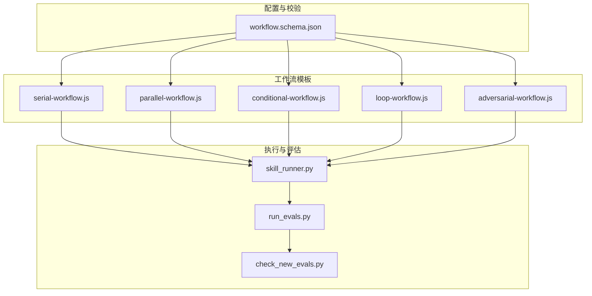
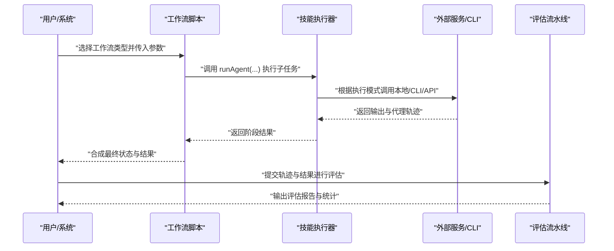
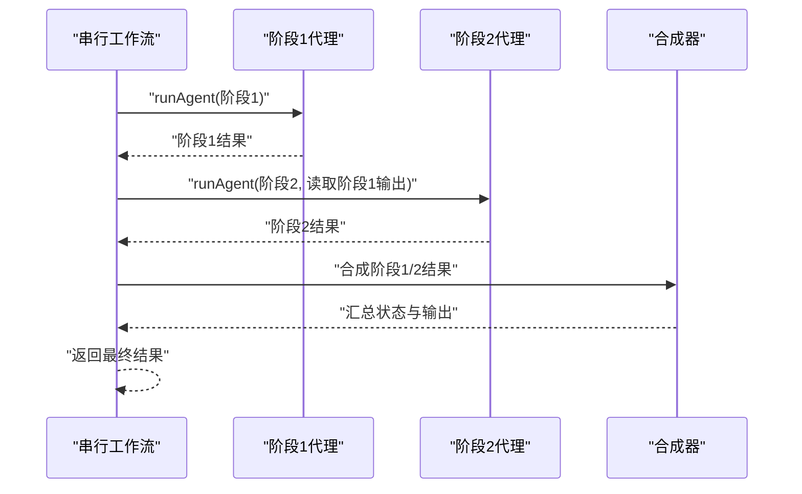
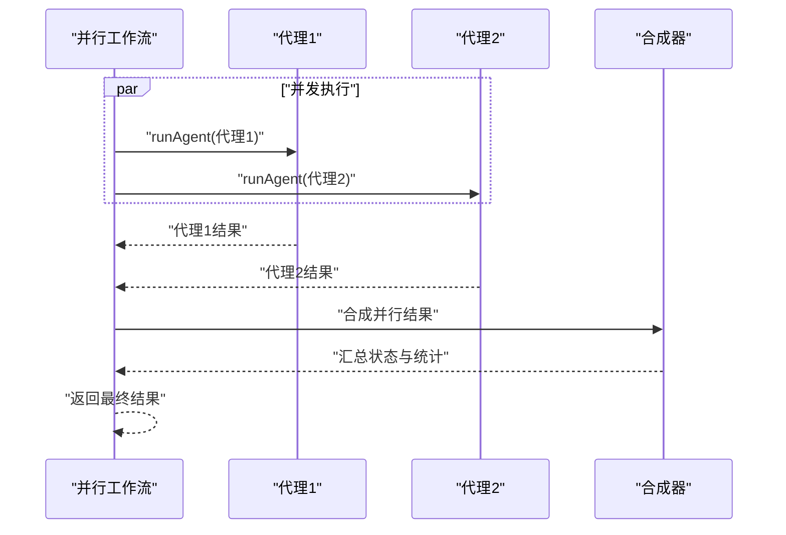
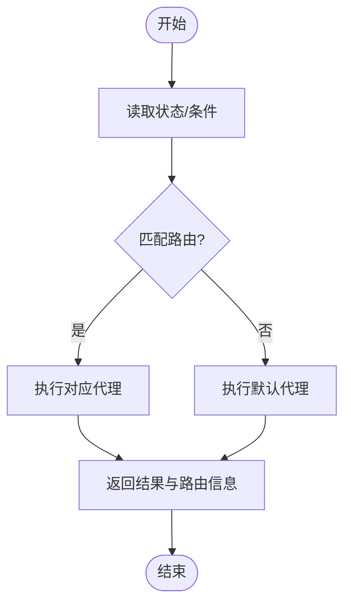
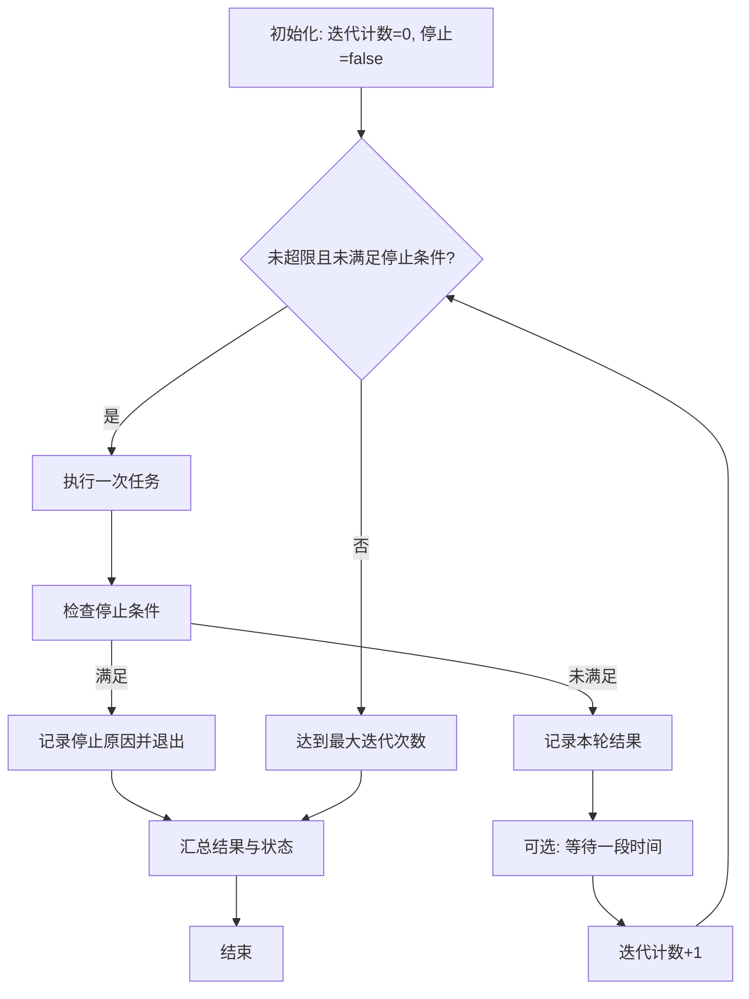
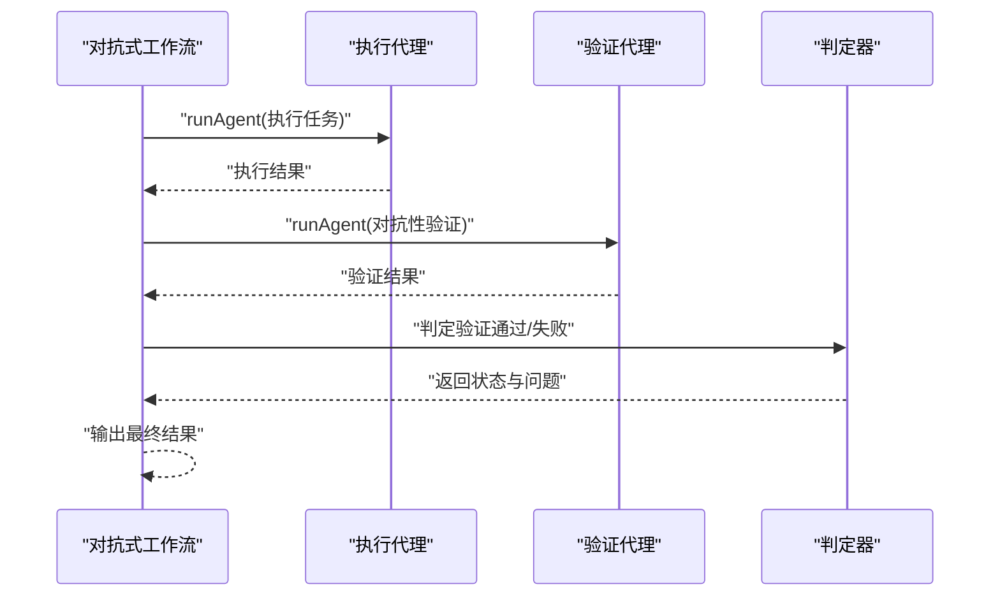
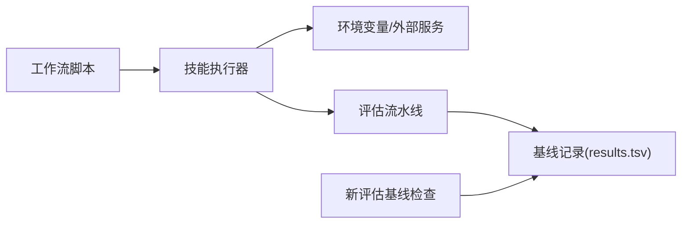

# 工作流管理

<cite>
**本文引用的文件**
- [workflow.schema.json](file://plugins/frontend-team-toolkit/skill-engineering/schemas/workflow.schema.json)
- [serial-workflow.js](file://plugins/frontend-team-toolkit/skill-engineering/templates/new-skill/workflows/serial-workflow.js)
- [parallel-workflow.js](file://plugins/frontend-team-toolkit/skill-engineering/templates/new-skill/workflows/parallel-workflow.js)
- [conditional-workflow.js](file://plugins/frontend-team-toolkit/skill-engineering/templates/new-skill/workflows/conditional-workflow.js)
- [loop-workflow.js](file://plugins/frontend-team-toolkit/skill-engineering/templates/new-skill/workflows/loop-workflow.js)
- [adversarial-workflow.js](file://plugins/frontend-team-toolkit/skill-engineering/templates/new-skill/workflows/adversarial-workflow.js)
- [README.md（工作流模板目录）](file://plugins/frontend-team-toolkit/skill-engineering/templates/new-skill/workflows/README.md)
- [skill_runner.py](file://plugins/frontend-team-toolkit/skill-engineering/scripts/skill_runner.py)
- [run_evals.py](file://plugins/frontend-team-toolkit/skill-engineering/scripts/run_evals.py)
- [check_new_evals.py](file://plugins/frontend-team-toolkit/skill-engineering/scripts/check_new_evals.py)
</cite>

## 目录
1. [简介](#简介)
2. [项目结构](#项目结构)
3. [核心组件](#核心组件)
4. [架构总览](#架构总览)
5. [详细组件分析](#详细组件分析)
6. [依赖关系分析](#依赖关系分析)
7. [性能考量](#性能考量)
8. [故障排查指南](#故障排查指南)
9. [结论](#结论)
10. [附录](#附录)

## 简介
本技术文档面向工作流管理系统，系统化阐述五种工作流模式的设计理念与实现方式：串行工作流、并行工作流、条件工作流、循环工作流与对抗式工作流。文档同时说明工作流配置语法、执行逻辑与状态管理机制，解释工作流与技能执行的关系，并给出复杂技能编排的实践建议与常见问题解决方案，帮助开发者构建高效、稳定且可验证的技能执行流程。

## 项目结构
该仓库在“前端团队工具包”插件中提供了完整的工作流基础设施，包含：
- 工作流脚本模板：用于定义不同编排模式的动态执行脚本
- 工作流元数据与校验：JSON Schema 定义工作流配置字段与约束
- 技能执行器：支持本地模拟、Claude Code CLI 与 Anthropic API 三种执行模式
- 评估流水线：按风险层策略筛选评估用例，使用规则/结构/轨迹/模型/人工等评分器进行打分
- 新评估基线检查：确保新评估在合并前具备历史基线记录

图表来源
- [serial-workflow.js:1-53](file://plugins/frontend-team-toolkit/skill-engineering/templates/new-skill/workflows/serial-workflow.js#L1-L53)
- [parallel-workflow.js:1-57](file://plugins/frontend-team-toolkit/skill-engineering/templates/new-skill/workflows/parallel-workflow.js#L1-L57)
- [conditional-workflow.js:1-74](file://plugins/frontend-team-toolkit/skill-engineering/templates/new-skill/workflows/conditional-workflow.js#L1-L74)
- [loop-workflow.js:1-75](file://plugins/frontend-team-toolkit/skill-engineering/templates/new-skill/workflows/loop-workflow.js#L1-L75)
- [adversarial-workflow.js:1-56](file://plugins/frontend-team-toolkit/skill-engineering/templates/new-skill/workflows/adversarial-workflow.js#L1-L56)
- [workflow.schema.json:1-101](file://plugins/frontend-team-toolkit/skill-engineering/schemas/workflow.schema.json#L1-L101)
- [skill_runner.py:1-378](file://plugins/frontend-team-toolkit/skill-engineering/scripts/skill_runner.py#L1-L378)
- [run_evals.py:1-227](file://plugins/frontend-team-toolkit/skill-engineering/scripts/run_evals.py#L1-L227)
- [check_new_evals.py:1-87](file://plugins/frontend-team-toolkit/skill-engineering/scripts/check_new_evals.py#L1-L87)

章节来源
- [README.md（工作流模板目录）:1-51](file://plugins/frontend-team-toolkit/skill-engineering/templates/new-skill/workflows/README.md#L1-L51)

## 核心组件
- 工作流配置与校验
  - JSON Schema 定义工作流名称、类型、输入输出契约、触发关键词、代理配置、迭代上限、停止条件、路由映射、风险等级等字段，确保工作流元数据的一致性与可验证性。
- 工作流脚本模板
  - 提供五种编排模式的标准脚本骨架，约定参数占位符与返回结构，便于复制粘贴与快速定制。
- 技能执行器
  - 支持本地模拟、Claude Code CLI 与 Anthropic API 三种执行模式；统一输出文本与代理轨迹，便于后续轨迹评估。
- 评估流水线
  - 按 PR/发布/定时模式加载风险层配置，筛选评估用例，调用规则/结构/轨迹/模型/人工评分器进行打分与汇总。
- 新评估基线检查
  - 校验新增评估是否已有历史基线记录，防止未经验证的新评估进入主干。

章节来源
- [workflow.schema.json:1-101](file://plugins/frontend-team-toolkit/skill-engineering/schemas/workflow.schema.json#L1-L101)
- [skill_runner.py:1-378](file://plugins/frontend-team-toolkit/skill-engineering/scripts/skill_runner.py#L1-L378)
- [run_evals.py:1-227](file://plugins/frontend-team-toolkit/skill-engineering/scripts/run_evals.py#L1-L227)
- [check_new_evals.py:1-87](file://plugins/frontend-team-toolkit/skill-engineering/scripts/check_new_evals.py#L1-L87)

## 架构总览
工作流系统以“配置即契约、脚本即执行、评估即验证”的思路组织：配置文件定义工作流的静态契约，脚本模板描述动态执行过程，执行器负责实际运行并产出结果与轨迹，评估流水线对执行过程与结果进行多维度打分。

图表来源
- [skill_runner.py:308-356](file://plugins/frontend-team-toolkit/skill-engineering/scripts/skill_runner.py#L308-L356)
- [run_evals.py:84-174](file://plugins/frontend-team-toolkit/skill-engineering/scripts/run_evals.py#L84-L174)

## 详细组件分析

### 串行工作流（Serial Workflow）
设计理念
- 当子技能存在强顺序依赖时采用串行编排：前一阶段的输出作为后一阶段的输入，最终汇总生成统一结果与状态。

实现要点
- 使用 runAgent 并发地启动第一个阶段，随后基于其输出路径启动第二个阶段。
- 返回结构包含各阶段结果、汇总信息与整体状态，便于上层决策与追踪。

图表来源
- [serial-workflow.js:14-40](file://plugins/frontend-team-toolkit/skill-engineering/templates/new-skill/workflows/serial-workflow.js#L14-L40)

章节来源
- [serial-workflow.js:1-53](file://plugins/frontend-team-toolkit/skill-engineering/templates/new-skill/workflows/serial-workflow.js#L1-L53)

### 并行工作流（Parallel Workflow）
设计理念
- 当子技能彼此独立且可并发执行时采用并行编排：通过 Promise.all 同时启动多个代理，聚合结果后统一判定。

实现要点
- 并行启动多个代理，每个代理使用独立工作树隔离上下文，避免相互干扰。
- 合成器检查所有代理是否全部通过，生成汇总状态与简要统计。

图表来源
- [parallel-workflow.js:14-35](file://plugins/frontend-team-toolkit/skill-engineering/templates/new-skill/workflows/parallel-workflow.js#L14-L35)

章节来源
- [parallel-workflow.js:1-57](file://plugins/frontend-team-toolkit/skill-engineering/templates/new-skill/workflows/parallel-workflow.js#L1-L57)

### 条件工作流（Conditional Workflow）
设计理念
- 需要根据输入条件进行“分类-执行”路由时采用条件编排：先判定状态，再选择对应代理执行，最后返回路由信息与结果状态。

实现要点
- 定义路由映射表，支持默认分支回退，保证鲁棒性。
- 返回结构包含路由目标、条件值与结果状态，便于上层审计与重放。

图表来源
- [conditional-workflow.js:17-60](file://plugins/frontend-team-toolkit/skill-engineering/templates/new-skill/workflows/conditional-workflow.js#L17-L60)

章节来源
- [conditional-workflow.js:1-74](file://plugins/frontend-team-toolkit/skill-engineering/templates/new-skill/workflows/conditional-workflow.js#L1-L74)

### 循环工作流（Loop Workflow）
设计理念
- 当任务需要重复执行直到满足停止条件或达到最大迭代次数时采用循环编排：在每次迭代中执行任务并检查终止条件，最终汇总迭代过程与最终状态。

实现要点
- 迭代上限与停止条件由配置决定，可在迭代间加入等待时间以降低资源占用。
- 合成器返回总迭代数、是否满足停止条件、每轮结果与最终状态，便于回溯与可视化。

图表来源
- [loop-workflow.js:13-56](file://plugins/frontend-team-toolkit/skill-engineering/templates/new-skill/workflows/loop-workflow.js#L13-L56)

章节来源
- [loop-workflow.js:1-75](file://plugins/frontend-team-toolkit/skill-engineering/templates/new-skill/workflows/loop-workflow.js#L1-L75)

### 对抗式工作流（Adversarial Workflow）
设计理念
- 为质量保障而设计：先由执行代理完成任务，再由验证代理从独立上下文中对抗性核查输出，最终给出验证通过/失败与问题列表。

实现要点
- 执行与验证分别在独立工作树中进行，确保验证的客观性。
- 返回结构包含执行输出、验证输出、验证状态与问题清单，便于修复与复评。

图表来源
- [adversarial-workflow.js:15-46](file://plugins/frontend-team-toolkit/skill-engineering/templates/new-skill/workflows/adversarial-workflow.js#L15-L46)

章节来源
- [adversarial-workflow.js:1-56](file://plugins/frontend-team-toolkit/skill-engineering/templates/new-skill/workflows/adversarial-workflow.js#L1-L56)

### 工作流配置语法与状态管理
- 配置语法
  - 工作流名称、类型、描述、触发关键词、输入输出契约、代理列表、迭代上限与停止条件、路由映射、风险等级等字段均在 JSON Schema 中明确定义，确保配置一致性与可验证性。
- 执行逻辑
  - 工作流脚本通过 runAgent 发起子任务，按模式串联/并行/路由/循环/对抗执行，最终合成统一状态与输出。
- 状态管理
  - 各脚本返回结构包含阶段状态、汇总状态与最终状态字段，便于上层进行状态判断与流程控制。

章节来源
- [workflow.schema.json:6-97](file://plugins/frontend-team-toolkit/skill-engineering/schemas/workflow.schema.json#L6-L97)
- [serial-workflow.js:34-40](file://plugins/frontend-team-toolkit/skill-engineering/templates/new-skill/workflows/serial-workflow.js#L34-L40)
- [parallel-workflow.js:40-54](file://plugins/frontend-team-toolkit/skill-engineering/templates/new-skill/workflows/parallel-workflow.js#L40-L54)
- [conditional-workflow.js:54-59](file://plugins/frontend-team-toolkit/skill-engineering/templates/new-skill/workflows/conditional-workflow.js#L54-L59)
- [loop-workflow.js:50-55](file://plugins/frontend-team-toolkit/skill-engineering/templates/new-skill/workflows/loop-workflow.js#L50-L55)
- [adversarial-workflow.js:38-45](file://plugins/frontend-team-toolkit/skill-engineering/templates/new-skill/workflows/adversarial-workflow.js#L38-L45)

### 工作流与技能执行的关系
- 技能执行器提供统一的执行入口，支持本地模拟、Claude Code CLI 与 Anthropic API 三种模式；在执行过程中收集代理轨迹，为轨迹评估提供依据。
- 工作流脚本通过 runAgent 调用执行器，形成“配置定义契约、脚本定义流程、执行器落地执行、评估验证效果”的闭环。

章节来源
- [skill_runner.py:308-356](file://plugins/frontend-team-toolkit/skill-engineering/scripts/skill_runner.py#L308-L356)
- [README.md（工作流模板目录）:19-26](file://plugins/frontend-team-toolkit/skill-engineering/templates/new-skill/workflows/README.md#L19-L26)

## 依赖关系分析
- 工作流脚本依赖执行器提供的 runAgent 与模块导出约定
- 执行器依赖环境变量与外部服务/CLI
- 评估流水线依赖执行器输出与评分器模块
- 新评估基线检查依赖评估结果记录文件

图表来源
- [skill_runner.py:25-28](file://plugins/frontend-team-toolkit/skill-engineering/scripts/skill_runner.py#L25-L28)
- [run_evals.py:165-174](file://plugins/frontend-team-toolkit/skill-engineering/scripts/run_evals.py#L165-L174)
- [check_new_evals.py:31-42](file://plugins/frontend-team-toolkit/skill-engineering/scripts/check_new_evals.py#L31-L42)

章节来源
- [skill_runner.py:1-378](file://plugins/frontend-team-toolkit/skill-engineering/scripts/skill_runner.py#L1-L378)
- [run_evals.py:1-227](file://plugins/frontend-team-toolkit/skill-engineering/scripts/run_evals.py#L1-L227)
- [check_new_evals.py:1-87](file://plugins/frontend-team-toolkit/skill-engineering/scripts/check_new_evals.py#L1-L87)

## 性能考量
- 并行执行
  - 并行工作流通过 Promise.all 并发执行，显著缩短总耗时；但需注意资源竞争与上下文隔离，建议为每个代理启用独立工作树。
- 循环执行
  - 循环工作流应设置合理的最大迭代次数与等待间隔，避免长时间占用资源；在满足停止条件后及时退出。
- 代理模型选择
  - 对于简单任务可选用较低成本模型以降低成本；对于复杂推理与代码生成任务，优先使用高性能模型。
- 代理工具集
  - 仅授予必要的工具权限，减少不必要的 IO 与计算开销；在串行工作流中，尽量将只读操作前置以提升吞吐。

## 故障排查指南
- 执行模式异常
  - 若未配置 API 密钥或未安装 CLI，执行器会自动降级到本地模式；请检查环境变量与安装状态。
- 超时与错误
  - CLI 执行存在超时保护；若出现超时或找不到 CLI，执行器会返回错误提示并回落到本地模式。
- 评估失败
  - 评估流水线会根据评分器返回通过/不通过/待审状态；请结合评估报告与轨迹日志定位问题。
- 新评估未基线
  - 新增评估必须先有历史基线记录；如遇阻塞，请先运行评估生成基线后再合并。

章节来源
- [skill_runner.py:205-207](file://plugins/frontend-team-toolkit/skill-engineering/scripts/skill_runner.py#L205-L207)
- [skill_runner.py:298-305](file://plugins/frontend-team-toolkit/skill-engineering/scripts/skill_runner.py#L298-L305)
- [run_evals.py:165-174](file://plugins/frontend-team-toolkit/skill-engineering/scripts/run_evals.py#L165-L174)
- [check_new_evals.py:69-83](file://plugins/frontend-team-toolkit/skill-engineering/scripts/check_new_evals.py#L69-L83)

## 结论
本工作流管理系统通过标准化的配置与脚本模板，实现了多种编排模式的可复用与可验证；配合统一的技能执行器与评估流水线，能够支撑复杂技能的稳定执行与持续改进。遵循本文最佳实践与故障排查建议，可有效提升开发效率与系统可靠性。

## 附录
- 最佳实践
  - 明确工作流类型与边界：串行强调依赖，平行强调解耦，条件强调路由，循环强调收敛，对抗强调质量。
  - 严格遵守输入输出契约：确保上游输出与下游输入一致，避免隐式依赖。
  - 合理设置风险层与评估频率：在 PR/发布/定时模式下平衡质量与效率。
  - 使用独立工作树：并行与对抗场景务必隔离上下文，避免副作用。
  - 记录与回溯：保留代理轨迹与评估报告，便于问题定位与复盘。
- 常见问题
  - 无法连接外部服务：检查密钥与网络；必要时切换到本地模式进行开发联调。
  - 评估结果不稳定：检查工作流中的随机性因素与外部依赖，固定种子或缓存关键中间态。
  - 新评估被阻塞：先运行评估生成基线，再进行合并。