# 技能工程系统

<cite>
**本文档引用的文件**
- [README.md](file://plugins/frontend-team-toolkit/skill-engineering/README.md)
- [lifecycle-quickref.md](file://plugins/frontend-team-toolkit/skill-engineering/docs/lifecycle-quickref.md)
- [new-skill.sh](file://plugins/frontend-team-toolkit/skill-engineering/bin/new-skill.sh)
- [validate-skill.py](file://plugins/frontend-team-toolkit/skill-engineering/bin/validate-skill.py)
- [risk-layer-config.json](file://plugins/frontend-team-toolkit/skill-engineering/config/risk-layer-config.json)
- [evals.schema.json](file://plugins/frontend-team-toolkit/skill-engineering/schemas/evals.schema.json)
- [workflow.schema.json](file://plugins/frontend-team-toolkit/skill-engineering/schemas/workflow.schema.json)
- [run_evals.py](file://plugins/frontend-team-toolkit/skill-engineering/scripts/run_evals.py)
- [check_regression.py](file://plugins/frontend-team-toolkit/skill-engineering/scripts/check_regression.py)
- [check_new_evals.py](file://plugins/frontend-team-toolkit/skill-engineering/scripts/check_new_evals.py)
- [rule_grader.py](file://plugins/frontend-team-toolkit/skill-engineering/scripts/graders/rule_grader.py)
- [structure_grader.py](file://plugins/frontend-team-toolkit/skill-engineering/scripts/graders/structure_grader.py)
- [trajectory_grader.py](file://plugins/frontend-team-toolkit/skill-engineering/scripts/graders/trajectory_grader.py)
- [model_grader.py](file://plugins/frontend-team-toolkit/skill-engineering/scripts/graders/model_grader.py)
- [serial-workflow.js](file://plugins/frontend-team-toolkit/skill-engineering/templates/new-skill/workflows/serial-workflow.js)
- [eval-ci.yml](file://.github/workflows/eval-ci.yml)
- [validate-template.mjs](file://scripts/validate-template.mjs)
</cite>

## 目录
1. [简介](#简介)
2. [项目结构](#项目结构)
3. [核心组件](#核心组件)
4. [架构总览](#架构总览)
5. [详细组件分析](#详细组件分析)
6. [依赖分析](#依赖分析)
7. [性能考虑](#性能考虑)
8. [故障排查指南](#故障排查指南)
9. [结论](#结论)
10. [附录](#附录)

## 简介
本文件为“技能工程系统”的全面技术文档，面向需要在前端团队市场（Cursor 插件生态）中构建、验证、评估与发布 Agent Skill 的工程师与质量保障人员。系统围绕“技能模板系统、结构验证机制、评估引擎与工作流管理”四大支柱展开，提供从创建到发布的完整生命周期管理，并通过 JSON Schema 验证体系与 CI/CD 自动化门禁确保质量与稳定性。

## 项目结构
技能工程系统主要位于 plugins/frontend-team-toolkit/skill-engineering 目录，包含脚手架、模板、Schema、评估脚本与 CI 配置等模块。仓库根目录 scripts/ 下提供插件清单校验脚本，.github/workflows/ 下提供 GitHub Actions 的 CI 门禁工作流。

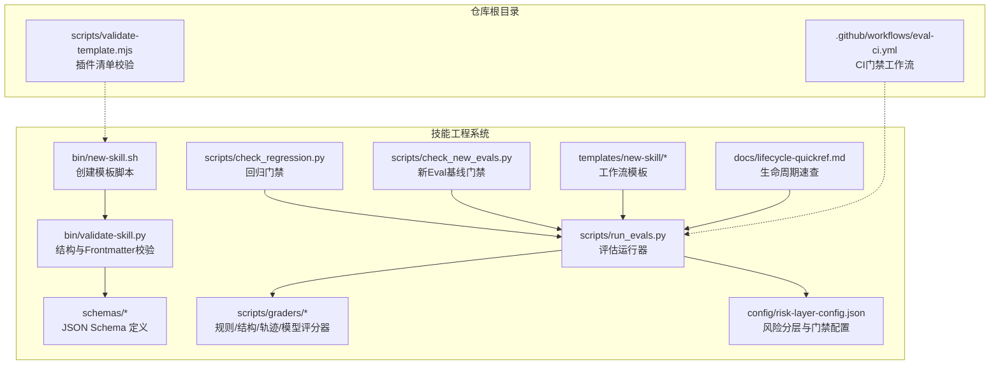

**图表来源**
- [new-skill.sh:1-121](file://plugins/frontend-team-toolkit/skill-engineering/bin/new-skill.sh#L1-L121)
- [validate-skill.py:1-193](file://plugins/frontend-team-toolkit/skill-engineering/bin/validate-skill.py#L1-L193)
- [evals.schema.json:1-40](file://plugins/frontend-team-toolkit/skill-engineering/schemas/evals.schema.json#L1-L40)
- [workflow.schema.json:1-101](file://plugins/frontend-team-toolkit/skill-engineering/schemas/workflow.schema.json#L1-L101)
- [run_evals.py:1-227](file://plugins/frontend-team-toolkit/skill-engineering/scripts/run_evals.py#L1-L227)
- [check_regression.py:1-100](file://plugins/frontend-team-toolkit/skill-engineering/scripts/check_regression.py#L1-L100)
- [check_new_evals.py:1-87](file://plugins/frontend-team-toolkit/skill-engineering/scripts/check_new_evals.py#L1-L87)
- [risk-layer-config.json:1-70](file://plugins/frontend-team-toolkit/skill-engineering/config/risk-layer-config.json#L1-L70)
- [lifecycle-quickref.md:1-32](file://plugins/frontend-team-toolkit/skill-engineering/docs/lifecycle-quickref.md#L1-L32)
- [validate-template.mjs](file://scripts/validate-template.mjs)
- [eval-ci.yml](file://.github/workflows/eval-ci.yml)

**章节来源**
- [README.md:1-294](file://plugins/frontend-team-toolkit/skill-engineering/README.md#L1-L294)
- [lifecycle-quickref.md:1-32](file://plugins/frontend-team-toolkit/skill-engineering/docs/lifecycle-quickref.md#L1-L32)

## 核心组件
- 技能模板系统：通过 new-skill.sh 从模板生成标准目录结构，填充基础文件与占位符，确保后续校验与评估的一致性。
- 结构验证机制：validate-skill.py 校验目录结构、Frontmatter 字段、必要文件与推荐文件，保证工业级质量门槛。
- 评估引擎：run_evals.py 基于 CI 模式（PR/Release/Scheduled）筛选评估集，调用各评分器执行判定，输出结果并汇总统计。
- 工作流管理：支持动态工作流脚本模板与元数据 Schema，结合轨迹评估验证执行顺序与调用链路。
- JSON Schema 验证：提供 evals、workflow、meta、issues 等 Schema，用于结构约束与 CI 校验。
- CI/CD 集成：GitHub Actions 工作流驱动评估运行与门禁检查，形成自动化回归闭环。
- 评分器体系：rule/structure/trajectory/model 四类评分器覆盖关键词/结构/轨迹/语义判定，支持半自动与自动模式。

**章节来源**
- [new-skill.sh:1-121](file://plugins/frontend-team-toolkit/skill-engineering/bin/new-skill.sh#L1-L121)
- [validate-skill.py:1-193](file://plugins/frontend-team-toolkit/skill-engineering/bin/validate-skill.py#L1-L193)
- [run_evals.py:1-227](file://plugins/frontend-team-toolkit/skill-engineering/scripts/run_evals.py#L1-L227)
- [evals.schema.json:1-40](file://plugins/frontend-team-toolkit/skill-engineering/schemas/evals.schema.json#L1-L40)
- [workflow.schema.json:1-101](file://plugins/frontend-team-toolkit/skill-engineering/schemas/workflow.schema.json#L1-L101)
- [check_regression.py:1-100](file://plugins/frontend-team-toolkit/skill-engineering/scripts/check_regression.py#L1-L100)
- [check_new_evals.py:1-87](file://plugins/frontend-team-toolkit/skill-engineering/scripts/check_new_evals.py#L1-L87)
- [risk-layer-config.json:1-70](file://plugins/frontend-team-toolkit/skill-engineering/config/risk-layer-config.json#L1-L70)

## 架构总览
系统采用“模板生成—结构校验—评估运行—门禁检查—CI 回归”的流水线架构。模板与 Schema 作为契约，评估运行器与评分器作为执行与判定单元，CI 工作流串联起 PR 触发、发布前全量与定期回归。

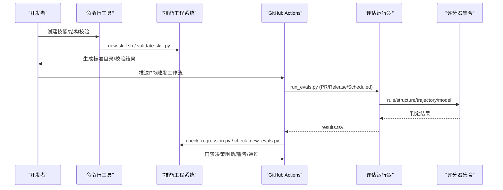

**图表来源**
- [new-skill.sh:1-121](file://plugins/frontend-team-toolkit/skill-engineering/bin/new-skill.sh#L1-L121)
- [validate-skill.py:1-193](file://plugins/frontend-team-toolkit/skill-engineering/bin/validate-skill.py#L1-L193)
- [run_evals.py:1-227](file://plugins/frontend-team-toolkit/skill-engineering/scripts/run_evals.py#L1-L227)
- [check_regression.py:1-100](file://plugins/frontend-team-toolkit/skill-engineering/scripts/check_regression.py#L1-L100)
- [check_new_evals.py:1-87](file://plugins/frontend-team-toolkit/skill-engineering/scripts/check_new_evals.py#L1-L87)
- [eval-ci.yml](file://.github/workflows/eval-ci.yml)

## 详细组件分析

### 技能模板系统（new-skill.sh）
- 功能：从模板复制标准文件，替换占位符（名称、标题、日期），创建 evals/references/scripts 目录与基础文件。
- 关键点：强制 kebab-case 目录命名；输出可指定父目录；生成后提示下一步操作。
- 与工作流：模板目录包含多种工作流脚本模板，便于直接复用。

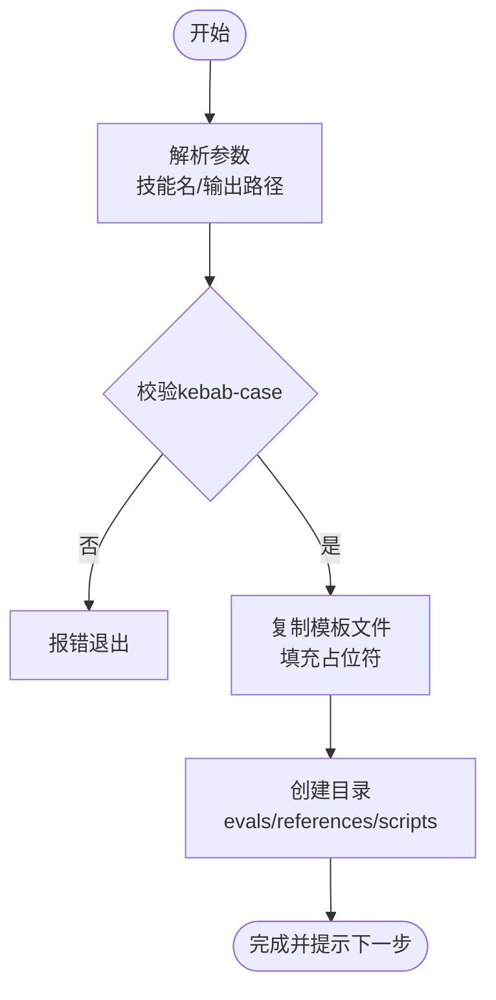

**图表来源**
- [new-skill.sh:1-121](file://plugins/frontend-team-toolkit/skill-engineering/bin/new-skill.sh#L1-L121)

**章节来源**
- [new-skill.sh:1-121](file://plugins/frontend-team-toolkit/skill-engineering/bin/new-skill.sh#L1-L121)

### 结构验证机制（validate-skill.py）
- 功能：校验目录结构、Frontmatter 键值、必要/推荐文件、evals/test-prompts 结构与长度。
- 校验项：
  - 目录名格式与存在性
  - 必备文件：SKILL.md、CHANGELOG.md、.skill-meta.json、evals/evals.json、test-prompts.json、references/output-contract.md
  - 推荐文件：results.tsv、skill-issues.jsonl.example、scripts/validate-output.sh
  - Frontmatter：允许键集合、name 与目录一致性、description 规范、建议包含触发词
  - evals：至少一条用例，每条含 id/prompt
  - test-prompts：数组形式，非空更佳
- 返回：错误/警告列表，错误导致失败。

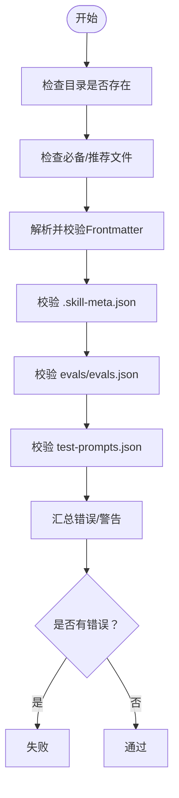

**图表来源**
- [validate-skill.py:1-193](file://plugins/frontend-team-toolkit/skill-engineering/bin/validate-skill.py#L1-L193)

**章节来源**
- [validate-skill.py:1-193](file://plugins/frontend-team-toolkit/skill-engineering/bin/validate-skill.py#L1-L193)

### JSON Schema 验证系统
- 作用：以结构化契约约束技能资产，确保 evals、workflow、meta、issues 等文件符合预期结构，便于 CI 与工具链统一处理。
- 关键 Schema：
  - evals.schema.json：约束 evals/evals.json 的 skill_name、evals 数组与每条用例字段（id、prompt、grader、risk 等）
  - workflow.schema.json：约束动态工作流脚本元数据（workflow_name、workflow_type、input_contract、output_contract、agents、risk 等）
- 使用方式：在 CI 或本地脚本中使用任意 JSON Schema 校验器引用上述文件进行校验。

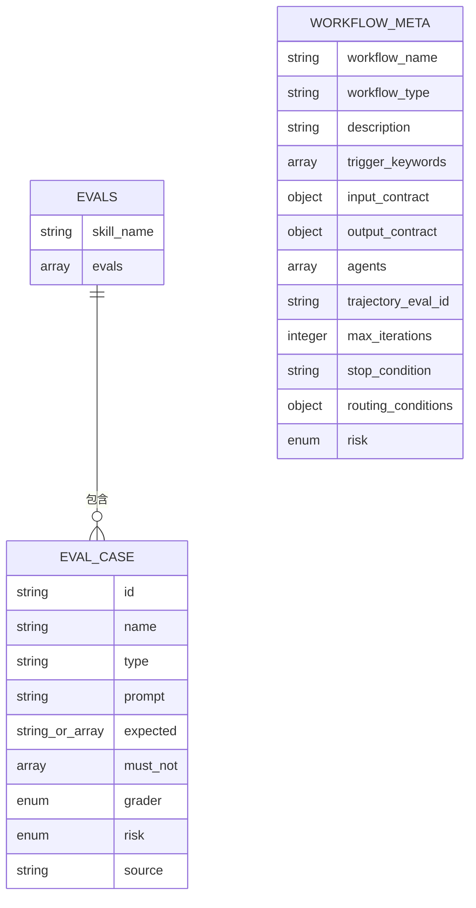

**图表来源**
- [evals.schema.json:1-40](file://plugins/frontend-team-toolkit/skill-engineering/schemas/evals.schema.json#L1-L40)
- [workflow.schema.json:1-101](file://plugins/frontend-team-toolkit/skill-engineering/schemas/workflow.schema.json#L1-L101)

**章节来源**
- [evals.schema.json:1-40](file://plugins/frontend-team-toolkit/skill-engineering/schemas/evals.schema.json#L1-L40)
- [workflow.schema.json:1-101](file://plugins/frontend-team-toolkit/skill-engineering/schemas/workflow.schema.json#L1-L101)

### 评估引擎（run_evals.py）
- 功能：根据 CI 模式（pr/release/scheduled）筛选评估集，调用 skill_runner 执行技能，再由评分器判定，输出 results.tsv 并打印汇总。
- 风险分层：通过 risk-layer-config.json 控制不同模式下的风险过滤、是否阻断回归、随机抽查数量等。
- 评分器组合：支持单一评分器或复合评分器（如 rule+human），非人类评分器全部通过才视为通过。
- 输出：TSV 包含 eval_id、pass、date、version、eval_mode、severity、reviewer、notes 等列。

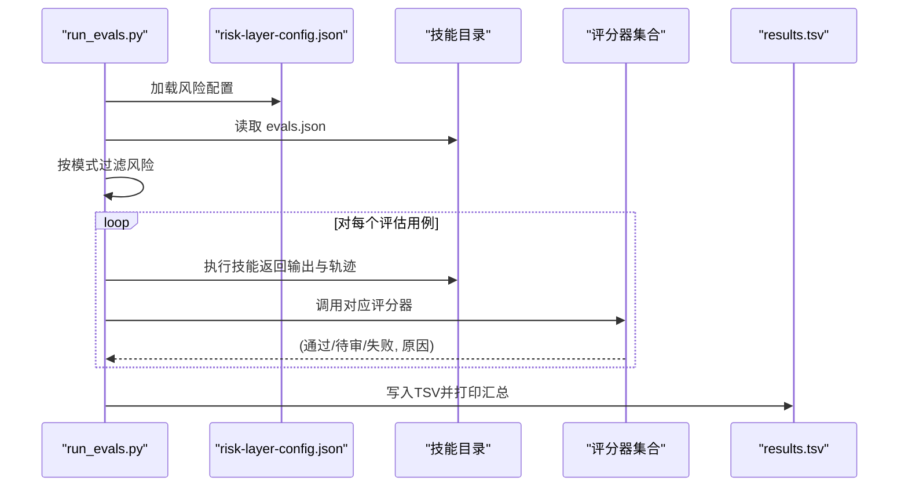

**图表来源**
- [run_evals.py:1-227](file://plugins/frontend-team-toolkit/skill-engineering/scripts/run_evals.py#L1-L227)
- [risk-layer-config.json:1-70](file://plugins/frontend-team-toolkit/skill-engineering/config/risk-layer-config.json#L1-L70)

**章节来源**
- [run_evals.py:1-227](file://plugins/frontend-team-toolkit/skill-engineering/scripts/run_evals.py#L1-L227)
- [risk-layer-config.json:1-70](file://plugins/frontend-team-toolkit/skill-engineering/config/risk-layer-config.json#L1-L70)

### 工作流管理（动态工作流）
- 模板：templates/new-skill/workflows/ 下提供串行、并行、条件、循环、对抗等模板脚本，支持在 SKILL.md 中描述静态契约，在 workflows/*.js 中实现动态编排。
- 元数据 Schema：workflow.schema.json 约束工作流脚本元数据，包括输入/输出契约、触发关键词、代理配置、最大迭代次数、停止条件等。
- 与轨迹评估：通过 trajectory-evals.json 与 trajectory_grader 验证执行顺序与调用链路，确保编排正确性。

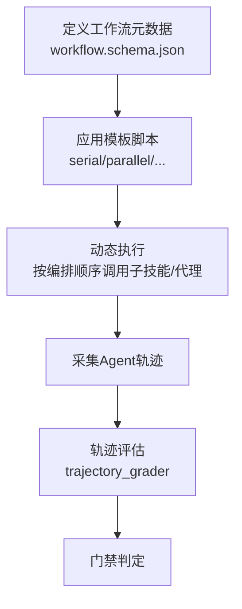

**图表来源**
- [workflow.schema.json:1-101](file://plugins/frontend-team-toolkit/skill-engineering/schemas/workflow.schema.json#L1-L101)
- [serial-workflow.js:1-53](file://plugins/frontend-team-toolkit/skill-engineering/templates/new-skill/workflows/serial-workflow.js#L1-L53)
- [trajectory_grader.py:1-163](file://plugins/frontend-team-toolkit/skill-engineering/scripts/graders/trajectory_grader.py#L1-L163)

**章节来源**
- [workflow.schema.json:1-101](file://plugins/frontend-team-toolkit/skill-engineering/schemas/workflow.schema.json#L1-L101)
- [serial-workflow.js:1-53](file://plugins/frontend-team-toolkit/skill-engineering/templates/new-skill/workflows/serial-workflow.js#L1-L53)
- [trajectory_grader.py:1-163](file://plugins/frontend-team-toolkit/skill-engineering/scripts/graders/trajectory_grader.py#L1-L163)

### 评分器体系
- rule_grader：关键词/路径/禁用词检查，纯规则，零漂移风险。
- structure_grader：章节/步骤/Frontmatter 结构检查，纯规则，零漂移风险。
- trajectory_grader：Agent 调用顺序与并发模式检查，基于轨迹，零漂移风险。
- model_grader：LLM Judge 语义判定，支持本地模拟与 API 模式，半自动，存在漂移风险但可通过多次采样降低。

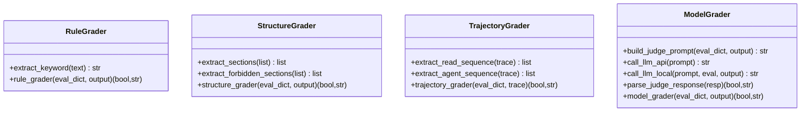

**图表来源**
- [rule_grader.py:1-110](file://plugins/frontend-team-toolkit/skill-engineering/scripts/graders/rule_grader.py#L1-L110)
- [structure_grader.py:1-155](file://plugins/frontend-team-toolkit/skill-engineering/scripts/graders/structure_grader.py#L1-L155)
- [trajectory_grader.py:1-163](file://plugins/frontend-team-toolkit/skill-engineering/scripts/graders/trajectory_grader.py#L1-L163)
- [model_grader.py:1-273](file://plugins/frontend-team-toolkit/skill-engineering/scripts/graders/model_grader.py#L1-L273)

**章节来源**
- [rule_grader.py:1-110](file://plugins/frontend-team-toolkit/skill-engineering/scripts/graders/rule_grader.py#L1-L110)
- [structure_grader.py:1-155](file://plugins/frontend-team-toolkit/skill-engineering/scripts/graders/structure_grader.py#L1-L155)
- [trajectory_grader.py:1-163](file://plugins/frontend-team-toolkit/skill-engineering/scripts/graders/trajectory_grader.py#L1-L163)
- [model_grader.py:1-273](file://plugins/frontend-team-toolkit/skill-engineering/scripts/graders/model_grader.py#L1-L273)

### CI/CD 集成与自动化门禁
- 工作流：.github/workflows/eval-ci.yml 驱动评估运行与门禁检查。
- 门禁三阶段：
  - PR 触发：运行 high+medium 风险评估，high 回归失败阻断合并。
  - 发布前：运行全量评估，回归失败阻断发布。
  - 定期回归：按周/月/季度执行抽查或全量回归。
- 门禁红线：
  - high 回归失败必阻
  - medium 回归失败警告
  - 新增 Eval 未 baseline 必阻
  - 改动技能未跑 baseline 必阻
- 本地/手动触发：提供 gh workflow run 与本地脚本调用方式。

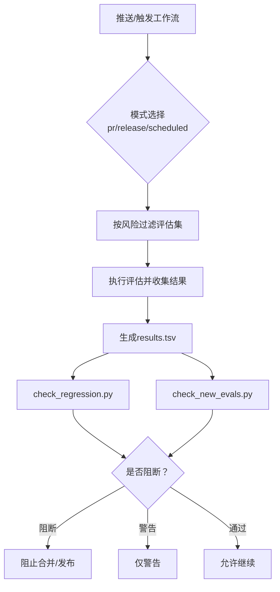

**图表来源**
- [eval-ci.yml](file://.github/workflows/eval-ci.yml)
- [run_evals.py:1-227](file://plugins/frontend-team-toolkit/skill-engineering/scripts/run_evals.py#L1-L227)
- [check_regression.py:1-100](file://plugins/frontend-team-toolkit/skill-engineering/scripts/check_regression.py#L1-L100)
- [check_new_evals.py:1-87](file://plugins/frontend-team-toolkit/skill-engineering/scripts/check_new_evals.py#L1-L87)
- [risk-layer-config.json:1-70](file://plugins/frontend-team-toolkit/skill-engineering/config/risk-layer-config.json#L1-L70)

**章节来源**
- [README.md:168-235](file://plugins/frontend-team-toolkit/skill-engineering/README.md#L168-L235)
- [check_regression.py:1-100](file://plugins/frontend-team-toolkit/skill-engineering/scripts/check_regression.py#L1-L100)
- [check_new_evals.py:1-87](file://plugins/frontend-team-toolkit/skill-engineering/scripts/check_new_evals.py#L1-L87)
- [risk-layer-config.json:1-70](file://plugins/frontend-team-toolkit/skill-engineering/config/risk-layer-config.json#L1-L70)

### 技能生命周期管理
- 8 Phase 速查：创建、边界、写 Eval、Baseline、单假设、验证、棘轮、发布、监控。
- 发布门禁最小清单：结构校验通过、回归无退步、变更日志与 meta 更新。
- 与现有技能关系：通过 validate-skill.py 识别缺口，逐步补齐 evals 与 output-contract。

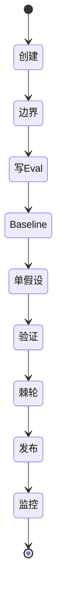

**图表来源**
- [lifecycle-quickref.md:1-32](file://plugins/frontend-team-toolkit/skill-engineering/docs/lifecycle-quickref.md#L1-L32)

**章节来源**
- [lifecycle-quickref.md:1-32](file://plugins/frontend-team-toolkit/skill-engineering/docs/lifecycle-quickref.md#L1-L32)

## 依赖分析
- 组件耦合：
  - run_evals.py 依赖 risk-layer-config.json 与各评分器模块，耦合度适中，便于扩展新评分器。
  - check_regression.py 与 check_new_evals.py 依赖 results.tsv 的固定列结构，需与 run_evals.py 输出保持一致。
  - validate-skill.py 与 JSON Schema 解耦，可独立用于本地校验。
- 外部依赖：
  - model_grader.py 可选依赖 anthropic SDK，未安装时回退为本地模拟。
  - CI 工作流依赖 GitHub Actions 环境变量与 secrets（如 API 密钥）。

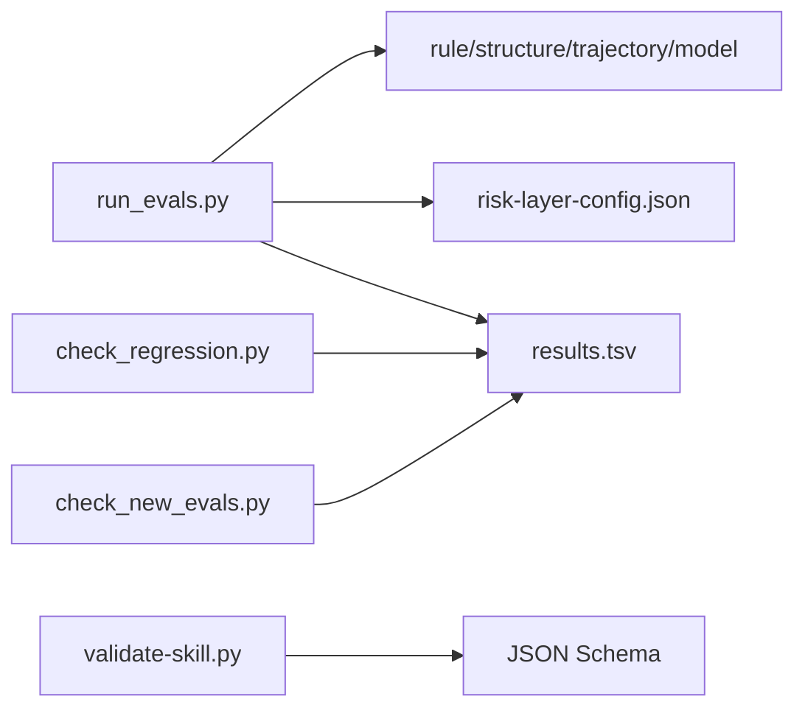

**图表来源**
- [run_evals.py:1-227](file://plugins/frontend-team-toolkit/skill-engineering/scripts/run_evals.py#L1-L227)
- [check_regression.py:1-100](file://plugins/frontend-team-toolkit/skill-engineering/scripts/check_regression.py#L1-L100)
- [check_new_evals.py:1-87](file://plugins/frontend-team-toolkit/skill-engineering/scripts/check_new_evals.py#L1-L87)
- [validate-skill.py:1-193](file://plugins/frontend-team-toolkit/skill-engineering/bin/validate-skill.py#L1-L193)
- [evals.schema.json:1-40](file://plugins/frontend-team-toolkit/skill-engineering/schemas/evals.schema.json#L1-L40)

**章节来源**
- [run_evals.py:1-227](file://plugins/frontend-team-toolkit/skill-engineering/scripts/run_evals.py#L1-L227)
- [check_regression.py:1-100](file://plugins/frontend-team-toolkit/skill-engineering/scripts/check_regression.py#L1-L100)
- [check_new_evals.py:1-87](file://plugins/frontend-team-toolkit/skill-engineering/scripts/check_new_evals.py#L1-L87)
- [validate-skill.py:1-193](file://plugins/frontend-team-toolkit/skill-engineering/bin/validate-skill.py#L1-L193)

## 性能考虑
- 评估运行器：
  - 按模式过滤评估集，减少不必要的执行。
  - scheduled 模式支持随机抽查，平衡覆盖率与成本。
- 评分器：
  - rule/structure/trajectory 为纯规则，计算开销低。
  - model_grader 支持多样本投票，提升稳定性但增加耗时。
- I/O：
  - 评估结果以 TSV 形式批量写入，便于后续处理与可视化。

## 故障排查指南
- 结构校验失败：
  - 检查目录名是否 kebab-case，必备文件是否齐全，Frontmatter 键值是否在允许范围内。
  - 参考路径：[validate-skill.py:1-193](file://plugins/frontend-team-toolkit/skill-engineering/bin/validate-skill.py#L1-L193)
- 评估运行异常：
  - 确认 CI 模式参数与技能名正确，risk 分层配置是否符合预期。
  - 参考路径：[run_evals.py:1-227](file://plugins/frontend-team-toolkit/skill-engineering/scripts/run_evals.py#L1-L227)，[risk-layer-config.json:1-70](file://plugins/frontend-team-toolkit/skill-engineering/config/risk-layer-config.json#L1-L70)
- 回归门禁阻断：
  - 检查 results.tsv 中 regression 类型用例的 pass 状态与 severity。
  - 参考路径：[check_regression.py:1-100](file://plugins/frontend-team-toolkit/skill-engineering/scripts/check_regression.py#L1-L100)
- 新 Eval 未 baseline：
  - 确认 evals.json 中新增用例已在 results.tsv 中有记录。
  - 参考路径：[check_new_evals.py:1-87](file://plugins/frontend-team-toolkit/skill-engineering/scripts/check_new_evals.py#L1-L87)
- LLM 评分器失败：
  - 检查 API 密钥环境变量与网络连通性，或切换为本地模拟模式。
  - 参考路径：[model_grader.py:1-273](file://plugins/frontend-team-toolkit/skill-engineering/scripts/graders/model_grader.py#L1-L273)

**章节来源**
- [validate-skill.py:1-193](file://plugins/frontend-team-toolkit/skill-engineering/bin/validate-skill.py#L1-L193)
- [run_evals.py:1-227](file://plugins/frontend-team-toolkit/skill-engineering/scripts/run_evals.py#L1-L227)
- [check_regression.py:1-100](file://plugins/frontend-team-toolkit/skill-engineering/scripts/check_regression.py#L1-L100)
- [check_new_evals.py:1-87](file://plugins/frontend-team-toolkit/skill-engineering/scripts/check_new_evals.py#L1-L87)
- [model_grader.py:1-273](file://plugins/frontend-team-toolkit/skill-engineering/scripts/graders/model_grader.py#L1-L273)

## 结论
技能工程系统通过标准化模板、严格的结构与 Schema 验证、可扩展的评估引擎与评分器体系，以及完善的 CI/CD 门禁机制，实现了从创建到发布的全流程质量保障。建议在实际使用中：
- 严格遵循生命周期与发布门禁清单
- 优先补齐缺失的工业级文件与评估用例
- 合理配置风险分层与门禁策略
- 将 JSON Schema 与 CI 校验纳入开发流水线

## 附录
- 与仓库其他模块的关系：
  - skill-engineering：创建骨架、结构校验、Schema、生命周期速查、CI 门禁自动化脚本
  - skills：实际 Skill 实现（随 Cursor 插件分发）
  - skills-quality：已有技能的质量台账、问题池、发布门禁
  - .github/workflows/eval-ci.yml：GitHub Actions CI 门禁工作流
- 本地校验示例：
  - 插件清单校验：node scripts/validate-template.mjs
  - 单个技能结构校验：python3 plugins/frontend-team-toolkit/skill-engineering/bin/validate-skill.py <skill-path>

**章节来源**
- [README.md:129-149](file://plugins/frontend-team-toolkit/skill-engineering/README.md#L129-L149)
- [validate-template.mjs](file://scripts/validate-template.mjs)
- [validate-skill.py:282-291](file://plugins/frontend-team-toolkit/skill-engineering/bin/validate-skill.py#L282-L291)