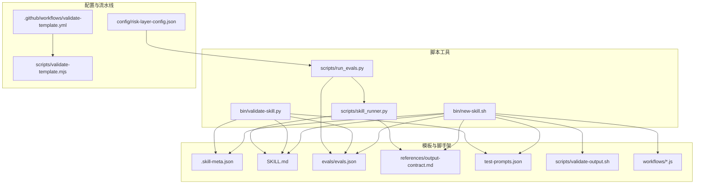
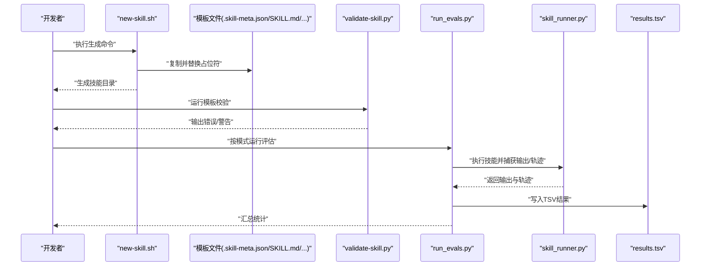
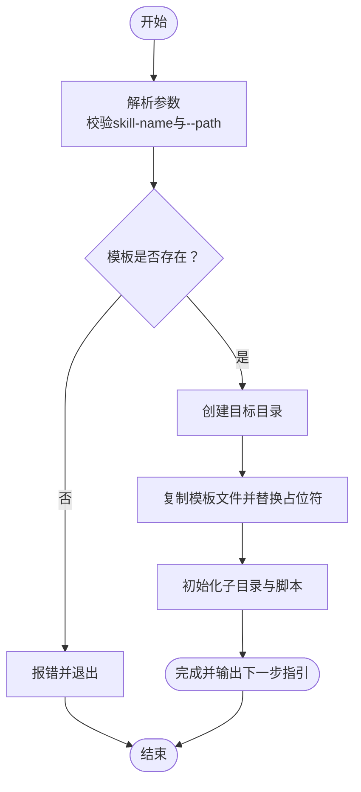
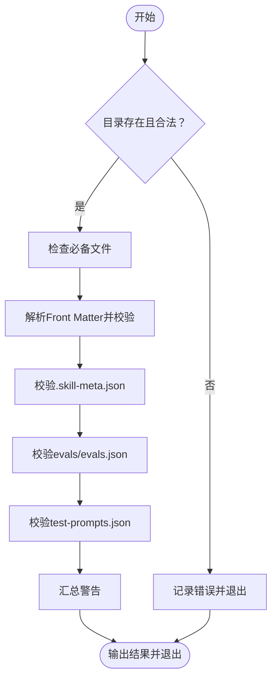
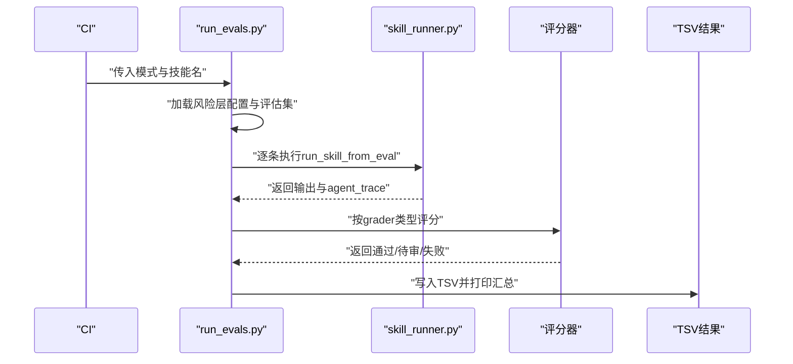
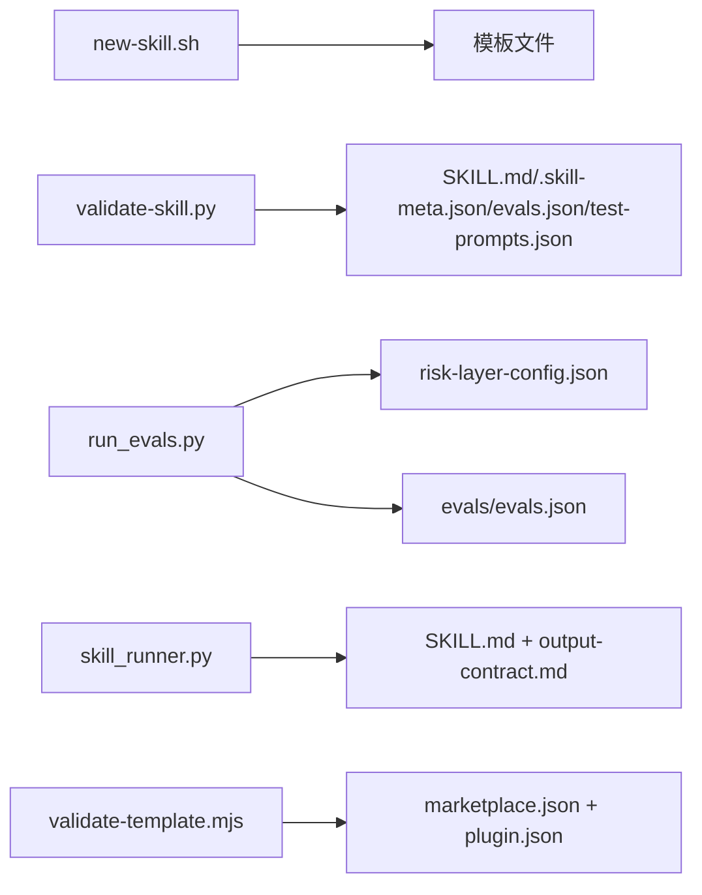

# 技能模板系统

<cite>
**本文引用的文件**
- [new-skill.sh](file://plugins/frontend-team-toolkit/skill-engineering/bin/new-skill.sh)
- [validate-skill.py](file://plugins/frontend-team-toolkit/skill-engineering/bin/validate-skill.py)
- [.skill-meta.json](file://plugins/frontend-team-toolkit/skill-engineering/templates/new-skill/.skill-meta.json)
- [SKILL.md](file://plugins/frontend-team-toolkit/skill-engineering/templates/new-skill/SKILL.md)
- [evals.json](file://plugins/frontend-team-toolkit/skill-engineering/templates/new-skill/evals/evals.json)
- [output-contract.md](file://plugins/frontend-team-toolkit/skill-engineering/templates/new-skill/references/output-contract.md)
- [test-prompts.json](file://plugins/frontend-team-toolkit/skill-engineering/templates/new-skill/test-prompts.json)
- [validate-output.sh](file://plugins/frontend-team-toolkit/skill-engineering/templates/new-skill/scripts/validate-output.sh)
- [serial-workflow.js](file://plugins/frontend-team-toolkit/skill-engineering/templates/new-skill/workflows/serial-workflow.js)
- [run_evals.py](file://plugins/frontend-team-toolkit/skill-engineering/scripts/run_evals.py)
- [skill_runner.py](file://plugins/frontend-team-toolkit/skill-engineering/scripts/skill_runner.py)
- [risk-layer-config.json](file://plugins/frontend-team-toolkit/skill-engineering/config/risk-layer-config.json)
- [validate-template.yml](file://.github/workflows/validate-template.yml)
- [validate-template.mjs](file://scripts/validate-template.mjs)
</cite>

## 目录
1. [简介](#简介)
2. [项目结构](#项目结构)
3. [核心组件](#核心组件)
4. [架构总览](#架构总览)
5. [详细组件分析](#详细组件分析)
6. [依赖关系分析](#依赖关系分析)
7. [性能考量](#性能考量)
8. [故障排查指南](#故障排查指南)
9. [结论](#结论)
10. [附录](#附录)

## 简介
本技术文档面向“技能模板系统”，系统性讲解技能模板的结构组成、创建流程、验证机制、评估与测试体系、工作流编排、以及最佳实践。读者将能够基于模板快速生成高质量的工业级技能，并通过内置的校验与评估工具保障质量与一致性。

## 项目结构
技能模板系统围绕“模板 + 工具 + 配置 + 评估”的整体设计展开，主要由以下部分构成：
- 模板目录：包含技能模板文件与脚手架资源
- 脚本工具：用于生成新技能、校验模板、运行评估
- 配置层：风险层配置与CI流水线
- 示例技能：展示模板的实际应用与扩展

图表来源
- [new-skill.sh:1-121](file://plugins/frontend-team-toolkit/skill-engineering/bin/new-skill.sh#L1-L121)
- [.skill-meta.json:1-32](file://plugins/frontend-team-toolkit/skill-engineering/templates/new-skill/.skill-meta.json#L1-L32)
- [SKILL.md:1-97](file://plugins/frontend-team-toolkit/skill-engineering/templates/new-skill/SKILL.md#L1-L97)
- [evals.json:1-47](file://plugins/frontend-team-toolkit/skill-engineering/templates/new-skill/evals/evals.json#L1-L47)
- [output-contract.md:1-42](file://plugins/frontend-team-toolkit/skill-engineering/templates/new-skill/references/output-contract.md#L1-L42)
- [test-prompts.json:1-18](file://plugins/frontend-team-toolkit/skill-engineering/templates/new-skill/test-prompts.json#L1-L18)
- [validate-output.sh:1-36](file://plugins/frontend-team-toolkit/skill-engineering/templates/new-skill/scripts/validate-output.sh#L1-L36)
- [serial-workflow.js:1-53](file://plugins/frontend-team-toolkit/skill-engineering/templates/new-skill/workflows/serial-workflow.js#L1-L53)
- [run_evals.py:1-227](file://plugins/frontend-team-toolkit/skill-engineering/scripts/run_evals.py#L1-L227)
- [skill_runner.py:1-378](file://plugins/frontend-team-toolkit/skill-engineering/scripts/skill_runner.py#L1-L378)
- [risk-layer-config.json:1-70](file://plugins/frontend-team-toolkit/skill-engineering/config/risk-layer-config.json#L1-L70)
- [validate-template.yml:1-33](file://.github/workflows/validate-template.yml#L1-L33)
- [validate-template.mjs:1-382](file://scripts/validate-template.mjs#L1-L382)

章节来源
- [new-skill.sh:1-121](file://plugins/frontend-team-toolkit/skill-engineering/bin/new-skill.sh#L1-L121)
- [validate-skill.py:1-193](file://plugins/frontend-team-toolkit/skill-engineering/bin/validate-skill.py#L1-L193)
- [run_evals.py:1-227](file://plugins/frontend-team-toolkit/skill-engineering/scripts/run_evals.py#L1-L227)
- [skill_runner.py:1-378](file://plugins/frontend-team-toolkit/skill-engineering/scripts/skill_runner.py#L1-L378)
- [validate-template.mjs:1-382](file://scripts/validate-template.mjs#L1-L382)

## 核心组件
- 模板文件
  - 元数据配置：.skill-meta.json，定义技能名称、版本、成熟度、基线指标、工作流启用与路径、工具链等
  - 技能描述：SKILL.md，采用YAML Front Matter规范，包含技能名称、描述、许可、禁用模型调用、元数据、工作流类型等
  - 评估配置：evals/evals.json，定义评估用例（id、name、type、prompt、expected/must_not、评分器、风险等级、来源）
  - 输出契约：references/output-contract.md，定义交付物格式、禁止事项、格式示例与与评估对齐关系
  - 测试提示：test-prompts.json，包含若干典型提示与期望输出，便于快速验证
  - 输出校验脚本：scripts/validate-output.sh，可选的本地输出校验脚本
  - 工作流模板：workflows/*.js，提供串行、并行、条件、循环、对抗等编排模板
- 脚本工具
  - new-skill.sh：从模板生成新技能目录，替换占位符并初始化目录结构
  - validate-skill.py：校验技能目录结构、Front Matter、必要文件、评估与测试配置
  - run_evals.py：按CI模式（PR/Release/Scheduled）筛选并运行评估，支持复合评分器
  - skill_runner.py：封装本地/Anthropic API/Claude Code三种执行模式，构建上下文并返回输出与轨迹
- 配置与流水线
  - risk-layer-config.json：定义PR/Release/Scheduled模式下的风险过滤、阻断策略、人类评审触发等
  - validate-template.yml + validate-template.mjs：校验市场清单与插件清单一致性、相对路径安全、组件Front Matter完整性

章节来源
- [.skill-meta.json:1-32](file://plugins/frontend-team-toolkit/skill-engineering/templates/new-skill/.skill-meta.json#L1-L32)
- [SKILL.md:1-97](file://plugins/frontend-team-toolkit/skill-engineering/templates/new-skill/SKILL.md#L1-L97)
- [evals.json:1-47](file://plugins/frontend-team-toolkit/skill-engineering/templates/new-skill/evals/evals.json#L1-L47)
- [output-contract.md:1-42](file://plugins/frontend-team-toolkit/skill-engineering/templates/new-skill/references/output-contract.md#L1-L42)
- [test-prompts.json:1-18](file://plugins/frontend-team-toolkit/skill-engineering/templates/new-skill/test-prompts.json#L1-L18)
- [validate-output.sh:1-36](file://plugins/frontend-team-toolkit/skill-engineering/templates/new-skill/scripts/validate-output.sh#L1-L36)
- [serial-workflow.js:1-53](file://plugins/frontend-team-toolkit/skill-engineering/templates/new-skill/workflows/serial-workflow.js#L1-L53)
- [new-skill.sh:1-121](file://plugins/frontend-team-toolkit/skill-engineering/bin/new-skill.sh#L1-L121)
- [validate-skill.py:1-193](file://plugins/frontend-team-toolkit/skill-engineering/bin/validate-skill.py#L1-L193)
- [run_evals.py:1-227](file://plugins/frontend-team-toolkit/skill-engineering/scripts/run_evals.py#L1-L227)
- [skill_runner.py:1-378](file://plugins/frontend-team-toolkit/skill-engineering/scripts/skill_runner.py#L1-L378)
- [risk-layer-config.json:1-70](file://plugins/frontend-team-toolkit/skill-engineering/config/risk-layer-config.json#L1-L70)
- [validate-template.yml:1-33](file://.github/workflows/validate-template.yml#L1-L33)
- [validate-template.mjs:1-382](file://scripts/validate-template.mjs#L1-L382)

## 架构总览
技能模板系统以“模板生成 → 目录校验 → 评估运行 → 结果记录”为主线，结合工作流编排与风险层策略，形成闭环的质量保障体系。

图表来源
- [new-skill.sh:1-121](file://plugins/frontend-team-toolkit/skill-engineering/bin/new-skill.sh#L1-L121)
- [validate-skill.py:1-193](file://plugins/frontend-team-toolkit/skill-engineering/bin/validate-skill.py#L1-L193)
- [run_evals.py:1-227](file://plugins/frontend-team-toolkit/skill-engineering/scripts/run_evals.py#L1-L227)
- [skill_runner.py:1-378](file://plugins/frontend-team-toolkit/skill-engineering/scripts/skill_runner.py#L1-L378)

## 详细组件分析

### 模板文件与结构
- .skill-meta.json
  - 字段要点：skill_name、version、maturity、created_at/updated_at、baseline（基线指标）、workflows（启用开关、工作流目录、文件列表、轨迹评估文件）、toolchain（脚手架、评估运行器、工作流运行器）
  - 作用：统一技能元数据与运行参数，支撑工作流与评估配置解析
- SKILL.md
  - Front Matter：name、description、license、disable-model-invocation、metadata.version、metadata.maturity、metadata.has_workflows、metadata.workflow_types
  - 内容：触发条件、不适用场景、工作流步骤、检查点、输出契约、反模式、评估与升级、动态工作流与调用方式、捆绑资源
- evals/evals.json
  - 字段：skill_name、evals数组，每个用例包含id、name、type（regression/capability）、prompt、expected、must_not、grader（rule/structure/trajectory/model/human或组合）、risk、source
  - 作用：定义结构化评估与能力评估，支持不同风险等级与评分器组合
- references/output-contract.md
  - 定义必须交付节、禁止事项、格式示例、与评估对齐关系，确保输出一致性
- test-prompts.json
  - 快速测试用例集合，便于早期验证
- scripts/validate-output.sh
  - 可选的本地输出校验脚本，支持从stdin或文件读取文本进行规则检查
- workflows/*.js
  - 提供串行、并行、条件、循环、对抗等编排模板，便于按需复用与扩展

章节来源
- [.skill-meta.json:1-32](file://plugins/frontend-team-toolkit/skill-engineering/templates/new-skill/.skill-meta.json#L1-L32)
- [SKILL.md:1-97](file://plugins/frontend-team-toolkit/skill-engineering/templates/new-skill/SKILL.md#L1-L97)
- [evals.json:1-47](file://plugins/frontend-team-toolkit/skill-engineering/templates/new-skill/evals/evals.json#L1-L47)
- [output-contract.md:1-42](file://plugins/frontend-team-toolkit/skill-engineering/templates/new-skill/references/output-contract.md#L1-L42)
- [test-prompts.json:1-18](file://plugins/frontend-team-toolkit/skill-engineering/templates/new-skill/test-prompts.json#L1-L18)
- [validate-output.sh:1-36](file://plugins/frontend-team-toolkit/skill-engineering/templates/new-skill/scripts/validate-output.sh#L1-L36)
- [serial-workflow.js:1-53](file://plugins/frontend-team-toolkit/skill-engineering/templates/new-skill/workflows/serial-workflow.js#L1-L53)

### 模板创建流程（new-skill.sh）
- 输入参数
  - skill-name：kebab-case标识符
  - --path：输出父目录，默认位于插件技能目录
- 处理流程
  - 解析参数与路径，校验模板存在性
  - 创建目标目录，复制模板文件并替换占位符（{{SKILL_NAME}}、{{SKILL_TITLE}}、{{DATE_ISO}}、{{DATE_TIME}}）
  - 初始化evals、references、scripts子目录，复制对应文件并赋予执行权限
  - 输出下一步操作指引（编辑描述、添加评估、运行校验、注册）

图表来源
- [new-skill.sh:1-121](file://plugins/frontend-team-toolkit/skill-engineering/bin/new-skill.sh#L1-L121)

章节来源
- [new-skill.sh:1-121](file://plugins/frontend-team-toolkit/skill-engineering/bin/new-skill.sh#L1-L121)

### 模板验证机制（validate-skill.py）
- 校验范围
  - 目录命名：kebab-case
  - 必备文件：SKILL.md、CHANGELOG.md、.skill-meta.json、evals/evals.json、test-prompts.json、references/output-contract.md
  - 推荐文件：results.tsv、skill-issues.jsonl.example、scripts/validate-output.sh
  - Front Matter：键名合法性、name与目录一致、长度限制、描述长度与内容要求、建议包含“Use when”
  - 元数据：.skill-meta.json中的skill_name与目录一致
  - 评估：evals/evals.json结构与字段完整性
  - 测试：test-prompts.json为数组且非空
- 输出
  - 错误与警告汇总，失败时返回非零退出码

图表来源
- [validate-skill.py:1-193](file://plugins/frontend-team-toolkit/skill-engineering/bin/validate-skill.py#L1-L193)

章节来源
- [validate-skill.py:1-193](file://plugins/frontend-team-toolkit/skill-engineering/bin/validate-skill.py#L1-L193)

### 评估与测试流程（run_evals.py + skill_runner.py）
- run_evals.py
  - 加载风险层配置（PR/Release/Scheduled），按模式筛选评估用例
  - 加载技能评估配置，逐条运行
  - 使用评分器（rule/structure/trajectory/model/human或组合）判定通过/待审/失败
  - 写入TSV结果并打印汇总统计
- skill_runner.py
  - 支持本地模拟、Anthropic API、Claude Code三种执行模式
  - 构建上下文：SKILL.md、references/output-contract.md、可选的scoring-rubric.md
  - 根据评估用例prompt决定是否读取外部文件并拼接
  - 返回输出文本与agent_trace（工具调用、时间戳、token用量等）

图表来源
- [run_evals.py:1-227](file://plugins/frontend-team-toolkit/skill-engineering/scripts/run_evals.py#L1-L227)
- [skill_runner.py:1-378](file://plugins/frontend-team-toolkit/skill-engineering/scripts/skill_runner.py#L1-L378)

章节来源
- [run_evals.py:1-227](file://plugins/frontend-team-toolkit/skill-engineering/scripts/run_evals.py#L1-L227)
- [skill_runner.py:1-378](file://plugins/frontend-team-toolkit/skill-engineering/scripts/skill_runner.py#L1-L378)

### 工作流编排与复用
- 工作流模板
  - 串行工作流：两阶段依赖执行，最终合成结果
  - 并行工作流：无依赖的多分支并行
  - 条件工作流：动态路由至子技能
  - 循环工作流：不确定工作量的任务持续执行直至完成
  - 对抗工作流：独立agent验证输出
- 复用建议
  - 将通用步骤抽取为函数或子模块
  - 明确输入/输出变量命名约定
  - 通过占位符替换实现差异化定制

章节来源
- [serial-workflow.js:1-53](file://plugins/frontend-team-toolkit/skill-engineering/templates/new-skill/workflows/serial-workflow.js#L1-L53)

### 市场清单与模板校验（CI）
- validate-template.yml
  - 在PR/Push触发，运行validate-template.mjs
- validate-template.mjs
  - 校验市场清单字段、插件清单一致性、相对路径安全性
  - 校验各组件（规则/技能/代理/命令）Front Matter完整性
  - 输出警告/错误并终止CI

章节来源
- [validate-template.yml:1-33](file://.github/workflows/validate-template.yml#L1-L33)
- [validate-template.mjs:1-382](file://scripts/validate-template.mjs#L1-L382)

## 依赖关系分析
- 组件耦合
  - new-skill.sh与模板文件强耦合，负责复制与占位符替换
  - validate-skill.py依赖SKILL.md与.eval配置，确保结构与内容合规
  - run_evals.py依赖risk-layer-config.json与evals/evals.json，驱动评估执行
  - skill_runner.py依赖SKILL.md与references/output-contract.md，构建执行上下文
- 外部依赖
  - Anthropic API（可选）：用于API模式执行
  - Claude Code CLI（可选）：用于本地集成执行
- 潜在循环依赖
  - 无直接循环依赖，各模块职责清晰

图表来源
- [new-skill.sh:1-121](file://plugins/frontend-team-toolkit/skill-engineering/bin/new-skill.sh#L1-L121)
- [validate-skill.py:1-193](file://plugins/frontend-team-toolkit/skill-engineering/bin/validate-skill.py#L1-L193)
- [run_evals.py:1-227](file://plugins/frontend-team-toolkit/skill-engineering/scripts/run_evals.py#L1-L227)
- [skill_runner.py:1-378](file://plugins/frontend-team-toolkit/skill-engineering/scripts/skill_runner.py#L1-L378)
- [validate-template.mjs:1-382](file://scripts/validate-template.mjs#L1-L382)

章节来源
- [new-skill.sh:1-121](file://plugins/frontend-team-toolkit/skill-engineering/bin/new-skill.sh#L1-L121)
- [validate-skill.py:1-193](file://plugins/frontend-team-toolkit/skill-engineering/bin/validate-skill.py#L1-L193)
- [run_evals.py:1-227](file://plugins/frontend-team-toolkit/skill-engineering/scripts/run_evals.py#L1-L227)
- [skill_runner.py:1-378](file://plugins/frontend-team-toolkit/skill-engineering/scripts/skill_runner.py#L1-L378)
- [validate-template.mjs:1-382](file://scripts/validate-template.mjs#L1-L382)

## 性能考量
- 评估执行
  - 优先使用风险层配置过滤用例，减少不必要的计算
  - 复合评分器中，非人类评分器应尽量自动化，降低人工干预成本
- 执行模式
  - 本地模拟适合快速迭代；API/Claude Code适合与外部系统集成
  - 合理设置超时与重试策略，避免长时间阻塞
- 输出校验
  - validate-output.sh建议逐步引入更严格的规则，避免过度检查导致维护成本上升

## 故障排查指南
- new-skill.sh
  - 模板不存在：确认模板目录路径正确
  - 目录已存在：更换目标目录或删除旧目录
  - 参数非法：遵循kebab-case命名与合法选项
- validate-skill.py
  - Front Matter缺失或键名非法：补齐并修正键名
  - 文件缺失：按必备/推荐文件清单补齐
  - 评估/测试配置异常：检查JSON结构与字段完整性
- run_evals.py
  - 风险层配置错误：检查PR/Release/Scheduled模式配置
  - 评分器类型不支持：确认grader字段合法
- skill_runner.py
  - API密钥缺失：设置ANTHROPIC_API_KEY或切换本地模式
  - Claude Code不可用：安装并配置CLI，或回退本地模式
- validate-template.mjs
  - 相对路径不安全：避免使用..或绝对路径
  - Front Matter缺失：为规则/技能/代理/命令补齐Front Matter

章节来源
- [new-skill.sh:1-121](file://plugins/frontend-team-toolkit/skill-engineering/bin/new-skill.sh#L1-L121)
- [validate-skill.py:1-193](file://plugins/frontend-team-toolkit/skill-engineering/bin/validate-skill.py#L1-L193)
- [run_evals.py:1-227](file://plugins/frontend-team-toolkit/skill-engineering/scripts/run_evals.py#L1-L227)
- [skill_runner.py:1-378](file://plugins/frontend-team-toolkit/skill-engineering/scripts/skill_runner.py#L1-L378)
- [validate-template.mjs:1-382](file://scripts/validate-template.mjs#L1-L382)

## 结论
技能模板系统通过标准化的模板文件、完善的脚本工具与严谨的评估流程，实现了从“创建 → 校验 → 评估 → 记录”的全生命周期管理。借助工作流模板与风险层配置，团队可以高效地构建、验证与演进高质量技能，确保交付质量与一致性。

## 附录
- 最佳实践
  - 使用kebab-case命名技能目录与文件
  - 在SKILL.md中明确触发词、不适用场景与工作流步骤
  - 为每个评估用例提供清晰的expected与must_not
  - 逐步完善validate-output.sh规则，提升自动化校验覆盖率
  - 利用工作流模板快速搭建复杂编排，保持步骤可追溯
  - 在PR/Release/Scheduled模式下合理配置风险层，平衡效率与质量
- 快速上手清单
  - 使用new-skill.sh生成模板
  - 编辑SKILL.md与.eval配置
  - 运行validate-skill.py进行自检
  - 添加test-prompts.json进行快速验证
  - 按需编写validate-output.sh规则
  - 通过run_evals.py在CI中执行评估并记录结果