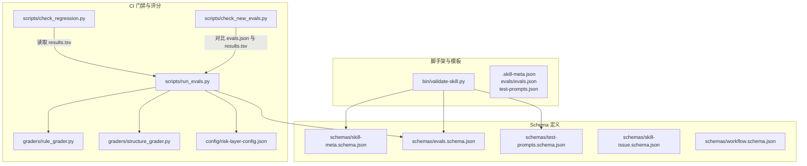
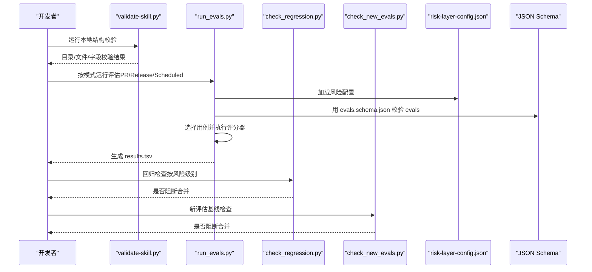
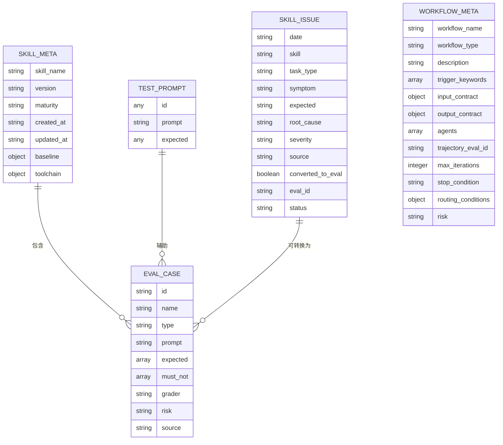
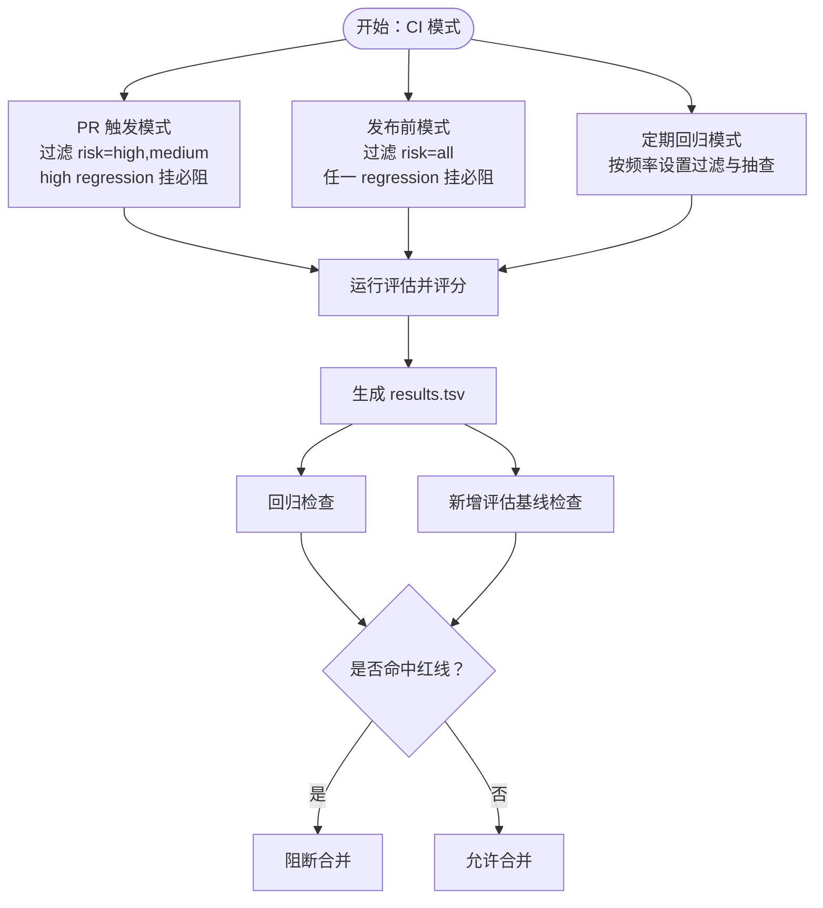
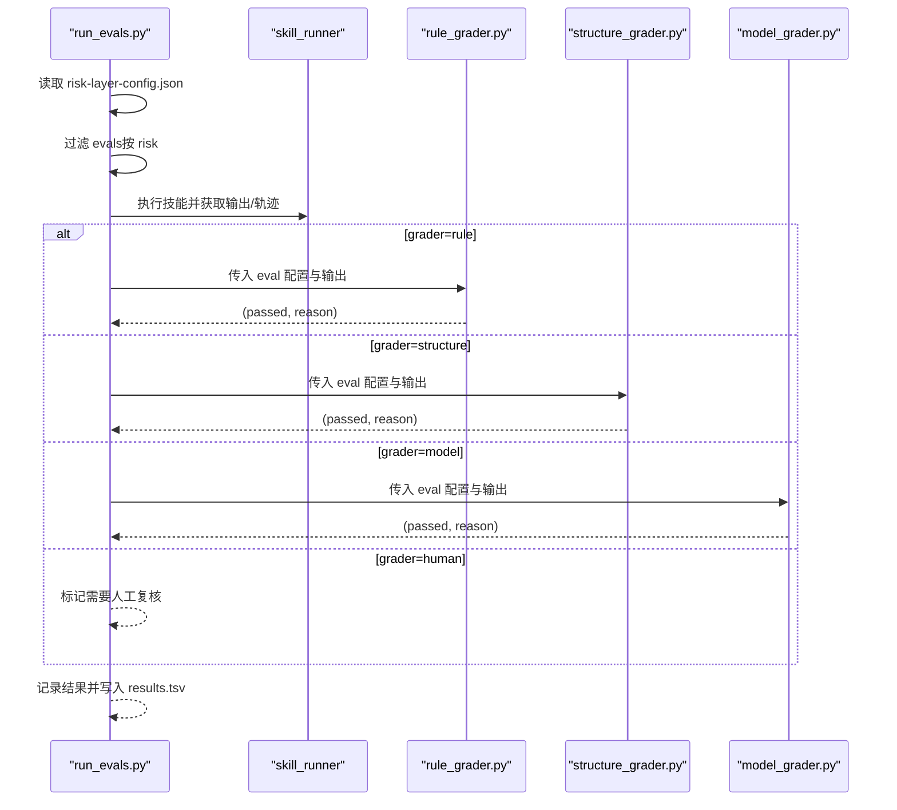
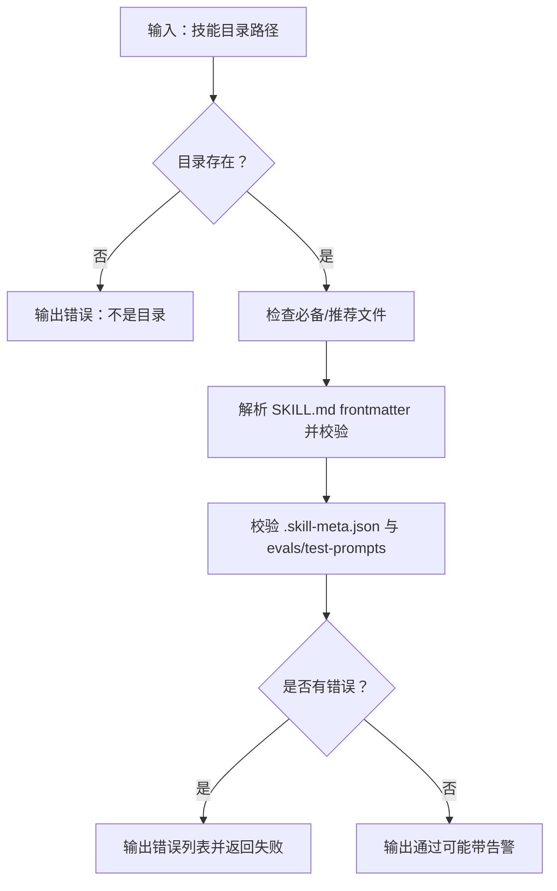
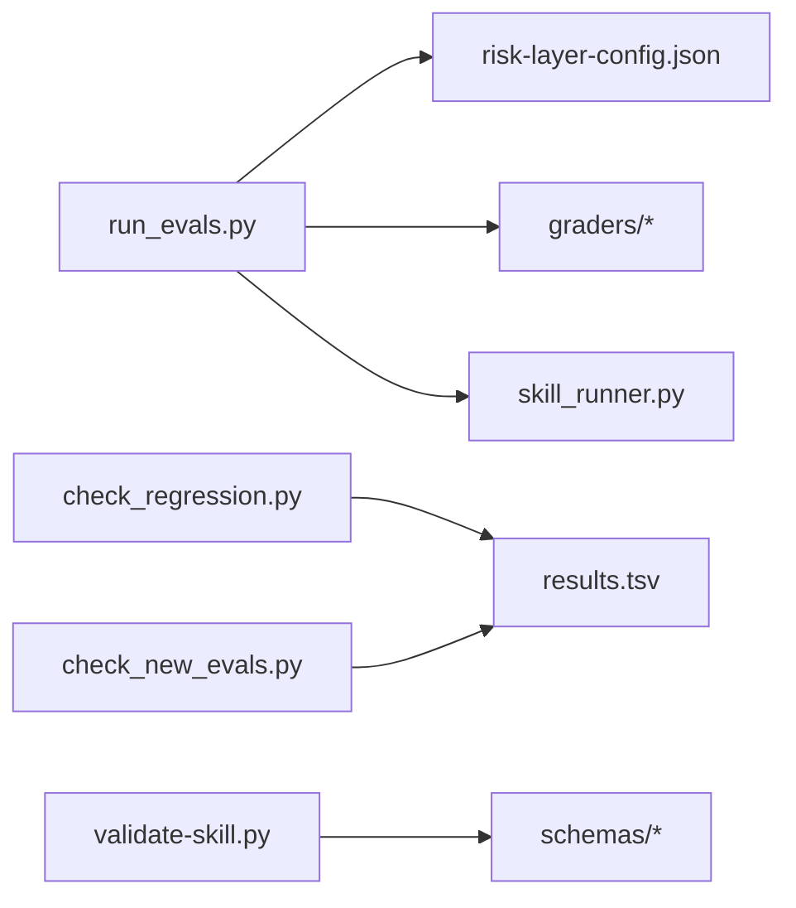

# 数据验证系统

<cite>
**本文档引用的文件**
- [README.md](file://plugins/frontend-team-toolkit/skill-engineering/README.md)
- [validate-skill.py](file://plugins/frontend-team-toolkit/skill-engineering/bin/validate-skill.py)
- [run_evals.py](file://plugins/frontend-team-toolkit/skill-engineering/scripts/run_evals.py)
- [check_regression.py](file://plugins/frontend-team-toolkit/skill-engineering/scripts/check_regression.py)
- [check_new_evals.py](file://plugins/frontend-team-toolkit/skill-engineering/scripts/check_new_evals.py)
- [rule_grader.py](file://plugins/frontend-team-toolkit/skill-engineering/scripts/graders/rule_grader.py)
- [structure_grader.py](file://plugins/frontend-team-toolkit/skill-engineering/scripts/graders/structure_grader.py)
- [risk-layer-config.json](file://plugins/frontend-team-toolkit/skill-engineering/config/risk-layer-config.json)
- [skill-meta.schema.json](file://plugins/frontend-team-toolkit/skill-engineering/schemas/skill-meta.schema.json)
- [evals.schema.json](file://plugins/frontend-team-toolkit/skill-engineering/schemas/evals.schema.json)
- [skill-issue.schema.json](file://plugins/frontend-team-toolkit/skill-engineering/schemas/skill-issue.schema.json)
- [test-prompts.schema.json](file://plugins/frontend-team-toolkit/skill-engineering/schemas/test-prompts.schema.json)
- [workflow.schema.json](file://plugins/frontend-team-toolkit/skill-engineering/schemas/workflow.schema.json)
- [.skill-meta.json](file://plugins/frontend-team-toolkit/skill-engineering/templates/new-skill/.skill-meta.json)
- [evals.json](file://plugins/frontend-team-toolkit/skill-engineering/templates/new-skill/evals/evals.json)
- [test-prompts.json](file://plugins/frontend-team-toolkit/skill-engineering/templates/new-skill/test-prompts.json)
</cite>

## 目录
1. [简介](#简介)
2. [项目结构](#项目结构)
3. [核心组件](#核心组件)
4. [架构总览](#架构总览)
5. [详细组件分析](#详细组件分析)
6. [依赖关系分析](#依赖关系分析)
7. [性能考量](#性能考量)
8. [故障排查指南](#故障排查指南)
9. [结论](#结论)
10. [附录](#附录)

## 简介
本文件面向“数据验证系统”的设计与实现，聚焦以下目标：
- 解释 JSON Schema 在技能工程中的作用与配置方法，覆盖技能元数据、评估配置、工作流定义等各类 Schema 的结构与约束。
- 阐述从 Schema 定义到实际验证执行的完整流程，包括结构校验、评估运行、回归检查与新增评估基线检查。
- 说明风险层配置系统的设计思路与应用场景，如何通过配置驱动 CI 门禁策略。
- 提供 Schema 编写指南与验证错误排查方法，帮助开发者构建可靠的数据验证体系。

## 项目结构
该系统围绕“脚手架 + Schema + CI 门禁 + 评分器”组织，关键目录与职责如下：
- skill-engineering/bin：本地结构校验脚本 validate-skill.py，确保目录结构与 frontmatter 符合规范。
- skill-engineering/schemas：各类 JSON Schema，用于强约束 evals、test-prompts、skill-meta、skill-issue、workflow 等数据结构。
- skill-engineering/config：风险层配置 risk-layer-config.json，定义 PR/Release/Scheduled 三种模式下的风险过滤、阻断规则与评分器配置。
- skill-engineering/scripts：评估运行 run_evals.py、回归检查 check_regression.py、新增评估基线检查 check_new_evals.py，以及 rule/structure 等评分器。
- templates/new-skill：新技能模板，包含 .skill-meta.json、evals/evals.json、test-prompts.json 等，便于快速生成符合 Schema 的文件。

图表来源
- [validate-skill.py:1-193](file://plugins/frontend-team-toolkit/skill-engineering/bin/validate-skill.py#L1-L193)
- [run_evals.py:1-227](file://plugins/frontend-team-toolkit/skill-engineering/scripts/run_evals.py#L1-L227)
- [check_regression.py:1-100](file://plugins/frontend-team-toolkit/skill-engineering/scripts/check_regression.py#L1-L100)
- [check_new_evals.py:1-87](file://plugins/frontend-team-toolkit/skill-engineering/scripts/check_new_evals.py#L1-L87)
- [risk-layer-config.json:1-70](file://plugins/frontend-team-toolkit/skill-engineering/config/risk-layer-config.json#L1-L70)
- [skill-meta.schema.json:1-25](file://plugins/frontend-team-toolkit/skill-engineering/schemas/skill-meta.schema.json#L1-L25)
- [evals.schema.json:1-40](file://plugins/frontend-team-toolkit/skill-engineering/schemas/evals.schema.json#L1-L40)
- [test-prompts.schema.json:1-22](file://plugins/frontend-team-toolkit/skill-engineering/schemas/test-prompts.schema.json#L1-L22)
- [skill-issue.schema.json:1-21](file://plugins/frontend-team-toolkit/skill-engineering/schemas/skill-issue.schema.json#L1-L21)
- [workflow.schema.json:1-101](file://plugins/frontend-team-toolkit/skill-engineering/schemas/workflow.schema.json#L1-L101)

章节来源
- [README.md:1-294](file://plugins/frontend-team-toolkit/skill-engineering/README.md#L1-L294)

## 核心组件
- 结构校验器（validate-skill.py）：解析 SKILL.md frontmatter，校验目录命名、必要文件、字段格式与长度限制，并对 evals/test-prompts 的基本结构进行基础校验。
- 评估运行器（run_evals.py）：按 CI 模式（PR/Release/Scheduled）加载风险配置，筛选评估用例，调用对应评分器执行，产出 results.tsv。
- 回归检查器（check_regression.py）：从 results.tsv 中识别 regression 类型失败用例，依据风险级别决定是否阻断合并。
- 新增评估检查器（check_new_evals.py）：对比 evals.json 与 results.tsv，阻止未跑基线的新评估合并。
- 评分器（graders）：rule_grader.py、structure_grader.py 等，基于规则与正则表达式对输出进行自动化判定。
- 风险层配置（risk-layer-config.json）：定义不同模式下的风险过滤、阻断策略、评分器自动化程度与漂移风险等级。
- JSON Schema（schemas/*）：对 .skill-meta.json、evals/evals.json、test-prompts.json、skill-issues.jsonl、workflows/*.js 元数据进行强约束。

章节来源
- [validate-skill.py:1-193](file://plugins/frontend-team-toolkit/skill-engineering/bin/validate-skill.py#L1-L193)
- [run_evals.py:1-227](file://plugins/frontend-team-toolkit/skill-engineering/scripts/run_evals.py#L1-L227)
- [check_regression.py:1-100](file://plugins/frontend-team-toolkit/skill-engineering/scripts/check_regression.py#L1-L100)
- [check_new_evals.py:1-87](file://plugins/frontend-team-toolkit/skill-engineering/scripts/check_new_evals.py#L1-L87)
- [risk-layer-config.json:1-70](file://plugins/frontend-team-toolkit/skill-engineering/config/risk-layer-config.json#L1-L70)
- [rule_grader.py:1-110](file://plugins/frontend-team-toolkit/skill-engineering/scripts/graders/rule_grader.py#L1-L110)
- [structure_grader.py:1-155](file://plugins/frontend-team-toolkit/skill-engineering/scripts/graders/structure_grader.py#L1-L155)

## 架构总览
下图展示从“本地结构校验”到“CI 门禁”的端到端流程，以及 Schema 在各环节的作用。

图表来源
- [validate-skill.py:83-167](file://plugins/frontend-team-toolkit/skill-engineering/bin/validate-skill.py#L83-L167)
- [run_evals.py:135-174](file://plugins/frontend-team-toolkit/skill-engineering/scripts/run_evals.py#L135-L174)
- [check_regression.py:37-54](file://plugins/frontend-team-toolkit/skill-engineering/scripts/check_regression.py#L37-L54)
- [check_new_evals.py:66-67](file://plugins/frontend-team-toolkit/skill-engineering/scripts/check_new_evals.py#L66-L67)
- [risk-layer-config.json:1-70](file://plugins/frontend-team-toolkit/skill-engineering/config/risk-layer-config.json#L1-L70)
- [evals.schema.json:1-40](file://plugins/frontend-team-toolkit/skill-engineering/schemas/evals.schema.json#L1-L40)

## 详细组件分析

### JSON Schema 设计与应用
- 技能元数据（skill-meta.schema.json）
  - 约束字段：skill_name、version、maturity、时间戳、baseline 对象（含 eval_run_at、regression_pass_rate、capability_pass_rate、notes）、toolchain。
  - 用途：统一 .skill-meta.json 结构，保障基线统计与工具链元信息一致性。
- 评估配置（evals.schema.json）
  - 约束字段：skill_name（正则匹配）、evals 数组（至少一项），每个 evalCase 包含 id/name/type/prompt/expected/must_not/grader/risk/source。
  - expected 支持字符串或字符串数组；grader 限定枚举；risk 限定枚举；type 限定 capability/regression。
  - 用途：保证 evals.json 的结构与语义正确，便于自动化评分与回归管理。
- 测试提示（test-prompts.schema.json）
  - 约束字段：数组项至少一项，每项包含 id（整数或字符串）、prompt（非空）、expected（字符串或非空字符串数组）。
  - 用途：统一 test-prompts.json 的结构，支撑快速验证与基准生成。
- 技能问题（skill-issue.schema.json）
  - 约束字段：date/skill/task_type/symptom/expected/root_cause/severity/source/converted_to_eval/eval_id/status。
  - 用途：规范化问题池记录，便于追踪与转换为回归用例。
- 工作流元数据（workflow.schema.json）
  - 约束字段：workflow_name、workflow_type（枚举）、description、trigger_keywords、input_contract、output_contract、agents、trajectory_eval_id、max_iterations、stop_condition、routing_conditions、risk。
  - 用途：约束动态工作流脚本元数据，确保输入输出契约与风险标注一致。

图表来源
- [skill-meta.schema.json:1-25](file://plugins/frontend-team-toolkit/skill-engineering/schemas/skill-meta.schema.json#L1-L25)
- [evals.schema.json:1-40](file://plugins/frontend-team-toolkit/skill-engineering/schemas/evals.schema.json#L1-L40)
- [test-prompts.schema.json:1-22](file://plugins/frontend-team-toolkit/skill-engineering/schemas/test-prompts.schema.json#L1-L22)
- [skill-issue.schema.json:1-21](file://plugins/frontend-team-toolkit/skill-engineering/schemas/skill-issue.schema.json#L1-L21)
- [workflow.schema.json:1-101](file://plugins/frontend-team-toolkit/skill-engineering/schemas/workflow.schema.json#L1-L101)

章节来源
- [skill-meta.schema.json:1-25](file://plugins/frontend-team-toolkit/skill-engineering/schemas/skill-meta.schema.json#L1-L25)
- [evals.schema.json:1-40](file://plugins/frontend-team-toolkit/skill-engineering/schemas/evals.schema.json#L1-L40)
- [test-prompts.schema.json:1-22](file://plugins/frontend-toolkit/skill-engineering/schemas/test-prompts.schema.json#L1-L22)
- [skill-issue.schema.json:1-21](file://plugins/frontend-team-toolkit/skill-engineering/schemas/skill-issue.schema.json#L1-L21)
- [workflow.schema.json:1-101](file://plugins/frontend-team-toolkit/skill-engineering/schemas/workflow.schema.json#L1-L101)

### 风险层配置系统
- 设计思路
  - 将 CI 门禁分为 PR 触发、发布前、定期回归三阶段，分别定义风险过滤范围与阻断策略。
  - 评分器配置区分自动化程度与漂移风险等级，支持半自动模型评分与随机抽查。
  - 红线规则明确阻断与警告项，如 high 级 regression 挂起必阻、新增评估未基线必阻、改技能未跑基线必阻。
- 应用场景
  - PR 模式：仅运行 high+medium 风险用例，high 级 regression 挂起必阻，防止回归退化。
  - Release 模式：运行全量用例，任何 regression 挂起必阻，确保上线质量。
  - Scheduled 模式：按周/月/季度设定风险过滤与抽查数量，平衡回归覆盖面与成本。
- 与评估运行器的集成
  - run_evals.py 读取 risk-layer-config.json，按模式筛选用例并执行评分，最终输出 results.tsv。
  - check_regression.py 与 check_new_evals.py 基于 results.tsv 判定是否阻断合并。

图表来源
- [risk-layer-config.json:1-70](file://plugins/frontend-team-toolkit/skill-engineering/config/risk-layer-config.json#L1-L70)
- [run_evals.py:135-174](file://plugins/frontend-team-toolkit/skill-engineering/scripts/run_evals.py#L135-L174)
- [check_regression.py:37-54](file://plugins/frontend-team-toolkit/skill-engineering/scripts/check_regression.py#L37-L54)
- [check_new_evals.py:66-67](file://plugins/frontend-team-toolkit/skill-engineering/scripts/check_new_evals.py#L66-L67)

章节来源
- [risk-layer-config.json:1-70](file://plugins/frontend-team-toolkit/skill-engineering/config/risk-layer-config.json#L1-L70)
- [run_evals.py:1-227](file://plugins/frontend-team-toolkit/skill-engineering/scripts/run_evals.py#L1-L227)
- [check_regression.py:1-100](file://plugins/frontend-team-toolkit/skill-engineering/scripts/check_regression.py#L1-L100)
- [check_new_evals.py:1-87](file://plugins/frontend-team-toolkit/skill-engineering/scripts/check_new_evals.py#L1-L87)

### 评估运行与评分器
- 评估运行器（run_evals.py）
  - 加载风险配置与技能 evals.json，按模式过滤用例，逐条执行 skill_runner 获取输出与 agent_trace，再调用对应评分器。
  - 支持复合评分器（如 rule+human），非人类评分全部通过才视为通过，若包含 human 则标记待人工复核。
  - 输出 results.tsv，包含 eval_id、pass、date、version、eval_mode、severity、reviewer、notes 等字段。
- 规则评分器（rule_grader.py）
  - 从 expected/must_not 中提取关键词、路径、章节等要求，对输出进行关键字匹配与禁止词检查。
  - 支持中文“必须/不得/路径/章节”等模式，以及英文“must/include/forbid”等模式。
- 结构评分器（structure_grader.py）
  - 检查输出是否包含指定章节（支持 #/#）、是否出现禁止章节、是否包含 frontmatter、是否包含指定步骤序列等。

图表来源
- [run_evals.py:84-132](file://plugins/frontend-team-toolkit/skill-engineering/scripts/run_evals.py#L84-L132)
- [rule_grader.py:41-92](file://plugins/frontend-team-toolkit/skill-engineering/scripts/graders/rule_grader.py#L41-L92)
- [structure_grader.py:63-122](file://plugins/frontend-team-toolkit/skill-engineering/scripts/graders/structure_grader.py#L63-L122)

章节来源
- [run_evals.py:1-227](file://plugins/frontend-team-toolkit/skill-engineering/scripts/run_evals.py#L1-L227)
- [rule_grader.py:1-110](file://plugins/frontend-team-toolkit/skill-engineering/scripts/graders/rule_grader.py#L1-L110)
- [structure_grader.py:1-155](file://plugins/frontend-team-toolkit/skill-engineering/scripts/graders/structure_grader.py#L1-L155)

### 本地结构校验（validate-skill.py）
- 校验要点
  - 目录名：必须为 kebab-case。
  - 必备文件：SKILL.md、CHANGELOG.md、.skill-meta.json、evals/evals.json、test-prompts.json、references/output-contract.md。
  - 推荐文件：results.tsv、skill-issues.jsonl.example、scripts/validate-output.sh。
  - frontmatter：name 与目录名一致且不超过长度限制；description 存在且不超过长度限制，建议包含触发短语；body 建议包含 when not to use/workflow/checkpoint 等章节。
  - .skill-meta.json：skill_name 与目录名一致。
  - evals.json：至少有一条用例，每条用例包含 id 与 prompt。
  - test-prompts.json：必须为数组且至少一项。
- 错误与告警：以 ERROR/WARN 形式输出，便于本地修复。

图表来源
- [validate-skill.py:83-167](file://plugins/frontend-team-toolkit/skill-engineering/bin/validate-skill.py#L83-L167)

章节来源
- [validate-skill.py:1-193](file://plugins/frontend-team-toolkit/skill-engineering/bin/validate-skill.py#L1-L193)

### 模板与示例
- .skill-meta.json 模板：包含版本、成熟度、baseline、workflows 开关与文件列表、toolchain 等字段，便于新技能快速落地。
- evals.json 模板：包含 regression/capability 类型用例，示例 grader 与 risk 等字段，便于填充具体业务场景。
- test-prompts.json 模板：提供 happy path、缺输入/歧义、边界场景等典型 prompt 与 expected。

章节来源
- [.skill-meta.json:1-32](file://plugins/frontend-team-toolkit/skill-engineering/templates/new-skill/.skill-meta.json#L1-L32)
- [evals.json:1-47](file://plugins/frontend-team-toolkit/skill-engineering/templates/new-skill/evals/evals.json#L1-L47)
- [test-prompts.json:1-18](file://plugins/frontend-team-toolkit/skill-engineering/templates/new-skill/test-prompts.json#L1-L18)

## 依赖关系分析
- 组件耦合
  - run_evals.py 依赖 risk-layer-config.json 与多个评分器模块，同时依赖 skill_runner（通过导入路径注入）。
  - check_regression.py 与 check_new_evals.py 依赖 results.tsv 的固定列结构。
  - validate-skill.py 与各 Schema 文件解耦，但依赖文件存在性与基本结构。
- 外部依赖
  - Python 标准库（json/re/csv/argparse/pathlib 等）。
  - 可选 LLM Judge（model_grader）依赖外部服务（在 README 中说明）。

图表来源
- [run_evals.py:25-35](file://plugins/frontend-team-toolkit/skill-engineering/scripts/run_evals.py#L25-L35)
- [check_regression.py:22-34](file://plugins/frontend-team-toolkit/skill-engineering/scripts/check_regression.py#L22-L34)
- [check_new_evals.py:22-42](file://plugins/frontend-team-toolkit/skill-engineering/scripts/check_new_evals.py#L22-L42)
- [validate-skill.py:11-14](file://plugins/frontend-team-toolkit/skill-engineering/bin/validate-skill.py#L11-L14)

章节来源
- [run_evals.py:1-227](file://plugins/frontend-team-toolkit/skill-engineering/scripts/run_evals.py#L1-L227)
- [check_regression.py:1-100](file://plugins/frontend-team-toolkit/skill-engineering/scripts/check_regression.py#L1-L100)
- [check_new_evals.py:1-87](file://plugins/frontend-team-toolkit/skill-engineering/scripts/check_new_evals.py#L1-L87)
- [validate-skill.py:1-193](file://plugins/frontend-team-toolkit/skill-engineering/bin/validate-skill.py#L1-L193)

## 性能考量
- 评估运行器
  - 用例筛选与随机抽查（spot check）在内存中完成，适合中小规模用例集。
  - 评分器为纯文本匹配与正则，复杂度与输出长度近似线性。
- 文件 I/O
  - 评估运行与检查均以 CSV/JSON 读写为主，注意大文件时的编码与换行符处理。
- 可扩展性
  - 评分器可替换为更复杂的模型评分器，但需控制并发与采样次数以避免漂移。
  - 风险层配置可按团队规模与发布节奏调整抽查比例与阻断策略。

## 故障排查指南
- 本地结构校验失败
  - 目录名不符合 kebab-case 或缺失必备文件：根据 validate-skill.py 输出逐项修复。
  - frontmatter 字段缺失或不合法：参考 SKILL.md 模板与 agentskills.io 规范补充。
  - evals.json/test-prompts.json 结构不合法：对照 evals.schema.json/test-prompts.schema.json 修正字段与类型。
- 评估运行失败
  - 用例被过滤：检查 risk-layer-config.json 的 risk_filter 设置。
  - 评分器判定失败：查看 rule_grader/structure_grader 的报错原因，调整 expected/must_not 或输出格式。
  - results.tsv 列不匹配：确认 run_evals.py 写入的列顺序与 check_regression/check_new_evals 读取一致。
- 回归检查阻断
  - high 级 regression 挂起：优先修复高风险用例；必要时回滚变更。
  - medium 级 regression：按风险层配置决定是否阻断；建议尽快修复。
- 新增评估未基线
  - 未在 results.tsv 中找到对应记录：先运行基线评估并写入 results.tsv，再尝试合并。

章节来源
- [validate-skill.py:170-192](file://plugins/frontend-team-toolkit/skill-engineering/bin/validate-skill.py#L170-L192)
- [run_evals.py:189-224](file://plugins/frontend-team-toolkit/skill-engineering/scripts/run_evals.py#L189-L224)
- [check_regression.py:57-96](file://plugins/frontend-team-toolkit/skill-engineering/scripts/check_regression.py#L57-L96)
- [check_new_evals.py:45-83](file://plugins/frontend-team-toolkit/skill-engineering/scripts/check_new_evals.py#L45-L83)

## 结论
本数据验证系统通过“Schema 强约束 + 风险层配置 + 自动化评分器 + CI 门禁”的组合，实现了从技能模板到评估闭环的全流程质量保障。Schema 明确了数据结构与语义边界，风险层配置灵活适配不同发布节奏，评分器提供可扩展的自动化判定能力，CI 脚本确保每次变更都经过可重复的回归与基线检查。建议在团队内推广使用模板与 Schema，持续完善评分器与风险配置，以提升整体交付质量与稳定性。

## 附录

### JSON Schema 编写指南
- 字段命名与类型
  - 使用明确的字符串/数组/对象类型，必要时使用 oneOf/enum 限定取值范围。
  - 对关键字段添加 minLength/maxLength/minItems 等约束，减少歧义。
- 引用与复用
  - 使用 $defs 定义可复用的数据片段（如 evalCase），并在 items/$ref 中引用。
- 示例与测试
  - 为每个 Schema 提供最小可用示例，结合模板文件（如 .skill-meta.json、evals.json、test-prompts.json）进行联调测试。

章节来源
- [skill-meta.schema.json:1-25](file://plugins/frontend-team-toolkit/skill-engineering/schemas/skill-meta.schema.json#L1-L25)
- [evals.schema.json:1-40](file://plugins/frontend-team-toolkit/skill-engineering/schemas/evals.schema.json#L1-L40)
- [test-prompts.schema.json:1-22](file://plugins/frontend-team-toolkit/skill-engineering/schemas/test-prompts.schema.json#L1-L22)
- [skill-issue.schema.json:1-21](file://plugins/frontend-team-toolkit/skill-engineering/schemas/skill-issue.schema.json#L1-L21)
- [workflow.schema.json:1-101](file://plugins/frontend-team-toolkit/skill-engineering/schemas/workflow.schema.json#L1-L101)
- [.skill-meta.json:1-32](file://plugins/frontend-team-toolkit/skill-engineering/templates/new-skill/.skill-meta.json#L1-L32)
- [evals.json:1-47](file://plugins/frontend-team-toolkit/skill-engineering/templates/new-skill/evals/evals.json#L1-L47)
- [test-prompts.json:1-18](file://plugins/frontend-team-toolkit/skill-engineering/templates/new-skill/test-prompts.json#L1-L18)