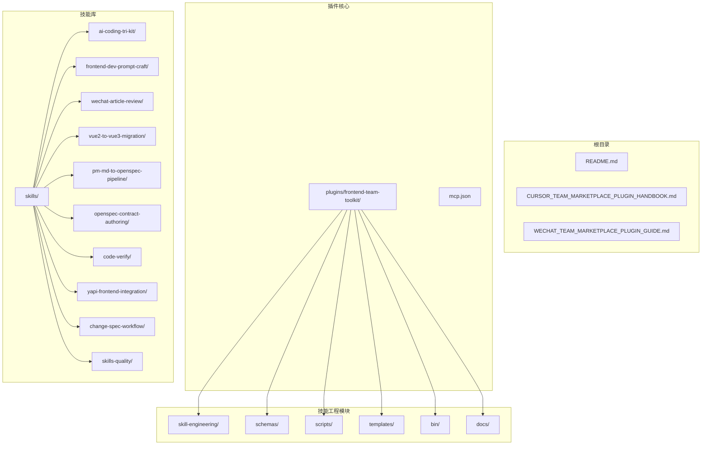
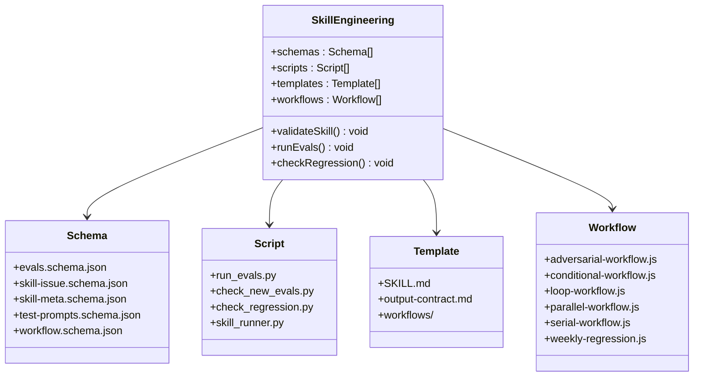
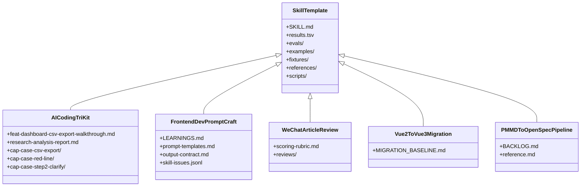
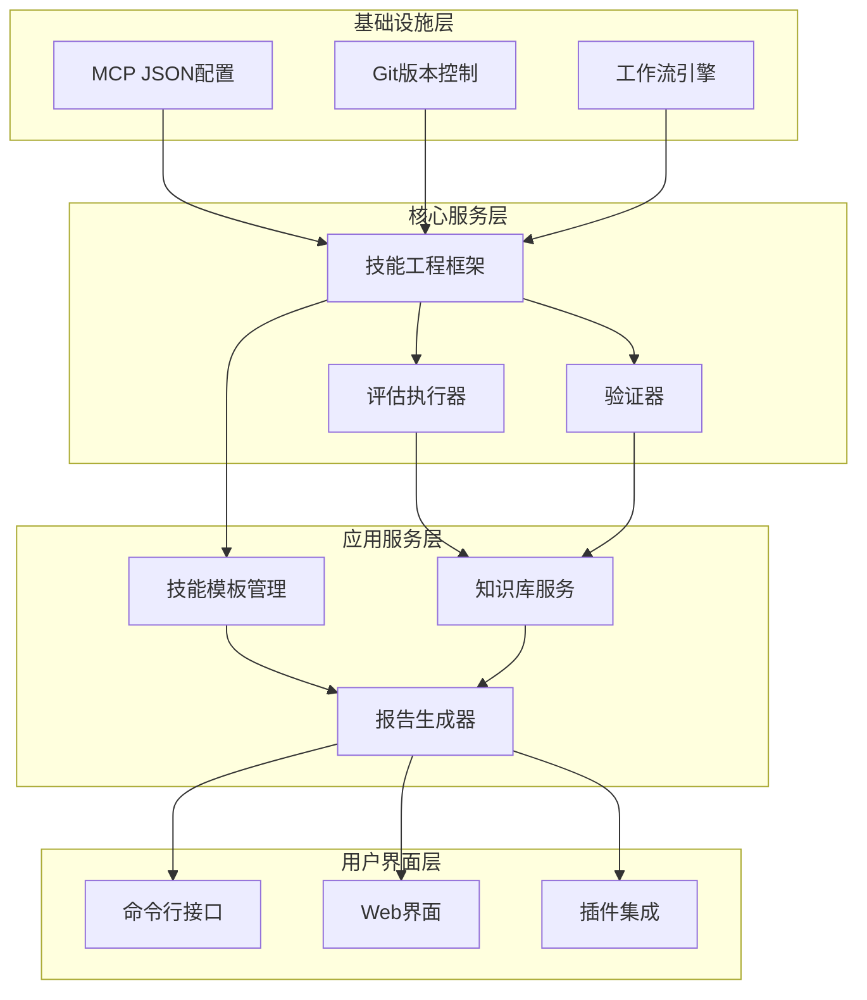
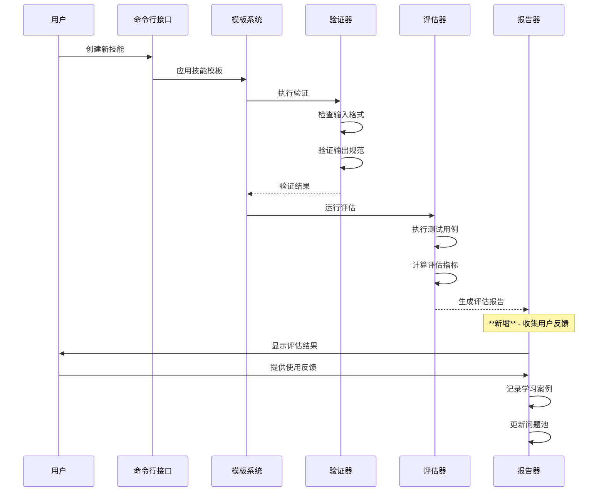
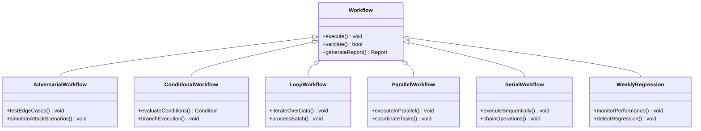
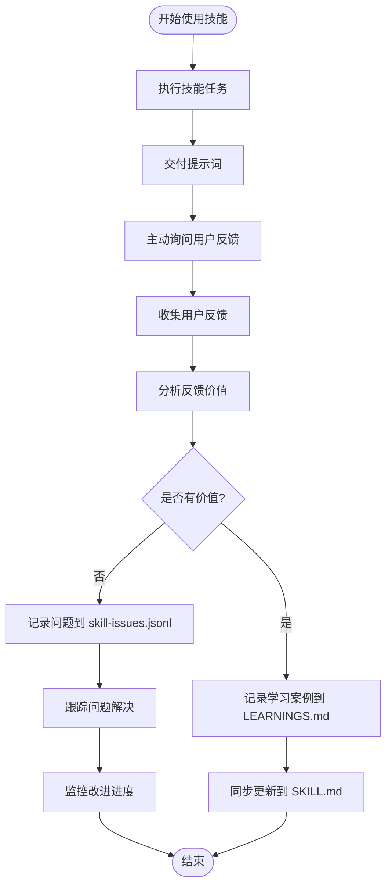
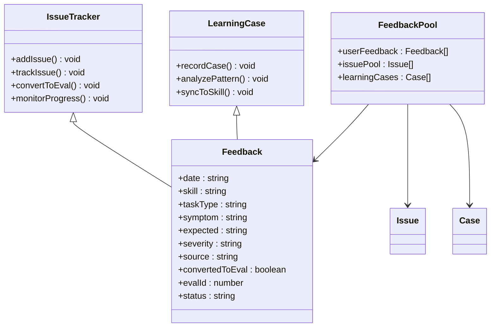

# 知识管理系统

<cite>
**本文档引用的文件**
- [README.md](file://README.md)
- [plugins/frontend-team-toolkit/README.md](file://plugins/frontend-team-toolkit/README.md)
- [plugins/frontend-team-toolkit/skill-engineering/README.md](file://plugins/frontend-team-toolkit/skill-engineering/README.md)
- [plugins/frontend-team-toolkit/skill-engineering/docs/lifecycle-quickref.md](file://plugins/frontend-team-toolkit/skill-engineering/docs/lifecycle-quickref.md)
- [plugins/frontend-team-toolkit/skill-engineering/templates/new-skill/SKILL.md](file://plugins/frontend-team-toolkit/skill-engineering/templates/new-skill/SKILL.md)
- [plugins/frontend-team-toolkit/skill-engineering/templates/new-skill/references/output-contract.md](file://plugins/frontend-team-toolkit/skill-engineering/templates/new-skill/references/output-contract.md)
- [plugins/frontend-team-toolkit/skill-engineering/templates/new-skill/workflows/README.md](file://plugins/frontend-team-toolkit/skill-engineering/templates/new-skill/workflows/README.md)
- [plugins/frontend-team-toolkit/skill-engineering/templates/new-skill/workflows/adversarial-workflow.js](file://plugins/frontend-team-toolkit/skill-engineering/templates/new-skill/workflows/adversarial-workflow.js)
- [plugins/frontend-team-toolkit/skill-engineering/templates/new-skill/workflows/conditional-workflow.js](file://plugins/frontend-team-toolkit/skill-engineering/templates/new-skill/workflows/conditional-workflow.js)
- [plugins/frontend-team-toolkit/skill-engineering/templates/new-skill/workflows/loop-workflow.js](file://plugins/frontend-team-toolkit/skill-engineering/templates/new-skill/workflows/loop-workflow.js)
- [plugins/frontend-team-toolkit/skill-engineering/templates/new-skill/workflows/parallel-workflow.js](file://plugins/frontend-team-toolkit/skill-engineering/templates/new-skill/workflows/parallel-workflow.js)
- [plugins/frontend-team-toolkit/skill-engineering/templates/new-skill/workflows/serial-workflow.js](file://plugins/frontend-team-toolkit/skill-engineering/templates/new-skill/workflows/serial-workflow.js)
- [plugins/frontend-team-toolkit/skill-engineering/templates/new-skill/workflows/weekly-regression.js](file://plugins/frontend-team-toolkit/skill-engineering/templates/new-skill/workflows/weekly-regression.js)
- [plugins/frontend-team-toolkit/skill-engineering/schemas/evals.schema.json](file://plugins/frontend-team-toolkit/skill-engineering/schemas/evals.schema.json)
- [plugins/frontend-team-toolkit/skill-engineering/schemas/skill-issue.schema.json](file://plugins/frontend-team-toolkit/skill-engineering/schemas/skill-issue.schema.json)
- [plugins/frontend-team-toolkit/skill-engineering/schemas/skill-meta.schema.json](file://plugins/frontend-team-toolkit/skill-engineering/schemas/skill-meta.schema.json)
- [plugins/frontend-team-toolkit/skill-engineering/schemas/test-prompts.schema.json](file://plugins/frontend-team-toolkit/skill-engineering/schemas/test-prompts.schema.json)
- [plugins/frontend-team-toolkit/skill-engineering/schemas/workflow.schema.json](file://plugins/frontend-team-toolkit/skill-engineering/schemas/workflow.schema.json)
- [plugins/frontend-team-toolkit/skill-engineering/scripts/run_evals.py](file://plugins/frontend-team-toolkit/skill-engineering/scripts/run_evals.py)
- [plugins/frontend-team-toolkit/skill-engineering/scripts/check_new_evals.py](file://plugins/frontend-team-toolkit/skill-engineering/scripts/check_new_evals.py)
- [plugins/frontend-team-toolkit/skill-engineering/scripts/check_regression.py](file://plugins/frontend-team-toolkit/skill-engineering/scripts/check_regression.py)
- [plugins/frontend-team-toolkit/skill-engineering/scripts/skill_runner.py](file://plugins/frontend-team-toolkit/skill-engineering/scripts/skill_runner.py)
- [plugins/frontend-team-toolkit/skill-engineering/bin/new-skill.sh](file://plugins/frontend-team-toolkit/skill-engineering/bin/new-skill.sh)
- [plugins/frontend-team-toolkit/skill-engineering/bin/validate-skill.py](file://plugins/frontend-team-toolkit/skill-engineering/bin/validate-skill.py)
- [plugins/frontend-team-toolkit/skills/ai-coding-tri-kit/SKILL.md](file://plugins/frontend-team-toolkit/skills/ai-coding-tri-kit/SKILL.md)
- [plugins/frontend-team-toolkit/skills/ai-coding-tri-kit/research-analysis-report.md](file://plugins/frontend-team-toolkit/skills/ai-coding-tri-kit/research-analysis-report.md)
- [plugins/frontend-team-toolkit/skills/ai-coding-tri-kit/results.tsv](file://plugins/frontend-team-toolkit/skills/ai-coding-tri-kit/results.tsv)
- [plugins/frontend-team-toolkit/skills/ai-coding-tri-kit/examples/feat-dashboard-csv-export-walkthrough.md](file://plugins/frontend-team-toolkit/skills/ai-coding-tri-kit/examples/feat-dashboard-csv-export-walkthrough.md)
- [plugins/frontend-team-toolkit/skills/ai-coding-tri-kit/fixtures/cap-case-csv-export/input-requirement.md](file://plugins/frontend-team-toolkit/skills/ai-coding-tri-kit/fixtures/cap-case-csv-export/input-requirement.md)
- [plugins/frontend-team-toolkit/skills/ai-coding-tri-kit/fixtures/cap-case-csv-export/expected-notes.md](file://plugins/frontend-team-toolkit/skills/ai-coding-tri-kit/fixtures/cap-case-csv-export/expected-notes.md)
- [plugins/frontend-team-toolkit/skills/ai-coding-tri-kit/fixtures/cap-case-red-line/skip-spec-trap.md](file://plugins/frontend-team-toolkit/skills/ai-coding-tri-kit/fixtures/cap-case-red-line/skip-spec-trap.md)
- [plugins/frontend-team-toolkit/skills/ai-coding-tri-kit/fixtures/cap-case-step2-clarify/ambiguous-requirement.md](file://plugins/frontend-team-toolkit/skills/ai-coding-tri-kit/fixtures/cap-case-step2-clarify/ambiguous-requirement.md)
- [plugins/frontend-team-toolkit/skills/ai-coding-tri-kit/fixtures/cap-case-step2-clarify/expected-notes.md](file://plugins/frontend-team-toolkit/skills/ai-coding-tri-kit/fixtures/cap-case-step2-clarify/expected-notes.md)
- [plugins/frontend-team-toolkit/skills/ai-coding-tri-kit/references/environment-check.md](file://plugins/frontend-team-toolkit/skills/ai-coding-tri-kit/references/environment-check.md)
- [plugins/frontend-team-toolkit/skills/ai-coding-tri-kit/references/fallback-scenarios.md](file://plugins/frontend-team-toolkit/skills/ai-coding-tri-kit/references/fallback-scenarios.md)
- [plugins/frontend-team-toolkit/skills/ai-coding-tri-kit/references/gates-and-rollback.md](file://plugins/frontend-team-toolkit/skills/ai-coding-tri-kit/references/gates-and-rollback.md)
- [plugins/frontend-team-toolkit/skills/ai-coding-tri-kit/references/intensity-tiers.md](file://plugins/frontend-team-toolkit/skills/ai-coding-tri-kit/references/intensity-tiers.md)
- [plugins/frontend-team-toolkit/skills/ai-coding-tri-kit/references/workflow-matrix.md](file://plugins/frontend-team-toolkit/skills/ai-coding-tri-kit/references/workflow-matrix.md)
- [plugins/frontend-team-toolkit/skills/frontend-dev-prompt-craft/SKILL.md](file://plugins/frontend-team-toolkit/skills/frontend-dev-prompt-craft/SKILL.md)
- [plugins/frontend-team-toolkit/skills/frontend-dev-prompt-craft/LEARNINGS.md](file://plugins/frontend-team-toolkit/skills/frontend-dev-prompt-craft/LEARNINGS.md)
- [plugins/frontend-team-toolkit/skills/frontend-dev-prompt-craft/references/output-contract.md](file://plugins/frontend-team-toolkit/skills/frontend-dev-prompt-craft/references/output-contract.md)
- [plugins/frontend-team-toolkit/skills/frontend-dev-prompt-craft/references/prompt-templates.md](file://plugins/frontend-team-toolkit/skills/frontend-dev-prompt-craft/references/prompt-templates.md)
- [plugins/frontend-team-toolkit/skills/frontend-dev-prompt-craft/skill-issues.jsonl](file://plugins/frontend-team-toolkit/skills/frontend-dev-prompt-craft/skill-issues.jsonl)
- [plugins/frontend-team-toolkit/skills/frontend-dev-prompt-craft/skill-issues.jsonl.example](file://plugins/frontend-team-toolkit/skills/frontend-dev-prompt-craft/skill-issues.jsonl.example)
- [plugins/frontend-team-toolkit/skills/wechat-article-review/SKILL.md](file://plugins/frontend-team-toolkit/skills/wechat-article-review/SKILL.md)
- [plugins/frontend-team-toolkit/skills/wechat-article-review/references/scoring-rubric.md](file://plugins/frontend-team-toolkit/skills/wechat-article-review/references/scoring-rubric.md)
- [plugins/frontend-team-toolkit/skills/vue2-to-vue3-migration/SKILL.md](file://plugins/frontend-team-toolkit/skills/vue2-to-vue3-migration/SKILL.md)
- [plugins/frontend-team-toolkit/skills/vue2-to-vue3-migration/MIGRATION_BASELINE.md](file://plugins/frontend-team-toolkit/skills/vue2-to-vue3-migration/MIGRATION_BASELINE.md)
- [plugins/frontend-team-toolkit/skills/pm-md-to-openspec-pipeline/SKILL.md](file://plugins/frontend-team-toolkit/skills/pm-md-to-openspec-pipeline/SKILL.md)
- [plugins/frontend-team-toolkit/skills/pm-md-to-openspec-pipeline/reference.md](file://plugins/frontend-team-toolkit/skills/pm-md-to-openspec-pipeline/reference.md)
- [plugins/frontend-team-toolkit/skills/pm-md-to-openspec-pipeline/BACKLOG.md](file://plugins/frontend-team-toolkit/skills/pm-md-to-openspec-pipeline/BACKLOG.md)
- [plugins/frontend-team-toolkit/skills/openspec-contract-authoring/reference.md](file://plugins/frontend-team-toolkit/skills/openspec-contract-authoring/reference.md)
- [plugins/frontend-team-toolkit/skills/openspec-contract-authoring/results.tsv](file://plugins/frontend-team-toolkit/skills/openspec-contract-authoring/results.tsv)
- [plugins/frontend-team-toolkit/skills/openspec-contract-authoring/test-prompts.json](file://plugins/frontend-team-toolkit/skills/openspec-contract-authoring/test-prompts.json)
- [plugins/frontend-team-toolkit/skills/code-verify/examples/README.md](file://plugins/frontend-team-toolkit/skills/code-verify/examples/README.md)
- [plugins/frontend-team-toolkit/skills/code-verify/examples/wecom-js-sdk.md](file://plugins/frontend-team-toolkit/skills/code-verify/examples/wecom-js-sdk.md)
- [plugins/frontend-team-toolkit/skills/yapi-frontend-integration/reference.md](file://plugins/frontend-team-toolkit/skills/yapi-frontend-integration/reference.md)
- [plugins/frontend-team-toolkit/skills/change-spec-workflow/SKILL.md](file://plugins/frontend-team-toolkit/skills/change-spec-workflow/SKILL.md)
- [plugins/frontend-team-toolkit/skills/change-spec-workflow/results.tsv](file://plugins/frontend-team-toolkit/skills/change-spec-workflow/results.tsv)
- [plugins/frontend-team-toolkit/skills/skills-quality/README.md](file://plugins/frontend-team-toolkit/skills/skills-quality/README.md)
- [plugins/frontend-team-toolkit/skills/skills-quality/eval-plan.md](file://plugins/frontend-team-toolkit/skills/skills-quality/eval-plan.md)
- [plugins/frontend-team-toolkit/skills/skills-quality/skill-issues.jsonl](file://plugins/frontend-team-toolkit/skills/skills-quality/skill-issues.jsonl)
- [plugins/frontend-team-toolkit/mcp.json](file://plugins/frontend-team-toolkit/mcp.json)
</cite>

## 更新摘要
**所做更改**
- 新增了学习案例和问题反馈机制章节，反映前端开发提示词创作技能中的知识沉淀实践
- 更新了技能生命周期管理，增加了反馈闭环和持续改进流程
- 完善了多维度评估体系，增加了学习案例评估维度
- 新增了知识库管理章节，展示了学习案例的具体应用场景

## 目录
1. [简介](#简介)
2. [项目结构](#项目结构)
3. [核心组件](#核心组件)
4. [架构概览](#架构概览)
5. [详细组件分析](#详细组件分析)
6. [学习案例与问题反馈机制](#学习案例与问题反馈机制)
7. [依赖关系分析](#依赖关系分析)
8. [性能考虑](#性能考虑)
9. [故障排除指南](#故障排除指南)
10. [结论](#结论)

## 简介

这是一个面向前端团队的知识管理系统，基于 Cursor 插件生态构建。该系统通过标准化的工作流程、评估机制和知识模板，为团队提供了一套完整的技能开发和知识管理解决方案。

系统的核心目标是：
- 标准化技能开发流程
- 建立知识评估体系
- 提供可复用的知识模板
- 支持多维度技能评估
- 实现知识的持续改进
- **新增**：建立学习案例收集和问题反馈机制，促进知识沉淀和持续优化

## 项目结构

该项目采用模块化的组织方式，主要包含以下核心部分：



**图表来源**
- [plugins/frontend-team-toolkit/README.md](file://plugins/frontend-team-toolkit/README.md)
- [plugins/frontend-team-toolkit/skill-engineering/README.md](file://plugins/frontend-team-toolkit/skill-engineering/README.md)

**章节来源**
- [README.md](file://README.md)
- [plugins/frontend-team-toolkit/README.md](file://plugins/frontend-team-toolkit/README.md)

## 核心组件

### 技能工程框架

技能工程框架是整个知识管理系统的核心，提供了标准化的技能开发流程和评估机制。



**图表来源**
- [plugins/frontend-team-toolkit/skill-engineering/README.md](file://plugins/frontend-team-toolkit/skill-engineering/README.md)
- [plugins/frontend-team-toolkit/skill-engineering/schemas/evals.schema.json](file://plugins/frontend-team-toolkit/skill-engineering/schemas/evals.schema.json)
- [plugins/frontend-team-toolkit/skill-engineering/scripts/run_evals.py](file://plugins/frontend-team-toolkit/skill-engineering/scripts/run_evals.py)

### 技能模板系统

系统提供了多种预定义的技能模板，支持不同类型的技能开发需求。



**图表来源**
- [plugins/frontend-team-toolkit/skill-engineering/templates/new-skill/SKILL.md](file://plugins/frontend-team-toolkit/skill-engineering/templates/new-skill/SKILL.md)
- [plugins/frontend-team-toolkit/skills/ai-coding-tri-kit/SKILL.md](file://plugins/frontend-team-toolkit/skills/ai-coding-tri-kit/SKILL.md)
- [plugins/frontend-team-toolkit/skills/frontend-dev-prompt-craft/SKILL.md](file://plugins/frontend-team-toolkit/skills/frontend-dev-prompt-craft/SKILL.md)

**章节来源**
- [plugins/frontend-team-toolkit/skill-engineering/README.md](file://plugins/frontend-team-toolkit/skill-engineering/README.md)
- [plugins/frontend-team-toolkit/skill-engineering/templates/new-skill/SKILL.md](file://plugins/frontend-team-toolkit/skill-engineering/templates/new-skill/SKILL.md)

## 架构概览

系统采用分层架构设计，从底层的基础设施到上层的应用服务形成了清晰的层次结构。



**图表来源**
- [plugins/frontend-team-toolkit/mcp.json](file://plugins/frontend-team-toolkit/mcp.json)
- [plugins/frontend-team-toolkit/skill-engineering/scripts/skill_runner.py](file://plugins/frontend-team-toolkit/skill-engineering/scripts/skill_runner.py)

## 详细组件分析

### 技能生命周期管理

系统实现了完整的技能生命周期管理，从创建到评估再到优化的全流程覆盖，**新增了学习案例收集和问题反馈环节**。



**图表来源**
- [plugins/frontend-team-toolkit/skill-engineering/bin/new-skill.sh](file://plugins/frontend-team-toolkit/skill-engineering/bin/new-skill.sh)
- [plugins/frontend-team-toolkit/skill-engineering/bin/validate-skill.py](file://plugins/frontend-team-toolkit/skill-engineering/bin/validate-skill.py)
- [plugins/frontend-team-toolkit/skill-engineering/scripts/run_evals.py](file://plugins/frontend-team-toolkit/skill-engineering/scripts/run_evals.py)

### 多维度评估体系

系统建立了多层次的评估体系，支持不同角度的技能质量评估，**新增了学习案例评估维度**。

```mermaid
flowchart TD
Start([开始评估]) --> LoadData["加载技能数据"]
LoadData --> ValidateFormat["验证数据格式"]
ValidateFormat --> FormatValid{"格式有效?"}
FormatValid --> |否| FixFormat["修复格式问题"]
FormatValid --> |是| RunTests["运行测试用例"]
FixFormat --> ValidateFormat
RunTests --> CollectFeedback["收集用户反馈"]
CollectFeedback --> AnalyzeResults["分析评估结果"]
AnalyzeResults --> CalculateMetrics["计算评估指标"]
CalculateMetrics --> GenerateReport["生成评估报告"]
GenerateReport --> LearningsAnalysis["学习案例分析"]
LearningsAnalysis --> ProblemTracking["问题跟踪与解决"]
ProblemTracking --> GenerateReport
subgraph "评估维度"
A1[功能性评估]
A2[性能评估]
A3[安全性评估]
A4[可维护性评估]
A5[学习案例评估] **新增**
end
RunTests --> A1
RunTests --> A2
RunTests --> A3
RunTests --> A4
CollectFeedback --> A5
```

**图表来源**
- [plugins/frontend-team-toolkit/skill-engineering/scripts/check_new_evals.py](file://plugins/frontend-team-toolkit/skill-engineering/scripts/check_new_evals.py)
- [plugins/frontend-team-toolkit/skill-engineering/scripts/check_regression.py](file://plugins/frontend-team-toolkit/skill-engineering/scripts/check_regression.py)

**章节来源**
- [plugins/frontend-team-toolkit/skill-engineering/scripts/run_evals.py](file://plugins/frontend-team-toolkit/skill-engineering/scripts/run_evals.py)
- [plugins/frontend-team-toolkit/skill-engineering/scripts/check_regression.py](file://plugins/frontend-team-toolkit/skill-engineering/scripts/check_regression.py)

### 工作流编排系统

系统支持多种类型的工作流编排，满足不同场景下的技能开发需求。



**图表来源**
- [plugins/frontend-team-toolkit/skill-engineering/templates/new-skill/workflows/adversarial-workflow.js](file://plugins/frontend-team-toolkit/skill-engineering/templates/new-skill/workflows/adversarial-workflow.js)
- [plugins/frontend-team-toolkit/skill-engineering/templates/new-skill/workflows/conditional-workflow.js](file://plugins/frontend-team-toolkit/skill-engineering/templates/new-skill/workflows/conditional-workflow.js)
- [plugins/frontend-team-toolkit/skill-engineering/templates/new-skill/workflows/loop-workflow.js](file://plugins/frontend-team-toolkit/skill-engineering/templates/new-skill/workflows/loop-workflow.js)
- [plugins/frontend-team-toolkit/skill-engineering/templates/new-skill/workflows/parallel-workflow.js](file://plugins/frontend-team-toolkit/skill-engineering/templates/new-skill/workflows/parallel-workflow.js)
- [plugins/frontend-team-toolkit/skill-engineering/templates/new-skill/workflows/serial-workflow.js](file://plugins/frontend-team-toolkit/skill-engineering/templates/new-skill/workflows/serial-workflow.js)
- [plugins/frontend-team-toolkit/skill-engineering/templates/new-skill/workflows/weekly-regression.js](file://plugins/frontend-team-toolkit/skill-engineering/templates/new-skill/workflows/weekly-regression.js)

**章节来源**
- [plugins/frontend-team-toolkit/skill-engineering/templates/new-skill/workflows/README.md](file://plugins/frontend-team-toolkit/skill-engineering/templates/new-skill/workflows/README.md)

### 知识库管理

系统提供了丰富的知识库内容，涵盖前端开发的各个方面，**新增了学习案例和问题反馈机制**。

```mermaid
graph LR
subgraph "AI技能开发"
A[AI Coding Tri Kit]
B[研究分析报告]
C[CSV导出示例]
D[能力验证案例]
end
subgraph "前端开发"
E[前端开发提示词工程]
F[学习案例库] **新增**
G[提示词模板]
H[输出契约]
I[问题反馈池] **新增**
end
subgraph "内容审核"
J[微信文章审核]
K[评分标准]
L[审核记录]
end
subgraph "技术迁移"
M[Vue2到Vue3迁移]
N[迁移基线]
end
subgraph "项目管理"
O[PM到OpenSpec流程]
P[项目待办清单]
Q[参考文档]
end
A --> B
A --> C
A --> D
E --> F
E --> G
E --> H
E --> I
I --> F
F --> G
J --> K
J --> L
M --> N
O --> P
O --> Q
```

**图表来源**
- [plugins/frontend-team-toolkit/skills/ai-coding-tri-kit/SKILL.md](file://plugins/frontend-team-toolkit/skills/ai-coding-tri-kit/SKILL.md)
- [plugins/frontend-team-toolkit/skills/frontend-dev-prompt-craft/LEARNINGS.md](file://plugins/frontend-team-toolkit/skills/frontend-dev-prompt-craft/LEARNINGS.md)
- [plugins/frontend-team-toolkit/skills/wechat-article-review/SKILL.md](file://plugins/frontend-team-toolkit/skills/wechat-article-review/SKILL.md)

**章节来源**
- [plugins/frontend-team-toolkit/skills/ai-coding-tri-kit/research-analysis-report.md](file://plugins/frontend-team-toolkit/skills/ai-coding-tri-kit/research-analysis-report.md)
- [plugins/frontend-team-toolkit/skills/frontend-dev-prompt-craft/references/prompt-templates.md](file://plugins/frontend-team-toolkit/skills/frontend-dev-prompt-craft/references/prompt-templates.md)

## 学习案例与问题反馈机制

### 学习案例收集系统

前端开发提示词创作技能引入了系统化的学习案例收集机制，通过 LEARNINGS.md 文件实现知识沉淀。



**图表来源**
- [plugins/frontend-team-toolkit/skills/frontend-dev-prompt-craft/LEARNINGS.md](file://plugins/frontend-team-toolkit/skills/frontend-dev-prompt-craft/LEARNINGS.md)
- [plugins/frontend-team-toolkit/skills/frontend-dev-prompt-craft/skill-issues.jsonl](file://plugins/frontend-team-toolkit/skills/frontend-dev-prompt-craft/skill-issues.jsonl)

### 问题反馈跟踪系统

系统建立了结构化的问题反馈跟踪机制，通过 skill-issues.jsonl 文件实现问题管理和持续改进。



**图表来源**
- [plugins/frontend-team-toolkit/skills/frontend-dev-prompt-craft/skill-issues.jsonl](file://plugins/frontend-team-toolkit/skills/frontend-dev-prompt-craft/skill-issues.jsonl)
- [plugins/frontend-team-toolkit/skills/frontend-dev-prompt-craft/LEARNINGS.md](file://plugins/frontend-team-toolkit/skills/frontend-dev-prompt-craft/LEARNINGS.md)

### 知识沉淀实践

系统通过学习案例和问题反馈机制实现了知识的持续沉淀和优化。

**章节来源**
- [plugins/frontend-team-toolkit/skills/frontend-dev-prompt-craft/LEARNINGS.md](file://plugins/frontend-team-toolkit/skills/frontend-dev-prompt-craft/LEARNINGS.md)
- [plugins/frontend-team-toolkit/skills/frontend-dev-prompt-craft/skill-issues.jsonl](file://plugins/frontend-team-toolkit/skills/frontend-dev-prompt-craft/skill-issues.jsonl)
- [plugins/frontend-team-toolkit/skills/frontend-dev-prompt-craft/SKILL.md](file://plugins/frontend-team-toolkit/skills/frontend-dev-prompt-craft/SKILL.md)

## 依赖关系分析

系统采用了模块化的依赖管理策略，确保各组件之间的松耦合和高内聚。

```mermaid
graph TB
subgraph "外部依赖"
A[Python 3.x]
B[Node.js]
C[Git]
D[JSON Schema]
end
subgraph "内部模块"
E[技能工程框架]
F[验证模块]
G[评估模块]
H[报告模块]
I[模板模块]
J[学习案例模块] **新增**
K[问题跟踪模块] **新增**
end
subgraph "配置文件"
L[mcp.json]
M[schema.json]
N[requirements.txt]
O[skill-issues.jsonl] **新增**
P[LEARNINGS.md] **新增**
end
A --> E
B --> E
C --> E
D --> E
E --> F
E --> G
E --> H
E --> I
E --> J
E --> K
L --> E
M --> F
N --> E
O --> K
P --> J
```

**图表来源**
- [plugins/frontend-team-toolkit/mcp.json](file://plugins/frontend-team-toolkit/mcp.json)
- [plugins/frontend-team-toolkit/skill-engineering/README.md](file://plugins/frontend-team-toolkit/skill-engineering/README.md)

**章节来源**
- [plugins/frontend-team-toolkit/skill-engineering/README.md](file://plugins/frontend-team-toolkit/skill-engineering/README.md)
- [plugins/frontend-team-toolkit/skill-engineering/schemas/evals.schema.json](file://plugins/frontend-team-toolkit/skill-engineering/schemas/evals.schema.json)

## 性能考虑

系统在设计时充分考虑了性能优化，主要体现在以下几个方面：

### 数据处理优化
- 使用流式处理减少内存占用
- 实施缓存机制提升重复操作性能
- 采用异步处理提高并发能力
- **新增**：学习案例和问题反馈的增量更新机制

### 存储优化
- 结构化数据存储便于查询和索引
- 合理的数据分层减少I/O操作
- 压缩算法降低存储空间
- **新增**：学习案例的版本控制和历史追踪

### 网络优化
- 批量操作减少网络往返
- 连接池管理提高连接效率
- 超时机制防止资源泄露

## 故障排除指南

### 常见问题及解决方案

**技能创建失败**
- 检查模板文件完整性
- 验证输入参数格式
- 确认权限设置正确

**评估执行异常**
- 查看日志文件定位错误
- 验证依赖包版本兼容性
- 检查网络连接状态

**数据验证错误**
- 对照schema定义修正数据
- 检查必填字段是否完整
- 验证数据类型匹配

**学习案例收集失败**
- 检查 LEARNINGS.md 文件权限
- 验证 JSON 格式正确性
- 确认反馈内容符合模板要求

**问题反馈跟踪异常**
- 查看 skill-issues.jsonl 文件格式
- 验证问题分类和严重程度
- 检查问题状态更新流程

**性能问题诊断**
- 监控系统资源使用情况
- 分析慢查询日志
- 优化数据库索引

**章节来源**
- [plugins/frontend-team-toolkit/skill-engineering/bin/validate-skill.py](file://plugins/frontend-team-toolkit/skill-engineering/bin/validate-skill.py)
- [plugins/frontend-team-toolkit/skill-engineering/scripts/check_new_evals.py](file://plugins/frontend-team-toolkit/skill-engineering/scripts/check_new_evals.py)

## 结论

这个知识管理系统通过标准化的技能开发流程、完善的评估体系和丰富的知识模板，为前端团队提供了一个全面的知识管理解决方案。**新增的学习案例和问题反馈机制进一步强化了系统的持续改进能力**。

系统的主要优势包括：

1. **标准化程度高**：统一的技能开发流程和评估标准
2. **扩展性强**：模块化设计支持功能扩展和定制
3. **自动化程度高**：完善的脚本和工具链减少人工干预
4. **可视化良好**：清晰的架构图和流程图便于理解和维护
5. **文档完善**：丰富的文档和示例指导使用
6. **学习案例机制**：**新增** - 系统化的知识沉淀和持续改进流程
7. **问题反馈跟踪**：**新增** - 结构化的问题管理和解决机制

未来可以考虑的方向：
- 增加机器学习驱动的智能推荐
- 扩展更多类型的技能模板
- 集成更多的第三方工具和服务
- 优化用户体验和交互设计
- **新增**：学习案例的智能分析和模式识别
- **新增**：问题反馈的自动分类和优先级排序