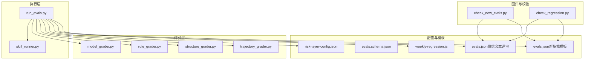
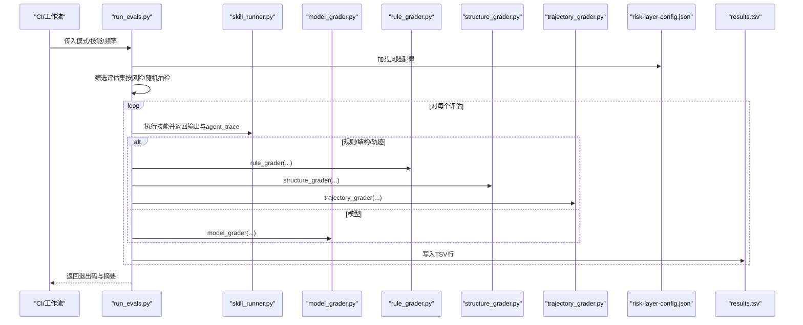
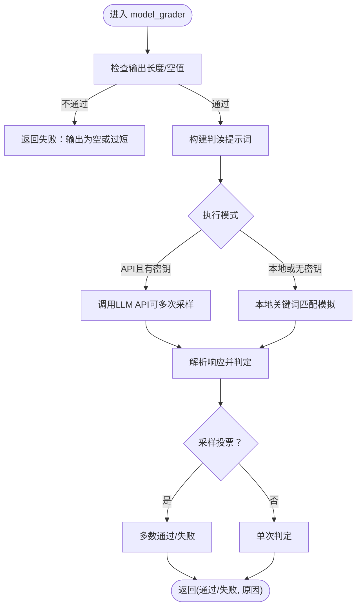
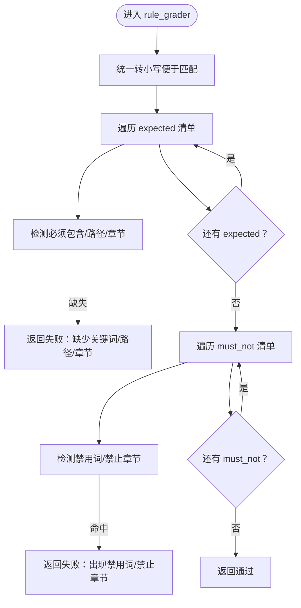
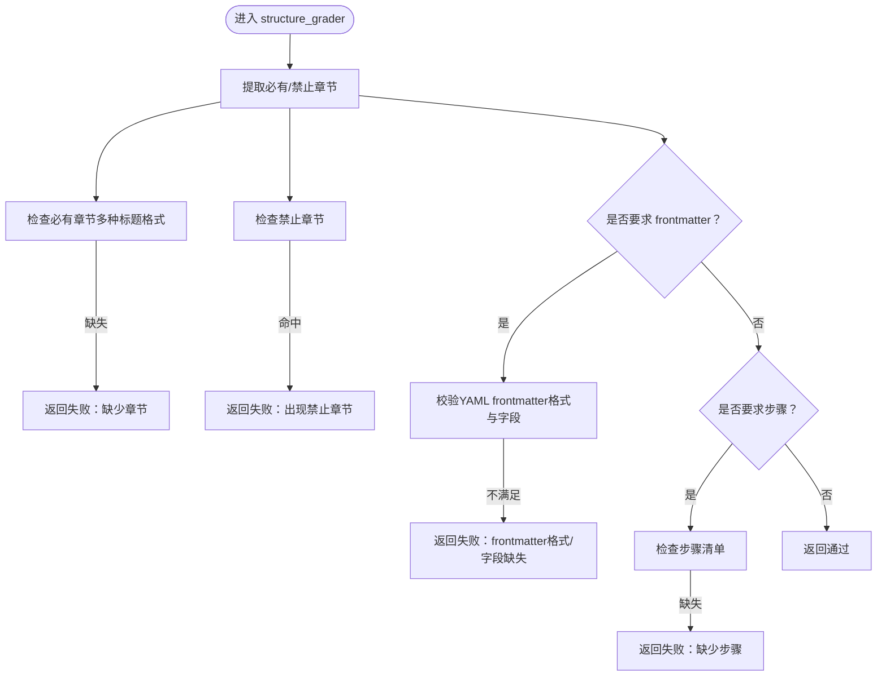
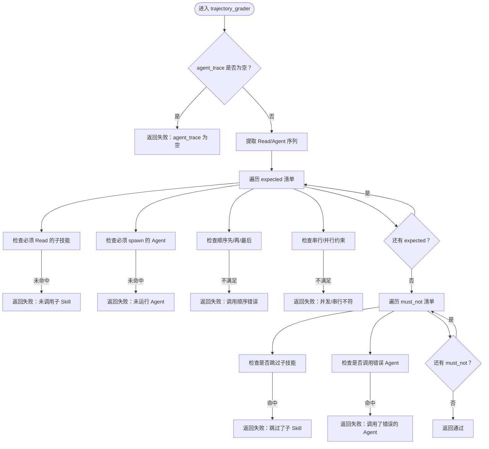
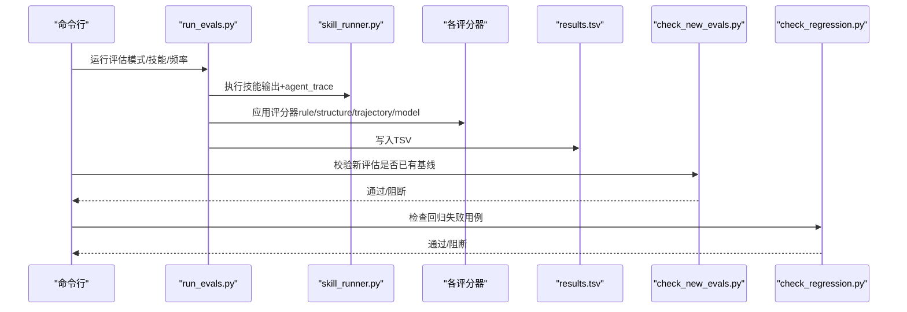
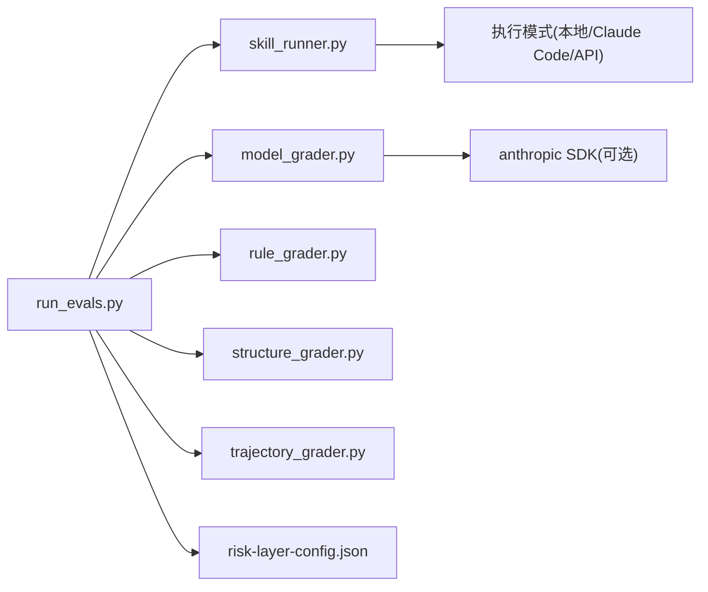

# 评估引擎

<cite>
**本文引用的文件**
- [run_evals.py](file://plugins/frontend-team-toolkit/skill-engineering/scripts/run_evals.py)
- [check_new_evals.py](file://plugins/frontend-team-toolkit/skill-engineering/scripts/check_new_evals.py)
- [check_regression.py](file://plugins/frontend-team-toolkit/skill-engineering/scripts/check_regression.py)
- [model_grader.py](file://plugins/frontend-team-toolkit/skill-engineering/scripts/graders/model_grader.py)
- [rule_grader.py](file://plugins/frontend-team-toolkit/skill-engineering/scripts/graders/rule_grader.py)
- [structure_grader.py](file://plugins/frontend-team-toolkit/skill-engineering/scripts/graders/structure_grader.py)
- [trajectory_grader.py](file://plugins/frontend-team-toolkit/skill-engineering/scripts/graders/trajectory_grader.py)
- [skill_runner.py](file://plugins/frontend-team-toolkit/skill-engineering/scripts/skill_runner.py)
- [risk-layer-config.json](file://plugins/frontend-team-toolkit/skill-engineering/config/risk-layer-config.json)
- [evals.schema.json](file://plugins/frontend-team-toolkit/skill-engineering/schemas/evals.schema.json)
- [evals.json（微信文章评审）](file://plugins/frontend-team-toolkit/skills/wechat-article-review/evals/evals.json)
- [evals.json（新技能模板）](file://plugins/frontend-team-toolkit/skill-engineering/templates/new-skill/evals/evals.json)
- [weekly-regression.js](file://plugins/frontend-team-toolkit/skill-engineering/templates/new-skill/workflows/weekly-regression.js)
</cite>

## 目录
1. [简介](#简介)
2. [项目结构](#项目结构)
3. [核心组件](#核心组件)
4. [架构总览](#架构总览)
5. [详细组件分析](#详细组件分析)
6. [依赖关系分析](#依赖关系分析)
7. [性能考虑](#性能考虑)
8. [故障排查指南](#故障排查指南)
9. [结论](#结论)
10. [附录](#附录)

## 简介
本文件为“评估引擎”的全面技术文档，围绕四维评估模型（模型评估 model_grader、规则评估 rule_grader、结构评估 structure_grader、轨迹评估 trajectory_grader）展开，系统阐述评估脚本编写规范、评分算法与质量控制机制，并说明从 run_evals.py 主程序到 check_new_evals.py 回归测试的完整执行链路。同时提供评估结果分析方法与性能优化建议，帮助开发者构建高质量的评估系统。

## 项目结构
评估引擎位于前端团队工具包插件内，核心由“执行器 + 评分器 + 配置 + 模板”构成：
- 执行器：run_evals.py、skill_runner.py
- 评分器：model_grader.py、rule_grader.py、structure_grader.py、trajectory_grader.py
- 配置：risk-layer-config.json
- 模板与样例：evals.json（微信文章评审）、evals.json（新技能模板）、weekly-regression.js
- 测试与回归：check_new_evals.py、check_regression.py

图表来源
- [run_evals.py:135-174](file://plugins/frontend-team-toolkit/skill-engineering/scripts/run_evals.py#L135-L174)
- [skill_runner.py:1-200](file://plugins/frontend-team-toolkit/skill-engineering/scripts/skill_runner.py#L1-L200)
- [model_grader.py:184-227](file://plugins/frontend-team-toolkit/skill-engineering/scripts/graders/model_grader.py#L184-L227)
- [rule_grader.py:41-92](file://plugins/frontend-team-toolkit/skill-engineering/scripts/graders/rule_grader.py#L41-L92)
- [structure_grader.py:63-122](file://plugins/frontend-team-toolkit/skill-engineering/scripts/graders/structure_grader.py#L63-L122)
- [trajectory_grader.py:59-139](file://plugins/frontend-team-toolkit/skill-engineering/scripts/graders/trajectory_grader.py#L59-L139)
- [risk-layer-config.json:1-70](file://plugins/frontend-team-toolkit/skill-engineering/config/risk-layer-config.json#L1-L70)
- [evals.schema.json:1-39](file://plugins/frontend-team-toolkit/skill-engineering/schemas/evals.schema.json#L1-L39)
- [evals.json（微信文章评审）:1-213](file://plugins/frontend-team-toolkit/skills/wechat-article-review/evals/evals.json#L1-L213)
- [evals.json（新技能模板）:1-47](file://plugins/frontend-team-toolkit/skill-engineering/templates/new-skill/evals/evals.json#L1-L47)
- [weekly-regression.js:1-91](file://plugins/frontend-team-toolkit/skill-engineering/templates/new-skill/workflows/weekly-regression.js#L1-L91)
- [check_new_evals.py:45-83](file://plugins/frontend-team-toolkit/skill-engineering/scripts/check_new_evals.py#L45-L83)
- [check_regression.py:57-96](file://plugins/frontend-team-toolkit/skill-engineering/scripts/check_regression.py#L57-L96)

章节来源
- [run_evals.py:1-227](file://plugins/frontend-team-toolkit/skill-engineering/scripts/run_evals.py#L1-L227)
- [skill_runner.py:1-200](file://plugins/frontend-team-toolkit/skill-engineering/scripts/skill_runner.py#L1-L200)
- [risk-layer-config.json:1-70](file://plugins/frontend-team-toolkit/skill-engineering/config/risk-layer-config.json#L1-L70)

## 核心组件
- 执行器 run_evals.py：根据 CI 模式加载风险配置、筛选评估集、调用 skill_runner 执行技能并应用相应评分器，汇总结果输出 TSV。
- 评分器四维模型：
  - rule_grader：关键词/路径/章节/禁用词规则检查。
  - structure_grader：章节、步骤、frontmatter 结构检查。
  - trajectory_grader：代理/子技能调用序列与并发/串行约束检查。
  - model_grader：基于 LLM 的语义质量判读，支持本地模拟与 API 模式。
- 配置 risk-layer-config.json：定义 PR/Release/Scheduled 三种模式的风险过滤、阻断策略、评分器自动性与漂移风险等级等。
- 模板与样例：evals.json（微信文章评审/新技能模板）定义评估用例；evals.schema.json 约束字段；weekly-regression.js 提供自动化回归工作流示例。
- 回归与校验：check_new_evals.py 校验新评估是否有基线；check_regression.py 检查回归评估是否通过。

章节来源
- [run_evals.py:135-174](file://plugins/frontend-team-toolkit/skill-engineering/scripts/run_evals.py#L135-L174)
- [model_grader.py:184-227](file://plugins/frontend-team-toolkit/skill-engineering/scripts/graders/model_grader.py#L184-L227)
- [rule_grader.py:41-92](file://plugins/frontend-team-toolkit/skill-engineering/scripts/graders/rule_grader.py#L41-L92)
- [structure_grader.py:63-122](file://plugins/frontend-team-toolkit/skill-engineering/scripts/graders/structure_grader.py#L63-L122)
- [trajectory_grader.py:59-139](file://plugins/frontend-team-toolkit/skill-engineering/scripts/graders/trajectory_grader.py#L59-L139)
- [risk-layer-config.json:1-70](file://plugins/frontend-team-toolkit/skill-engineering/config/risk-layer-config.json#L1-L70)
- [evals.schema.json:1-39](file://plugins/frontend-team-toolkit/skill-engineering/schemas/evals.schema.json#L1-L39)
- [evals.json（微信文章评审）:1-213](file://plugins/frontend-team-toolkit/skills/wechat-article-review/evals/evals.json#L1-L213)
- [evals.json（新技能模板）:1-47](file://plugins/frontend-team-toolkit/skill-engineering/templates/new-skill/evals/evals.json#L1-L47)
- [weekly-regression.js:1-91](file://plugins/frontend-team-toolkit/skill-engineering/templates/new-skill/workflows/weekly-regression.js#L1-L91)
- [check_new_evals.py:45-83](file://plugins/frontend-team-toolkit/skill-engineering/scripts/check_new_evals.py#L45-L83)
- [check_regression.py:57-96](file://plugins/frontend-team-toolkit/skill-engineering/scripts/check_regression.py#L57-L96)

## 架构总览
评估执行链路自上而下分为“配置驱动的评估调度—技能执行—多维评分—结果汇总与质量控制”。

图表来源
- [run_evals.py:135-174](file://plugins/frontend-team-toolkit/skill-engineering/scripts/run_evals.py#L135-L174)
- [skill_runner.py:1-200](file://plugins/frontend-team-toolkit/skill-engineering/scripts/skill_runner.py#L1-L200)
- [model_grader.py:184-227](file://plugins/frontend-team-toolkit/skill-engineering/scripts/graders/model_grader.py#L184-L227)
- [rule_grader.py:41-92](file://plugins/frontend-team-toolkit/skill-engineering/scripts/graders/rule_grader.py#L41-L92)
- [structure_grader.py:63-122](file://plugins/frontend-team-toolkit/skill-engineering/scripts/graders/structure_grader.py#L63-L122)
- [trajectory_grader.py:59-139](file://plugins/frontend-team-toolkit/skill-engineering/scripts/graders/trajectory_grader.py#L59-L139)
- [risk-layer-config.json:1-70](file://plugins/frontend-team-toolkit/skill-engineering/config/risk-layer-config.json#L1-L70)

## 详细组件分析

### 四维评估模型

#### 模型评估（model_grader）
- 功能要点
  - 语义质量判读：基于“必须满足/不得违反”清单，逐条判定并汇总最终结论。
  - 执行模式：本地模拟（基于关键词抽取与匹配）与 API（Anthropic Claude）两种。
  - 投票机制：支持多次采样投票，多数通过/失败决定最终结果。
- 关键流程
  - 构建判读提示词（expected/must_not + 输出文本）。
  - 依据模式调用 API 或本地模拟。
  - 解析响应并返回（通过/失败/原因）。
- 适用场景
  - 需要语义一致性与主观判断的评估，如输出完整性、评分维度表、结论一致性等。

图表来源
- [model_grader.py:184-227](file://plugins/frontend-team-toolkit/skill-engineering/scripts/graders/model_grader.py#L184-L227)
- [model_grader.py:71-95](file://plugins/frontend-team-toolkit/skill-engineering/scripts/graders/model_grader.py#L71-L95)
- [model_grader.py:97-140](file://plugins/frontend-team-toolkit/skill-engineering/scripts/graders/model_grader.py#L97-L140)
- [model_grader.py:166-182](file://plugins/frontend-team-toolkit/skill-engineering/scripts/graders/model_grader.py#L166-L182)

章节来源
- [model_grader.py:1-273](file://plugins/frontend-team-toolkit/skill-engineering/scripts/graders/model_grader.py#L1-L273)

#### 规则评估（rule_grader）
- 功能要点
  - 关键词/路径/章节存在性检查；禁用词/禁止章节检查。
  - 支持多种自然语言表达（中文“必须/不得/路径/章节”等）。
- 适用场景
  - 强制性合规项检查，如必须包含特定路径、不得出现特定章节等。

图表来源
- [rule_grader.py:41-92](file://plugins/frontend-team-toolkit/skill-engineering/scripts/graders/rule_grader.py#L41-L92)
- [rule_grader.py:16-38](file://plugins/frontend-team-toolkit/skill-engineering/scripts/graders/rule_grader.py#L16-L38)

章节来源
- [rule_grader.py:1-110](file://plugins/frontend-team-toolkit/skill-engineering/scripts/graders/rule_grader.py#L1-L110)

#### 结构评估（structure_grader）
- 功能要点
  - 章节存在性检查（大小标题兼容）；禁止章节检查。
  - frontmatter 校验（起止标记、必需字段）。
  - 步骤清单检查（Step/N/步骤N）。
- 适用场景
  - 输出文档结构标准化，确保必要章节与格式一致。

图表来源
- [structure_grader.py:63-122](file://plugins/frontend-team-toolkit/skill-engineering/scripts/graders/structure_grader.py#L63-L122)
- [structure_grader.py:16-47](file://plugins/frontend-team-toolkit/skill-engineering/scripts/graders/structure_grader.py#L16-L47)

章节来源
- [structure_grader.py:1-155](file://plugins/frontend-team-toolkit/skill-engineering/scripts/graders/structure_grader.py#L1-L155)

#### 轨迹评估（trajectory_grader）
- 功能要点
  - 从 agent_trace 中提取 Read/Agent 调用序列。
  - 检查必须调用的子技能/代理、调用顺序、串行/并行约束。
  - 检查禁止跳过/错误调用。
- 适用场景
  - 自动化工作流编排正确性验证，如子技能调用顺序、并发模式等。

图表来源
- [trajectory_grader.py:59-139](file://plugins/frontend-team-toolkit/skill-engineering/scripts/graders/trajectory_grader.py#L59-L139)
- [trajectory_grader.py:15-38](file://plugins/frontend-team-toolkit/skill-engineering/scripts/graders/trajectory_grader.py#L15-L38)
- [trajectory_grader.py:41-56](file://plugins/frontend-team-toolkit/skill-engineering/scripts/graders/trajectory_grader.py#L41-L56)

章节来源
- [trajectory_grader.py:1-163](file://plugins/frontend-team-toolkit/skill-engineering/scripts/graders/trajectory_grader.py#L1-L163)

### 评估脚本编写规范
- 字段约束
  - 使用 JSON Schema 约束：id/name/type/prompt/expected/must_not/grader/risk/source。
  - grader 支持 rule/structure/trajectory/model/human 及组合（如 rule+human）。
- 用例设计
  - regression：验证回归稳定性，高风险优先。
  - capability：验证能力边界与典型场景。
- 示例参考
  - 微信文章评审评估集覆盖弱草稿、缺失正文、边界分数等场景。
  - 新技能模板提供 scaffold 用例与字段占位。

章节来源
- [evals.schema.json:1-39](file://plugins/frontend-team-toolkit/skill-engineering/schemas/evals.schema.json#L1-L39)
- [evals.json（微信文章评审）:1-213](file://plugins/frontend-team-toolkit/skills/wechat-article-review/evals/evals.json#L1-L213)
- [evals.json（新技能模板）:1-47](file://plugins/frontend-team-toolkit/skill-engineering/templates/new-skill/evals/evals.json#L1-L47)

### 评分算法与质量控制机制
- 评分器返回值
  - (通过布尔值, 原因字符串)，用于 run_evals.py 汇总与 TSV 记录。
- 质量控制
  - 风险层配置：PR/Release/Scheduled 模式下的风险过滤、阻断策略、评分器自动性与漂移风险等级。
  - 红线规则：如 regression_high_fail、new_eval_no_baseline 等阻断项。
  - 回归检查：check_regression.py 支持按风险级别筛选失败回归用例。
  - 新评估基线：check_new_evals.py 校验新评估是否已有基线记录。

章节来源
- [risk-layer-config.json:1-70](file://plugins/frontend-team-toolkit/skill-engineering/config/risk-layer-config.json#L1-L70)
- [check_regression.py:37-54](file://plugins/frontend-team-toolkit/skill-engineering/scripts/check_regression.py#L37-L54)
- [check_new_evals.py:62-83](file://plugins/frontend-team-toolkit/skill-engineering/scripts/check_new_evals.py#L62-L83)

### 评估执行流程（从 run_evals.py 到 check_new_evals.py）
- 主流程
  - 解析参数，定位技能目录与评估集。
  - 加载风险配置，按模式筛选评估集（支持随机抽检）。
  - 逐条执行：skill_runner 获取输出与 agent_trace。
  - 选择评分器（rule/structure/trajectory/model 或组合），生成结果。
  - 写入 results.tsv，打印摘要与统计。
- 回归测试链路
  - check_new_evals.py：对比当前评估集与 results.tsv，发现未基线的新评估并可阻断合并。
  - check_regression.py：从 results.tsv 中筛选失败的回归用例，支持按风险级别与阻断策略。

图表来源
- [run_evals.py:189-223](file://plugins/frontend-team-toolkit/skill-engineering/scripts/run_evals.py#L189-L223)
- [skill_runner.py:1-200](file://plugins/frontend-team-toolkit/skill-engineering/scripts/skill_runner.py#L1-L200)
- [check_new_evals.py:45-83](file://plugins/frontend-team-toolkit/skill-engineering/scripts/check_new_evals.py#L45-L83)
- [check_regression.py:57-96](file://plugins/frontend-team-toolkit/skill-engineering/scripts/check_regression.py#L57-L96)

章节来源
- [run_evals.py:135-174](file://plugins/frontend-team-toolkit/skill-engineering/scripts/run_evals.py#L135-L174)
- [check_new_evals.py:45-83](file://plugins/frontend-team-toolkit/skill-engineering/scripts/check_new_evals.py#L45-L83)
- [check_regression.py:57-96](file://plugins/frontend-team-toolkit/skill-engineering/scripts/check_regression.py#L57-L96)

## 依赖关系分析
- 组件耦合
  - run_evals.py 依赖 skill_runner 与四个评分器模块；评分器彼此独立，仅依赖正则与字符串处理。
  - 配置文件 risk-layer-config.json 为运行期配置中心，被 run_evals.py 读取以决定风险过滤与抽检策略。
- 外部依赖
  - model_grader 在 API 模式下依赖 anthropic SDK；若未安装或无密钥则回退至本地模拟。
  - skill_runner 在不同执行模式下支持本地模拟、Claude Code、Anthropic API。

图表来源
- [run_evals.py:25-35](file://plugins/frontend-team-toolkit/skill-engineering/scripts/run_evals.py#L25-L35)
- [model_grader.py:71-95](file://plugins/frontend-team-toolkit/skill-engineering/scripts/graders/model_grader.py#L71-L95)
- [skill_runner.py:25-29](file://plugins/frontend-team-toolkit/skill-engineering/scripts/skill_runner.py#L25-L29)

章节来源
- [run_evals.py:25-35](file://plugins/frontend-team-toolkit/skill-engineering/scripts/run_evals.py#L25-L35)
- [model_grader.py:71-95](file://plugins/frontend-team-toolkit/skill-engineering/scripts/graders/model_grader.py#L71-L95)
- [skill_runner.py:25-29](file://plugins/frontend-team-toolkit/skill-engineering/scripts/skill_runner.py#L25-L29)

## 性能考虑
- 评分器性能
  - rule_grader/structure_grader 为 O(n) 字符串匹配，复杂度低；trajectory_grader 依赖 trace 列表长度，通常较小。
  - model_grader 在 API 模式下受网络与令牌限制影响较大；可通过减少采样次数或启用本地模拟降低成本。
- 执行效率
  - run_evals.py 支持按风险过滤与随机抽检（scheduled 模式），可显著缩短执行时间。
  - 建议将高风险用例前置，避免不必要的长耗时 API 调用。
- 结果写入
  - TSV 写入为顺序 IO，建议批量写入并在内存中拼接行后再落盘，减少系统调用次数。

## 故障排查指南
- 常见问题
  - 评估未通过：查看 results.tsv 中的 reason 字段，结合具体评分器逻辑定位失败原因。
  - API 调用失败：确认 ANTHROPIC_API_KEY/LLM_API_KEY 环境变量设置；若未安装 anthropic SDK，将回退为本地模拟。
  - agent_trace 为空：trajectory_grader 将直接失败，需检查 skill_runner 的执行模式与 trace 采集。
  - 新评估无基线：check_new_evals.py 会阻止合并，需先运行评估并产生基线记录。
  - 回归失败：check_regression.py 会筛选失败用例并可按风险级别阻断合并。
- 排查步骤
  - 重新运行 run_evals.py 并观察摘要统计。
  - 单独调用对应评分器进行最小化复现。
  - 检查 risk-layer-config.json 的模式配置与阻断策略。

章节来源
- [model_grader.py:71-95](file://plugins/frontend-team-toolkit/skill-engineering/scripts/graders/model_grader.py#L71-L95)
- [trajectory_grader.py:70-71](file://plugins/frontend-team-toolkit/skill-engineering/scripts/graders/trajectory_grader.py#L70-L71)
- [check_new_evals.py:69-83](file://plugins/frontend-team-toolkit/skill-engineering/scripts/check_new_evals.py#L69-L83)
- [check_regression.py:82-96](file://plugins/frontend-team-toolkit/skill-engineering/scripts/check_regression.py#L82-L96)

## 结论
该评估引擎通过“配置驱动 + 多维评分 + 质量控制”的体系，实现了对技能输出在语义、结构、规则与执行轨迹上的全面验证。开发者可依据 risk-layer-config.json 与评估用例模板快速扩展评估集，结合 check_new_evals.py 与 check_regression.py 构建可靠的回归与基线保障机制，持续提升评估系统的稳定性与可维护性。

## 附录
- 自动化工作流示例
  - weekly-regression.js 展示了如何在 Claude Code 中以循环方式执行每周回归并上报问题。
- 数据模型（评估用例）
  - 评估用例遵循 evals.schema.json 的字段约束，支持多种 grader 组合与风险等级。

章节来源
- [weekly-regression.js:1-91](file://plugins/frontend-team-toolkit/skill-engineering/templates/new-skill/workflows/weekly-regression.js#L1-L91)
- [evals.schema.json:1-39](file://plugins/frontend-team-toolkit/skill-engineering/schemas/evals.schema.json#L1-L39)