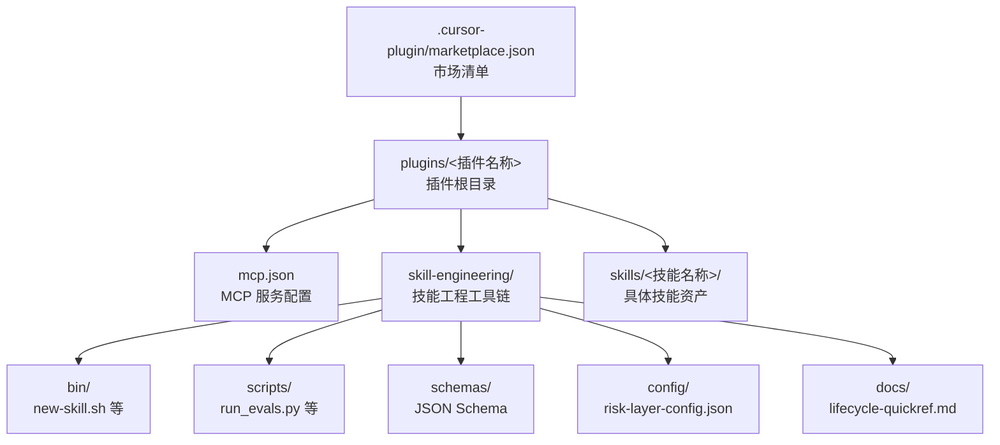
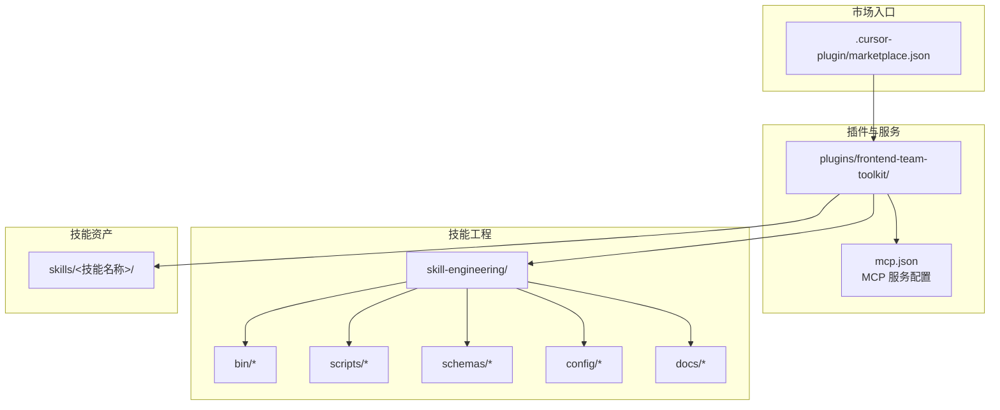
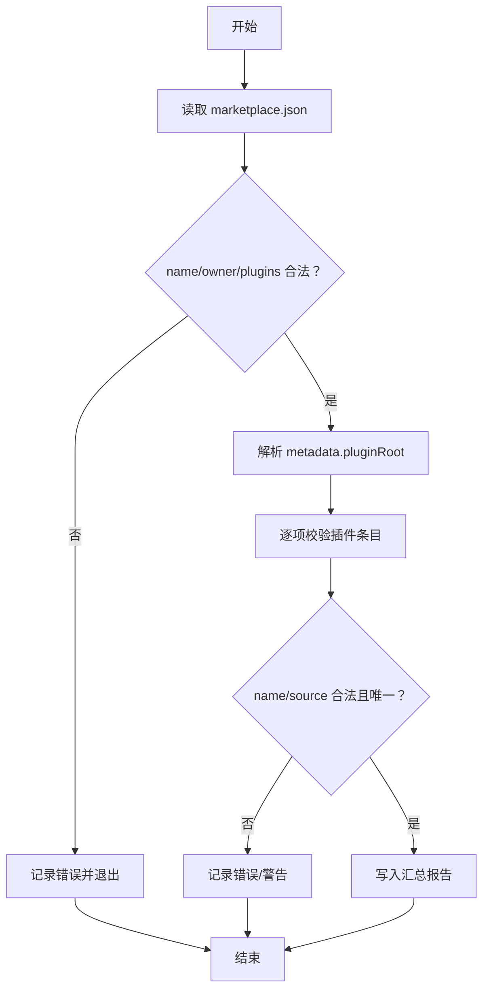
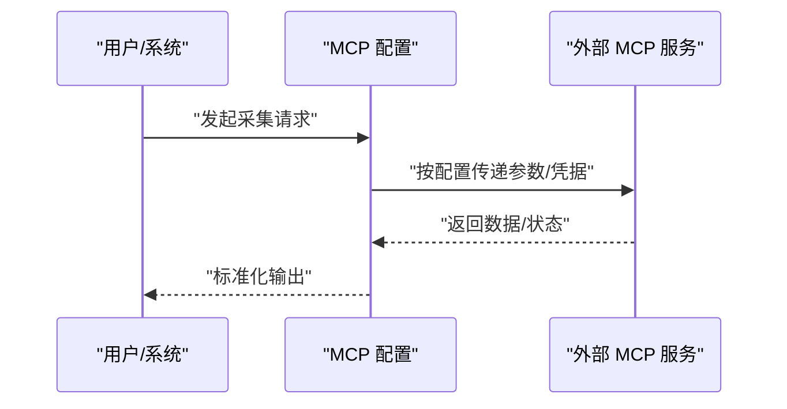
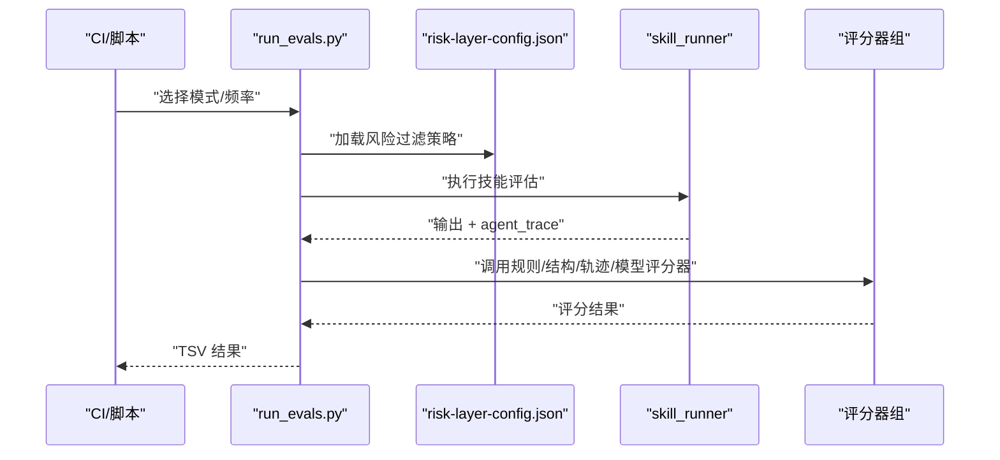
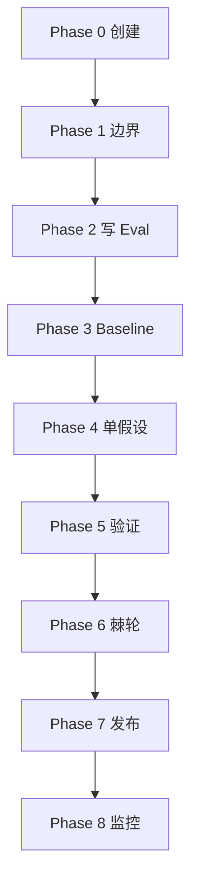
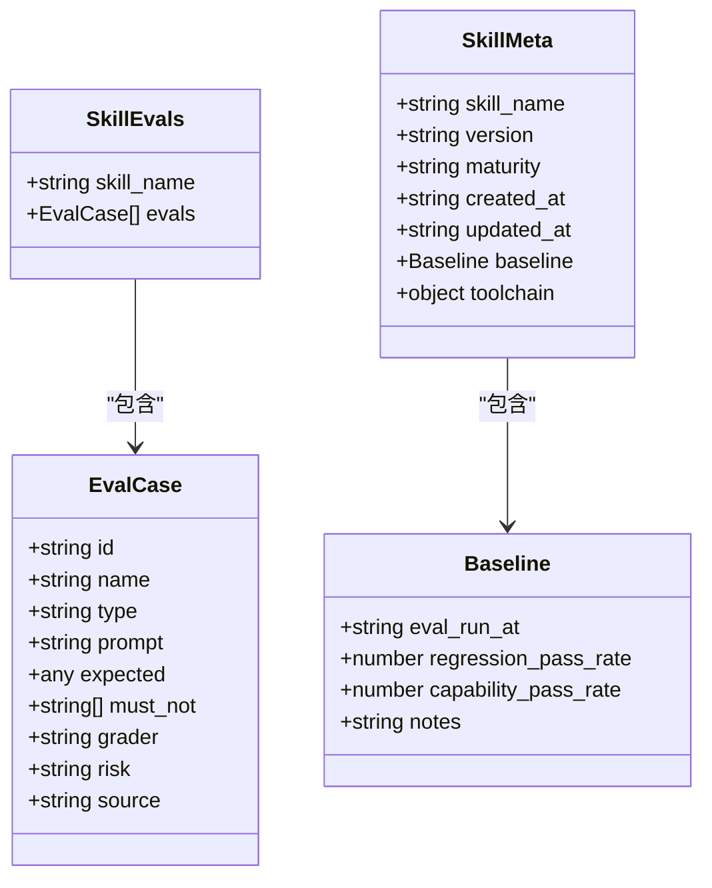
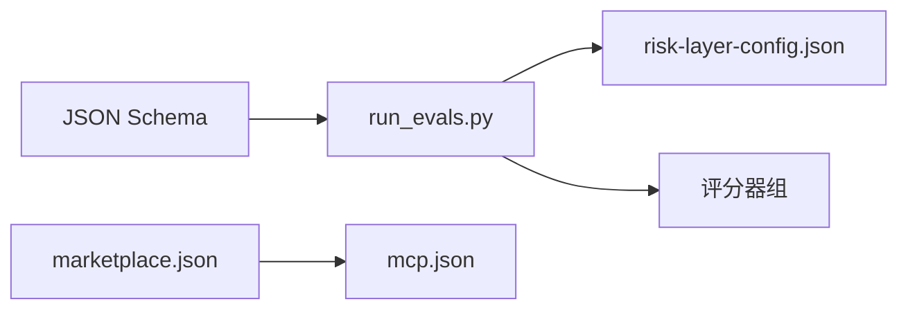

# 市场分析与监控

<cite>
**本文引用的文件**
- [scripts/validate-template.mjs](file://scripts/validate-template.mjs)
- [.cursor-plugin/marketplace.json](file://.cursor-plugin/marketplace.json)
- [plugins/frontend-team-toolkit/mcp.json](file://plugins/frontend-team-toolkit/mcp.json)
- [plugins/frontend-team-toolkit/skill-engineering/README.md](file://plugins/frontend-team-toolkit/skill-engineering/README.md)
- [plugins/frontend-team-toolkit/skill-engineering/docs/lifecycle-quickref.md](file://plugins/frontend-team-toolkit/skill-engineering/docs/lifecycle-quickref.md)
- [plugins/frontend-team-toolkit/skill-engineering/schemas/evals.schema.json](file://plugins/frontend-team-toolkit/skill-engineering/schemas/evals.schema.json)
- [plugins/frontend-team-toolkit/skill-engineering/schemas/skill-meta.schema.json](file://plugins/frontend-team-toolkit/skill-engineering/schemas/skill-meta.schema.json)
- [plugins/frontend-team-toolkit/skill-engineering/scripts/run_evals.py](file://plugins/frontend-team-toolkit/skill-engineering/scripts/run_evals.py)
- [plugins/frontend-team-toolkit/skill-engineering/config/risk-layer-config.json](file://plugins/frontend-team-toolkit/skill-engineering/config/risk-layer-config.json)
- [plugins/frontend-team-toolkit/skill-engineering/bin/new-skill.sh](file://plugins/frontend-team-toolkit/skill-engineering/bin/new-skill.sh)
- [plugins/frontend-team-toolkit/skills/skills-quality/eval-plan.md](file://plugins/frontend-team-toolkit/skills/skills-quality/eval-plan.md)
</cite>

## 目录
1. [引言](#引言)
2. [项目结构](#项目结构)
3. [核心组件](#核心组件)
4. [架构总览](#架构总览)
5. [详细组件分析](#详细组件分析)
6. [依赖分析](#依赖分析)
7. [性能考虑](#性能考虑)
8. [故障排查指南](#故障排查指南)
9. [结论](#结论)
10. [附录](#附录)

## 引言
本文件面向“市场分析与监控”主题，基于仓库中的前端团队市场工作台与技能工程体系，构建一套可落地的市场数据采集、处理与分析流程框架。系统以“技能工程”为核心，围绕评估（Eval）、评审（Grader）、回归（Regression）与生命周期管理（Lifecycle）形成闭环，支撑市场趋势预测、技能热度监控、用户行为分析与性能可用性检测等目标。

## 项目结构
该仓库采用“插件 + 技能工程”的组织方式：
- marketplace 清单定义了插件集合与来源路径
- 插件内部包含 MCP 服务器配置、技能工程工具链（模板、脚本、Schema、配置）
- 技能目录包含评估用例、结果记录与参考文档

图表来源
- [.cursor-plugin/marketplace.json:1-20](file://.cursor-plugin/marketplace.json#L1-L20)
- [plugins/frontend-team-toolkit/mcp.json:1-25](file://plugins/frontend-team-toolkit/mcp.json#L1-L25)
- [plugins/frontend-team-toolkit/skill-engineering/README.md:34-69](file://plugins/frontend-team-toolkit/skill-engineering/README.md#L34-L69)

章节来源
- [.cursor-plugin/marketplace.json:1-20](file://.cursor-plugin/marketplace.json#L1-L20)
- [plugins/frontend-team-toolkit/skill-engineering/README.md:34-69](file://plugins/frontend-team-toolkit/skill-engineering/README.md#L34-L69)

## 核心组件
- 市场清单与插件发现
  - marketplace.json 定义市场名称、拥有者、元信息与插件列表，用于定位插件根目录与来源路径
- MCP 服务集成
  - mcp.json 定义外部服务（如 YApi、Figma、蓝湖）的 MCP 服务器命令或 URL，作为数据采集入口
- 技能工程工具链
  - 模板与脚本：new-skill.sh、run_evals.py、validate-skill.py
  - Schema：evals.schema.json、skill-meta.schema.json 等，约束评估与元数据结构
  - 配置：risk-layer-config.json，定义不同模式下的风险过滤与门禁策略
  - 文档：lifecycle-quickref.md，提供 8 Phase 生命周期速查与发布门禁

章节来源
- [plugins/frontend-team-toolkit/mcp.json:1-25](file://plugins/frontend-team-toolkit/mcp.json#L1-L25)
- [plugins/frontend-team-toolkit/skill-engineering/README.md:34-187](file://plugins/frontend-team-toolkit/skill-engineering/README.md#L34-L187)
- [plugins/frontend-team-toolkit/skill-engineering/schemas/evals.schema.json:1-39](file://plugins/frontend-team-toolkit/skill-engineering/schemas/evals.schema.json#L1-L39)
- [plugins/frontend-team-toolkit/skill-engineering/schemas/skill-meta.schema.json:1-24](file://plugins/frontend-team-toolkit/skill-engineering/schemas/skill-meta.schema.json#L1-L24)
- [plugins/frontend-team-toolkit/skill-engineering/config/risk-layer-config.json](file://plugins/frontend-team-toolkit/skill-engineering/config/risk-layer-config.json)
- [plugins/frontend-team-toolkit/skill-engineering/docs/lifecycle-quickref.md:1-32](file://plugins/frontend-team-toolkit/skill-engineering/docs/lifecycle-quickref.md#L1-L32)

## 架构总览
系统以“市场清单”为入口，通过“MCP 服务”接入外部数据源，利用“技能工程工具链”对技能进行评估、评审与回归，最终在“技能资产”中沉淀可复用的市场分析能力。

图表来源
- [.cursor-plugin/marketplace.json:1-20](file://.cursor-plugin/marketplace.json#L1-L20)
- [plugins/frontend-team-toolkit/mcp.json:1-25](file://plugins/frontend-team-toolkit/mcp.json#L1-L25)
- [plugins/frontend-team-toolkit/skill-engineering/README.md:34-69](file://plugins/frontend-team-toolkit/skill-engineering/README.md#L34-L69)

## 详细组件分析

### 组件A：市场清单与插件发现
- 作用
  - 定义市场名称、拥有者、版本与插件列表，确保插件根目录与来源路径合法
- 关键点
  - 名称与拥有者校验、插件去重、相对路径安全检查、缺失 mcp.json 的告警
- 流程图

图表来源
- [scripts/validate-template.mjs:250-381](file://scripts/validate-template.mjs#L250-L381)

章节来源
- [scripts/validate-template.mjs:14-381](file://scripts/validate-template.mjs#L14-L381)
- [.cursor-plugin/marketplace.json:1-20](file://.cursor-plugin/marketplace.json#L1-L20)

### 组件B：MCP 服务配置与数据采集
- 作用
  - 通过 mcp.json 配置外部服务（命令行或 HTTP），作为市场数据采集的外部通道
- 关键点
  - 支持命令行参数注入环境变量与 URL 模式
  - 适用于 YApi、Figma、蓝湖等平台的 MCP 适配
- 序列图（概念）

图表来源
- [plugins/frontend-team-toolkit/mcp.json:1-25](file://plugins/frontend-team-toolkit/mcp.json#L1-L25)

章节来源
- [plugins/frontend-team-toolkit/mcp.json:1-25](file://plugins/frontend-team-toolkit/mcp.json#L1-L25)

### 组件C：技能工程工具链（评估、评审、回归）
- 作用
  - 通过 run_evals.py 在不同模式下运行评估，结合规则/结构/轨迹/模型评分器完成自动化评审
- 关键点
  - 模式：PR 触发（高/中风险）、发布前（全量）、定期（周/月/季度）
  - 风险分层与门禁：由 risk-layer-config.json 控制
  - 结果记录：TSV 格式，便于后续分析与可视化
- 序列图

图表来源
- [plugins/frontend-team-toolkit/skill-engineering/scripts/run_evals.py:135-186](file://plugins/frontend-team-toolkit/skill-engineering/scripts/run_evals.py#L135-L186)
- [plugins/frontend-team-toolkit/skill-engineering/config/risk-layer-config.json](file://plugins/frontend-team-toolkit/skill-engineering/config/risk-layer-config.json)

章节来源
- [plugins/frontend-team-toolkit/skill-engineering/scripts/run_evals.py:1-186](file://plugins/frontend-team-toolkit/skill-engineering/scripts/run_evals.py#L1-L186)
- [plugins/frontend-team-toolkit/skill-engineering/config/risk-layer-config.json](file://plugins/frontend-team-toolkit/skill-engineering/config/risk-layer-config.json)

### 组件D：生命周期与发布门禁
- 作用
  - 以 8 Phase 生命周期管理技能质量，确保每次变更可追踪、可回归、可发布
- 关键点
  - Baseline、Spot Check、Targeted、Regression 四层评估策略
  - 发布门禁：结构校验、回归无退步、变更日志、基线更新
- 流程图

图表来源
- [plugins/frontend-team-toolkit/skill-engineering/docs/lifecycle-quickref.md:1-32](file://plugins/frontend-team-toolkit/skill-engineering/docs/lifecycle-quickref.md#L1-L32)

章节来源
- [plugins/frontend-team-toolkit/skill-engineering/docs/lifecycle-quickref.md:1-32](file://plugins/frontend-team-toolkit/skill-engineering/docs/lifecycle-quickref.md#L1-L32)
- [plugins/frontend-team-toolkit/skill-engineering/README.md:168-187](file://plugins/frontend-team-toolkit/skill-engineering/README.md#L168-L187)

### 组件E：数据模型与结构约束
- 作用
  - 通过 JSON Schema 约束评估、元数据、问题与工作流结构，保证数据一致性与可解析性
- 关键点
  - evals.schema.json：评估用例结构（含 id、name、type、prompt、grader、risk 等）
  - skill-meta.schema.json：技能元数据结构（含版本、成熟度、基线统计等）
- 类图

图表来源
- [plugins/frontend-team-toolkit/skill-engineering/schemas/evals.schema.json:1-39](file://plugins/frontend-team-toolkit/skill-engineering/schemas/evals.schema.json#L1-L39)
- [plugins/frontend-team-toolkit/skill-engineering/schemas/skill-meta.schema.json:1-24](file://plugins/frontend-team-toolkit/skill-engineering/schemas/skill-meta.schema.json#L1-L24)

章节来源
- [plugins/frontend-team-toolkit/skill-engineering/schemas/evals.schema.json:1-39](file://plugins/frontend-team-toolkit/skill-engineering/schemas/evals.schema.json#L1-L39)
- [plugins/frontend-team-toolkit/skill-engineering/schemas/skill-meta.schema.json:1-24](file://plugins/frontend-team-toolkit/skill-engineering/schemas/skill-meta.schema.json#L1-L24)

### 组件F：新技能创建与模板
- 作用
  - new-skill.sh 从模板批量生成标准技能目录，降低结构漂移风险
- 关键点
  - 自动生成 evals、output-contract、验证脚本等文件
  - 后续通过 validate-skill.py 完成结构校验与补齐

章节来源
- [plugins/frontend-team-toolkit/skill-engineering/bin/new-skill.sh:109-120](file://plugins/frontend-team-toolkit/skill-engineering/bin/new-skill.sh#L109-L120)
- [plugins/frontend-team-toolkit/skill-engineering/README.md:139-149](file://plugins/frontend-team-toolkit/skill-engineering/README.md#L139-L149)

### 组件G：评估计划与结果记录
- 作用
  - 以评估计划指导 Baseline、Spot Check、Targeted、Regression 的执行顺序与范围
- 关键点
  - 统一 TSV 结果记录格式，便于导入分析系统与可视化

章节来源
- [plugins/frontend-team-toolkit/skills/skills-quality/eval-plan.md:1-45](file://plugins/frontend-team-toolkit/skills/skills-quality/eval-plan.md#L1-L45)

## 依赖分析
- 组件耦合
  - run_evals.py 依赖 risk-layer-config.json 与评分器模块，耦合度适中
  - marketplace.json 与 mcp.json 为外部依赖入口，耦合外部系统
- 外部依赖
  - MCP 服务（YApi/Figma/蓝湖）通过 mcp.json 配置
  - JSON Schema 用于数据结构约束，提升可解析性与一致性

图表来源
- [plugins/frontend-team-toolkit/skill-engineering/scripts/run_evals.py:135-186](file://plugins/frontend-team-toolkit/skill-engineering/scripts/run_evals.py#L135-L186)
- [plugins/frontend-team-toolkit/skill-engineering/config/risk-layer-config.json](file://plugins/frontend-team-toolkit/skill-engineering/config/risk-layer-config.json)
- [.cursor-plugin/marketplace.json:1-20](file://.cursor-plugin/marketplace.json#L1-L20)
- [plugins/frontend-team-toolkit/mcp.json:1-25](file://plugins/frontend-team-toolkit/mcp.json#L1-L25)
- [plugins/frontend-team-toolkit/skill-engineering/schemas/evals.schema.json:1-39](file://plugins/frontend-team-toolkit/skill-engineering/schemas/evals.schema.json#L1-L39)

## 性能考虑
- 评估批量化与并行化
  - 在 CI 中按模式与频率筛选评估集，减少不必要的全量执行
- 数据结构约束
  - 使用 JSON Schema 降低解析与校验成本，提高下游处理效率
- 结果落盘与增量分析
  - TSV 结果支持增量导入，便于构建时间序列分析与可视化

## 故障排查指南
- 常见问题
  - marketplace.json 校验失败：检查 name/owner/plugins 是否符合规范，路径是否安全
  - 缺失 mcp.json：仅在使用 MCP 服务器时需要，非必需文件会触发告警
  - 评估失败：检查 risk 分层配置、评分器返回与 agent_trace
- 排查步骤
  - 使用 validate-template.mjs 校验清单与插件结构
  - 查看 run_evals.py 输出与 TSV 结果，定位失败用例
  - 对照 lifecycle-quickref.md 与 eval-plan.md，确认评估流程与门禁

章节来源
- [scripts/validate-template.mjs:250-381](file://scripts/validate-template.mjs#L250-L381)
- [plugins/frontend-team-toolkit/skill-engineering/scripts/run_evals.py:135-186](file://plugins/frontend-team-toolkit/skill-engineering/scripts/run_evals.py#L135-L186)
- [plugins/frontend-team-toolkit/skill-engineering/docs/lifecycle-quickref.md:1-32](file://plugins/frontend-team-toolkit/skill-engineering/docs/lifecycle-quickref.md#L1-L32)
- [plugins/frontend-team-toolkit/skills/skills-quality/eval-plan.md:1-45](file://plugins/frontend-team-toolkit/skills/skills-quality/eval-plan.md#L1-L45)

## 结论
本仓库以“技能工程”为核心，提供了从评估、评审到回归与发布的完整闭环，配合 MCP 服务与 JSON Schema 约束，能够支撑市场分析与监控场景下的数据采集、处理与分析需求。通过标准化的评估计划与结果记录，可进一步扩展为可视化仪表盘、趋势预测与告警机制。

## 附录
- 监控 API 与数据分析工具建议
  - 采集接口：通过 mcp.json 中的 MCP 服务暴露的数据端点进行拉取
  - 评估接口：run_evals.py 可作为评估调度器，支持 PR/Release/Scheduled 三种模式
  - 数据分析：将 TSV 结果导入分析系统，构建时间序列与热力图
- 数据隐私与安全
  - 严格控制 MCP 凭据（用户名/密码/令牌）在配置文件中的可见性
  - 使用只读权限访问外部服务，避免敏感操作
- 异常检测与根因分析
  - 基于评估失败率与回归退化趋势设置阈值告警
  - 结合 agent_trace 与评分器日志进行根因定位