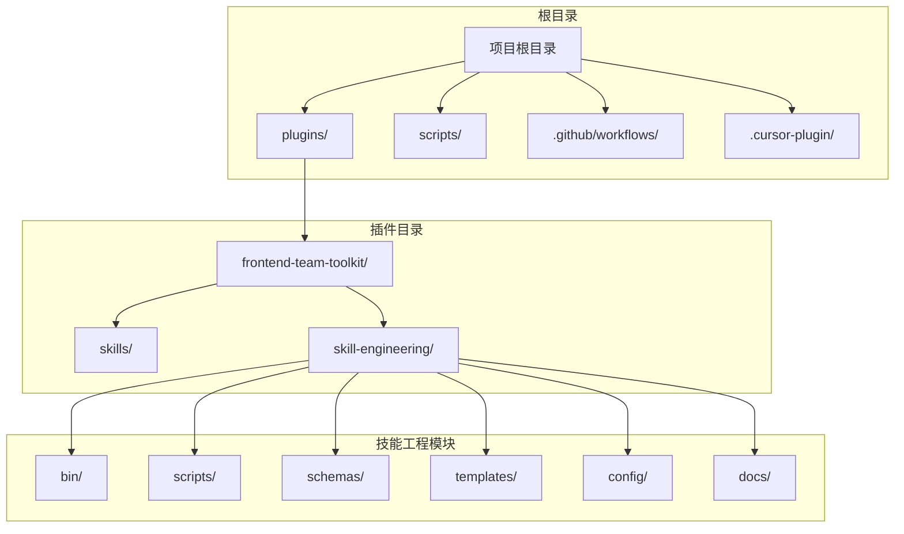
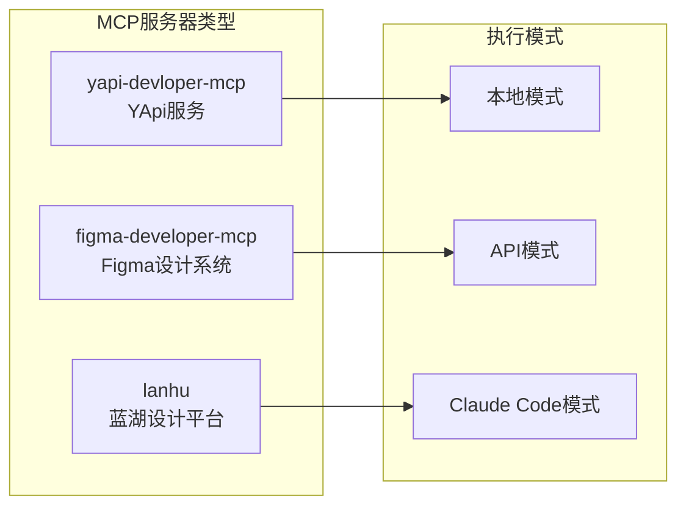
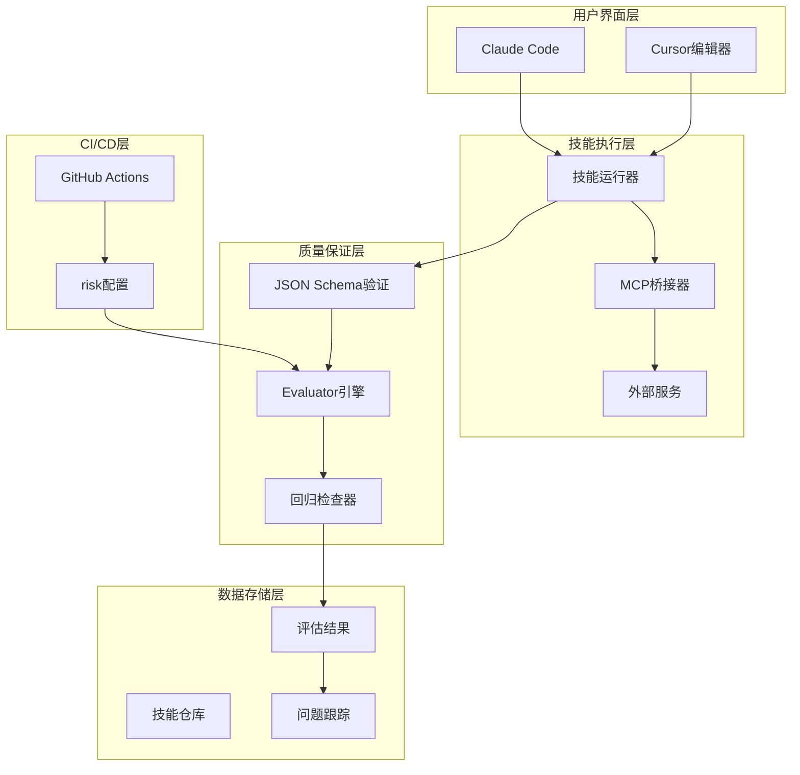
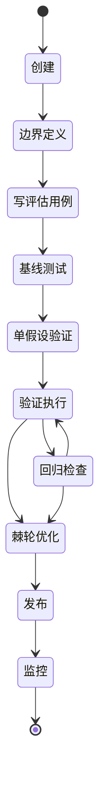
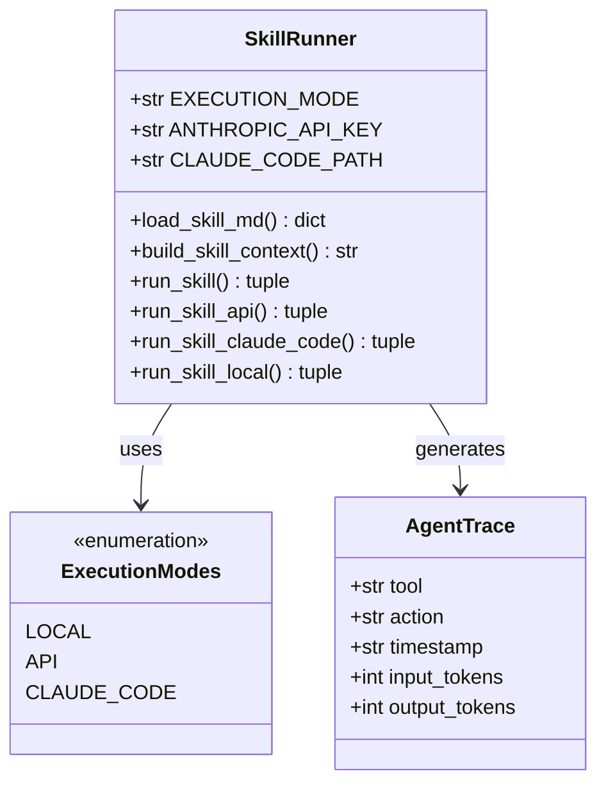
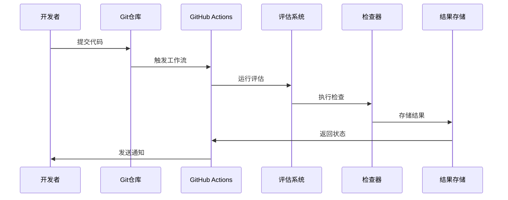
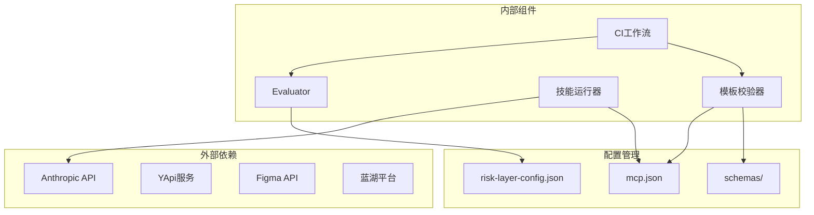

# 市场架构设计

<cite>
**本文档引用的文件**
- [marketplace.json](file://.cursor-plugin/marketplace.json)
- [mcp.json](file://plugins/frontend-team-toolkit/mcp.json)
- [技能工程README](file://plugins/frontend-team-toolkit/skill-engineering/README.md)
- [生命周期速查](file://plugins/frontend-team-toolkit/skill-engineering/docs/lifecycle-quickref.md)
- [技能运行器](file://plugins/frontend-team-toolkit/skill-engineering/scripts/skill_runner.py)
- [CI工作流](file://.github/workflows/eval-ci.yml)
- [模板校验器](file://scripts/validate-template.mjs)
- [技能元数据Schema](file://plugins/frontend-team-toolkit/skill-engineering/schemas/skill-meta.schema.json)
- [评估Schema](file://plugins/frontend-team-toolkit/skill-engineering/schemas/evals.schema.json)
- [风险配置](file://plugins/frontend-team-toolkit/skill-engineering/config/risk-layer-config.json)
- [微信文章评审SKILL](file://plugins/frontend-team-toolkit/skills/wechat-article-review/SKILL.md)
</cite>

## 目录
1. [引言](#引言)
2. [项目结构](#项目结构)
3. [核心组件](#核心组件)
4. [架构概览](#架构概览)
5. [详细组件分析](#详细组件分析)
6. [依赖关系分析](#依赖关系分析)
7. [性能考虑](#性能考虑)
8. [故障排除指南](#故障排除指南)
9. [结论](#结论)
10. [附录](#附录)

## 引言

这是一个基于Cursor插件平台的前端团队技能市场架构设计文档。该系统通过标准化的技能工程框架，实现了技能的全生命周期管理，包括创建、验证、评估、发布和监控等环节。

系统的核心创新在于将MCP（Model Context Protocol）协议深度集成到技能执行流程中，为AI代理提供了统一的外部服务访问接口。通过JSON Schema验证、CI自动化门禁和动态工作流编排，确保了技能质量和交付效率。

## 项目结构

该项目采用插件化的组织方式，主要包含以下核心目录：



**图表来源**
- [marketplace.json:1-21](file://.cursor-plugin/marketplace.json#L1-L21)
- [技能工程README:34-69](file://plugins/frontend-team-toolkit/skill-engineering/README.md#L34-L69)

**章节来源**
- [marketplace.json:1-21](file://.cursor-plugin/marketplace.json#L1-L21)
- [技能工程README:1-294](file://plugins/frontend-team-toolkit/skill-engineering/README.md#L1-L294)

## 核心组件

### 技能市场插件系统

技能市场通过Cursor插件平台实现，主要包含以下核心组件：

1. **市场清单管理**：通过`.cursor-plugin/marketplace.json`定义市场基本信息和插件配置
2. **MCP服务器集成**：通过`mcp.json`配置外部服务连接
3. **技能工程框架**：提供标准化的技能开发、验证和评估工具链
4. **CI自动化系统**：通过GitHub Actions实现持续集成和质量门禁

### MCP协议应用

系统实现了三种类型的MCP服务器集成：



**图表来源**
- [mcp.json:1-26](file://plugins/frontend-team-toolkit/mcp.json#L1-L26)

**章节来源**
- [mcp.json:1-26](file://plugins/frontend-team-toolkit/mcp.json#L1-L26)

## 架构概览

系统采用分层架构设计，实现了技能生命周期的完整管理：



**图表来源**
- [技能运行器:308-326](file://plugins/frontend-team-toolkit/skill-engineering/scripts/skill_runner.py#L308-L326)
- [CI工作流:36-158](file://.github/workflows/eval-ci.yml#L36-L158)

## 详细组件分析

### 技能生命周期管理系统

系统实现了8阶段的技能生命周期管理：



**图表来源**
- [生命周期速查:5-15](file://plugins/frontend-team-toolkit/skill-engineering/docs/lifecycle-quickref.md#L5-L15)

#### 生命周期各阶段职责

| 阶段 | 动作 | 产出物 | 质量标准 |
|------|------|--------|----------|
| 0 创建 | 使用new-skill.sh创建骨架 | 标准化目录结构 | 符合模板规范 |
| 1 边界 | 定义输出契约和触发条件 | output-contract.md | 明确、可验证 |
| 2 写Eval | 设计评估用例和评分规则 | evals.json | ≥3个用例 |
| 3 Baseline | 运行基准测试 | results.tsv首行 | 通过所有用例 |
| 4 单假设 | 只修改单一变量 | git提交 | 可重现变更 |
| 5 验证 | Spot→Targeted→Regression | 追加results.tsv | 无回归 |
| 6 棘轮 | 通过则保留，失败则回滚 | 版本号更新 | 自动化回滚 |
| 7 发布 | 更新变更日志和元数据 | CHANGELOG.md | 完整发布说明 |
| 8 监控 | 收集真实问题 | skill-issues.jsonl | 持续改进 |

**章节来源**
- [生命周期速查:1-32](file://plugins/frontend-team-toolkit/skill-engineering/docs/lifecycle-quickref.md#L1-L32)

### 技能运行器架构

技能运行器是系统的核心执行组件，支持多种执行模式：



**图表来源**
- [技能运行器:25-326](file://plugins/frontend-team-toolkit/skill-engineering/scripts/skill_runner.py#L25-L326)

#### 执行模式对比

| 模式 | 适用场景 | 优势 | 局限性 | 配置要求 |
|------|----------|------|--------|----------|
| 本地模式 | 开发调试、快速验证 | 无需外部依赖、响应快 | 无实际外部服务调用 | 无 |
| API模式 | 生产环境、稳定执行 | 可靠性强、可追踪 | 需要API密钥 | ANTHROPIC_API_KEY |
| Claude Code模式 | 本地开发、集成测试 | 支持trace记录 | 需要CLI安装 | claude可执行文件 |

**章节来源**
- [技能运行器:84-326](file://plugins/frontend-team-toolkit/skill-engineering/scripts/skill_runner.py#L84-L326)

### CI/CD自动化系统

系统通过GitHub Actions实现了完整的持续集成流程：



**图表来源**
- [CI工作流:36-158](file://.github/workflows/eval-ci.yml#L36-L158)

#### 门禁机制

系统实现了三层门禁机制：

1. **PR触发模式**：检查high+medium风险级别，high级别失败必阻
2. **发布前模式**：运行全量评估，任何回归都阻止发布
3. **定期回归模式**：按周/月/季度进行不同强度的回归检查

**章节来源**
- [CI工作流:1-208](file://.github/workflows/eval-ci.yml#L1-L208)
- [风险配置:1-70](file://plugins/frontend-team-toolkit/skill-engineering/config/risk-layer-config.json#L1-L70)

### 数据验证和质量控制

系统通过JSON Schema实现严格的数据验证：

```mermaid
erDiagram
SKILL_META {
string skill_name
string version
enum maturity
date created_at
date updated_at
object baseline
object toolchain
}
EVAL_CASE {
string id
string name
enum type
string prompt
string|array expected
string[] must_not
enum grader
enum risk
string source
}
SKILL_META ||--o{ EVAL_CASE : contains
EVAL_RESULTS {
string skill_name
int total_evals
float pass_rate
string timestamp
}
EVAL_CASE ||--|| EVAL_RESULTS : evaluated_by
```

**图表来源**
- [技能元数据Schema:1-25](file://plugins/frontend-team-toolkit/skill-engineering/schemas/skill-meta.schema.json#L1-L25)
- [评估Schema:1-40](file://plugins/frontend-team-toolkit/skill-engineering/schemas/evals.schema.json#L1-L40)

**章节来源**
- [技能元数据Schema:1-25](file://plugins/frontend-team-toolkit/skill-engineering/schemas/skill-meta.schema.json#L1-L25)
- [评估Schema:1-40](file://plugins/frontend-team-toolkit/skill-engineering/schemas/evals.schema.json#L1-L40)

## 依赖关系分析

系统的主要依赖关系如下：



**图表来源**
- [模板校验器:250-382](file://scripts/validate-template.mjs#L250-L382)
- [技能运行器:1-378](file://plugins/frontend-team-toolkit/skill-engineering/scripts/skill_runner.py#L1-L378)

**章节来源**
- [模板校验器:1-382](file://scripts/validate-template.mjs#L1-L382)
- [技能运行器:1-378](file://plugins/frontend-team-toolkit/skill-engineering/scripts/skill_runner.py#L1-L378)

## 性能考虑

### 执行性能优化

1. **缓存策略**：技能运行器支持本地模式，减少外部依赖调用
2. **超时控制**：Claude Code执行设置5分钟超时，防止长时间阻塞
3. **并发处理**：CI工作流支持多技能并行评估

### 存储优化

1. **增量评估**：PR触发时只评估受影响的技能
2. **结果复用**：评估结果以TSV格式存储，便于后续分析
3. **版本控制**：通过Git管理技能变更历史

## 故障排除指南

### 常见问题及解决方案

| 问题类型 | 症状 | 解决方案 | 预防措施 |
|----------|------|----------|----------|
| MCP连接失败 | 技能无法调用外部服务 | 检查mcp.json配置和网络连接 | 定期健康检查 |
| API密钥错误 | Anthropic API调用失败 | 验证ANTHROPIC_API_KEY设置 | 环境变量加密存储 |
| 评估失败 | CI工作流中断 | 检查evals.json格式和用例设计 | 本地预验证 |
| 模板校验失败 | 插件清单验证错误 | 按照模板修正文件结构 | 使用new-skill.sh |

**章节来源**
- [CI工作流:159-185](file://.github/workflows/eval-ci.yml#L159-L185)
- [模板校验器:14-30](file://scripts/validate-template.mjs#L14-L30)

## 结论

该技能市场架构设计通过标准化的工程框架、严格的验证机制和自动化的工作流，实现了高质量的技能开发和交付。MCP协议的集成使得系统能够灵活地接入各种外部服务，而CI/CD系统的完善确保了技能质量的持续改进。

系统的主要优势包括：
- 标准化的技能开发流程
- 严格的质量保证机制  
- 灵活的外部服务集成
- 完善的监控和反馈系统

## 附录

### 技术决策权衡

1. **MCP协议选择**：相比直接API调用，MCP提供了更好的抽象和安全性
2. **JSON Schema验证**：虽然增加了开发复杂度，但显著提升了质量稳定性
3. **CI自动化**：初期投入较大，但长期降低了维护成本
4. **多执行模式**：满足不同场景需求，但增加了系统复杂度

### 基础设施要求

- **硬件要求**：标准开发工作站即可满足日常开发需求
- **软件依赖**：Python 3.11+、Node.js、Claude Code CLI
- **网络要求**：稳定的互联网连接，特别是MCP服务器访问
- **存储要求**：Git仓库存储、CI结果缓存、评估数据存储

### 可扩展性考虑

1. **水平扩展**：通过增加CI runners支持更多并发评估
2. **垂直扩展**：优化算法和缓存策略提升单实例性能
3. **功能扩展**：支持更多类型的MCP服务器和评估器
4. **集成扩展**：与其他开发工具和平台的深度集成