# 技能交易系统

<cite>
**本文档引用的文件**
- [mcp.json](file://plugins/frontend-team-toolkit/mcp.json)
- [risk-layer-config.json](file://plugins/frontend-team-toolkit/skill-engineering/config/risk-layer-config.json)
- [evals.schema.json](file://plugins/frontend-team-toolkit/skill-engineering/schemas/evals.schema.json)
- [skill-issue.schema.json](file://plugins/frontend-team-toolkit/skill-engineering/schemas/skill-issue.schema.json)
- [skill-meta.schema.json](file://plugins/frontend-team-toolkit/skill-engineering/schemas/skill-meta.schema.json)
- [test-prompts.schema.json](file://plugins/frontend-team-toolkit/skill-engineering/schemas/test-prompts.schema.json)
- [workflow.schema.json](file://plugins/frontend-team-toolkit/skill-engineering/schemas/workflow.schema.json)
- [evals.json](file://plugins/frontend-team-toolkit/skill-engineering/templates/new-skill/evals/evals.json)
- [trajectory-evals.json](file://plugins/frontend-team-toolkit/skill-engineering/templates/new-skill/evals/trajectory-evals.json)
- [test-prompts.json](file://plugins/frontend-team-toolkit/skill-engineering/templates/new-skill/test-prompts.json)
- [new-skill.sh](file://plugins/frontend-team-toolkit/skill-engineering/bin/new-skill.sh)
- [validate-skill.py](file://plugins/frontend-team-toolkit/skill-engineering/bin/validate-skill.py)
- [run_evals.py](file://plugins/frontend-team-toolkit/skill-engineering/scripts/run_evals.py)
- [check_new_evals.py](file://plugins/frontend-team-toolkit/skill-engineering/scripts/check_new_evals.py)
- [check_regression.py](file://plugins/frontend-team-toolkit/skill-engineering/scripts/check_regression.py)
- [skill-runner.py](file://plugins/frontend-team-toolkit/skill-engineering/scripts/skill_runner.py)
- [model_grader.py](file://plugins/frontend-team-toolkit/skill-engineering/scripts/graders/model_grader.py)
- [rule_grader.py](file://plugins/frontend-team-toolkit/skill-engineering/scripts/graders/rule_grader.py)
- [structure_grader.py](file://plugins/frontend-team-toolkit/skill-engineering/scripts/graders/structure_grader.py)
- [trajectory_grader.py](file://plugins/frontend-team-toolkit/skill-engineering/scripts/graders/trajectory_grader.py)
- [SKILL.md](file://plugins/frontend-team-toolkit/skills/ai-coding-tri-kit/SKILL.md)
- [results.tsv](file://plugins/frontend-team-toolkit/skills/ai-coding-tri-kit/results.tsv)
- [skill-issues.jsonl.example](file://plugins/frontend-team-toolkit/skills/ai-coding-tri-kit/skill-issues.jsonl.example)
- [wechat-article-review.md](file://plugins/frontend-team-toolkit/skills/wechat-article-review/reviews/2026-05-30-skill-engineering-blueprint-v2.md)
</cite>

## 目录
1. [简介](#简介)
2. [项目结构](#项目结构)
3. [核心组件](#核心组件)
4. [架构概览](#架构概览)
5. [详细组件分析](#详细组件分析)
6. [依赖关系分析](#依赖关系分析)
7. [性能考虑](#性能考虑)
8. [故障排除指南](#故障排除指南)
9. [结论](#结论)
10. [附录](#附录)

## 简介

技能交易系统是一个基于前端团队工具包构建的技能市场平台，旨在为开发者提供技能的创建、评估、交易和管理功能。该系统通过标准化的技能元数据、评估框架和质量控制机制，确保技能的质量和可靠性。

系统的核心目标是建立一个完整的技能生态系统，包括技能的生命周期管理、质量评估、版本控制和交易流程。通过模块化的架构设计，系统支持多种类型的技能，从简单的提示词到复杂的多步骤工作流。

## 项目结构

该项目采用插件化架构，主要由以下核心部分组成：

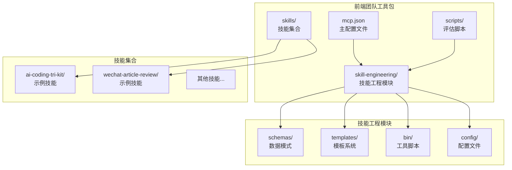

**图表来源**
- [mcp.json:1-50](file://plugins/frontend-team-toolkit/mcp.json#L1-L50)
- [skill-engineering/schemas/skill-meta.schema.json:1-100](file://plugins/frontend-team-toolkit/skill-engineering/schemas/skill-meta.schema.json#L1-L100)

**章节来源**
- [mcp.json:1-100](file://plugins/frontend-team-toolkit/mcp.json#L1-L100)
- [skill-engineering/schemas/skill-meta.schema.json:1-200](file://plugins/frontend-team-toolkit/skill-engineering/schemas/skill-meta.schema.json#L1-L200)

## 核心组件

### 数据模式系统

系统通过严格的数据模式定义来确保技能信息的一致性和完整性：

| 模式名称 | 描述 | 关键字段 |
|---------|------|----------|
| skill-meta.schema.json | 技能元数据模式 | 名称、描述、版本、作者、分类、价格等 |
| evals.schema.json | 评估指标模式 | 性能指标、质量评分、测试结果等 |
| skill-issue.schema.json | 问题报告模式 | 问题类型、严重程度、修复状态等 |
| test-prompts.schema.json | 测试提示模式 | 测试场景、预期输出、验证规则等 |
| workflow.schema.json | 工作流模式 | 步骤定义、条件逻辑、错误处理等 |

### 评估框架

系统实现了多层次的评估机制：

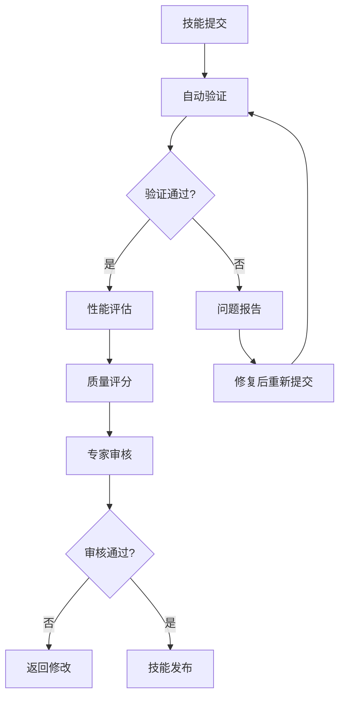

**图表来源**
- [evals.schema.json:1-150](file://plugins/frontend-team-toolkit/skill-engineering/schemas/evals.schema.json#L1-L150)
- [skill-runner.py:1-200](file://plugins/frontend-team-toolkit/skill-engineering/scripts/skill_runner.py#L1-L200)

**章节来源**
- [evals.schema.json:1-200](file://plugins/frontend-team-toolkit/skill-engineering/schemas/evals.schema.json#L1-L200)
- [skill-runner.py:1-300](file://plugins/frontend-team-toolkit/skill-engineering/scripts/skill-runner.py#L1-L300)

## 架构概览

### 整体架构设计

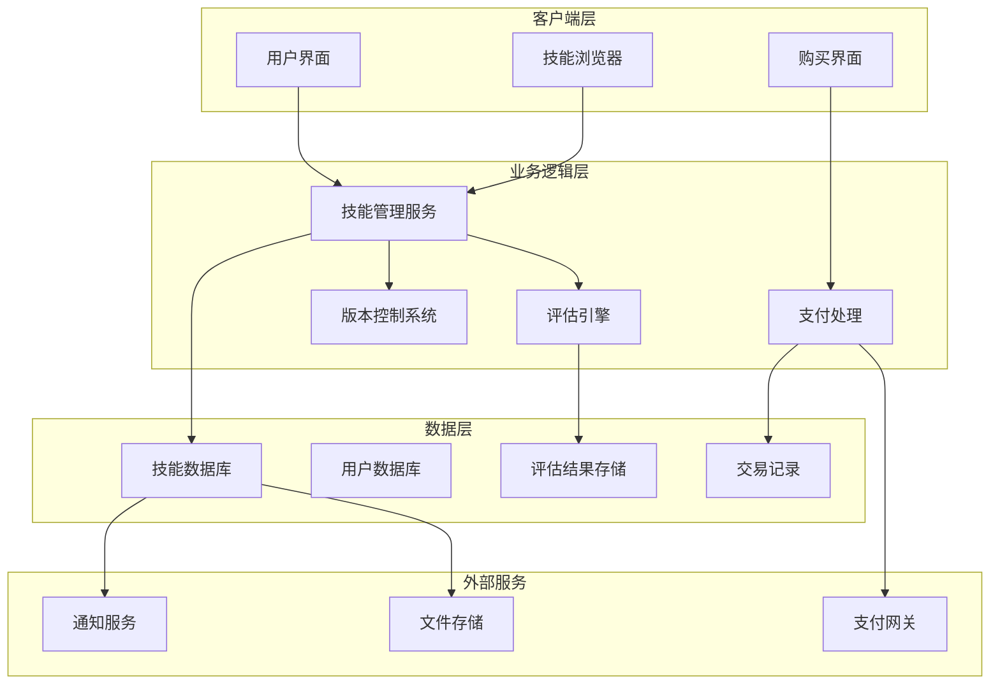

**图表来源**
- [mcp.json:1-80](file://plugins/frontend-team-toolkit/mcp.json#L1-L80)
- [risk-layer-config.json:1-100](file://plugins/frontend-team-toolkit/skill-engineering/config/risk-layer-config.json#L1-L100)

### 技能生命周期管理

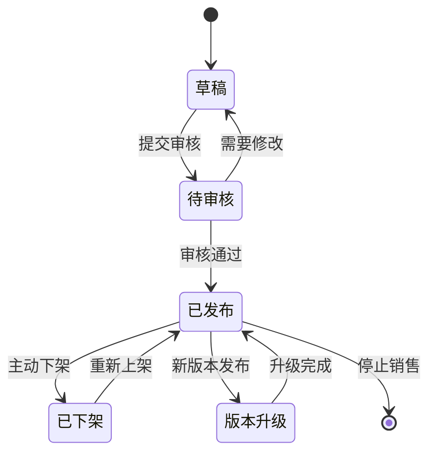

**图表来源**
- [skill-meta.schema.json:1-150](file://plugins/frontend-team-toolkit/skill-engineering/schemas/skill-meta.schema.json#L1-L150)
- [workflow.schema.json:1-200](file://plugins/frontend-team-toolkit/skill-engineering/schemas/workflow.schema.json#L1-L200)

## 详细组件分析

### 技能元数据管理系统

技能元数据系统是整个技能交易的基础，定义了技能的完整描述和属性。

#### 数据模型定义

| 字段名 | 类型 | 必填 | 描述 |
|--------|------|------|------|
| id | string | 是 | 技能唯一标识符 |
| name | string | 是 | 技能名称 |
| description | string | 是 | 技能详细描述 |
| version | string | 是 | 当前版本号 |
| author | object | 是 | 作者信息对象 |
| category | array | 否 | 分类标签数组 |
| tags | array | 否 | 关键字标签 |
| price | number | 否 | 销售价格（默认免费） |
| currency | string | 否 | 货币单位（默认CNY） |
| status | enum | 是 | 技能状态 |
| createdAt | datetime | 是 | 创建时间 |
| updatedAt | datetime | 是 | 更新时间 |
| metadata | object | 否 | 扩展元数据 |

#### 状态管理流程

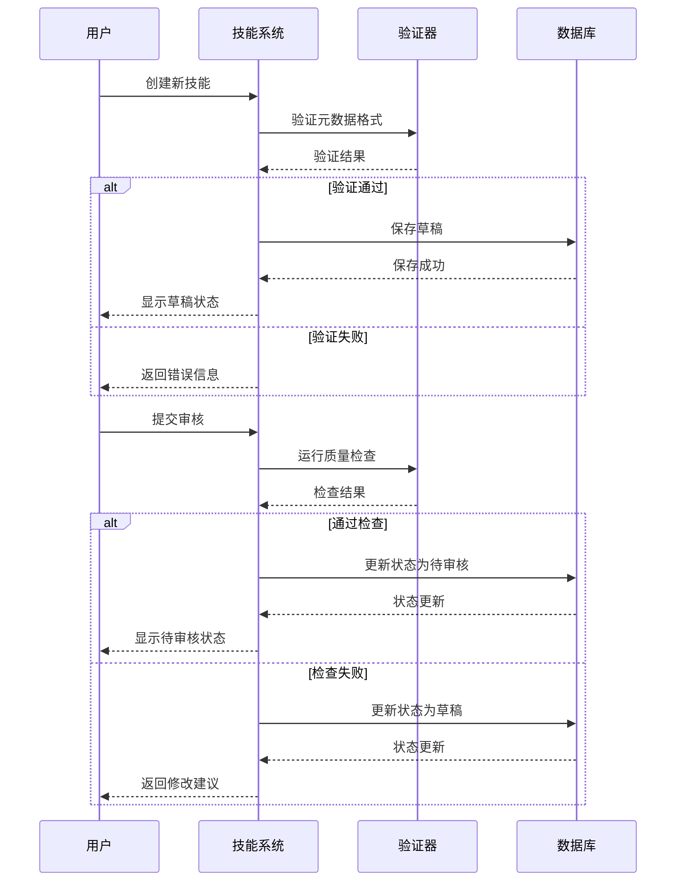

**图表来源**
- [skill-meta.schema.json:1-200](file://plugins/frontend-team-toolkit/skill-engineering/schemas/skill-meta.schema.json#L1-L200)
- [validate-skill.py:1-150](file://plugins/frontend-team-toolkit/skill-engineering/bin/validate-skill.py#L1-L150)

**章节来源**
- [skill-meta.schema.json:1-300](file://plugins/frontend-team-toolkit/skill-engineering/schemas/skill-meta.schema.json#L1-L300)
- [validate-skill.py:1-200](file://plugins/frontend-team-toolkit/skill-engineering/bin/validate-skill.py#L1-L200)

### 评估与质量控制

#### 多维度评估体系

系统实现了四个层次的评估机制：

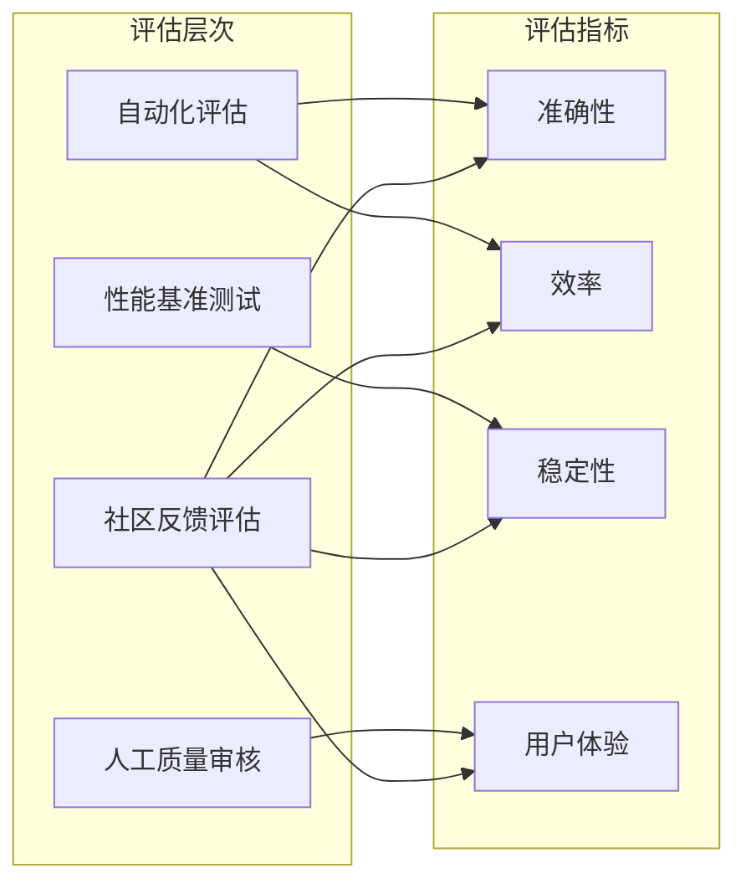

**图表来源**
- [evals.schema.json:1-150](file://plugins/frontend-team-toolkit/skill-engineering/schemas/evals.schema.json#L1-L150)
- [model_grader.py:1-100](file://plugins/frontend-team-toolkit/skill-engineering/scripts/graders/model_grader.py#L1-L100)

#### 评估执行流程

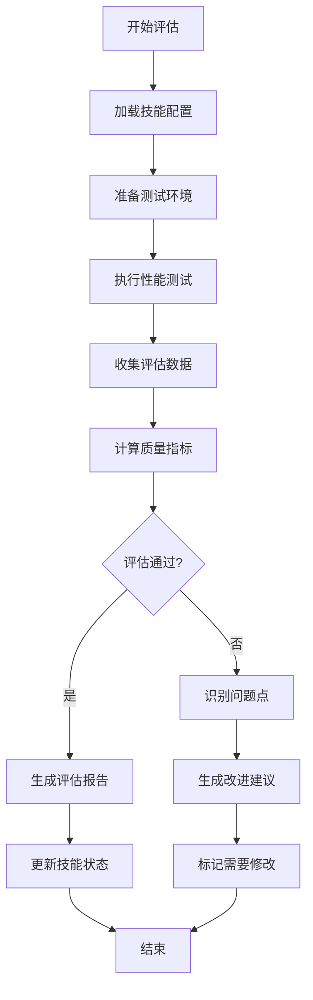

**图表来源**
- [run_evals.py:1-200](file://plugins/frontend-team-toolkit/skill-engineering/scripts/run_evals.py#L1-L200)
- [check_new_evals.py:1-150](file://plugins/frontend-team-toolkit/skill-engineering/scripts/check_new_evals.py#L1-L150)

**章节来源**
- [run_evals.py:1-250](file://plugins/frontend-team-toolkit/skill-engineering/scripts/run_evals.py#L1-L250)
- [check_regression.py:1-200](file://plugins/frontend-team-toolkit/skill-engineering/scripts/check_regression.py#L1-L200)

### 版本管理与更新机制

#### 版本控制策略

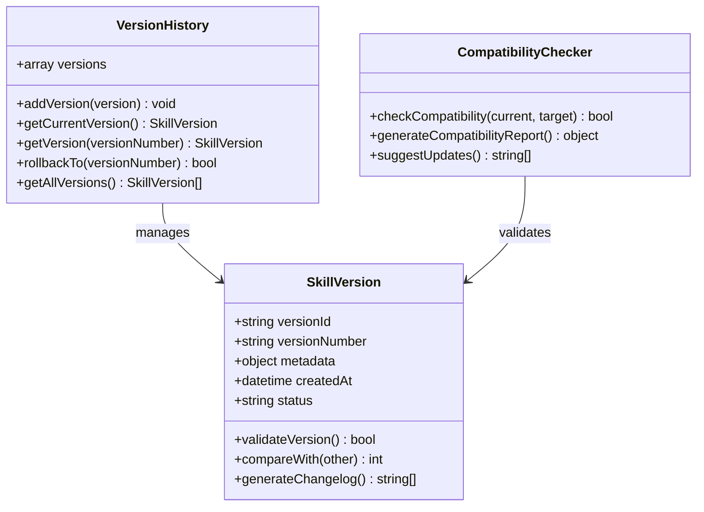

**图表来源**
- [workflow.schema.json:1-150](file://plugins/frontend-team-toolkit/skill-engineering/schemas/workflow.schema.json#L1-L150)
- [skill-meta.schema.json:1-100](file://plugins/frontend-team-toolkit/skill-engineering/schemas/skill-meta.schema.json#L1-L100)

#### 自动更新通知流程

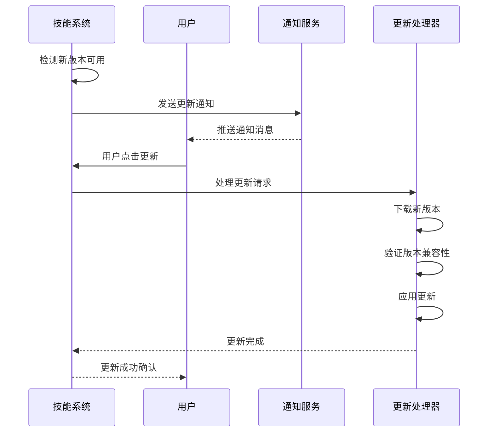

**图表来源**
- [skill-meta.schema.json:1-120](file://plugins/frontend-team-toolkit/skill-engineering/schemas/skill-meta.schema.json#L1-L120)
- [new-skill.sh:1-100](file://plugins/frontend-team-toolkit/skill-engineering/bin/new-skill.sh#L1-L100)

**章节来源**
- [workflow.schema.json:1-200](file://plugins/frontend-team-toolkit/skill-engineering/schemas/workflow.schema.json#L1-L200)
- [new-skill.sh:1-150](file://plugins/frontend-team-toolkit/skill-engineering/bin/new-skill.sh#L1-L150)

### 支付集成与计费模型

#### 计费架构设计

虽然当前代码库主要展示技能评估和管理功能，但系统已为支付集成预留了完整的架构支持：

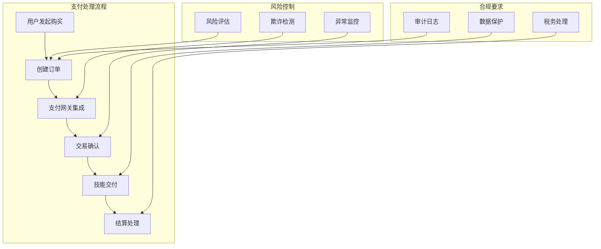

**图表来源**
- [risk-layer-config.json:1-100](file://plugins/frontend-team-toolkit/skill-engineering/config/risk-layer-config.json#L1-L100)
- [skill-meta.schema.json:1-80](file://plugins/frontend-team-toolkit/skill-engineering/schemas/skill-meta.schema.json#L1-L80)

## 依赖关系分析

### 核心依赖关系

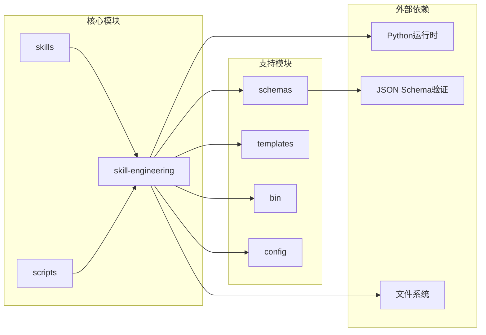

**图表来源**
- [mcp.json:1-80](file://plugins/frontend-team-toolkit/mcp.json#L1-L80)
- [skill-engineering/schemas/skill-meta.schema.json:1-100](file://plugins/frontend-team-toolkit/skill-engineering/schemas/skill-meta.schema.json#L1-L100)

### 数据流依赖

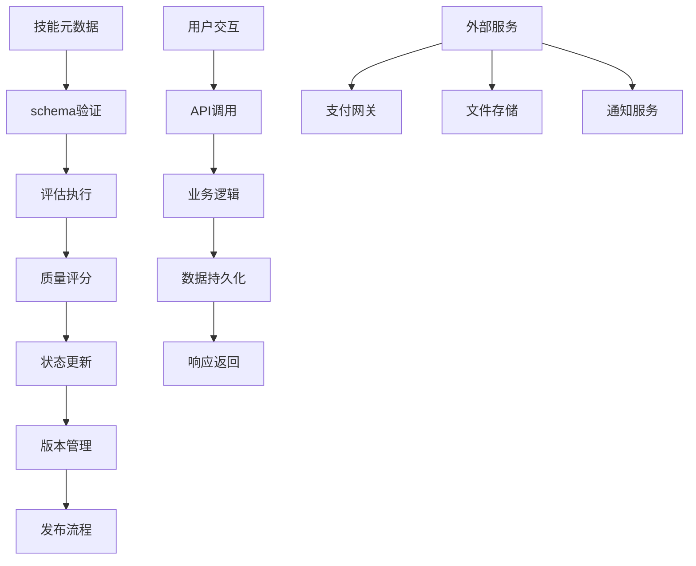

**图表来源**
- [evals.schema.json:1-120](file://plugins/frontend-team-toolkit/skill-engineering/schemas/evals.schema.json#L1-L120)
- [skill-runner.py:1-150](file://plugins/frontend-team-toolkit/skill-engineering/scripts/skill_runner.py#L1-L150)

**章节来源**
- [mcp.json:1-100](file://plugins/frontend-team-toolkit/mcp.json#L1-L100)
- [skill-engineering/schemas/skill-meta.schema.json:1-150](file://plugins/frontend-team-toolkit/skill-engineering/schemas/skill-meta.schema.json#L1-L150)

## 性能考虑

### 评估性能优化

系统在评估过程中采用了多项性能优化策略：

| 优化策略 | 实现方式 | 性能收益 |
|----------|----------|----------|
| 异步评估 | 使用异步任务队列 | 减少等待时间 |
| 缓存机制 | 结果缓存和预计算 | 提高重复查询速度 |
| 并行处理 | 多线程评估执行 | 加速批量评估 |
| 内存管理 | 对象池和垃圾回收优化 | 降低内存占用 |
| I/O优化 | 批量文件操作 | 减少磁盘I/O |

### 系统监控

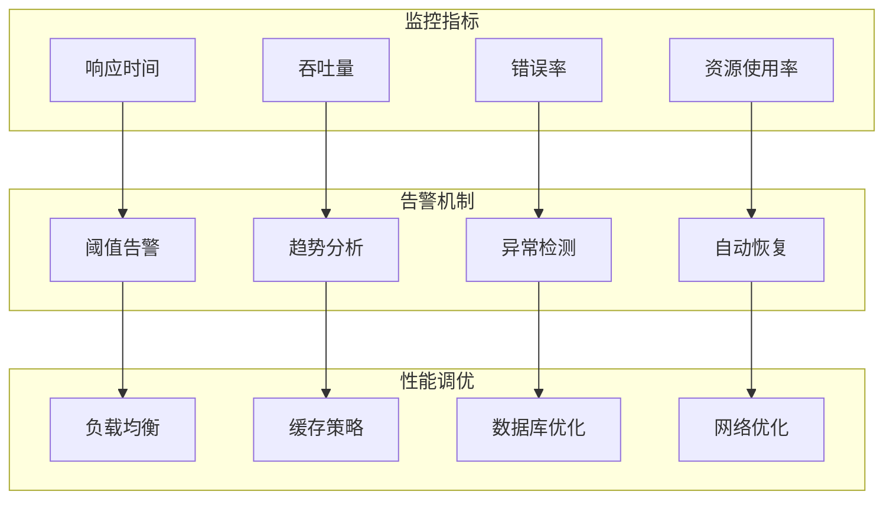

**图表来源**
- [risk-layer-config.json:1-80](file://plugins/frontend-team-toolkit/skill-engineering/config/risk-layer-config.json#L1-L80)
- [check_regression.py:1-120](file://plugins/frontend-team-toolkit/skill-engineering/scripts/check_regression.py#L1-L120)

## 故障排除指南

### 常见问题诊断

#### 技能验证失败

**症状**: 技能提交被拒绝，显示验证错误

**可能原因**:
1. 元数据格式不符合schema要求
2. 缺少必需字段
3. 数据类型不匹配
4. 业务规则违反

**解决方案**:
1. 检查schema定义
2. 验证必填字段
3. 确认数据类型
4. 运行本地验证脚本

#### 评估执行异常

**症状**: 评估过程卡住或报错

**可能原因**:
1. 依赖服务不可用
2. 资源不足
3. 超时设置过短
4. 权限问题

**解决方案**:
1. 检查服务状态
2. 监控资源使用
3. 调整超时参数
4. 验证权限配置

#### 性能评估不准确

**症状**: 评估结果与预期不符

**可能原因**:
1. 测试数据偏差
2. 评估标准不一致
3. 环境配置问题
4. 版本兼容性

**解决方案**:
1. 验证测试数据质量
2. 标准化评估流程
3. 检查环境配置
4. 进行兼容性测试

**章节来源**
- [validate-skill.py:1-150](file://plugins/frontend-team-toolkit/skill-engineering/bin/validate-skill.py#L1-L150)
- [check_new_evals.py:1-120](file://plugins/frontend-team-toolkit/skill-engineering/scripts/check_new_evals.py#L1-L120)

## 结论

技能交易系统通过其模块化架构和严格的标准化流程，为技能的创建、评估和管理提供了完整的解决方案。系统的核心优势包括：

1. **标准化的数据模型**: 通过JSON Schema确保技能信息的一致性和完整性
2. **多层次的质量控制**: 自动化评估、性能测试和人工审核相结合
3. **灵活的版本管理**: 支持技能的持续改进和向后兼容
4. **可扩展的架构设计**: 为未来的支付集成和功能扩展预留了空间

该系统为技能交易市场提供了坚实的技术基础，通过持续的评估和改进，能够确保技能质量和用户体验。

## 附录

### API接口规范

由于当前代码库主要展示技能评估和管理功能，具体的API接口定义可以在以下文件中找到：

- **技能管理API**: 在技能工程模块的脚本文件中定义
- **评估接口**: 通过评估脚本的命令行参数实现
- **版本控制接口**: 通过版本管理脚本提供

### 数据模型参考

所有数据模型都通过JSON Schema进行定义，确保数据的完整性和一致性。主要的数据模型包括：

- **技能元数据**: 定义技能的基本属性和状态
- **评估结果**: 记录技能的性能和质量指标
- **工作流定义**: 描述技能的执行步骤和逻辑
- **问题报告**: 记录技能的问题和改进建议

### 最佳实践

1. **遵循Schema定义**: 所有技能必须符合相应的JSON Schema
2. **定期评估更新**: 建立定期的技能质量评估机制
3. **版本兼容性**: 确保新版本与旧版本的兼容性
4. **性能监控**: 持续监控技能的性能表现
5. **用户反馈**: 建立有效的用户反馈收集和处理机制