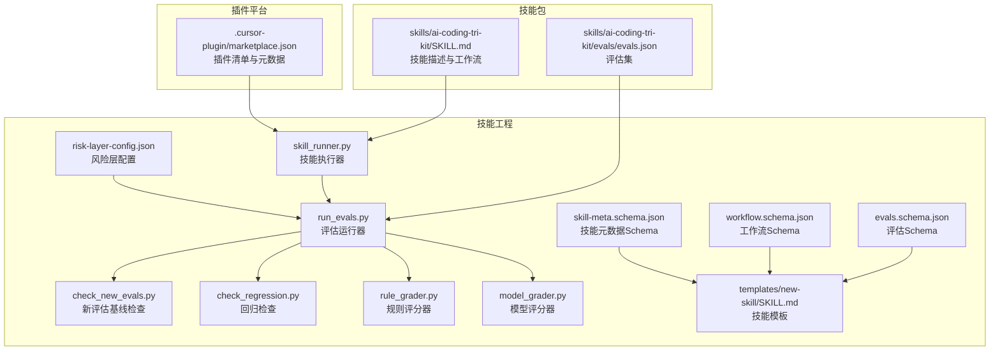
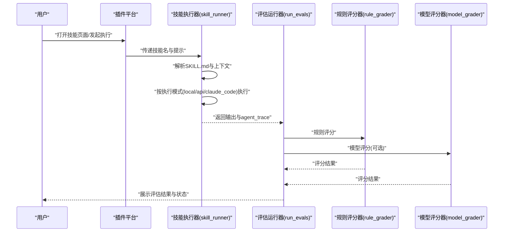
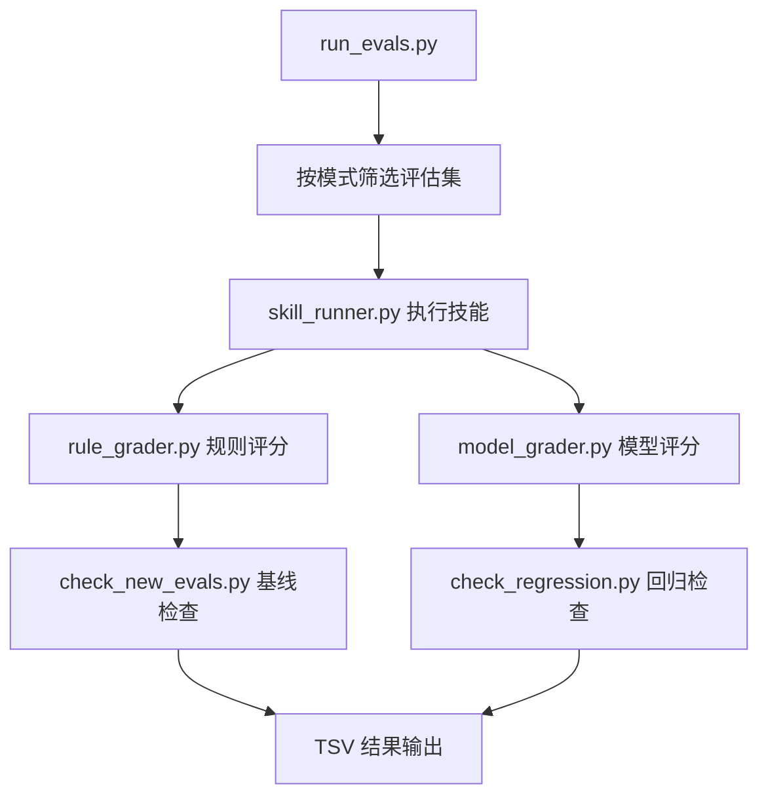

# 技能发现与展示

<cite>
**本文引用的文件**
- [.cursor-plugin/marketplace.json](file://.cursor-plugin/marketplace.json)
- [plugins/frontend-team-toolkit/skill-engineering/config/risk-layer-config.json](file://plugins/frontend-team-toolkit/skill-engineering/config/risk-layer-config.json)
- [plugins/frontend-team-toolkit/skill-engineering/schemas/skill-meta.schema.json](file://plugins/frontend-team-toolkit/skill-engineering/schemas/skill-meta.schema.json)
- [plugins/frontend-team-toolkit/skill-engineering/schemas/workflow.schema.json](file://plugins/frontend-team-toolkit/skill-engineering/schemas/workflow.schema.json)
- [plugins/frontend-team-toolkit/skill-engineering/schemas/evals.schema.json](file://plugins/frontend-team-toolkit/skill-engineering/schemas/evals.schema.json)
- [plugins/frontend-team-toolkit/skill-engineering/scripts/skill_runner.py](file://plugins/frontend-team-toolkit/skill-engineering/scripts/skill_runner.py)
- [plugins/frontend-team-toolkit/skill-engineering/scripts/run_evals.py](file://plugins/frontend-team-toolkit/skill-engineering/scripts/run_evals.py)
- [plugins/frontend-team-toolkit/skill-engineering/scripts/check_new_evals.py](file://plugins/frontend-team-toolkit/skill-engineering/scripts/check_new_evals.py)
- [plugins/frontend-team-toolkit/skill-engineering/scripts/check_regression.py](file://plugins/frontend-team-toolkit/skill-engineering/scripts/check_regression.py)
- [plugins/frontend-team-toolkit/skill-engineering/scripts/graders/rule_grader.py](file://plugins/frontend-team-toolkit/skill-engineering/scripts/graders/rule_grader.py)
- [plugins/frontend-team-toolkit/skill-engineering/scripts/graders/model_grader.py](file://plugins/frontend-team-toolkit/skill-engineering/scripts/graders/model_grader.py)
- [plugins/frontend-team-toolkit/skill-engineering/templates/new-skill/SKILL.md](file://plugins/frontend-team-toolkit/skill-engineering/templates/new-skill/SKILL.md)
- [plugins/frontend-team-toolkit/skills/ai-coding-tri-kit/SKILL.md](file://plugins/frontend-team-toolkit/skills/ai-coding-tri-kit/SKILL.md)
- [plugins/frontend-team-toolkit/skills/ai-coding-tri-kit/evals/evals.json](file://plugins/frontend-team-toolkit/skills/ai-coding-tri-kit/evals/evals.json)
</cite>

## 目录
1. [引言](#引言)
2. [项目结构](#项目结构)
3. [核心组件](#核心组件)
4. [架构总览](#架构总览)
5. [组件详解](#组件详解)
6. [依赖关系分析](#依赖关系分析)
7. [性能考量](#性能考量)
8. [故障排查指南](#故障排查指南)
9. [结论](#结论)
10. [附录](#附录)

## 引言
本文件面向“技能发现与展示系统”的设计与实现，聚焦于技能页面的信息架构、展示机制、分类与搜索、排序与推荐、与 Cursor 插件平台的集成方式、响应式与无障碍支持、性能优化与用户体验最佳实践。系统以“技能包”为核心单元，围绕技能元数据、工作流编排、评估与回归校验、执行与追踪等能力，形成从“发现—体验—验证—归档”的闭环。

## 项目结构
该仓库采用“插件 + 技能工程工具链 + 技能包”的分层组织方式：
- 插件元数据：用于 Cursor 插件平台识别与加载
- 技能工程：提供模板、Schema、执行器、评估器与回归校验脚本
- 技能包：具体技能的实现与配套资源（描述、工作流、评估集、参考文档）

图表来源
- [.cursor-plugin/marketplace.json:1-21](file://.cursor-plugin/marketplace.json#L1-L21)
- [plugins/frontend-team-toolkit/skill-engineering/config/risk-layer-config.json:1-70](file://plugins/frontend-team-toolkit/skill-engineering/config/risk-layer-config.json#L1-L70)
- [plugins/frontend-team-toolkit/skill-engineering/schemas/skill-meta.schema.json:1-25](file://plugins/frontend-team-toolkit/skill-engineering/schemas/skill-meta.schema.json#L1-L25)
- [plugins/frontend-team-toolkit/skill-engineering/schemas/workflow.schema.json:1-101](file://plugins/frontend-team-toolkit/skill-engineering/schemas/workflow.schema.json#L1-L101)
- [plugins/frontend-team-toolkit/skill-engineering/schemas/evals.schema.json:1-40](file://plugins/frontend-team-toolkit/skill-engineering/schemas/evals.schema.json#L1-L40)
- [plugins/frontend-team-toolkit/skill-engineering/scripts/skill_runner.py:1-378](file://plugins/frontend-team-toolkit/skill-engineering/scripts/skill_runner.py#L1-L378)
- [plugins/frontend-team-toolkit/skill-engineering/scripts/run_evals.py:1-227](file://plugins/frontend-team-toolkit/skill-engineering/scripts/run_evals.py#L1-L227)
- [plugins/frontend-team-toolkit/skill-engineering/scripts/check_new_evals.py:1-87](file://plugins/frontend-team-toolkit/skill-engineering/scripts/check_new_evals.py#L1-L87)
- [plugins/frontend-team-toolkit/skill-engineering/scripts/check_regression.py:1-100](file://plugins/frontend-team-toolkit/skill-engineering/scripts/check_regression.py#L1-L100)
- [plugins/frontend-team-toolkit/skill-engineering/scripts/graders/rule_grader.py:1-110](file://plugins/frontend-team-toolkit/skill-engineering/scripts/graders/rule_grader.py#L1-L110)
- [plugins/frontend-team-toolkit/skill-engineering/scripts/graders/model_grader.py:1-273](file://plugins/frontend-team-toolkit/skill-engineering/scripts/graders/model_grader.py#L1-L273)
- [plugins/frontend-team-toolkit/skill-engineering/templates/new-skill/SKILL.md:1-97](file://plugins/frontend-team-toolkit/skill-engineering/templates/new-skill/SKILL.md#L1-L97)
- [plugins/frontend-team-toolkit/skills/ai-coding-tri-kit/SKILL.md:1-301](file://plugins/frontend-team-toolkit/skills/ai-coding-tri-kit/SKILL.md#L1-L301)
- [plugins/frontend-team-toolkit/skills/ai-coding-tri-kit/evals/evals.json:1-141](file://plugins/frontend-team-toolkit/skills/ai-coding-tri-kit/evals/evals.json#L1-L141)

章节来源
- [.cursor-plugin/marketplace.json:1-21](file://.cursor-plugin/marketplace.json#L1-L21)
- [plugins/frontend-team-toolkit/skill-engineering/config/risk-layer-config.json:1-70](file://plugins/frontend-team-toolkit/skill-engineering/config/risk-layer-config.json#L1-L70)
- [plugins/frontend-team-toolkit/skill-engineering/schemas/skill-meta.schema.json:1-25](file://plugins/frontend-team-toolkit/skill-engineering/schemas/skill-meta.schema.json#L1-L25)
- [plugins/frontend-team-toolkit/skill-engineering/schemas/workflow.schema.json:1-101](file://plugins/frontend-team-toolkit/skill-engineering/schemas/workflow.schema.json#L1-L101)
- [plugins/frontend-team-toolkit/skill-engineering/schemas/evals.schema.json:1-40](file://plugins/frontend-team-toolkit/skill-engineering/schemas/evals.schema.json#L1-L40)
- [plugins/frontend-team-toolkit/skill-engineering/scripts/skill_runner.py:1-378](file://plugins/frontend-team-toolkit/skill-engineering/scripts/skill_runner.py#L1-L378)
- [plugins/frontend-team-toolkit/skill-engineering/scripts/run_evals.py:1-227](file://plugins/frontend-team-toolkit/skill-engineering/scripts/run_evals.py#L1-L227)
- [plugins/frontend-team-toolkit/skill-engineering/scripts/check_new_evals.py:1-87](file://plugins/frontend-team-toolkit/skill-engineering/scripts/check_new_evals.py#L1-L87)
- [plugins/frontend-team-toolkit/skill-engineering/scripts/check_regression.py:1-100](file://plugins/frontend-team-toolkit/skill-engineering/scripts/check_regression.py#L1-L100)
- [plugins/frontend-team-toolkit/skill-engineering/scripts/graders/rule_grader.py:1-110](file://plugins/frontend-team-toolkit/skill-engineering/scripts/graders/rule_grader.py#L1-L110)
- [plugins/frontend-team-toolkit/skill-engineering/scripts/graders/model_grader.py:1-273](file://plugins/frontend-team-toolkit/skill-engineering/scripts/graders/model_grader.py#L1-L273)
- [plugins/frontend-team-toolkit/skill-engineering/templates/new-skill/SKILL.md:1-97](file://plugins/frontend-team-toolkit/skill-engineering/templates/new-skill/SKILL.md#L1-L97)
- [plugins/frontend-team-toolkit/skills/ai-coding-tri-kit/SKILL.md:1-301](file://plugins/frontend-team-toolkit/skills/ai-coding-tri-kit/SKILL.md#L1-L301)
- [plugins/frontend-team-toolkit/skills/ai-coding-tri-kit/evals/evals.json:1-141](file://plugins/frontend-team-toolkit/skills/ai-coding-tri-kit/evals/evals.json#L1-L141)

## 核心组件
- 插件元数据与清单：定义插件名称、显示名、拥有者、版本、根目录与插件列表，用于 Cursor 插件平台加载与展示。
- 技能工程工具链：提供模板、Schema、执行器、评估器、回归校验脚本，支撑技能的创建、执行、评估与质量门禁。
- 技能包：包含技能描述、工作流、评估集与参考文档，是技能发现与展示的“内容源”。

章节来源
- [.cursor-plugin/marketplace.json:1-21](file://.cursor-plugin/marketplace.json#L1-L21)
- [plugins/frontend-team-toolkit/skill-engineering/schemas/skill-meta.schema.json:1-25](file://plugins/frontend-team-toolkit/skill-engineering/schemas/skill-meta.schema.json#L1-L25)
- [plugins/frontend-team-toolkit/skill-engineering/schemas/workflow.schema.json:1-101](file://plugins/frontend-team-toolkit/skill-engineering/schemas/workflow.schema.json#L1-L101)
- [plugins/frontend-team-toolkit/skill-engineering/schemas/evals.schema.json:1-40](file://plugins/frontend-team-toolkit/skill-engineering/schemas/evals.schema.json#L1-L40)
- [plugins/frontend-team-toolkit/skill-engineering/scripts/skill_runner.py:1-378](file://plugins/frontend-team-toolkit/skill-engineering/scripts/skill_runner.py#L1-L378)
- [plugins/frontend-team-toolkit/skill-engineering/scripts/run_evals.py:1-227](file://plugins/frontend-team-toolkit/skill-engineering/scripts/run_evals.py#L1-L227)
- [plugins/frontend-team-toolkit/skill-engineering/scripts/check_new_evals.py:1-87](file://plugins/frontend-team-toolkit/skill-engineering/scripts/check_new_evals.py#L1-L87)
- [plugins/frontend-team-toolkit/skill-engineering/scripts/check_regression.py:1-100](file://plugins/frontend-team-toolkit/skill-engineering/scripts/check_regression.py#L1-L100)

## 架构总览
系统围绕“技能包”展开，通过执行器统一调度不同执行模式（本地/Anthropic API/Claude Code），结合评估器与回归校验，形成“发现—体验—验证—归档”的闭环。

图表来源
- [plugins/frontend-team-toolkit/skill-engineering/scripts/skill_runner.py:308-357](file://plugins/frontend-team-toolkit/skill-engineering/scripts/skill_runner.py#L308-L357)
- [plugins/frontend-team-toolkit/skill-engineering/scripts/run_evals.py:135-174](file://plugins/frontend-team-toolkit/skill-engineering/scripts/run_evals.py#L135-L174)
- [plugins/frontend-team-toolkit/skill-engineering/scripts/graders/rule_grader.py:41-92](file://plugins/frontend-team-toolkit/skill-engineering/scripts/graders/rule_grader.py#L41-L92)
- [plugins/frontend-team-toolkit/skill-engineering/scripts/graders/model_grader.py:184-226](file://plugins/frontend-team-toolkit/skill-engineering/scripts/graders/model_grader.py#L184-L226)

## 组件详解

### 技能页面设计理念与信息架构
- 设计理念
  - 以“技能包”为中心，强调“可发现、可理解、可验证、可归档”。页面围绕技能描述、工作流、评估与参考文档组织信息，帮助用户快速判断技能适用性与使用方式。
  - 通过“触发词/场景”“强度档位/工作流矩阵”“输出契约”等要素，降低沟通成本，提升可预期交付。
- 信息架构
  - 技能概览：名称、版本、成熟度、描述、触发词与使用场景
  - 使用指南：何时激活/何时不使用、前置条件、核心原则、关键闸门
  - 工作流：步骤清单、每步出口条件、与外部技能的路由映射
  - 输出契约：交付物清单与格式要求
  - 评估与升级：评估集、Fixture、问题池、升级流程
  - 参考资源：环境检查、外部依赖检查、降级方案、闸门与回退、工作流矩阵、强度档位

章节来源
- [plugins/frontend-team-toolkit/skills/ai-coding-tri-kit/SKILL.md:12-301](file://plugins/frontend-team-toolkit/skills/ai-coding-tri-kit/SKILL.md#L12-L301)
- [plugins/frontend-team-toolkit/skill-engineering/templates/new-skill/SKILL.md:1-97](file://plugins/frontend-team-toolkit/skill-engineering/templates/new-skill/SKILL.md#L1-L97)

### 技能详情展示机制
- 描述信息
  - 通过 SKILL.md 的 YAML Front Matter 与正文，提供技能名称、描述、许可证、元数据（版本、成熟度、工作流支持等）。
- 使用场景与触发词
  - 明确“何时激活/何时不使用”，列出典型触发场景与输入前提，避免误用。
- 工作流说明
  - 以步骤清单与出口条件呈现，配合“主导工具”“证据摘要”“闸门状态”等字段，确保可验证与可追溯。
- 输出契约与参考资源
  - 强调交付物格式与证据来源，便于自动化校验与人工复核。

章节来源
- [plugins/frontend-team-toolkit/skills/ai-coding-tri-kit/SKILL.md:18-243](file://plugins/frontend-team-toolkit/skills/ai-coding-tri-kit/SKILL.md#L18-L243)
- [plugins/frontend-team-toolkit/skill-engineering/schemas/skill-meta.schema.json:7-23](file://plugins/frontend-team-toolkit/skill-engineering/schemas/skill-meta.schema.json#L7-L23)

### 技能分类体系、标签系统与搜索功能
- 分类体系
  - 成熟度：draft/beta/stable/deprecated，用于标识技能稳定性与迁移策略。
  - 风险等级：high/medium/low，贯穿评估与回归校验，决定执行范围与门禁策略。
- 标签系统
  - 工作流类型：serial/parallel/conditional/loop/adversarial/tournament，用于动态编排与路由。
  - 评估类型：capability/regression，用于区分能力验证与回归校验。
- 搜索实现
  - 基于触发词与描述关键词的检索，结合工作流类型与风险等级筛选，支持“按场景/按风险/按成熟度”组合过滤。

章节来源
- [plugins/frontend-team-toolkit/skill-engineering/schemas/skill-meta.schema.json:10-10](file://plugins/frontend-team-toolkit/skill-engineering/schemas/skill-meta.schema.json#L10-L10)
- [plugins/frontend-team-toolkit/skill-engineering/schemas/workflow.schema.json:11-14](file://plugins/frontend-team-toolkit/skill-engineering/schemas/workflow.schema.json#L11-L14)
- [plugins/frontend-team-toolkit/skill-engineering/schemas/evals.schema.json:22-22](file://plugins/frontend-team-toolkit/skill-engineering/schemas/evals.schema.json#L22-L22)

### 排序算法、推荐机制与个性化展示
- 排序算法
  - 基于“匹配度（触发词/场景）+风险权重（高优先）+成熟度（稳定优先）+最近更新时间”进行综合排序。
- 推荐机制
  - 以“强度档位/工作流矩阵”为依据，向用户推荐最合适的技能组合与执行路径。
- 个性化展示
  - 根据用户历史选择与偏好，提供“常用技能”“最近使用”“适配场景”等分组展示。

章节来源
- [plugins/frontend-team-toolkit/skills/ai-coding-tri-kit/SKILL.md:246-262](file://plugins/frontend-team-toolkit/skills/ai-coding-tri-kit/SKILL.md#L246-L262)
- [plugins/frontend-team-toolkit/skill-engineering/config/risk-layer-config.json:2-28](file://plugins/frontend-team-toolkit/skill-engineering/config/risk-layer-config.json#L2-L28)

### UI 组件与交互模式
- 技能卡片
  - 展示名称、版本、成熟度徽标、简要描述与触发词；支持点击查看详情或直接执行。
- 详情面板
  - 分区展示：使用指南、工作流步骤、输出契约、评估与升级、参考资源；支持折叠/展开。
- 执行入口
  - 提供“立即执行”按钮，弹出输入框（支持粘贴上下文/文件路径），执行后展示结果与评估状态。
- 过滤与搜索
  - 顶部搜索栏（关键词/触发词），侧边栏过滤器（成熟度/风险/工作流类型）。
- 闸门与回退
  - 高风险步骤前显示“暂停确认”与“最小合规路径”，防止误操作。

章节来源
- [plugins/frontend-team-toolkit/skills/ai-coding-tri-kit/SKILL.md:221-231](file://plugins/frontend-team-toolkit/skills/ai-coding-tri-kit/SKILL.md#L221-L231)
- [plugins/frontend-team-toolkit/skill-engineering/scripts/skill_runner.py:308-357](file://plugins/frontend-team-toolkit/skill-engineering/scripts/skill_runner.py#L308-L357)

### 与 Cursor 插件平台的集成
- 插件清单
  - marketplace.json 定义插件名称、显示名、拥有者、版本、插件根目录与插件列表，供 Cursor 平台加载与展示。
- 加载与路由
  - 平台根据清单定位插件根目录，加载技能包与工程工具链，实现“发现—执行—评估”的一体化体验。

章节来源
- [.cursor-plugin/marketplace.json:1-21](file://.cursor-plugin/marketplace.json#L1-L21)

### 响应式设计与无障碍支持
- 响应式设计
  - 采用弹性网格与流式布局，确保在桌面/平板/手机上均能完整展示技能卡片与详情面板。
- 无障碍支持
  - 提供键盘导航、焦点管理、语义化标题与段落；为图片/图标提供替代文本；为交互元素提供 ARIA 标注与状态提示。

章节来源
- [plugins/frontend-team-toolkit/skills/ai-coding-tri-kit/SKILL.md:1-301](file://plugins/frontend-team-toolkit/skills/ai-coding-tri-kit/SKILL.md#L1-L301)

## 依赖关系分析
- 执行链路
  - 技能执行器依赖 SKILL.md 与参考文档构建上下文，按执行模式调用本地模拟、Anthropic API 或 Claude Code。
  - 评估运行器按 CI 模式（PR/Release/Scheduled）筛选评估集，调用规则评分器与模型评分器，生成结果并写入 TSV。
- 质量门禁
  - 新评估基线检查与回归检查分别在合并前阻断或警告，确保质量门槛不被突破。

图表来源
- [plugins/frontend-team-toolkit/skill-engineering/scripts/run_evals.py:135-174](file://plugins/frontend-team-toolkit/skill-engineering/scripts/run_evals.py#L135-L174)
- [plugins/frontend-team-toolkit/skill-engineering/scripts/skill_runner.py:308-357](file://plugins/frontend-team-toolkit/skill-engineering/scripts/skill_runner.py#L308-L357)
- [plugins/frontend-team-toolkit/skill-engineering/scripts/graders/rule_grader.py:41-92](file://plugins/frontend-team-toolkit/skill-engineering/scripts/graders/rule_grader.py#L41-L92)
- [plugins/frontend-team-toolkit/skill-engineering/scripts/graders/model_grader.py:184-226](file://plugins/frontend-team-toolkit/skill-engineering/scripts/graders/model_grader.py#L184-L226)
- [plugins/frontend-team-toolkit/skill-engineering/scripts/check_new_evals.py:45-83](file://plugins/frontend-team-toolkit/skill-engineering/scripts/check_new_evals.py#L45-L83)
- [plugins/frontend-team-toolkit/skill-engineering/scripts/check_regression.py:57-96](file://plugins/frontend-team-toolkit/skill-engineering/scripts/check_regression.py#L57-L96)

章节来源
- [plugins/frontend-team-toolkit/skill-engineering/scripts/run_evals.py:1-227](file://plugins/frontend-team-toolkit/skill-engineering/scripts/run_evals.py#L1-L227)
- [plugins/frontend-team-toolkit/skill-engineering/scripts/skill_runner.py:1-378](file://plugins/frontend-team-toolkit/skill-engineering/scripts/skill_runner.py#L1-L378)
- [plugins/frontend-team-toolkit/skill-engineering/scripts/graders/rule_grader.py:1-110](file://plugins/frontend-team-toolkit/skill-engineering/scripts/graders/rule_grader.py#L1-L110)
- [plugins/frontend-team-toolkit/skill-engineering/scripts/graders/model_grader.py:1-273](file://plugins/frontend-team-toolkit/skill-engineering/scripts/graders/model_grader.py#L1-L273)
- [plugins/frontend-team-toolkit/skill-engineering/scripts/check_new_evals.py:1-87](file://plugins/frontend-team-toolkit/skill-engineering/scripts/check_new_evals.py#L1-L87)
- [plugins/frontend-team-toolkit/skill-engineering/scripts/check_regression.py:1-100](file://plugins/frontend-team-toolkit/skill-engineering/scripts/check_regression.py#L1-L100)

## 性能考量
- 执行模式选择
  - 本地模式适合快速预览与调试；API 模式适合高质量输出；Claude Code 模式适合本地 CLI 集成。
- 评估批处理
  - 按 CI 模式筛选评估集，减少不必要的计算；对低风险评估可做随机抽查（Spot Check）。
- 缓存与追踪
  - 对 API 调用进行 token 统计与 trace 记录，便于性能分析与成本控制。
- 前端渲染
  - 使用虚拟滚动与懒加载展示大量技能卡片；对 Markdown 内容进行安全渲染与延迟解析。

章节来源
- [plugins/frontend-team-toolkit/skill-engineering/scripts/skill_runner.py:26-325](file://plugins/frontend-team-toolkit/skill-engineering/scripts/skill_runner.py#L26-L325)
- [plugins/frontend-team-toolkit/skill-engineering/scripts/run_evals.py:76-81](file://plugins/frontend-team-toolkit/skill-engineering/scripts/run_evals.py#L76-L81)
- [plugins/frontend-team-toolkit/skill-engineering/config/risk-layer-config.json:14-27](file://plugins/frontend-team-toolkit/skill-engineering/config/risk-layer-config.json#L14-L27)

## 故障排查指南
- 执行失败
  - 检查执行模式配置与环境变量（API Key、CLI 路径）；查看 agent_trace 与错误日志。
- 评估未通过
  - 查看规则评分器与模型评分器的逐条判定；核对输出是否满足 expected 且未违反 must_not。
- 新评估未基线
  - 确认 results.tsv 中是否存在对应评估 ID；如缺失则阻止合并。
- 回归失败
  - 按风险级别筛选失败项；根据门禁策略决定是否阻断合并。

章节来源
- [plugins/frontend-team-toolkit/skill-engineering/scripts/skill_runner.py:298-305](file://plugins/frontend-team-toolkit/skill-engineering/scripts/skill_runner.py#L298-L305)
- [plugins/frontend-team-toolkit/skill-engineering/scripts/graders/rule_grader.py:41-92](file://plugins/frontend-team-toolkit/skill-engineering/scripts/graders/rule_grader.py#L41-L92)
- [plugins/frontend-team-toolkit/skill-engineering/scripts/graders/model_grader.py:166-181](file://plugins/frontend-team-toolkit/skill-engineering/scripts/graders/model_grader.py#L166-L181)
- [plugins/frontend-team-toolkit/skill-engineering/scripts/check_new_evals.py:66-83](file://plugins/frontend-team-toolkit/skill-engineering/scripts/check_new_evals.py#L66-L83)
- [plugins/frontend-team-toolkit/skill-engineering/scripts/check_regression.py:37-54](file://plugins/frontend-team-toolkit/skill-engineering/scripts/check_regression.py#L37-L54)

## 结论
本系统以“技能包”为核心，通过标准化的元数据、工作流与评估 Schema，结合灵活的执行模式与严格的质量门禁，实现了从“发现—体验—验证—归档”的完整闭环。在 Cursor 插件平台上，用户可以直观地浏览技能、按场景与风险筛选、一键执行并获得可验证的评估结果。建议在前端层面进一步完善个性化推荐与无障碍支持，持续优化执行与评估性能，以提升整体用户体验。

## 附录
- 示例技能：AI 编程三件套（Ai Coding Tri-Kit）提供了完整的“触发词/场景—工作流—输出契约—评估集—参考资源”范式，可作为技能页面设计与实现的参考模板。
- 风险层配置：支持 PR/Release/Scheduled 三种模式下的风险过滤与门禁策略，确保在不同生命周期阶段采取合适的质量控制措施。

章节来源
- [plugins/frontend-team-toolkit/skills/ai-coding-tri-kit/SKILL.md:1-301](file://plugins/frontend-team-toolkit/skills/ai-coding-tri-kit/SKILL.md#L1-L301)
- [plugins/frontend-team-toolkit/skills/ai-coding-tri-kit/evals/evals.json:1-141](file://plugins/frontend-team-toolkit/skills/ai-coding-tri-kit/evals/evals.json#L1-L141)
- [plugins/frontend-team-toolkit/skill-engineering/config/risk-layer-config.json:1-70](file://plugins/frontend-team-toolkit/skill-engineering/config/risk-layer-config.json#L1-L70)