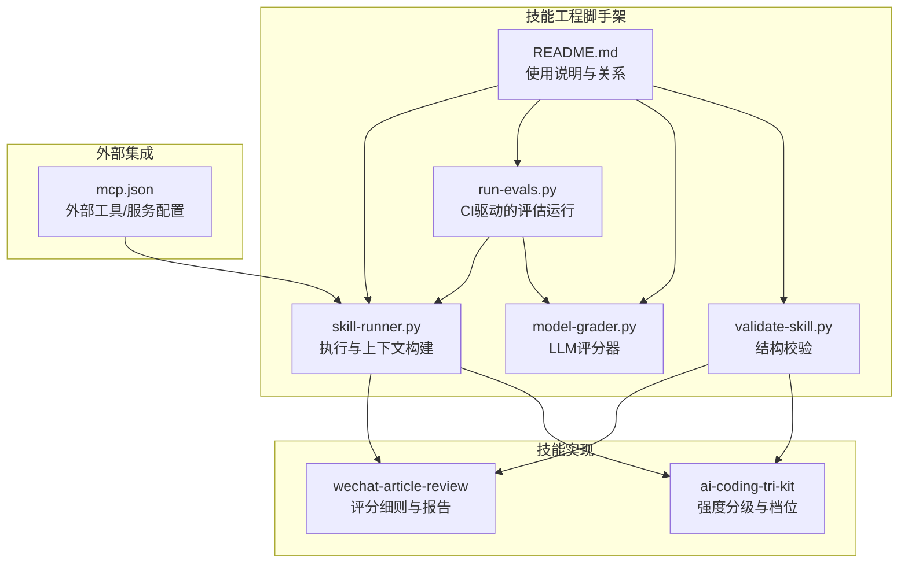
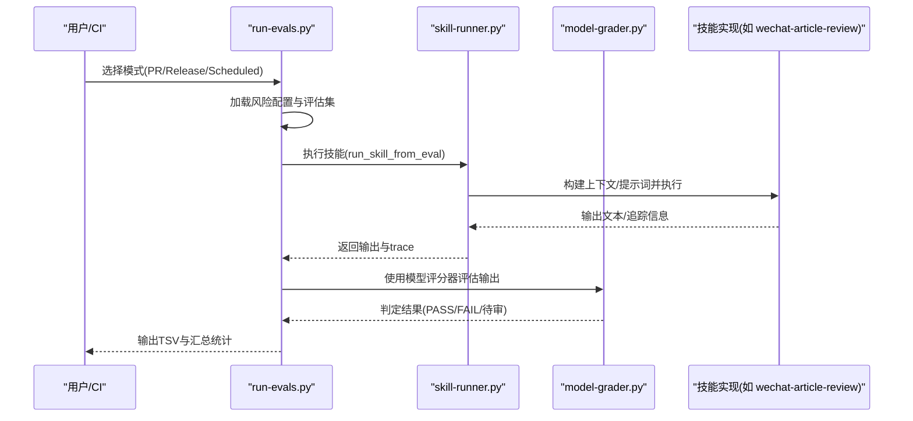
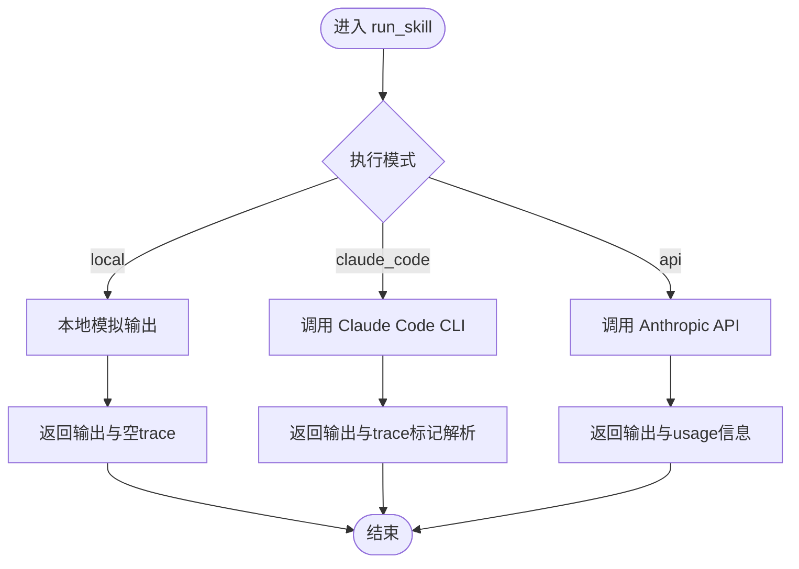
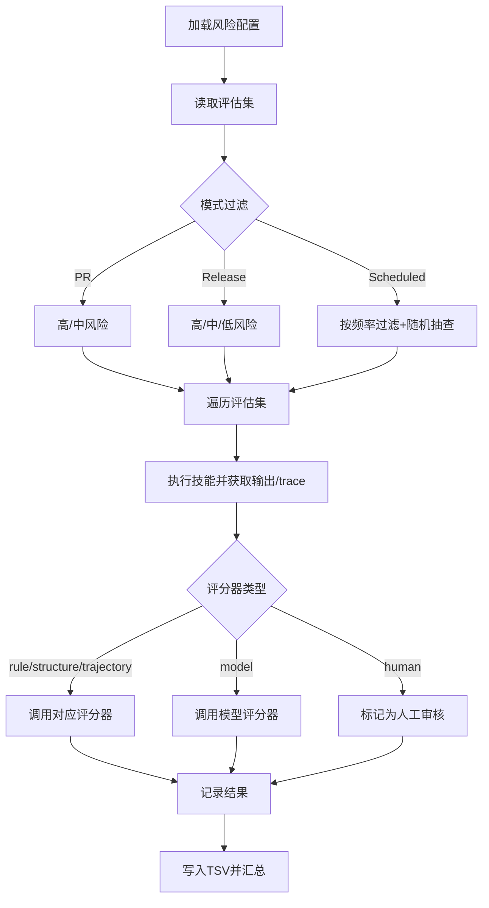
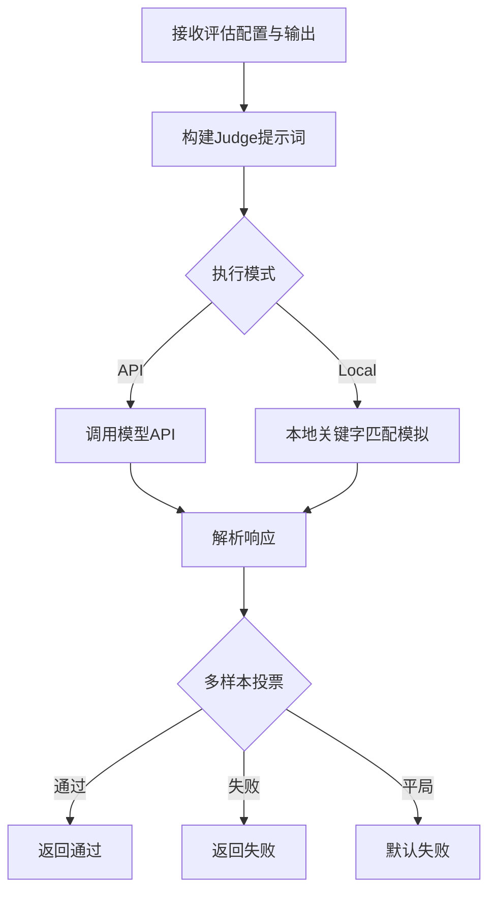
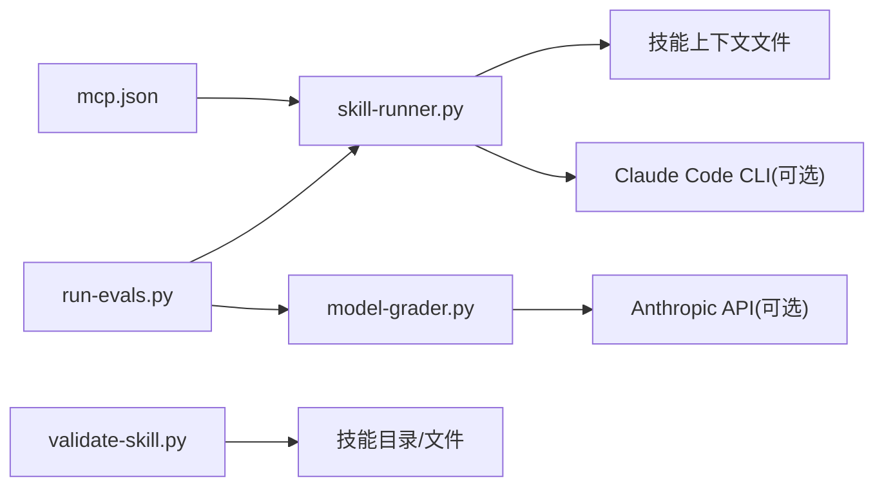

# 技能排名与展示

<cite>
**本文引用的文件**   
- [skill-runner.py](file://plugins/frontend-team-toolkit/skill-engineering/scripts/skill_runner.py)
- [run-evals.py](file://plugins/frontend-team-toolkit/skill-engineering/scripts/run_evals.py)
- [model-grader.py](file://plugins/frontend-team-toolkit/skill-engineering/scripts/graders/model_grader.py)
- [validate-skill.py](file://plugins/frontend-team-toolkit/skill-engineering/bin/validate-skill.py)
- [README.md](file://plugins/frontend-team-toolkit/skill-engineering/README.md)
- [scoring-rubric.md](file://plugins/frontend-team-toolkit/skills/wechat-article-review/references/scoring-rubric.md)
- [intensity-tiers.md](file://plugins/frontend-team-toolkit/skills/ai-coding-tri-kit/references/intensity-tiers.md)
- [mcp.json](file://plugins/frontend-team-toolkit/mcp.json)
</cite>

## 目录
1. [引言](#引言)
2. [项目结构](#项目结构)
3. [核心组件](#核心组件)
4. [架构总览](#架构总览)
5. [详细组件分析](#详细组件分析)
6. [依赖分析](#依赖分析)
7. [性能考虑](#性能考虑)
8. [故障排查指南](#故障排查指南)
9. [结论](#结论)
10. [附录](#附录)

## 引言
本文件围绕“技能排名与展示系统”的目标，结合仓库中现有的技能工程、评估与评分体系，系统化梳理从“评分计算”“排行榜实现”“展示设计”“动态更新”“个性化定制”到“API 与配置”的完整方案。尽管仓库未直接提供前端展示组件与后端排行榜服务代码，但通过现有脚本与评分规则，可以构建一套可落地的“技能评分—排序—展示—更新”的闭环。

## 项目结构
仓库采用“技能工程脚手架 + 多技能实现 + 评估与评分工具”的组织方式：
- 技能工程脚手架：提供模板、校验、动态编排与 CI 集成能力
- 多技能实现：每个技能以独立目录承载其工作流、契约、评估与评分规则
- 评估与评分工具：提供规则、结构、轨迹与模型评分器，支撑自动化与半自动化评估

图表来源
- [skill-runner.py:1-378](file://plugins/frontend-team-toolkit/skill-engineering/scripts/skill_runner.py#L1-L378)
- [run-evals.py:1-227](file://plugins/frontend-team-toolkit/skill-engineering/scripts/run_evals.py#L1-L227)
- [model-grader.py:1-273](file://plugins/frontend-team-toolkit/skill-engineering/scripts/graders/model_grader.py#L1-L273)
- [validate-skill.py:1-193](file://plugins/frontend-team-toolkit/skill-engineering/bin/validate-skill.py#L1-L193)
- [README.md:1-137](file://plugins/frontend-team-toolkit/skill-engineering/README.md#L1-L137)
- [scoring-rubric.md:1-40](file://plugins/frontend-team-toolkit/skills/wechat-article-review/references/scoring-rubric.md#L1-L40)
- [intensity-tiers.md:1-39](file://plugins/frontend-team-toolkit/skills/ai-coding-tri-kit/references/intensity-tiers.md#L1-L39)
- [mcp.json:1-25](file://plugins/frontend-team-toolkit/mcp.json#L1-L25)

章节来源
- [README.md:1-137](file://plugins/frontend-team-toolkit/skill-engineering/README.md#L1-L137)

## 核心组件
- 技能执行器：负责加载技能上下文、构建提示词、执行本地/CLI/API 模式，并返回输出与追踪信息
- 评估运行器：按 CI 模式加载评估集，过滤风险等级，调用评分器，汇总结果并输出
- 评分器：提供规则、结构、轨迹与模型评分器，支持本地模拟与 API 判决
- 结构校验器：确保技能目录结构与元数据符合规范
- 评分细则：为特定技能提供维度权重与阈值，用于量化评分与展示

章节来源
- [skill-runner.py:308-357](file://plugins/frontend-team-toolkit/skill-engineering/scripts/skill_runner.py#L308-L357)
- [run-evals.py:135-174](file://plugins/frontend-team-toolkit/skill-engineering/scripts/run_evals.py#L135-L174)
- [model-grader.py:184-227](file://plugins/frontend-team-toolkit/skill-engineering/scripts/graders/model_grader.py#L184-L227)
- [validate-skill.py:83-167](file://plugins/frontend-team-toolkit/skill-engineering/bin/validate-skill.py#L83-L167)
- [scoring-rubric.md:1-40](file://plugins/frontend-team-toolkit/skills/wechat-article-review/references/scoring-rubric.md#L1-L40)

## 架构总览
下图展示了从“用户/CI 触发”到“技能执行—评估—评分—结果输出”的端到端流程：

图表来源
- [run-evals.py:135-174](file://plugins/frontend-team-toolkit/skill-engineering/scripts/run_evals.py#L135-L174)
- [skill-runner.py:328-357](file://plugins/frontend-team-toolkit/skill-engineering/scripts/skill_runner.py#L328-L357)
- [model-grader.py:184-227](file://plugins/frontend-team-toolkit/skill-engineering/scripts/graders/model_grader.py#L184-L227)

## 详细组件分析

### 技能执行器（skill-runner）
职责与特性
- 加载 SKILL.md 前言元数据与上下文文件（输出契约、评分细则等）
- 支持三种执行模式：本地模拟、Claude Code CLI、Anthropic API
- 生成 agent_trace（工具、动作、时间戳、Token 消耗等）

关键流程
- 前言解析：提取 name/description/disable-model-invocation 等
- 上下文拼装：将 SKILL.md、输出契约、评分细则拼接为上下文
- 执行策略：根据环境变量选择模式，API 模式下可直接调用模型
- 输出与追踪：返回文本输出与工具调用轨迹

图表来源
- [skill-runner.py:308-357](file://plugins/frontend-team-toolkit/skill-engineering/scripts/skill_runner.py#L308-L357)
- [skill-runner.py:260-306](file://plugins/frontend-team-toolkit/skill-engineering/scripts/skill_runner.py#L260-L306)
- [skill-runner.py:199-258](file://plugins/frontend-team-toolkit/skill-engineering/scripts/skill_runner.py#L199-L258)

章节来源
- [skill-runner.py:31-81](file://plugins/frontend-team-toolkit/skill-engineering/scripts/skill_runner.py#L31-L81)
- [skill-runner.py:308-357](file://plugins/frontend-team-toolkit/skill-engineering/scripts/skill_runner.py#L308-L357)

### 评估运行器（run-evals）
职责与特性
- 按 CI 模式加载风险层配置，过滤评估集
- 支持复合评分器组合（rule+structure+trajectory+model+human）
- 生成 TSV 结果与汇总统计

关键流程
- 风险配置加载：PR/Release/Scheduled 模式分别定义风险过滤与阻断策略
- 评估执行：遍历评估集，调用技能执行器获取输出与 trace
- 评分器选择：根据评估配置选择规则/结构/轨迹/模型/人工评分器
- 结果汇总：写入 TSV 并打印表格与统计

图表来源
- [run-evals.py:38-59](file://plugins/frontend-team-toolkit/skill-engineering/scripts/run_evals.py#L38-L59)
- [run-evals.py:135-174](file://plugins/frontend-team-toolkit/skill-engineering/scripts/run_evals.py#L135-L174)
- [run-evals.py:84-133](file://plugins/frontend-team-toolkit/skill-engineering/scripts/run_evals.py#L84-L133)

章节来源
- [run-evals.py:38-82](file://plugins/frontend-team-toolkit/skill-engineering/scripts/run_evals.py#L38-L82)
- [run-evals.py:135-174](file://plugins/frontend-team-toolkit/skill-engineering/scripts/run_evals.py#L135-L174)

### 模型评分器（model-grader）
职责与特性
- 构建 LLM Judge 提示词，逐条比对 expected/must_not
- 支持本地模拟与 API 判决，可配置采样投票
- 解析 LLM 响应并输出最终判定

关键流程
- 提示词构建：抽取 expected/must_not，拼装判定格式
- 执行模式：API 模式调用模型；本地模式基于关键字匹配模拟
- 多样本投票：可配置采样次数，多数通过则通过
- 结果解析：识别 PASS/FAIL 并返回原因

图表来源
- [model-grader.py:28-69](file://plugins/frontend-team-toolkit/skill-engineering/scripts/graders/model_grader.py#L28-L69)
- [model-grader.py:184-227](file://plugins/frontend-team-toolkit/skill-engineering/scripts/graders/model_grader.py#L184-L227)

章节来源
- [model-grader.py:184-227](file://plugins/frontend-team-toolkit/skill-engineering/scripts/graders/model_grader.py#L184-L227)

### 结构校验器（validate-skill）
职责与特性
- 校验技能目录结构与必需/推荐文件
- 校验 SKILL.md 前言元数据格式与长度
- 校验评估与测试用例 JSON 结构

关键流程
- 目录与文件校验：必需/推荐文件是否存在
- 前言解析：限定键集合、长度与内容约束
- JSON 校验：evals/test-prompts 的结构与字段完整性

章节来源
- [validate-skill.py:83-167](file://plugins/frontend-team-toolkit/skill-engineering/bin/validate-skill.py#L83-L167)

### 评分细则（wechat-article-review）
职责与特性
- 提供维度权重与阈值，形成可量化的评分体系
- 用于指导技能输出结构与质量要求

维度与权重（示例）
- 主题与价值：25%
- 结构与逻辑：20%
- 干货密度：25%
- 可读性与表达：20%
- 标题与 CTA：10%

阈值
- ≥9.0：通过
- 8.5–8.9：接近未达标，针对性修改
- <8.5：明显问题，重写或大幅修改

章节来源
- [scoring-rubric.md:1-40](file://plugins/frontend-team-toolkit/skills/wechat-article-review/references/scoring-rubric.md#L1-L40)

### 强度分级（ai-coding-tri-kit）
职责与特性
- 基于变更规模与风险，提供 Full/Standard/Lite 三档强度
- 为技能执行提供“档位”维度，可用于展示与排序的权重因子

章节来源
- [intensity-tiers.md:1-39](file://plugins/frontend-team-toolkit/skills/ai-coding-tri-kit/references/intensity-tiers.md#L1-L39)

### 外部集成（mcp.json）
职责与特性
- 配置外部 MCP 服务器/工具，便于技能在 Cursor 环境中调用
- 为技能展示与更新提供外部数据/工具接入点

章节来源
- [mcp.json:1-25](file://plugins/frontend-team-toolkit/mcp.json#L1-L25)

## 依赖分析
- 组件耦合
  - run-evals 依赖 skill-runner 与各评分器
  - skill-runner 依赖技能上下文文件（SKILL.md、输出契约、评分细则）
  - model-grader 依赖 LLM API（可选），支持本地模拟
  - validate-skill 为技能目录与文件提供前置校验
- 外部依赖
  - anthropic SDK（API 模式）
  - Claude Code CLI（CLI 模式）
  - MCP 服务器（外部工具集成）

图表来源
- [run-evals.py:25-35](file://plugins/frontend-team-toolkit/skill-engineering/scripts/run_evals.py#L25-L35)
- [skill-runner.py:25-29](file://plugins/frontend-team-toolkit/skill-engineering/scripts/skill_runner.py#L25-L29)
- [model-grader.py:21-26](file://plugins/frontend-team-toolkit/skill-engineering/scripts/graders/model_grader.py#L21-L26)
- [validate-skill.py:26-40](file://plugins/frontend-team-toolkit/skill-engineering/bin/validate-skill.py#L26-L40)
- [mcp.json:1-25](file://plugins/frontend-team-toolkit/mcp.json#L1-L25)

章节来源
- [run-evals.py:25-35](file://plugins/frontend-team-toolkit/skill-engineering/scripts/run_evals.py#L25-L35)
- [skill-runner.py:25-29](file://plugins/frontend-team-toolkit/skill-engineering/scripts/skill_runner.py#L25-L29)
- [model-grader.py:21-26](file://plugins/frontend-team-toolkit/skill-engineering/scripts/graders/model_grader.py#L21-L26)
- [validate-skill.py:26-40](file://plugins/frontend-team-toolkit/skill-engineering/bin/validate-skill.py#L26-L40)
- [mcp.json:1-25](file://plugins/frontend-team-toolkit/mcp.json#L1-L25)

## 性能考虑
- 评估批处理与过滤
  - PR/Release/Scheduled 模式按风险层配置过滤评估集，减少不必要的执行
  - Scheduled 模式支持随机抽查，平衡覆盖率与成本
- 执行模式选择
  - 本地模式适合快速验证与调试，避免外部依赖
  - API 模式适合高质量输出，但需关注 Token 成本与延迟
  - CLI 模式适合与 Cursor 集成，需关注超时与可用性
- 评分器采样
  - 模型评分器支持多样本投票，提升稳定性但增加成本
- 缓存与追踪
  - agent_trace 记录工具调用与 Token 消耗，便于性能分析与优化

## 故障排查指南
- 执行模式问题
  - API 模式缺少密钥：回退至本地模式并输出警告
  - CLI 模式未安装或路径错误：回退至本地模式并输出警告
- 评估失败
  - expected/must_not 不满足：检查输出内容与评分器提示词
  - 人工评分器：等待人工审核
- 结构校验失败
  - 缺少必需文件或前言格式不合法：根据错误提示补齐
- 外部工具不可用
  - MCP 服务器未启动或认证失败：检查配置与网络

章节来源
- [skill-runner.py:205-207](file://plugins/frontend-team-toolkit/skill-engineering/scripts/skill_runner.py#L205-L207)
- [skill-runner.py:298-305](file://plugins/frontend-team-toolkit/skill-engineering/scripts/skill_runner.py#L298-L305)
- [model-grader.py:73-94](file://plugins/frontend-team-toolkit/skill-engineering/scripts/graders/model_grader.py#L73-L94)
- [validate-skill.py:83-167](file://plugins/frontend-team-toolkit/skill-engineering/bin/validate-skill.py#L83-L167)
- [mcp.json:1-25](file://plugins/frontend-team-toolkit/mcp.json#L1-L25)

## 结论
本仓库提供了完善的“技能工程—评估—评分—校验—CI 集成”基础设施，能够支撑“技能评分—排序—展示—更新”的闭环。通过评分细则与强度分级，可将抽象的质量指标转化为可量化的评分；通过评估运行器与评分器，可实现自动化与半自动化的质量门禁；通过结构校验与 CI 模式，可保障技能质量与一致性。在此基础上，可进一步扩展前端展示组件与后端排行榜服务，实现“分类排行、综合排行、热门排行”等多维度展示与个性化定制。

## 附录

### 技能评分与展示设计要点
- 评分计算公式（示例）
  - 综合得分 = Σ(维度得分 × 权重)
  - 示例维度：主题与价值(25%)、结构与逻辑(20%)、干货密度(25%)、可读性与表达(20%)、标题与 CTA(10%)
- 权重分配
  - 可根据技能类型与业务目标调整权重，如“效率型”技能可提高“结构与逻辑”权重
- 时间衰减因子
  - 可引入时间衰减系数，使近期表现对排名权重更高
- 排行榜维度
  - 分类排行：按技能类别/强度档位分组排序
  - 综合排行：按综合得分排序
  - 热门排行：按访问量/使用频次加权排序
- 展示设计
  - 卡片布局：包含技能名称、评分、状态徽标、简介与操作按钮
  - 图标系统：使用状态/强度/风险等图标增强可读性
  - 状态标识：通过颜色与标签区分“通过/接近未达标/未达标”
- 动态更新机制
  - 实时排名：基于增量评估与缓存更新策略，定时刷新
  - 数据刷新：按 CI 模式与频率策略触发
  - 缓存管理：LRU/失效策略，避免过期数据影响展示
- 个性化定制
  - 用户偏好：允许用户选择关注的类别/强度档位
  - 历史行为：基于用户历史评分与交互记录调整排序权重
- API 与配置
  - 接口：获取技能列表、评分详情、排行榜、用户偏好
  - 配置：权重、时间衰减、刷新频率、缓存策略、个性化开关