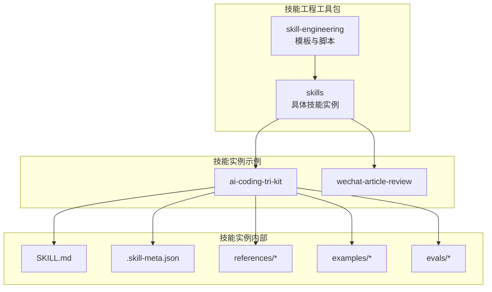
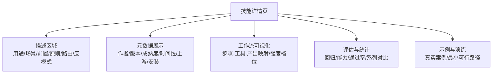
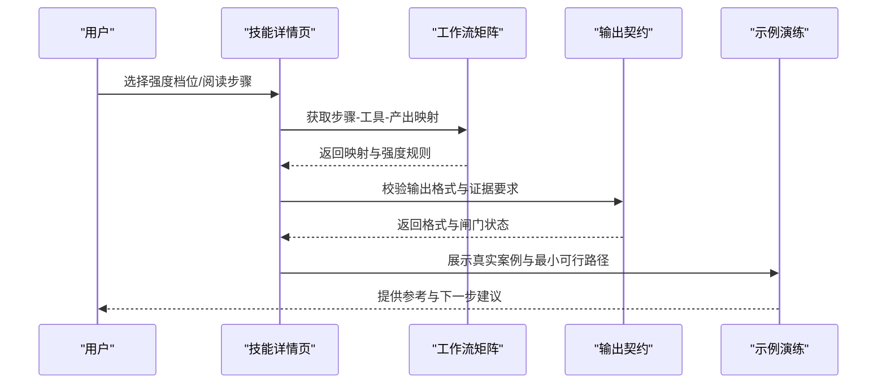
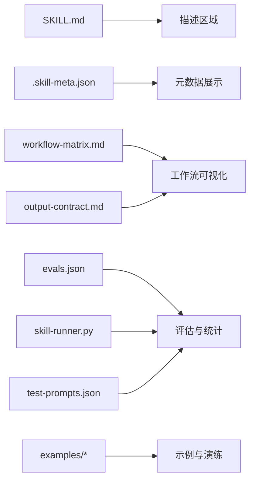
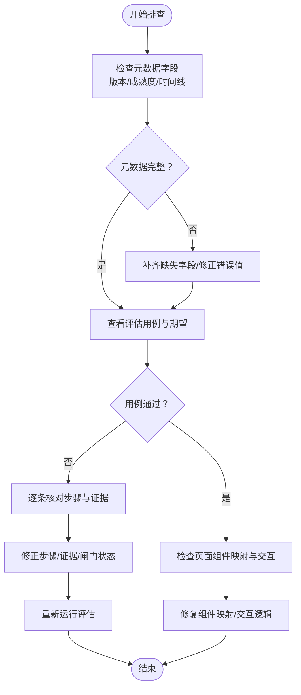

# 技能页面设计

<cite>
**本文引用的文件**
- [SKILL.md](file://plugins/frontend-team-toolkit/skills/ai-coding-tri-kit/SKILL.md)
- [.skill-meta.json](file://plugins/frontend-team-toolkit/skills/ai-coding-tri-kit/.skill-meta.json)
- [workflow-matrix.md](file://plugins/frontend-team-toolkit/skills/ai-coding-tri-kit/references/workflow-matrix.md)
- [output-contract.md](file://plugins/frontend-team-toolkit/skills/ai-coding-tri-kit/references/output-contract.md)
- [evals.json](file://plugins/frontend-team-toolkit/skills/ai-coding-tri-kit/evals/evals.json)
- [test-prompts.json](file://plugins/frontend-team-toolkit/skills/ai-coding-tri-kit/test-prompts.json)
- [feat-dashboard-csv-export-walkthrough.md](file://plugins/frontend-team-toolkit/skills/ai-coding-tri-kit/examples/feat-dashboard-csv-export-walkthrough.md)
- [skill-runner.py](file://plugins/frontend-team-toolkit/skill-engineering/scripts/skill_runner.py)
- [skill-meta.schema.json](file://plugins/frontend-team-toolkit/skill-engineering/schemas/skill-meta.schema.json)
- [serial-workflow.js](file://plugins/frontend-team-toolkit/skill-engineering/templates/new-skill/workflows/serial-workflow.js)
- [wechat-article-review .skill-meta.json](file://plugins/frontend-team-toolkit/skills/wechat-article-review/.skill-meta.json)
</cite>

## 目录
1. [引言](#引言)
2. [项目结构](#项目结构)
3. [核心组件](#核心组件)
4. [架构总览](#架构总览)
5. [详细组件分析](#详细组件分析)
6. [依赖关系分析](#依赖关系分析)
7. [性能考量](#性能考量)
8. [故障排查指南](#故障排查指南)
9. [结论](#结论)
10. [附录](#附录)

## 引言
本文件面向“技能页面设计”，围绕技能详情页的信息架构与视觉设计原则展开，结合仓库中的技能元数据、工作流矩阵、输出契约、评估体系与示例文档，系统阐述技能描述区域的布局设计、元数据展示机制、工作流可视化组件、响应式与移动端适配策略，并提供UI组件使用示例与样式定制指南，以及无障碍与国际化设计建议。

## 项目结构
该仓库以“技能工程工具包”为核心，包含技能模板、工作流脚本、评估与元数据Schema等。技能详情页的设计素材主要来源于各技能目录下的SKILL.md、.skill-meta.json、references与examples等文件。

图表来源
- [SKILL.md](file://plugins/frontend-team-toolkit/skills/ai-coding-tri-kit/SKILL.md)
- [.skill-meta.json](file://plugins/frontend-team-toolkit/skills/ai-coding-tri-kit/.skill-meta.json)
- [workflow-matrix.md](file://plugins/frontend-team-toolkit/skills/ai-coding-tri-kit/references/workflow-matrix.md)
- [output-contract.md](file://plugins/frontend-team-toolkit/skills/ai-coding-tri-kit/references/output-contract.md)
- [evals.json](file://plugins/frontend-team-toolkit/skills/ai-coding-tri-kit/evals/evals.json)
- [test-prompts.json](file://plugins/frontend-team-toolkit/skills/ai-coding-tri-kit/test-prompts.json)
- [feat-dashboard-csv-export-walkthrough.md](file://plugins/frontend-team-toolkit/skills/ai-coding-tri-kit/examples/feat-dashboard-csv-export-walkthrough.md)
- [skill-runner.py](file://plugins/frontend-team-toolkit/skill-engineering/scripts/skill-runner.py)
- [skill-meta.schema.json](file://plugins/frontend-team-toolkit/skill-engineering/schemas/skill-meta.schema.json)
- [serial-workflow.js](file://plugins/frontend-team-toolkit/skill-engineering/templates/new-skill/workflows/serial-workflow.js)

章节来源
- [SKILL.md](file://plugins/frontend-team-toolkit/skills/ai-coding-tri-kit/SKILL.md)
- [.skill-meta.json](file://plugins/frontend-team-toolkit/skills/ai-coding-tri-kit/.skill-meta.json)

## 核心组件
- 技能描述区：基于SKILL.md的Markdown结构，包含“何时使用/不使用”、“前置条件”、“核心原则”、“8步工作流”、“检查点”、“输出契约”、“路由映射”、“反模式”、“评估与升级”、“捆绑资源”等模块化内容。
- 元数据区：基于.skill-meta.json，包含名称、版本、成熟度、时间戳、基线评估结果、改进记录、工具链、上游链接、安装位置等。
- 工作流矩阵与输出契约：用于指导可视化呈现“步骤-工具-产出”的映射关系与会话交付物格式。
- 评估与测试提示：提供回归与能力评估的用例与期望输出，支撑页面交互与校验。
- 示例与演练：真实案例 walkthrough 展示不同强度档位的落地路径。

章节来源
- [SKILL.md](file://plugins/frontend-team-toolkit/skills/ai-coding-tri-kit/SKILL.md)
- [.skill-meta.json](file://plugins/frontend-team-toolkit/skills/ai-coding-tri-kit/.skill-meta.json)
- [workflow-matrix.md](file://plugins/frontend-team-toolkit/skills/ai-coding-tri-kit/references/workflow-matrix.md)
- [output-contract.md](file://plugins/frontend-team-toolkit/skills/ai-coding-tri-kit/references/output-contract.md)
- [evals.json](file://plugins/frontend-team-toolkit/skills/ai-coding-tri-kit/evals/evals.json)
- [test-prompts.json](file://plugins/frontend-team-toolkit/skills/ai-coding-tri-kit/test-prompts.json)
- [feat-dashboard-csv-export-walkthrough.md](file://plugins/frontend-team-toolkit/skills/ai-coding-tri-kit/examples/feat-dashboard-csv-export-walkthrough.md)

## 架构总览
技能页面的“信息架构”由“描述-元数据-工作流-评估-示例”五大部分构成，页面采用模块化布局，配合可视化组件（流程图、步骤清单、参数配置面板、评分与统计）实现“所见即所得”的工程化工作流展示。

图表来源
- [SKILL.md](file://plugins/frontend-team-toolkit/skills/ai-coding-tri-kit/SKILL.md)
- [.skill-meta.json](file://plugins/frontend-team-toolkit/skills/ai-coding-tri-kit/.skill-meta.json)
- [workflow-matrix.md](file://plugins/frontend-team-toolkit/skills/ai-coding-tri-kit/references/workflow-matrix.md)
- [output-contract.md](file://plugins/frontend-team-toolkit/skills/ai-coding-tri-kit/references/output-contract.md)
- [evals.json](file://plugins/frontend-team-toolkit/skills/ai-coding-tri-kit/evals/evals.json)
- [wechat-article-review .skill-meta.json](file://plugins/frontend-team-toolkit/skills/wechat-article-review/.skill-meta.json)

## 详细组件分析

### 描述区域布局设计
- 信息层级与模块划分
  - 何时使用/何时不使用：明确边界与适用场景，帮助用户快速判断。
  - 前置条件与强度分级：提供“环境检查/外部依赖/强度档位”等可操作清单。
  - 核心原则：强调顺序与质量门槛，形成统一共识。
  - 8步工作流与进度清单：以“步骤清单 + Exit Criteria + 证据摘要”驱动进度可视化。
  - 检查点与反模式：以“闸门/阻塞/最小合规路径”降低风险。
  - 输出契约与路由映射：统一交付物格式与工具分工。
  - 评估与升级、捆绑资源：提供持续改进与扩展路径。
- 视觉设计原则
  - 层次清晰：标题分级、卡片化模块、图标/颜色区分“步骤/工具/产出”。
  - 可操作性：进度清单可勾选，检查点以“闸门状态”可视化。
  - 一致性：路由映射表格与输出契约格式固定，便于对比与复用。
  - 可访问性：标题语义化、列表可键盘导航、颜色对比度满足WCAG。

章节来源
- [SKILL.md](file://plugins/frontend-team-toolkit/skills/ai-coding-tri-kit/SKILL.md)
- [output-contract.md](file://plugins/frontend-team-toolkit/skills/ai-coding-tri-kit/references/output-contract.md)
- [workflow-matrix.md](file://plugins/frontend-team-toolkit/skills/ai-coding-tri-kit/references/workflow-matrix.md)

### 元数据展示机制
- 字段来源与含义
  - 基本信息：名称、版本、成熟度、创建/更新时间。
  - 基线评估：评估运行时间、回归/能力通过率、总通过率、测试提示通过情况、演示验证状态、评分器模式、备注。
  - 改进记录：版本、日期、变更清单、实践可行性前后对比。
  - 工具链：脚手架、评估运行器。
  - 上游与安装：OpenSpec、Superpowers、Agent Skills源、文章索引、安装路径。
- 展示建议
  - 时间轴：创建/更新/评估运行时间形成时间线，突出迭代轨迹。
  - 评分与趋势：通过率折线图或柱状图展示回归/能力趋势。
  - 版本切换：版本下拉框联动“改进记录”与“工具链”变化。
  - 链接化：上游与安装路径点击跳转至对应仓库/路径。

章节来源
- [.skill-meta.json](file://plugins/frontend-team-toolkit/skills/ai-coding-tri-kit/.skill-meta.json)
- [wechat-article-review .skill-meta.json](file://plugins/frontend-team-toolkit/skills/wechat-article-review/.skill-meta.json)

### 工作流可视化展示组件
- 流程图与步骤说明
  - 步骤-工具-产出映射：以“步骤矩阵”为依据，将OpenSpec/Superpowers/Agent Skills的职责与产出可视化。
  - 强度档位：以“Full/Standard/Lite”为维度，标注每步可简化的程度与底线要求。
  - 证据与闸门：在步骤说明中嵌入“Exit Criteria + 证据摘要 + 闸门状态”。
- 参数配置与交互
  - 强度选择器：根据场景选择档位，动态调整步骤清单与最低要求。
  - 工具启用面板：按阶段开关Agent Skills，减少Token消耗并避免冲突。
  - 并行/单线程模式：根据工具能力判断，提供降级策略与合并冲突提示。
- 可视化序列图

图表来源
- [workflow-matrix.md](file://plugins/frontend-team-toolkit/skills/ai-coding-tri-kit/references/workflow-matrix.md)
- [output-contract.md](file://plugins/frontend-team-toolkit/skills/ai-coding-tri-kit/references/output-contract.md)
- [feat-dashboard-csv-export-walkthrough.md](file://plugins/frontend-team-toolkit/skills/ai-coding-tri-kit/examples/feat-dashboard-csv-export-walkthrough.md)

章节来源
- [workflow-matrix.md](file://plugins/frontend-team-toolkit/skills/ai-coding-tri-kit/references/workflow-matrix.md)
- [output-contract.md](file://plugins/frontend-team-toolkit/skills/ai-coding-tri-kit/references/output-contract.md)
- [feat-dashboard-csv-export-walkthrough.md](file://plugins/frontend-team-toolkit/skills/ai-coding-tri-kit/examples/feat-dashboard-csv-export-walkthrough.md)

### 评估与统计展示
- 评估类型与目标
  - 回归评估：验证最小路径与禁用行为，确保不跳过关键步骤。
  - 能力评估：在真实案例中生成制品并通过验证，确保可落地。
- 统计指标
  - 通过率：回归/能力分别统计，支持Series对比与趋势分析。
  - 运行次数：评估运行次数与待完成项，辅助优先级管理。
  - 最近实战：最近一次真实使用与评分状态，作为参考基准。
- 页面呈现建议
  - 仪表盘卡片：显示“总评估数/通过数/通过率/运行中/待完成”。
  - 趋势折线：按时间展示通过率变化。
  - 用例筛选：按“回归/能力/最小路径/真实案例”分类查看。

章节来源
- [evals.json](file://plugins/frontend-team-toolkit/skills/ai-coding-tri-kit/evals/evals.json)
- [wechat-article-review .skill-meta.json](file://plugins/frontend-team-toolkit/skills/wechat-article-review/.skill-meta.json)

### 示例与演练
- 真实案例：以“feat-dashboard-csv-export”为例，展示Standard档位的Step 1–2完整路径与核心Scenario。
- 最小可行路径：Lite档位下跳过某些步骤但仍保留底线（如测试/安全意识）。
- 对比参考：与Full案例对比，帮助用户理解档位差异与取舍。

章节来源
- [feat-dashboard-csv-export-walkthrough.md](file://plugins/frontend-team-toolkit/skills/ai-coding-tri-kit/examples/feat-dashboard-csv-export-walkthrough.md)
- [test-prompts.json](file://plugins/frontend-team-toolkit/skills/ai-coding-tri-kit/test-prompts.json)

### 响应式设计与移动端适配
- 布局策略
  - 卡片化模块：在窄屏下将“描述/元数据/工作流/评估/示例”拆分为独立卡片，保证滚动体验。
  - 步骤清单折叠：默认折叠非当前步骤，仅展开必要模块，减少首屏信息密度。
  - 强度选择器与工具面板：在移动端以底部弹窗或抽屉形式呈现，避免遮挡主要内容。
- 交互优化
  - 键盘可达：步骤清单支持Tab导航与Space勾选。
  - 触控友好：按钮与勾选项尺寸≥44px，间距≥12px。
  - 滚动锚点：点击步骤导航时平滑滚动至对应模块。

[本节为通用设计建议，无需特定文件引用]

### UI组件使用示例与样式定制指南
- 组件清单
  - 步骤清单：支持勾选、禁用、高亮当前步骤；样式定制包括勾选图标、颜色、字体大小。
  - 强度档位切换：下拉/按钮组，选中态与禁用态颜色对比度≥4.5:1。
  - 工具启用面板：多选框+说明气泡，支持按阶段分组。
  - 证据与闸门：以标签/徽标展示“通过/阻塞/待定”，颜色语义明确。
  - 时间轴/评分：折线图/柱状图，支持缩放与数据钻取。
- 样式定制
  - 主题色：以“蓝色系”代表流程，“绿色系”代表通过，“橙色/红色系”代表阻塞/警告。
  - 字体与字号：标题层级≥H2，正文≥16px，代码块≥14px。
  - 间距与留白：模块间留白≥24px，卡片内边距≥16px，行高≥1.5。

[本节为通用设计建议，无需特定文件引用]

### 无障碍与国际化设计
- 无障碍
  - 语义化HTML：使用语义化标题与列表，为步骤清单提供aria-label。
  - 键盘导航：Tab顺序合理，支持Space勾选，焦点可见。
  - 屏幕阅读器：为关键按钮与状态标签提供描述文本。
- 国际化
  - 文本提取：将所有文案抽取至语言包，支持多语言切换。
  - 数字与日期：按地区格式化通过率、时间戳与评估运行时间。
  - RTL支持：布局具备从右到左的语言适配能力。

[本节为通用设计建议，无需特定文件引用]

## 依赖关系分析
- 数据依赖
  - SKILL.md为描述区核心数据源；.skill-meta.json为元数据与评估统计数据源；workflow-matrix.md与output-contract.md为工作流与交付物格式依据；evals.json与test-prompts.json为评估与用例数据。
- 组件耦合
  - 描述区与工作流矩阵强耦合，步骤清单与路由映射保持一致。
  - 元数据与评估统计弱耦合，通过字段映射实现联动更新。
- 外部依赖
  - 评估运行器与脚本（如skill-runner.py）负责执行与追踪，页面通过API获取结果并渲染。

图表来源
- [SKILL.md](file://plugins/frontend-team-toolkit/skills/ai-coding-tri-kit/SKILL.md)
- [.skill-meta.json](file://plugins/frontend-team-toolkit/skills/ai-coding-tri-kit/.skill-meta.json)
- [workflow-matrix.md](file://plugins/frontend-team-toolkit/skills/ai-coding-tri-kit/references/workflow-matrix.md)
- [output-contract.md](file://plugins/frontend-team-toolkit/skills/ai-coding-tri-kit/references/output-contract.md)
- [evals.json](file://plugins/frontend-team-toolkit/skills/ai-coding-tri-kit/evals/evals.json)
- [test-prompts.json](file://plugins/frontend-team-toolkit/skills/ai-coding-tri-kit/test-prompts.json)
- [skill-runner.py](file://plugins/frontend-team-toolkit/skill-engineering/scripts/skill-runner.py)

章节来源
- [SKILL.md](file://plugins/frontend-team-toolkit/skills/ai-coding-tri-kit/SKILL.md)
- [.skill-meta.json](file://plugins/frontend-team-toolkit/skills/ai-coding-tri-kit/.skill-meta.json)
- [workflow-matrix.md](file://plugins/frontend-team-toolkit/skills/ai-coding-tri-kit/references/workflow-matrix.md)
- [output-contract.md](file://plugins/frontend-team-toolkit/skills/ai-coding-tri-kit/references/output-contract.md)
- [evals.json](file://plugins/frontend-team-toolkit/skills/ai-coding-tri-kit/evals/evals.json)
- [test-prompts.json](file://plugins/frontend-team-toolkit/skills/ai-coding-tri-kit/test-prompts.json)
- [skill-runner.py](file://plugins/frontend-team-toolkit/skill-engineering/scripts/skill-runner.py)

## 性能考量
- 渲染性能
  - 模块懒加载：将“示例与演练”与“评估与统计”模块延迟加载，减少首屏渲染压力。
  - 虚拟滚动：当步骤清单或用例较多时，采用虚拟滚动提升滚动流畅度。
- 交互性能
  - 强度切换与工具面板以轻量动画过渡，避免阻塞主线程。
  - 评分图表采用Canvas/WebGL渲染，支持大数据量缩放。
- 数据获取
  - 评估统计通过缓存与增量更新策略，避免频繁请求。

[本节为通用性能建议，无需特定文件引用]

## 故障排查指南
- 常见问题
  - 步骤清单未勾选：检查路由映射与输出契约，确保Exit Criteria与证据满足。
  - 强度档位不匹配：核对“强度×步骤矩阵”，确认是否误用Lite档位。
  - 评估未通过：查看回归/能力用例期望与must_not清单，定位违规行为。
- 排查流程

图表来源
- [evals.json](file://plugins/frontend-team-toolkit/skills/ai-coding-tri-kit/evals/evals.json)
- [output-contract.md](file://plugins/frontend-team-toolkit/skills/ai-coding-tri-kit/references/output-contract.md)
- [workflow-matrix.md](file://plugins/frontend-team-toolkit/skills/ai-coding-tri-kit/references/workflow-matrix.md)

章节来源
- [evals.json](file://plugins/frontend-team-toolkit/skills/ai-coding-tri-kit/evals/evals.json)
- [output-contract.md](file://plugins/frontend-team-toolkit/skills/ai-coding-tri-kit/references/output-contract.md)
- [workflow-matrix.md](file://plugins/frontend-team-toolkit/skills/ai-coding-tri-kit/references/workflow-matrix.md)

## 结论
技能页面设计应以“工程化工作流”为核心，通过“描述-元数据-工作流-评估-示例”五大模块实现信息与交互的闭环。页面需兼顾可操作性与可访问性，配合响应式与移动端适配策略，确保在多终端上提供一致的用户体验。同时，评估与统计数据应与页面组件强关联，形成“所见即所得”的可视化反馈闭环。

## 附录
- Schema参考：技能元数据Schema定义了必需字段与结构，可用于前端表单校验与数据模型约束。
- 工作流模板：提供串行/并行/循环/条件等模板，便于扩展新的技能工作流。

章节来源
- [skill-meta.schema.json](file://plugins/frontend-team-toolkit/skill-engineering/schemas/skill-meta.schema.json)
- [serial-workflow.js](file://plugins/frontend-team-toolkit/skill-engineering/templates/new-skill/workflows/serial-workflow.js)