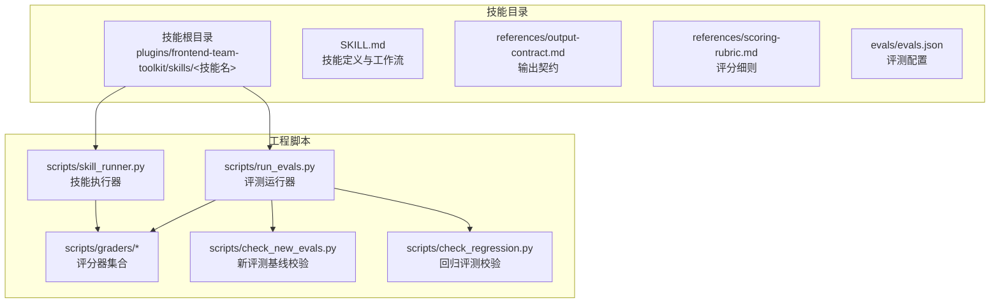
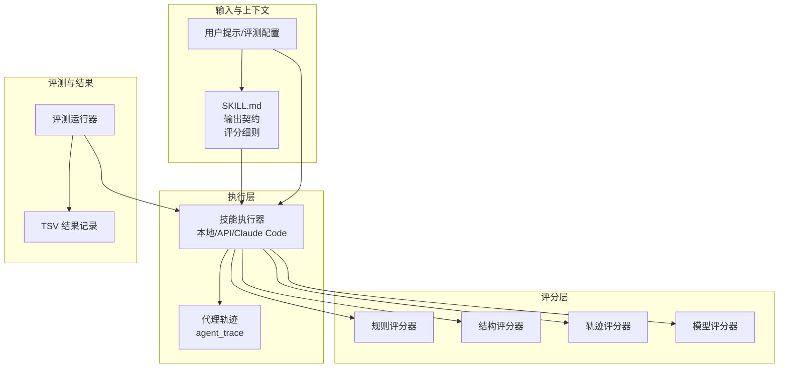
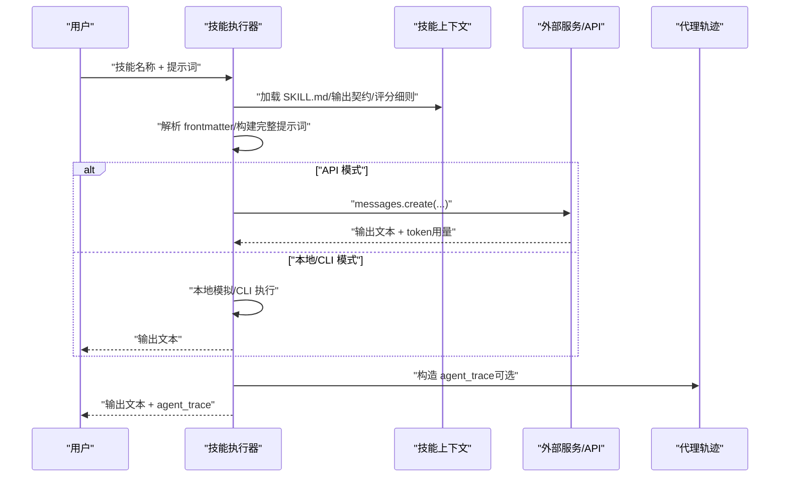
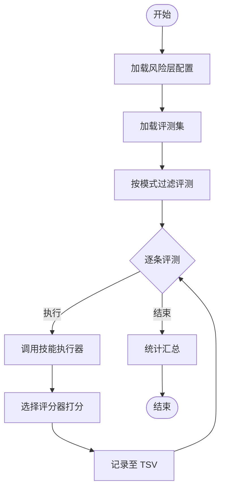
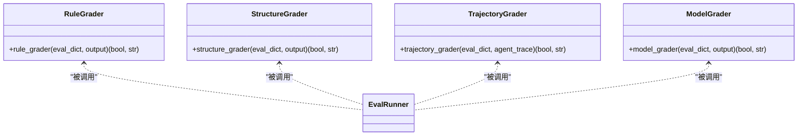
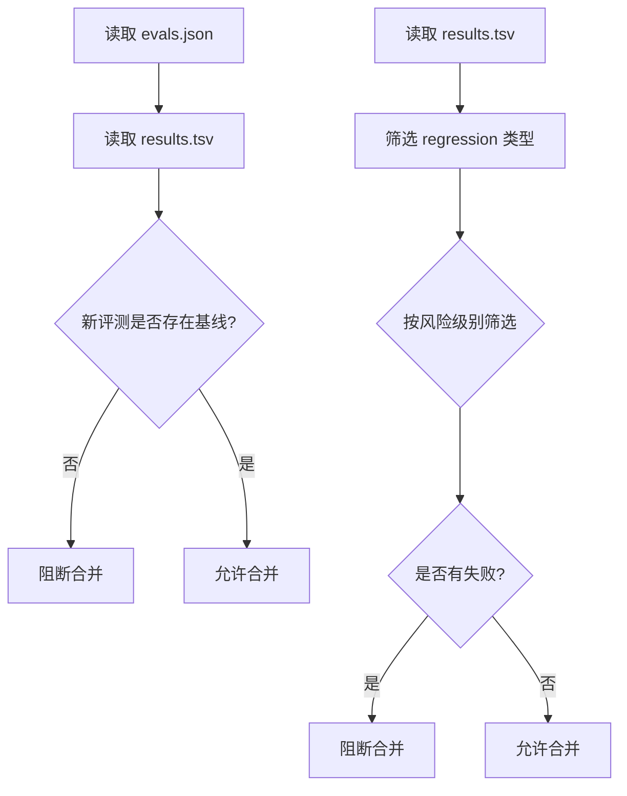
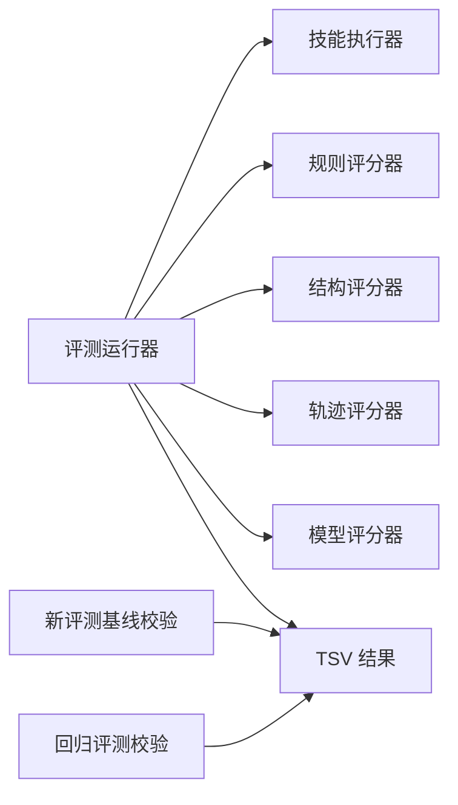

# 推荐引擎

<cite>
**本文引用的文件**   
- [skill_runner.py](file://plugins/frontend-team-toolkit/skill-engineering/scripts/skill_runner.py)
- [run_evals.py](file://plugins/frontend-team-toolkit/skill-engineering/scripts/run_evals.py)
- [check_new_evals.py](file://plugins/frontend-team-toolkit/skill-engineering/scripts/check_new_evals.py)
- [check_regression.py](file://plugins/frontend-team-toolkit/skill-engineering/scripts/check_regression.py)
- [model_grader.py](file://plugins/frontend-team-toolkit/skill-engineering/scripts/graders/model_grader.py)
- [rule_grader.py](file://plugins/frontend-team-toolkit/skill-engineering/scripts/graders/rule_grader.py)
- [structure_grader.py](file://plugins/frontend-team-toolkit/skill-engineering/scripts/graders/structure_grader.py)
- [trajectory_grader.py](file://plugins/frontend-team-toolkit/skill-engineering/scripts/graders/trajectory_grader.py)
- [eval-plan.md](file://plugins/frontend-team-toolkit/skills/skills-quality/eval-plan.md)
- [results.tsv](file://plugins/frontend-team-toolkit/skill-engineering/templates/new-skill/results.tsv)
</cite>

## 目录
1. [引言](#引言)
2. [项目结构](#项目结构)
3. [核心组件](#核心组件)
4. [架构总览](#架构总览)
5. [详细组件分析](#详细组件分析)
6. [依赖分析](#依赖分析)
7. [性能考虑](#性能考虑)
8. [故障排查指南](#故障排查指南)
9. [结论](#结论)
10. [附录](#附录)

## 引言
本文件面向“推荐引擎”的技术文档需求，但当前仓库并未包含传统意义上的推荐系统（如基于内容/协同过滤/混合推荐的实现）。仓库中存在一套“技能工程”能力，用于对“技能”进行自动化执行、评估与回归检测，其流程与推荐系统中的“候选集生成、相似度计算、质量评估、A/B测试”等概念在工程实践层面具有高度可比性。因此，本文将以“技能工程”为参照系，抽象出与推荐系统类似的流程与机制，并以“技能工程”的实现作为技术落地方案，帮助读者理解如何在类似场景中构建“基于内容的推荐”、“协同过滤策略”、“混合推荐系统”、“质量评估与A/B测试”、“实时与离线差异”、“API接口与集成示例”、“性能优化与冷启动/多样性控制”。

## 项目结构
仓库采用“插件化技能工程”组织方式，核心围绕“技能”（Skill）展开，每个技能包含：
- 技能定义与工作流（SKILL.md）
- 输出契约（references/output-contract.md）
- 评分细则（references/scoring-rubric.md）
- 评测配置（evals/evals.json）
- 评测执行与结果记录（scripts/*）

**图表来源**
- [skill_runner.py:1-378](file://plugins/frontend-team-toolkit/skill-engineering/scripts/skill_runner.py#L1-L378)
- [run_evals.py:1-227](file://plugins/frontend-team-toolkit/skill-engineering/scripts/run_evals.py#L1-L227)
- [check_new_evals.py:1-87](file://plugins/frontend-team-toolkit/skill-engineering/scripts/check_new_evals.py#L1-L87)
- [check_regression.py:1-100](file://plugins/frontend-team-toolkit/skill-engineering/scripts/check_regression.py#L1-L100)

**章节来源**
- [skill_runner.py:1-378](file://plugins/frontend-team-toolkit/skill-engineering/scripts/skill_runner.py#L1-L378)
- [run_evals.py:1-227](file://plugins/frontend-team-toolkit/skill-engineering/scripts/run_evals.py#L1-L227)

## 核心组件
- 技能执行器（Skill Runner）
  - 支持本地模拟、Anthropic API、Claude Code 三种执行模式
  - 构建技能上下文（SKILL.md、输出契约、评分细则），拼装完整提示词后执行
  - 返回输出文本与代理轨迹（agent_trace），便于轨迹评分
- 评测运行器（Eval Runner）
  - 基于风险层配置（pr/release/scheduled）筛选评测
  - 调用技能执行器执行评测，选择规则/结构/轨迹/模型评分器进行打分
  - 输出结果记录至 TSV 文件，支持统计汇总
- 评分器集合（Graders）
  - 规则评分器：关键词/路径/禁用词匹配
  - 结构评分器：章节/步骤/frontmatter 格式检查
  - 轨迹评分器：代理/子技能调用顺序与并发策略
  - 模型评分器：LLM 判决，支持多样本投票
- 回归与基线校验
  - 新评测基线校验：确保新评测具备基线记录才允许合并
  - 回归评测校验：阻止失败的回归评测进入主干

**章节来源**
- [skill_runner.py:84-104](file://plugins/frontend-team-toolkit/skill-engineering/scripts/skill_runner.py#L84-L104)
- [skill_runner.py:199-257](file://plugins/frontend-team-toolkit/skill-engineering/scripts/skill_runner.py#L199-L257)
- [skill_runner.py:260-305](file://plugins/frontend-team-toolkit/skill-engineering/scripts/skill_runner.py#L260-L305)
- [run_evals.py:84-174](file://plugins/frontend-team-toolkit/skill-engineering/scripts/run_evals.py#L84-L174)
- [rule_grader.py:41-92](file://plugins/frontend-team-toolkit/skill-engineering/scripts/graders/rule_grader.py#L41-L92)
- [structure_grader.py:63-122](file://plugins/frontend-team-toolkit/skill-engineering/scripts/graders/structure_grader.py#L63-L122)
- [trajectory_grader.py:59-139](file://plugins/frontend-team-toolkit/skill-engineering/scripts/graders/trajectory_grader.py#L59-L139)
- [model_grader.py:184-226](file://plugins/frontend-team-toolkit/skill-engineering/scripts/graders/model_grader.py#L184-L226)
- [check_new_evals.py:45-83](file://plugins/frontend-team-toolkit/skill-engineering/scripts/check_new_evals.py#L45-L83)
- [check_regression.py:57-96](file://plugins/frontend-team-toolkit/skill-engineering/scripts/check_regression.py#L57-L96)

## 架构总览
将“技能工程”映射到“推荐系统”的视角：
- 基于内容的推荐 ≈ 技能工作流与输出契约（内容特征抽取与输出约束）
- 协同过滤 ≈ 代理轨迹与调用序列（用户行为序列与技能关联）
- 混合推荐 ≈ 多评分器组合（规则/结构/轨迹/模型）
- 质量评估与A/B测试 ≈ 评测运行器与TSV结果（指标与对比）
- 实时/离线 ≈ 执行模式切换（API/本地/Claude Code）

**图表来源**
- [skill_runner.py:62-81](file://plugins/frontend-team-toolkit/skill-engineering/scripts/skill_runner.py#L62-L81)
- [skill_runner.py:308-325](file://plugins/frontend-team-toolkit/skill-engineering/scripts/skill_runner.py#L308-L325)
- [run_evals.py:135-174](file://plugins/frontend-team-toolkit/skill-engineering/scripts/run_evals.py#L135-L174)

## 详细组件分析

### 技能执行器（Skill Runner）
- 功能要点
  - 加载 SKILL.md、输出契约、评分细则，构建技能上下文
  - 三种执行模式：本地模拟、Anthropic API、Claude Code CLI
  - 返回输出文本与 agent_trace，便于轨迹评分
- 关键流程
  - 解析 frontmatter，构建完整提示词
  - 选择执行模式并发起调用
  - 解析返回并构造 agent_trace

**图表来源**
- [skill_runner.py:31-59](file://plugins/frontend-team-toolkit/skill-engineering/scripts/skill_runner.py#L31-L59)
- [skill_runner.py:62-81](file://plugins/frontend-team-toolkit/skill-engineering/scripts/skill_runner.py#L62-L81)
- [skill_runner.py:199-257](file://plugins/frontend-team-toolkit/skill-engineering/scripts/skill_runner.py#L199-L257)
- [skill_runner.py:260-305](file://plugins/frontend-team-toolkit/skill-engineering/scripts/skill_runner.py#L260-L305)

**章节来源**
- [skill_runner.py:31-81](file://plugins/frontend-team-toolkit/skill-engineering/scripts/skill_runner.py#L31-L81)
- [skill_runner.py:199-305](file://plugins/frontend-team-toolkit/skill-engineering/scripts/skill_runner.py#L199-L305)

### 评测运行器（Eval Runner）
- 功能要点
  - 基于风险层配置筛选评测（PR/Release/Scheduled）
  - 调用技能执行器执行评测，选择评分器进行打分
  - 输出 TSV 结果，支持统计汇总
- 关键流程
  - 加载风险层配置与评测集
  - 过滤高/中/低风险评测，支持随机抽查
  - 逐条执行评测并记录结果

**图表来源**
- [run_evals.py:38-59](file://plugins/frontend-team-toolkit/skill-engineering/scripts/run_evals.py#L38-L59)
- [run_evals.py:62-68](file://plugins/frontend-team-toolkit/skill-engineering/scripts/run_evals.py#L62-L68)
- [run_evals.py:71-81](file://plugins/frontend-team-toolkit/skill-engineering/scripts/run_evals.py#L71-L81)
- [run_evals.py:135-174](file://plugins/frontend-team-toolkit/skill-engineering/scripts/run_evals.py#L135-L174)

**章节来源**
- [run_evals.py:38-174](file://plugins/frontend-team-toolkit/skill-engineering/scripts/run_evals.py#L38-L174)

### 评分器集合（Graders）
- 规则评分器（Rule Grader）
  - 关键词/路径/章节存在性检查
  - 禁用词/禁止章节检查
- 结构评分器（Structure Grader）
  - 章节/步骤/frontmatter 格式与完整性检查
- 轨迹评分器（Trajectory Grader）
  - 子技能调用顺序、并发策略（串行/并行）检查
- 模型评分器（Model Grader）
  - LLM 判决，支持多样本投票，本地模拟

**图表来源**
- [rule_grader.py:41-92](file://plugins/frontend-team-toolkit/skill-engineering/scripts/graders/rule_grader.py#L41-L92)
- [structure_grader.py:63-122](file://plugins/frontend-team-toolkit/skill-engineering/scripts/graders/structure_grader.py#L63-L122)
- [trajectory_grader.py:59-139](file://plugins/frontend-team-toolkit/skill-engineering/scripts/graders/trajectory_grader.py#L59-L139)
- [model_grader.py:184-226](file://plugins/frontend-team-toolkit/skill-engineering/scripts/graders/model_grader.py#L184-L226)

**章节来源**
- [rule_grader.py:41-92](file://plugins/frontend-team-toolkit/skill-engineering/scripts/graders/rule_grader.py#L41-L92)
- [structure_grader.py:63-122](file://plugins/frontend-team-toolkit/skill-engineering/scripts/graders/structure_grader.py#L63-L122)
- [trajectory_grader.py:59-139](file://plugins/frontend-team-toolkit/skill-engineering/scripts/graders/trajectory_grader.py#L59-L139)
- [model_grader.py:184-226](file://plugins/frontend-team-toolkit/skill-engineering/scripts/graders/model_grader.py#L184-L226)

### 回归与基线校验
- 新评测基线校验
  - 读取现有 TSV 结果，发现未基线的新评测即阻断合并
- 回归评测校验
  - 读取 TSV，按风险级别筛选失败回归评测，决定是否阻断合并

**图表来源**
- [check_new_evals.py:45-83](file://plugins/frontend-team-toolkit/skill-engineering/scripts/check_new_evals.py#L45-L83)
- [check_regression.py:57-96](file://plugins/frontend-team-toolkit/skill-engineering/scripts/check_regression.py#L57-L96)

**章节来源**
- [check_new_evals.py:45-83](file://plugins/frontend-team-toolkit/skill-engineering/scripts/check_new_evals.py#L45-L83)
- [check_regression.py:57-96](file://plugins/frontend-team-toolkit/skill-engineering/scripts/check_regression.py#L57-L96)

### 评测计划与结果记录
- 评测计划（eval-plan.md）
  - 定义基线/抽查/目标评测/回归评测的执行策略与顺序
- 结果记录（results.tsv）
  - 统一字段：eval_id、pass、date、version、eval_mode、severity、reviewer、notes

**章节来源**
- [eval-plan.md:1-45](file://plugins/frontend-team-toolkit/skills/skills-quality/eval-plan.md#L1-L45)
- [results.tsv:1-1](file://plugins/frontend-team-toolkit/skill-engineering/templates/new-skill/results.tsv#L1-L1)

## 依赖分析
- 组件耦合
  - 评测运行器依赖技能执行器与评分器集合
  - 评分器之间相互独立，可组合使用
  - 回归与基线校验脚本独立于执行链路，仅消费 TSV 结果
- 外部依赖
  - Anthropic API（可选）
  - Claude Code CLI（可选）
  - 文件系统（TSV/JSON/Markdown）

**图表来源**
- [run_evals.py:33-35](file://plugins/frontend-team-toolkit/skill-engineering/scripts/run_evals.py#L33-L35)
- [check_new_evals.py:31-42](file://plugins/frontend-team-toolkit/skill-engineering/scripts/check_new_evals.py#L31-L42)
- [check_regression.py:22-34](file://plugins/frontend-team-toolkit/skill-engineering/scripts/check_regression.py#L22-L34)

**章节来源**
- [run_evals.py:33-35](file://plugins/frontend-team-toolkit/skill-engineering/scripts/run_evals.py#L33-L35)
- [check_new_evals.py:31-42](file://plugins/frontend-team-toolkit/skill-engineering/scripts/check_new_evals.py#L31-L42)
- [check_regression.py:22-34](file://plugins/frontend-team-toolkit/skill-engineering/scripts/check_regression.py#L22-L34)

## 性能考虑
- 执行模式选择
  - 本地模式：适合快速验证与离线评测
  - API 模式：适合高质量模型推理，注意 token 成本与延迟
  - Claude Code 模式：适合本地 CLI 场景
- 评分器成本
  - 规则/结构/轨迹评分器为轻量规则匹配，成本低
  - 模型评分器支持多样本投票，提升稳定性但增加成本
- 结果聚合
  - TSV 写入与统计在评测结束后一次性完成，避免重复 IO

[本节为通用性能建议，无需特定文件引用]

## 故障排查指南
- 执行失败
  - 检查执行模式配置（API 密钥、CLI 路径）
  - 查看 agent_trace 中的工具调用与错误信息
- 评测失败
  - 规则/结构/轨迹/模型评分器分别给出失败原因
  - 根据原因调整技能定义、输出契约或提示词
- 回归与基线
  - 新评测未基线：补齐基线记录
  - 回归评测失败：修复问题或回滚

**章节来源**
- [skill_runner.py:252-257](file://plugins/frontend-team-toolkit/skill-engineering/scripts/skill_runner.py#L252-L257)
- [model_grader.py:71-94](file://plugins/frontend-team-toolkit/skill-engineering/scripts/graders/model_grader.py#L71-L94)
- [check_regression.py:82-96](file://plugins/frontend-team-toolkit/skill-engineering/scripts/check_regression.py#L82-L96)

## 结论
本仓库虽未直接实现“推荐引擎”，但其“技能工程”体系提供了与推荐系统高度可比的工程能力：内容特征抽取（SKILL.md/输出契约）、用户行为序列（agent_trace）、评分与质量评估（多评分器）、A/B 与回归管理（TSV 记录）。通过将推荐系统的核心流程映射到该工程框架，可快速构建“基于内容的推荐”、“协同过滤策略”、“混合推荐系统”，并建立完善的“质量评估与A/B测试”闭环。

[本节为总结性内容，无需特定文件引用]

## 附录

### 推荐系统设计映射（概念性）
- 基于内容的推荐
  - 抽取技能特征（工作流、输出契约、评分细则）
  - 计算相似度（规则/结构/轨迹一致性）
  - 生成候选集（符合相似度阈值的技能）
- 协同过滤
  - 用户行为分析（agent_trace 中的调用序列）
  - 技能关联度挖掘（共现矩阵、序列模式）
  - 矩阵分解（潜在因子模型）
- 混合推荐
  - 多评分器融合（规则/结构/轨迹/模型加权）
  - 多算法融合（加权/排序/重排）
- 质量评估与A/B测试
  - 指标：准确率、召回率、覆盖率、多样性、新颖性、时效性
  - A/B：流量切分、指标对比、显著性检验
- 实时/离线
  - 实时：在线评分器、缓存、流式特征
  - 离线：批处理、重排、模型训练与评估
- API 与集成
  - 推荐服务 API：POST /recommend/{userId}、GET /health
  - 集成示例：前端 SDK、埋点上报、灰度发布
- 性能优化
  - 特征工程：稀疏化、降维、缓存
  - 排序优化：近似最近邻、分片索引
  - 渲染优化：预取、懒加载、去重
- 冷启动与多样性
  - 冷启动：热门策略、基于内容的冷启动、专家推荐
  - 多样性：多样性采样、覆盖最大化、去重与重排

[本节为概念性内容，无需特定文件引用]