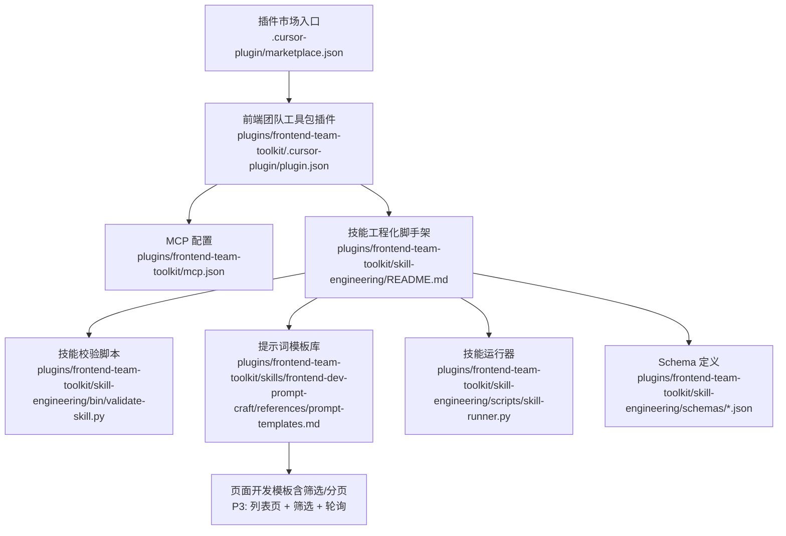
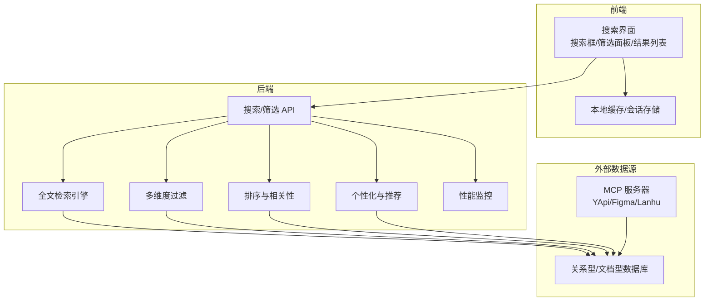
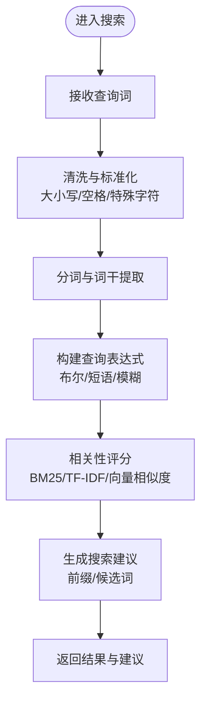
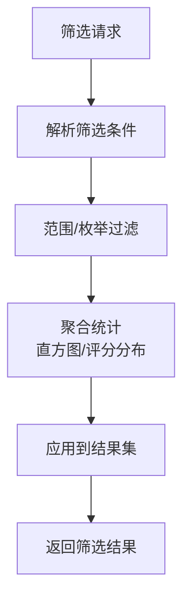
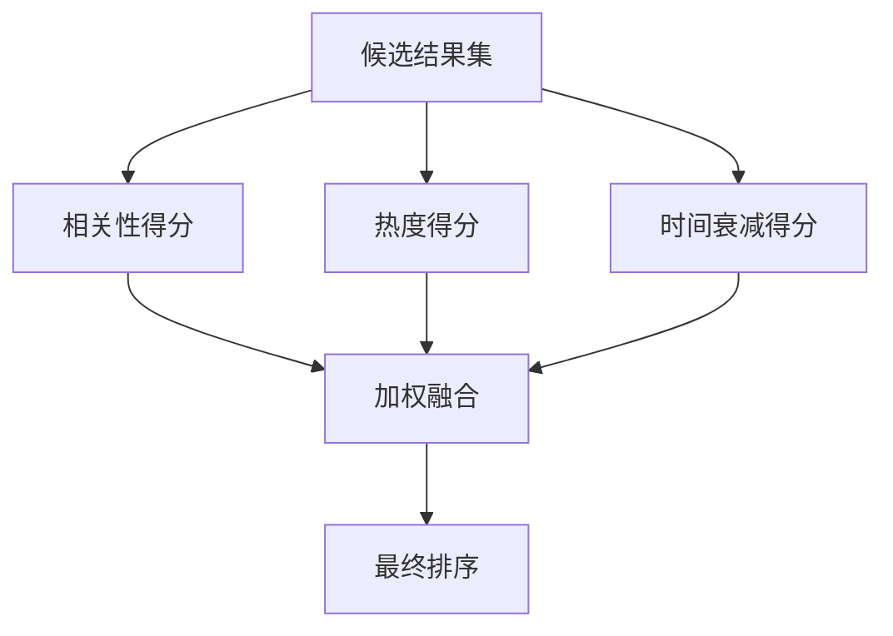
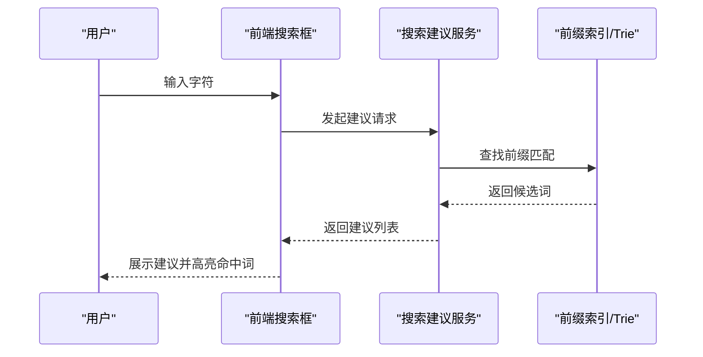
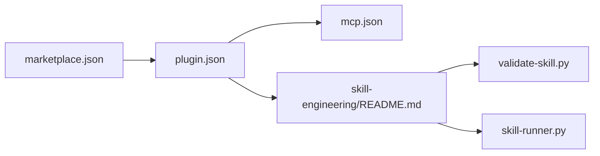

# 搜索与筛选系统

<cite>
**本文引用的文件**
- [marketplace.json](file://.cursor-plugin/marketplace.json)
- [plugin.json](file://plugins/frontend-team-toolkit/.cursor-plugin/plugin.json)
- [mcp.json](file://plugins/frontend-team-toolkit/mcp.json)
- [prompt-templates.md](file://plugins/frontend-team-toolkit/skills/frontend-dev-prompt-craft/references/prompt-templates.md)
- [SKILL.md](file://plugins/frontend-team-toolkit/skills/frontend-dev-prompt-craft/SKILL.md)
- [README.md](file://plugins/frontend-team-toolkit/skill-engineering/README.md)
- [validate-skill.py](file://plugins/frontend-team-toolkit/skill-engineering/bin/validate-skill.py)
- [test-prompts.schema.json](file://plugins/frontend-team-toolkit/skill-engineering/schemas/test-prompts.schema.json)
- [evals.schema.json](file://plugins/frontend-team-toolkit/skill-engineering/schemas/evals.schema.json)
- [workflow.schema.json](file://plugins/frontend-team-toolkit/skill-engineering/schemas/workflow.schema.json)
- [skill-runner.py](file://plugins/frontend-team-toolkit/skill-engineering/scripts/skill_runner.py)
- [reference.md](file://plugins/frontend-team-toolkit/skills/vue2-to-vue3-migration/reference.md)
</cite>

## 目录
1. [简介](#简介)
2. [项目结构](#项目结构)
3. [核心组件](#核心组件)
4. [架构总览](#架构总览)
5. [详细组件分析](#详细组件分析)
6. [依赖分析](#依赖分析)
7. [性能考虑](#性能考虑)
8. [故障排查指南](#故障排查指南)
9. [结论](#结论)
10. [附录](#附录)

## 简介
本文件面向“搜索与筛选系统”的综合文档目标，结合仓库中现有的前端工程化与技能体系能力，给出可落地的实现思路与最佳实践。当前仓库主要聚焦于前端开发工作流、提示词模板与技能工程化，尚未包含完整的后端搜索服务或前端搜索组件源码。因此，本文将以“如何在现有工程基础上构建搜索与筛选系统”为主线，提供从架构到实现、从接口到前端集成、从性能优化到行为分析的完整指导。

## 项目结构
该仓库采用“插件市场 + 工程化脚手架 + 技能模板”的组织方式：
- 插件市场入口与元数据：用于声明插件名称、版本、关键字等，便于在 IDE 中发现与集成。
- 工程化脚手架：提供技能创建、校验、Schema 定义与生命周期管理，支撑搜索与筛选系统的工程化落地。
- 技能模板与提示词：提供“列表页 + 筛选 + 轮询”等页面开发模板，可直接映射到搜索结果页的筛选与分页逻辑。
- MCP 集成：通过 MCP 服务器对接外部能力（如 YApi、Figma、蓝湖），可作为搜索数据源或元数据来源。

图表来源
- [.cursor-plugin/marketplace.json:1-20](file://.cursor-plugin/marketplace.json#L1-L20)
- [plugins/frontend-team-toolkit/.cursor-plugin/plugin.json:1-22](file://plugins/frontend-team-toolkit/.cursor-plugin/plugin.json#L1-L22)
- [plugins/frontend-team-toolkit/mcp.json:1-25](file://plugins/frontend-team-toolkit/mcp.json#L1-L25)
- [plugins/frontend-team-toolkit/skill-engineering/README.md:1-137](file://plugins/frontend-team-toolkit/skill-engineering/README.md#L1-L137)
- [plugins/frontend-team-toolkit/skill-engineering/bin/validate-skill.py:83-96](file://plugins/frontend-team-toolkit/skill-engineering/bin/validate-skill.py#L83-L96)
- [plugins/frontend-team-toolkit/skills/frontend-dev-prompt-craft/references/prompt-templates.md:48-67](file://plugins/frontend-team-toolkit/skills/frontend-dev-prompt-craft/references/prompt-templates.md#L48-L67)
- [plugins/frontend-team-toolkit/skill-engineering/scripts/skill_runner.py:84-104](file://plugins/frontend-team-toolkit/skill-engineering/scripts/skill_runner.py#L84-L104)
- [plugins/frontend-team-toolkit/skill-engineering/schemas/test-prompts.schema.json:1-21](file://plugins/frontend-team-toolkit/skill-engineering/schemas/test-prompts.schema.json#L1-L21)

章节来源
- [.cursor-plugin/marketplace.json:1-20](file://.cursor-plugin/marketplace.json#L1-L20)
- [plugins/frontend-team-toolkit/.cursor-plugin/plugin.json:1-22](file://plugins/frontend-team-toolkit/.cursor-plugin/plugin.json#L1-L22)
- [plugins/frontend-team-toolkit/mcp.json:1-25](file://plugins/frontend-team-toolkit/mcp.json#L1-L25)
- [plugins/frontend-team-toolkit/skill-engineering/README.md:1-137](file://plugins/frontend-team-toolkit/skill-engineering/README.md#L1-L137)

## 核心组件
围绕“搜索与筛选系统”，建议在现有工程基础上拆解为以下核心组件，并结合仓库中的模板与脚手架进行落地：

- 搜索服务层（后端）
  - 全文检索引擎：Elasticsearch/OpenSearch 或基于数据库的全文索引。
  - 关键词匹配：TF-IDF、BM25 或向量相似度（如使用嵌入模型）。
  - 模糊搜索：Levenshtein 距离、编辑距离、通配符匹配。
  - 搜索建议与自动补全：前缀索引、ngram、倒排索引、Autocomplete API。
- 筛选服务层（后端）
  - 多维度过滤：技术栈分类、难度级别、使用频率、评价分数等维度的布尔/范围/枚举过滤。
  - 分页与聚合：分页参数、聚合统计（直方图、词云、评分分布）。
- 排序与相关性（后端/前端）
  - 相关性计算：TF-IDF、BM25、语义相似度。
  - 热度权重：使用频率、收藏数、近期活跃度。
  - 时间衰减：指数/线性衰减函数，控制新鲜度影响。
- 前端搜索界面
  - 搜索框与建议：输入防抖、高亮命中词、历史记录、热门标签。
  - 筛选面板：多选/单选、范围滑条、评分星级、技术栈标签云。
  - 列表渲染：虚拟滚动、懒加载、骨架屏、错误重试。
- 性能优化
  - 索引策略：预分词、同义词、停用词、字段映射。
  - 缓存：Redis/Trie、查询缓存、响应缓存、CDN。
  - 分页与并发：分页游标、并发去重、限流与熔断。
- 行为分析与个性化
  - 行为埋点：点击、曝光、停留、搜索词、筛选偏好。
  - 个性化：协同过滤、内容相似度、冷启动策略、召回与重排。

## 架构总览
下图展示了从前端搜索界面到后端搜索服务、筛选服务与排序服务的整体交互关系，以及与 MCP 数据源的对接。

## 详细组件分析

### 搜索服务层（后端）
- 全文检索与关键词匹配
  - 建议采用倒排索引与 BM25 相关性模型，结合 TF-IDF 与词干提取。
  - 对中文场景，可引入中文分词（如 Jieba）、同义词扩展与停用词表。
- 模糊搜索
  - 使用 Levenshtein 距离或 BK-tree 进行近似匹配。
  - 对高频拼写错误提供候选集，结合历史搜索词与热词表。
- 搜索建议与自动补全
  - 基于前缀索引与 Trie 树实现 O(1) 前缀匹配。
  - 结合 ngram 与编辑距离，提供拼写纠错与联想建议。

### 筛选系统（多维度过滤）
- 技术栈分类：枚举字段，支持单选/多选。
- 难度级别：数值范围或枚举（入门/进阶/专家）。
- 使用频率：数值范围或分位区间。
- 评价分数：星级范围或数值区间。
- 实现要点
  - 使用布尔过滤器组合多个维度，结合聚合统计辅助筛选面板。
  - 对高频筛选项提供缓存与预聚合，降低实时计算成本。

### 排序算法（相关性、热度、时间衰减）
- 相关性：TF-IDF/BM25，结合标题、描述、标签的加权。
- 热度权重：使用次数、收藏数、评论数、分享数。
- 时间衰减：指数/线性函数，控制新鲜度权重随时间下降。
- 组合策略：加权融合或学习排序（Learning to Rank），以 A/B 实验驱动优化。

### 智能搜索建议与自动补全
- 前缀索引与 Trie：O(1) 前缀匹配，适合长尾词与稳定词典。
- Ngram 与编辑距离：提升拼写纠错能力，结合候选词频次。
- 历史与热门：结合用户历史搜索与全站热门词，动态调整候选项权重。

### 搜索性能优化策略
- 索引建立
  - 预分词与同义词：减少实时计算开销。
  - 字段映射与复制字段：针对不同查询场景建立专用字段。
- 缓存机制
  - 查询缓存：热点查询命中率提升。
  - 响应缓存：对稳定结果进行短期缓存。
  - Trie 缓存：热门前缀快速返回。
- 分页加载
  - 游标分页：避免深度分页的性能问题。
  - 虚拟滚动与懒加载：前端侧优化大列表渲染。

### 搜索 API 接口文档（示例）
- GET /api/search
  - 查询参数
    - q: 查询词（字符串）
    - filters: 筛选条件（JSON 字符串，支持技术栈、难度、频率、评分等）
    - sort: 排序字段与方向（字符串）
    - page: 页码（整数）
    - size: 每页大小（整数）
    - suggest: 是否返回建议（布尔）
  - 响应
    - hits: 结果数组
    - total: 总数
    - aggregations: 聚合统计
    - suggestions: 建议词数组

- GET /api/suggest
  - 查询参数
    - q: 前缀（字符串）
    - size: 建议数量（整数）
  - 响应
    - suggestions: 建议词数组

- GET /api/facets
  - 查询参数
    - filters: 当前筛选条件（JSON）
  - 响应
    - facets: 各维度的可选值与统计

### 前端集成示例（基于模板）
- 列表页 + 筛选 + 轮询（模板 P3）
  - 筛选区域：技术栈、难度、评分、使用频率等字段。
  - 列表接口：支持分页与排序。
  - 特殊逻辑：轮询更新状态或刷新结果。
- 开发步骤
  - 使用模板 P3 的结构，将“筛选字段”与“列表接口”替换为搜索与筛选的实际字段。
  - 在搜索框中接入建议接口，实现自动补全。
  - 在筛选面板中实现多选/范围选择，并与后端 filters 参数联动。

章节来源
- [plugins/frontend-team-toolkit/skills/frontend-dev-prompt-craft/references/prompt-templates.md:48-67](file://plugins/frontend-team-toolkit/skills/frontend-dev-prompt-craft/references/prompt-templates.md#L48-L67)
- [plugins/frontend-team-toolkit/skills/frontend-dev-prompt-craft/SKILL.md:31-122](file://plugins/frontend-team-toolkit/skills/frontend-dev-prompt-craft/SKILL.md#L31-L122)

### 行为分析与个性化推荐（基础实现）
- 行为埋点
  - 搜索词、点击、曝光、停留、筛选偏好、收藏/取消收藏。
- 个性化策略
  - 冷启动：热门榜、新晋榜、默认推荐。
  - 协同过滤：基于用户行为的相似用户/物品推荐。
  - 内容相似度：基于标签与描述的余弦相似度。
  - 召回与重排：双阶段策略，召回阶段扩大覆盖面，重排阶段精细化排序。

## 依赖分析
- 插件市场与工具包
  - marketplace.json 与 plugin.json 提供插件元数据与关键字，便于在 IDE 中发现与集成。
- MCP 集成
  - mcp.json 声明了外部 MCP 服务器（如 YApi、Figma、蓝湖），可作为搜索数据源或元数据来源。
- 工程化脚手架
  - README.md 提供快速开始与工作流说明。
  - validate-skill.py 用于校验技能目录结构与必需文件。
  - skill-runner.py 提供技能模拟执行与上下文构建，可借鉴其“上下文构建”思想用于搜索系统的配置与元数据管理。

图表来源
- [.cursor-plugin/marketplace.json:1-20](file://.cursor-plugin/marketplace.json#L1-L20)
- [plugins/frontend-team-toolkit/.cursor-plugin/plugin.json:1-22](file://plugins/frontend-team-toolkit/.cursor-plugin/plugin.json#L1-L22)
- [plugins/frontend-team-toolkit/mcp.json:1-25](file://plugins/frontend-team-toolkit/mcp.json#L1-L25)
- [plugins/frontend-team-toolkit/skill-engineering/README.md:1-137](file://plugins/frontend-team-toolkit/skill-engineering/README.md#L1-L137)
- [plugins/frontend-team-toolkit/skill-engineering/bin/validate-skill.py:83-96](file://plugins/frontend-team-toolkit/skill-engineering/bin/validate-skill.py#L83-L96)
- [plugins/frontend-team-toolkit/skill-engineering/scripts/skill_runner.py:84-104](file://plugins/frontend-team-toolkit/skill-engineering/scripts/skill_runner.py#L84-L104)

章节来源
- [plugins/frontend-team-toolkit/skill-engineering/README.md:1-137](file://plugins/frontend-team-toolkit/skill-engineering/README.md#L1-L137)
- [plugins/frontend-team-toolkit/skill-engineering/bin/validate-skill.py:83-96](file://plugins/frontend-team-toolkit/skill-engineering/bin/validate-skill.py#L83-L96)
- [plugins/frontend-team-toolkit/skill-engineering/scripts/skill_runner.py:84-104](file://plugins/frontend-team-toolkit/skill-engineering/scripts/skill_runner.py#L84-L104)

## 性能考虑
- 索引与查询
  - 预分词与同义词：减少实时计算。
  - 字段映射与复制字段：针对不同查询场景优化。
- 缓存
  - 查询缓存与响应缓存：热点查询与稳定结果。
  - Trie 缓存：热门前缀快速返回。
- 分页与并发
  - 游标分页：避免深度分页。
  - 并发去重与限流：防止重复请求与过载。

## 故障排查指南
- 技能结构校验失败
  - 检查技能目录是否符合要求文件清单，确保必需文件存在且命名规范。
- 提示词模板未生效
  - 确认模板文件路径正确，且与技能工作流匹配。
- MCP 无法连接
  - 检查 mcp.json 中的命令/URL 与环境变量是否正确配置。

章节来源
- [plugins/frontend-team-toolkit/skill-engineering/bin/validate-skill.py:83-96](file://plugins/frontend-team-toolkit/skill-engineering/bin/validate-skill.py#L83-L96)
- [plugins/frontend-team-toolkit/skill-engineering/README.md:1-137](file://plugins/frontend-team-toolkit/skill-engineering/README.md#L1-L137)
- [plugins/frontend-team-toolkit/mcp.json:1-25](file://plugins/frontend-team-toolkit/mcp.json#L1-L25)

## 结论
本仓库提供了构建“搜索与筛选系统”的工程化基础：通过技能模板与脚手架，可快速落地前端搜索界面与筛选逻辑；通过 MCP 集成，可将外部数据源纳入搜索与筛选的数据来源。结合本文提供的搜索算法、筛选机制、排序策略与性能优化建议，可在现有工程上高效实现一套可扩展、可维护、可演进的搜索与筛选系统。

## 附录
- Vue 2 → Vue 3 迁移参考：可作为前端组件迁移与状态管理的参考，有助于在搜索界面中实现复杂筛选与状态同步。
- MCP 配置示例：可作为对接外部数据源的参考，用于搜索结果的数据补充与元数据增强。

章节来源
- [plugins/frontend-team-toolkit/skills/vue2-to-vue3-migration/reference.md:1-134](file://plugins/frontend-team-toolkit/skills/vue2-to-vue3-migration/reference.md#L1-L134)
- [plugins/frontend-team-toolkit/mcp.json:1-25](file://plugins/frontend-team-toolkit/mcp.json#L1-L25)