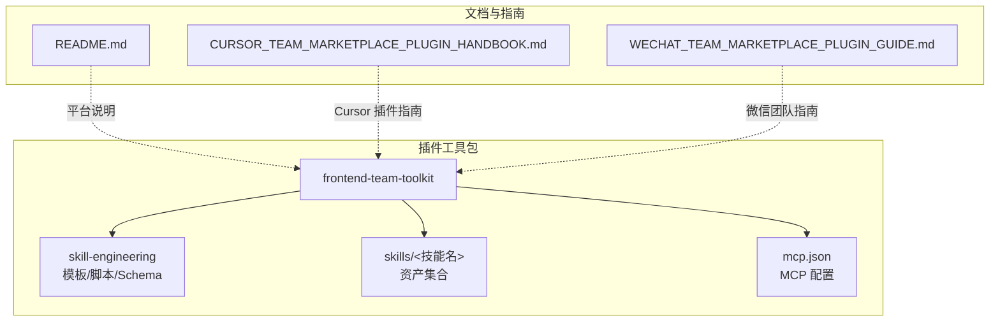
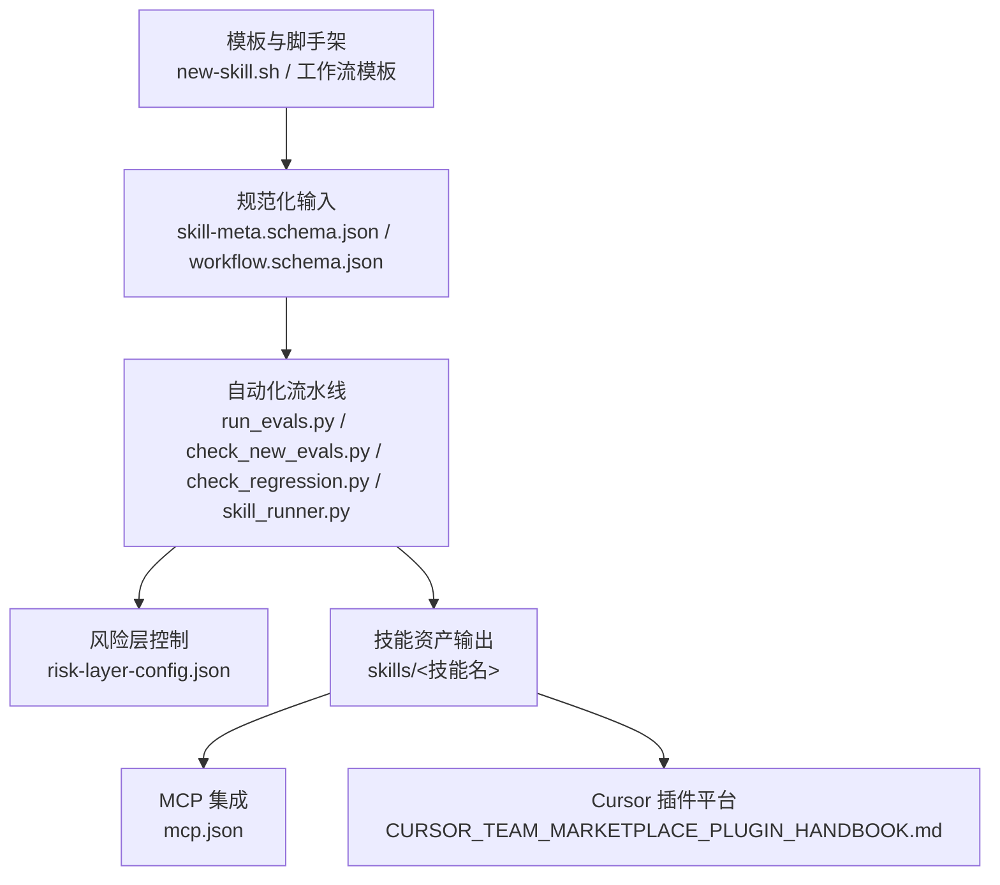
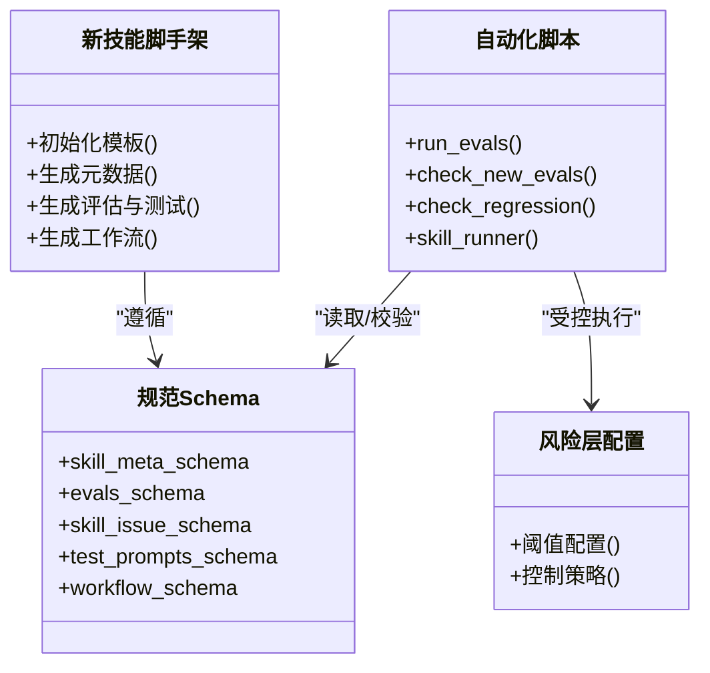
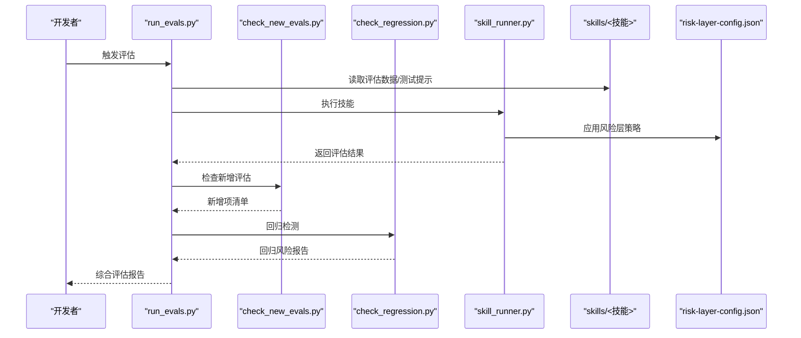
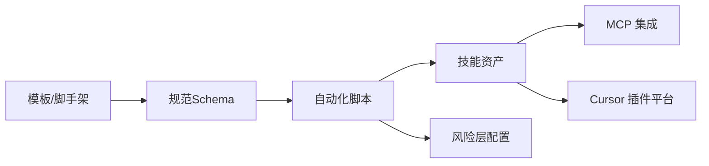

# 技能市场平台

<cite>
**本文引用的文件**
- [README.md](file://README.md)
- [CURSOR_TEAM_MARKETPLACE_PLUGIN_HANDBOOK.md](file://CURSOR_TEAM_MARKETPLACE_PLUGIN_HANDBOOK.md)
- [WECHAT_TEAM_MARKETPLACE_PLUGIN_GUIDE.md](file://WECHAT_TEAM_MARKETPLACE_PLUGIN_GUIDE.md)
- [plugins/frontend-team-toolkit/README.md](file://plugins/frontend-team-toolkit/README.md)
- [plugins/frontend-team-toolkit/mcp.json](file://plugins/frontend-team-toolkit/mcp.json)
- [plugins/frontend-team-toolkit/skill-engineering/README.md](file://plugins/frontend-team-toolkit/skill-engineering/README.md)
- [plugins/frontend-team-toolkit/skill-engineering/docs/lifecycle-quickref.md](file://plugins/frontend-team-toolkit/skill-engineering/docs/lifecycle-quickref.md)
- [plugins/frontend-team-toolkit/skill-engineering/config/risk-layer-config.json](file://plugins/frontend-team-toolkit/skill-engineering/config/risk-layer-config.json)
- [plugins/frontend-team-toolkit/skill-engineering/schemas/skill-meta.schema.json](file://plugins/frontend-team-toolkit/skill-engineering/schemas/skill-meta.schema.json)
- [plugins/frontend-team-toolkit/skill-engineering/schemas/evals.schema.json](file://plugins/frontend-team-toolkit/skill-engineering/schemas/evals.schema.json)
- [plugins/frontend-team-toolkit/skill-engineering/schemas/skill-issue.schema.json](file://plugins/frontend-team-toolkit/skill-engineering/schemas/skill-issue.schema.json)
- [plugins/frontend-team-toolkit/skill-engineering/schemas/test-prompts.schema.json](file://plugins/frontend-team-toolkit/skill-engineering/schemas/test-prompts.schema.json)
- [plugins/frontend-team-toolkit/skill-engineering/schemas/workflow.schema.json](file://plugins/frontend-team-toolkit/skill-engineering/schemas/workflow.schema.json)
- [plugins/frontend-team-toolkit/skill-engineering/scripts/run_evals.py](file://plugins/frontend-team-toolkit/skill-engineering/scripts/run_evals.py)
- [plugins/frontend-team-toolkit/skill-engineering/scripts/check_new_evals.py](file://plugins/frontend-team-toolkit/skill-engineering/scripts/check_new_evals.py)
- [plugins/frontend-team-toolkit/skill-engineering/scripts/check_regression.py](file://plugins/frontend-team-toolkit/skill-engineering/scripts/check_regression.py)
- [plugins/frontend-team-toolkit/skill-engineering/scripts/skill_runner.py](file://plugins/frontend-team-toolkit/skill-engineering/scripts/skill_runner.py)
- [plugins/frontend-team-toolkit/skill-engineering/bin/new-skill.sh](file://plugins/frontend-team-toolkit/skill-engineering/bin/new-skill.sh)
- [plugins/frontend-team-toolkit/skill-engineering/bin/validate-skill.py](file://plugins/frontend-team-toolkit/skill-engineering/bin/validate-skill.py)
- [plugins/frontend-team-toolkit/skill-engineering/templates/new-skill/.skill-meta.json](file://plugins/frontend-team-toolkit/skill-engineering/templates/new-skill/.skill-meta.json)
- [plugins/frontend-team-toolkit/skill-engineering/templates/new-skill/SKILL.md](file://plugins/frontend-team-toolkit/skill-engineering/templates/new-skill/SKILL.md)
- [plugins/frontend-team-toolkit/skill-engineering/templates/new-skill/workflows/README.md](file://plugins/frontend-team-toolkit/skill-engineering/templates/new-skill/workflows/README.md)
- [plugins/frontend-team-toolkit/skill-engineering/templates/new-skill/workflows/serial-workflow.js](file://plugins/frontend-team-toolkit/skill-engineering/templates/new-skill/workflows/serial-workflow.js)
- [plugins/frontend-team-toolkit/skill-engineering/templates/new-skill/workflows/parallel-workflow.js](file://plugins/frontend-team-toolkit/skill-engineering/templates/new-skill/workflows/parallel-workflow.js)
- [plugins/frontend-team-toolkit/skill-engineering/templates/new-skill/workflows/conditional-workflow.js](file://plugins/frontend-team-toolkit/skill-engineering/templates/new-skill/workflows/conditional-workflow.js)
- [plugins/frontend-team-toolkit/skill-engineering/templates/new-skill/workflows/adversarial-workflow.js](file://plugins/frontend-team-toolkit/skill-engineering/templates/new-skill/workflows/adversarial-workflow.js)
- [plugins/frontend-team-toolkit/skill-engineering/templates/new-skill/workflows/loop-workflow.js](file://plugins/frontend-team-toolkit/skill-engineering/templates/new-skill/workflows/loop-workflow.js)
- [plugins/frontend-team-toolkit/skill-engineering/templates/new-skill/workflows/weekly-regression.js](file://plugins/frontend-team-toolkit/skill-engineering/templates/new-skill/workflows/weekly-regression.js)
- [plugins/frontend-team-toolkit/skills/ai-coding-tri-kit/SKILL.md](file://plugins/frontend-team-toolkit/skills/ai-coding-tri-kit/SKILL.md)
- [plugins/frontend-team-toolkit/skills/ai-coding-tri-kit/evals/evals.json](file://plugins/frontend-team-toolkit/skills/ai-coding-tri-kit/evals/evals.json)
- [plugins/frontend-team-toolkit/skills/ai-coding-tri-kit/test-prompts.json](file://plugins/frontend-team-toolkit/skills/ai-coding-tri-kit/test-prompts.json)
- [plugins/frontend-team-toolkit/skills/ai-coding-tri-kit/examples/feat-dashboard-csv-export-walkthrough.md](file://plugins/frontend-team-toolkit/skills/ai-coding-tri-kit/examples/feat-dashboard-csv-export-walkthrough.md)
- [plugins/frontend-team-toolkit/skills/ai-coding-tri-kit/references/environment-check.md](file://plugins/frontend-team-toolkit/skills/ai-coding-tri-kit/references/environment-check.md)
- [plugins/frontend-team-toolkit/skills/ai-coding-tri-kit/references/fallback-scenarios.md](file://plugins/frontend-team-toolkit/skills/ai-coding-tri-kit/references/fallback-scenarios.md)
- [plugins/frontend-team-toolkit/skills/ai-coding-tri-kit/references/gates-and-rollback.md](file://plugins/frontend-team-toolkit/skills/ai-coding-tri-kit/references/gates-and-rollback.md)
- [plugins/frontend-team-toolkit/skills/ai-coding-tri-kit/references/intensity-tiers.md](file://plugins/frontend-team-toolkit/skills/ai-coding-tri-kit/references/intensity-tiers.md)
- [plugins/frontend-team-toolkit/skills/ai-coding-tri-kit/references/output-contract.md](file://plugins/frontend-team-toolkit/skills/ai-coding-tri-kit/references/output-contract.md)
- [plugins/frontend-team-toolkit/skills/ai-coding-tri-kit/references/workflow-matrix.md](file://plugins/frontend-team-toolkit/skills/ai-coding-tri-kit/references/workflow-matrix.md)
- [plugins/frontend-team-toolkit/skills/ai-coding-tri-kit/results.tsv](file://plugins/frontend-team-toolkit/skills/ai-coding-tri-kit/results.tsv)
- [plugins/frontend-team-toolkit/skills/ai-coding-tri-kit/skill-issues.jsonl.example](file://plugins/frontend-team-toolkit/skills/ai-coding-tri-kit/skill-issues.jsonl.example)
- [plugins/frontend-team-toolkit/skills/ai-coding-tri-kit/reviews/2026-05-30-skill-engineering-blueprint-v2.md](file://plugins/frontend-team-toolkit/skills/ai-coding-tri-kit/reviews/2026-05-30-skill-engineering-blueprint-v2.md)
- [plugins/frontend-team-toolkit/skills/ai-coding-tri-kit/reviews/2026-05-30-skill-engineering-blueprint.md](file://plugins/frontend-team-toolkit/skills/ai-coding-tri-kit/reviews/2026-05-30-skill-engineering-blueprint.md)
- [plugins/frontend-team-toolkit/skills/wechat-article-review/evals/evals.json](file://plugins/frontend-team-toolkit/skills/wechat-article-review/evals/evals.json)
- [plugins/frontend-team-toolkit/skills/wechat-article-review/test-prompts.json](file://plugins/frontend-team-toolkit/skills/wechat-article-review/test-prompts.json)
- [plugins/frontend-team-toolkit/skills/wechat-article-review/references/scoring-rubric.md](file://plugins/frontend-team-toolkit/skills/wechat-article-review/references/scoring-rubric.md)
- [plugins/frontend-team-toolkit/skills/wechat-article-review/reviews/2026-05-30-skill-engineering-blueprint-v2.md](file://plugins/frontend-team-toolkit/skills/wechat-article-review/reviews/2026-05-30-skill-engineering-blueprint-v2.md)
- [plugins/frontend-team-toolkit/skills/wechat-article-review/reviews/2026-05-30-skill-engineering-blueprint.md](file://plugins/frontend-team-toolkit/skills/wechat-article-review/reviews/2026-05-30-skill-engineering-blueprint.md)
- [plugins/frontend-team-toolkit/skills/openspec-contract-authoring/reference.md](file://plugins/frontend-team-toolkit/skills/openspec-contract-authoring/reference.md)
- [plugins/frontend-team-toolkit/skills/pm-md-to-openspec-pipeline/reference.md](file://plugins/frontend-team-toolkit/skills/pm-md-to-openspec-pipeline/reference.md)
- [plugins/frontend-team-toolkit/skills/vue2-to-vue3-migration/MIGRATION_BASELINE.md](file://plugins/frontend-team-toolkit/skills/vue2-to-vue3-migration/MIGRATION_BASELINE.md)
- [plugins/frontend-team-toolkit/skills/vue2-to-vue3-migration/SKILL.md](file://plugins/frontend-team-toolkit/skills/vue2-to-vue3-migration/SKILL.md)
- [plugins/frontend-team-toolkit/skills/yapi-frontend-integration/reference.md](file://plugins/frontend-team-toolkit/skills/yapi-frontend-integration/reference.md)
</cite>

## 目录
1. [简介](#简介)
2. [项目结构](#项目结构)
3. [核心组件](#核心组件)
4. [架构总览](#架构总览)
5. [详细组件分析](#详细组件分析)
6. [依赖分析](#依赖分析)
7. [性能考虑](#性能考虑)
8. [故障排查指南](#故障排查指南)
9. [结论](#结论)
10. [附录](#附录)

## 简介
本仓库是面向前端团队的“技能市场平台”，围绕 Cursor 插件生态与 MCP 协议，提供技能（Skill）的标准化开发、评估、发布与复用能力。平台通过统一的模板、规范与工具链，帮助团队沉淀高质量技能资产，并支持在 Cursor 插件平台与 MCP 生态中进行分发与集成。

平台目标包括：
- 设计理念：以“可复用、可评估、可治理”的技能资产为核心，构建标准化生命周期。
- 架构模式：采用“模板+脚手架+评估流水线+元数据规范”的工程化模式。
- 功能特性：技能模板生成、自动化评估、回归检测、质量评审、工作流编排、风险层配置等。
- 集成关系：与 Cursor 插件平台、MCP 协议、GitHub 工作流等外部系统协同。

## 项目结构
仓库采用“插件工具包 + 技能资产 + 规范与模板”的组织方式：
- plugins/frontend-team-toolkit：技能工程工具集，包含模板、脚本、评估器、规范 Schema、MCP 配置等。
- skills：已实现的技能资产集合，每个技能包含元数据、评估数据、测试提示、参考文档、评审记录等。
- 根目录文档：平台使用手册、微信团队指南、通用 README 等。

图示来源
- [plugins/frontend-team-toolkit/README.md:1-200](file://plugins/frontend-team-toolkit/README.md#L1-L200)
- [plugins/frontend-team-toolkit/skill-engineering/README.md:1-200](file://plugins/frontend-team-toolkit/skill-engineering/README.md#L1-L200)
- [plugins/frontend-team-toolkit/mcp.json:1-200](file://plugins/frontend-team-toolkit/mcp.json#L1-L200)
- [README.md:1-200](file://README.md#L1-L200)

章节来源
- [README.md:1-200](file://README.md#L1-L200)
- [plugins/frontend-team-toolkit/README.md:1-200](file://plugins/frontend-team-toolkit/README.md#L1-L200)
- [plugins/frontend-team-toolkit/skill-engineering/README.md:1-200](file://plugins/frontend-team-toolkit/skill-engineering/README.md#L1-L200)

## 核心组件
- 技能工程工具集（skill-engineering）
  - 模板与脚手架：提供新技能初始化、工作流模板、输出契约等。
  - 规范 Schema：定义技能元数据、评估、问题单、测试提示、工作流等结构。
  - 自动化脚本：运行评估、检查新增评估、回归检测、技能执行器。
  - 风险层配置：定义风险阈值与控制策略。
- 技能资产（skills）
  - 典型技能：如 AI 编码三件套、微信文章评审、OpenSpec 合同撰写、Vue2 到 Vue3 迁移、YAPI 前端集成等。
  - 资产内容：元数据、评估数据、测试提示、参考文档、评审记录、结果指标等。
- MCP 集成
  - mcp.json：声明 MCP 服务与能力，用于与 MCP 协议对接。
- 文档与指南
  - Cursor 团队市场插件手册、微信团队市场插件指南、通用 README。

章节来源
- [plugins/frontend-team-toolkit/skill-engineering/README.md:1-200](file://plugins/frontend-team-toolkit/skill-engineering/README.md#L1-L200)
- [plugins/frontend-team-toolkit/skill-engineering/docs/lifecycle-quickref.md:1-200](file://plugins/frontend-team-toolkit/skill-engineering/docs/lifecycle-quickref.md#L1-L200)
- [plugins/frontend-team-toolkit/skill-engineering/config/risk-layer-config.json:1-200](file://plugins/frontend-team-toolkit/skill-engineering/config/risk-layer-config.json#L1-L200)
- [plugins/frontend-team-toolkit/skill-engineering/schemas/skill-meta.schema.json:1-200](file://plugins/frontend-team-toolkit/skill-engineering/schemas/skill-meta.schema.json#L1-L200)
- [plugins/frontend-team-toolkit/skill-engineering/schemas/evals.schema.json:1-200](file://plugins/frontend-team-toolkit/skill-engineering/schemas/evals.schema.json#L1-L200)
- [plugins/frontend-team-toolkit/skill-engineering/schemas/skill-issue.schema.json:1-200](file://plugins/frontend-team-toolkit/skill-engineering/schemas/skill-issue.schema.json#L1-L200)
- [plugins/frontend-team-toolkit/skill-engineering/schemas/test-prompts.schema.json:1-200](file://plugins/frontend-team-toolkit/skill-engineering/schemas/test-prompts.schema.json#L1-L200)
- [plugins/frontend-team-toolkit/skill-engineering/schemas/workflow.schema.json:1-200](file://plugins/frontend-team-toolkit/skill-engineering/schemas/workflow.schema.json#L1-L200)
- [plugins/frontend-team-toolkit/skill-engineering/scripts/run_evals.py:1-200](file://plugins/frontend-team-toolkit/skill-engineering/scripts/run_evals.py#L1-L200)
- [plugins/frontend-team-toolkit/skill-engineering/scripts/check_new_evals.py:1-200](file://plugins/frontend-team-toolkit/skill-engineering/scripts/check_new_evals.py#L1-L200)
- [plugins/frontend-team-toolkit/skill-engineering/scripts/check_regression.py:1-200](file://plugins/frontend-team-toolkit/skill-engineering/scripts/check_regression.py#L1-L200)
- [plugins/frontend-team-toolkit/skill-engineering/scripts/skill_runner.py:1-200](file://plugins/frontend-team-toolkit/skill-engineering/scripts/skill_runner.py#L1-L200)
- [plugins/frontend-team-toolkit/skill-engineering/bin/new-skill.sh:1-200](file://plugins/frontend-team-toolkit/skill-engineering/bin/new-skill.sh#L1-L200)
- [plugins/frontend-team-toolkit/skill-engineering/bin/validate-skill.py:1-200](file://plugins/frontend-team-toolkit/skill-engineering/bin/validate-skill.py#L1-L200)
- [plugins/frontend-team-toolkit/mcp.json:1-200](file://plugins/frontend-team-toolkit/mcp.json#L1-L200)

## 架构总览
平台采用“模板驱动 + 工程化流水线 + 规范约束 + 集成协议”的架构：
- 模板与脚手架：new-skill.sh、工作流模板、输出契约等，确保技能一致性。
- 规范与 Schema：对元数据、评估、问题单、测试提示、工作流进行结构化约束。
- 自动化流水线：run_evals.py、check_new_evals.py、check_regression.py、skill_runner.py，形成闭环评估与回归检测。
- 风险层：risk-layer-config.json，定义风险阈值与控制策略。
- 集成协议：mcp.json，对接 MCP 协议；Cursor 插件平台指南提供插件发布与使用路径。

图示来源
- [plugins/frontend-team-toolkit/skill-engineering/bin/new-skill.sh:1-200](file://plugins/frontend-team-toolkit/skill-engineering/bin/new-skill.sh#L1-L200)
- [plugins/frontend-team-toolkit/skill-engineering/schemas/skill-meta.schema.json:1-200](file://plugins/frontend-team-toolkit/skill-engineering/schemas/skill-meta.schema.json#L1-L200)
- [plugins/frontend-team-toolkit/skill-engineering/schemas/workflow.schema.json:1-200](file://plugins/frontend-team-toolkit/skill-engineering/schemas/workflow.schema.json#L1-L200)
- [plugins/frontend-team-toolkit/skill-engineering/scripts/run_evals.py:1-200](file://plugins/frontend-team-toolkit/skill-engineering/scripts/run_evals.py#L1-L200)
- [plugins/frontend-team-toolkit/skill-engineering/scripts/check_new_evals.py:1-200](file://plugins/frontend-team-toolkit/skill-engineering/scripts/check_new_evals.py#L1-L200)
- [plugins/frontend-team-toolkit/skill-engineering/scripts/check_regression.py:1-200](file://plugins/frontend-team-toolkit/skill-engineering/scripts/check_regression.py#L1-L200)
- [plugins/frontend-team-toolkit/skill-engineering/scripts/skill_runner.py:1-200](file://plugins/frontend-team-toolkit/skill-engineering/scripts/skill_runner.py#L1-L200)
- [plugins/frontend-team-toolkit/skill-engineering/config/risk-layer-config.json:1-200](file://plugins/frontend-team-toolkit/skill-engineering/config/risk-layer-config.json#L1-L200)
- [plugins/frontend-team-toolkit/mcp.json:1-200](file://plugins/frontend-team-toolkit/mcp.json#L1-L200)
- [CURSOR_TEAM_MARKETPLACE_PLUGIN_HANDBOOK.md:1-200](file://CURSOR_TEAM_MARKETPLACE_PLUGIN_HANDBOOK.md#L1-L200)

## 详细组件分析

### 技能工程工具集（skill-engineering）
- 模板与脚手架
  - new-skill.sh：提供新技能初始化，包含元数据、评估、测试提示、工作流等骨架文件。
  - 工作流模板：serial-workflow.js、parallel-workflow.js、conditional-workflow.js、adversarial-workflow.js、loop-workflow.js、weekly-regression.js，覆盖串行、并行、条件、对抗、循环与周回归等典型场景。
  - 输出契约：模板中的 output-contract.md，明确技能输出格式与验收标准。
- 规范与 Schema
  - skill-meta.schema.json：技能元数据结构，定义技能名称、描述、作者、版本、分类、标签等字段。
  - evals.schema.json：评估数据结构，定义评估项、指标、阈值、权重等。
  - skill-issue.schema.json：问题单结构，定义问题类型、严重度、状态、修复建议等。
  - test-prompts.schema.json：测试提示结构，定义测试场景、输入、期望输出等。
  - workflow.schema.json：工作流结构，定义步骤、参数、条件分支、异常处理等。
- 自动化脚本
  - run_evals.py：运行评估流水线，读取评估数据与测试提示，产出评估结果。
  - check_new_evals.py：检查新增评估项，避免遗漏关键场景。
  - check_regression.py：回归检测，对比历史结果，识别回归风险。
  - skill_runner.py：技能执行器，按工作流编排执行技能，输出结果并写入报告。
- 风险层配置
  - risk-layer-config.json：定义风险阈值、控制策略（如阻断、告警、降级），用于在高风险场景下保护系统稳定。

图示来源
- [plugins/frontend-team-toolkit/skill-engineering/bin/new-skill.sh:1-200](file://plugins/frontend-team-toolkit/skill-engineering/bin/new-skill.sh#L1-L200)
- [plugins/frontend-team-toolkit/skill-engineering/schemas/skill-meta.schema.json:1-200](file://plugins/frontend-team-toolkit/skill-engineering/schemas/skill-meta.schema.json#L1-L200)
- [plugins/frontend-team-toolkit/skill-engineering/schemas/evals.schema.json:1-200](file://plugins/frontend-team-toolkit/skill-engineering/schemas/evals.schema.json#L1-L200)
- [plugins/frontend-team-toolkit/skill-engineering/schemas/skill-issue.schema.json:1-200](file://plugins/frontend-team-toolkit/skill-engineering/schemas/skill-issue.schema.json#L1-L200)
- [plugins/frontend-team-toolkit/skill-engineering/schemas/test-prompts.schema.json:1-200](file://plugins/frontend-team-toolkit/skill-engineering/schemas/test-prompts.schema.json#L1-L200)
- [plugins/frontend-team-toolkit/skill-engineering/schemas/workflow.schema.json:1-200](file://plugins/frontend-team-toolkit/skill-engineering/schemas/workflow.schema.json#L1-L200)
- [plugins/frontend-team-toolkit/skill-engineering/scripts/run_evals.py:1-200](file://plugins/frontend-team-toolkit/skill-engineering/scripts/run_evals.py#L1-L200)
- [plugins/frontend-team-toolkit/skill-engineering/scripts/check_new_evals.py:1-200](file://plugins/frontend-team-toolkit/skill-engineering/scripts/check_new_evals.py#L1-L200)
- [plugins/frontend-team-toolkit/skill-engineering/scripts/check_regression.py:1-200](file://plugins/frontend-team-toolkit/skill-engineering/scripts/check_regression.py#L1-L200)
- [plugins/frontend-team-toolkit/skill-engineering/scripts/skill_runner.py:1-200](file://plugins/frontend-team-toolkit/skill-engineering/scripts/skill_runner.py#L1-L200)
- [plugins/frontend-team-toolkit/skill-engineering/config/risk-layer-config.json:1-200](file://plugins/frontend-team-toolkit/skill-engineering/config/risk-layer-config.json#L1-L200)

章节来源
- [plugins/frontend-team-toolkit/skill-engineering/bin/new-skill.sh:1-200](file://plugins/frontend-team-toolkit/skill-engineering/bin/new-skill.sh#L1-L200)
- [plugins/frontend-team-toolkit/skill-engineering/templates/new-skill/workflows/README.md:1-200](file://plugins/frontend-team-toolkit/skill-engineering/templates/new-skill/workflows/README.md#L1-L200)
- [plugins/frontend-team-toolkit/skill-engineering/templates/new-skill/workflows/serial-workflow.js:1-200](file://plugins/frontend-team-toolkit/skill-engineering/templates/new-skill/workflows/serial-workflow.js#L1-L200)
- [plugins/frontend-team-toolkit/skill-engineering/templates/new-skill/workflows/parallel-workflow.js:1-200](file://plugins/frontend-team-toolkit/skill-engineering/templates/new-skill/workflows/parallel-workflow.js#L1-L200)
- [plugins/frontend-team-toolkit/skill-engineering/templates/new-skill/workflows/conditional-workflow.js:1-200](file://plugins/frontend-team-toolkit/skill-engineering/templates/new-skill/workflows/conditional-workflow.js#L1-L200)
- [plugins/frontend-team-toolkit/skill-engineering/templates/new-skill/workflows/adversarial-workflow.js:1-200](file://plugins/frontend-team-toolkit/skill-engineering/templates/new-skill/workflows/adversarial-workflow.js#L1-L200)
- [plugins/frontend-team-toolkit/skill-engineering/templates/new-skill/workflows/loop-workflow.js:1-200](file://plugins/frontend-team-toolkit/skill-engineering/templates/new-skill/workflows/loop-workflow.js#L1-L200)
- [plugins/frontend-team-toolkit/skill-engineering/templates/new-skill/workflows/weekly-regression.js:1-200](file://plugins/frontend-team-toolkit/skill-engineering/templates/new-skill/workflows/weekly-regression.js#L1-L200)
- [plugins/frontend-team-toolkit/skill-engineering/templates/new-skill/references/output-contract.md:1-200](file://plugins/frontend-team-toolkit/skill-engineering/templates/new-skill/references/output-contract.md#L1-L200)
- [plugins/frontend-team-toolkit/skill-engineering/schemas/skill-meta.schema.json:1-200](file://plugins/frontend-team-toolkit/skill-engineering/schemas/skill-meta.schema.json#L1-L200)
- [plugins/frontend-team-toolkit/skill-engineering/schemas/evals.schema.json:1-200](file://plugins/frontend-team-toolkit/skill-engineering/schemas/evals.schema.json#L1-L200)
- [plugins/frontend-team-toolkit/skill-engineering/schemas/skill-issue.schema.json:1-200](file://plugins/frontend-team-toolkit/skill-engineering/schemas/skill-issue.schema.json#L1-L200)
- [plugins/frontend-team-toolkit/skill-engineering/schemas/test-prompts.schema.json:1-200](file://plugins/frontend-team-toolkit/skill-engineering/schemas/test-prompts.schema.json#L1-L200)
- [plugins/frontend-team-toolkit/skill-engineering/schemas/workflow.schema.json:1-200](file://plugins/frontend-team-toolkit/skill-engineering/schemas/workflow.schema.json#L1-L200)
- [plugins/frontend-team-toolkit/skill-engineering/scripts/run_evals.py:1-200](file://plugins/frontend-team-toolkit/skill-engineering/scripts/run_evals.py#L1-L200)
- [plugins/frontend-team-toolkit/skill-engineering/scripts/check_new_evals.py:1-200](file://plugins/frontend-team-toolkit/skill-engineering/scripts/check_new_evals.py#L1-L200)
- [plugins/frontend-team-toolkit/skill-engineering/scripts/check_regression.py:1-200](file://plugins/frontend-team-toolkit/skill-engineering/scripts/check_regression.py#L1-L200)
- [plugins/frontend-team-toolkit/skill-engineering/scripts/skill_runner.py:1-200](file://plugins/frontend-team-toolkit/skill-engineering/scripts/skill_runner.py#L1-L200)
- [plugins/frontend-team-toolkit/skill-engineering/config/risk-layer-config.json:1-200](file://plugins/frontend-team-toolkit/skill-engineering/config/risk-layer-config.json#L1-L200)

### 技能资产（skills）
- 典型技能示例
  - AI 编码三件套：包含评估数据、测试提示、环境检查、回退场景、强度等级、输出契约、工作流矩阵、结果指标、问题清单、评审记录等。
  - 微信文章评审：包含评估数据、测试提示、评分细则、评审记录等。
  - OpenSpec 合同撰写：包含参考文档。
  - PM 文档到 OpenSpec 流水线：包含参考文档。
  - Vue2 到 Vue3 迁移：包含基线迁移记录与技能文档。
  - YAPI 前端集成：包含参考文档。
- 资产组织方式
  - 每个技能以独立目录呈现，包含元数据文件（.skill-meta.json 或 SKILL.md）、评估数据（evals.json）、测试提示（test-prompts.json）、参考文档（references/*.md）、评审记录（reviews/*.md）、结果指标（results.tsv）、问题清单（skill-issues.jsonl / .example）等。

```mermaid
graph TB
S1["ai-coding-tri-kit"] --> M1[".skill-meta.json / SKILL.md"]
S1 --> E1["evals/evals.json"]
S1 --> T1["test-prompts.json"]
S1 --> R1["references/*"]
S1 --> RV1["reviews/*"]
S1 --> RS1["results.tsv / skill-issues.jsonl*"]
S2["wechat-article-review"] --> M2[".skill-meta.json / SKILL.md"]
S2 --> E2["evals/evals.json"]
S2 --> T2["test-prompts.json"]
S2 --> R2["references/*"]
S2 --> RV2["reviews/*"]
S3["openspec-contract-authoring"] --> REF1["reference.md"]
S4["pm-md-to-openspec-pipeline"] --> REF2["reference.md"]
S5["vue2-to-vue3-migration"] --> M3["SKILL.md"]
S5 --> BASE["MIGRATION_BASELINE.md"]
S6["yapi-frontend-integration"] --> REF3["reference.md"]
```

图示来源
- [plugins/frontend-team-toolkit/skills/ai-coding-tri-kit/SKILL.md:1-200](file://plugins/frontend-team-toolkit/skills/ai-coding-tri-kit/SKILL.md#L1-L200)
- [plugins/frontend-team-toolkit/skills/ai-coding-tri-kit/evals/evals.json:1-200](file://plugins/frontend-team-toolkit/skills/ai-coding-tri-kit/evals/evals.json#L1-L200)
- [plugins/frontend-team-toolkit/skills/ai-coding-tri-kit/test-prompts.json:1-200](file://plugins/frontend-team-toolkit/skills/ai-coding-tri-kit/test-prompts.json#L1-L200)
- [plugins/frontend-team-toolkit/skills/ai-coding-tri-kit/references/environment-check.md:1-200](file://plugins/frontend-team-toolkit/skills/ai-coding-tri-kit/references/environment-check.md#L1-L200)
- [plugins/frontend-team-toolkit/skills/ai-coding-tri-kit/references/fallback-scenarios.md:1-200](file://plugins/frontend-team-toolkit/skills/ai-coding-tri-kit/references/fallback-scenarios.md#L1-L200)
- [plugins/frontend-team-toolkit/skills/ai-coding-tri-kit/references/gates-and-rollback.md:1-200](file://plugins/frontend-team-toolkit/skills/ai-coding-tri-kit/references/gates-and-rollback.md#L1-L200)
- [plugins/frontend-team-toolkit/skills/ai-coding-tri-kit/references/intensity-tiers.md:1-200](file://plugins/frontend-team-toolkit/skills/ai-coding-tri-kit/references/intensity-tiers.md#L1-L200)
- [plugins/frontend-team-toolkit/skills/ai-coding-tri-kit/references/output-contract.md:1-200](file://plugins/frontend-team-toolkit/skills/ai-coding-tri-kit/references/output-contract.md#L1-L200)
- [plugins/frontend-team-toolkit/skills/ai-coding-tri-kit/references/workflow-matrix.md:1-200](file://plugins/frontend-team-toolkit/skills/ai-coding-tri-kit/references/workflow-matrix.md#L1-L200)
- [plugins/frontend-team-toolkit/skills/ai-coding-tri-kit/results.tsv:1-200](file://plugins/frontend-team-toolkit/skills/ai-coding-tri-kit/results.tsv#L1-L200)
- [plugins/frontend-team-toolkit/skills/ai-coding-tri-kit/skill-issues.jsonl.example:1-200](file://plugins/frontend-team-toolkit/skills/ai-coding-tri-kit/skill-issues.jsonl.example#L1-L200)
- [plugins/frontend-team-toolkit/skills/ai-coding-tri-kit/reviews/2026-05-30-skill-engineering-blueprint-v2.md:1-200](file://plugins/frontend-team-toolkit/skills/ai-coding-tri-kit/reviews/2026-05-30-skill-engineering-blueprint-v2.md#L1-L200)
- [plugins/frontend-team-toolkit/skills/ai-coding-tri-kit/reviews/2026-05-30-skill-engineering-blueprint.md:1-200](file://plugins/frontend-team-toolkit/skills/ai-coding-tri-kit/reviews/2026-05-30-skill-engineering-blueprint.md#L1-L200)
- [plugins/frontend-team-toolkit/skills/wechat-article-review/evals/evals.json:1-200](file://plugins/frontend-team-toolkit/skills/wechat-article-review/evals/evals.json#L1-L200)
- [plugins/frontend-team-toolkit/skills/wechat-article-review/test-prompts.json:1-200](file://plugins/frontend-team-toolkit/skills/wechat-article-review/test-prompts.json#L1-L200)
- [plugins/frontend-team-toolkit/skills/wechat-article-review/references/scoring-rubric.md:1-200](file://plugins/frontend-team-toolkit/skills/wechat-article-review/references/scoring-rubric.md#L1-L200)
- [plugins/frontend-team-toolkit/skills/wechat-article-review/reviews/2026-05-30-skill-engineering-blueprint-v2.md:1-200](file://plugins/frontend-team-toolkit/skills/wechat-article-review/reviews/2026-05-30-skill-engineering-blueprint-v2.md#L1-L200)
- [plugins/frontend-team-toolkit/skills/wechat-article-review/reviews/2026-05-30-skill-engineering-blueprint.md:1-200](file://plugins/frontend-team-toolkit/skills/wechat-article-review/reviews/2026-05-30-skill-engineering-blueprint.md#L1-L200)
- [plugins/frontend-team-toolkit/skills/openspec-contract-authoring/reference.md:1-200](file://plugins/frontend-team-toolkit/skills/openspec-contract-authoring/reference.md#L1-L200)
- [plugins/frontend-team-toolkit/skills/pm-md-to-openspec-pipeline/reference.md:1-200](file://plugins/frontend-team-toolkit/skills/pm-md-to-openspec-pipeline/reference.md#L1-L200)
- [plugins/frontend-team-toolkit/skills/vue2-to-vue3-migration/MIGRATION_BASELINE.md:1-200](file://plugins/frontend-team-toolkit/skills/vue2-to-vue3-migration/MIGRATION_BASELINE.md#L1-L200)
- [plugins/frontend-team-toolkit/skills/vue2-to-vue3-migration/SKILL.md:1-200](file://plugins/frontend-team-toolkit/skills/vue2-to-vue3-migration/SKILL.md#L1-L200)
- [plugins/frontend-team-toolkit/skills/yapi-frontend-integration/reference.md:1-200](file://plugins/frontend-team-toolkit/skills/yapi-frontend-integration/reference.md#L1-L200)

章节来源
- [plugins/frontend-team-toolkit/skills/ai-coding-tri-kit/SKILL.md:1-200](file://plugins/frontend-team-toolkit/skills/ai-coding-tri-kit/SKILL.md#L1-L200)
- [plugins/frontend-team-toolkit/skills/ai-coding-tri-kit/evals/evals.json:1-200](file://plugins/frontend-team-toolkit/skills/ai-coding-tri-kit/evals/evals.json#L1-L200)
- [plugins/frontend-team-toolkit/skills/ai-coding-tri-kit/test-prompts.json:1-200](file://plugins/frontend-team-toolkit/skills/ai-coding-tri-kit/test-prompts.json#L1-L200)
- [plugins/frontend-team-toolkit/skills/ai-coding-tri-kit/references/environment-check.md:1-200](file://plugins/frontend-team-toolkit/skills/ai-coding-tri-kit/references/environment-check.md#L1-L200)
- [plugins/frontend-team-toolkit/skills/ai-coding-tri-kit/references/fallback-scenarios.md:1-200](file://plugins/frontend-team-toolkit/skills/ai-coding-tri-kit/references/fallback-scenarios.md#L1-L200)
- [plugins/frontend-team-toolkit/skills/ai-coding-tri-kit/references/gates-and-rollback.md:1-200](file://plugins/frontend-team-toolkit/skills/ai-coding-tri-kit/references/gates-and-rollback.md#L1-L200)
- [plugins/frontend-team-toolkit/skills/ai-coding-tri-kit/references/intensity-tiers.md:1-200](file://plugins/frontend-team-toolkit/skills/ai-coding-tri-kit/references/intensity-tiers.md#L1-L200)
- [plugins/frontend-team-toolkit/skills/ai-coding-tri-kit/references/output-contract.md:1-200](file://plugins/frontend-team-toolkit/skills/ai-coding-tri-kit/references/output-contract.md#L1-L200)
- [plugins/frontend-team-toolkit/skills/ai-coding-tri-kit/references/workflow-matrix.md:1-200](file://plugins/frontend-team-toolkit/skills/ai-coding-tri-kit/references/workflow-matrix.md#L1-L200)
- [plugins/frontend-team-toolkit/skills/ai-coding-tri-kit/results.tsv:1-200](file://plugins/frontend-team-toolkit/skills/ai-coding-tri-kit/results.tsv#L1-L200)
- [plugins/frontend-team-toolkit/skills/ai-coding-tri-kit/skill-issues.jsonl.example:1-200](file://plugins/frontend-team-toolkit/skills/ai-coding-tri-kit/skill-issues.jsonl.example#L1-L200)
- [plugins/frontend-team-toolkit/skills/ai-coding-tri-kit/reviews/2026-05-30-skill-engineering-blueprint-v2.md:1-200](file://plugins/frontend-team-toolkit/skills/ai-coding-tri-kit/reviews/2026-05-30-skill-engineering-blueprint-v2.md#L1-L200)
- [plugins/frontend-team-toolkit/skills/ai-coding-tri-kit/reviews/2026-05-30-skill-engineering-blueprint.md:1-200](file://plugins/frontend-team-toolkit/skills/ai-coding-tri-kit/reviews/2026-05-30-skill-engineering-blueprint.md#L1-L200)
- [plugins/frontend-team-toolkit/skills/wechat-article-review/evals/evals.json:1-200](file://plugins/frontend-team-toolkit/skills/wechat-article-review/evals/evals.json#L1-L200)
- [plugins/frontend-team-toolkit/skills/wechat-article-review/test-prompts.json:1-200](file://plugins/frontend-team-toolkit/skills/wechat-article-review/test-prompts.json#L1-L200)
- [plugins/frontend-team-toolkit/skills/wechat-article-review/references/scoring-rubric.md:1-200](file://plugins/frontend-team-toolkit/skills/wechat-article-review/references/scoring-rubric.md#L1-L200)
- [plugins/frontend-team-toolkit/skills/wechat-article-review/reviews/2026-05-30-skill-engineering-blueprint-v2.md:1-200](file://plugins/frontend-team-toolkit/skills/wechat-article-review/reviews/2026-05-30-skill-engineering-blueprint-v2.md#L1-L200)
- [plugins/frontend-team-toolkit/skills/wechat-article-review/reviews/2026-05-30-skill-engineering-blueprint.md:1-200](file://plugins/frontend-team-toolkit/skills/wechat-article-review/reviews/2026-05-30-skill-engineering-blueprint.md#L1-L200)
- [plugins/frontend-team-toolkit/skills/openspec-contract-authoring/reference.md:1-200](file://plugins/frontend-team-toolkit/skills/openspec-contract-authoring/reference.md#L1-L200)
- [plugins/frontend-team-toolkit/skills/pm-md-to-openspec-pipeline/reference.md:1-200](file://plugins/frontend-team-toolkit/skills/pm-md-to-openspec-pipeline/reference.md#L1-L200)
- [plugins/frontend-team-toolkit/skills/vue2-to-vue3-migration/MIGRATION_BASELINE.md:1-200](file://plugins/frontend-team-toolkit/skills/vue2-to-vue3-migration/MIGRATION_BASELINE.md#L1-L200)
- [plugins/frontend-team-toolkit/skills/vue2-to-vue3-migration/SKILL.md:1-200](file://plugins/frontend-team-toolkit/skills/vue2-to-vue3-migration/SKILL.md#L1-L200)
- [plugins/frontend-team-toolkit/skills/yapi-frontend-integration/reference.md:1-200](file://plugins/frontend-team-toolkit/skills/yapi-frontend-integration/reference.md#L1-L200)

### 评估与回归检测流程

图示来源
- [plugins/frontend-team-toolkit/skill-engineering/scripts/run_evals.py:1-200](file://plugins/frontend-team-toolkit/skill-engineering/scripts/run_evals.py#L1-L200)
- [plugins/frontend-team-toolkit/skill-engineering/scripts/check_new_evals.py:1-200](file://plugins/frontend-team-toolkit/skill-engineering/scripts/check_new_evals.py#L1-L200)
- [plugins/frontend-team-toolkit/skill-engineering/scripts/check_regression.py:1-200](file://plugins/frontend-team-toolkit/skill-engineering/scripts/check_regression.py#L1-L200)
- [plugins/frontend-team-toolkit/skill-engineering/scripts/skill_runner.py:1-200](file://plugins/frontend-team-toolkit/skill-engineering/scripts/skill_runner.py#L1-L200)
- [plugins/frontend-team-toolkit/skill-engineering/config/risk-layer-config.json:1-200](file://plugins/frontend-team-toolkit/skill-engineering/config/risk-layer-config.json#L1-L200)

章节来源
- [plugins/frontend-team-toolkit/skill-engineering/scripts/run_evals.py:1-200](file://plugins/frontend-team-toolkit/skill-engineering/scripts/run_evals.py#L1-L200)
- [plugins/frontend-team-toolkit/skill-engineering/scripts/check_new_evals.py:1-200](file://plugins/frontend-team-toolkit/skill-engineering/scripts/check_new_evals.py#L1-L200)
- [plugins/frontend-team-toolkit/skill-engineering/scripts/check_regression.py:1-200](file://plugins/frontend-team-toolkit/skill-engineering/scripts/check_regression.py#L1-L200)
- [plugins/frontend-team-toolkit/skill-engineering/scripts/skill_runner.py:1-200](file://plugins/frontend-team-toolkit/skill-engineering/scripts/skill_runner.py#L1-L200)

### 技能工作流编排
- 工作流类型
  - 串行工作流：按顺序执行步骤。
  - 并行工作流：多步骤并行执行，提升吞吐。
  - 条件工作流：根据条件分支选择执行路径。
  - 对抗工作流：引入对抗样本，增强鲁棒性。
  - 循环工作流：重复执行直到满足终止条件。
  - 周回归工作流：定期回归检测，保障长期稳定性。
- 输出契约
  - 模板中的 output-contract.md 明确输出格式、验收标准与质量门禁，确保技能可复用与可治理。

章节来源
- [plugins/frontend-team-toolkit/skill-engineering/templates/new-skill/workflows/README.md:1-200](file://plugins/frontend-team-toolkit/skill-engineering/templates/new-skill/workflows/README.md#L1-L200)
- [plugins/frontend-team-toolkit/skill-engineering/templates/new-skill/workflows/serial-workflow.js:1-200](file://plugins/frontend-team-toolkit/skill-engineering/templates/new-skill/workflows/serial-workflow.js#L1-L200)
- [plugins/frontend-team-toolkit/skill-engineering/templates/new-skill/workflows/parallel-workflow.js:1-200](file://plugins/frontend-team-toolkit/skill-engineering/templates/new-skill/workflows/parallel-workflow.js#L1-L200)
- [plugins/frontend-team-toolkit/skill-engineering/templates/new-skill/workflows/conditional-workflow.js:1-200](file://plugins/frontend-team-toolkit/skill-engineering/templates/new-skill/workflows/conditional-workflow.js#L1-L200)
- [plugins/frontend-team-toolkit/skill-engineering/templates/new-skill/workflows/adversarial-workflow.js:1-200](file://plugins/frontend-team-toolkit/skill-engineering/templates/new-skill/workflows/adversarial-workflow.js#L1-L200)
- [plugins/frontend-team-toolkit/skill-engineering/templates/new-skill/workflows/loop-workflow.js:1-200](file://plugins/frontend-team-toolkit/skill-engineering/templates/new-skill/workflows/loop-workflow.js#L1-L200)
- [plugins/frontend-team-toolkit/skill-engineering/templates/new-skill/workflows/weekly-regression.js:1-200](file://plugins/frontend-team-toolkit/skill-engineering/templates/new-skill/workflows/weekly-regression.js#L1-L200)
- [plugins/frontend-team-toolkit/skill-engineering/templates/new-skill/references/output-contract.md:1-200](file://plugins/frontend-team-toolkit/skill-engineering/templates/new-skill/references/output-contract.md#L1-L200)

### MCP 协议集成
- mcp.json
  - 定义 MCP 服务与能力，用于与 MCP 协议对接，实现跨平台技能调用与分发。
- Cursor 插件平台
  - CURSOR_TEAM_MARKETPLACE_PLUGIN_HANDBOOK.md 提供 Cursor 插件市场使用手册，指导技能在 Cursor 插件平台上的发布与使用。

章节来源
- [plugins/frontend-team-toolkit/mcp.json:1-200](file://plugins/frontend-team-toolkit/mcp.json#L1-L200)
- [CURSOR_TEAM_MARKETPLACE_PLUGIN_HANDBOOK.md:1-200](file://CURSOR_TEAM_MARKETPLACE_PLUGIN_HANDBOOK.md#L1-L200)

## 依赖分析
- 内部耦合
  - 模板与脚手架依赖规范 Schema，确保生成的技能符合结构化要求。
  - 自动化脚本依赖模板与 Schema，形成闭环评估与回归检测。
  - 风险层配置贯穿执行阶段，作为质量与安全的门禁。
- 外部集成
  - Cursor 插件平台：通过手册与配置对接，实现技能发布与使用。
  - MCP 协议：通过 mcp.json 实现跨平台能力暴露与调用。
- 可能的循环依赖
  - 当前结构为单向依赖（模板/脚手架 → 规范 → 脚本 → 资产），未见循环依赖迹象。

图示来源
- [plugins/frontend-team-toolkit/skill-engineering/bin/new-skill.sh:1-200](file://plugins/frontend-team-toolkit/skill-engineering/bin/new-skill.sh#L1-L200)
- [plugins/frontend-team-toolkit/skill-engineering/schemas/skill-meta.schema.json:1-200](file://plugins/frontend-team-toolkit/skill-engineering/schemas/skill-meta.schema.json#L1-L200)
- [plugins/frontend-team-toolkit/skill-engineering/schemas/evals.schema.json:1-200](file://plugins/frontend-team-toolkit/skill-engineering/schemas/evals.schema.json#L1-L200)
- [plugins/frontend-team-toolkit/skill-engineering/schemas/skill-issue.schema.json:1-200](file://plugins/frontend-team-toolkit/skill-engineering/schemas/skill-issue.schema.json#L1-L200)
- [plugins/frontend-team-toolkit/skill-engineering/schemas/test-prompts.schema.json:1-200](file://plugins/frontend-team-toolkit/skill-engineering/schemas/test-prompts.schema.json#L1-L200)
- [plugins/frontend-team-toolkit/skill-engineering/schemas/workflow.schema.json:1-200](file://plugins/frontend-team-toolkit/skill-engineering/schemas/workflow.schema.json#L1-L200)
- [plugins/frontend-team-toolkit/skill-engineering/scripts/run_evals.py:1-200](file://plugins/frontend-team-toolkit/skill-engineering/scripts/run_evals.py#L1-L200)
- [plugins/frontend-team-toolkit/skill-engineering/scripts/check_new_evals.py:1-200](file://plugins/frontend-team-toolkit/skill-engineering/scripts/check_new_evals.py#L1-L200)
- [plugins/frontend-team-toolkit/skill-engineering/scripts/check_regression.py:1-200](file://plugins/frontend-team-toolkit/skill-engineering/scripts/check_regression.py#L1-L200)
- [plugins/frontend-team-toolkit/skill-engineering/scripts/skill_runner.py:1-200](file://plugins/frontend-team-toolkit/skill-engineering/scripts/skill_runner.py#L1-L200)
- [plugins/frontend-team-toolkit/skill-engineering/config/risk-layer-config.json:1-200](file://plugins/frontend-team-toolkit/skill-engineering/config/risk-layer-config.json#L1-L200)
- [plugins/frontend-team-toolkit/mcp.json:1-200](file://plugins/frontend-team-toolkit/mcp.json#L1-L200)

## 性能考虑
- 评估吞吐
  - 并行工作流可显著提升评估吞吐，适用于大规模测试场景。
  - 周回归工作流定期执行，降低长期回归成本。
- 资源控制
  - 风险层配置用于限制高风险操作，避免资源滥用与系统过载。
- 数据规模
  - 评估数据与测试提示应保持精简与结构化，减少 IO 开销。
- 执行效率
  - 自动化脚本应尽量复用中间产物，避免重复计算。

## 故障排查指南
- 评估失败
  - 使用 check_new_evals.py 检查是否遗漏关键场景。
  - 使用 check_regression.py 对比历史结果，定位回归点。
- 执行异常
  - 检查 risk-layer-config.json 的阈值与策略是否触发。
  - 查看 skill_runner.py 的执行日志与输出。
- 资产不合规
  - 对照 skill-meta.schema.json、evals.schema.json、workflow.schema.json 等 Schema 校验元数据与结构。

章节来源
- [plugins/frontend-team-toolkit/skill-engineering/scripts/check_new_evals.py:1-200](file://plugins/frontend-team-toolkit/skill-engineering/scripts/check_new_evals.py#L1-L200)
- [plugins/frontend-team-toolkit/skill-engineering/scripts/check_regression.py:1-200](file://plugins/frontend-team-toolkit/skill-engineering/scripts/check_regression.py#L1-L200)
- [plugins/frontend-team-toolkit/skill-engineering/config/risk-layer-config.json:1-200](file://plugins/frontend-team-toolkit/skill-engineering/config/risk-layer-config.json#L1-L200)
- [plugins/frontend-team-toolkit/skill-engineering/scripts/skill_runner.py:1-200](file://plugins/frontend-team-toolkit/skill-engineering/scripts/skill_runner.py#L1-L200)
- [plugins/frontend-team-toolkit/skill-engineering/schemas/skill-meta.schema.json:1-200](file://plugins/frontend-team-toolkit/skill-engineering/schemas/skill-meta.schema.json#L1-L200)
- [plugins/frontend-team-toolkit/skill-engineering/schemas/evals.schema.json:1-200](file://plugins/frontend-team-toolkit/skill-engineering/schemas/evals.schema.json#L1-L200)
- [plugins/frontend-team-toolkit/skill-engineering/schemas/workflow.schema.json:1-200](file://plugins/frontend-team-toolkit/skill-engineering/schemas/workflow.schema.json#L1-L200)

## 结论
本技能市场平台通过“模板 + 规范 + 流水线 + 风险层 + 集成协议”的工程化体系，实现了技能资产的标准化、可评估与可治理。平台支持多种工作流编排、完善的评估与回归检测机制，并通过 MCP 与 Cursor 插件平台实现跨平台能力分发与使用。建议在实际落地中持续完善 Schema 与风险策略，强化自动化与可观测性，以提升平台的稳定性与扩展性。

## 附录
- 快速开始
  - 使用 new-skill.sh 初始化新技能骨架。
  - 遵循各 Schema 完成元数据与评估数据编写。
  - 通过 run_evals.py、check_new_evals.py、check_regression.py 完成评估与回归检测。
  - 在 MCP 中注册能力，在 Cursor 插件平台发布与使用。
- 参考文档
  - CURSOR_TEAM_MARKETPLACE_PLUGIN_HANDBOOK.md
  - WECHAT_TEAM_MARKETPLACE_PLUGIN_GUIDE.md
  - README.md

章节来源
- [plugins/frontend-team-toolkit/skill-engineering/bin/new-skill.sh:1-200](file://plugins/frontend-team-toolkit/skill-engineering/bin/new-skill.sh#L1-L200)
- [plugins/frontend-team-toolkit/skill-engineering/schemas/skill-meta.schema.json:1-200](file://plugins/frontend-team-toolkit/skill-engineering/schemas/skill-meta.schema.json#L1-L200)
- [plugins/frontend-team-toolkit/skill-engineering/schemas/evals.schema.json:1-200](file://plugins/frontend-team-toolkit/skill-engineering/schemas/evals.schema.json#L1-L200)
- [plugins/frontend-team-toolkit/skill-engineering/scripts/run_evals.py:1-200](file://plugins/frontend-team-toolkit/skill-engineering/scripts/run_evals.py#L1-L200)
- [plugins/frontend-team-toolkit/skill-engineering/scripts/check_new_evals.py:1-200](file://plugins/frontend-team-toolkit/skill-engineering/scripts/check_new_evals.py#L1-L200)
- [plugins/frontend-team-toolkit/skill-engineering/scripts/check_regression.py:1-200](file://plugins/frontend-team-toolkit/skill-engineering/scripts/check_regression.py#L1-L200)
- [plugins/frontend-team-toolkit/mcp.json:1-200](file://plugins/frontend-team-toolkit/mcp.json#L1-L200)
- [CURSOR_TEAM_MARKETPLACE_PLUGIN_HANDBOOK.md:1-200](file://CURSOR_TEAM_MARKETPLACE_PLUGIN_HANDBOOK.md#L1-L200)
- [WECHAT_TEAM_MARKETPLACE_PLUGIN_GUIDE.md:1-200](file://WECHAT_TEAM_MARKETPLACE_PLUGIN_GUIDE.md#L1-L200)
- [README.md:1-200](file://README.md#L1-L200)