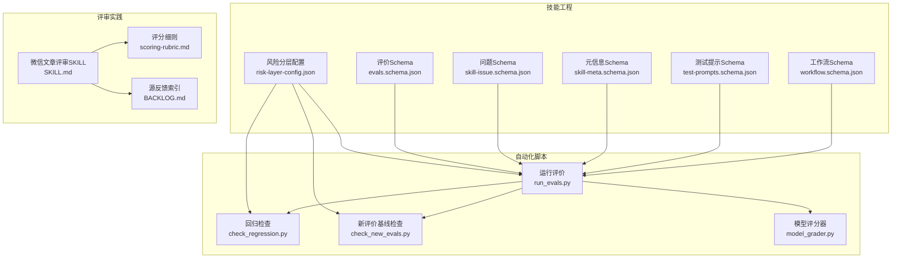
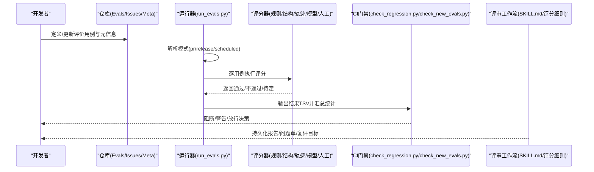
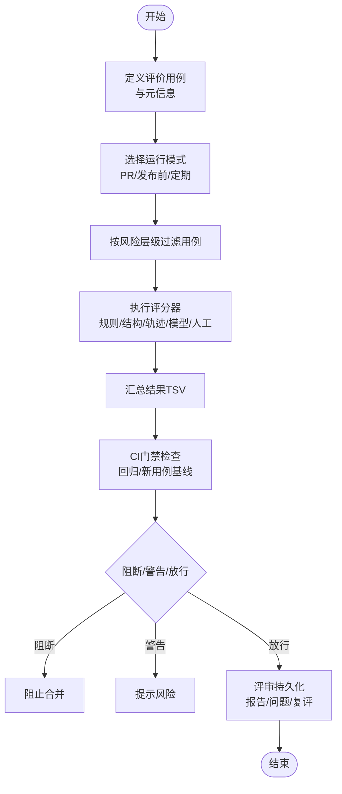
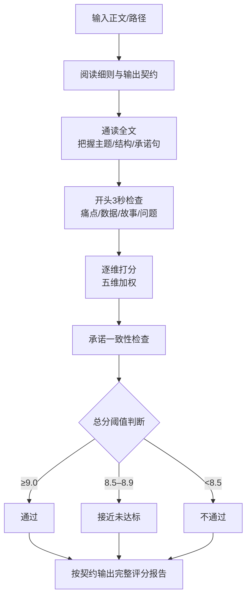
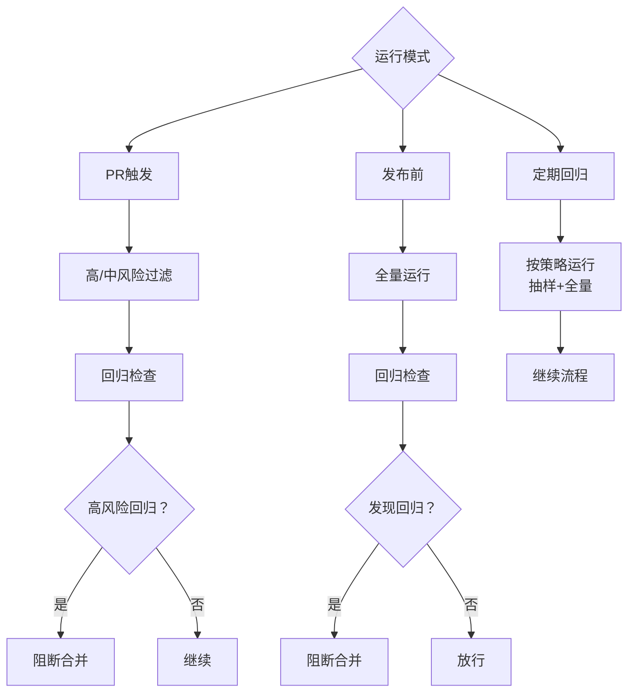
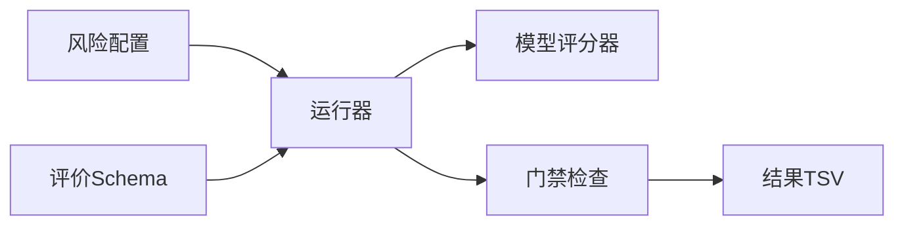

# 用户评价管理

<cite>
**本文引用的文件**
- [plugins/frontend-team-toolkit/skill-engineering/README.md](file://plugins/frontend-team-toolkit/skill-engineering/README.md)
- [plugins/frontend-team-toolkit/skill-engineering/config/risk-layer-config.json](file://plugins/frontend-team-toolkit/skill-engineering/config/risk-layer-config.json)
- [plugins/frontend-team-toolkit/skill-engineering/schemas/evals.schema.json](file://plugins/frontend-team-toolkit/skill-engineering/schemas/evals.schema.json)
- [plugins/frontend-team-toolkit/skill-engineering/schemas/skill-issue.schema.json](file://plugins/frontend-team-toolkit/skill-engineering/schemas/skill-issue.schema.json)
- [plugins/frontend-team-toolkit/skill-engineering/schemas/skill-meta.schema.json](file://plugins/frontend-team-toolkit/skill-engineering/schemas/skill-meta.schema.json)
- [plugins/frontend-team-toolkit/skill-engineering/schemas/test-prompts.schema.json](file://plugins/frontend-team-toolkit/skill-engineering/schemas/test-prompts.schema.json)
- [plugins/frontend-team-toolkit/skill-engineering/schemas/workflow.schema.json](file://plugins/frontend-team-toolkit/skill-engineering/schemas/workflow.schema.json)
- [plugins/frontend-team-toolkit/skill-engineering/scripts/run_evals.py](file://plugins/frontend-team-toolkit/skill-engineering/scripts/run_evals.py)
- [plugins/frontend-team-toolkit/skill-engineering/scripts/check_regression.py](file://plugins/frontend-team-toolkit/skill-engineering/scripts/check_regression.py)
- [plugins/frontend-team-toolkit/skill-engineering/scripts/check_new_evals.py](file://plugins/frontend-team-toolkit/skill-engineering/scripts/check_new_evals.py)
- [plugins/frontend-team-toolkit/skill-engineering/scripts/graders/model_grader.py](file://plugins/frontend-team-toolkit/skill-engineering/scripts/graders/model_grader.py)
- [plugins/frontend-team-toolkit/skills/wechat-article-review/SKILL.md](file://plugins/frontend-team-toolkit/skills/wechat-article-review/SKILL.md)
- [plugins/frontend-team-toolkit/skills/wechat-article-review/references/scoring-rubric.md](file://plugins/frontend-team-toolkit/skills/wechat-article-review/references/scoring-rubric.md)
- [plugins/frontend-team-toolkit/skills/pm-md-to-openspec-pipeline/BACKLOG.md](file://plugins/frontend-team-toolkit/skills/pm-md-to-openspec-pipeline/BACKLOG.md)
</cite>

## 目录
1. [简介](#简介)
2. [项目结构](#项目结构)
3. [核心组件](#核心组件)
4. [架构总览](#架构总览)
5. [详细组件分析](#详细组件分析)
6. [依赖关系分析](#依赖关系分析)
7. [性能考虑](#性能考虑)
8. [故障排查指南](#故障排查指南)
9. [结论](#结论)
10. [附录](#附录)

## 简介
本文件面向“用户评价管理系统”的建设与运维，基于仓库中的技能工程与评价体系实践，系统化梳理评价收集机制、内容格式与提交流程、审核标准与过滤规则、人工复核机制、CI门禁与回归保障、以及数据模型与API接口规范。文档同时提供可视化架构图与流程图，帮助非技术读者快速理解整体运作方式。

## 项目结构
该仓库以“技能工程”为核心，围绕“评价（Eval）”与“质量门禁（CI）”两条主线组织内容：
- 评价数据模型与规则：通过JSON Schema定义评价用例、评分细则、问题单与元信息。
- 自动化与半自动化评价：提供规则、结构、轨迹与LLM模型评分器，结合人工复核。
- CI门禁：在PR、发布前与定期回归三个阶段，按风险层级筛选与阻断策略执行。
- 评审工作流：以微信公众号文章评审为例，展示从输入到输出、从阈值到复评的完整流程。

图表来源
- [plugins/frontend-team-toolkit/skill-engineering/config/risk-layer-config.json:1-70](file://plugins/frontend-team-toolkit/skill-engineering/config/risk-layer-config.json#L1-L70)
- [plugins/frontend-team-toolkit/skill-engineering/schemas/evals.schema.json:1-39](file://plugins/frontend-team-toolkit/skill-engineering/schemas/evals.schema.json#L1-L39)
- [plugins/frontend-team-toolkit/skill-engineering/schemas/skill-issue.schema.json](file://plugins/frontend-team-toolkit/skill-engineering/schemas/skill-issue.schema.json)
- [plugins/frontend-team-toolkit/skill-engineering/schemas/skill-meta.schema.json](file://plugins/frontend-team-toolkit/skill-engineering/schemas/skill-meta.schema.json)
- [plugins/frontend-team-toolkit/skill-engineering/schemas/test-prompts.schema.json](file://plugins/frontend-team-toolkit/skill-engineering/schemas/test-prompts.schema.json)
- [plugins/frontend-team-toolkit/skill-engineering/schemas/workflow.schema.json](file://plugins/frontend-team-toolkit/skill-engineering/schemas/workflow.schema.json)
- [plugins/frontend-team-toolkit/skill-engineering/scripts/run_evals.py:186-227](file://plugins/frontend-team-toolkit/skill-engineering/scripts/run_evals.py#L186-L227)
- [plugins/frontend-team-toolkit/skill-engineering/scripts/check_regression.py](file://plugins/frontend-team-toolkit/skill-engineering/scripts/check_regression.py)
- [plugins/frontend-team-toolkit/skill-engineering/scripts/check_new_evals.py:42-87](file://plugins/frontend-team-toolkit/skill-engineering/scripts/check_new_evals.py#L42-L87)
- [plugins/frontend-team-toolkit/skill-engineering/scripts/graders/model_grader.py:198-240](file://plugins/frontend-team-toolkit/skill-engineering/scripts/graders/model_grader.py#L198-L240)
- [plugins/frontend-team-toolkit/skills/wechat-article-review/SKILL.md:43-68](file://plugins/frontend-team-toolkit/skills/wechat-article-review/SKILL.md#L43-L68)
- [plugins/frontend-team-toolkit/skills/wechat-article-review/references/scoring-rubric.md:1-40](file://plugins/frontend-team-toolkit/skills/wechat-article-review/references/scoring-rubric.md#L1-L40)
- [plugins/frontend-team-toolkit/skills/pm-md-to-openspec-pipeline/BACKLOG.md:24-62](file://plugins/frontend-team-toolkit/skills/pm-md-to-openspec-pipeline/BACKLOG.md#L24-L62)

章节来源
- [plugins/frontend-team-toolkit/skill-engineering/README.md:139-237](file://plugins/frontend-team-toolkit/skill-engineering/README.md#L139-L237)

## 核心组件
- 评价数据模型与规则
  - 评价用例（evals）：包含id、名称、类型（能力/回归）、提示词、期望结果、禁止项、评分者类型、风险等级与来源等字段。
  - 问题单（skill-issues）：用于记录真实问题，支持单行JSON结构。
  - 元信息（skill-meta）：技能元数据结构。
  - 测试提示（test-prompts）：测试用提示词集合。
  - 工作流（workflow）：工作流元数据结构。
- 自动化与半自动化评分器
  - 规则/结构/轨迹评分器：完全自动化，用于关键词、结构与调用顺序检查。
  - 模型评分器（LLM）：半自动化，支持多样本投票，降低漂移风险。
  - 人工评分器：在发布前或特定场景触发。
- CI门禁与回归保障
  - PR触发模式：仅运行高/中风险用例，高风险回归直接阻断。
  - 发布前模式：全量运行，任何回归均阻断。
  - 定期回归：按周/月/季策略运行，包含抽样检查。
- 评审工作流与阈值
  - 以微信公众号文章评审为例，展示从输入确认、细则阅读、逐维打分、承诺一致性检查到最终结论与持久化的全流程。

章节来源
- [plugins/frontend-team-toolkit/skill-engineering/schemas/evals.schema.json:1-39](file://plugins/frontend-team-toolkit/skill-engineering/schemas/evals.schema.json#L1-L39)
- [plugins/frontend-team-toolkit/skill-engineering/schemas/skill-issue.schema.json](file://plugins/frontend-team-toolkit/skill-engineering/schemas/skill-issue.schema.json)
- [plugins/frontend-team-toolkit/skill-engineering/schemas/skill-meta.schema.json](file://plugins/frontend-team-toolkit/skill-engineering/schemas/skill-meta.schema.json)
- [plugins/frontend-team-toolkit/skill-engineering/schemas/test-prompts.schema.json](file://plugins/frontend-team-toolkit/skill-engineering/schemas/test-prompts.schema.json)
- [plugins/frontend-team-toolkit/skill-engineering/schemas/workflow.schema.json](file://plugins/frontend-team-toolkit/skill-engineering/schemas/workflow.schema.json)
- [plugins/frontend-team-toolkit/skill-engineering/scripts/graders/model_grader.py:198-240](file://plugins/frontend-team-toolkit/skill-engineering/scripts/graders/model_grader.py#L198-L240)
- [plugins/frontend-team-toolkit/skill-engineering/config/risk-layer-config.json:1-70](file://plugins/frontend-team-toolkit/skill-engineering/config/risk-layer-config.json#L1-L70)
- [plugins/frontend-team-toolkit/skill-engineering/README.md:168-237](file://plugins/frontend-team-toolkit/skill-engineering/README.md#L168-L237)
- [plugins/frontend-team-toolkit/skills/wechat-article-review/SKILL.md:43-68](file://plugins/frontend-team-toolkit/skills/wechat-article-review/SKILL.md#L43-L68)
- [plugins/frontend-team-toolkit/skills/wechat-article-review/references/scoring-rubric.md:1-40](file://plugins/frontend-team-toolkit/skills/wechat-article-review/references/scoring-rubric.md#L1-L40)

## 架构总览
下图展示了从“评价用例定义”到“CI门禁执行”再到“评审工作流”的端到端架构：

图表来源
- [plugins/frontend-team-toolkit/skill-engineering/scripts/run_evals.py:186-227](file://plugins/frontend-team-toolkit/skill-engineering/scripts/run_evals.py#L186-L227)
- [plugins/frontend-team-toolkit/skill-engineering/scripts/check_regression.py](file://plugins/frontend-team-toolkit/skill-engineering/scripts/check_regression.py)
- [plugins/frontend-team-toolkit/skill-engineering/scripts/check_new_evals.py:42-87](file://plugins/frontend-team-toolkit/skill-engineering/scripts/check_new_evals.py#L42-L87)
- [plugins/frontend-team-toolkit/skill-engineering/scripts/graders/model_grader.py:198-240](file://plugins/frontend-team-toolkit/skill-engineering/scripts/graders/model_grader.py#L198-L240)
- [plugins/frontend-team-toolkit/skills/wechat-article-review/SKILL.md:43-68](file://plugins/frontend-team-toolkit/skills/wechat-article-review/SKILL.md#L43-L68)

## 详细组件分析

### 评价收集机制与提交流程
- 收集来源
  - 评价用例来源于技能目录下的评价文件，使用统一的JSON Schema进行结构约束。
  - 问题单来源于真实业务反馈，采用单行JSON结构便于流水线处理。
- 提交流程
  - 本地或CI中通过运行器加载用例，按模式（PR/发布前/定期）筛选并执行。
  - 评分器返回结果，汇总至TSV文件，供门禁检查与后续分析使用。
- 评审持久化
  - 评审工作流支持将报告、问题与复评目标持久化到指定位置，形成闭环。

图表来源
- [plugins/frontend-team-toolkit/skill-engineering/scripts/run_evals.py:186-227](file://plugins/frontend-team-toolkit/skill-engineering/scripts/run_evals.py#L186-L227)
- [plugins/frontend-team-toolkit/skill-engineering/config/risk-layer-config.json:1-70](file://plugins/frontend-team-toolkit/skill-engineering/config/risk-layer-config.json#L1-L70)
- [plugins/frontend-team-toolkit/skill-engineering/scripts/check_regression.py](file://plugins/frontend-team-toolkit/skill-engineering/scripts/check_regression.py)
- [plugins/frontend-team-toolkit/skill-engineering/scripts/check_new_evals.py:42-87](file://plugins/frontend-team-toolkit/skill-engineering/scripts/check_new_evals.py#L42-L87)
- [plugins/frontend-team-toolkit/skills/wechat-article-review/SKILL.md:43-68](file://plugins/frontend-team-toolkit/skills/wechat-article-review/SKILL.md#L43-L68)

章节来源
- [plugins/frontend-team-toolkit/skill-engineering/schemas/evals.schema.json:1-39](file://plugins/frontend-team-toolkit/skill-engineering/schemas/evals.schema.json#L1-L39)
- [plugins/frontend-team-toolkit/skill-engineering/schemas/skill-issue.schema.json](file://plugins/frontend-team-toolkit/skill-engineering/schemas/skill-issue.schema.json)
- [plugins/frontend-team-toolkit/skill-engineering/scripts/run_evals.py:186-227](file://plugins/frontend-team-toolkit/skill-engineering/scripts/run_evals.py#L186-L227)
- [plugins/frontend-team-toolkit/skill-engineering/README.md:139-237](file://plugins/frontend-team-toolkit/skill-engineering/README.md#L139-L237)

### 评价内容格式与审核标准
- 评价内容格式
  - 评价用例包含：id、名称、类型、提示词、期望结果、禁止项、评分者类型、风险等级与来源。
  - 问题单采用单行JSON，便于批量处理与版本控制。
  - 元信息与测试提示分别约束技能元数据与测试提示词集合。
- 审核标准
  - 微信公众号文章评审采用五维评分与阈值：≥9.0通过，8.5–8.9为接近未达标，<8.5为明显问题。
  - 承诺一致性检查：未兑现承诺需进入主要问题并给出最小修复动作。
  - 合规风险：疑似违规直接不通过，不提供“擦边通过”。

图表来源
- [plugins/frontend-team-toolkit/skills/wechat-article-review/SKILL.md:43-68](file://plugins/frontend-team-toolkit/skills/wechat-article-review/SKILL.md#L43-L68)
- [plugins/frontend-team-toolkit/skills/wechat-article-review/references/scoring-rubric.md:1-40](file://plugins/frontend-team-toolkit/skills/wechat-article-review/references/scoring-rubric.md#L1-L40)

章节来源
- [plugins/frontend-team-toolkit/skills/wechat-article-review/SKILL.md:43-68](file://plugins/frontend-team-toolkit/skills/wechat-article-review/SKILL.md#L43-L68)
- [plugins/frontend-team-toolkit/skills/wechat-article-review/references/scoring-rubric.md:1-40](file://plugins/frontend-team-toolkit/skills/wechat-article-review/references/scoring-rubric.md#L1-L40)

### 过滤规则与人工复核机制
- 过滤规则
  - PR触发模式：仅运行高/中风险用例，高风险回归直接阻断。
  - 发布前模式：全量运行，任何回归均阻断。
  - 定期回归：按周/月/季策略运行，包含抽样检查。
- 人工复核
  - 人工评分器在发布前或特定场景触发，确保关键决策由人工把关。
  - 新增评价与基线缺失将被阻断，保证质量门槛。

图表来源
- [plugins/frontend-team-toolkit/skill-engineering/config/risk-layer-config.json:1-70](file://plugins/frontend-team-toolkit/skill-engineering/config/risk-layer-config.json#L1-L70)
- [plugins/frontend-team-toolkit/skill-engineering/scripts/check_regression.py](file://plugins/frontend-team-toolkit/skill-engineering/scripts/check_regression.py)
- [plugins/frontend-team-toolkit/skill-engineering/scripts/check_new_evals.py:42-87](file://plugins/frontend-team-toolkit/skill-engineering/scripts/check_new_evals.py#L42-L87)

章节来源
- [plugins/frontend-team-toolkit/skill-engineering/config/risk-layer-config.json:1-70](file://plugins/frontend-team-toolkit/skill-engineering/config/risk-layer-config.json#L1-L70)
- [plugins/frontend-team-toolkit/skill-engineering/scripts/check_regression.py](file://plugins/frontend-team-toolkit/skill-engineering/scripts/check_regression.py)
- [plugins/frontend-team-toolkit/skill-engineering/scripts/check_new_evals.py:42-87](file://plugins/frontend-team-toolkit/skill-engineering/scripts/check_new_evals.py#L42-L87)

### 用户信誉体系与积分等级（概念性说明）
- 设计原理
  - 将用户行为与贡献映射为可量化指标，如提交质量、评审通过率、问题修复及时性等。
  - 通过阈值与区间划分等级，激励高质量贡献。
- 积分计算
  - 基于评价结果与行为事件，采用加权累计方式计算积分。
- 等级划分
  - 依据积分区间设定等级，配合特权与权限控制。
- 注意：本节为概念性设计说明，不直接对应现有代码实现。

### 评价数据存储结构、索引策略与查询优化
- 存储结构
  - 评价用例与问题单采用JSON Schema约束，确保结构一致与可验证。
  - 结果以TSV形式输出，便于批处理与可视化。
- 索引策略
  - 建议以评价ID、风险等级、类型、时间戳建立索引，支持快速过滤与排序。
- 查询优化
  - 使用分页与条件过滤减少扫描范围；缓存热点用例与结果；对TSV进行分区与压缩。

### 评价反馈处理流程、响应机制与改进措施
- 处理流程
  - 评审后生成报告与问题单，必要时给出复评目标与修复清单。
- 响应机制
  - CI门禁根据结果自动评论或阻断，确保问题及时暴露。
- 改进措施
  - 基于源反馈索引与回溯记录，持续优化评分细则与工作流。

章节来源
- [plugins/frontend-team-toolkit/skills/pm-md-to-openspec-pipeline/BACKLOG.md:24-62](file://plugins/frontend-team-toolkit/skills/pm-md-to-openspec-pipeline/BACKLOG.md#L24-L62)

### 评价API接口规范与数据模型定义
- 数据模型
  - 评价用例：包含id、名称、类型、提示词、期望结果、禁止项、评分者类型、风险等级与来源。
  - 问题单：单行JSON，字段包括但不限于标识、描述、严重程度、状态与处理人。
  - 元信息：技能元数据，字段包括技能名称、版本、作者、创建时间等。
  - 测试提示：测试提示词集合，字段包括提示词文本与用途。
  - 工作流：工作流元数据，字段包括名称、描述、步骤与触发条件。
- API规范（概念性说明）
  - 评价用例管理：GET/POST/PUT/DELETE /evals/{id}
  - 问题单管理：GET/POST/PUT /issues
  - 结果查询：GET /results?eval_id=&risk=&type=
  - 门禁检查：POST /ci/gate {mode, skill, frequency?}
- 注意：本节为概念性接口规范，不直接对应现有代码实现。

章节来源
- [plugins/frontend-team-toolkit/skill-engineering/schemas/evals.schema.json:1-39](file://plugins/frontend-team-toolkit/skill-engineering/schemas/evals.schema.json#L1-L39)
- [plugins/frontend-team-toolkit/skill-engineering/schemas/skill-issue.schema.json](file://plugins/frontend-team-toolkit/skill-engineering/schemas/skill-issue.schema.json)
- [plugins/frontend-team-toolkit/skill-engineering/schemas/skill-meta.schema.json](file://plugins/frontend-team-toolkit/skill-engineering/schemas/skill-meta.schema.json)
- [plugins/frontend-team-toolkit/skill-engineering/schemas/test-prompts.schema.json](file://plugins/frontend-team-toolkit/skill-engineering/schemas/test-prompts.schema.json)
- [plugins/frontend-team-toolkit/skill-engineering/schemas/workflow.schema.json](file://plugins/frontend-team-toolkit/skill-engineering/schemas/workflow.schema.json)

### 公平性保障与反作弊机制
- 公平性保障
  - 多评分器协同：规则/结构/轨迹+模型+人工，避免单一维度偏差。
  - 多样本投票：模型评分器支持多次采样投票，降低随机性影响。
  - 风险分层：按风险等级分层运行，确保高风险用例得到充分覆盖。
- 反作弊机制
  - 新评价基线检查：防止新增用例绕过基线。
  - 回归门禁：对回归用例设置阻断策略，防止退化。
  - 合规红线：对违规直接不通过，杜绝“擦边球”。

章节来源
- [plugins/frontend-team-toolkit/skill-engineering/scripts/graders/model_grader.py:198-240](file://plugins/frontend-team-toolkit/skill-engineering/scripts/graders/model_grader.py#L198-L240)
- [plugins/frontend-team-toolkit/skill-engineering/scripts/check_new_evals.py:42-87](file://plugins/frontend-team-toolkit/skill-engineering/scripts/check_new_evals.py#L42-L87)
- [plugins/frontend-team-toolkit/skill-engineering/config/risk-layer-config.json:53-70](file://plugins/frontend-team-toolkit/skill-engineering/config/risk-layer-config.json#L53-L70)

## 依赖关系分析
- 组件耦合
  - 运行器依赖评分器与门禁脚本；评分器依赖配置与Schema；门禁依赖结果TSV。
- 外部依赖
  - LLM API（在模型评分器中使用），用于半自动化评分。
- 潜在循环依赖
  - 当前结构为单向依赖，无明显循环。

图表来源
- [plugins/frontend-team-toolkit/skill-engineering/config/risk-layer-config.json:1-70](file://plugins/frontend-team-toolkit/skill-engineering/config/risk-layer-config.json#L1-L70)
- [plugins/frontend-team-toolkit/skill-engineering/schemas/evals.schema.json:1-39](file://plugins/frontend-team-toolkit/skill-engineering/schemas/evals.schema.json#L1-L39)
- [plugins/frontend-team-toolkit/skill-engineering/scripts/run_evals.py:186-227](file://plugins/frontend-team-toolkit/skill-engineering/scripts/run_evals.py#L186-L227)
- [plugins/frontend-team-toolkit/skill-engineering/scripts/graders/model_grader.py:198-240](file://plugins/frontend-team-toolkit/skill-engineering/scripts/graders/model_grader.py#L198-L240)
- [plugins/frontend-team-toolkit/skill-engineering/scripts/check_regression.py](file://plugins/frontend-team-toolkit/skill-engineering/scripts/check_regression.py)
- [plugins/frontend-team-toolkit/skill-engineering/scripts/check_new_evals.py:42-87](file://plugins/frontend-team-toolkit/skill-engineering/scripts/check_new_evals.py#L42-L87)

章节来源
- [plugins/frontend-team-toolkit/skill-engineering/scripts/run_evals.py:186-227](file://plugins/frontend-team-toolkit/skill-engineering/scripts/run_evals.py#L186-L227)
- [plugins/frontend-team-toolkit/skill-engineering/scripts/check_regression.py](file://plugins/frontend-team-toolkit/skill-engineering/scripts/check_regression.py)
- [plugins/frontend-team-toolkit/skill-engineering/scripts/check_new_evals.py:42-87](file://plugins/frontend-team-toolkit/skill-engineering/scripts/check_new_evals.py#L42-L87)

## 性能考虑
- 评分器并发：模型评分器支持多样本投票，建议合理设置样本数量与并发度，平衡准确性与性能。
- 结果聚合：TSV输出与统计汇总应分步进行，避免一次性处理大量数据导致内存压力。
- 缓存策略：对常用用例与评分规则进行缓存，减少重复计算。
- 索引与查询：对TSV进行分区与索引，提升查询效率。

## 故障排查指南
- 新评价未基线
  - 现象：新增评价用例未写入基线，阻断合并。
  - 处理：先运行基线脚本，确保所有新用例均有基线记录。
- 回归用例失败
  - 现象：修改后回归用例失败，PR被阻断。
  - 处理：检查修改影响范围，修复问题或更新用例。
- 模型评分不稳定
  - 现象：模型评分波动较大。
  - 处理：增加样本数量，启用多样本投票，或切换到人工评分。

章节来源
- [plugins/frontend-team-toolkit/skill-engineering/scripts/check_new_evals.py:42-87](file://plugins/frontend-team-toolkit/skill-engineering/scripts/check_new_evals.py#L42-L87)
- [plugins/frontend-team-toolkit/skill-engineering/scripts/check_regression.py](file://plugins/frontend-team-toolkit/skill-engineering/scripts/check_regression.py)
- [plugins/frontend-team-toolkit/skill-engineering/scripts/graders/model_grader.py:198-240](file://plugins/frontend-team-toolkit/skill-engineering/scripts/graders/model_grader.py#L198-L240)

## 结论
本仓库提供了完整的“用户评价管理”实践框架：从数据模型与规则定义，到自动化与半自动化评分器，再到CI门禁与评审工作流，形成了闭环的质量保障体系。通过风险分层、多评分器协同与人工复核，有效提升了评价的公平性与稳定性；通过TSV结果与门禁机制，实现了可追踪、可治理的质量管理。

## 附录
- 相关文件路径与用途
  - 风险分层配置：用于定义PR/发布前/定期三种模式的风险过滤与阻断策略。
  - 评价Schema：约束评价用例结构，确保一致性与可验证性。
  - 问题Schema：约束问题单结构，便于批量处理。
  - 元信息Schema：约束技能元数据结构。
  - 测试提示Schema：约束测试提示词集合。
  - 工作流Schema：约束工作流元数据结构。
  - 运行器：按模式运行评价用例并输出结果。
  - 门禁脚本：检查回归与新用例基线，决定阻断/警告/放行。
  - 模型评分器：半自动化评分，支持多样本投票。
  - 评审实践：以微信公众号文章评审为例的工作流与评分细则。
  - 源反馈索引：记录来自不同项目的反馈与索引，便于溯源与改进。

章节来源
- [plugins/frontend-team-toolkit/skill-engineering/config/risk-layer-config.json:1-70](file://plugins/frontend-team-toolkit/skill-engineering/config/risk-layer-config.json#L1-L70)
- [plugins/frontend-team-toolkit/skill-engineering/schemas/evals.schema.json:1-39](file://plugins/frontend-team-toolkit/skill-engineering/schemas/evals.schema.json#L1-L39)
- [plugins/frontend-team-toolkit/skill-engineering/schemas/skill-issue.schema.json](file://plugins/frontend-team-toolkit/skill-engineering/schemas/skill-issue.schema.json)
- [plugins/frontend-team-toolkit/skill-engineering/schemas/skill-meta.schema.json](file://plugins/frontend-team-toolkit/skill-engineering/schemas/skill-meta.schema.json)
- [plugins/frontend-team-toolkit/skill-engineering/schemas/test-prompts.schema.json](file://plugins/frontend-team-toolkit/skill-engineering/schemas/test-prompts.schema.json)
- [plugins/frontend-team-toolkit/skill-engineering/schemas/workflow.schema.json](file://plugins/frontend-team-toolkit/skill-engineering/schemas/workflow.schema.json)
- [plugins/frontend-team-toolkit/skill-engineering/scripts/run_evals.py:186-227](file://plugins/frontend-team-toolkit/skill-engineering/scripts/run_evals.py#L186-L227)
- [plugins/frontend-team-toolkit/skill-engineering/scripts/check_regression.py](file://plugins/frontend-team-toolkit/skill-engineering/scripts/check_regression.py)
- [plugins/frontend-team-toolkit/skill-engineering/scripts/check_new_evals.py:42-87](file://plugins/frontend-team-toolkit/skill-engineering/scripts/check_new_evals.py#L42-L87)
- [plugins/frontend-team-toolkit/skill-engineering/scripts/graders/model_grader.py:198-240](file://plugins/frontend-team-toolkit/skill-engineering/scripts/graders/model_grader.py#L198-L240)
- [plugins/frontend-team-toolkit/skills/wechat-article-review/SKILL.md:43-68](file://plugins/frontend-team-toolkit/skills/wechat-article-review/SKILL.md#L43-L68)
- [plugins/frontend-team-toolkit/skills/wechat-article-review/references/scoring-rubric.md:1-40](file://plugins/frontend-team-toolkit/skills/wechat-article-review/references/scoring-rubric.md#L1-L40)
- [plugins/frontend-team-toolkit/skills/pm-md-to-openspec-pipeline/BACKLOG.md:24-62](file://plugins/frontend-team-toolkit/skills/pm-md-to-openspec-pipeline/BACKLOG.md#L24-L62)