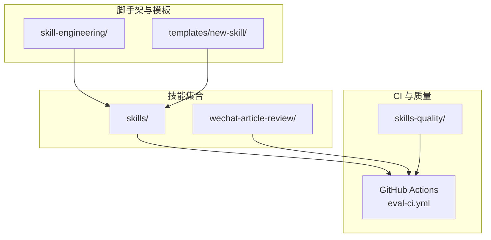
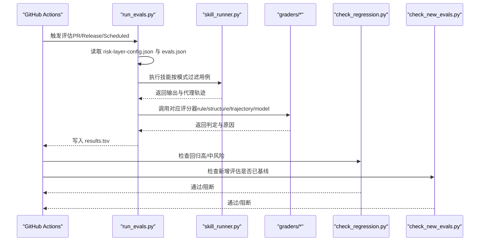
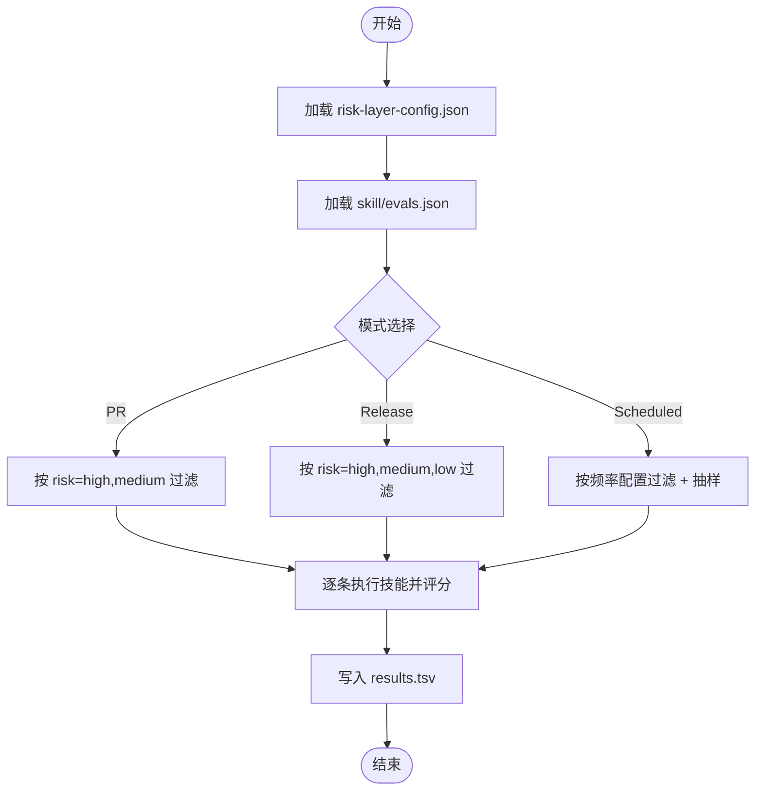
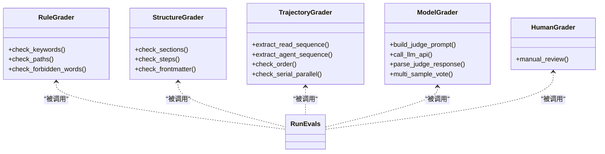
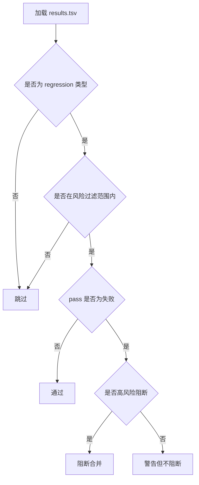
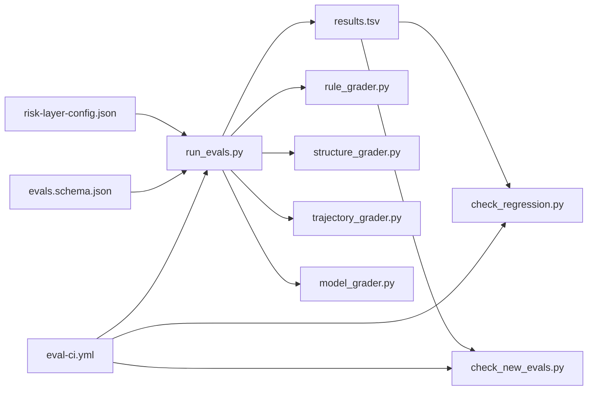

# 评价指标体系

<cite>
**本文引用的文件**
- [README.md](file://plugins/frontend-team-toolkit/skill-engineering/README.md)
- [eval-ci.yml](file://.github/workflows/eval-ci.yml)
- [risk-layer-config.json](file://plugins/frontend-team-toolkit/skill-engineering/config/risk-layer-config.json)
- [evals.schema.json](file://plugins/frontend-team-toolkit/skill-engineering/schemas/evals.schema.json)
- [run_evals.py](file://plugins/frontend-team-toolkit/skill-engineering/scripts/run_evals.py)
- [check_regression.py](file://plugins/frontend-team-toolkit/skill-engineering/scripts/check_regression.py)
- [check_new_evals.py](file://plugins/frontend-team-toolkit/skill-engineering/scripts/check_new_evals.py)
- [skill_runner.py](file://plugins/frontend-team-toolkit/skill-engineering/scripts/skill_runner.py)
- [rule_grader.py](file://plugins/frontend-team-toolkit/skill-engineering/scripts/graders/rule_grader.py)
- [structure_grader.py](file://plugins/frontend-team-toolkit/skill-engineering/scripts/graders/structure_grader.py)
- [trajectory_grader.py](file://plugins/frontend-team-toolkit/skill-engineering/scripts/graders/trajectory_grader.py)
- [model_grader.py](file://plugins/frontend-team-toolkit/skill-engineering/scripts/graders/model_grader.py)
- [evals.json（微信文章评审）](file://plugins/frontend-team-toolkit/skills/wechat-article-review/evals/evals.json)
- [results.tsv（微信文章评审）](file://plugins/frontend-team-toolkit/skills/wechat-article-review/results.tsv)
- [scoring-rubric.md（微信文章评审）](file://plugins/frontend-team-toolkit/skills/wechat-article-review/references/scoring-rubric.md)
- [README.md（技能质量中心）](file://plugins/frontend-team-toolkit/skills/skills-quality/README.md)
- [evals.json（新技能模板）](file://plugins/frontend-team-toolkit/skill-engineering/templates/new-skill/evals/evals.json)
</cite>

## 目录
1. [引言](#引言)
2. [项目结构](#项目结构)
3. [核心组件](#核心组件)
4. [架构总览](#架构总览)
5. [详细组件分析](#详细组件分析)
6. [依赖分析](#依赖分析)
7. [性能考虑](#性能考虑)
8. [故障排查指南](#故障排查指南)
9. [结论](#结论)
10. [附录](#附录)

## 引言
本文件系统化梳理“技能评价指标体系”，结合仓库中的脚手架、评估脚本、CI 工作流与示例技能，构建覆盖功能、性能、安全与体验的指标设计与实施规范。体系以 JSON Schema 约束评估用例结构，以多级风险分层与门禁规则控制回归与发布，以自动化评分器与人工评审相结合的方式实现可追溯、可回归的质量保障。

## 项目结构
该仓库围绕“技能工程脚手架”组织，核心包括：
- 脚手架与模板：创建技能骨架、结构校验、Schema 与生命周期速查
- 评估与门禁：CI 自动化运行评估、回归检查、新增评估基线检查
- 评分器：规则、结构、轨迹、模型（LLM Judge）与人工评分
- 示例技能：微信文章评审技能提供完整的评估用例与评分细则
- 质量运营：技能质量中心沉淀问题池、发布门禁与升级流程

图表来源
- [README.md:130-138](file://plugins/frontend-team-toolkit/skill-engineering/README.md#L130-L138)
- [eval-ci.yml:1-208](file://.github/workflows/eval-ci.yml#L1-L208)

章节来源
- [README.md:34-96](file://plugins/frontend-team-toolkit/skill-engineering/README.md#L34-L96)
- [README.md:130-138](file://plugins/frontend-team-toolkit/skill-engineering/README.md#L130-L138)

## 核心组件
- 评估用例与结构约束：通过 JSON Schema 约束评估用例字段（id、prompt、expected、must_not、grader、risk、type 等），确保评估输入与输出的一致性与可追踪性。
- 评估运行器：根据 CI 模式（PR/Release/Scheduled）筛选评估用例，执行技能并收集输出与代理轨迹，调用相应评分器进行判定，并汇总结果。
- 评分器：规则（关键词/路径/禁用词）、结构（章节/步骤/元数据）、轨迹（调用顺序/并发/串并行约定）、模型（LLM Judge 语义判定）与人工评分。
- 回归与门禁：检查回归用例是否通过，阻断高风险回归；检查新增评估是否已建立基线；支持按风险级别与频率的定期回归。
- 示例与评分细则：微信文章评审技能提供五维评分 rubric 与阈值，支撑能力与回归评估的判标。

章节来源
- [evals.schema.json:1-40](file://plugins/frontend-team-toolkit/skill-engineering/schemas/evals.schema.json#L1-L40)
- [run_evals.py:1-227](file://plugins/frontend-team-toolkit/skill-engineering/scripts/run_evals.py#L1-L227)
- [check_regression.py:1-100](file://plugins/frontend-team-toolkit/skill-engineering/scripts/check_regression.py#L1-L100)
- [check_new_evals.py:1-87](file://plugins/frontend-team-toolkit/skill-engineering/scripts/check_new_evals.py#L1-L87)
- [scoring-rubric.md:1-88](file://plugins/frontend-team-toolkit/skills/wechat-article-review/references/scoring-rubric.md#L1-L88)

## 架构总览
评估体系以 CI 为核心驱动，按模式选择评估集，执行技能并评分，最终形成可追溯的结果记录与门禁决策。

图表来源
- [eval-ci.yml:36-158](file://.github/workflows/eval-ci.yml#L36-L158)
- [run_evals.py:135-174](file://plugins/frontend-team-toolkit/skill-engineering/scripts/run_evals.py#L135-L174)
- [skill_runner.py:328-356](file://plugins/frontend-team-toolkit/skill-engineering/scripts/skill_runner.py#L328-L356)
- [check_regression.py:37-54](file://plugins/frontend-team-toolkit/skill-engineering/scripts/check_regression.py#L37-L54)
- [check_new_evals.py:45-83](file://plugins/frontend-team-toolkit/skill-engineering/scripts/check_new_evals.py#L45-L83)

## 详细组件分析

### 评估用例与结构约束
- 用例字段：id、name、type（capability/regression）、prompt、expected、must_not、grader（rule/structure/trajectory/model/human 及组合）、risk（high/medium/low）、source/artifact/baseline_score 等。
- 约束要点：id 唯一、prompt 非空、grader 为枚举值、risk 为枚举值、expected/must_not 为字符串或数组。
- 作用：保证评估输入标准化，便于自动化运行与结果对比。

章节来源
- [evals.schema.json:15-38](file://plugins/frontend-team-toolkit/skill-engineering/schemas/evals.schema.json#L15-L38)
- [evals.json（微信文章评审）:1-213](file://plugins/frontend-team-toolkit/skills/wechat-article-review/evals/evals.json#L1-L213)
- [evals.json（新技能模板）:1-47](file://plugins/frontend-team-toolkit/skill-engineering/templates/new-skill/evals/evals.json#L1-L47)

### 评估运行器（按模式筛选与执行）
- 模式与风险过滤：
  - PR 模式：仅运行 high + medium 风险用例，高风险回归失败阻断合并。
  - Release 模式：运行全量用例，任何回归失败阻断发布。
  - Scheduled 模式：按周/月/季度运行，支持随机抽样（spot check）。
- 用例过滤与抽样：按 risk 字段过滤；对 low/medium 风险可按配置抽样加入。
- 执行流程：加载用例 → 技能执行（输出与代理轨迹）→ 评分器判定 → 汇总结果。

图表来源
- [run_evals.py:135-174](file://plugins/frontend-team-toolkit/skill-engineering/scripts/run_evals.py#L135-L174)
- [risk-layer-config.json:1-70](file://plugins/frontend-team-toolkit/skill-engineering/config/risk-layer-config.json#L1-L70)

章节来源
- [run_evals.py:1-227](file://plugins/frontend-team-toolkit/skill-engineering/scripts/run_evals.py#L1-L227)
- [risk-layer-config.json:1-70](file://plugins/frontend-team-toolkit/skill-engineering/config/risk-layer-config.json#L1-L70)

### 评分器体系
- 规则评分器（rule）：关键词/路径/禁用词匹配，完全自动化，漂移风险低。
- 结构评分器（structure）：章节/步骤/元数据检查，完全自动化，漂移风险低。
- 轨迹评分器（trajectory）：代理/子技能调用顺序与串并行约定检查，完全自动化，漂移风险低。
- 模型评分器（model）：LLM Judge 语义判定，支持多采样投票，半自动化，存在漂移风险。
- 人工评分器（human）：人工审核，零漂移，成本较高，用于发布前或高风险场景。

图表来源
- [rule_grader.py:41-92](file://plugins/frontend-team-toolkit/skill-engineering/scripts/graders/rule_grader.py#L41-L92)
- [structure_grader.py:63-122](file://plugins/frontend-team-toolkit/skill-engineering/scripts/graders/structure_grader.py#L63-L122)
- [trajectory_grader.py:59-139](file://plugins/frontend-team-toolkit/skill-engineering/scripts/graders/trajectory_grader.py#L59-L139)
- [model_grader.py:184-226](file://plugins/frontend-team-toolkit/skill-engineering/scripts/graders/model_grader.py#L184-L226)

章节来源
- [rule_grader.py:1-110](file://plugins/frontend-team-toolkit/skill-engineering/scripts/graders/rule_grader.py#L1-L110)
- [structure_grader.py:1-155](file://plugins/frontend-team-toolkit/skill-engineering/scripts/graders/structure_grader.py#L1-L155)
- [trajectory_grader.py:1-163](file://plugins/frontend-team-toolkit/skill-engineering/scripts/graders/trajectory_grader.py#L1-L163)
- [model_grader.py:1-273](file://plugins/frontend-team-toolkit/skill-engineering/scripts/graders/model_grader.py#L1-L273)

### 回归与门禁
- 回归检查：筛选 type 含“regression”的用例，按风险级别过滤，失败则阻断（PR 模式高风险阻断，中风险警告；Release 模式全阻断）。
- 新增评估基线：检测新增用例是否已在 results.tsv 中有记录，未基线则阻断合并。
- CI 集成：在 PR、Push、Schedule、手动触发等场景自动运行，失败时在 PR 下方评论并通知。

图表来源
- [check_regression.py:37-54](file://plugins/frontend-team-toolkit/skill-engineering/scripts/check_regression.py#L37-L54)
- [eval-ci.yml:116-132](file://.github/workflows/eval-ci.yml#L116-L132)

章节来源
- [check_regression.py:1-100](file://plugins/frontend-team-toolkit/skill-engineering/scripts/check_regression.py#L1-L100)
- [check_new_evals.py:1-87](file://plugins/frontend-team-toolkit/skill-engineering/scripts/check_new_evals.py#L1-L87)
- [eval-ci.yml:1-208](file://.github/workflows/eval-ci.yml#L1-L208)

### 示例技能：微信文章评审
- 评估用例覆盖弱草稿、缺失正文、强草稿、承诺未兑现、技术蓝图适配、SOP 系列、空洞开头、边界分数等典型场景。
- 评分 rubric：五维（主题与价值、结构与逻辑、干货密度、可读性与表达、标题与 CTA），权重分别为 25%、20%、25%、20%、10%，总分 10 分，≥9.0 通过，8.5–8.9 为接近未达标，<8.5 明显问题。
- 结果记录：results.tsv 记录日期、技能名、版本、用例 ID、类型、通过状态、评分器模式、备注与评审人，支持复评与对比。

章节来源
- [evals.json（微信文章评审）:1-213](file://plugins/frontend-team-toolkit/skills/wechat-article-review/evals/evals.json#L1-L213)
- [scoring-rubric.md（微信文章评审）:1-88](file://plugins/frontend-team-toolkit/skills/wechat-article-review/references/scoring-rubric.md#L1-L88)
- [results.tsv（微信文章评审）:1-9](file://plugins/frontend-team-toolkit/skills/wechat-article-review/results.tsv#L1-L9)

### 技能执行与上下文
- 上下文构建：从 SKILL.md、output-contract.md、scoring-rubric.md 等文件构建技能上下文，确保执行与评分一致。
- 执行模式：本地模拟、Anthropic API、Claude Code CLI，支持超时与错误兜底。
- 代理轨迹：在 API/Claude Code 模式下可捕获工具调用与令牌用量，供轨迹评分器使用。

章节来源
- [skill_runner.py:31-81](file://plugins/frontend-team-toolkit/skill-engineering/scripts/skill_runner.py#L31-L81)
- [skill_runner.py:84-326](file://plugins/frontend-team-toolkit/skill-engineering/scripts/skill_runner.py#L84-L326)

## 依赖分析
- 配置依赖：run_evals.py 依赖 risk-layer-config.json 控制模式与风险过滤；CI 依赖 eval-ci.yml 驱动。
- 数据依赖：评估结果以 TSV 形式记录，check_regression.py 与 check_new_evals.py 依赖该文件进行门禁判断。
- 评分器依赖：run_evals.py 动态调用各评分器模块，评分器内部依赖正则与 LLM SDK（可选）。

图表来源
- [risk-layer-config.json:1-70](file://plugins/frontend-team-toolkit/skill-engineering/config/risk-layer-config.json#L1-L70)
- [evals.schema.json:1-40](file://plugins/frontend-team-toolkit/skill-engineering/schemas/evals.schema.json#L1-L40)
- [run_evals.py:1-227](file://plugins/frontend-team-toolkit/skill-engineering/scripts/run_evals.py#L1-L227)
- [check_regression.py:1-100](file://plugins/frontend-team-toolkit/skill-engineering/scripts/check_regression.py#L1-L100)
- [check_new_evals.py:1-87](file://plugins/frontend-team-toolkit/skill-engineering/scripts/check_new_evals.py#L1-L87)
- [eval-ci.yml:1-208](file://.github/workflows/eval-ci.yml#L1-L208)

章节来源
- [run_evals.py:1-227](file://plugins/frontend-team-toolkit/skill-engineering/scripts/run_evals.py#L1-L227)
- [eval-ci.yml:1-208](file://.github/workflows/eval-ci.yml#L1-L208)

## 性能考虑
- 评分器成本控制：模型评分器支持多采样投票，可通过环境变量控制采样次数，平衡稳定性与成本。
- CI 并发与资源：Release 模式运行全量评估，建议在专用 runners 或限流执行，避免资源争用。
- 结果缓存与增量：results.tsv 作为基线缓存，减少重复计算；新增用例需先基线，避免重复回归。

## 故障排查指南
- 评估失败
  - 检查 results.tsv 中对应用例的 pass 与 notes 字段，定位规则/结构/轨迹/模型评分器的具体失败原因。
  - 使用 check_regression.py 按风险级别过滤失败用例，确认是否为高风险阻断。
- 新增评估未基线
  - 使用 check_new_evals.py 检查是否存在未在 results.tsv 中记录的新用例，必要时先运行基线。
- CI 未触发或参数错误
  - 检查 eval-ci.yml 的触发条件与输入参数（mode/skill），确认路径匹配与环境变量（如 ANTHROPIC_API_KEY）。
- 评分器异常
  - 模型评分器依赖 LLM SDK，若未安装或 API Key 缺失，会回退为本地模拟；检查日志与返回值。

章节来源
- [check_regression.py:57-96](file://plugins/frontend-team-toolkit/skill-engineering/scripts/check_regression.py#L57-L96)
- [check_new_evals.py:45-83](file://plugins/frontend-team-toolkit/skill-engineering/scripts/check_new_evals.py#L45-L83)
- [eval-ci.yml:1-208](file://.github/workflows/eval-ci.yml#L1-L208)
- [model_grader.py:71-94](file://plugins/frontend-team-toolkit/skill-engineering/scripts/graders/model_grader.py#L71-L94)

## 结论
该指标体系以“用例标准化 + 多级风险 + 自动化评分 + CI 门禁”为核心，结合规则、结构、轨迹、模型与人工评分，形成可追溯、可回归、可演进的质量保障闭环。微信文章评审技能提供了五维评分 rubric 与阈值，为能力与回归评估提供了明确判标。通过 CI 驱动的门禁与定期回归，持续发现并阻断退化，保障技能质量稳定提升。

## 附录

### 指标设计原则与分类体系
- 设计原则
  - 可观测：用例字段与结果记录标准化，便于统计与对比。
  - 可回归：用例区分 capability 与 regression，支持基线与回归检查。
  - 可扩展：支持新增用例与评分器，风险分层与门禁规则可动态调整。
  - 可追溯：TSV 记录包含时间戳、版本、评分器模式与原因，支持复盘。
- 分类体系
  - 功能性指标：规则/结构/轨迹评分器覆盖输出内容、结构与执行流程的正确性。
  - 性能指标：令牌用量、执行耗时（API/Claude Code 模式可统计）。
  - 安全性指标：禁用词/敏感信息检查（规则评分器），合规阈值（rubric）。
  - 用户体验指标：评分 rubric（微信文章评审）与阈值，支持“接近未达标”预警。

章节来源
- [evals.schema.json:15-38](file://plugins/frontend-team-toolkit/skill-engineering/schemas/evals.schema.json#L15-L38)
- [scoring-rubric.md:15-22](file://plugins/frontend-team-toolkit/skills/wechat-article-review/references/scoring-rubric.md#L15-L22)
- [skill_runner.py:238-248](file://plugins/frontend-team-toolkit/skill-engineering/scripts/skill_runner.py#L238-L248)

### 计算公式与评分标准
- 评分 rubric（微信文章评审）
  - 五维加权总分：主题与价值（25%）、结构与逻辑（20%）、干货密度（25%）、可读性与表达（20%）、标题与 CTA（10%）。
  - 判定阈值：≥9.0 通过；8.5–8.9 为接近未达标；<8.5 明显问题；合规风险直接不通过。
  - 承诺未兑现：对“下文将给出”等空头承诺进行扣分与最小修复建议。
- 评估结果记录
  - TSV 字段：date、skill、version、eval_id、eval_type、pass、grader_mode、notes、reviewer。
  - 通过/失败/待审：✅/❌/⚠️；失败原因来自评分器返回。

章节来源
- [scoring-rubric.md:1-88](file://plugins/frontend-team-toolkit/skills/wechat-article-review/references/scoring-rubric.md#L1-L88)
- [results.tsv（微信文章评审）:1-9](file://plugins/frontend-team-toolkit/skills/wechat-article-review/results.tsv#L1-L9)

### 权重分配与评分标准
- 风险分层与门禁
  - PR 模式：高风险回归失败阻断；中风险回归失败警告。
  - Release 模式：全量回归失败阻断发布。
  - Scheduled 模式：按周/月/季度运行，支持随机抽样。
  - 红线：新增评估未基线、改技能未跑基线、高风险回归失败。
- 评分器权重
  - 规则/结构/轨迹：自动化，权重高；模型：半自动化，权重中；人工：零漂移，权重高但成本高。

章节来源
- [risk-layer-config.json:1-70](file://plugins/frontend-team-toolkit/skill-engineering/config/risk-layer-config.json#L1-L70)
- [README.md:180-188](file://plugins/frontend-team-toolkit/skill-engineering/README.md#L180-L188)

### 数据采集、验证与异常处理
- 数据采集
  - 用例：evals.json；执行：skill_runner.py；评分：graders/*；结果：results.tsv。
- 验证机制
  - JSON Schema 校验用例结构；CI 中运行评估并生成结果；回归与新增基线检查。
- 异常处理
  - LLM API 缺失或失败时回退本地模拟；Claude Code/Anthropic SDK 未安装时回退本地；超时与未知错误记录错误信息。

章节来源
- [evals.schema.json:1-40](file://plugins/frontend-team-toolkit/skill-engineering/schemas/evals.schema.json#L1-L40)
- [model_grader.py:71-94](file://plugins/frontend-team-toolkit/skill-engineering/scripts/graders/model_grader.py#L71-L94)
- [skill_runner.py:298-305](file://plugins/frontend-team-toolkit/skill-engineering/scripts/skill_runner.py#L298-L305)

### 动态调整与版本演进
- 用例演进：通过 skills-quality/README.md 的升级流程，将真实问题沉淀为 regression case，先新增/确认评估，再修改 SKILL.md，一轮只改一个假设。
- 配置演进：risk-layer-config.json 支持调整风险过滤、门禁策略与通知方式；CI 配置可按需扩展。
- 版本记录：results.tsv 与 CHANGELOG（技能目录）共同记录变更与结果。

章节来源
- [README.md（技能质量中心）:1-58](file://plugins/frontend-team-toolkit/skills/skills-quality/README.md#L1-L58)
- [README.md:272-278](file://plugins/frontend-team-toolkit/skill-engineering/README.md#L272-L278)

### 指标配置示例与最佳实践
- 配置示例
  - 用例模板：参见新技能模板的 evals.json，包含 happy-path、缺失输入、边界场景等基础用例。
  - 风险与门禁：参考 risk-layer-config.json 的 pr_mode/release_mode/scheduled_mode 与 red_lines。
- 最佳实践
  - 先新增/确认评估，再修改 SKILL.md。
  - 一轮只改一个最高风险问题，高风险回归失败不发布。
  - 将真实使用问题沉淀为 regression case 并纳入基线。
  - 使用复合评分器（rule+human 等）在自动化与人工把关之间取得平衡。

章节来源
- [evals.json（新技能模板）:1-47](file://plugins/frontend-team-toolkit/skill-engineering/templates/new-skill/evals/evals.json#L1-L47)
- [risk-layer-config.json:1-70](file://plugins/frontend-team-toolkit/skill-engineering/config/risk-layer-config.json#L1-L70)
- [README.md（技能质量中心）:51-58](file://plugins/frontend-team-toolkit/skills/skills-quality/README.md#L51-L58)

### 指标关联性与相互影响
- 功能性指标与用户体验指标：规则/结构/轨迹评分器保证输出正确性与可读性，直接影响 rubric 评分与阈值判定。
- 安全性与合规性：禁用词检查与合规阈值（rubric）直接决定是否“直接不通过”，对整体评分有强约束。
- 性能与成本：模型评分器的多采样投票与 API 调用成本需平衡；CI 并发与资源分配影响整体吞吐。

章节来源
- [rule_grader.py:76-91](file://plugins/frontend-team-toolkit/skill-engineering/scripts/graders/rule_grader.py#L76-L91)
- [scoring-rubric.md:15-22](file://plugins/frontend-team-toolkit/skills/wechat-article-review/references/scoring-rubric.md#L15-L22)
- [model_grader.py:202-226](file://plugins/frontend-team-toolkit/skill-engineering/scripts/graders/model_grader.py#L202-L226)