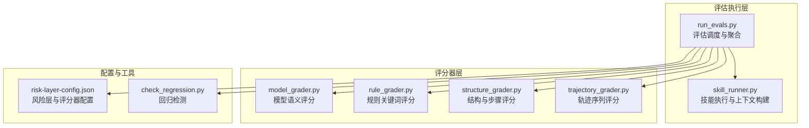
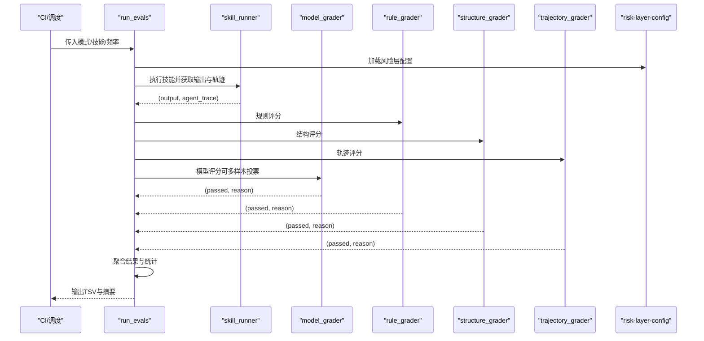
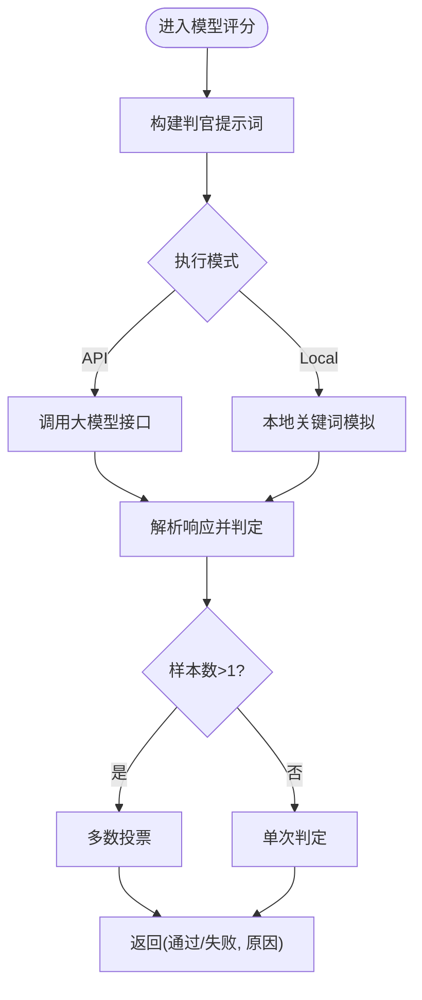
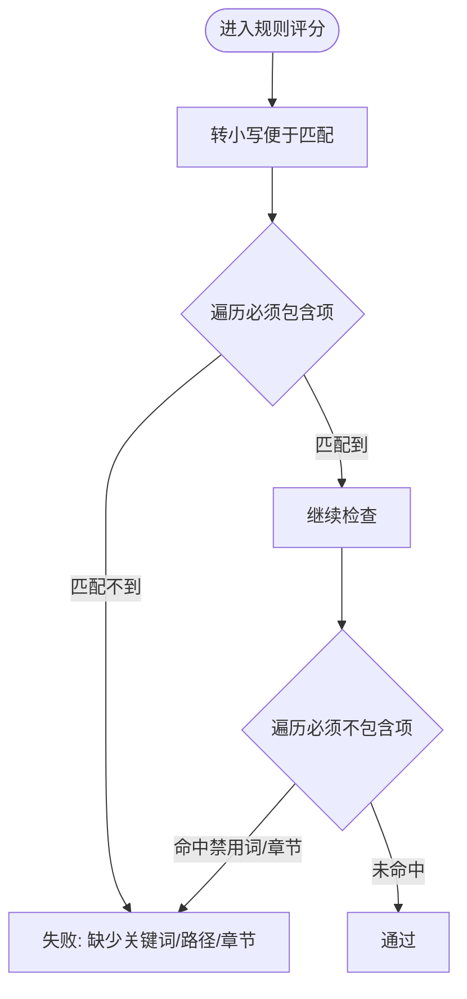
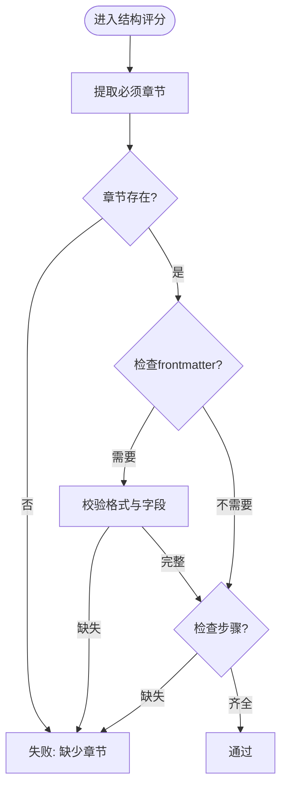
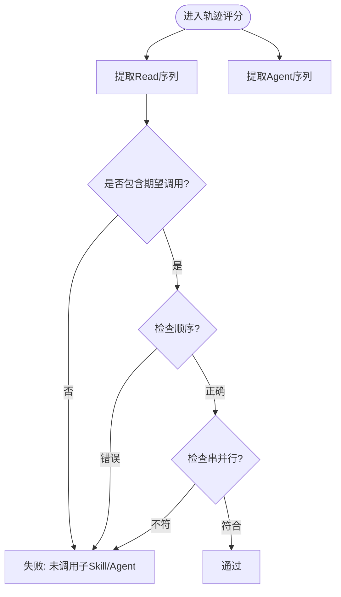
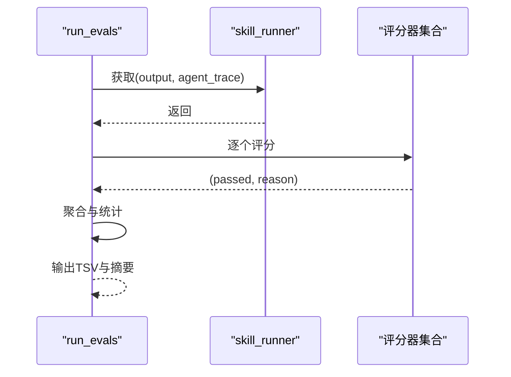
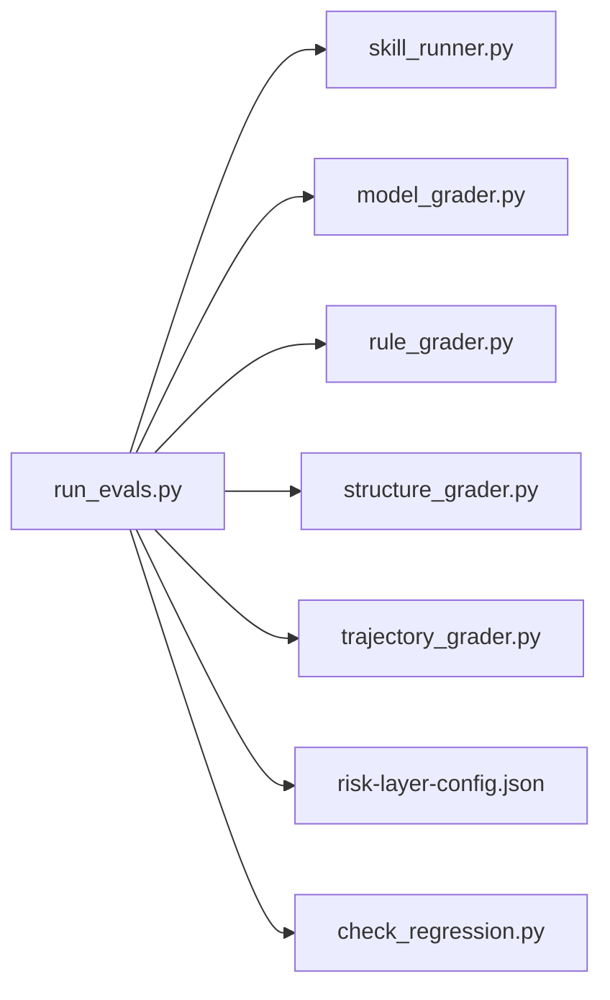

# 评分算法模型

<cite>
**本文引用的文件**
- [model_grader.py](file://plugins/frontend-team-toolkit/skill-engineering/scripts/graders/model_grader.py)
- [rule_grader.py](file://plugins/frontend-team-toolkit/skill-engineering/scripts/graders/rule_grader.py)
- [structure_grader.py](file://plugins/frontend-team-toolkit/skill-engineering/scripts/graders/structure_grader.py)
- [trajectory_grader.py](file://plugins/frontend-team-toolkit/skill-engineering/scripts/graders/trajectory_grader.py)
- [run_evals.py](file://plugins/frontend-team-toolkit/skill-engineering/scripts/run_evals.py)
- [skill_runner.py](file://plugins/frontend-team-toolkit/skill-engineering/scripts/skill_runner.py)
- [risk-layer-config.json](file://plugins/frontend-team-toolkit/skill-engineering/config/risk-layer-config.json)
- [check_regression.py](file://plugins/frontend-team-toolkit/skill-engineering/scripts/check_regression.py)
- [scoring-rubric.md](file://plugins/frontend-team-toolkit/skills/wechat-article-review/references/scoring-rubric.md)
</cite>

## 目录
1. [引言](#引言)
2. [项目结构](#项目结构)
3. [核心组件](#核心组件)
4. [架构总览](#架构总览)
5. [详细组件分析](#详细组件分析)
6. [依赖分析](#依赖分析)
7. [性能考虑](#性能考虑)
8. [故障排查指南](#故障排查指南)
9. [结论](#结论)
10. [附录](#附录)

## 引言
本技术文档围绕“技能评分算法模型”展开，系统阐述四种评估维度（模型、规则、结构、轨迹）的评分算法原理与实现细节，解释评分权重的动态调整机制、贝叶斯更新与机器学习优化思路，以及评分结果的聚合、置信度计算与不确定性量化方法。同时，文档覆盖可解释性、透明度与公平性保障，提供性能优化、缓存策略与并发处理方案，并分析鲁棒性、抗攻击能力与持续改进机制。最后给出算法示例与参数调优指南。

## 项目结构
该仓库采用脚本驱动的评估流水线，核心由四个评分器模块与一个运行器组成，配合风险层配置与回归检测脚本，形成从“执行技能—提取输出与轨迹—多维度评分—结果汇总”的完整闭环。

**图表来源**
- [run_evals.py:135-174](file://plugins/frontend-team-toolkit/skill-engineering/scripts/run_evals.py#L135-L174)
- [skill_runner.py:328-356](file://plugins/frontend-team-toolkit/skill-engineering/scripts/skill_runner.py#L328-L356)
- [model_grader.py:184-226](file://plugins/frontend-team-toolkit/skill-engineering/scripts/graders/model_grader.py#L184-L226)
- [rule_grader.py:41-92](file://plugins/frontend-team-toolkit/skill-engineering/scripts/graders/rule_grader.py#L41-L92)
- [structure_grader.py:63-122](file://plugins/frontend-team-toolkit/skill-engineering/scripts/graders/structure_grader.py#L63-L122)
- [trajectory_grader.py:59-139](file://plugins/frontend-team-toolkit/skill-engineering/scripts/graders/trajectory_grader.py#L59-L139)
- [risk-layer-config.json:1-70](file://plugins/frontend-team-toolkit/skill-engineering/config/risk-layer-config.json#L1-L70)
- [check_regression.py](file://plugins/frontend-team-toolkit/skill-engineering/scripts/check_regression.py)

**章节来源**
- [run_evals.py:1-227](file://plugins/frontend-team-toolkit/skill-engineering/scripts/run_evals.py#L1-L227)
- [skill_runner.py:1-378](file://plugins/frontend-team-toolkit/skill-engineering/scripts/skill_runner.py#L1-L378)
- [risk-layer-config.json:1-70](file://plugins/frontend-team-toolkit/skill-engineering/config/risk-layer-config.json#L1-L70)

## 核心组件
- 模型评分器（model_grader）：基于大模型判断输出是否满足“必须满足/不得违反”的条件，支持本地模拟与多样本投票。
- 规则评分器（rule_grader）：基于正则匹配检查关键词、路径、章节与禁用词等硬性约束。
- 结构评分器（structure_grader）：检查章节标题、前置元数据（frontmatter）、步骤列表等结构化要求。
- 轨迹评分器（trajectory_grader）：解析代理执行轨迹，校验工具调用顺序、串并行编排与子技能调用。
- 评估运行器（run_evals）：根据风险层配置筛选评估集，执行技能并调用各评分器，聚合结果并生成报告。
- 技能执行器（skill_runner）：加载技能上下文与评分细则，执行技能并产出输出与代理轨迹。
- 风险层配置（risk-layer-config.json）：定义不同模式下的评估范围、阻断策略与评分器行为参数。
- 回归检测（check_regression.py）：对比历史基线，识别能力退化与回归风险。

**章节来源**
- [model_grader.py:184-226](file://plugins/frontend-team-toolkit/skill-engineering/scripts/graders/model_grader.py#L184-L226)
- [rule_grader.py:41-92](file://plugins/frontend-team-toolkit/skill-engineering/scripts/graders/rule_grader.py#L41-L92)
- [structure_grader.py:63-122](file://plugins/frontend-team-toolkit/skill-engineering/scripts/graders/structure_grader.py#L63-L122)
- [trajectory_grader.py:59-139](file://plugins/frontend-team-toolkit/skill-engineering/scripts/graders/trajectory_grader.py#L59-L139)
- [run_evals.py:84-132](file://plugins/frontend-team-toolkit/skill-engineering/scripts/run_evals.py#L84-L132)
- [skill_runner.py:328-356](file://plugins/frontend-team-toolkit/skill-engineering/scripts/skill_runner.py#L328-L356)
- [risk-layer-config.json:1-70](file://plugins/frontend-team-toolkit/skill-engineering/config/risk-layer-config.json#L1-L70)
- [check_regression.py](file://plugins/frontend-team-toolkit/skill-engineering/scripts/check_regression.py)

## 架构总览
评估流程从“执行技能”开始，产出文本输出与代理轨迹；随后由“评估运行器”选择评分器，分别进行规则、结构、轨迹与模型评分；最终在“风险层配置”控制下，决定是否阻断与通知。

**图表来源**
- [run_evals.py:135-174](file://plugins/frontend-team-toolkit/skill-engineering/scripts/run_evals.py#L135-L174)
- [skill_runner.py:328-356](file://plugins/frontend-team-toolkit/skill-engineering/scripts/skill_runner.py#L328-L356)
- [model_grader.py:184-226](file://plugins/frontend-team-toolkit/skill-engineering/scripts/graders/model_grader.py#L184-L226)
- [rule_grader.py:41-92](file://plugins/frontend-team-toolkit/skill-engineering/scripts/graders/rule_grader.py#L41-L92)
- [structure_grader.py:63-122](file://plugins/frontend-team-toolkit/skill-engineering/scripts/graders/structure_grader.py#L63-L122)
- [trajectory_grader.py:59-139](file://plugins/frontend-team-toolkit/skill-engineering/scripts/graders/trajectory_grader.py#L59-L139)
- [risk-layer-config.json:1-70](file://plugins/frontend-team-toolkit/skill-engineering/config/risk-layer-config.json#L1-L70)

## 详细组件分析

### 模型评分器（语义质量）
- 输入：评估配置（必须满足/不得违反列表）与实际输出文本。
- 核心流程：
  - 构建判官提示词，要求对每条“必须满足/不得违反”逐项判定。
  - 支持两种执行模式：
    - API模式：调用大模型接口，可配置多样本投票以提升稳定性。
    - 本地模式：基于关键词抽取与简单匹配进行模拟判定。
  - 解析响应，返回最终“通过/失败”及原因。
- 关键实现要点：
  - 提示工程：明确“逐条判定—最终结论”的格式，降低歧义。
  - 多样本投票：当样本数大于1时，统计多数结果作为最终判定。
  - 容错：API不可用或异常时回退到模拟判定并保留错误信息。

**图表来源**
- [model_grader.py:28-68](file://plugins/frontend-team-toolkit/skill-engineering/scripts/graders/model_grader.py#L28-L68)
- [model_grader.py:71-95](file://plugins/frontend-team-toolkit/skill-engineering/scripts/graders/model_grader.py#L71-L95)
- [model_grader.py:97-140](file://plugins/frontend-team-toolkit/skill-engineering/scripts/graders/model_grader.py#L97-L140)
- [model_grader.py:166-182](file://plugins/frontend-team-toolkit/skill-engineering/scripts/graders/model_grader.py#L166-L182)
- [model_grader.py:184-226](file://plugins/frontend-team-toolkit/skill-engineering/scripts/graders/model_grader.py#L184-L226)

**章节来源**
- [model_grader.py:1-273](file://plugins/frontend-team-toolkit/skill-engineering/scripts/graders/model_grader.py#L1-L273)

### 规则评分器（关键词与禁用词）
- 输入：评估配置与输出文本。
- 核心流程：
  - 从“必须包含/必须不包含”等描述中抽取关键词。
  - 对关键词、路径、章节标题进行匹配检查。
  - 对禁用词与禁止章节进行严格过滤。
- 关键实现要点：
  - 正则模式覆盖多种中文表述与英文表述。
  - 区分大小写敏感性，必要时转换为小写进行匹配。
  - 返回“缺少关键词/出现禁用词”等明确原因。

**图表来源**
- [rule_grader.py:41-92](file://plugins/frontend-team-toolkit/skill-engineering/scripts/graders/rule_grader.py#L41-L92)
- [rule_grader.py:16-38](file://plugins/frontend-team-toolkit/skill-engineering/scripts/graders/rule_grader.py#L16-L38)

**章节来源**
- [rule_grader.py:1-110](file://plugins/frontend-team-toolkit/skill-engineering/scripts/graders/rule_grader.py#L1-L110)

### 结构评分器（章节与步骤）
- 输入：评估配置与输出文本。
- 核心流程：
  - 提取“必须有/缺少章节”等描述中的章节名。
  - 检查章节标题存在性（支持多种格式）。
  - 检查前置元数据（frontmatter）是否存在与字段完整性。
  - 检查步骤列表是否包含预期步骤。
- 关键实现要点：
  - 使用正则匹配章节标题与步骤编号。
  - 对frontmatter进行YAML片段解析与字段校验。
  - 明确“缺少章节/缺少步骤/frontmatter格式错误”等错误信息。

**图表来源**
- [structure_grader.py:63-122](file://plugins/frontend-team-toolkit/skill-engineering/scripts/graders/structure_grader.py#L63-L122)
- [structure_grader.py:16-47](file://plugins/frontend-team-toolkit/skill-engineering/scripts/graders/structure_grader.py#L16-L47)

**章节来源**
- [structure_grader.py:1-155](file://plugins/frontend-team-toolkit/skill-engineering/scripts/graders/structure_grader.py#L1-L155)

### 轨迹评分器（代理调用序列）
- 输入：评估配置与代理执行轨迹（工具调用序列）。
- 核心流程：
  - 从轨迹中提取“Read”（子技能调用）与“Agent”（代理运行）序列。
  - 检查是否调用了指定子技能/代理。
  - 校验调用顺序（如“先A再B最后C”）。
  - 校验串并行编排（串行/并行）。
  - 检查是否跳过或误调了不应出现的子技能/代理。
- 关键实现要点：
  - 通过工具名与路径/代理名解析序列。
  - 使用正则解析顺序描述并比对位置。
  - 对Promise.all等并行标记进行识别。

**图表来源**
- [trajectory_grader.py:59-139](file://plugins/frontend-team-toolkit/skill-engineering/scripts/graders/trajectory_grader.py#L59-L139)
- [trajectory_grader.py:15-27](file://plugins/frontend-team-toolkit/skill-engineering/scripts/graders/trajectory_grader.py#L15-L27)
- [trajectory_grader.py:30-38](file://plugins/frontend-team-toolkit/skill-engineering/scripts/graders/trajectory_grader.py#L30-L38)
- [trajectory_grader.py:41-56](file://plugins/frontend-team-toolkit/skill-engineering/scripts/graders/trajectory_grader.py#L41-L56)

**章节来源**
- [trajectory_grader.py:1-163](file://plugins/frontend-team-toolkit/skill-engineering/scripts/graders/trajectory_grader.py#L1-L163)

### 评估运行器与评分聚合
- 功能概览：
  - 加载风险层配置，按模式（PR/Release/Scheduled）筛选评估集。
  - 通过技能执行器获取输出与轨迹。
  - 根据评估配置选择单一或复合评分器组合。
  - 聚合结果并输出TSV报告与摘要统计。
- 关键实现要点：
  - 复合评分器：非人类评分器全部通过才视为通过，若包含人类评分器则标记为“需人工复核”。

**图表来源**
- [run_evals.py:84-132](file://plugins/frontend-team-toolkit/skill-engineering/scripts/run_evals.py#L84-L132)
- [run_evals.py:135-174](file://plugins/frontend-team-toolkit/skill-engineering/scripts/run_evals.py#L135-L174)

**章节来源**
- [run_evals.py:1-227](file://plugins/frontend-team-toolkit/skill-engineering/scripts/run_evals.py#L1-L227)

### 技能执行器与上下文构建
- 功能概览：
  - 支持本地模拟、Anthropic API与Claude Code三种执行模式。
  - 自动加载SKILL.md、输出契约与评分细则，构建完整上下文。
  - 从用户提示中解析文件引用并注入内容。
- 关键实现要点：
  - 上下文拼接：frontmatter、输出契约、评分细则。
  - 文件引用解析：自动读取被引用的Markdown文件并追加到提示。

**章节来源**
- [skill_runner.py:31-81](file://plugins/frontend-team-toolkit/skill-engineering/scripts/skill_runner.py#L31-L81)
- [skill_runner.py:328-356](file://plugins/frontend-team-toolkit/skill-engineering/scripts/skill_runner.py#L328-L356)

### 风险层配置与动态调整
- 风险层配置涵盖：
  - PR/Release/Scheduled三类模式的风险过滤与阻断策略。
  - 评分器配置：是否自动、漂移风险等级、采样数量、抽查比例等。
  - 红线阈值：定义阻断与警告事件。
  - 通知策略：Slack通道、邮件接收者、PR评论开关。
- 动态调整机制：
  - 通过“漂移风险”与“抽查比例”对评分器进行半自动或自动干预。
  - 不同模式下对回归的容忍度不同，高风险回归直接阻断。

**章节来源**
- [risk-layer-config.json:1-70](file://plugins/frontend-team-toolkit/skill-engineering/config/risk-layer-config.json#L1-L70)

### 回归检测与持续改进
- 回归检测脚本用于对比历史基线，识别能力下降与回归风险。
- 建议结合评分器结果与历史趋势，动态调整风险层参数与评分器权重。

**章节来源**
- [check_regression.py](file://plugins/frontend-team-toolkit/skill-engineering/scripts/check_regression.py)

## 依赖分析
- 组件耦合：
  - run_evals依赖skill_runner与四个评分器模块。
  - 评分器彼此独立，仅依赖输入的评估配置与输出文本/轨迹。
  - 风险层配置贯穿评估流程，影响筛选与阻断策略。
- 外部依赖：
  - 大模型API（Anthropic）用于模型评分器。
  - Claude Code CLI用于本地集成。
  - JSON Schema用于评估配置与工件校验。

**图表来源**
- [run_evals.py:25-35](file://plugins/frontend-team-toolkit/skill-engineering/scripts/run_evals.py#L25-L35)
- [run_evals.py:135-174](file://plugins/frontend-team-toolkit/skill-engineering/scripts/run_evals.py#L135-L174)

**章节来源**
- [run_evals.py:1-227](file://plugins/frontend-team-toolkit/skill-engineering/scripts/run_evals.py#L1-L227)

## 性能考虑
- 计算复杂度：
  - 规则/结构评分器：主要为字符串匹配与正则扫描，时间复杂度近似O(n)。
  - 轨迹评分器：序列解析与顺序比对，时间复杂度近似O(m)，m为轨迹长度。
  - 模型评分器：API调用成本取决于样本数与token数；本地模拟为O(n)。
- 优化建议：
  - 缓存策略：对重复的技能上下文与评分器结果进行缓存，减少重复I/O与API调用。
  - 并发处理：对独立评估任务并行执行，注意限流与资源配额。
  - 采样与投票：合理设置模型评分器的样本数，平衡成本与稳定性。
  - 日志与追踪：记录每个评估的耗时与错误，便于定位瓶颈。

[本节为通用性能指导，无需特定文件引用]

## 故障排查指南
- 常见问题与定位：
  - 模型评分器：
    - API密钥缺失或网络异常：检查环境变量与网络连通性。
    - 响应解析失败：确认提示格式与模型输出一致性。
  - 规则/结构评分器：
    - 关键词抽取失败：检查中文/英文表述是否覆盖。
    - frontmatter格式错误：确认YAML片段与字段完整性。
  - 轨迹评分器：
    - 轨迹为空：确认执行器是否正确捕获trace。
    - 顺序解析失败：检查期望顺序描述的规范性。
  - 评估运行器：
    - 评估集为空：检查评估配置与风险层过滤条件。
    - 复合评分器失败：查看非人类评分器的具体失败原因。
- 建议措施：
  - 开启详细日志，记录每个步骤的输入与输出。
  - 使用测试用例覆盖边界情况（空输出、极短输出、特殊格式）。
  - 对模型评分器启用多样本投票，降低噪声影响。

**章节来源**
- [model_grader.py:71-95](file://plugins/frontend-team-toolkit/skill-engineering/scripts/graders/model_grader.py#L71-L95)
- [model_grader.py:166-182](file://plugins/frontend-team-toolkit/skill-engineering/scripts/graders/model_grader.py#L166-L182)
- [structure_grader.py:92-121](file://plugins/frontend-team-toolkit/skill-engineering/scripts/graders/structure_grader.py#L92-L121)
- [trajectory_grader.py:70-81](file://plugins/frontend-team-toolkit/skill-engineering/scripts/graders/trajectory_grader.py#L70-L81)
- [run_evals.py:84-132](file://plugins/frontend-team-toolkit/skill-engineering/scripts/run_evals.py#L84-L132)

## 结论
本评分算法模型通过“规则—结构—轨迹—模型”四维互补，实现了对技能输出的全面质量评估。结合风险层配置与回归检测，系统具备动态调整能力与持续改进机制。在保证可解释性与透明度的同时，通过多样本投票、缓存与并发优化，兼顾了稳定性与效率。建议在生产环境中进一步引入贝叶斯更新与机器学习优化，以自适应地提升评分权重与阈值，增强鲁棒性与抗攻击能力。

[本节为总结性内容，无需特定文件引用]

## 附录

### 评分权重与聚合方法
- 当前实现：
  - 评分器为独立模块，未显式配置权重。
  - 复合评分器采用“非人类全部通过”即通过的策略。
- 建议的权重与聚合方案：
  - 权重设定：规则/结构/轨迹/模型分别赋予固定权重（如0.25），或基于风险层配置动态调整。
  - 聚合方法：加权平均得到综合得分；或采用多数投票（规则/结构/轨迹）+ 模型打分的混合策略。
  - 置信度与不确定性：模型评分器的多样本投票可作为不确定性指标；低投票分歧对应高置信度。

[本节为概念性建议，无需特定文件引用]

### 贝叶斯更新与机器学习优化
- 贝叶斯更新思路：
  - 将历史评估结果作为先验，结合新评估证据更新评分器权重与阈值。
  - 对模型评分器，可基于“通过/失败”与“置信度”进行在线学习。
- 机器学习优化方向：
  - 使用强化学习优化评估器组合策略。
  - 基于特征（输出长度、结构完整性、轨迹复杂度）训练分类器辅助阈值决策。

[本节为概念性建议，无需特定文件引用]

### 可解释性、透明度与公平性
- 可解释性：
  - 评分器返回明确原因（如“缺少关键词/章节/步骤”）。
  - 模型评分器输出逐条判定表格与最终结论。
- 透明度：
  - 评估配置与评分细则（如评分细则）纳入上下文。
- 公平性：
  - 对不同技能类型设置差异化阈值与权重。
  - 避免对特定语言风格的偏见，确保正则与匹配规则的普适性。

**章节来源**
- [scoring-rubric.md](file://plugins/frontend-team-toolkit/skills/wechat-article-review/references/scoring-rubric.md)

### 参数调优指南
- 模型评分器：
  - LLM_API_KEY与模型版本：确保API可用与输出稳定。
  - SAMPLE_COUNT：在成本与稳定性之间权衡，建议≥2。
  - EXECUTION_MODE：优先使用API模式，本地模式仅用于测试。
- 规则/结构/轨迹评分器：
  - 正则表达式覆盖率：定期审查与扩展，覆盖更多表述变体。
  - 错误信息细化：增加定位到具体位置（行号/段落）的能力。
- 风险层配置：
  - PR模式：高风险回归必阻，中风险回归视情况阻断。
  - Release模式：全量评估，任何回归均阻断。
  - Scheduled模式：按频率与抽查比例控制回归检测强度。

**章节来源**
- [model_grader.py:22-25](file://plugins/frontend-team-toolkit/skill-engineering/scripts/graders/model_grader.py#L22-L25)
- [risk-layer-config.json:1-70](file://plugins/frontend-team-toolkit/skill-engineering/config/risk-layer-config.json#L1-L70)