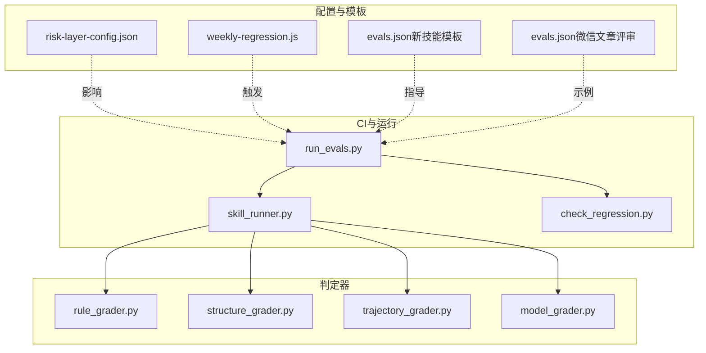
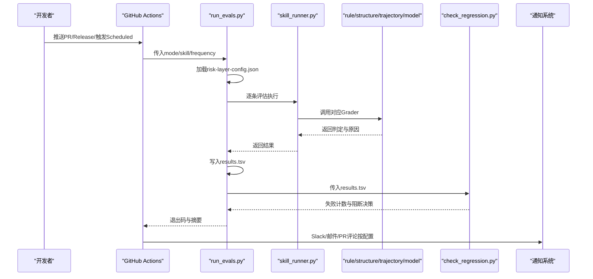
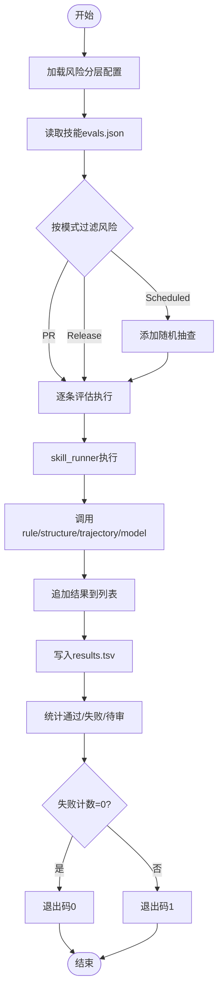
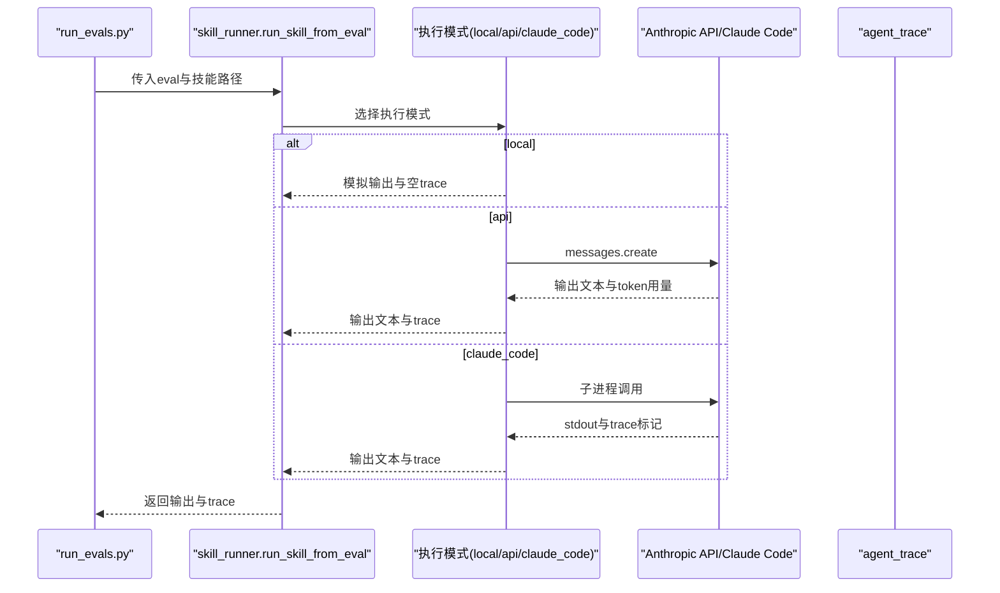
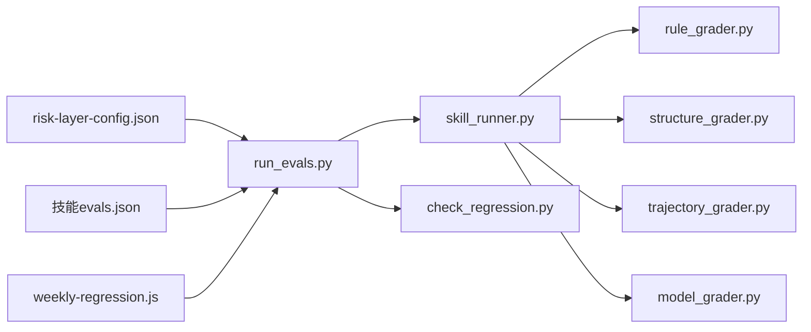

# 质量监控系统

<cite>
**本文档引用的文件**   
- [run_evals.py](file://plugins/frontend-team-toolkit/skill-engineering/scripts/run_evals.py)
- [check_regression.py](file://plugins/frontend-team-toolkit/skill-engineering/scripts/check_regression.py)
- [skill_runner.py](file://plugins/frontend-team-toolkit/skill-engineering/scripts/skill_runner.py)
- [rule_grader.py](file://plugins/frontend-team-toolkit/skill-engineering/scripts/graders/rule_grader.py)
- [structure_grader.py](file://plugins/frontend-team-toolkit/skill-engineering/scripts/graders/structure_grader.py)
- [trajectory_grader.py](file://plugins/frontend-team-toolkit/skill-engineering/scripts/graders/trajectory_grader.py)
- [model_grader.py](file://plugins/frontend-team-toolkit/skill-engineering/scripts/graders/model_grader.py)
- [risk-layer-config.json](file://plugins/frontend-team-toolkit/skill-engineering/config/risk-layer-config.json)
- [weekly-regression.js](file://plugins/frontend-team-toolkit/skill-engineering/templates/new-skill/workflows/weekly-regression.js)
- [evals.json（微信文章评审）](file://plugins/frontend-team-toolkit/skills/wechat-article-review/evals/evals.json)
- [evals.json（新技能模板）](file://plugins/frontend-team-toolkit/skill-engineering/templates/new-skill/evals/evals.json)
- [README.md（技能工程）](file://plugins/frontend-team-toolkit/skill-engineering/README.md)
</cite>

## 目录
1. [引言](#引言)
2. [项目结构](#项目结构)
3. [核心组件](#核心组件)
4. [架构总览](#架构总览)
5. [详细组件分析](#详细组件分析)
6. [依赖分析](#依赖分析)
7. [性能考虑](#性能考虑)
8. [故障排除指南](#故障排除指南)
9. [结论](#结论)
10. [附录](#附录)

## 引言
本文件面向“技能质量监控系统”，系统性阐述监控指标的实时采集、异常检测与告警机制，回归检测算法、性能基准线与阈值设定，监控数据的可视化展示、趋势分析与预测模型，违规行为的识别规则、检测算法与处理流程，以及监控系统的自动化配置、动态调整与扩展机制。同时提供监控API接口与集成方案，并分析系统的准确性、时效性与稳定性保障措施。

## 项目结构
该质量监控系统围绕“评估驱动的质量门禁”展开，核心由以下模块组成：
- 评估运行器：按CI模式（PR/Release/Scheduled）筛选并执行评估，产出TSV结果。
- 评估执行器：根据评估配置调用不同Grader进行判定。
- Grader集合：规则、结构、轨迹、模型（LLM Judge）四类自动判定器。
- 回归检查器：解析TSV结果，识别回归失败并决定阻断策略。
- 风险分层配置：定义不同模式的风险过滤、阻断策略与通知。
- 自动化回归工作流：支持Claude Code `/loop` 定期回归。
- 评估规范与模板：统一评估结构、类型与基线字段。

**图表来源**
- [run_evals.py:135-174](file://plugins/frontend-team-toolkit/skill-engineering/scripts/run_evals.py#L135-L174)
- [skill_runner.py:328-356](file://plugins/frontend-team-toolkit/skill-engineering/scripts/skill_runner.py#L328-L356)
- [check_regression.py:37-54](file://plugins/frontend-team-toolkit/skill-engineering/scripts/check_regression.py#L37-L54)
- [risk-layer-config.json:1-70](file://plugins/frontend-team-toolkit/skill-engineering/config/risk-layer-config.json#L1-L70)
- [weekly-regression.js:14-69](file://plugins/frontend-team-toolkit/skill-engineering/templates/new-skill/workflows/weekly-regression.js#L14-L69)
- [evals.json（新技能模板）:1-47](file://plugins/frontend-team-toolkit/skill-engineering/templates/new-skill/evals/evals.json#L1-L47)
- [evals.json（微信文章评审）:1-213](file://plugins/frontend-team-toolkit/skills/wechat-article-review/evals/evals.json#L1-L213)

**章节来源**
- [README.md（技能工程）:34-69](file://plugins/frontend-team-toolkit/skill-engineering/README.md#L34-L69)
- [README.md（技能工程）:168-236](file://plugins/frontend-team-toolkit/skill-engineering/README.md#L168-L236)

## 核心组件
- 评估运行器（run_evals.py）
  - 按模式加载风险分层配置，筛选评估集，调用执行器运行每个评估，使用对应Grader判定，汇总为TSV结果。
  - 支持PR/Release/Scheduled三种模式，按频率添加随机抽查。
- 评估执行器（skill_runner.py）
  - 支持本地模拟、Anthropic API、Claude Code三种执行模式；构建上下文与提示，抽取agent_trace用于轨迹判定。
- 四类Grader
  - 规则判定（rule_grader.py）：关键词/路径/禁用词检查。
  - 结构判定（structure_grader.py）：章节/步骤/YAML frontmatter检查。
  - 轨迹判定（trajectory_grader.py）：Agent/子Skill调用顺序与并发约束。
  - 模型判定（model_grader.py）：LLM Judge语义一致性，支持多样本投票。
- 回归检查器（check_regression.py）
  - 解析TSV，过滤“regression”类型与指定风险等级，统计失败数量，决定阻断或警告。
- 风险分层配置（risk-layer-config.json）
  - 定义PR/Release/Scheduled模式的风险过滤、阻断策略、半自动模型Grader采样与通知策略。
- 自动化回归工作流（weekly-regression.js）
  - 周期性运行评估，解析结果并上报问题或记录通过。

**章节来源**
- [run_evals.py:38-59](file://plugins/frontend-team-toolkit/skill-engineering/scripts/run_evals.py#L38-L59)
- [run_evals.py:135-174](file://plugins/frontend-team-toolkit/skill-engineering/scripts/run_evals.py#L135-L174)
- [skill_runner.py:308-326](file://plugins/frontend-team-toolkit/skill-engineering/scripts/skill_runner.py#L308-L326)
- [check_regression.py:22-34](file://plugins/frontend-team-toolkit/skill-engineering/scripts/check_regression.py#L22-L34)
- [risk-layer-config.json:1-70](file://plugins/frontend-team-toolkit/skill-engineering/config/risk-layer-config.json#L1-L70)
- [weekly-regression.js:14-69](file://plugins/frontend-team-toolkit/skill-engineering/templates/new-skill/workflows/weekly-regression.js#L14-L69)

## 架构总览
系统以“评估驱动”的质量门禁为核心，贯穿CI流水线与定期自动化回归，形成闭环：

**图表来源**
- [run_evals.py:189-224](file://plugins/frontend-team-toolkit/skill-engineering/scripts/run_evals.py#L189-L224)
- [check_regression.py:57-96](file://plugins/frontend-team-toolkit/skill-engineering/scripts/check_regression.py#L57-L96)
- [risk-layer-config.json:65-69](file://plugins/frontend-team-toolkit/skill-engineering/config/risk-layer-config.json#L65-L69)

## 详细组件分析

### 评估运行器（run_evals.py）
- 配置加载与模式选择
  - 从risk-layer-config.json读取PR/Release/Scheduled模式的风险过滤与阻断策略。
  - Scheduled模式支持按频率（weekly/monthly/quarterly）选择风险级别与随机抽查数量。
- 评估筛选与执行
  - 从技能目录读取evals.json，按风险过滤；复合Grader（如rule+human）拆解后逐一执行。
  - 每次评估调用skill_runner.py执行，得到输出与agent_trace，再交由对应Grader判定。
- 结果汇总与退出码
  - 将结果写入TSV，包含评估ID、通过状态、时间、评分者、风险等级、原因等字段。
  - 失败计数为0返回成功，否则失败。

**图表来源**
- [run_evals.py:135-174](file://plugins/frontend-team-toolkit/skill-engineering/scripts/run_evals.py#L135-L174)
- [run_evals.py:177-186](file://plugins/frontend-team-toolkit/skill-engineering/scripts/run_evals.py#L177-L186)
- [run_evals.py:189-224](file://plugins/frontend-team-toolkit/skill-engineering/scripts/run_evals.py#L189-L224)

**章节来源**
- [run_evals.py:38-59](file://plugins/frontend-team-toolkit/skill-engineering/scripts/run_evals.py#L38-L59)
- [run_evals.py:135-174](file://plugins/frontend-team-toolkit/skill-engineering/scripts/run_evals.py#L135-L174)
- [run_evals.py:177-186](file://plugins/frontend-team-toolkit/skill-engineering/scripts/run_evals.py#L177-L186)
- [run_evals.py:189-224](file://plugins/frontend-team-toolkit/skill-engineering/scripts/run_evals.py#L189-L224)

### 评估执行器（skill_runner.py）
- 执行模式
  - local：本地模拟输出与空agent_trace，便于测试与离线验证。
  - api：调用Anthropic API，构建完整提示，记录tokens用量与模型信息。
  - claude_code：调用Claude Code CLI，解析输出中的trace标记，生成agent_trace。
- 上下文构建
  - 从SKILL.md、output-contract.md、scoring-rubric.md等参考文件构建上下文，确保执行符合技能契约。
- 输出与trace
  - 返回输出文本与agent_trace，供轨迹Grader使用；对特定技能（如微信文章评审）提供模拟输出与问题清单。

**图表来源**
- [skill_runner.py:308-326](file://plugins/frontend-team-toolkit/skill-engineering/scripts/skill_runner.py#L308-L326)
- [skill_runner.py:199-257](file://plugins/frontend-team-toolkit/skill-engineering/scripts/skill_runner.py#L199-L257)
- [skill_runner.py:260-305](file://plugins/frontend-team-toolkit/skill-engineering/scripts/skill_runner.py#L260-L305)

**章节来源**
- [skill_runner.py:31-59](file://plugins/frontend-team-toolkit/skill-engineering/scripts/skill_runner.py#L31-L59)
- [skill_runner.py:62-81](file://plugins/frontend-team-toolkit/skill-engineering/scripts/skill_runner.py#L62-L81)
- [skill_runner.py:308-326](file://plugins/frontend-team-toolkit/skill-engineering/scripts/skill_runner.py#L308-L326)

### 规则判定器（rule_grader.py）
- 关键词/路径/禁用词检查
  - 支持“必须包含/不得包含”、“路径/章节”等模式匹配，失败时返回具体缺失项。
- 适用场景
  - 输出完整性与合规性检查，如必须包含契约文件路径、不得出现TODO等。

**章节来源**
- [rule_grader.py:41-92](file://plugins/frontend-team-toolkit/skill-engineering/scripts/graders/rule_grader.py#L41-L92)

### 结构判定器（structure_grader.py）
- 章节/步骤/YAML frontmatter检查
  - 支持多种章节命名风格与frontmatter字段校验，必要时检查步骤序列。
- 适用场景
  - 技能文档结构一致性与元数据完整性。

**章节来源**
- [structure_grader.py:63-122](file://plugins/frontend-team-toolkit/skill-engineering/scripts/graders/structure_grader.py#L63-L122)

### 轨迹判定器（trajectory_grader.py）
- Agent/子Skill调用顺序与并发约束
  - 从agent_trace提取Read/Agent调用序列，检查是否按期望顺序执行、是否串行/并行。
- 适用场景
  - 动态编排正确性与执行路径验证。

**章节来源**
- [trajectory_grader.py:59-139](file://plugins/frontend-team-toolkit/skill-engineering/scripts/graders/trajectory_grader.py#L59-L139)

### 模型判定器（model_grader.py）
- LLM Judge语义一致性
  - 构建Judge提示，逐条核对“必须满足/不得违反”，支持本地模拟与API模式。
- 多样本投票
  - 可配置采样次数，多数通过则通过，多数失败则失败，缓解漂移。
- 适用场景
  - 半自动语义质量门禁，降低回归漂移风险。

**章节来源**
- [model_grader.py:184-226](file://plugins/frontend-team-toolkit/skill-engineering/scripts/graders/model_grader.py#L184-L226)
- [model_grader.py:202-222](file://plugins/frontend-team-toolkit/skill-engineering/scripts/graders/model_grader.py#L202-L222)

### 回归检查器（check_regression.py）
- 输入与过滤
  - 读取TSV，仅保留type包含“regression”的记录，并按风险等级过滤。
- 失败判定
  - pass字段为“❌/0/FAIL/false”即视为失败；支持阻断或警告两种策略。
- 输出与退出码
  - 打印失败列表与统计，阻断模式失败时退出码为1，否则为0。

**章节来源**
- [check_regression.py:22-34](file://plugins/frontend-team-toolkit/skill-engineering/scripts/check_regression.py#L22-L34)
- [check_regression.py:37-54](file://plugins/frontend-team-toolkit/skill-engineering/scripts/check_regression.py#L37-L54)
- [check_regression.py:57-96](file://plugins/frontend-team-toolkit/skill-engineering/scripts/check_regression.py#L57-L96)

### 风险分层配置（risk-layer-config.json）
- 模式配置
  - pr_mode：PR触发，跑high+medium，high回归失败阻断。
  - release_mode：发布前全量，任意回归失败阻断。
  - scheduled_mode：按频率选择风险与抽查数量。
- Grader配置
  - rule/structure/trajectory：完全自动，漂移风险none。
  - model：半自动，支持采样与抽查率，漂移风险medium。
  - human：人工，非自动。
- 红线与告警
  - red_lines：block_on/warn_on定义阻断与警告事件类型。
  - notifications：Slack通道、邮箱、PR评论开关。

**章节来源**
- [risk-layer-config.json:1-70](file://plugins/frontend-team-toolkit/skill-engineering/config/risk-layer-config.json#L1-L70)

### 自动化回归工作流（weekly-regression.js）
- 周期性执行
  - 通过Claude Code `/loop`命令触发，按风险过滤运行评估。
- 结果处理
  - 解析regression失败并上报，否则记录通过；返回结构化状态与消息。

**章节来源**
- [weekly-regression.js:14-69](file://plugins/frontend-team-toolkit/skill-engineering/templates/new-skill/workflows/weekly-regression.js#L14-L69)

### 评估规范与基线（evals.json）
- 评估类型与字段
  - type：regression/capability；risk：high/medium/low；grader：rule/structure/trajectory/model/human。
  - artifact/baseline_score等字段用于基线与回归对比。
- 示例
  - 微信文章评审技能包含大量regression与capability评估，覆盖弱稿、缺正文、承诺未兑现、边界分数等场景。

**章节来源**
- [evals.json（新技能模板）:1-47](file://plugins/frontend-team-toolkit/skill-engineering/templates/new-skill/evals/evals.json#L1-L47)
- [evals.json（微信文章评审）:1-213](file://plugins/frontend-team-toolkit/skills/wechat-article-review/evals/evals.json#L1-L213)

## 依赖分析
- 组件耦合
  - run_evals.py依赖risk-layer-config.json与技能evals.json；依赖skill_runner.py执行评估；依赖各Grader进行判定。
  - skill_runner.py依赖环境变量控制执行模式，依赖参考文件构建上下文。
  - check_regression.py依赖TSV格式约定。
- 外部依赖
  - anthropic Python SDK（API模式与模型判定器）。
  - Claude Code CLI（本地编排与trace解析）。
- 潜在循环依赖
  - 当前脚本均为独立模块，无直接循环导入。

**图表来源**
- [run_evals.py:135-174](file://plugins/frontend-team-toolkit/skill-engineering/scripts/run_evals.py#L135-L174)
- [skill_runner.py:308-326](file://plugins/frontend-team-toolkit/skill-engineering/scripts/skill_runner.py#L308-L326)
- [check_regression.py:57-96](file://plugins/frontend-team-toolkit/skill-engineering/scripts/check_regression.py#L57-L96)
- [risk-layer-config.json:1-70](file://plugins/frontend-team-toolkit/skill-engineering/config/risk-layer-config.json#L1-L70)
- [weekly-regression.js:14-69](file://plugins/frontend-team-toolkit/skill-engineering/templates/new-skill/workflows/weekly-regression.js#L14-L69)

**章节来源**
- [run_evals.py:38-59](file://plugins/frontend-team-toolkit/skill-engineering/scripts/run_evals.py#L38-L59)
- [skill_runner.py:308-326](file://plugins/frontend-team-toolkit/skill-engineering/scripts/skill_runner.py#L308-L326)

## 性能考虑
- 执行模式选择
  - local模式适合快速验证与离线测试；API模式具备更强语义能力但成本更高；claude_code适合本地编排与trace收集。
- 模型判定采样
  - model_grader支持多样本投票，平衡成本与稳定性；可通过环境变量调整采样次数。
- 评估筛选与抽查
  - scheduled模式的spot check减少全量评估成本，兼顾覆盖率与效率。
- I/O与超时
  - Claude Code执行设置超时保护，避免长时间阻塞；API调用捕获异常并回退至本地模式。

**章节来源**
- [model_grader.py:202-222](file://plugins/frontend-team-toolkit/skill-engineering/scripts/graders/model_grader.py#L202-L222)
- [run_evals.py:76-81](file://plugins/frontend-team-toolkit/skill-engineering/scripts/run_evals.py#L76-L81)
- [skill_runner.py:298-305](file://plugins/frontend-team-toolkit/skill-engineering/scripts/skill_runner.py#L298-L305)

## 故障排除指南
- API密钥缺失
  - model_grader与skill_runner在API模式下依赖密钥；缺失时会回退至本地模拟或打印警告。
- Claude Code不可用
  - 未安装CLI或超时将回退至本地模式；检查路径与权限。
- TSV格式异常
  - check_regression.py严格依赖TSV字段；确保run_evals.py输出格式一致。
- 评估未命中基线
  - 新增评估或变更技能需先跑baseline并写入results.tsv；使用check_new_evals.py辅助校验（脚本存在但未在本节深入分析）。
- 通知未送达
  - 检查risk-layer-config.json中的通知配置（Slack/邮箱/PR评论）。

**章节来源**
- [model_grader.py:71-94](file://plugins/frontend-team-toolkit/skill-engineering/scripts/graders/model_grader.py#L71-L94)
- [skill_runner.py:205-207](file://plugins/frontend-team-toolkit/skill-engineering/scripts/skill_runner.py#L205-L207)
- [skill_runner.py:298-305](file://plugins/frontend-team-toolkit/skill-engineering/scripts/skill_runner.py#L298-L305)
- [check_regression.py:24-26](file://plugins/frontend-team-toolkit/skill-engineering/scripts/check_regression.py#L24-L26)
- [risk-layer-config.json:65-69](file://plugins/frontend-team-toolkit/skill-engineering/config/risk-layer-config.json#L65-L69)

## 结论
该质量监控系统以评估驱动的质量门禁为核心，通过风险分层配置与多Grader组合实现“可自动、可半自动、可人工”的分级判定；结合CI与定期自动化回归，形成闭环。系统在准确性上依赖规则、结构、轨迹与LLM Judge的互补，在时效性上通过模式化筛选与抽查控制成本，在稳定性上通过回退策略与异常处理保障。建议持续完善可视化与趋势分析能力，并扩展预测模型以提前预警潜在回归风险。

## 附录

### 监控API接口与集成方案
- 评估运行API（run_evals.py）
  - 参数：mode（pr/release/scheduled）、skill、frequency（可选）、skill-base-path、output（TSV输出路径）。
  - 返回：退出码（0/1）、TSV结果文件、控制台摘要。
- 回归检查API（check_regression.py）
  - 参数：results（TSV路径）、risk（high/medium/low/all）、block（是否阻断）。
  - 返回：失败计数、失败列表、退出码。
- 集成建议
  - 在CI中调用run_evals.py后立即调用check_regression.py；根据退出码决定是否阻断合并。
  - 使用risk-layer-config.json集中管理模式与阻断策略，便于跨技能统一治理。

**章节来源**
- [run_evals.py:189-224](file://plugins/frontend-team-toolkit/skill-engineering/scripts/run_evals.py#L189-L224)
- [check_regression.py:57-96](file://plugins/frontend-team-toolkit/skill-engineering/scripts/check_regression.py#L57-L96)
- [risk-layer-config.json:1-70](file://plugins/frontend-team-toolkit/skill-engineering/config/risk-layer-config.json#L1-L70)

### 准确性、时效性与稳定性保障措施
- 准确性
  - 规则/结构/轨迹三类完全自动判定提供强约束；模型判定器通过多样本投票降低漂移风险。
- 时效性
  - PR模式仅跑high+medium，发布前全量回归，定期回归采用抽查，平衡速度与覆盖。
- 稳定性
  - API模式异常回退本地；CLI超时保护；TSV格式标准化；配置集中化管理。

**章节来源**
- [model_grader.py:202-222](file://plugins/frontend-team-toolkit/skill-engineering/scripts/graders/model_grader.py#L202-L222)
- [run_evals.py:144-163](file://plugins/frontend-team-toolkit/skill-engineering/scripts/run_evals.py#L144-L163)
- [skill_runner.py:298-305](file://plugins/frontend-team-toolkit/skill-engineering/scripts/skill_runner.py#L298-L305)