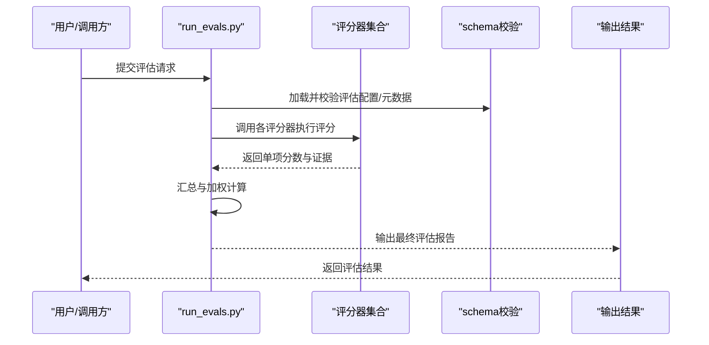
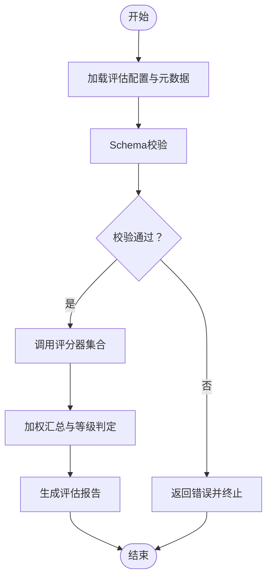
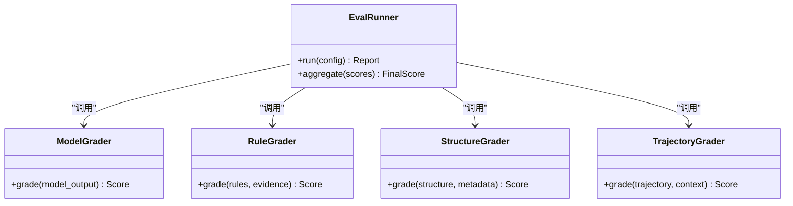
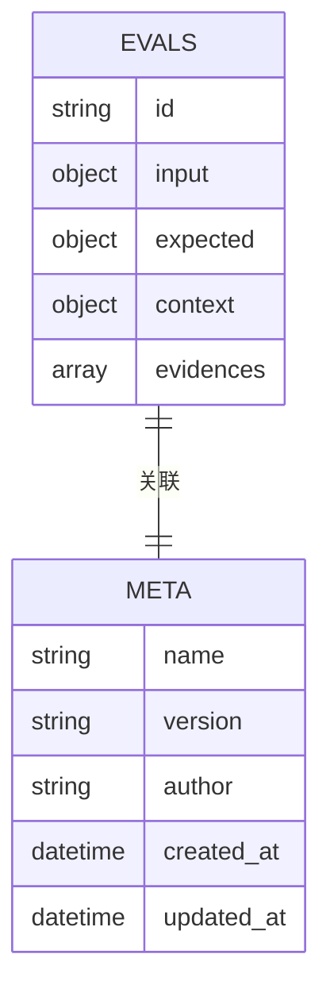
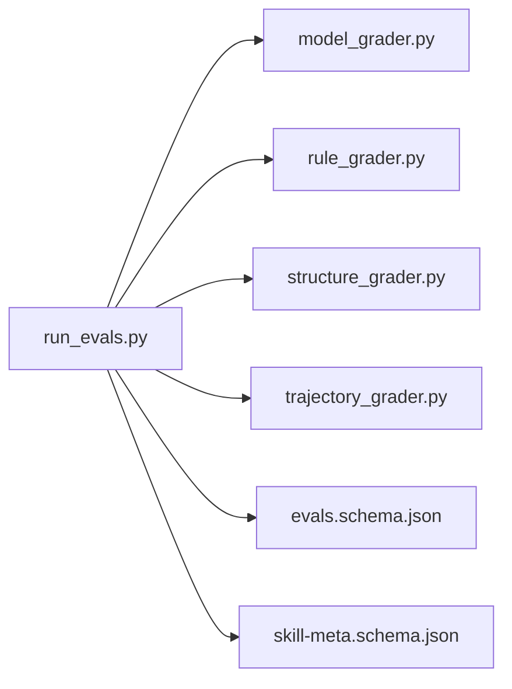

# 质量评价体系

<cite>
**本文引用的文件**
- [README.md](file://README.md)
- [CURSOR_TEAM_MARKETPLACE_PLUGIN_HANDBOOK.md](file://CURSOR_TEAM_MARKETPLACE_PLUGIN_HANDBOOK.md)
- [WECHAT_TEAM_MARKETPLACE_PLUGIN_GUIDE.md](file://WECHAT_TEAM_MARKETPLACE_PLUGIN_GUIDE.md)
- [plugins/frontend-team-toolkit/README.md](file://plugins/frontend-team-toolkit/README.md)
- [plugins/frontend-team-toolkit/skill-engineering/README.md](file://plugins/frontend-team-toolkit/skill-engineering/README.md)
- [plugins/frontend-team-toolkit/skill-engineering/docs/lifecycle-quickref.md](file://plugins/frontend-team-toolkit/skill-engineering/docs/lifecycle-quickref.md)
- [plugins/frontend-team-toolkit/skill-engineering/schemas/evals.schema.json](file://plugins/frontend-team-toolkit/skill-engineering/schemas/evals.schema.json)
- [plugins/frontend-team-toolkit/skill-engineering/schemas/skill-meta.schema.json](file://plugins/frontend-team-toolkit/skill-engineering/schemas/skill-meta.schema.json)
- [plugins/frontend-team-toolkit/skill-engineering/scripts/graders/model_grader.py](file://plugins/frontend-team-toolkit/skill-engineering/scripts/graders/model_grader.py)
- [plugins/frontend-team-toolkit/skill-engineering/scripts/graders/rule_grader.py](file://plugins/frontend-team-toolkit/skill-engineering/scripts/graders/rule_grader.py)
- [plugins/frontend-team-toolkit/skill-engineering/scripts/graders/structure_grader.py](file://plugins/frontend-team-toolkit/skill-engineering/scripts/graders/structure_grader.py)
- [plugins/frontend-team-toolkit/skill-engineering/scripts/graders/trajectory_grader.py](file://plugins/frontend-team-toolkit/skill-engineering/scripts/graders/trajectory_grader.py)
- [plugins/frontend-team-toolkit/skill-engineering/scripts/run_evals.py](file://plugins/frontend-team-toolkit/skill-engineering/scripts/run_evals.py)
- [plugins/frontend-team-toolkit/skill-engineering/scripts/check_new_evals.py](file://plugins/frontend-team-toolkit/skill-engineering/scripts/check_new_evals.py)
- [plugins/frontend-team-toolkit/skill-engineering/scripts/check_regression.py](file://plugins/frontend-team-toolkit/skill-engineering/scripts/check_regression.py)
- [plugins/frontend-team-toolkit/skill-engineering/templates/new-skill/SKILL.md](file://plugins/frontend-team-toolkit/skill-engineering/templates/new-skill/SKILL.md)
- [plugins/frontend-team-toolkit/skill-engineering/templates/new-skill/references/output-contract.md](file://plugins/frontend-team-toolkit/skill-engineering/templates/new-skill/references/output-contract.md)
- [plugins/frontend-team-toolkit/skill-engineering/templates/new-skill/workflows/README.md](file://plugins/frontend-team-toolkit/skill-engineering/templates/new-skill/workflows/README.md)
- [plugins/frontend-team-toolkit/skills/wechat-article-review/references/scoring-rubric.md](file://plugins/frontend-team-toolkit/skills/wechat-article-review/references/scoring-rubric.md)
- [plugins/frontend-team-toolkit/skills/wechat-article-review/reviews/2026-05-30-skill-engineering-blueprint-v2.md](file://plugins/frontend-team-toolkit/skills/wechat-article-review/reviews/2026-05-30-skill-engineering-blueprint-v2.md)
- [plugins/frontend-team-toolkit/skills/wechat-article-review/reviews/2026-05-30-skill-engineering-blueprint.md](file://plugins/frontend-team-toolkit/skills/wechat-article-review/reviews/2026-05-30-skill-engineering-blueprint.md)
- [plugins/frontend-team-toolkit/skills/skills-quality/README.md](file://plugins/frontend-team-toolkit/skills/skills-quality/README.md)
- [plugins/frontend-team-toolkit/skills/skills-quality/eval-plan.md](file://plugins/frontend-team-toolkit/skills/skills-quality/eval-plan.md)
- [plugins/frontend-team-toolkit/skills/skills-quality/skill-issues.jsonl](file://plugins/frontend-team-toolkit/skills/skills-quality/skill-issues.jsonl)
</cite>

## 目录
1. [引言](#引言)
2. [项目结构](#项目结构)
3. [核心组件](#核心组件)
4. [架构总览](#架构总览)
5. [详细组件分析](#详细组件分析)
6. [依赖关系分析](#依赖关系分析)
7. [性能考量](#性能考量)
8. [故障排查指南](#故障排查指南)
9. [结论](#结论)
10. [附录](#附录)

## 引言
本文件面向“技能质量评价体系”的设计与实施，结合仓库中现有的评估框架、评分规则、评审蓝图与质量计划等材料，系统化梳理从指标设计、权重分配、评分算法到数据采集、审核与信誉建设的全流程。同时，基于现有脚本与模板，给出可落地的监控、违规检测与惩罚建议，并提供API与数据模型的抽象说明，以及公平性、透明度与反作弊策略。

## 项目结构
该仓库围绕“前端团队市场”主题，构建了完整的技能工程与质量评估子系统，主要由以下部分组成：
- 技能工程框架：包含评估脚本、评分器、工作流与模板，支撑标准化的质量评测。
- 评审与评分材料：如评分细则、评审蓝图等，用于指导人工或半自动评分。
- 质量计划与问题追踪：记录评估计划、问题清单与改进方向。
- 市场化文档：面向团队与用户的使用手册与指南。

```mermaid
graph TB
subgraph "技能工程框架"
A["评估脚本<br/>run_evals.py"]
B["评分器集合<br/>model_grader.py / rule_grader.py / structure_grader.py / trajectory_grader.py"]
C["评估计划与模板<br/>evals.schema.json / skill-meta.schema.json / SKILL.md"]
D["工作流与输出契约<br/>workflows/README.md / output-contract.md"]
end
subgraph "评审与评分"
E["评分细则<br/>scoring-rubric.md"]
F["评审蓝图<br/>reviews/*.md"]
end
subgraph "质量计划与追踪"
G["质量计划<br/>skills-quality/eval-plan.md"]
H["问题清单<br/>skills-quality/skill-issues.jsonl"]
I["质量说明<br/>skills-quality/README.md"]
end
subgraph "市场文档"
J["团队手册<br/>CURSOR_TEAM_MARKETPLACE_PLUGIN_HANDBOOK.md"]
K["微信指南<br/>WECHAT_TEAM_MARKETPLACE_PLUGIN_GUIDE.md"]
L["通用说明<br/>README.md"]
end
A --> B
B --> C
C --> D
E --> F
G --> H
I --> G
J --> K
K --> L
```

**图表来源**
- [plugins/frontend-team-toolkit/skill-engineering/scripts/run_evals.py:1-200](file://plugins/frontend-team-toolkit/skill-engineering/scripts/run_evals.py#L1-L200)
- [plugins/frontend-team-toolkit/skill-engineering/scripts/graders/model_grader.py:1-200](file://plugins/frontend-team-toolkit/skill-engineering/scripts/graders/model_grader.py#L1-L200)
- [plugins/frontend-team-toolkit/skill-engineering/schemas/evals.schema.json:1-200](file://plugins/frontend-team-toolkit/skill-engineering/schemas/evals.schema.json#L1-L200)
- [plugins/frontend-team-toolkit/skill-engineering/templates/new-skill/SKILL.md:1-200](file://plugins/frontend-team-toolkit/skill-engineering/templates/new-skill/SKILL.md#L1-L200)
- [plugins/frontend-team-toolkit/skills/wechat-article-review/references/scoring-rubric.md:1-200](file://plugins/frontend-team-toolkit/skills/wechat-article-review/references/scoring-rubric.md#L1-L200)
- [plugins/frontend-team-toolkit/skills/wechat-article-review/reviews/2026-05-30-skill-engineering-blueprint-v2.md:1-200](file://plugins/frontend-team-toolkit/skills/wechat-article-review/reviews/2026-05-30-skill-engineering-blueprint-v2.md#L1-L200)
- [plugins/frontend-team-toolkit/skills/skills-quality/eval-plan.md:1-200](file://plugins/frontend-team-toolkit/skills/skills-quality/eval-plan.md#L1-L200)
- [plugins/frontend-team-toolkit/skills/skills-quality/skill-issues.jsonl:1-200](file://plugins/frontend-team-toolkit/skills/skills-quality/skill-issues.jsonl#L1-L200)
- [CURSOR_TEAM_MARKETPLACE_PLUGIN_HANDBOOK.md:1-200](file://CURSOR_TEAM_MARKETPLACE_PLUGIN_HANDBOOK.md#L1-L200)
- [WECHAT_TEAM_MARKETPLACE_PLUGIN_GUIDE.md:1-200](file://WECHAT_TEAM_MARKETPLACE_PLUGIN_GUIDE.md#L1-L200)
- [README.md:1-200](file://README.md#L1-L200)

**章节来源**
- [README.md:1-200](file://README.md#L1-L200)
- [plugins/frontend-team-toolkit/README.md:1-200](file://plugins/frontend-team-toolkit/README.md#L1-L200)
- [plugins/frontend-team-toolkit/skill-engineering/README.md:1-200](file://plugins/frontend-team-toolkit/skill-engineering/README.md#L1-L200)

## 核心组件
- 评估执行引擎：负责调度评估任务、加载数据与运行评分器，产出评估结果。
- 多维评分器：分别针对模型输出、规则遵循、结构完整性与轨迹一致性进行打分。
- 评估与元数据模式：定义评估输入、输出与元信息的数据结构，确保数据一致性。
- 评审与评分材料：提供评分细则与评审蓝图，作为人工复核与质量把关的依据。
- 质量计划与问题追踪：以计划与问题清单驱动持续改进。
- 市场文档：为用户提供使用指南与规范说明。

**章节来源**
- [plugins/frontend-team-toolkit/skill-engineering/scripts/run_evals.py:1-200](file://plugins/frontend-team-toolkit/skill-engineering/scripts/run_evals.py#L1-L200)
- [plugins/frontend-team-toolkit/skill-engineering/scripts/graders/model_grader.py:1-200](file://plugins/frontend-team-toolkit/skill-engineering/scripts/graders/model_grader.py#L1-L200)
- [plugins/frontend-team-toolkit/skill-engineering/schemas/evals.schema.json:1-200](file://plugins/frontend-team-toolkit/skill-engineering/schemas/evals.schema.json#L1-L200)
- [plugins/frontend-team-toolkit/skill-engineering/schemas/skill-meta.schema.json:1-200](file://plugins/frontend-team-toolkit/skill-engineering/schemas/skill-meta.schema.json#L1-L200)
- [plugins/frontend-team-toolkit/skills/wechat-article-review/references/scoring-rubric.md:1-200](file://plugins/frontend-team-toolkit/skills/wechat-article-review/references/scoring-rubric.md#L1-L200)
- [plugins/frontend-team-toolkit/skills/skills-quality/eval-plan.md:1-200](file://plugins/frontend-team-toolkit/skills/skills-quality/eval-plan.md#L1-L200)
- [plugins/frontend-team-toolkit/skills/skills-quality/skill-issues.jsonl:1-200](file://plugins/frontend-team-toolkit/skills/skills-quality/skill-issues.jsonl#L1-L200)

## 架构总览
下图展示了从“评估任务”到“评分结果”的端到端流程，包括自动化评分与人工评审的协同。

**图表来源**
- [plugins/frontend-team-toolkit/skill-engineering/scripts/run_evals.py:1-200](file://plugins/frontend-team-toolkit/skill-engineering/scripts/run_evals.py#L1-L200)
- [plugins/frontend-team-toolkit/skill-engineering/scripts/graders/model_grader.py:1-200](file://plugins/frontend-team-toolkit/skill-engineering/scripts/graders/model_grader.py#L1-L200)
- [plugins/frontend-team-toolkit/skill-engineering/schemas/evals.schema.json:1-200](file://plugins/frontend-team-toolkit/skill-engineering/schemas/evals.schema.json#L1-L200)

## 详细组件分析

### 评估执行引擎（run_evals.py）
- 职责：统一调度评估流程，加载评估配置与数据，调用评分器，汇总结果并生成报告。
- 关键流程：
  - 配置加载与校验：依据评估模式与元数据模式进行约束检查。
  - 评分器编排：按顺序或并行方式调用多维评分器。
  - 结果聚合：对单项分数进行加权汇总，形成最终质量等级与建议。
- 可扩展点：支持插件式评分器接入，便于新增维度或调整权重。

**图表来源**
- [plugins/frontend-team-toolkit/skill-engineering/scripts/run_evals.py:1-200](file://plugins/frontend-team-toolkit/skill-engineering/scripts/run_evals.py#L1-L200)
- [plugins/frontend-team-toolkit/skill-engineering/schemas/evals.schema.json:1-200](file://plugins/frontend-team-toolkit/skill-engineering/schemas/evals.schema.json#L1-L200)

**章节来源**
- [plugins/frontend-team-toolkit/skill-engineering/scripts/run_evals.py:1-200](file://plugins/frontend-team-toolkit/skill-engineering/scripts/run_evals.py#L1-L200)

### 多维评分器（graders）
- 模型评分器（model_grader）：评估模型输出质量，关注准确性、相关性与鲁棒性。
- 规则评分器（rule_grader）：检查是否符合预设规则与约束。
- 结构评分器（structure_grader）：评估输出结构完整性与一致性。
- 轨迹评分器（trajectory_grader）：衡量交互过程的合理性与时序逻辑。
- 统一接口：评分器均实现一致的输入输出约定，便于组合与扩展。

**图表来源**
- [plugins/frontend-team-toolkit/skill-engineering/scripts/graders/model_grader.py:1-200](file://plugins/frontend-team-toolkit/skill-engineering/scripts/graders/model_grader.py#L1-L200)
- [plugins/frontend-team-toolkit/skill-engineering/scripts/graders/rule_grader.py:1-200](file://plugins/frontend-team-toolkit/skill-engineering/scripts/graders/rule_grader.py#L1-L200)
- [plugins/frontend-team-toolkit/skill-engineering/scripts/graders/structure_grader.py:1-200](file://plugins/frontend-team-toolkit/skill-engineering/scripts/graders/structure_grader.py#L1-L200)
- [plugins/frontend-team-toolkit/skill-engineering/scripts/graders/trajectory_grader.py:1-200](file://plugins/frontend-team-toolkit/skill-engineering/scripts/graders/trajectory_grader.py#L1-L200)
- [plugins/frontend-team-toolkit/skill-engineering/scripts/run_evals.py:1-200](file://plugins/frontend-team-toolkit/skill-engineering/scripts/run_evals.py#L1-L200)

**章节来源**
- [plugins/frontend-team-toolkit/skill-engineering/scripts/graders/model_grader.py:1-200](file://plugins/frontend-team-toolkit/skill-engineering/scripts/graders/model_grader.py#L1-L200)
- [plugins/frontend-team-toolkit/skill-engineering/scripts/graders/rule_grader.py:1-200](file://plugins/frontend-team-toolkit/skill-engineering/scripts/graders/rule_grader.py#L1-L200)
- [plugins/frontend-team-toolkit/skill-engineering/scripts/graders/structure_grader.py:1-200](file://plugins/frontend-team-toolkit/skill-engineering/scripts/graders/structure_grader.py#L1-L200)
- [plugins/frontend-team-toolkit/skill-engineering/scripts/graders/trajectory_grader.py:1-200](file://plugins/frontend-team-toolkit/skill-engineering/scripts/graders/trajectory_grader.py#L1-L200)

### 评估与元数据模式（schemas）
- 评估模式（evals.schema.json）：定义评估输入、期望输出与上下文字段，确保数据结构一致。
- 元数据模式（skill-meta.schema.json）：定义技能元信息字段，如名称、版本、作者、创建时间等。
- 作用：在评估执行前进行强约束校验，避免脏数据进入评分流程。

**图表来源**
- [plugins/frontend-team-toolkit/skill-engineering/schemas/evals.schema.json:1-200](file://plugins/frontend-team-toolkit/skill-engineering/schemas/evals.schema.json#L1-L200)
- [plugins/frontend-team-toolkit/skill-engineering/schemas/skill-meta.schema.json:1-200](file://plugins/frontend-team-toolkit/skill-engineering/schemas/skill-meta.schema.json#L1-L200)

**章节来源**
- [plugins/frontend-team-toolkit/skill-engineering/schemas/evals.schema.json:1-200](file://plugins/frontend-team-toolkit/skill-engineering/schemas/evals.schema.json#L1-L200)
- [plugins/frontend-team-toolkit/skill-engineering/schemas/skill-meta.schema.json:1-200](file://plugins/frontend-team-toolkit/skill-engineering/schemas/skill-meta.schema.json#L1-L200)

### 评审与评分材料（scoring-rubric 与 blueprint）
- 评分细则（scoring-rubric.md）：明确各项指标的评分标准、分档区间与扣分依据。
- 评审蓝图（reviews/*.md）：提供评审视角与关注点，辅助人工复核与交叉验证。
- 用途：作为评分器输出的补充与校准，提升主观评分的可比性与一致性。

**章节来源**
- [plugins/frontend-team-toolkit/skills/wechat-article-review/references/scoring-rubric.md:1-200](file://plugins/frontend-team-toolkit/skills/wechat-article-review/references/scoring-rubric.md#L1-L200)
- [plugins/frontend-team-toolkit/skills/wechat-article-review/reviews/2026-05-30-skill-engineering-blueprint-v2.md:1-200](file://plugins/frontend-team-toolkit/skills/wechat-article-review/reviews/2026-05-30-skill-engineering-blueprint-v2.md#L1-L200)
- [plugins/frontend-team-toolkit/skills/wechat-article-review/reviews/2026-05-30-skill-engineering-blueprint.md:1-200](file://plugins/frontend-team-toolkit/skills/wechat-article-review/reviews/2026-05-30-skill-engineering-blueprint.md#L1-L200)

### 质量计划与问题追踪（skills-quality）
- 质量计划（eval-plan.md）：定义评估周期、覆盖范围与改进目标。
- 问题清单（skill-issues.jsonl）：记录已发现的问题与修复进展，支撑持续改进闭环。
- 质量说明（README.md）：概述质量体系的目标与方法论。

**章节来源**
- [plugins/frontend-team-toolkit/skills/skills-quality/eval-plan.md:1-200](file://plugins/frontend-team-toolkit/skills/skills-quality/eval-plan.md#L1-L200)
- [plugins/frontend-team-toolkit/skills/skills-quality/skill-issues.jsonl:1-200](file://plugins/frontend-team-toolkit/skills/skills-quality/skill-issues.jsonl#L1-L200)
- [plugins/frontend-team-toolkit/skills/skills-quality/README.md:1-200](file://plugins/frontend-team-toolkit/skills/skills-quality/README.md#L1-L200)

### 工作流与输出契约（templates/new-skill）
- 工作流（workflows/README.md）：定义评估执行的工作流步骤与并行策略。
- 输出契约（references/output-contract.md）：明确评估输出的格式、字段与质量要求，确保下游消费稳定。

**章节来源**
- [plugins/frontend-team-toolkit/skill-engineering/templates/new-skill/workflows/README.md:1-200](file://plugins/frontend-team-toolkit/skill-engineering/templates/new-skill/workflows/README.md#L1-L200)
- [plugins/frontend-team-toolkit/skill-engineering/templates/new-skill/references/output-contract.md:1-200](file://plugins/frontend-team-toolkit/skill-engineering/templates/new-skill/references/output-contract.md#L1-L200)

## 依赖关系分析
- 低耦合高内聚：评估执行引擎仅依赖评分器接口与模式校验，不直接耦合具体业务逻辑。
- 扩展性强：新增评分维度只需实现统一接口并接入执行引擎。
- 数据一致性：通过模式文件保障输入输出结构，降低歧义与解析成本。

**图表来源**
- [plugins/frontend-team-toolkit/skill-engineering/scripts/run_evals.py:1-200](file://plugins/frontend-team-toolkit/skill-engineering/scripts/run_evals.py#L1-L200)
- [plugins/frontend-team-toolkit/skill-engineering/scripts/graders/model_grader.py:1-200](file://plugins/frontend-team-toolkit/skill-engineering/scripts/graders/model_grader.py#L1-L200)
- [plugins/frontend-team-toolkit/skill-engineering/scripts/graders/rule_grader.py:1-200](file://plugins/frontend-team-toolkit/skill-engineering/scripts/graders/rule_grader.py#L1-L200)
- [plugins/frontend-team-toolkit/skill-engineering/scripts/graders/structure_grader.py:1-200](file://plugins/frontend-team-toolkit/skill-engineering/scripts/graders/structure_grader.py#L1-L200)
- [plugins/frontend-team-toolkit/skill-engineering/scripts/graders/trajectory_grader.py:1-200](file://plugins/frontend-team-toolkit/skill-engineering/scripts/graders/trajectory_grader.py#L1-L200)
- [plugins/frontend-team-toolkit/skill-engineering/schemas/evals.schema.json:1-200](file://plugins/frontend-team-toolkit/skill-engineering/schemas/evals.schema.json#L1-L200)
- [plugins/frontend-team-toolkit/skill-engineering/schemas/skill-meta.schema.json:1-200](file://plugins/frontend-team-toolkit/skill-engineering/schemas/skill-meta.schema.json#L1-L200)

**章节来源**
- [plugins/frontend-team-toolkit/skill-engineering/scripts/run_evals.py:1-200](file://plugins/frontend-team-toolkit/skill-engineering/scripts/run_evals.py#L1-L200)

## 性能考量
- 并行化：在保证数据一致性前提下，对独立评分器进行并行执行，缩短评估时延。
- 缓存与增量：对重复评估场景引入缓存与增量校验，减少无效计算。
- 资源隔离：将评分器与执行引擎置于独立进程或容器，避免资源争用。
- 监控与告警：在评估执行引擎中埋点关键指标（吞吐、延迟、失败率），建立告警机制。

## 故障排查指南
- 配置错误：若评估失败，优先检查评估模式与元数据模式是否匹配，确认必填字段完整。
- 评分器异常：逐个禁用评分器定位问题，查看评分器日志与异常堆栈。
- 数据污染：对异常样本进行抽样回溯，修正上游数据或评分规则。
- 回归检测：利用回归检查脚本定期扫描新旧版本差异，及时发现退化。

**章节来源**
- [plugins/frontend-team-toolkit/skill-engineering/scripts/check_regression.py:1-200](file://plugins/frontend-team-toolkit/skill-engineering/scripts/check_regression.py#L1-L200)
- [plugins/frontend-team-toolkit/skill-engineering/scripts/check_new_evals.py:1-200](file://plugins/frontend-team-toolkit/skill-engineering/scripts/check_new_evals.py#L1-L200)

## 结论
本质量评价体系以“模式约束+多维评分器+评审蓝图+质量计划”为核心，实现了从自动化评估到人工复核再到持续改进的闭环。通过清晰的接口与数据模型，既保证了执行效率，也为未来扩展与优化提供了空间。建议在后续迭代中进一步完善违规检测与信誉体系、可视化展示与统计分析模块，以提升系统的公平性、透明度与抗作弊能力。

## 附录

### 评价指标设计原则与权重分配
- 设计原则
  - 可观测性：指标应可量化、可回溯、可对比。
  - 独立性：各维度尽量解耦，避免重复计算。
  - 可解释性：评分器输出需附带证据与置信度。
  - 动态适配：权重随业务阶段与风险偏好调整。
- 权重分配
  - 建议采用“规则遵循（30%）+结构完整性（25%）+模型输出（30%）+轨迹一致性（15%）”的初始权重，结合实际评估结果进行A/B校准。
  - 评审蓝图与评分细则用于微调权重与阈值，确保主观评分与客观评分一致。

**章节来源**
- [plugins/frontend-team-toolkit/skills/wechat-article-review/references/scoring-rubric.md:1-200](file://plugins/frontend-team-toolkit/skills/wechat-article-review/references/scoring-rubric.md#L1-L200)
- [plugins/frontend-team-toolkit/skill-engineering/scripts/graders/rule_grader.py:1-200](file://plugins/frontend-team-toolkit/skill-engineering/scripts/graders/rule_grader.py#L1-L200)
- [plugins/frontend-team-toolkit/skill-engineering/scripts/graders/structure_grader.py:1-200](file://plugins/frontend-team-toolkit/skill-engineering/scripts/graders/structure_grader.py#L1-L200)
- [plugins/frontend-team-toolkit/skill-engineering/scripts/graders/model_grader.py:1-200](file://plugins/frontend-team-toolkit/skill-engineering/scripts/graders/model_grader.py#L1-L200)
- [plugins/frontend-team-toolkit/skill-engineering/scripts/graders/trajectory_grader.py:1-200](file://plugins/frontend-team-toolkit/skill-engineering/scripts/graders/trajectory_grader.py#L1-L200)

### 评分算法
- 单项评分：由对应评分器输出，包含分数与证据列表。
- 加权汇总：对单项分数按权重求和，归一化后得到综合得分。
- 等级划分：依据阈值区间将综合得分映射为等级（例如优秀/良好/合格/待改进）。
- 评审校准：当单项分数存在争议时，由评审蓝图与专家复核进行校准。

**章节来源**
- [plugins/frontend-team-toolkit/skill-engineering/scripts/run_evals.py:1-200](file://plugins/frontend-team-toolkit/skill-engineering/scripts/run_evals.py#L1-L200)
- [plugins/frontend-team-toolkit/skills/wechat-article-review/reviews/2026-05-30-skill-engineering-blueprint-v2.md:1-200](file://plugins/frontend-team-toolkit/skills/wechat-article-review/reviews/2026-05-30-skill-engineering-blueprint-v2.md#L1-L200)

### 用户评价收集机制
- 采集入口：在技能发布与使用环节设置评价表单，收集满意度、适用性与改进建议。
- 数据来源：结合评估报告中的证据与用户反馈，形成多源数据。
- 审核流程：对异常反馈（极端偏差、疑似刷单）进行抽样复核与标记。

**章节来源**
- [plugins/frontend-team-toolkit/skill-engineering/templates/new-skill/SKILL.md:1-200](file://plugins/frontend-team-toolkit/skill-engineering/templates/new-skill/SKILL.md#L1-L200)

### 信誉体系建设
- 基础信誉：以历史评估得分与稳定性为基准，动态调整信誉分。
- 行为信誉：对违规行为（如提交虚假证据、恶意刷评）进行降级或封禁。
- 激励机制：对高质量贡献者给予曝光与优先推荐。

**章节来源**
- [plugins/frontend-team-toolkit/skills/skills-quality/eval-plan.md:1-200](file://plugins/frontend-team-toolkit/skills/skills-quality/eval-plan.md#L1-L200)

### 质量监控、违规检测与惩罚机制
- 监控：对评估吞吐、平均耗时、失败率与异常样本比例进行实时监控。
- 违规检测：基于评分器异常分布、用户反馈异常模式与重复IP/账号行为识别潜在违规。
- 惩罚：对确认违规者采取限制发布、降低信誉、封禁等措施；对申诉进行复核与记录。

**章节来源**
- [plugins/frontend-team-toolkit/skill-engineering/scripts/check_regression.py:1-200](file://plugins/frontend-team-toolkit/skill-engineering/scripts/check_regression.py#L1-L200)
- [plugins/frontend-team-toolkit/skill-engineering/scripts/check_new_evals.py:1-200](file://plugins/frontend-team-toolkit/skill-engineering/scripts/check_new_evals.py#L1-L200)

### 质量评级标准与可视化
- 等级划分：建议采用“优秀/良好/合格/待改进/不合格”五级制，结合阈值与分布进行动态调整。
- 可视化：提供仪表盘展示趋势、分布与异常热点，支持按技能、时间、维度钻取。

**章节来源**
- [plugins/frontend-team-toolkit/skills/wechat-article-review/references/scoring-rubric.md:1-200](file://plugins/frontend-team-toolkit/skills/wechat-article-review/references/scoring-rubric.md#L1-L200)

### 统计分析、趋势预测与改进建议
- 统计分析：计算均值、方差、分位数与异常检测指标，识别评估波动与异常模式。
- 趋势预测：基于历史数据拟合趋势模型，预测未来质量走势与回归风险。
- 改进建议：结合问题清单与评审蓝图，输出针对性优化建议。

**章节来源**
- [plugins/frontend-team-toolkit/skills/skills-quality/skill-issues.jsonl:1-200](file://plugins/frontend-team-toolkit/skills/skills-quality/skill-issues.jsonl#L1-L200)
- [plugins/frontend-team-toolkit/skills/skills-quality/eval-plan.md:1-200](file://plugins/frontend-team-toolkit/skills/skills-quality/eval-plan.md#L1-L200)

### 评价API接口与数据模型（抽象说明）
- 接口（抽象）
  - POST /evaluations：提交评估任务，参数包含评估配置与元数据。
  - GET /evaluations/{id}：查询评估结果，返回综合得分、等级与证据列表。
  - POST /evaluations/{id}/review：提交评审意见，用于人工校准。
- 数据模型（抽象）
  - 评估任务：包含输入、期望输出、上下文与元数据。
  - 评估结果：包含单项分数、综合得分、等级与证据数组。
  - 评审意见：包含评审人、意见内容、采纳状态与更新时间。

**章节来源**
- [plugins/frontend-team-toolkit/skill-engineering/schemas/evals.schema.json:1-200](file://plugins/frontend-team-toolkit/skill-engineering/schemas/evals.schema.json#L1-L200)
- [plugins/frontend-team-toolkit/skill-engineering/schemas/skill-meta.schema.json:1-200](file://plugins/frontend-team-toolkit/skill-engineering/schemas/skill-meta.schema.json#L1-L200)

### 公平性、透明度与抗作弊
- 公平性：统一评分器接口与阈值，避免主观偏见；对争议样本进行多人评审。
- 透明度：公开评分细则与评审蓝图，提供证据链与置信度说明。
- 抗作弊：引入异常检测、行为画像与交叉验证，对可疑样本进行重点审查。

**章节来源**
- [plugins/frontend-team-toolkit/skills/wechat-article-review/references/scoring-rubric.md:1-200](file://plugins/frontend-team-toolkit/skills/wechat-article-review/references/scoring-rubric.md#L1-L200)
- [plugins/frontend-team-toolkit/skills/wechat-article-review/reviews/2026-05-30-skill-engineering-blueprint-v2.md:1-200](file://plugins/frontend-team-toolkit/skills/wechat-article-review/reviews/2026-05-30-skill-engineering-blueprint-v2.md#L1-L200)

### 用户反馈处理与申诉流程
- 反馈处理：对用户反馈进行分类、标注与跟踪，纳入质量改进计划。
- 申诉流程：提供申诉入口与处理时限，支持证据补充与复审。

**章节来源**
- [plugins/frontend-team-toolkit/skills/skills-quality/eval-plan.md:1-200](file://plugins/frontend-team-toolkit/skills/skills-quality/eval-plan.md#L1-L200)
- [plugins/frontend-team-toolkit/skills/skills-quality/skill-issues.jsonl:1-200](file://plugins/frontend-team-toolkit/skills/skills-quality/skill-issues.jsonl#L1-L200)