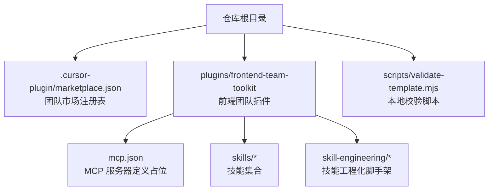
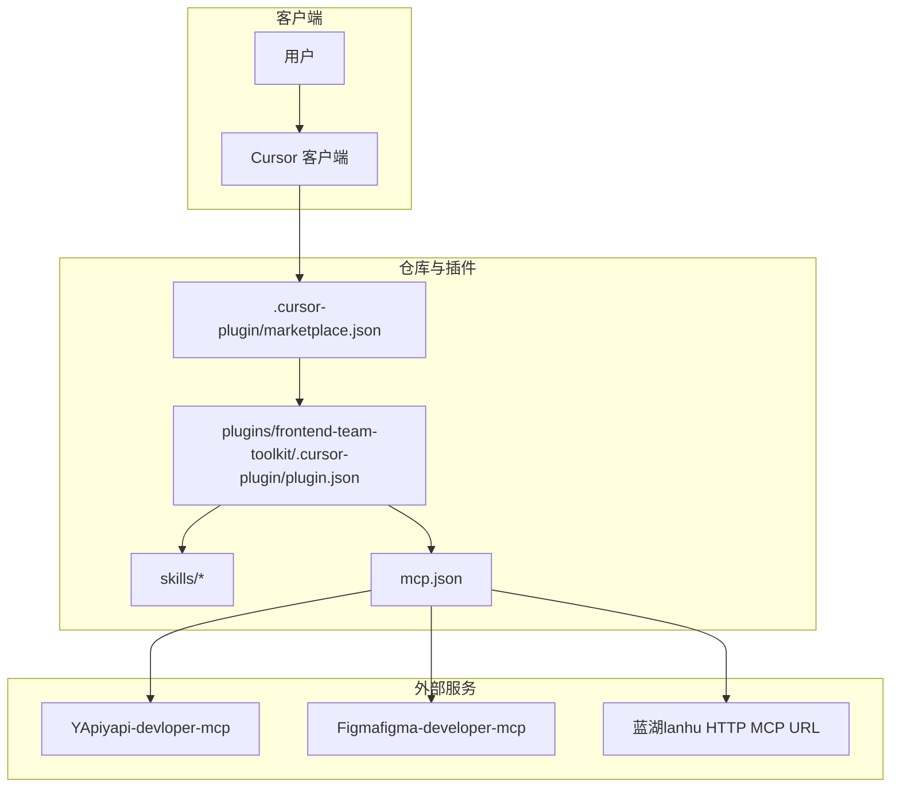
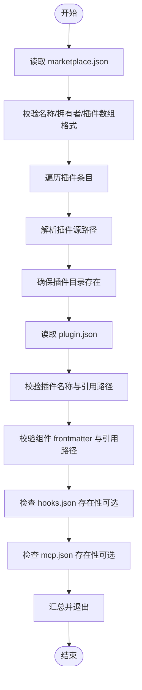
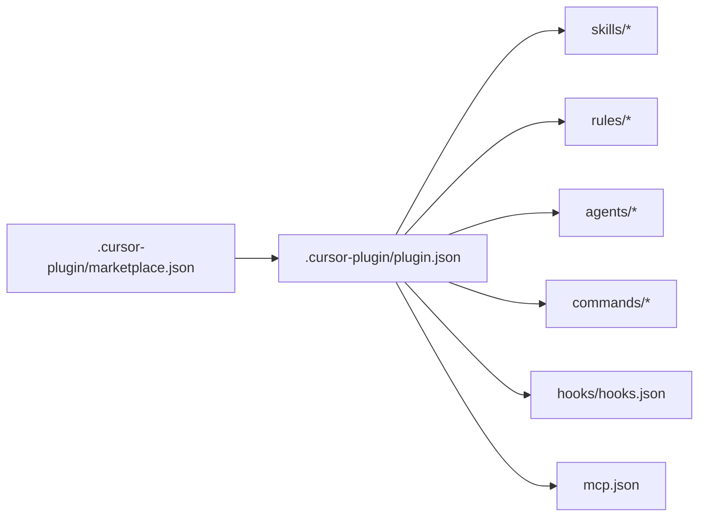

# 故障排除与常见问题

<cite>
**本文引用的文件**
- [README.md](file://README.md)
- [plugins/frontend-team-toolkit/README.md](file://plugins/frontend-team-toolkit/README.md)
- [plugins/frontend-team-toolkit/mcp.json](file://plugins/frontend-team-toolkit/mcp.json)
- [scripts/validate-template.mjs](file://scripts/validate-template.mjs)
- [plugins/frontend-team-toolkit/skills/ai-coding-tri-kit/references/fallback-scenarios.md](file://plugins/frontend-team-toolkit/skills/ai-coding-tri-kit/references/fallback-scenarios.md)
</cite>

## 目录
1. [简介](#简介)
2. [项目结构](#项目结构)
3. [核心组件](#核心组件)
4. [架构总览](#架构总览)
5. [详细组件分析](#详细组件分析)
6. [依赖关系分析](#依赖关系分析)
7. [性能考虑](#性能考虑)
8. [故障排除指南](#故障排除指南)
9. [结论](#结论)
10. [附录](#附录)

## 简介
本文件旨在为使用“前端团队市场平台”（Frontend Team Marketplace）的管理员与团队成员提供系统化的故障排除与常见问题解答。内容涵盖 MCP 服务（YApi/Figma/蓝湖）与 Skills 的安装、配置、排障、性能优化、日志与错误定位方法，以及社区支持与联系渠道。所有流程均基于仓库内的实际配置与脚本，确保可操作性与可追溯性。

## 项目结构
- 顶层仓库包含一个 Cursor Team Marketplace 注册表与一个前端团队插件（Frontend Team Toolkit）。
- 插件内包含 MCP 服务器定义、多个 Skills、技能工程化脚手架与本地校验脚本。
- 本地校验脚本负责校验插件清单、组件 YAML frontmatter、相对路径引用的安全性与存在性。

图表来源
- [README.md:155-182](file://README.md#L155-L182)
- [plugins/frontend-team-toolkit/README.md:19-27](file://plugins/frontend-team-toolkit/README.md#L19-L27)
- [scripts/validate-template.mjs:250-359](file://scripts/validate-template.mjs#L250-L359)

章节来源
- [README.md:155-182](file://README.md#L155-L182)
- [plugins/frontend-team-toolkit/README.md:19-27](file://plugins/frontend-team-toolkit/README.md#L19-L27)
- [scripts/validate-template.mjs:250-359](file://scripts/validate-template.mjs#L250-L359)

## 核心组件
- 团队市场注册表（marketplace.json）：定义插件名称、来源路径与拥有者信息，用于 Cursor Dashboard 导入与分发。
- 插件清单（plugin.json）：声明插件内组件（Logo、Rules、Skills、Agents、Commands、Hooks、MCP Servers）的引用路径。
- MCP 服务器配置（mcp.json）：声明 YApi、Figma、蓝湖三类 MCP 服务的运行方式与环境变量占位，安装后需在本地或 Cursor 设置中替换为真实值。
- Skills：10 个技能目录，覆盖 OpenSpec 契约、增量实现、迁移、YApi 集成、文章评审、质量治理等场景。
- 本地校验脚本（validate-template.mjs）：校验 marketplace 清单、插件清单、组件 frontmatter、相对路径引用的安全性与存在性。

章节来源
- [README.md:186-228](file://README.md#L186-L228)
- [plugins/frontend-team-toolkit/README.md:19-27](file://plugins/frontend-team-toolkit/README.md#L19-L27)
- [plugins/frontend-team-toolkit/mcp.json:1-26](file://plugins/frontend-team-toolkit/mcp.json#L1-L26)
- [scripts/validate-template.mjs:14-382](file://scripts/validate-template.mjs#L14-L382)

## 架构总览
下图展示了从 Cursor 客户端到 MCP 服务与 Skills 的交互路径，以及本地校验在开发与发布前的作用。

图表来源
- [README.md:26-91](file://README.md#L26-L91)
- [plugins/frontend-team-toolkit/README.md:29-49](file://plugins/frontend-team-toolkit/README.md#L29-L49)
- [plugins/frontend-team-toolkit/mcp.json:1-26](file://plugins/frontend-team-toolkit/mcp.json#L1-L26)

## 详细组件分析

### MCP 服务器配置与排障
- YApi（yapi-devloper-mcp）
  - 运行方式：通过 npx 拉起，stdio 传输。
  - 环境变量：需设置站点根地址、用户名、密码（占位符需替换）。
  - 常用工具：列出接口、获取接口详情、创建/更新接口（谨慎使用）。
- Figma（figma-developer-mcp）
  - 运行方式：通过 npx 拉起，stdio 传输。
  - 鉴权：需提供个人访问令牌（占位符，勿提交至仓库）。
  - 常用工具：获取设计数据、下载图片资源。
- 蓝湖（lanhu）
  - 运行方式：通过 HTTP MCP URL 连接，依赖本机或内网 MCP 网关。
  - 注意：URL 与查询参数需按环境调整；若不可用，需在 Cursor MCP 面板查看连接错误并按蓝湖文档排查。

章节来源
- [README.md:26-60](file://README.md#L26-L60)
- [plugins/frontend-team-toolkit/README.md:29-49](file://plugins/frontend-team-toolkit/README.md#L29-L49)
- [plugins/frontend-team-toolkit/mcp.json:1-26](file://plugins/frontend-team-toolkit/mcp.json#L1-L26)

### Skills 使用与排障
- ai-coding-tri-kit：三件套工程化工作流，强调强度分层、前置检查、闸门与回退、输出契约。
- openspec-contract-authoring：OpenSpec 四文件契约化，强调字段矩阵、实现约束、闸门与证据。
- pm-md-to-openspec-pipeline：PM 需求到 OpenSpec 的编排，支持 Reconcile 与局部刷新护栏。
- vue2-to-vue3-migration：Vue 2 → Vue 3 两阶段迁移，工程就绪与双重闸门。
- incremental-implementation：锚定现有代码做增量迭代，禁止 greenfield 重建。
- yapi-frontend-integration：YApi 接口对接与请求封装，提供排障与安全说明。
- wechat-article-review：文章评分审稿，五维加权打分与修改清单。
- change-spec-workflow：切片 → 勘探 → Change Spec，产出实操记录与变更规格八块。
- code-verify：五阶段防偏方法论，双锚验证与止损换策。
- skills-quality：质量台账、评估计划、发布门禁。

章节来源
- [README.md:63-152](file://README.md#L63-L152)
- [plugins/frontend-team-toolkit/README.md:5-27](file://plugins/frontend-team-toolkit/README.md#L5-L27)

### 本地校验流程（validate-template.mjs）
- 校验 marketplace 清单：名称格式、拥有者、插件数组有效性、pluginRoot 安全路径。
- 校验插件清单：名称格式、与 marketplace 名称一致性、组件引用路径的安全性与存在性。
- 校验组件 frontmatter：Rules、Skills、Agents、Commands 的必需字段。
- 输出：Warnings 与 Errors，失败时退出码非零。

图表来源
- [scripts/validate-template.mjs:250-359](file://scripts/validate-template.mjs#L250-L359)
- [scripts/validate-template.mjs:173-233](file://scripts/validate-template.mjs#L173-L233)
- [scripts/validate-template.mjs:154-171](file://scripts/validate-template.mjs#L154-L171)

章节来源
- [scripts/validate-template.mjs:14-382](file://scripts/validate-template.mjs#L14-L382)

## 依赖关系分析
- 插件清单（plugin.json）依赖 marketplace 清单（marketplace.json）中的条目名称与 source 路径一致。
- 插件内组件（Skills/Rules/Agents/Commands/Hooks/MCP）的引用路径必须为安全的相对路径，且在仓库中存在。
- MCP 服务器配置（mcp.json）在安装后由用户在 Cursor 设置中覆盖真实环境变量与 URL。

图表来源
- [scripts/validate-template.mjs:284-345](file://scripts/validate-template.mjs#L284-L345)
- [README.md:155-182](file://README.md#L155-L182)

章节来源
- [scripts/validate-template.mjs:284-345](file://scripts/validate-template.mjs#L284-L345)
- [README.md:155-182](file://README.md#L155-L182)

## 性能考虑
- MCP 服务调用延迟
  - YApi：接口列表与详情查询可能受网络与服务端性能影响；建议缓存常用接口摘要并在对话中复用。
  - Figma：设计数据与图片下载可能较大，建议按需获取节点与资源，避免一次性拉取过多图片。
  - 蓝湖：HTTP MCP URL 依赖网关性能与并发；若出现超时，建议降低并发或分批请求。
- Skills 执行效率
  - 使用“先锚定，再迭代”的方法论（如 code-verify）可减少无效试错，提升整体效率。
  - 增量实现（incremental-implementation）避免 greenfield 重建，显著降低变更成本。
- 本地校验
  - 在提交前运行本地校验脚本，尽早发现路径与 frontmatter 问题，减少 CI 失败与回滚成本。

## 故障排除指南

### 一、管理员导入与团队成员安装
- 管理员导入
  - 将仓库推送到组织 GitHub，默认分支一般为 main。
  - 在 Cursor Dashboard → Settings → Plugins → Team Marketplaces → Import，粘贴仓库 URL 并按组分配 Required 或 Optional。
- 成员安装与密钥
  - 在 Cursor Marketplace/Plugins 面板安装 Frontend Team Toolkit。
  - 打开 Settings → MCP，确认三个服务已列出；将 YApi/Figma/蓝湖 URL 等替换为真实配置。
  - 切勿将 Token、密码写入 Git；可选做法包括每人本机 MCP 覆盖、组织密钥管理方案、或 CI 仅校验结构不提交机密。

章节来源
- [README.md:186-197](file://README.md#L186-L197)

### 二、MCP 服务常见问题与修复
- YApi 无法连接
  - 症状：Cursor MCP 面板显示连接失败或认证错误。
  - 排查步骤：
    - 确认 YAPI_BASE_URL、YAPI_USERNAME、YAPI_PASSWORD 已在 Cursor MCP 设置中覆盖为真实值。
    - 若团队使用自定义 npx 包装脚本，可将 command 改为该脚本路径。
    - 检查网络连通性与 YApi 实例状态。
- Figma 无法获取设计数据
  - 症状：调用 get_figma_data 返回空或报错。
  - 排查步骤：
    - 确认个人访问令牌已在 Cursor MCP 设置中覆盖为真实值。
    - 检查文件链接与 nodeId 是否正确。
    - 确认令牌权限足以访问目标文件。
- 蓝湖 MCP URL 不可用
  - 症状：HTTP MCP URL 返回不可用或超时。
  - 排查步骤：
    - 确认 url 指向你们环境中运行的蓝湖 MCP 服务地址。
    - 按蓝湖侧要求调整查询参数（如 role、name/邮箱）。
    - 检查本机或内网 MCP 网关是否正常运行。

章节来源
- [README.md:26-60](file://README.md#L26-L60)
- [plugins/frontend-team-toolkit/README.md:29-49](file://plugins/frontend-team-toolkit/README.md#L29-L49)
- [plugins/frontend-team-toolkit/mcp.json:1-26](file://plugins/frontend-team-toolkit/mcp.json#L1-L26)

### 三、Skills 使用问题与修复
- 触发技能无效或未响应
  - 症状：在对话中使用 /技能名 或 Agent Decides 未唤起。
  - 排查步骤：
    - 确认技能目录结构与 SKILL.md frontmatter 完整（name/description）。
    - 确认插件清单中已正确引用该技能路径。
    - 重新安装插件或重启 Cursor。
- 输出不符合预期或缺少证据
  - 症状：输出契约缺失、字段矩阵不完整、评分结果异常。
  - 排查步骤：
    - 按技能附带文档进行自检与核对（如 wechat-article-review 的评分细则、ai-coding-tri-kit 的输出契约）。
    - 确保前置检查（如环境检查、闸门）已满足。
- 增量实现导致冲突
  - 症状：多产物版本不一致、未同步产物清单缺失。
  - 排查步骤：
    - 按 Reconcile 编排与局部更新护栏进行核对。
    - 确保多产物版本对齐与基线一致。

章节来源
- [README.md:63-152](file://README.md#L63-L152)
- [plugins/frontend-team-toolkit/README.md:5-27](file://plugins/frontend-team-toolkit/README.md#L5-L27)

### 四、本地校验失败与修复
- marketplace.json 校验失败
  - 症状：名称格式不符、拥有者缺失、插件数组为空。
  - 修复：修正名称格式（小写连字符）、填写拥有者、确保插件数组非空。
- plugin.json 校验失败
  - 症状：名称格式不符、与 marketplace 条目名称不一致、引用路径无效。
  - 修复：统一名称格式、保持与 marketplace 条目名称一致、修正相对路径。
- 组件 frontmatter 缺失
  - 症状：Rules/Skills/Agents/Commands 缺少必需字段。
  - 修复：补齐 frontmatter 字段（如 description/name）。
- 路径引用问题
  - 症状：引用了 ../、绝对路径或不存在的相对路径。
  - 修复：使用安全的相对路径，确保文件存在。

章节来源
- [scripts/validate-template.mjs:14-382](file://scripts/validate-template.mjs#L14-L382)

### 五、回退与抗反模式
- 网络/环境异常时的回退策略
  - 无网络时：检测失败后切换手写方案。
  - 无 git：检测状态后切换目录备份。
  - 无 CI：明确声明是人审替代，建议后续配置 CI。
  - SDK BLOCKED：按 Step 2 检查后分阶段，不编造 AppID。

章节来源
- [plugins/frontend-team-toolkit/skills/ai-coding-tri-kit/references/fallback-scenarios.md:272-279](file://plugins/frontend-team-toolkit/skills/ai-coding-tri-kit/references/fallback-scenarios.md#L272-L279)

### 六、日志分析与错误定位
- Cursor MCP 面板
  - 查看各 MCP 服务连接状态与错误提示，定位网络、认证与 URL 参数问题。
- 技能执行日志
  - 在对话中关注技能输出的阶段性提示与核对清单，结合附带文档进行自检。
- 本地校验日志
  - 运行本地校验脚本，根据输出的 Warnings/Errors 快速定位问题并修复。

章节来源
- [README.md:26-60](file://README.md#L26-L60)
- [README.md:63-152](file://README.md#L63-L152)
- [scripts/validate-template.mjs:361-379](file://scripts/validate-template.mjs#L361-L379)

### 七、性能问题识别与优化建议
- 识别
  - MCP 请求频繁超时或返回慢：检查网络与服务端负载。
  - Skills 执行耗时长：确认是否进行了不必要的重复请求或未使用缓存。
- 优化
  - 减少一次性大资源下载，按需获取。
  - 使用增量实现与回退机制，避免大规模重跑。
  - 在本地校验阶段提前发现问题，降低 CI 失败率。

章节来源
- [README.md:26-60](file://README.md#L26-L60)
- [README.md:63-152](file://README.md#L63-L152)

### 八、社区支持与联系方式
- 官方文档与参考
  - Cursor Plugins 文档与参考（manifest、组件格式）。
  - 工作区内另有 cursor-team-marketplace-template-main 可作多插件、hooks、rules 等扩展参考。
- 问题反馈
  - 建议在团队内部建立问题登记与跟踪机制，结合本地校验脚本进行预检，减少生产问题。

章节来源
- [README.md:223-228](file://README.md#L223-L228)

## 结论
通过系统化的配置校验、MCP 服务排障、Skills 使用与回退策略，以及本地校验脚本的前置把关，可以有效降低使用过程中的故障率并提升交付质量。建议团队在日常工作中坚持“先锚定，再迭代”的方法论，配合增量实现与闸门回退，持续优化性能与稳定性。

## 附录
- 快速检查清单
  - marketplace.json：名称、拥有者、插件数组格式正确。
  - plugin.json：名称与引用路径一致，组件 frontmatter 完整。
  - mcp.json：占位符已替换为真实值，URL 参数正确。
  - Skills：目录结构与 SKILL.md frontmatter 完整，输出符合契约。
  - 本地校验：运行 validate-template.mjs，修复所有错误与警告。