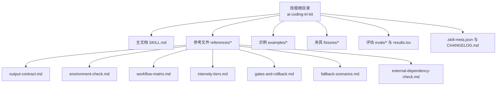
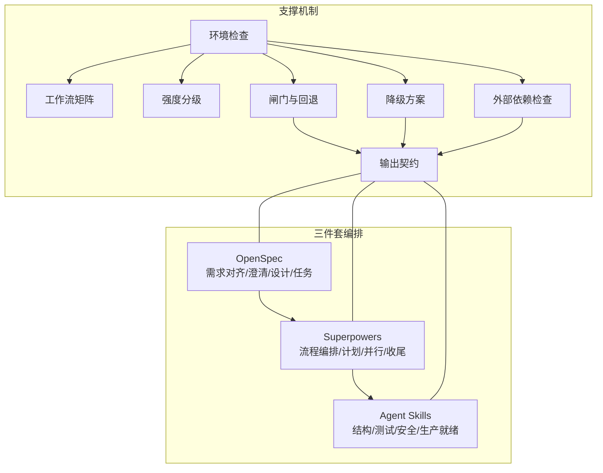
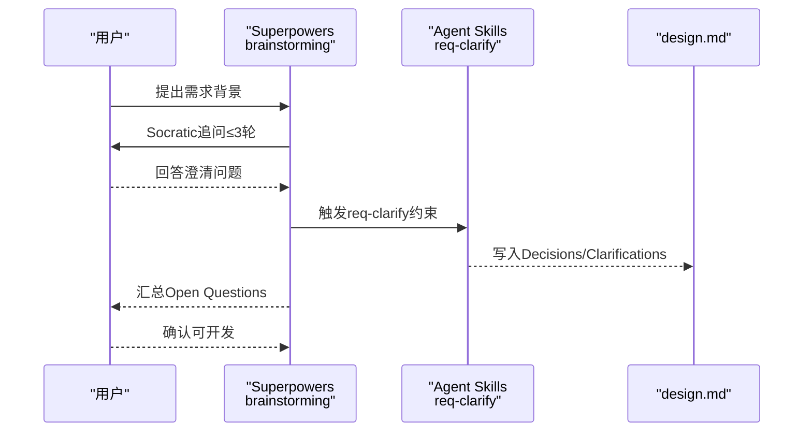
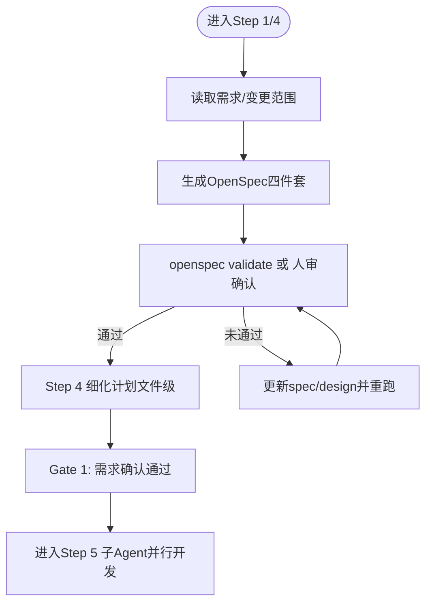
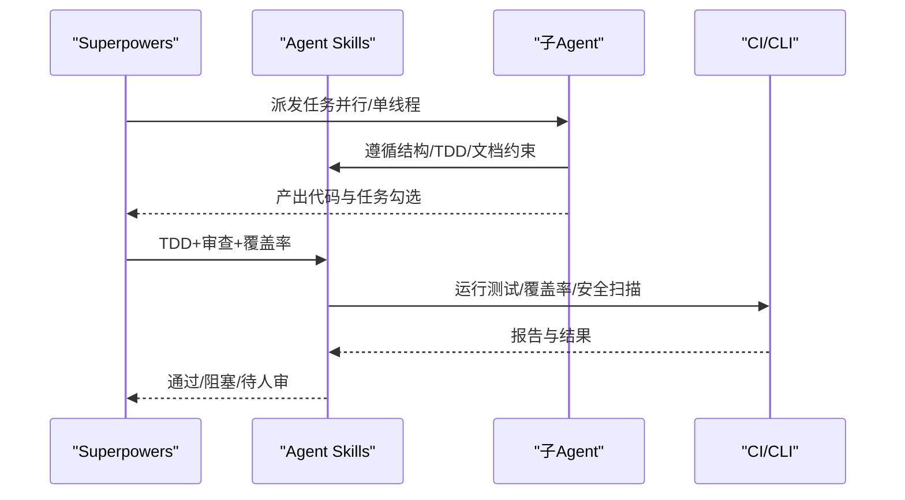
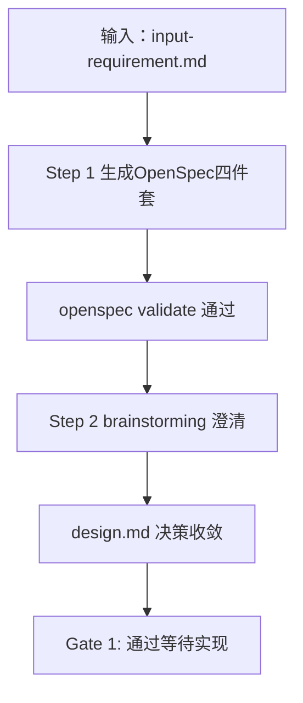
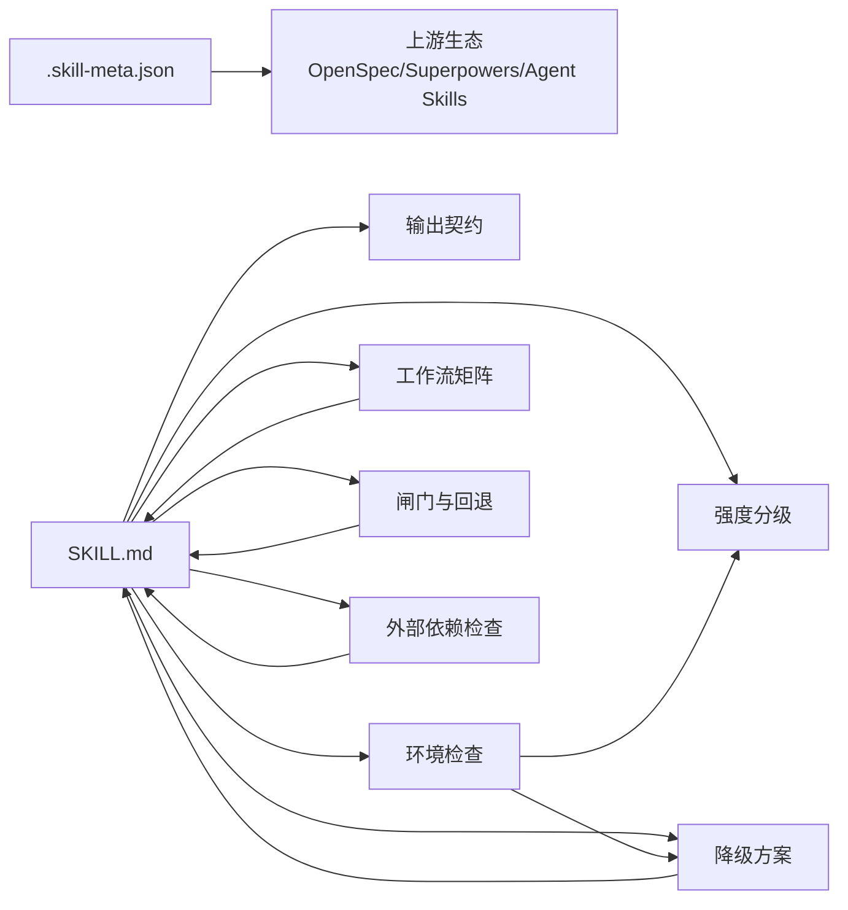

# AI编码三件套技能

<cite>
**本文引用的文件**
- [SKILL.md](file://plugins/frontend-team-toolkit/skills/ai-coding-tri-kit/SKILL.md)
- [research-analysis-report.md](file://plugins/frontend-team-toolkit/skills/ai-coding-tri-kit/research-analysis-report.md)
- [output-contract.md](file://plugins/frontend-team-toolkit/skills/ai-coding-tri-kit/references/output-contract.md)
- [environment-check.md](file://plugins/frontend-team-toolkit/skills/ai-coding-tri-kit/references/environment-check.md)
- [workflow-matrix.md](file://plugins/frontend-team-toolkit/skills/ai-coding-tri-kit/references/workflow-matrix.md)
- [intensity-tiers.md](file://plugins/frontend-team-toolkit/skills/ai-coding-tri-kit/references/intensity-tiers.md)
- [gates-and-rollback.md](file://plugins/frontend-team-toolkit/skills/ai-coding-tri-kit/references/gates-and-rollback.md)
- [fallback-scenarios.md](file://plugins/frontend-team-toolkit/skills/ai-coding-tri-kit/references/fallback-scenarios.md)
- [external-dependency-check.md](file://plugins/frontend-team-toolkit/skills/ai-coding-tri-kit/references/external-dependency-check.md)
- [.skill-meta.json](file://plugins/frontend-team-toolkit/skills/ai-coding-tri-kit/.skill-meta.json)
- [feat-dashboard-csv-export-walkthrough.md](file://plugins/frontend-team-toolkit/skills/ai-coding-tri-kit/examples/feat-dashboard-csv-export-walkthrough.md)
- [input-requirement.md](file://plugins/frontend-team-toolkit/skills/ai-coding-tri-kit/fixtures/cap-case-csv-export/input-requirement.md)
- [evals.json](file://plugins/frontend-team-toolkit/skills/ai-coding-tri-kit/evals/evals.json)
- [results.tsv](file://plugins/frontend-team-toolkit/skills/ai-coding-tri-kit/results.tsv)
- [CHANGELOG.md](file://plugins/frontend-team-toolkit/skills/ai-coding-tri-kit/CHANGELOG.md)
</cite>

## 目录
1. [简介](#简介)
2. [项目结构](#项目结构)
3. [核心组件](#核心组件)
4. [架构总览](#架构总览)
5. [详细组件分析](#详细组件分析)
6. [依赖关系分析](#依赖关系分析)
7. [性能考量](#性能考量)
8. [故障排查指南](#故障排查指南)
9. [结论](#结论)
10. [附录](#附录)

## 简介
AI编码三件套技能（ai-coding-tri-kit）是一个面向工程化交付的8步工作流编排技能，串联“OpenSpec（定方向）→ Superpowers（带节奏）→ Agent Skills（守纪律）”，确保需求清晰、流程可控、质量可验。技能覆盖从需求澄清、技术方案设计到代码实现与验证归档的完整生命周期，并提供强度分级、闸门与回退、降级方案、输出契约等工程化保障机制。

## 项目结构
该技能位于前端团队市场插件工具包中，核心文件组织如下：
- 技能主文档与参考文件：SKILL.md、references/*（输出契约、环境检查、工作流矩阵、强度分级、闸门与回退、降级方案、外部依赖检查）
- 示例与夹具：examples/*、fixtures/*
- 评估体系：evals/、results.tsv、test-prompts.json
- 元数据与变更记录：.skill-meta.json、CHANGELOG.md

**图表来源**
- [SKILL.md:1-301](file://plugins/frontend-team-toolkit/skills/ai-coding-tri-kit/SKILL.md#L1-L301)
- [output-contract.md:1-97](file://plugins/frontend-team-toolkit/skills/ai-coding-tri-kit/references/output-contract.md#L1-L97)
- [environment-check.md:1-129](file://plugins/frontend-team-toolkit/skills/ai-coding-tri-kit/references/environment-check.md#L1-L129)
- [workflow-matrix.md:1-136](file://plugins/frontend-team-toolkit/skills/ai-coding-tri-kit/references/workflow-matrix.md#L1-L136)
- [intensity-tiers.md:1-89](file://plugins/frontend-team-toolkit/skills/ai-coding-tri-kit/references/intensity-tiers.md#L1-L89)
- [gates-and-rollback.md:1-90](file://plugins/frontend-team-toolkit/skills/ai-coding-tri-kit/references/gates-and-rollback.md#L1-L90)
- [fallback-scenarios.md:1-279](file://plugins/frontend-team-toolkit/skills/ai-coding-tri-kit/references/fallback-scenarios.md#L1-L279)
- [external-dependency-check.md:1-156](file://plugins/frontend-team-toolkit/skills/ai-coding-tri-kit/references/external-dependency-check.md#L1-L156)

**章节来源**
- [SKILL.md:1-301](file://plugins/frontend-team-toolkit/skills/ai-coding-tri-kit/SKILL.md#L1-L301)

## 核心组件
- 输出契约（Output Contract）：定义每次会话必须交付的结构化字段，包括会话摘要、进度清单、步骤详情、闸门状态、假设与未决问题、下一步建议等。
- 环境前置检查（Environment Pre-check）：在执行前确认 Node.js、git、OpenSpec CLI、Superpowers、Agent Skills、网络等6项基础条件，缺失时提供降级路径。
- 工作流矩阵（Workflow Matrix）：8步与工具职责映射，明确每步主导工具、协作工具、关键命令/技能、产出物与退出条件。
- 强度分级（Intensity Tiers）：Full/Standard/Lite 三档，依据变更规模、风险与外部依赖决定流程简化程度与时间估算。
- 闸门与回退（Gates & Rollback）：程序性强制（CLI/编译/CI）、AI行为约束（Skill元数据）、流程惯例（团队共识+人审）三层强度；提供失败回退策略。
- 降级方案（Fallback Scenarios）：针对无网络、无git、无Superpowers/Agent Skills、CI不可用、SDK鉴权缺失等受限场景的替代执行路径。
- 外部依赖检查（External Dependency Check）：在Step 2增加SDK/AppID/维护状态/法务/测试环境等6问，识别BLOCKED/WARN/INFO并制定分阶段实现。

**章节来源**
- [output-contract.md:1-97](file://plugins/frontend-team-toolkit/skills/ai-coding-tri-kit/references/output-contract.md#L1-L97)
- [environment-check.md:1-129](file://plugins/frontend-team-toolkit/skills/ai-coding-tri-kit/references/environment-check.md#L1-L129)
- [workflow-matrix.md:1-136](file://plugins/frontend-team-toolkit/skills/ai-coding-tri-kit/references/workflow-matrix.md#L1-L136)
- [intensity-tiers.md:1-89](file://plugins/frontend-team-toolkit/skills/ai-coding-tri-kit/references/intensity-tiers.md#L1-L89)
- [gates-and-rollback.md:1-90](file://plugins/frontend-team-toolkit/skills/ai-coding-tri-kit/references/gates-and-rollback.md#L1-L90)
- [fallback-scenarios.md:1-279](file://plugins/frontend-team-toolkit/skills/ai-coding-tri-kit/references/fallback-scenarios.md#L1-L279)
- [external-dependency-check.md:1-156](file://plugins/frontend-team-toolkit/skills/ai-coding-tri-kit/references/external-dependency-check.md#L1-L156)

## 架构总览
三件套以“顺序执行、不可跳跃”为原则，通过OpenSpec定义需求边界，Superpowers驱动流程与任务编排，Agent Skills落实质量门槛与量化指标。技能在每步执行前核对工具能力与环境状态，遇阻塞时进入回退或降级模式，最终以OpenSpec验证与归档闭环。

**图表来源**
- [SKILL.md:69-218](file://plugins/frontend-team-toolkit/skills/ai-coding-tri-kit/SKILL.md#L69-L218)
- [output-contract.md:5-41](file://plugins/frontend-team-toolkit/skills/ai-coding-tri-kit/references/output-contract.md#L5-L41)
- [environment-check.md:5-52](file://plugins/frontend-team-toolkit/skills/ai-coding-tri-kit/references/environment-check.md#L5-L52)
- [workflow-matrix.md:47-56](file://plugins/frontend-team-toolkit/skills/ai-coding-tri-kit/references/workflow-matrix.md#L47-L56)
- [intensity-tiers.md:7-50](file://plugins/frontend-team-toolkit/skills/ai-coding-tri-kit/references/intensity-tiers.md#L7-L50)
- [gates-and-rollback.md:5-44](file://plugins/frontend-team-toolkit/skills/ai-coding-tri-kit/references/gates-and-rollback.md#L5-L44)
- [fallback-scenarios.md:5-16](file://plugins/frontend-team-toolkit/skills/ai-coding-tri-kit/references/fallback-scenarios.md#L5-L16)
- [external-dependency-check.md:5-25](file://plugins/frontend-team-toolkit/skills/ai-coding-tri-kit/references/external-dependency-check.md#L5-L25)

## 详细组件分析

### 组件A：需求澄清（Superpowers + Agent Skills）
- 目标：在Step 2通过Socratic式追问收敛模糊需求，最多3轮澄清，超时汇总Open Questions。
- 外部依赖检查：新增SDK/AppID/维护状态/法务/测试环境等4问，识别BLOCKED/WARN/INFO并记录。
- 产出：design.md含Decisions与Open Questions，用户确认后进入Step 3。

**图表来源**
- [SKILL.md:106-126](file://plugins/frontend-team-toolkit/skills/ai-coding-tri-kit/SKILL.md#L106-L126)
- [external-dependency-check.md:15-43](file://plugins/frontend-team-toolkit/skills/ai-coding-tri-kit/references/external-dependency-check.md#L15-L43)

**章节来源**
- [SKILL.md:106-126](file://plugins/frontend-team-toolkit/skills/ai-coding-tri-kit/SKILL.md#L106-L126)
- [external-dependency-check.md:15-112](file://plugins/frontend-team-toolkit/skills/ai-coding-tri-kit/references/external-dependency-check.md#L15-L112)

### 组件B：技术方案设计（OpenSpec + Superpowers）
- 目标：Step 1生成OpenSpec四件套（proposal/spec/design/tasks），Step 4细化任务到文件级，形成可验证的实现计划。
- 产出：通过validate或人审确认，进入Step 5并行开发。

**图表来源**
- [SKILL.md:88-151](file://plugins/frontend-team-toolkit/skills/ai-coding-tri-kit/SKILL.md#L88-L151)
- [feat-dashboard-csv-export-walkthrough.md:15-38](file://plugins/frontend-team-toolkit/skills/ai-coding-tri-kit/examples/feat-dashboard-csv-export-walkthrough.md#L15-L38)

**章节来源**
- [SKILL.md:88-151](file://plugins/frontend-team-toolkit/skills/ai-coding-tri-kit/SKILL.md#L88-L151)
- [feat-dashboard-csv-export-walkthrough.md:15-38](file://plugins/frontend-team-toolkit/skills/ai-coding-tri-kit/examples/feat-dashboard-csv-export-walkthrough.md#L15-L38)

### 组件C：代码实现与质量控制（Agent Skills + Superpowers）
- 目标：Step 5子Agent并行开发，按spec MUST条款与结构/TDD约束产出；Step 6 TDD+审查+覆盖率；Step 7安全扫描；Step 8验证+归档。
- 工具能力判断：根据工具是否支持子Agent并行，决定并行或降级为executing-plans单线程。

**图表来源**
- [SKILL.md:154-218](file://plugins/frontend-team-toolkit/skills/ai-coding-tri-kit/SKILL.md#L154-L218)
- [workflow-matrix.md:7-36](file://plugins/frontend-team-toolkit/skills/ai-coding-tri-kit/references/workflow-matrix.md#L7-L36)

**章节来源**
- [SKILL.md:154-218](file://plugins/frontend-team-toolkit/skills/ai-coding-tri-kit/SKILL.md#L154-L218)
- [workflow-matrix.md:7-36](file://plugins/frontend-team-toolkit/skills/ai-coding-tri-kit/references/workflow-matrix.md#L7-L36)

### 组件D：CSV导出功能实现（真实案例）
- 案例背景：Dashboard CSV导出（Standard档位·Step 1–2），真实落盘于演示仓库。
- 关键场景：选中导出、空选提示、大数据量进度条、特殊字符与Excel兼容。
- 夹具输入：fixtures/cap-case-csv-export/input-requirement.md。

**图表来源**
- [feat-dashboard-csv-export-walkthrough.md:1-71](file://plugins/frontend-team-toolkit/skills/ai-coding-tri-kit/examples/feat-dashboard-csv-export-walkthrough.md#L1-L71)
- [input-requirement.md:1-16](file://plugins/frontend-team-toolkit/skills/ai-coding-tri-kit/fixtures/cap-case-csv-export/input-requirement.md#L1-L16)

**章节来源**
- [feat-dashboard-csv-export-walkthrough.md:1-71](file://plugins/frontend-team-toolkit/skills/ai-coding-tri-kit/examples/feat-dashboard-csv-export-walkthrough.md#L1-L71)
- [input-requirement.md:1-16](file://plugins/frontend-team-toolkit/skills/ai-coding-tri-kit/fixtures/cap-case-csv-export/input-requirement.md#L1-L16)

## 依赖关系分析
- 技能与上游生态：OpenSpec、Superpowers、Agent Skills 三大组件的元数据与能力决定技能执行效果。
- 技能内部耦合：输出契约贯穿所有步骤，环境检查决定档位与降级路径，工作流矩阵决定工具分工，强度分级决定流程简化程度，闸门与回退决定阻断与恢复，外部依赖检查决定分阶段实现。

**图表来源**
- [.skill-meta.json:1-47](file://plugins/frontend-team-toolkit/skills/ai-coding-tri-kit/.skill-meta.json#L1-L47)
- [SKILL.md:38-51](file://plugins/frontend-team-toolkit/skills/ai-coding-tri-kit/SKILL.md#L38-L51)
- [environment-check.md:16-33](file://plugins/frontend-team-toolkit/skills/ai-coding-tri-kit/references/environment-check.md#L16-L33)
- [workflow-matrix.md:47-71](file://plugins/frontend-team-toolkit/skills/ai-coding-tri-kit/references/workflow-matrix.md#L47-L71)
- [intensity-tiers.md:52-89](file://plugins/frontend-team-toolkit/skills/ai-coding-tri-kit/references/intensity-tiers.md#L52-L89)
- [gates-and-rollback.md:13-44](file://plugins/frontend-team-toolkit/skills/ai-coding-tri-kit/references/gates-and-rollback.md#L13-L44)
- [fallback-scenarios.md:5-16](file://plugins/frontend-team-toolkit/skills/ai-coding-tri-kit/references/fallback-scenarios.md#L5-L16)
- [external-dependency-check.md:5-25](file://plugins/frontend-team-toolkit/skills/ai-coding-tri-kit/references/external-dependency-check.md#L5-L25)

**章节来源**
- [.skill-meta.json:1-47](file://plugins/frontend-team-toolkit/skills/ai-coding-tri-kit/.skill-meta.json#L1-L47)
- [SKILL.md:38-51](file://plugins/frontend-team-toolkit/skills/ai-coding-tri-kit/SKILL.md#L38-L51)

## 性能考量
- 时间估算分层：将“AI推理+命令”“人审阅决策”“测试执行（本地）”与“不含项（外部阻塞）”分离，避免对SDK联调、真机回归、CI排队、跨团队审批的误估。
- 工具能力判断：子Agent并行依赖工具能力，遇不支持或冲突时自动降级为单线程，减少无效并行带来的合并冲突与沟通成本。
- 强度分级：Lite档位显著降低流程开销，适合小修复；Full档位覆盖多渠道与外部依赖，提升交付稳定性。

**章节来源**
- [intensity-tiers.md:22-50](file://plugins/frontend-team-toolkit/skills/ai-coding-tri-kit/references/intensity-tiers.md#L22-L50)
- [workflow-matrix.md:7-36](file://plugins/frontend-team-toolkit/skills/ai-coding-tri-kit/references/workflow-matrix.md#L7-L36)

## 故障排查指南
- 环境不可用：执行环境检查，按缺失项选择降级路径（手写四件套、目录备份隔离、本skill模拟、人审加强、分阶段实现）。
- 外部依赖BLOCKED：在Step 2识别SDK/AppID/维护状态/法务/测试环境问题，制定分阶段实现与时间估算调整。
- 闸门阻断：Step 1未确认、测试失败、安全扫描失败、基线失败等均需回退到上一步或修复后重试。
- 输出不符契约：检查是否遗漏Progress Checklist、证据摘要、闸门状态、下一步建议等字段。

**章节来源**
- [environment-check.md:16-52](file://plugins/frontend-team-toolkit/skills/ai-coding-tri-kit/references/environment-check.md#L16-L52)
- [fallback-scenarios.md:248-279](file://plugins/frontend-team-toolkit/skills/ai-coding-tri-kit/references/fallback-scenarios.md#L248-L279)
- [external-dependency-check.md:34-71](file://plugins/frontend-team-toolkit/skills/ai-coding-tri-kit/references/external-dependency-check.md#L34-L71)
- [gates-and-rollback.md:45-56](file://plugins/frontend-team-toolkit/skills/ai-coding-tri-kit/references/gates-and-rollback.md#L45-L56)
- [output-contract.md:55-62](file://plugins/frontend-team-toolkit/skills/ai-coding-tri-kit/references/output-contract.md#L55-L62)

## 结论
AI编码三件套技能以“顺序执行、不可跳跃”为核心原则，通过OpenSpec、Superpowers、Agent Skills的协同，结合输出契约、环境检查、工作流矩阵、强度分级、闸门与回退、降级方案与外部依赖检查，构建了可复制、可审计、可落地的工程化交付流水线。评估结果显示7/7测试通过，真实落盘制品验证了能力评估的有效性。建议在实际项目中优先启用环境前置检查与外部依赖检查，配合强度分级与工具能力判断，最大化实践可行性。

## 附录

### 评估机制与结果
- 评估集：evals/evals.json定义7项评估（3回归+4能力），results.tsv显示全部通过。
- 真实落盘：feat-dashboard-csv-export与feat-live-share-third-party通过validate。
- 元数据：.skill-meta.json记录基线表现与改进计划。

**章节来源**
- [evals.json:1-141](file://plugins/frontend-team-toolkit/skills/ai-coding-tri-kit/evals/evals.json#L1-L141)
- [results.tsv:1-17](file://plugins/frontend-team-toolkit/skills/ai-coding-tri-kit/results.tsv#L1-L17)
- [.skill-meta.json:7-16](file://plugins/frontend-team-toolkit/skills/ai-coding-tri-kit/.skill-meta.json#L7-L16)

### 使用示例与最佳实践
- 示例 walkthrough：feat-dashboard-csv-export（Standard档位·Step 1–2）与feat-live-share-third-party（Full档位）。
- 最佳实践：先判定强度档位，再执行环境检查；Step 2务必进行外部依赖检查；遇到BLOCKED立即分阶段实现；严格遵循输出契约，确保证据可追溯。

**章节来源**
- [feat-dashboard-csv-export-walkthrough.md:1-71](file://plugins/frontend-team-toolkit/skills/ai-coding-tri-kit/examples/feat-dashboard-csv-export-walkthrough.md#L1-L71)

### 研究分析报告要点
- 契合度：与用户文章高度契合（92%），精准提取可执行内核。
- 合理性：强度分层、Checkpoint阻断、Output Contract可验证、红线测试设计合理。
- 理想化：时间估算偏乐观、依赖加载假设理想化、受限环境降级方案不足、子Agent并行可行性依赖工具能力。
- 改进建议：增加环境前置检查、外部依赖可行性检查、时间估算分层、工具能力判断、离线/受限环境方案、非git环境替代方案。

**章节来源**
- [research-analysis-report.md:10-71](file://plugins/frontend-team-toolkit/skills/ai-coding-tri-kit/research-analysis-report.md#L10-L71)
- [research-analysis-report.md:174-254](file://plugins/frontend-team-toolkit/skills/ai-coding-tri-kit/research-analysis-report.md#L174-L254)
- [research-analysis-report.md:311-459](file://plugins/frontend-team-toolkit/skills/ai-coding-tri-kit/research-analysis-report.md#L311-L459)