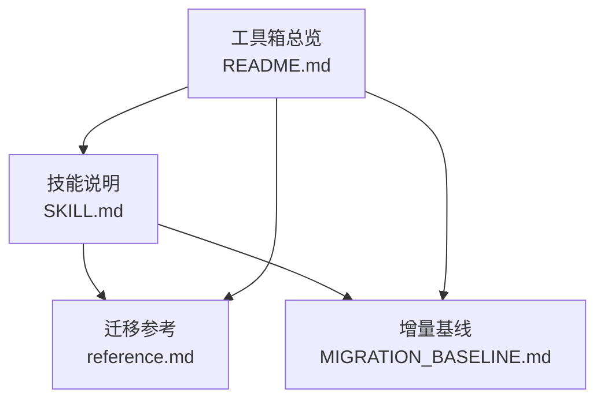
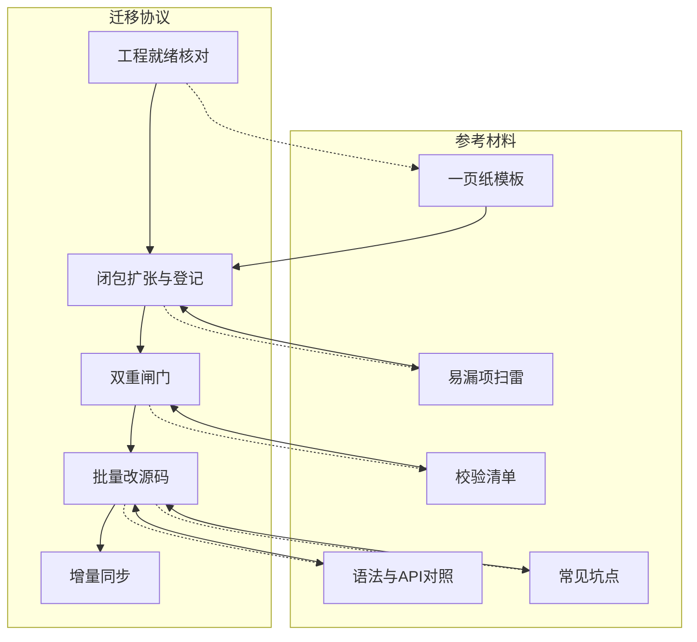
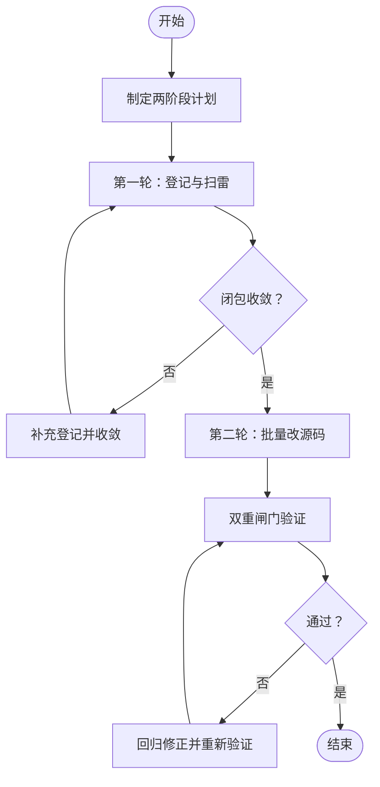
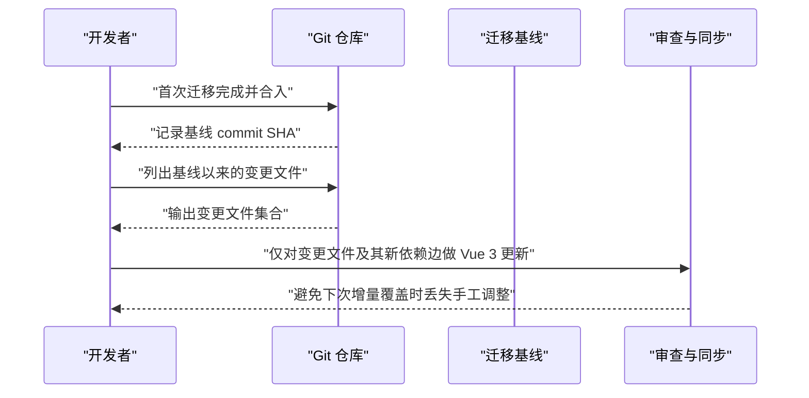
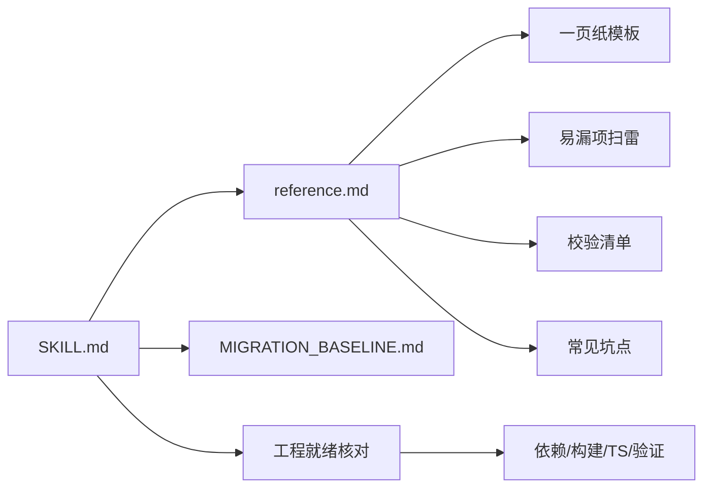

# Vue2到Vue3迁移技能

<cite>
**本文引用的文件**
- [SKILL.md](file://plugins/frontend-team-toolkit/skills/vue2-to-vue3-migration/SKILL.md)
- [reference.md](file://plugins/frontend-team-toolkit/skills/vue2-to-vue3-migration/reference.md)
- [MIGRATION_BASELINE.md](file://plugins/frontend-team-toolkit/skills/vue2-to-vue3-migration/MIGRATION_BASELINE.md)
- [README.md](file://plugins/frontend-team-toolkit/README.md)
</cite>

## 目录
1. [引言](#引言)
2. [项目结构](#项目结构)
3. [核心组件](#核心组件)
4. [架构概览](#架构概览)
5. [详细组件分析](#详细组件分析)
6. [依赖分析](#依赖分析)
7. [性能考虑](#性能考虑)
8. [故障排查指南](#故障排查指南)
9. [结论](#结论)
10. [附录](#附录)

## 引言
本技能文档面向需要将现有 Vue 2 组件/页面迁移到 Vue 3 的团队，提供一套可复用的两阶段迁移方法论与工程化保障机制。其核心在于“依赖驱动、行为等价”，通过“闭包收敛—登记—闸门”的闭环，确保迁移过程可控、可审计、可回滚。文档同时给出增量迁移基线、校验清单与常见坑点，帮助团队在保证质量的前提下安全高效地完成框架升级。

## 项目结构
该技能位于团队前端工具箱插件中，围绕 Vue2→Vue3 迁移形成“技能说明 + 参考材料 + 增量基线”的知识体系，便于在不同项目中复用与落地。

图表来源
- [SKILL.md:1-151](file://plugins/frontend-team-toolkit/skills/vue2-to-vue3-migration/SKILL.md#L1-L151)
- [reference.md:1-344](file://plugins/frontend-team-toolkit/skills/vue2-to-vue3-migration/reference.md#L1-L344)
- [MIGRATION_BASELINE.md:1-29](file://plugins/frontend-team-toolkit/skills/vue2-to-vue3-migration/MIGRATION_BASELINE.md#L1-L29)
- [README.md:1-50](file://plugins/frontend-team-toolkit/README.md#L1-L50)

章节来源
- [README.md:1-50](file://plugins/frontend-team-toolkit/README.md#L1-L50)

## 核心组件
- 两阶段迁移协议：先交付一页纸登记与闸门自检，再批量改源码；强调闭包收敛与因果链登记，避免遗漏依赖与断因果。
- 工程就绪核对：在目标 Vue 3 宿主或隔离包预期宿主进行依赖、构建、TS、验证手段等核对，确保迁移前置条件满足。
- 依赖与因果登记：以“依赖登记册 + 因果链登记表 + 隐式耦合表 + 双重闸门”为抓手，形成可追溯的迁移证据链。
- 增量迁移基线：通过 Git 提交基线限定变更范围，减少重复劳动，支持持续同步。

章节来源
- [SKILL.md:10-92](file://plugins/frontend-team-toolkit/skills/vue2-to-vue3-migration/SKILL.md#L10-L92)
- [SKILL.md:21-32](file://plugins/frontend-team-toolkit/skills/vue2-to-vue3-migration/SKILL.md#L21-L32)
- [SKILL.md:64-78](file://plugins/frontend-team-toolkit/skills/vue2-to-vue3-migration/SKILL.md#L64-L78)
- [MIGRATION_BASELINE.md:1-29](file://plugins/frontend-team-toolkit/skills/vue2-to-vue3-migration/MIGRATION_BASELINE.md#L1-L29)

## 架构概览
下图展示了迁移技能的“协议—核对—登记—闸门—增量”的整体架构，以及与参考材料的分工关系。

图表来源
- [SKILL.md:10-92](file://plugins/frontend-team-toolkit/skills/vue2-to-vue3-migration/SKILL.md#L10-L92)
- [reference.md:1-344](file://plugins/frontend-team-toolkit/skills/vue2-to-vue3-migration/reference.md#L1-L344)

## 详细组件分析

### 组件A：两阶段迁移协议
- 第一轮交付：完成一页纸模板（元信息、依赖登记册、因果链、隐式耦合、闸门勾选项），并完成易漏项扫雷；允许仅做检索与列表，不强制写出完整 Vue 3 实现。
- 第二轮起：批量修改源码；若第一轮发现闭包未收敛，应先补登记再扩写代码。
- 原则：闭包完整、行为等价优先、路径可归因、范式统一（默认<script setup>+组合式API）、依赖边界清晰、可验证（双重闸门+核心校验清单）。

图表来源
- [SKILL.md:10-92](file://plugins/frontend-team-toolkit/skills/vue2-to-vue3-migration/SKILL.md#L10-L92)

章节来源
- [SKILL.md:10-92](file://plugins/frontend-team-toolkit/skills/vue2-to-vue3-migration/SKILL.md#L10-L92)

### 组件B：工程就绪核对（迁移前）
- 依赖与运行时：核对 package.json、锁文件一致性、是否残留仅 Vue 2 可用的依赖。
- 构建与路径：定位构建入口与命令，核对 tsconfig 的 paths 与严格模式设置。
- 验证与运行环境：明确可重复验证命令（测试/类型检查/构建），确认 Storybook/文档站/SSR 等环境下的 peer 与 alias 一致性。

章节来源
- [SKILL.md:21-32](file://plugins/frontend-team-toolkit/skills/vue2-to-vue3-migration/SKILL.md#L21-L32)
- [reference.md:271-292](file://plugins/frontend-team-toolkit/skills/vue2-to-vue3-migration/reference.md#L271-L292)

### 组件C：依赖与因果登记（一页纸模板）
- 依赖登记册：记录路径（V2→V3）、类型、被谁引用、迁移动作、备注（动态 import/别名/副作用 import）。
- 因果链登记表：记录触发条件、中间状态、可观测结果、落点函数/监听器名称。
- 隐式耦合与宿主约定：如全局 store 的注入/提供方案。
- 双重闸门：结构门（闭包内引用可解析、模板与脚本一致、package.json 与 import 一致）、行为门（因果链逐行对照或有已批准差异说明）。

章节来源
- [reference.md:221-269](file://plugins/frontend-team-toolkit/skills/vue2-to-vue3-migration/reference.md#L221-L269)

### 组件D：易漏项扫雷（完整清单）
- 动态 import/异步路由组件：条件分支是否全覆盖。
- 字符串组件名与全局注册：迁移后是否仍可解析或已改为显式 import。
- $attrs/.sync/v-on="$listeners"：Vue 3 合并规则不同，父链是否已对齐。
- 插槽与作用域插槽：更名、参数解构、默认插槽是否逐一对照。
- 事件总线、全局单例、prototype 方法：是否纳入闭包或改为显式依赖。
- 列表 key、<keep-alive>、activated/deactivated：生命周期与缓存语义是否保留。
- SSR/无 DOM 环境：mounted 前后逻辑是否与运行环境一致。
- i18n key 与词条：$t 是否在闭包或宿主约定范围内。
- 样式副作用 import、CSS Modules 类名：是否与构建配置一致。

章节来源
- [reference.md:295-309](file://plugins/frontend-team-toolkit/skills/vue2-to-vue3-migration/reference.md#L295-L309)

### 组件E：校验清单（完整版）
- 登记册齐备：覆盖闭包内全部文件与非文件资源边；因果链覆盖业务关键链路。
- 双重闸门：结构门、行为门均已按判据通过。
- 闭包：无未解析路径；未纳入闭包的外部引用均有文档或宿主约定。
- 模板-脚本一致：模板中每个自定义组件均在脚本或宿主约定中有对应来源。
- 动态与边角：动态 import、require、条件分支、<component :is> 解析路径已审查。
- 别名：隔离包内无悬挂 @/ 等（或已与宿主别名策略对齐并文档化）。
- 语法：setup 区域内无遗留误用 this.；无 Vue 2 已移除且未替换的全局 API。
- v-model/emit：与父级调用方一致；多 v-model 与 .sync 合并已按 Vue 3 命名。
- 子组件：defineExpose 与父组件 ref/unref 读取路径正确。
- 逻辑链：因果链登记表与 watch/computed/生命周期与迁移前语义一致或有已批准差异说明。
- 样式与资源：变量、:deep()、url()、样式 @import 在构建链路中可解析。
- 第三方：所用 UI/工具 API 已与目标版本文档对齐。
- 可选 store：inject 默认值路径下逻辑可降级，与 Vue 2 分支一致。
- 构建与类型（若项目具备）：目标工程下相关包可成功类型检查/生产构建。
- 交付物：README（隔离包）或 PR 描述含入口、peer、inject、已知限制、登记册/因果表链接或摘要。

章节来源
- [reference.md:311-330](file://plugins/frontend-team-toolkit/skills/vue2-to-vue3-migration/reference.md#L311-L330)

### 组件F：常见坑点（完整）
- 闭包扩张顺序错误：先扫 script 再扫 template，否则漏组件/指令/动态 is。
- reactive 解构丢失响应式：需要解构时用 toRefs 或改用 ref 明确边界。
- watch 默认非深度：Vue 3 需 deep: true 或重写为等价监听目标；flush 差异表现为“少一次更新”。
- 事件载荷历史包袱：多签名 emit 兼容时父侧须分支或收敛约定并文档化。
- 工厂函数返回新对象：与共享引用混用时注意 watch 频率与引用相等性，防止漏更新或死循环。
- 过滤器与全局 mixin：Vue 3 无 filter；mixin 收敛为 composable 或显式 import。
- 仅开发环境 polyfill：生产构建 tree-shaking 变化后需验证目标浏览器与构建配置。
- package.json 与闭包脱节：漏写实际 import 的组织内包或工具库，导致他机报错 Cannot find module。

章节来源
- [reference.md:333-344](file://plugins/frontend-team-toolkit/skills/vue2-to-vue3-migration/reference.md#L333-L344)

### 组件G：增量迁移（可选）
- 使用步骤：首次迁移完成并合入后，记录源目录对应的 commit SHA 与源路径；后续列出基线以来的变更文件，仅对这些文件及其新产生的依赖边做 Vue 3 侧更新。
- 基线信息：包含基线 commit、标注日期、Vue 2 源目录（相对仓库根）、Vue 3 目标目录或分支说明。
- 列出变更文件：提供基于 git log 的示例命令，便于筛选待审查迁移集合。

图表来源
- [MIGRATION_BASELINE.md:5-29](file://plugins/frontend-team-toolkit/skills/vue2-to-vue3-migration/MIGRATION_BASELINE.md#L5-L29)

章节来源
- [MIGRATION_BASELINE.md:1-29](file://plugins/frontend-team-toolkit/skills/vue2-to-vue3-migration/MIGRATION_BASELINE.md#L1-L29)

### 组件H：依赖清单与隔离包策略
- 隔离包至少声明 peerDependencies：vue ^3.3.0；其余依赖按闭包真实 import 生成 package.json。
- 禁止提交密钥；隔离包落地相对路径或文档化别名；就地升级则全仓引用一致。

章节来源
- [SKILL.md:95-108](file://plugins/frontend-team-toolkit/skills/vue2-to-vue3-migration/SKILL.md#L95-L108)
- [reference.md:205-218](file://plugins/frontend-team-toolkit/skills/vue2-to-vue3-migration/reference.md#L205-L218)

## 依赖分析
- 协议与参考材料的分工：SKILL.md 负责两阶段协议、工程就绪、边界、原则、防遗漏摘要、七阶段摘要、核心校验、增量；reference.md 提供语法对照、API 表、路径与 UI 附录、peer 示意、一页纸模板、易漏项扫雷、完整校验、常见坑点。
- 依赖与因果登记与校验清单联动：登记册与因果链是行为门的核心依据；校验清单用于结构门与行为门的最终确认。

图表来源
- [SKILL.md:138-151](file://plugins/frontend-team-toolkit/skills/vue2-to-vue3-migration/SKILL.md#L138-L151)
- [reference.md:1-344](file://plugins/frontend-team-toolkit/skills/vue2-to-vue3-migration/reference.md#L1-L344)

章节来源
- [SKILL.md:138-151](file://plugins/frontend-team-toolkit/skills/vue2-to-vue3-migration/SKILL.md#L138-L151)
- [reference.md:1-344](file://plugins/frontend-team-toolkit/skills/vue2-to-vue3-migration/reference.md#L1-L344)

## 性能考虑
- 闭包收敛与登记：在改码前完成闭包扩张与依赖登记，有助于减少无效重构与反复修改，提升整体迁移效率。
- 增量基线：通过基线限定变更范围，避免重复劳动，缩短每次同步耗时。
- 双重闸门：结构门与行为门分别从“可解析性/一致性”和“行为等价性”两个维度快速筛除高风险变更，降低回归成本。
- 工具链一致性：确保 package.json、锁文件、构建入口与命令一致，减少因环境差异导致的重复调试。

## 故障排查指南
- 闭包未收敛：先补登记再扩写代码；重点检查模板中的组件/指令与动态 is。
- v-model 与 emit 不一致：统一为 modelValue + update:modelValue 或显式 props/emit 名称；父链需分支或收敛约定。
- defineExpose 与父组件 ref/unref：子组件需显式暴露方法/数据；父组件通过 ref/unref 读取，避免嵌套 ref 的复杂性。
- inject 默认值路径：在无 provide 场景下逻辑应可安全跳过或走本地状态，并在行为表中标明。
- 路径别名：隔离包内将 @/ 等别名改为相对路径；就地升级保持全仓引用一致。
- 常见 API 差异：data()/methods/computed/$refs/$listeners/$destroy 等在 Vue 3 的替代方案已在参考材料中列出。
- UI 库大版本差异：以项目 package.json 与官方迁移指南为准，关注消息类 API、日期选择类组件、插槽名与回调参数变化。

章节来源
- [reference.md:98-157](file://plugins/frontend-team-toolkit/skills/vue2-to-vue3-migration/reference.md#L98-L157)
- [reference.md:175-189](file://plugins/frontend-team-toolkit/skills/vue2-to-vue3-migration/reference.md#L175-L189)
- [reference.md:192-202](file://plugins/frontend-team-toolkit/skills/vue2-to-vue3-migration/reference.md#L192-L202)

## 结论
通过两阶段协议、工程就绪核对、依赖与因果登记、双重闸门与校验清单、以及可选的增量基线，Vue2→Vue3 迁移可以被系统化、可审计地推进。该技能体系强调“先登记、后改码”，以依赖驱动的方式收敛风险，确保行为等价与路径可归因，最终实现安全高效的框架升级。

## 附录
- 与 reference.md 的分工：SKILL.md 负责总体协议与边界，reference.md 提供语法对照、模板、扫雷、校验、坑点与 UI 对照等细节支撑。
- 交付物建议：隔离包提供 README，包含入口、peer、inject、已知限制、登记册/因果表链接或摘要；就地升级在 PR 描述中包含相同信息。

章节来源
- [SKILL.md:138-151](file://plugins/frontend-team-toolkit/skills/vue2-to-vue3-migration/SKILL.md#L138-L151)
- [reference.md:329-330](file://plugins/frontend-team-toolkit/skills/vue2-to-vue3-migration/reference.md#L329-L330)