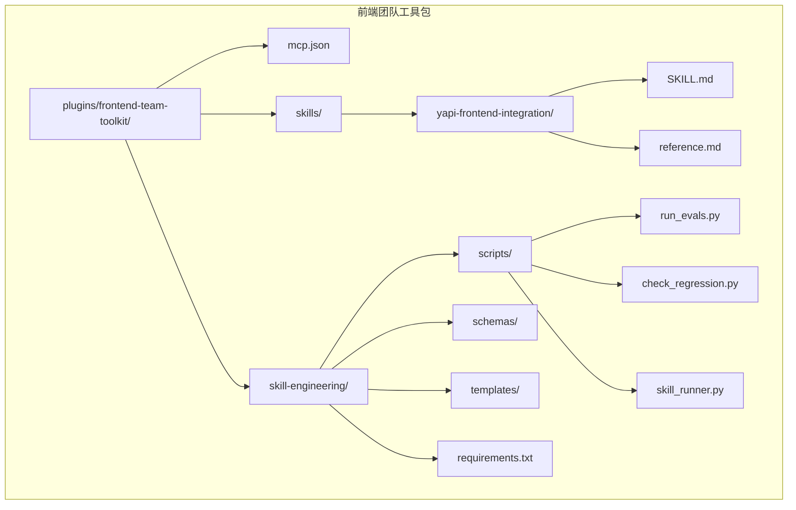
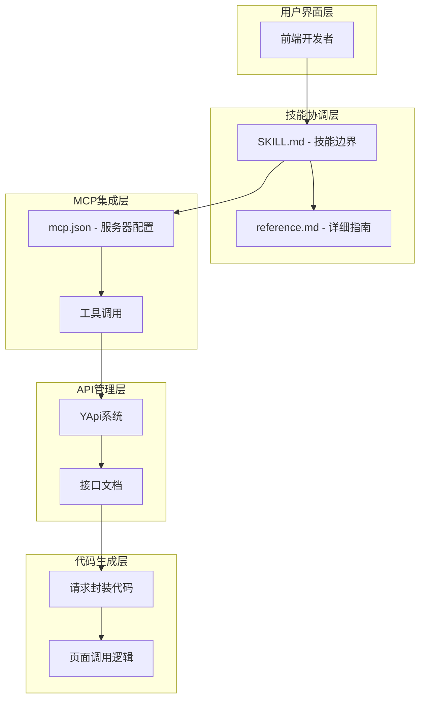
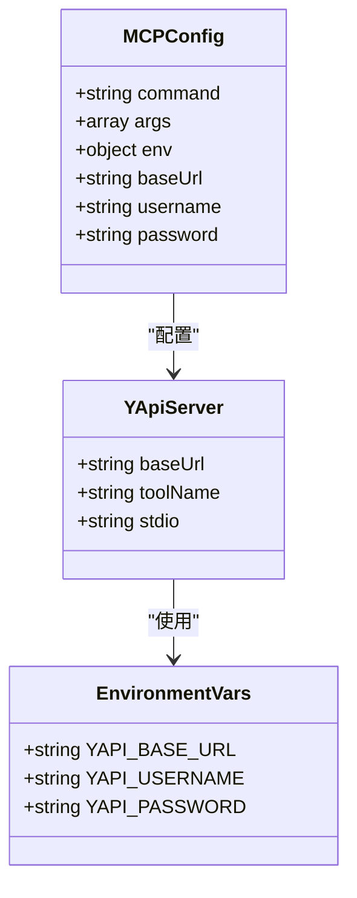
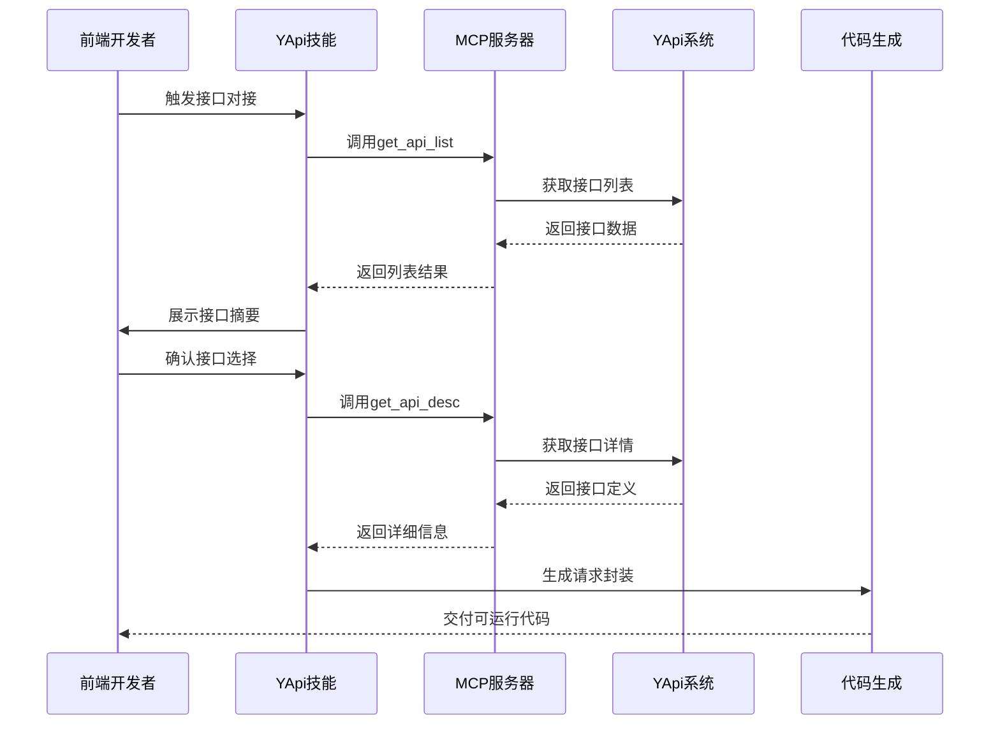
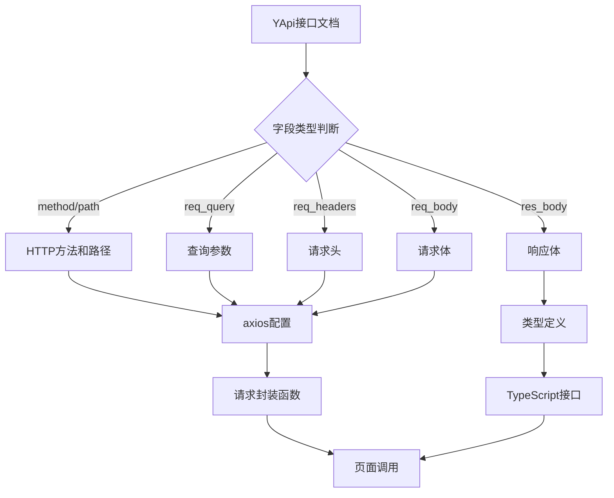
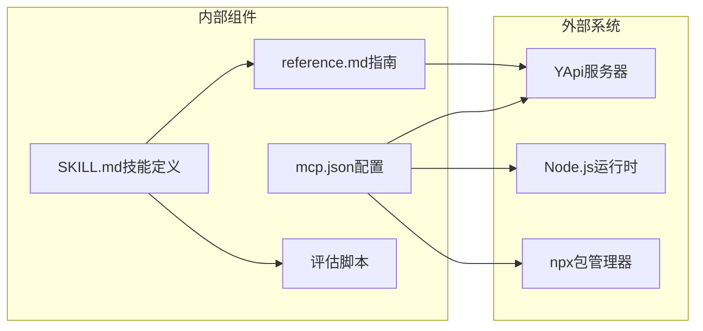
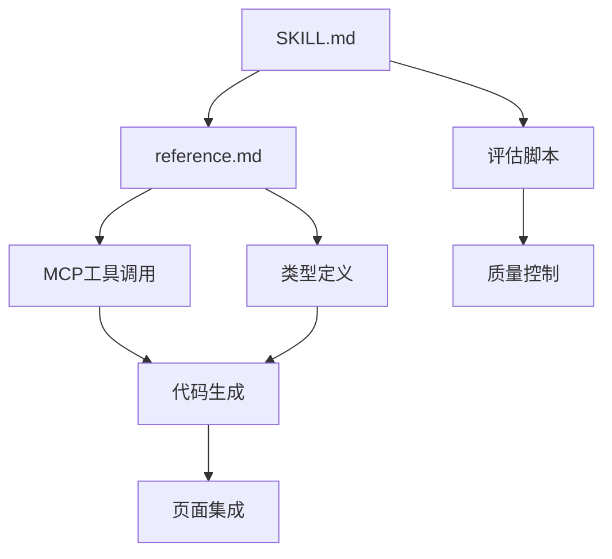

# YApi前端集成技能

<cite>
**本文档引用的文件**
- [README.md](file://README.md)
- [mcp.json](file://plugins/frontend-team-toolkit/mcp.json)
- [SKILL.md](file://plugins/frontend-team-toolkit/skills/yapi-frontend-integration/SKILL.md)
- [reference.md](file://plugins/frontend-team-toolkit/skills/yapi-frontend-integration/reference.md)
- [run_evals.py](file://plugins/frontend-team-toolkit/skill-engineering/scripts/run_evals.py)
- [README.md](file://plugins/frontend-team-toolkit/skill-engineering/README.md)
- [README.md](file://plugins/frontend-team-toolkit/skills/skills-quality/README.md)
</cite>

## 目录
1. [简介](#简介)
2. [项目结构](#项目结构)
3. [核心组件](#核心组件)
4. [架构概览](#架构概览)
5. [详细组件分析](#详细组件分析)
6. [依赖关系分析](#依赖关系分析)
7. [性能考虑](#性能考虑)
8. [故障排除指南](#故障排除指南)
9. [结论](#结论)
10. [附录](#附录)

## 简介

YApi前端集成技能是前端团队工具包中的核心能力，旨在通过YApi API管理平台实现高效的前端开发与后端API管理的协同。该技能通过Model Context Protocol (MCP) 连接YApi系统，提供两阶段的接口对接流程：先获取接口摘要进行确认，再实现具体的请求封装。

该技能专注于前端开发场景，确保前后端协作的规范性和一致性，通过标准化的工作流程和质量控制机制，提升API集成的效率和可靠性。

## 项目结构

前端团队工具包采用模块化组织结构，专门针对YApi前端集成进行了优化配置：

**图表来源**
- [README.md:155-182](file://README.md#L155-L182)
- [mcp.json:1-26](file://plugins/frontend-team-toolkit/mcp.json#L1-L26)

**章节来源**
- [README.md:155-182](file://README.md#L155-L182)
- [README.md:186-228](file://README.md#L186-L228)

## 核心组件

### MCP服务器配置

YApi前端集成技能的核心是通过mcp.json配置的MCP服务器，该配置定义了与YApi系统的连接参数和认证信息。

### 技能工作流

技能采用两阶段协议，确保接口对接的准确性和可靠性：
- **第一阶段**：获取接口摘要和拟实现路径
- **第二阶段**：确认后批量写入项目代码

### 质量控制机制

通过评估脚本和质量控制流程，确保技能执行的一致性和可靠性。

**章节来源**
- [mcp.json:1-26](file://plugins/frontend-team-toolkit/mcp.json#L1-L26)
- [SKILL.md:24-32](file://plugins/frontend-team-toolkit/skills/yapi-frontend-integration/SKILL.md#L24-L32)
- [run_evals.py:1-227](file://plugins/frontend-team-toolkit/skill-engineering/scripts/run_evals.py#L1-L227)

## 架构概览

YApi前端集成技能的整体架构采用分层设计，确保各组件的职责清晰和松耦合：

**图表来源**
- [README.md:26-61](file://README.md#L26-L61)
- [SKILL.md:8-22](file://plugins/frontend-team-toolkit/skills/yapi-frontend-integration/SKILL.md#L8-L22)
- [reference.md:1-105](file://plugins/frontend-team-toolkit/skills/yapi-frontend-integration/reference.md#L1-L105)

## 详细组件分析

### MCP服务器配置组件

MCP服务器配置是整个YApi集成的基础，定义了与外部API系统的连接参数：

**图表来源**
- [mcp.json:3-11](file://plugins/frontend-team-toolkit/mcp.json#L3-L11)

### 技能工作流组件

技能工作流采用两阶段设计，确保接口对接的准确性和安全性：

**图表来源**
- [SKILL.md:44-61](file://plugins/frontend-team-toolkit/skills/yapi-frontend-integration/SKILL.md#L44-L61)
- [reference.md:15-36](file://plugins/frontend-team-toolkit/skills/yapi-frontend-integration/reference.md#L15-L36)

### 数据转换组件

接口文档到前端代码的数据转换过程：

**图表来源**
- [reference.md:25-47](file://plugins/frontend-team-toolkit/skills/yapi-frontend-integration/reference.md#L25-L47)

**章节来源**
- [mcp.json:3-11](file://plugins/frontend-team-toolkit/mcp.json#L3-L11)
- [SKILL.md:44-61](file://plugins/frontend-team-toolkit/skills/yapi-frontend-integration/SKILL.md#L44-L61)
- [reference.md:25-47](file://plugins/frontend-team-toolkit/skills/yapi-frontend-integration/reference.md#L25-L47)

## 依赖关系分析

### 外部依赖

YApi前端集成技能依赖于多个外部组件和工具：

**图表来源**
- [mcp.json:4-10](file://plugins/frontend-team-toolkit/mcp.json#L4-L10)
- [README.md:30-42](file://README.md#L30-L42)

### 内部依赖

技能内部组件之间的依赖关系：

**图表来源**
- [SKILL.md:87-93](file://plugins/frontend-team-toolkit/skills/yapi-frontend-integration/SKILL.md#L87-L93)
- [reference.md:51-66](file://plugins/frontend-team-toolkit/skills/yapi-frontend-integration/reference.md#L51-L66)

**章节来源**
- [README.md:30-42](file://README.md#L30-L42)
- [SKILL.md:87-93](file://plugins/frontend-team-toolkit/skills/yapi-frontend-integration/SKILL.md#L87-L93)

## 性能考虑

### MCP调用优化

为了提高MCP调用的性能，建议：

1. **批量请求**：在可能的情况下，使用列表工具一次性获取多个接口信息
2. **缓存策略**：对频繁访问的接口定义实施缓存机制
3. **并发控制**：合理控制并发调用数量，避免对YApi服务器造成压力

### 代码生成效率

代码生成过程的性能优化：

- **模板复用**：复用现有的代码模板，减少重复生成
- **增量更新**：只更新发生变化的接口定义
- **并行处理**：对独立接口的处理可以并行执行

## 故障排除指南

### 常见问题诊断

| 症状 | 可能原因 | 解决方案 |
|------|----------|----------|
| 工具报认证失败 | YAPI_BASE_URL配置错误 | 检查环境变量设置，确认YApi服务器可达 |
| 无法获取接口列表 | 网络连接问题 | 验证VPN连接，检查防火墙设置 |
| 返回字段不一致 | 文档版本不同步 | 与后端确认最新文档，必要时添加兼容层 |
| Cursor内工具不可见 | MCP服务器未启动 | 启动MCP服务，检查Node.js环境 |

### 调试步骤

1. **环境检查**：确认MCP服务器配置正确
2. **网络验证**：测试与YApi服务器的连通性
3. **权限验证**：确认用户账户在目标项目中有足够权限
4. **工具验证**：检查MCP工具名称和参数

**章节来源**
- [reference.md:79-87](file://plugins/frontend-team-toolkit/skills/yapi-frontend-integration/reference.md#L79-L87)
- [README.md:26-42](file://README.md#L26-L42)

## 结论

YApi前端集成技能通过标准化的工作流程和严格的质量控制，为前端开发提供了可靠的API集成解决方案。该技能的核心优势在于：

1. **规范化流程**：两阶段协议确保接口对接的准确性
2. **安全控制**：严格的权限管理和认证机制
3. **质量保障**：完善的评估和质量控制体系
4. **协作友好**：清晰的前后端协作机制

通过合理配置和使用该技能，团队可以显著提升API集成的效率和质量，减少前后端协作中的沟通成本和错误率。

## 附录

### 最佳实践建议

1. **文档优先**：始终以YApi文档为准，避免凭记忆实现
2. **类型安全**：优先使用JSON Schema生成TypeScript类型
3. **错误处理**：遵循项目统一的错误处理模式
4. **安全意识**：不要在代码中硬编码敏感信息

### 配置检查清单

- [ ] MCP服务器配置正确
- [ ] 环境变量设置完成
- [ ] 网络连接正常
- [ ] 用户权限验证通过
- [ ] 工具调用测试成功