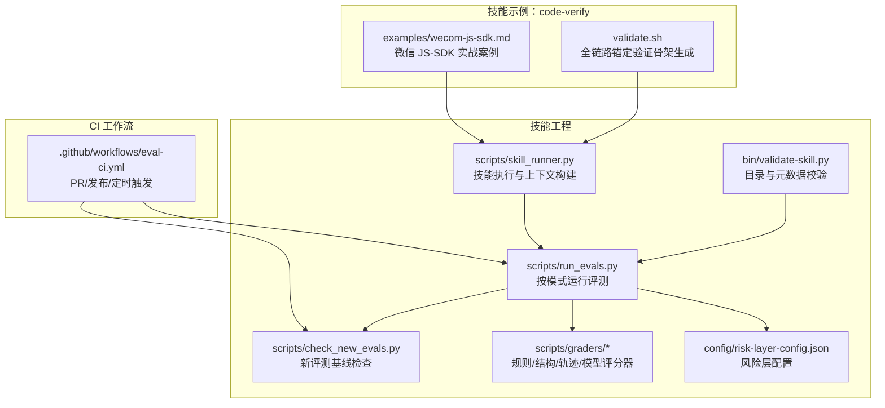
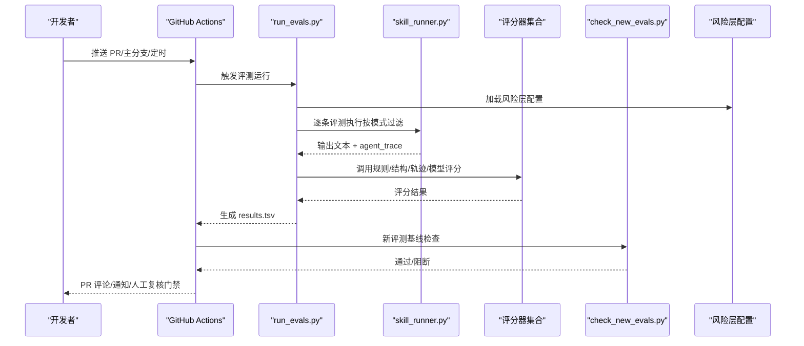
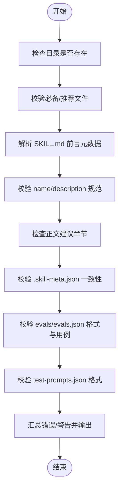
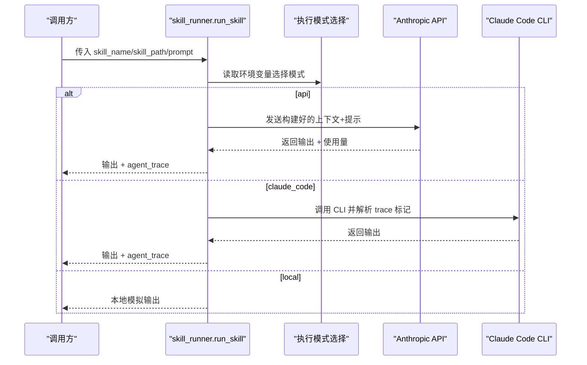
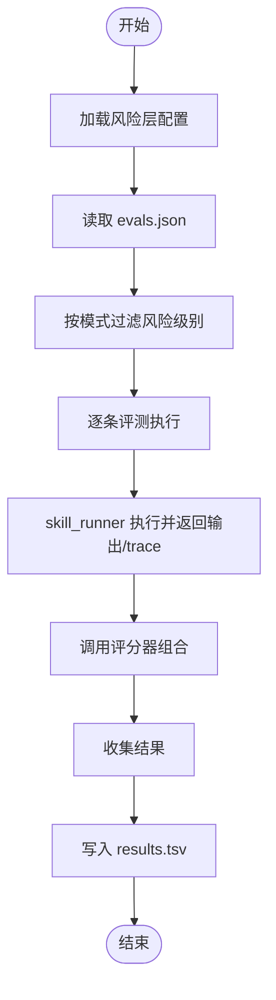
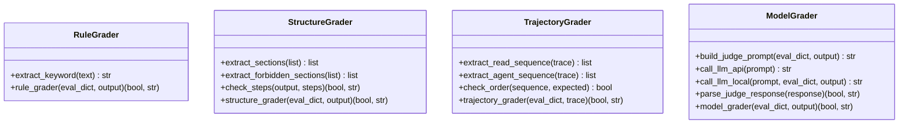
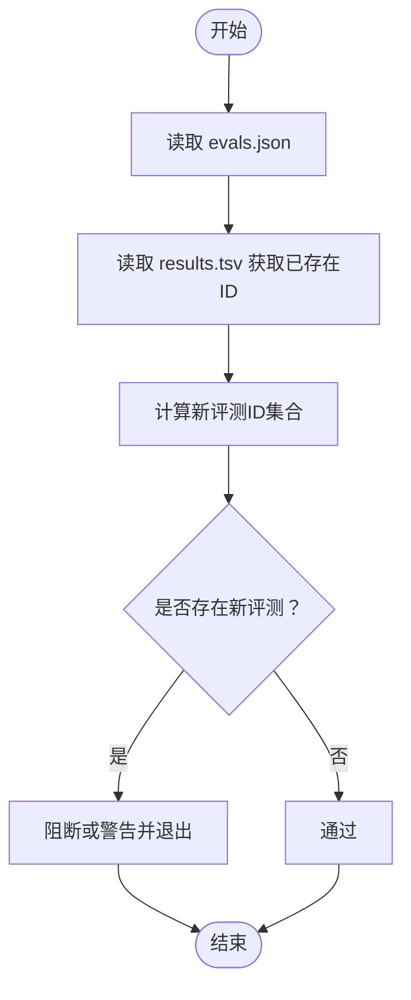
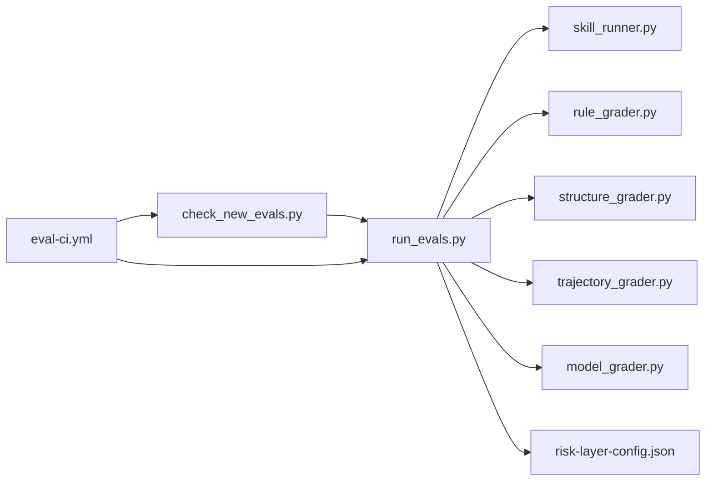

# 代码验证技能

<cite>
**本文引用的文件**
- [validate-skill.py](file://plugins/frontend-team-toolkit/skill-engineering/bin/validate-skill.py)
- [skill_runner.py](file://plugins/frontend-team-toolkit/skill-engineering/scripts/skill_runner.py)
- [run_evals.py](file://plugins/frontend-team-toolkit/skill-engineering/scripts/run_evals.py)
- [check_new_evals.py](file://plugins/frontend-team-toolkit/skill-engineering/scripts/check_new_evals.py)
- [rule_grader.py](file://plugins/frontend-team-toolkit/skill-engineering/scripts/graders/rule_grader.py)
- [structure_grader.py](file://plugins/frontend-team-toolkit/skill-engineering/scripts/graders/structure_grader.py)
- [trajectory_grader.py](file://plugins/frontend-team-toolkit/skill-engineering/scripts/graders/trajectory_grader.py)
- [model_grader.py](file://plugins/frontend-team-toolkit/skill-engineering/scripts/graders/model_grader.py)
- [risk-layer-config.json](file://plugins/frontend-team-toolkit/skill-engineering/config/risk-layer-config.json)
- [validate.sh](file://plugins/frontend-team-toolkit/skills/code-verify/validate.sh)
- [wecom-js-sdk.md](file://plugins/frontend-team-toolkit/skills/code-verify/examples/wecom-js-sdk.md)
- [eval-ci.yml](file://.github/workflows/eval-ci.yml)
- [.skill-meta.json](file://plugins/frontend-team-toolkit/skill-engineering/templates/new-skill/.skill-meta.json)
- [SKILL.md](file://plugins/frontend-team-toolkit/skill-engineering/templates/new-skill/SKILL.md)
</cite>

## 目录
1. [引言](#引言)
2. [项目结构](#项目结构)
3. [核心组件](#核心组件)
4. [架构总览](#架构总览)
5. [详细组件分析](#详细组件分析)
6. [依赖分析](#依赖分析)
7. [性能考虑](#性能考虑)
8. [故障排查指南](#故障排查指南)
9. [结论](#结论)
10. [附录](#附录)

## 引言
本文件面向希望系统掌握“代码验证技能”的开发者与工程团队，围绕仓库中的验证流水线与工具，提供从流程到实现、从原理到实践的完整指南。内容涵盖：
- 代码验证的流程与标准
- 验证脚本的实现原理与执行逻辑
- 具体验证示例与使用场景
- 不同代码库的验证方法与注意事项
- 微信 JS SDK 验证的实际案例与最佳实践
- 如何建立有效的代码质量保障体系

## 项目结构
该仓库以“技能工程”为核心，围绕 SKILL.md 的目录结构与配套文件，构建了从本地校验、CI 执行、评分打标到回归检查的闭环验证体系。

图示来源
- [validate-skill.py:1-193](file://plugins/frontend-team-toolkit/skill-engineering/bin/validate-skill.py#L1-L193)
- [skill_runner.py:1-378](file://plugins/frontend-team-toolkit/skill-engineering/scripts/skill_runner.py#L1-L378)
- [run_evals.py:1-227](file://plugins/frontend-team-toolkit/skill-engineering/scripts/run_evals.py#L1-L227)
- [check_new_evals.py:1-87](file://plugins/frontend-team-toolkit/skill-engineering/scripts/check_new_evals.py#L1-L87)
- [risk-layer-config.json:1-70](file://plugins/frontend-team-toolkit/skill-engineering/config/risk-layer-config.json#L1-L70)
- [validate.sh:1-176](file://plugins/frontend-team-toolkit/skills/code-verify/validate.sh#L1-L176)
- [wecom-js-sdk.md:1-25](file://plugins/frontend-team-toolkit/skills/code-verify/examples/wecom-js-sdk.md#L1-L25)
- [eval-ci.yml:1-208](file://.github/workflows/eval-ci.yml#L1-L208)

章节来源
- [validate-skill.py:1-193](file://plugins/frontend-team-toolkit/skill-engineering/bin/validate-skill.py#L1-L193)
- [eval-ci.yml:1-208](file://.github/workflows/eval-ci.yml#L1-L208)

## 核心组件
- 目录与元数据校验器：对技能目录结构、SKILL.md 前言元数据、必要/推荐文件进行一致性检查，确保模板规范落地。
- 技能执行器：支持本地模拟、Anthropic API、Claude Code 三种执行模式，统一输出与 agent_trace，便于轨迹评分。
- 评测运行器：按 CI 模式（PR/Release/Scheduled）筛选评测集，调用评分器，汇总结果并输出 TSV。
- 评分器集合：规则评分（关键词/路径/禁用词）、结构评分（章节/步骤/元数据）、轨迹评分（调用序列/并发/顺序）、模型评分（LLM 判决）。
- 新评测基线检查：防止新增评测未建立基线即合并。
- 风险层配置：定义不同模式下的评测过滤、阻断条件、半自动策略与通知。
- 全链路验证骨架：针对特定工具/场景生成标准化验证报告骨架，辅助“方案锚定—双锚验证—小步验证—止损—清单”五阶段推进。
- CI 工作流：自动化触发、结果上传、回归阻断、人工复核门禁与通知。

章节来源
- [validate-skill.py:83-167](file://plugins/frontend-team-toolkit/skill-engineering/bin/validate-skill.py#L83-L167)
- [skill_runner.py:84-326](file://plugins/frontend-team-toolkit/skill-engineering/scripts/skill_runner.py#L84-L326)
- [run_evals.py:135-174](file://plugins/frontend-team-toolkit/skill-engineering/scripts/run_evals.py#L135-L174)
- [check_new_evals.py:45-83](file://plugins/frontend-team-toolkit/skill-engineering/scripts/check_new_evals.py#L45-L83)
- [risk-layer-config.json:1-70](file://plugins/frontend-team-toolkit/skill-engineering/config/risk-layer-config.json#L1-L70)
- [validate.sh:1-176](file://plugins/frontend-team-toolkit/skills/code-verify/validate.sh#L1-L176)
- [eval-ci.yml:36-185](file://.github/workflows/eval-ci.yml#L36-L185)

## 架构总览
下图展示从 PR 推送到定时回归的端到端验证架构，以及各模块间的交互关系。

图示来源
- [eval-ci.yml:66-141](file://.github/workflows/eval-ci.yml#L66-L141)
- [run_evals.py:135-174](file://plugins/frontend-team-toolkit/skill-engineering/scripts/run_evals.py#L135-L174)
- [skill_runner.py:308-356](file://plugins/frontend-team-toolkit/skill-engineering/scripts/skill_runner.py#L308-L356)
- [check_new_evals.py:45-83](file://plugins/frontend-team-toolkit/skill-engineering/scripts/check_new_evals.py#L45-L83)
- [risk-layer-config.json:1-70](file://plugins/frontend-team-toolkit/skill-engineering/config/risk-layer-config.json#L1-L70)

## 详细组件分析

### 目录与元数据校验器（validate-skill.py）
- 校验要点
  - 目录命名：kebab-case，长度限制，与 SKILL.md name 一致
  - 必备文件：SKILL.md、CHANGELOG.md、.skill-meta.json、evals/evals.json、test-prompts.json、references/output-contract.md
  - 推荐文件：results.tsv、skill-issues.jsonl.example、scripts/validate-output.sh
  - SKILL.md 前言元数据：键值白名单、metadata 内联 JSON、name/description 规范
  - SKILL.md 正文：建议包含 when not to use、workflow、checkpoint 等章节
  - evals/evals.json：至少一条用例，每条包含 id/prompt
  - test-prompts.json：数组格式，建议非空
- 错误与警告：严格错误（阻断）与宽松警告（提醒）

图示来源
- [validate-skill.py:83-167](file://plugins/frontend-team-toolkit/skill-engineering/bin/validate-skill.py#L83-L167)

章节来源
- [validate-skill.py:16-39](file://plugins/frontend-team-toolkit/skill-engineering/bin/validate-skill.py#L16-L39)
- [validate-skill.py:83-167](file://plugins/frontend-team-toolkit/skill-engineering/bin/validate-skill.py#L83-L167)

### 技能执行器（skill_runner.py）
- 执行模式
  - local：本地模拟输出，便于离线测试
  - api：调用 Anthropic API，返回 agent_trace
  - claude_code：调用 Claude Code CLI，解析输出中的 trace 标记
- 上下文构建：聚合 SKILL.md、output-contract、scoring-rubric 等
- 特定技能模拟：如 wechat-article-review 的评审模拟逻辑
- 文件引用处理：对评测中引用的文件路径进行读取拼接

图示来源
- [skill_runner.py:308-356](file://plugins/frontend-team-toolkit/skill-engineering/scripts/skill_runner.py#L308-L356)
- [skill_runner.py:199-306](file://plugins/frontend-team-toolkit/skill-engineering/scripts/skill_runner.py#L199-L306)

章节来源
- [skill_runner.py:25-31](file://plugins/frontend-team-toolkit/skill-engineering/scripts/skill_runner.py#L25-L31)
- [skill_runner.py:62-81](file://plugins/frontend-team-toolkit/skill-engineering/scripts/skill_runner.py#L62-L81)
- [skill_runner.py:308-356](file://plugins/frontend-team-toolkit/skill-engineering/scripts/skill_runner.py#L308-L356)

### 评测运行器（run_evals.py）
- 模式与过滤
  - pr：高/中风险，高风险回归阻断
  - release：全量风险，任意回归阻断
  - scheduled：按频率（weekly/monthly/quarterly）过滤，可加随机抽查
- 评分器组合
  - rule：关键词/路径/禁用词
  - structure：章节/步骤/元数据
  - trajectory：agent/skill 调用序列与并发/顺序
  - model：LLM 判决（可多样本投票）
  - human：人工复核（可组合）
- 结果输出：TSV 文件，含统计摘要

图示来源
- [run_evals.py:135-174](file://plugins/frontend-team-toolkit/skill-engineering/scripts/run_evals.py#L135-L174)
- [run_evals.py:84-133](file://plugins/frontend-team-toolkit/skill-engineering/scripts/run_evals.py#L84-L133)

章节来源
- [run_evals.py:38-59](file://plugins/frontend-team-toolkit/skill-engineering/scripts/run_evals.py#L38-L59)
- [run_evals.py:135-174](file://plugins/frontend-team-toolkit/skill-engineering/scripts/run_evals.py#L135-L174)

### 评分器详解
- 规则评分（rule_grader）
  - 支持“必须包含/路径/章节”与“不得包含/禁止章节”两类规则
  - 关键词提取采用多种语言与引号模式
- 结构评分（structure_grader）
  - 检查章节存在性、禁用章节、YAML frontmatter 与字段完整性、步骤编号
- 轨迹评分（trajectory_grader）
  - 解析 agent_trace，提取 Read/Agent 调用序列，校验顺序、串并行约束、是否跳过子技能
- 模型评分（model_grader）
  - 构建 LLM 判决提示，支持本地模拟与 API 模式，可多样本投票

图示来源
- [rule_grader.py:41-92](file://plugins/frontend-team-toolkit/skill-engineering/scripts/graders/rule_grader.py#L41-L92)
- [structure_grader.py:63-122](file://plugins/frontend-team-toolkit/skill-engineering/scripts/graders/structure_grader.py#L63-L122)
- [trajectory_grader.py:59-139](file://plugins/frontend-team-toolkit/skill-engineering/scripts/graders/trajectory_grader.py#L59-L139)
- [model_grader.py:184-227](file://plugins/frontend-team-toolkit/skill-engineering/scripts/graders/model_grader.py#L184-L227)

章节来源
- [rule_grader.py:16-92](file://plugins/frontend-team-toolkit/skill-engineering/scripts/graders/rule_grader.py#L16-L92)
- [structure_grader.py:16-122](file://plugins/frontend-team-toolkit/skill-engineering/scripts/graders/structure_grader.py#L16-L122)
- [trajectory_grader.py:15-139](file://plugins/frontend-team-toolkit/skill-engineering/scripts/graders/trajectory_grader.py#L15-L139)
- [model_grader.py:28-227](file://plugins/frontend-team-toolkit/skill-engineering/scripts/graders/model_grader.py#L28-L227)

### 新评测基线检查（check_new_evals.py）
- 目的：防止新增评测未建立基线即合并
- 流程：读取当前 evals.json 与 results.tsv，识别新评测 ID，按配置决定阻断或警告

图示来源
- [check_new_evals.py:45-83](file://plugins/frontend-team-toolkit/skill-engineering/scripts/check_new_evals.py#L45-L83)

章节来源
- [check_new_evals.py:45-83](file://plugins/frontend-team-toolkit/skill-engineering/scripts/check_new_evals.py#L45-L83)

### 风险层配置（risk-layer-config.json）
- PR 模式：高/中风险，高风险回归阻断
- Release 模式：全量风险，任意回归阻断
- Scheduled 模式：按周/月/季过滤，可加随机抽查
- 评分器配置：自动/半自动、漂移风险等级、抽样率等
- 红线规则：定义阻断/警告事件类别

章节来源
- [risk-layer-config.json:1-70](file://plugins/frontend-team-toolkit/skill-engineering/config/risk-layer-config.json#L1-L70)

### 全链路验证骨架（validate.sh）
- 用途：为特定工具/场景生成标准化验证报告骨架，包含五阶段与七维评估
- 输入：工具名、代码/文件、语言、文档/参考链接、阶段、输出路径
- 输出：Markdown 报告骨架（可 stdout 或文件）

章节来源
- [validate.sh:1-176](file://plugins/frontend-team-toolkit/skills/code-verify/validate.sh#L1-L176)

### 微信 JS SDK 验证实战（wecom-js-sdk.md）
- 场景：企业微信内置浏览器 H5 对接，易混淆“注册应用身份”与“注入 JS-SDK 配置”
- 方法：按文档章节拆分 MVU，验证 wx.config/agentConfig 注入、会话 API、核心能力
- 效果：避免盲目信任 AI 导致的多轮迭代与时间浪费，将“完全陌生领域”在 60 分钟内止损

章节来源
- [wecom-js-sdk.md:1-25](file://plugins/frontend-team-toolkit/skills/code-verify/examples/wecom-js-sdk.md#L1-L25)

### CI 工作流（eval-ci.yml）
- 触发：PR、主分支推送、定时（周/月/季度）、手动派发
- 步骤：安装依赖、检测变更技能、按模式运行评测、回归检查、新评测基线检查、上传结果、生成摘要、PR 评论/Slack 通知、发布前人工复核

章节来源
- [eval-ci.yml:36-185](file://.github/workflows/eval-ci.yml#L36-L185)

## 依赖分析
- 组件耦合
  - run_evals.py 依赖 skill_runner 与评分器模块，耦合度适中，便于扩展新评分器
  - check_new_evals.py 依赖 results.tsv，形成“先基线、后变更”的治理闭环
  - CI 工作流串联 run_evals.py 与 check_new_evals.py，形成自动化门禁
- 外部依赖
  - anthropic SDK（API 模式）
  - Claude Code CLI（本地模式）
  - GitHub Actions（CI）

图示来源
- [run_evals.py:25-36](file://plugins/frontend-team-toolkit/skill-engineering/scripts/run_evals.py#L25-L36)
- [eval-ci.yml:66-141](file://.github/workflows/eval-ci.yml#L66-L141)

章节来源
- [run_evals.py:25-36](file://plugins/frontend-team-toolkit/skill-engineering/scripts/run_evals.py#L25-L36)
- [eval-ci.yml:66-141](file://.github/workflows/eval-ci.yml#L66-L141)

## 性能考虑
- 评测批量化：按模式过滤风险级别，减少不必要的全量评测
- 多样本投票：模型评分器可配置采样次数，平衡成本与稳定性
- 本地模拟：在开发阶段优先使用 local 模式，降低外部依赖开销
- 超时控制：Claude Code 执行设置超时，避免长时间阻塞
- 结果缓存：results.tsv 作为基线缓存，避免重复评测

## 故障排查指南
- 目录校验失败
  - 检查目录命名与 SKILL.md name 是否一致
  - 确认必备/推荐文件是否存在
  - 参考：validate-skill.py 的错误与警告输出
- 评测运行失败
  - 检查 CI 模式与风险层配置
  - 确认 evals.json 格式与用例完整性
  - 参考：run_evals.py 的过滤与评分流程
- 新评测未基线
  - 检查 results.tsv 是否存在对应 ID
  - 参考：check_new_evals.py 的差异计算与阻断逻辑
- API/CLI 依赖问题
  - 确认 anthropic SDK 安装与密钥
  - 确认 Claude Code CLI 可用与路径配置
  - 参考：skill_runner.py 的异常捕获与回退逻辑

章节来源
- [validate-skill.py:170-193](file://plugins/frontend-team-toolkit/skill-engineering/bin/validate-skill.py#L170-L193)
- [run_evals.py:135-174](file://plugins/frontend-team-toolkit/skill-engineering/scripts/run_evals.py#L135-L174)
- [check_new_evals.py:45-83](file://plugins/frontend-team-toolkit/skill-engineering/scripts/check_new_evals.py#L45-L83)
- [skill_runner.py:199-306](file://plugins/frontend-team-toolkit/skill-engineering/scripts/skill_runner.py#L199-L306)

## 结论
本仓库提供了从“目录规范—技能执行—评测评分—回归阻断—人工复核”的完整代码验证体系。通过标准化的 SKILL.md 模板、可扩展的评分器集合与灵活的 CI 工作流，团队可以快速建立可复用、可演进的质量保障能力。结合“全链路验证骨架”与实战案例，开发者可在复杂领域（如微信 JS SDK）中高效止损、稳定交付。

## 附录
- 模板与元数据
  - 新技能模板：.skill-meta.json 与 SKILL.md
- 使用建议
  - 在创建新技能时，先用 validate-skill.py 进行本地校验
  - 设计结构化评测与轨迹评测，覆盖关键编排路径
  - 在 CI 中启用新评测基线检查与回归阻断
  - 对高风险领域使用“全链路验证骨架”，按阶段推进

章节来源
- [.skill-meta.json:1-32](file://plugins/frontend-team-toolkit/skill-engineering/templates/new-skill/.skill-meta.json#L1-L32)
- [SKILL.md:1-97](file://plugins/frontend-team-toolkit/skill-engineering/templates/new-skill/SKILL.md#L1-L97)