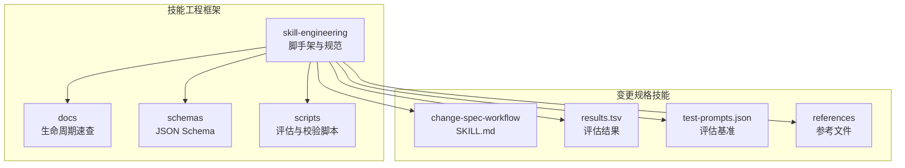
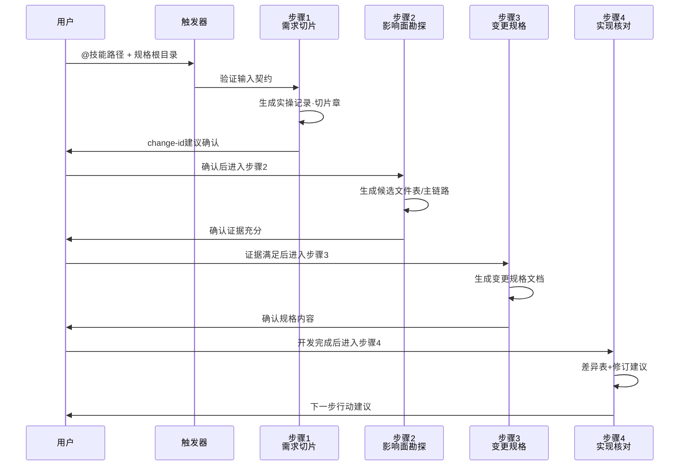
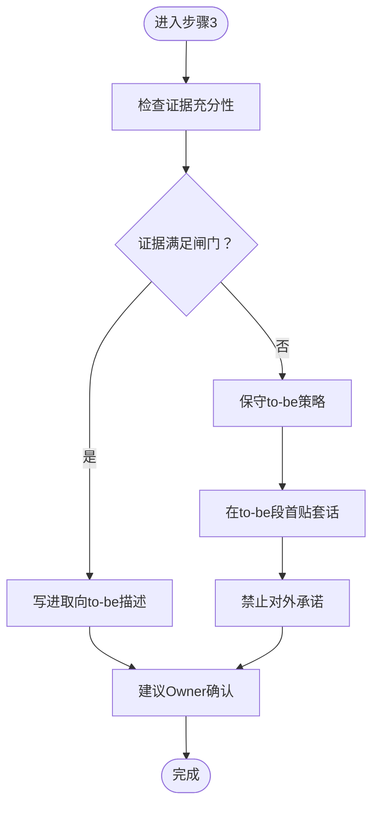
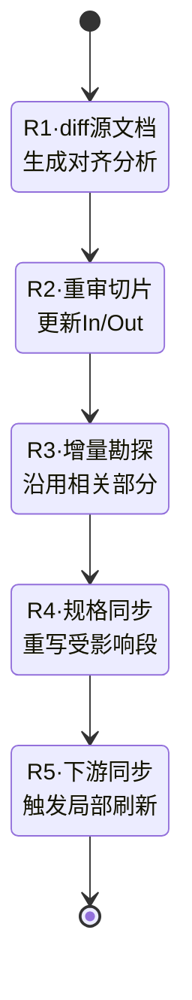
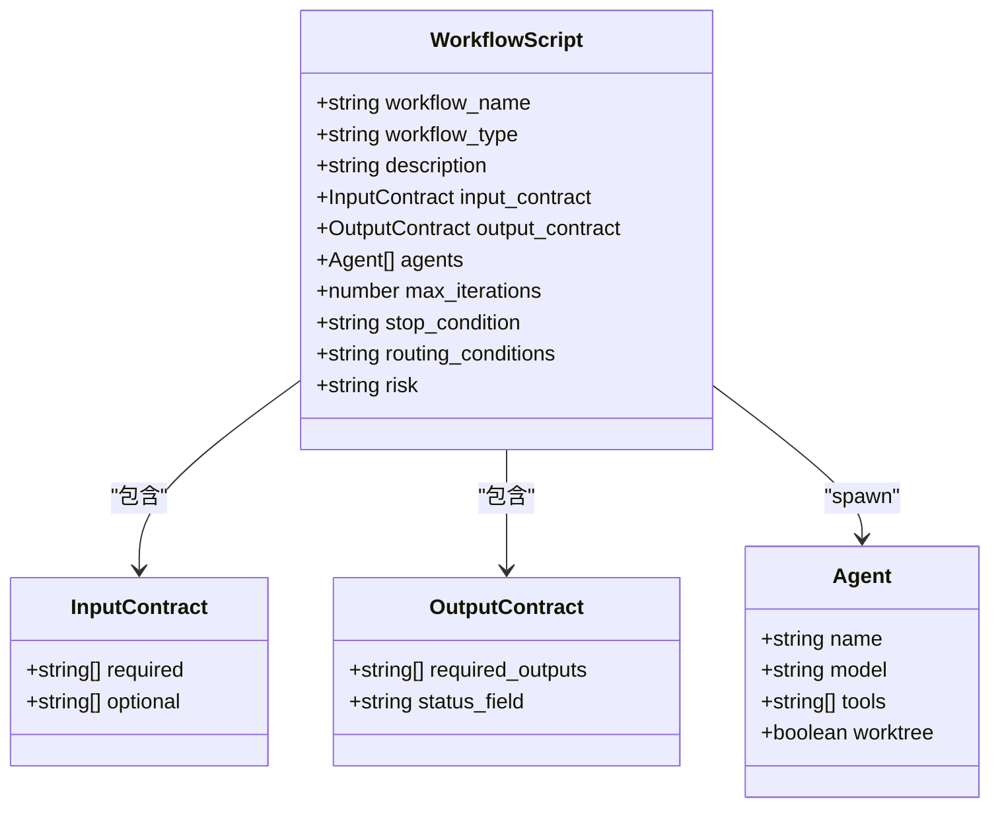
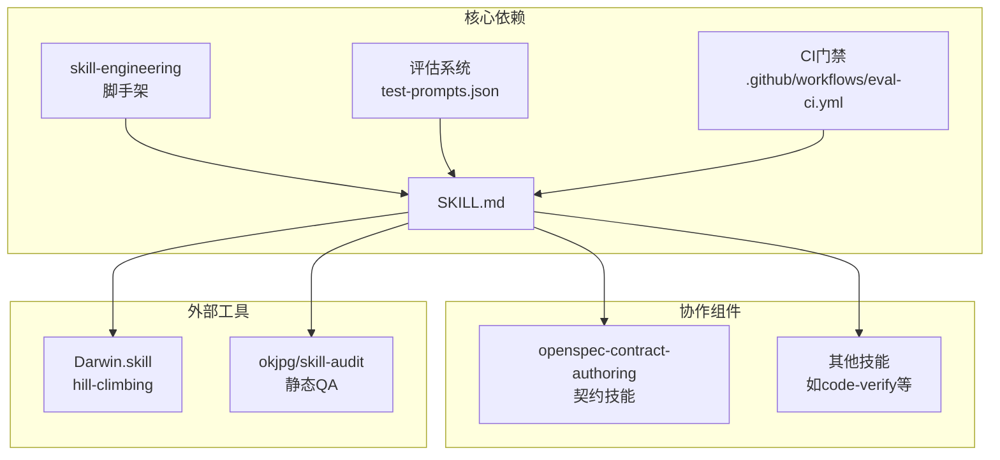

# 变更规格工作流技能

<cite>
**本文引用的文件**
- [SKILL.md](file://plugins/frontend-team-toolkit/skills/change-spec-workflow/SKILL.md)
- [results.tsv](file://plugins/frontend-team-toolkit/skills/change-spec-workflow/results.tsv)
- [README.md](file://plugins/frontend-team-toolkit/skill-engineering/README.md)
- [lifecycle-quickref.md](file://plugins/frontend-team-toolkit/skill-engineering/docs/lifecycle-quickref.md)
- [workflow.schema.json](file://plugins/frontend-team-toolkit/skill-engineering/schemas/workflow.schema.json)
</cite>

## 目录
1. [简介](#简介)
2. [项目结构](#项目结构)
3. [核心组件](#核心组件)
4. [架构概览](#架构概览)
5. [详细组件分析](#详细组件分析)
6. [依赖分析](#依赖分析)
7. [性能考虑](#性能考虑)
8. [故障排除指南](#故障排除指南)
9. [结论](#结论)
10. [附录](#附录)

## 简介
本技能提供一套可迁移的团队流程，用于管理变更规格（Change Spec）的全流程工作流。它强调严格的步骤顺序、证据导向的决策、以及可追溯的落盘规范，确保变更从需求切片到规格落地再到实现核对的每个环节都有清晰的边界和质量控制。

该技能的核心价值在于：
- **降低变更漂移**：通过需求切片与影响面勘探，将模糊需求转化为可执行的事实清单
- **提升规格质量**：以证据为基础的 to-be 描述，避免主观臆断
- **增强可追溯性**：严格的落盘结构与对账表，便于审计与回溯
- **支持版本演进**：Reconcile 子模式确保规格与源文档版本同步，避免遗留问题

## 项目结构
变更规格工作流技能位于前端团队工具箱的技能目录中，采用标准的技能工程结构，包含静态知识文件、评估基准与结果记录等。



**图表来源**
- [README.md: 34-96:34-96](file://plugins/frontend-team-toolkit/skill-engineering/README.md#L34-L96)
- [SKILL.md: 1-337:1-337](file://plugins/frontend-team-toolkit/skills/change-spec-workflow/SKILL.md#L1-L337)

**章节来源**
- [README.md: 34-96:34-96](file://plugins/frontend-team-toolkit/skill-engineering/README.md#L34-L96)
- [SKILL.md: 1-337:1-337](file://plugins/frontend-team-toolkit/skills/change-spec-workflow/SKILL.md#L1-L337)

## 核心组件
变更规格工作流技能由以下核心组件构成：

### 1. 静态知识与触发条件
- SKILL.md：定义技能名称、描述、触发方式、执行顺序、质量标准与评估方法
- .skill-meta.json：技能元数据（由脚手架生成）
- references/output-contract.md：输出契约（由脚手架生成）

### 2. 评估与质量保证
- test-prompts.json：标准化的评估基准，包含6个关键场景
- results.tsv：评估结果记录，支持回归检测与持续改进
- evals/evals.json：输出评估模板
- evals/trajectory-evals.json：过程评估模板

### 3. 参考与模板
- references/workflow-matrix.md：工作流矩阵参考
- references/gates-and-rollback.md：闸门与回滚参考
- references/intensity-tiers.md：强度层级参考

**章节来源**
- [README.md: 73-96:73-96](file://plugins/frontend-team-toolkit/skill-engineering/README.md#L73-L96)
- [SKILL.md: 1-337:1-337](file://plugins/frontend-team-toolkit/skills/change-spec-workflow/SKILL.md#L1-L337)

## 架构概览
变更规格工作流采用"静态知识 + 动态执行 + 评估反馈"的三层架构：

```mermaid
graph TB
subgraph "静态层"
SKILL[SKILL.md<br/>工作流规范]
Meta[.skill-meta.json<br/>元数据]
Contracts[references/<br/>输出契约]
end
subgraph "动态层"
Trigger[触发器<br/>@技能路径/关键词]
Executor[执行器<br/>步骤顺序与闸门]
Validator[验证器<br/>结构与过程评估]
end
subgraph "反馈层"
Prompts[test-prompts.json<br/>评估基准]
Results[results.tsv<br/>结果记录]
CI[GitHub Actions<br/>回归检测]
end
SKILL --> Trigger
Meta --> Trigger
Contracts --> Trigger
Trigger --> Executor
Executor --> Validator
Prompts --> Validator
Validator --> Results
Results --> CI
```

**图表来源**
- [README.md: 102-121:102-121](file://plugins/frontend-team-toolkit/skill-engineering/README.md#L102-L121)
- [SKILL.md: 96-106:96-106](file://plugins/frontend-team-toolkit/skills/change-spec-workflow/SKILL.md#L96-L106)

## 详细组件分析

### 执行顺序与步骤设计
变更规格工作流严格遵循四步执行顺序，每步都有明确的输入契约和输出要求：



**图表来源**
- [SKILL.md: 50-78:50-78](file://plugins/frontend-team-toolkit/skills/change-spec-workflow/SKILL.md#L50-L78)
- [SKILL.md: 107-233:107-233](file://plugins/frontend-team-toolkit/skills/change-spec-workflow/SKILL.md#L107-L233)

### 闸门控制与质量保障
工作流通过"闸门"机制确保 to-be 描述的质量与安全性：



**图表来源**
- [SKILL.md: 191-207:191-207](file://plugins/frontend-team-toolkit/skills/change-spec-workflow/SKILL.md#L191-L207)

### 版本演进与Reconcile子模式
当源文档版本发生变化时，工作流自动切换到Reconcile子模式：



**图表来源**
- [SKILL.md: 134-166:134-166](file://plugins/frontend-team-toolkit/skills/change-spec-workflow/SKILL.md#L134-L166)

### 动态编排与工作流模板
技能工程框架提供了多种动态编排模板，支持复杂场景的自动化执行：



**图表来源**
- [workflow.schema.json: 1-101:1-101](file://plugins/frontend-team-toolkit/skill-engineering/schemas/workflow.schema.json#L1-L101)

**章节来源**
- [SKILL.md: 107-233:107-233](file://plugins/frontend-team-toolkit/skills/change-spec-workflow/SKILL.md#L107-L233)
- [workflow.schema.json: 1-101:1-101](file://plugins/frontend-team-toolkit/skill-engineering/schemas/workflow.schema.json#L1-L101)

## 依赖分析
变更规格工作流技能与其他组件的依赖关系如下：



**图表来源**
- [README.md: 130-137:130-137](file://plugins/frontend-team-toolkit/skill-engineering/README.md#L130-L137)
- [SKILL.md: 45-49:45-49](file://plugins/frontend-team-toolkit/skills/change-spec-workflow/SKILL.md#L45-L49)

**章节来源**
- [README.md: 130-137:130-137](file://plugins/frontend-team-toolkit/skill-engineering/README.md#L130-L137)
- [SKILL.md: 45-49:45-49](file://plugins/frontend-team-toolkit/skills/change-spec-workflow/SKILL.md#L45-L49)

## 性能考虑
变更规格工作流在设计时充分考虑了性能与效率：

### 1. 执行效率优化
- **步骤隔离**：严格的步骤顺序避免重复计算，每个步骤只处理当前阶段的任务
- **证据导向**：通过证据检查减少无效搜索，提高勘探效率
- **增量处理**：Reconcile子模式支持增量更新，避免全量重跑

### 2. 资源利用优化
- **内存友好**：采用渐进式输出策略，逐步生成中间产物
- **网络优化**：Monorepo场景下的范围限定，减少不必要的文件扫描
- **并发支持**：动态编排模板支持并行执行，提高吞吐量

### 3. 可扩展性设计
- **模块化结构**：每个步骤相对独立，便于单独优化
- **配置驱动**：通过参数调整执行策略，适应不同规模项目
- **插件化架构**：支持与其他技能协作，形成技能生态系统

## 故障排除指南

### 常见问题与解决方案

#### 1. 输入契约未满足
**症状**：技能拒绝执行或只输出待补充清单
**原因**：规格根目录缺失、可读规格文件不足
**解决**：
- 确保@到正确的规格根目录
- 检查规格文件的可读性
- 提供明确的勘探范围（针对Monorepo）

#### 2. 证据不足导致闸门未满足
**症状**：to-be描述被标记为保守，包含套话
**原因**：as-is描述缺乏路径+符号/行号
**解决**：
- 在步骤2中提供足够的证据
- 使用"接受证据不足草案"的用户声明
- 参考模式库进行Greenfield模式

#### 3. 版本演进冲突
**症状**：Reconcile子模式执行异常
**原因**：源文档版本变化但未正确触发Reconcile
**解决**：
- 明确声明"按vN重审"
- 按R1-R5步骤顺序执行
- 确保不遗留旧版本内容

#### 4. 评估基准不通过
**症状**：results.tsv中出现fail记录
**原因**：未满足评估基准中的关键要求
**解决**：
- 仔细检查评估基准中的具体场景
- 参考results.tsv中的注释说明
- 修正后重新运行评估

**章节来源**
- [SKILL.md: 234-244:234-244](file://plugins/frontend-team-toolkit/skills/change-spec-workflow/SKILL.md#L234-L244)
- [results.tsv: 1-9:1-9](file://plugins/frontend-team-toolkit/skills/change-spec-workflow/results.tsv#L1-L9)

## 结论
变更规格工作流技能通过严谨的流程设计、严格的证据控制和完善的评估体系，为软件变更管理提供了可靠的解决方案。其核心优势包括：

1. **流程标准化**：四步执行顺序确保变更管理的系统性和完整性
2. **质量保障**：闸门机制和人在回路防止错误决策
3. **可追溯性**：完整的落盘结构支持审计与回溯
4. **持续改进**：评估基准与CI门禁形成闭环反馈

该技能特别适合需要严格变更控制的大型项目和团队，能够有效降低变更风险，提高开发效率，并为项目的长期维护奠定坚实基础。

## 附录

### 使用指南摘要
1. **触发方式**：@技能路径或包含特定关键词
2. **执行顺序**：1→2→3（必要时→4）
3. **质量标准**：结构分≥55，效果分≥33（6/6）
4. **评估方法**：基于test-prompts.json的基准测试

### 配置说明
- **输入契约**：规格根目录、勘探范围、可读源码
- **输出要求**：实操记录、变更规格、对账表
- **评估指标**：结构完整性、效果达成度、回归稳定性

### 最佳实践
- 在步骤1完成后进行change-id确认
- 严格遵循Reconcile子模式处理版本演进
- 定期运行评估基准监控质量趋势
- 建立团队内部的变更规格审查流程