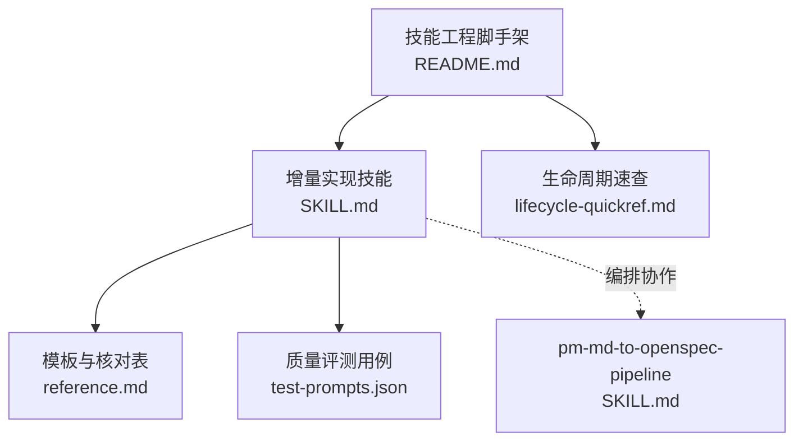
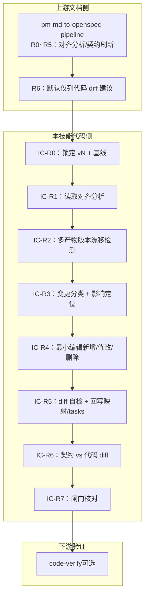
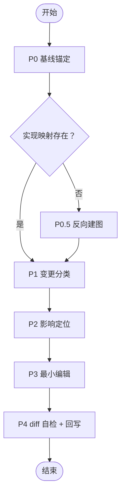
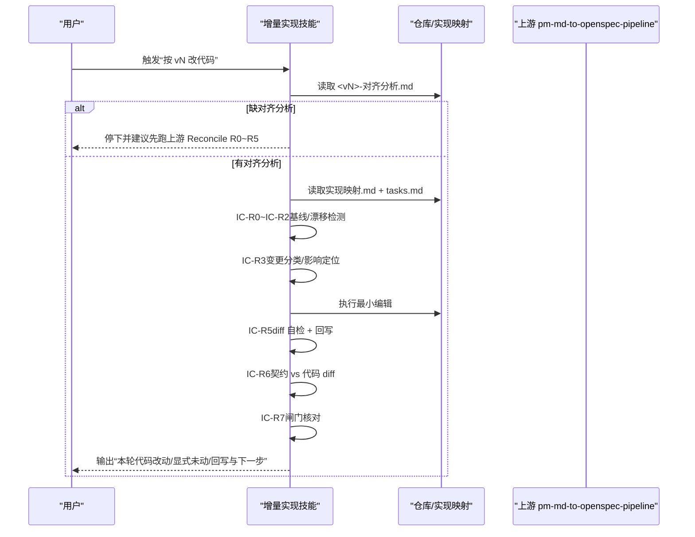
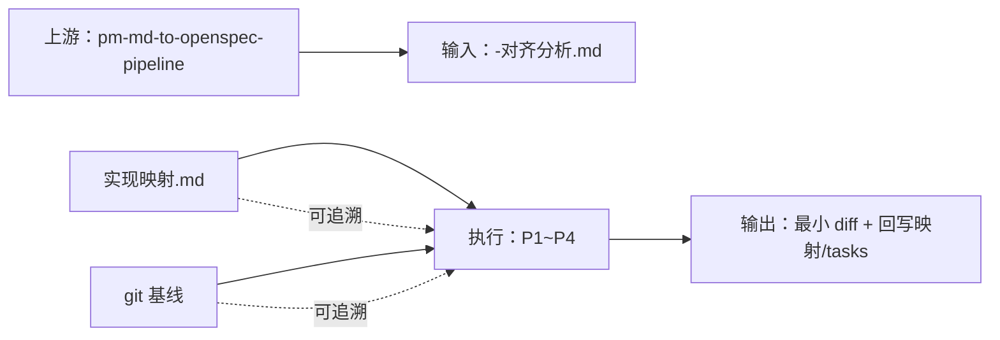

# 增量实现技能

<cite>
**本文引用的文件**
- [SKILL.md](file://plugins/frontend-team-toolkit/skills/incremental-implementation/SKILL.md)
- [reference.md](file://plugins/frontend-team-toolkit/skills/incremental-implementation/reference.md)
- [test-prompts.json](file://plugins/frontend-team-toolkit/skills/incremental-implementation/test-prompts.json)
- [SKILL.md（pm-md-to-openspec-pipeline）](file://plugins/frontend-team-toolkit/skills/pm-md-to-openspec-pipeline/SKILL.md)
- [README.md（skill-engineering）](file://plugins/frontend-team-toolkit/skill-engineering/README.md)
- [lifecycle-quickref.md](file://plugins/frontend-team-toolkit/skill-engineering/docs/lifecycle-quickref.md)
</cite>

## 目录
1. [简介](#简介)
2. [项目结构](#项目结构)
3. [核心组件](#核心组件)
4. [架构总览](#架构总览)
5. [详细组件分析](#详细组件分析)
6. [依赖分析](#依赖分析)
7. [性能考量](#性能考量)
8. [故障排查指南](#故障排查指南)
9. [结论](#结论)
10. [附录](#附录)

## 简介
本文件面向“增量实现技能”的专业文档，系统阐述增量开发理念、渐进式实现策略与实施步骤，提供完整的参考指南与测试提示，分析增量实现的优势与适用场景，并结合仓库中的技能工程实践给出可操作的落地方法。核心目标是：在“现有代码 + git 基线 + 实现映射”三要素的约束下，将“开发文档的 delta”安全、可追溯地落成“旧代码上的最小 diff”，避免 greenfield 重跑带来的漂移与回归风险。

## 项目结构
本技能位于前端团队市场化的 Cursor 插件中，属于“技能工程”体系的一部分。其核心文件包括：
- 技能静态知识与工作流：SKILL.md
- 模板与核对表：reference.md
- 质量评测用例：test-prompts.json
- 与上游技能的编排关系：pm-md-to-openspec-pipeline 的 SKILL.md
- 技能工程脚手架与生命周期：skill-engineering/README.md 与 lifecycle-quickref.md

图表来源
- [SKILL.md:1-348](file://plugins/frontend-team-toolkit/skills/incremental-implementation/SKILL.md#L1-L348)
- [reference.md:1-235](file://plugins/frontend-team-toolkit/skills/incremental-implementation/reference.md#L1-L235)
- [test-prompts.json:1-141](file://plugins/frontend-team-toolkit/skills/incremental-implementation/test-prompts.json#L1-L141)
- [SKILL.md（pm-md-to-openspec-pipeline）:1-329](file://plugins/frontend-team-toolkit/skills/pm-md-to-openspec-pipeline/SKILL.md#L1-L329)
- [README.md（skill-engineering）:1-294](file://plugins/frontend-team-toolkit/skill-engineering/README.md#L1-L294)
- [lifecycle-quickref.md:1-32](file://plugins/frontend-team-toolkit/skill-engineering/docs/lifecycle-quickref.md#L1-L32)

章节来源
- [SKILL.md:1-348](file://plugins/frontend-team-toolkit/skills/incremental-implementation/SKILL.md#L1-L348)
- [reference.md:1-235](file://plugins/frontend-team-toolkit/skills/incremental-implementation/reference.md#L1-L235)
- [test-prompts.json:1-141](file://plugins/frontend-team-toolkit/skills/incremental-implementation/test-prompts.json#L1-L141)
- [SKILL.md（pm-md-to-openspec-pipeline）:1-329](file://plugins/frontend-team-toolkit/skills/pm-md-to-openspec-pipeline/SKILL.md#L1-L329)
- [README.md（skill-engineering）:1-294](file://plugins/frontend-team-toolkit/skill-engineering/README.md#L1-L294)
- [lifecycle-quickref.md:1-32](file://plugins/frontend-team-toolkit/skill-engineering/docs/lifecycle-quickref.md#L1-L32)

## 核心组件
- 铁律与边界：明确“禁止 greenfield 重建”“只生成 delta”“git 基线先行”“代码↔任务双向可追溯”“Reconcile 代码编排”“多产物版本一致”“局部更新护栏”等原则。
- 五阶段执行流水线：P0 基线锚定 → P0.5 反向建图 → P1 变更分类 → P2 影响定位 → P3 最小编辑 → P4 diff 自检 + 回写。
- Reconcile 代码编排（IC-R0~IC-R7）：锁定基准 vN → 读取对齐分析 → 多产物版本漂移检测 → 变更分类与影响定位 → 最小编辑 → diff 自检与回写 → 契约 vs 代码 diff → 闸门核对。
- 实现映射（任务↔代码锚点）：specs/<change-id>/实现映射.md，首次进入时若缺失，先做 P0.5 反向建图。
- 局部代码更新护栏：当用户仅要求改某模块/文件时，输出“未同步产物清单 + 风险声明”，禁止宣称 IC-R7 已闭合。
- 与上游技能的分工：pm-md-to-openspec-pipeline 负责文档 Reconcile（R0~R5）与契约刷新（R6 默认仅列建议），本技能负责代码 Reconcile（IC-R0~IC-R7）与最小 diff 落地。

章节来源
- [SKILL.md:21-36](file://plugins/frontend-team-toolkit/skills/incremental-implementation/SKILL.md#L21-L36)
- [SKILL.md:80-144](file://plugins/frontend-team-toolkit/skills/incremental-implementation/SKILL.md#L80-L144)
- [SKILL.md:161-213](file://plugins/frontend-team-toolkit/skills/incremental-implementation/SKILL.md#L161-L213)
- [reference.md:7-45](file://plugins/frontend-team-toolkit/skills/incremental-implementation/reference.md#L7-L45)
- [SKILL.md:235-270](file://plugins/frontend-team-toolkit/skills/incremental-implementation/SKILL.md#L235-L270)
- [SKILL.md（pm-md-to-openspec-pipeline）:167-218](file://plugins/frontend-team-toolkit/skills/pm-md-to-openspec-pipeline/SKILL.md#L167-L218)

## 架构总览
增量实现技能在“文档 Reconcile + 代码 Reconcile”的双轨编排中发挥作用，上游负责对齐分析与契约刷新，下游负责将 delta 落地为最小代码 diff，并回写映射与任务状态。

图表来源
- [SKILL.md（pm-md-to-openspec-pipeline）:167-218](file://plugins/frontend-team-toolkit/skills/pm-md-to-openspec-pipeline/SKILL.md#L167-L218)
- [SKILL.md:161-213](file://plugins/frontend-team-toolkit/skills/incremental-implementation/SKILL.md#L161-L213)
- [SKILL.md:272-289](file://plugins/frontend-team-toolkit/skills/incremental-implementation/SKILL.md#L272-L289)

## 详细组件分析

### 组件A：五阶段执行流水线（P0~P4）
- P0 基线锚定：工作区干净 + 建基线 + 读取实现映射、tasks、对齐分析。
- P0.5 反向建图：当实现映射缺失时，从现有代码与 tasks 回填锚点，不确定的标“锚点待确认”。
- P1 变更分类：将变更归入“新增/修改/删除/不变”，输出变更分类表。
- P2 影响定位：对每个变更项定位受影响文件/函数/调用点/测试，修改/删除必须找到现存落点。
- P3 最小编辑：原地 StrReplace 做最小补丁；新增优先复用现有模块；删除定点清理。
- P4 diff 自检 + 回写：git diff 复核；回写实现映射与 tasks 状态；跑关键路径验证。

图表来源
- [SKILL.md:80-144](file://plugins/frontend-team-toolkit/skills/incremental-implementation/SKILL.md#L80-L144)

章节来源
- [SKILL.md:80-144](file://plugins/frontend-team-toolkit/skills/incremental-implementation/SKILL.md#L80-L144)

### 组件B：Reconcile 代码编排（IC-R0~IC-R7）
- IC-R0：锁定基准 vN + git 基线（工作区干净）。
- IC-R1：读取 <vN>-对齐分析.md 三栏（缺则停或用户书面接受 tasks-diff 风险）。
- IC-R2：多产物版本漂移检测（实现映射/tasks/契约四文件/Change Spec）。
- IC-R3：P1 变更分类 + P2 影响定位。
- IC-R4：P3 最小编辑（应剔除→删除；应新增→新增；仍保留→修改或不变）。
- IC-R5：P4 diff 自检 + 回写实现映射/tasks 状态/版本标识。
- IC-R6：契约 vs 代码 diff（matrix vs 实现不一致→Open Question 或回 pipeline）。
- IC-R7：闸门核对（剔除项已清除、新增项已有锚点、不变项未误改、版本一致）。

图表来源
- [SKILL.md:161-213](file://plugins/frontend-team-toolkit/skills/incremental-implementation/SKILL.md#L161-L213)
- [SKILL.md（pm-md-to-openspec-pipeline）:167-218](file://plugins/frontend-team-toolkit/skills/pm-md-to-openspec-pipeline/SKILL.md#L167-L218)

章节来源
- [SKILL.md:161-213](file://plugins/frontend-team-toolkit/skills/incremental-implementation/SKILL.md#L161-L213)

### 组件C：实现映射（任务↔代码锚点）
- 落盘路径：specs/<change-id>/实现映射.md
- 作用：把每个开发任务锚定到具体代码位置，使“已提交代码”成为可追溯的事实源
- 首次使用：若不存在，先用 P0.5“反向建图”从现有代码回填
- 状态枚举：未实现/部分实现/已实现/已废弃/锚点待确认
- 修订记录：对齐分析 + 本表落成最小 diff

章节来源
- [reference.md:7-45](file://plugins/frontend-team-toolkit/skills/incremental-implementation/reference.md#L7-L45)
- [SKILL.md:66-77](file://plugins/frontend-team-toolkit/skills/incremental-implementation/SKILL.md#L66-L77)

### 组件D：局部代码更新护栏
- 触发条件：用户仅要求改某模块/文件（如“只删某 API”“只改某页面字段”）
- 必含输出：本次局部更新 + 未同步产物清单 + 风险声明
- 禁止行为：局部改代码后宣称 IC-R7 已闭合；未同步产物清单不得静默忽略

章节来源
- [SKILL.md:235-270](file://plugins/frontend-team-toolkit/skills/incremental-implementation/SKILL.md#L235-L270)
- [reference.md:160-186](file://plugins/frontend-team-toolkit/skills/incremental-implementation/reference.md#L160-L186)

### 组件E：与上游技能的衔接
- 上游：pm-md-to-openspec-pipeline 负责 Reconcile R0~R5 与契约刷新（R6 默认仅列建议）
- 本技能：消费 <vN>-对齐分析.md + 实现映射 + git 基线，产出“旧代码上的最小 diff”并回写映射/tasks
- 下游：可选 code-verify + 仓库 tasks.md Evidence

章节来源
- [SKILL.md（pm-md-to-openspec-pipeline）:1-329](file://plugins/frontend-team-toolkit/skills/pm-md-to-openspec-pipeline/SKILL.md#L1-L329)
- [SKILL.md:272-289](file://plugins/frontend-team-toolkit/skills/incremental-implementation/SKILL.md#L272-L289)

## 依赖分析
- 与上游技能的耦合：依赖 pm-md-to-openspec-pipeline 的对齐分析与契约刷新产物
- 与实现映射的耦合：实现映射是“任务↔代码”的唯一锚点，贯穿 P0.5~P4
- 与 git 基线的耦合：P0 基线锚定与 P4 diff 自检强依赖可信基线
- 与多产物版本的一致性：实现映射/tasks/契约四文件/Change Spec 必须共享同一基准版本 vN

图表来源
- [SKILL.md（pm-md-to-openspec-pipeline）:167-218](file://plugins/frontend-team-toolkit/skills/pm-md-to-openspec-pipeline/SKILL.md#L167-L218)
- [SKILL.md:80-144](file://plugins/frontend-team-toolkit/skills/incremental-implementation/SKILL.md#L80-L144)

章节来源
- [SKILL.md（pm-md-to-openspec-pipeline）:167-218](file://plugins/frontend-team-toolkit/skills/pm-md-to-openspec-pipeline/SKILL.md#L167-L218)
- [SKILL.md:80-144](file://plugins/frontend-team-toolkit/skills/incremental-implementation/SKILL.md#L80-L144)

## 性能考量
- 降低漂移成本：通过“现有代码 + git 基线 + 实现映射”三要素，避免重复生成导致的命名/拆分/组织风格漂移
- 加速回归验证：最小 diff + git diff 自检 + 关键路径验证，减少无效改动带来的回归风险
- 降低沟通成本：变更分类表/影响定位表/IC-R7 快速核对表，使评审与对齐更高效
- 降低维护成本：不变项显式断言不动，防止“顺手优化”带来的破坏性变更

## 故障排查指南
- 工作区不干净：P0 停止，要求先提交/暂存，不得在未建立可信基线时改代码
- 缺对齐分析：建议先跑上游 Reconcile R0~R5，或用户书面接受 tasks diff 风险
- 禁止 greenfield 重建：已存在实现不得整文件重写或另起新文件覆盖
- 多产物版本漂移：IC-R2 检测到漂移时暂停改代码，建议先对齐再继续
- 局部更新未闭合：输出“未同步产物清单 + 风险声明”，不得宣称 IC-R7 已闭合
- 不变项误改：P4 git diff 复核，确保“仍保留/不变”项未被误改

章节来源
- [test-prompts.json:1-141](file://plugins/frontend-team-toolkit/skills/incremental-implementation/test-prompts.json#L1-L141)
- [SKILL.md:293-324](file://plugins/frontend-team-toolkit/skills/incremental-implementation/SKILL.md#L293-L324)

## 结论
增量实现技能通过“现有代码 + git 基线 + 实现映射”的约束，将“开发文档的 delta”安全、可追溯地落成“旧代码上的最小 diff”。配合上游文档 Reconcile 与下游验证，形成闭环的质量保障体系。对于需求多次迭代、源文档版本演进、局部模块更新等场景尤为适用，能够显著降低漂移与回归风险，提升开发效率与交付质量。

## 附录

### A. 适用/不适用场景
- 适用：需求已实现过、PRD 升版本后要改、二次/多次迭代、Reconcile 已产出对齐分析、按 vN 全链同步代码、仅改部分模块/文件
- 不适用：全新项目首次实现、纯文档编写、与 openspec/changes 无关的临时重构/样式微调

章节来源
- [SKILL.md:42-52](file://plugins/frontend-team-toolkit/skills/incremental-implementation/SKILL.md#L42-L52)

### B. 质量评测与回归门禁
- 评测用例：test-prompts.json（incremental-001～incremental-010）
- 发布前：高风险 case（incremental-001～006）须 100% 通过
- CI 门禁：PR 触发（high/medium）阻塞回归退化；定期回归发现长期退化

章节来源
- [SKILL.md:337-344](file://plugins/frontend-team-toolkit/skills/incremental-implementation/SKILL.md#L337-L344)
- [README.md（skill-engineering）:168-205](file://plugins/frontend-team-toolkit/skill-engineering/README.md#L168-L205)

### C. 技能生命周期与发布门禁
- 生命周期：0 创建 → 1 边界 → 2 写 Eval → 3 Baseline → 4 单假设 → 5 验证 → 6 棘轮 → 7 发布 → 8 监控
- 发布门禁：validate-skill.py 通过、Regression eval 无退步、CHANGELOG 已写动机与风险、.skill-meta.json 的 baseline 已更新

章节来源
- [lifecycle-quickref.md:1-32](file://plugins/frontend-team-toolkit/skill-engineering/docs/lifecycle-quickref.md#L1-L32)
- [README.md（skill-engineering）:170-188](file://plugins/frontend-team-toolkit/skill-engineering/README.md#L170-L188)