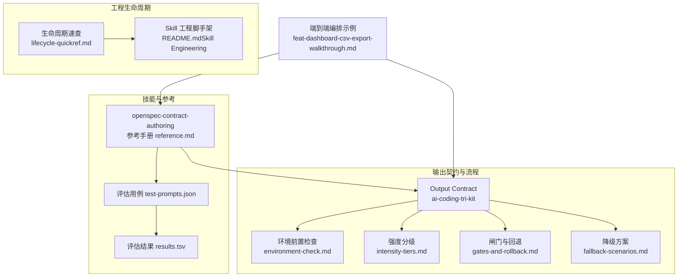
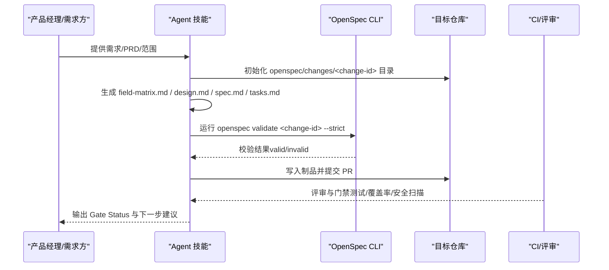
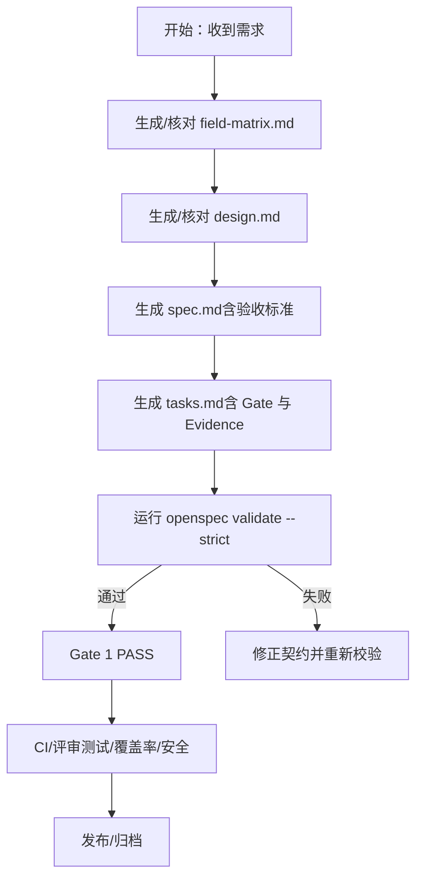
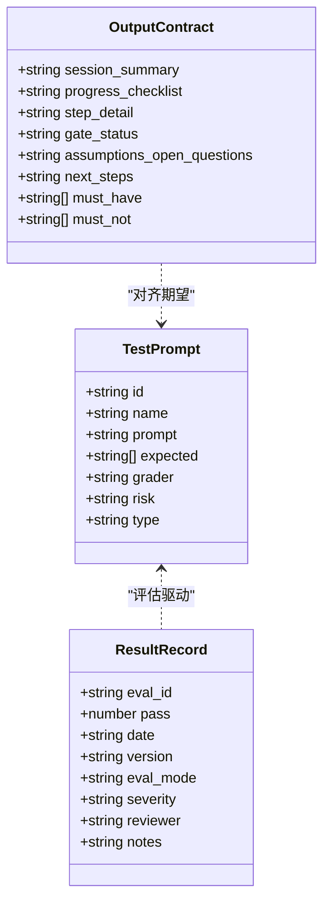
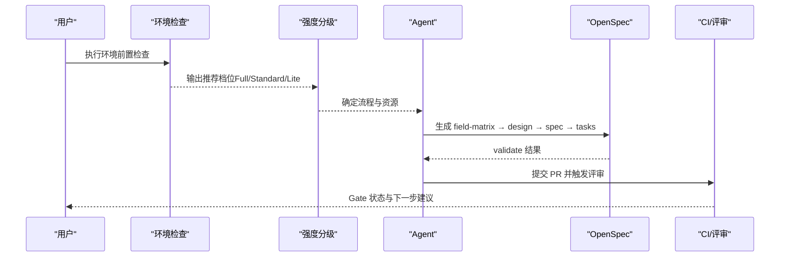
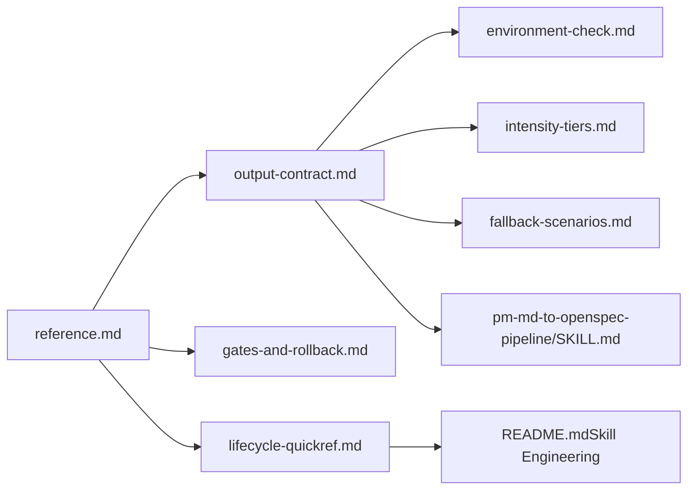

# 开放规范合同编写技能

<cite>
**本文引用的文件**
- [reference.md](file://plugins/frontend-team-toolkit/skills/openspec-contract-authoring/reference.md)
- [results.tsv](file://plugins/frontend-team-toolkit/skills/openspec-contract-authoring/results.tsv)
- [test-prompts.json](file://plugins/frontend-team-toolkit/skills/openspec-contract-authoring/test-prompts.json)
- [output-contract.md](file://plugins/frontend-team-toolkit/skills/ai-coding-tri-kit/references/output-contract.md)
- [environment-check.md](file://plugins/frontend-team-toolkit/skills/ai-coding-tri-kit/references/environment-check.md)
- [gates-and-rollback.md](file://plugins/frontend-team-toolkit/skills/ai-coding-tri-kit/references/gates-and-rollback.md)
- [fallback-scenarios.md](file://plugins/frontend-team-toolkit/skills/ai-coding-tri-kit/references/fallback-scenarios.md)
- [intensity-tiers.md](file://plugins/frontend-team-toolkit/skills/ai-coding-tri-kit/references/intensity-tiers.md)
- [lifecycle-quickref.md](file://plugins/frontend-team-toolkit/skill-engineering/docs/lifecycle-quickref.md)
- [README.md（Skill Engineering）](file://plugins/frontend-team-toolkit/skill-engineering/README.md)
- [feat-dashboard-csv-export-walkthrough.md](file://plugins/frontend-team-toolkit/skills/ai-coding-tri-kit/examples/feat-dashboard-csv-export-walkthrough.md)
- [SKILL.md（pm-md-to-openspec-pipeline）](file://plugins/frontend-team-toolkit/skills/pm-md-to-openspec-pipeline/SKILL.md)
</cite>

## 目录
1. [引言](#引言)
2. [项目结构](#项目结构)
3. [核心组件](#核心组件)
4. [架构总览](#架构总览)
5. [详细组件分析](#详细组件分析)
6. [依赖分析](#依赖分析)
7. [性能考虑](#性能考虑)
8. [故障排除指南](#故障排除指南)
9. [结论](#结论)
10. [附录](#附录)

## 引言
本文件面向开发者与技术项目经理，系统阐述“开放规范合同（OpenSpec）”的编写方法与标准，聚焦于合同条款的制定原则、评估机制、编写指南与测试方法，并结合仓库内的技能工程实践，提供可落地的质量评估与结果分析指导。文档强调“契约先行、证据闭环、闸门控制”，帮助团队在技术合作中建立稳定、可审计、可回归的质量基线。

## 项目结构
本技能位于前端团队工具箱（frontend-team-toolkit）中，围绕 OpenSpec 四文件（field-matrix、design、spec、tasks）与配套的评估与输出契约展开，形成“需求澄清—契约落盘—证据核验—闸门控制”的闭环。

**图表来源**
- [reference.md:1-165](file://plugins/frontend-team-toolkit/skills/openspec-contract-authoring/reference.md#L1-L165)
- [test-prompts.json:1-143](file://plugins/frontend-team-toolkit/skills/openspec-contract-authoring/test-prompts.json#L1-L143)
- [results.tsv:1-13](file://plugins/frontend-team-toolkit/skills/openspec-contract-authoring/results.tsv#L1-L13)
- [output-contract.md:1-97](file://plugins/frontend-team-toolkit/skills/ai-coding-tri-kit/references/output-contract.md#L1-L97)
- [environment-check.md:1-129](file://plugins/frontend-team-toolkit/skills/ai-coding-tri-kit/references/environment-check.md#L1-L129)
- [intensity-tiers.md:1-89](file://plugins/frontend-team-toolkit/skills/ai-coding-tri-kit/references/intensity-tiers.md#L1-L89)
- [gates-and-rollback.md:1-90](file://plugins/frontend-team-toolkit/skills/ai-coding-tri-kit/references/gates-and-rollback.md#L1-L90)
- [fallback-scenarios.md:1-279](file://plugins/frontend-team-toolkit/skills/ai-coding-tri-kit/references/fallback-scenarios.md#L1-L279)
- [lifecycle-quickref.md:1-32](file://plugins/frontend-team-toolkit/skill-engineering/docs/lifecycle-quickref.md#L1-L32)
- [README.md（Skill Engineering）:1-294](file://plugins/frontend-team-toolkit/skill-engineering/README.md#L1-L294)
- [feat-dashboard-csv-export-walkthrough.md:1-71](file://plugins/frontend-team-toolkit/skills/ai-coding-tri-kit/examples/feat-dashboard-csv-export-walkthrough.md#L1-L71)

**章节来源**
- [reference.md:1-165](file://plugins/frontend-team-toolkit/skills/openspec-contract-authoring/reference.md#L1-L165)
- [output-contract.md:1-97](file://plugins/frontend-team-toolkit/skills/ai-coding-tri-kit/references/output-contract.md#L1-L97)
- [environment-check.md:1-129](file://plugins/frontend-team-toolkit/skills/ai-coding-tri-kit/references/environment-check.md#L1-L129)
- [intensity-tiers.md:1-89](file://plugins/frontend-team-toolkit/skills/ai-coding-tri-kit/references/intensity-tiers.md#L1-L89)
- [gates-and-rollback.md:1-90](file://plugins/frontend-team-toolkit/skills/ai-coding-tri-kit/references/gates-and-rollback.md#L1-L90)
- [fallback-scenarios.md:1-279](file://plugins/frontend-team-toolkit/skills/ai-coding-tri-kit/references/fallback-scenarios.md#L1-L279)
- [lifecycle-quickref.md:1-32](file://plugins/frontend-team-toolkit/skill-engineering/docs/lifecycle-quickref.md#L1-L32)
- [README.md（Skill Engineering）:1-294](file://plugins/frontend-team-toolkit/skill-engineering/README.md#L1-L294)
- [feat-dashboard-csv-export-walkthrough.md:1-71](file://plugins/frontend-team-toolkit/skills/ai-coding-tri-kit/examples/feat-dashboard-csv-export-walkthrough.md#L1-L71)

## 核心组件
- OpenSpec 四文件骨架与职责
  - field-matrix.md：字段契约矩阵，确保 UI 字段、控件类型、显隐条件、默认值、限制与校验规则可审计。
  - design.md：实现约束（组件/数据源/清空/提交策略、边界决策、风控/权限/埋点）。
  - spec.md：需求主文档（TL;DR、背景、目标与非目标、范围与影响、用户流程与异常、字段矩阵引用、交互与校验细则、数据与接口、Open Questions、验收标准与方法）。
  - tasks.md：闸门（Gate）、实现任务与证据（Evidence），严格与 spec 的验收标准对齐。
- 评估与输出契约
  - test-prompts.json：覆盖关键回归与能力场景的评估用例，明确期望行为与风险等级。
  - results.tsv：评估结果记录，用于回归门禁与发布门禁。
  - output-contract.md：三件套会话交付物格式，包含进度清单、步骤详情、闸门状态、假设与未决问题、下一步建议等。
- 流程与质量门禁
  - environment-check.md：环境前置检查与降级路径。
  - intensity-tiers.md：强度分级（Full/Standard/Lite）与时间估算。
  - gates-and-rollback.md：三大闸门与回退策略。
  - fallback-scenarios.md：多种受限场景的降级方案与替代流程。
- 工程生命周期
  - lifecycle-quickref.md：Skill 生命周期八阶段与发布门禁。
  - README.md（Skill Engineering）：脚手架、Schema、CI 门禁与动态编排。

**章节来源**
- [reference.md:21-123](file://plugins/frontend-team-toolkit/skills/openspec-contract-authoring/reference.md#L21-L123)
- [test-prompts.json:1-143](file://plugins/frontend-team-toolkit/skills/openspec-contract-authoring/test-prompts.json#L1-L143)
- [results.tsv:1-13](file://plugins/frontend-team-toolkit/skills/openspec-contract-authoring/results.tsv#L1-L13)
- [output-contract.md:5-62](file://plugins/frontend-team-toolkit/skills/ai-coding-tri-kit/references/output-contract.md#L5-L62)
- [environment-check.md:5-52](file://plugins/frontend-team-toolkit/skills/ai-coding-tri-kit/references/environment-check.md#L5-L52)
- [intensity-tiers.md:7-89](file://plugins/frontend-team-toolkit/skills/ai-coding-tri-kit/references/intensity-tiers.md#L7-L89)
- [gates-and-rollback.md:5-90](file://plugins/frontend-team-toolkit/skills/ai-coding-tri-kit/references/gates-and-rollback.md#L5-L90)
- [fallback-scenarios.md:5-279](file://plugins/frontend-team-toolkit/skills/ai-coding-tri-kit/references/fallback-scenarios.md#L5-L279)
- [lifecycle-quickref.md:5-32](file://plugins/frontend-team-toolkit/skill-engineering/docs/lifecycle-quickref.md#L5-L32)
- [README.md（Skill Engineering）:34-294](file://plugins/frontend-team-toolkit/skill-engineering/README.md#L34-L294)

## 架构总览
OpenSpec 合同编写技能以“契约—证据—闸门”为核心，结合输出契约与流程约束，形成可执行、可审计、可回归的质量架构。

**图表来源**
- [reference.md:126-141](file://plugins/frontend-team-toolkit/skills/openspec-contract-authoring/reference.md#L126-L141)
- [output-contract.md:25-41](file://plugins/frontend-team-toolkit/skills/ai-coding-tri-kit/references/output-contract.md#L25-L41)
- [gates-and-rollback.md:13-44](file://plugins/frontend-team-toolkit/skills/ai-coding-tri-kit/references/gates-and-rollback.md#L13-L44)

## 详细组件分析

### OpenSpec 四文件与编写指南
- 字段矩阵（field-matrix.md）
  - 固定表头，每字段一行；控件类型明确，必填/否/条件写明条件；避免“按图/参考图”等模糊表述。
  - 与实现 diff 核对，不一致需进入 Open Questions 或 design 边界。
- 设计约束（design.md）
  - 组件/数据源约束、清空与提交策略、边界决策（加载/空/只读/编辑/无权限/接口失败/重复提交）、风控/权限/埋点。
  - 策略缺失时写“待确认”，并同步 Open Questions。
- 需求规格（spec.md）
  - TL;DR、背景、目标与非目标、范围与影响、用户流程（含异常）、字段矩阵引用、交互与校验细则、数据与接口（含清空策略）、Open Questions、验收标准（场景+验证方法）。
  - 验收方法中列出项目约定命令（如 openspec validate、构建/类型检查/测试）。
- 任务与证据（tasks.md）
  - 闸门：Open Questions 关闭/例外批准、field-matrix 无“按图/参考图”残留、design 写死策略、spec 含可验收流程与标准。
  - 证据：openspec validate --strict、构建/类型检查/测试、关键交互截图/录屏/人工验收记录。
  - 命令以项目实际为准，缺命令时 Evidence 标“TBD”。

**图表来源**
- [reference.md:21-123](file://plugins/frontend-team-toolkit/skills/openspec-contract-authoring/reference.md#L21-L123)
- [gates-and-rollback.md:13-44](file://plugins/frontend-team-toolkit/skills/ai-coding-tri-kit/references/gates-and-rollback.md#L13-L44)

**章节来源**
- [reference.md:21-123](file://plugins/frontend-team-toolkit/skills/openspec-contract-authoring/reference.md#L21-L123)

### 评估机制与测试方法
- 评估用例（test-prompts.json）
  - 覆盖关键回归与能力场景，如“禁止按图一致作为唯一契约”“四文件顺序不可乱序”“Open Questions 未关闭不得宣称定稿”“局部刷新需声明漂移风险”“四文件版本号必须一致”“字段矩阵 vs 实现 diff 核对”“同一套/复用必须转成明确边界”“新旧轨道并存必须显式标注状态”“Evidence 命令必须以项目实际为准”“按契约改代码前必须核对 Gate”。
  - 每个用例包含 id、名称、提示词、期望行为、评分者（rule+human）、风险等级与类型。
- 评估结果（results.tsv）
  - 记录评估 ID、通过状态、日期、版本、模式、严重性、评审者与备注，用于回归门禁与发布门禁。
- 输出契约（output-contract.md）
  - 必交付节：会话摘要、进度清单、步骤详情、闸门状态、假设与 Open Questions、下一步。
  - 禁止行为：未过 Gate 1 输出“开始实现代码”、无测试命令输出宣称完成、编造 validate/覆盖率/扫描结果、自动 push/merge/archive、把技能约束描述为“系统级不可绕过”而不提 CI。
  - 与 Eval 对齐：与 ai-coding-tri-kit 的评估检查点对齐。

**图表来源**
- [test-prompts.json:1-143](file://plugins/frontend-team-toolkit/skills/openspec-contract-authoring/test-prompts.json#L1-L143)
- [results.tsv:1-13](file://plugins/frontend-team-toolkit/skills/openspec-contract-authoring/results.tsv#L1-L13)
- [output-contract.md:5-62](file://plugins/frontend-team-toolkit/skills/ai-coding-tri-kit/references/output-contract.md#L5-L62)

**章节来源**
- [test-prompts.json:1-143](file://plugins/frontend-team-toolkit/skills/openspec-contract-authoring/test-prompts.json#L1-L143)
- [results.tsv:1-13](file://plugins/frontend-team-toolkit/skills/openspec-contract-authoring/results.tsv#L1-L13)
- [output-contract.md:5-62](file://plugins/frontend-team-toolkit/skills/ai-coding-tri-kit/references/output-contract.md#L5-L62)

### 端到端编排与示例
- 强度分级（Full/Standard/Lite）
  - Full：大型功能（多模块、多文件、外部 SDK、安全敏感），8 步完整流程 + worktree + 子 Agent 并行。
  - Standard：中等功能（1–3 文件、单一模块、有明确验收），OpenSpec 简化 + 单线程实现 + 核心测试。
  - Lite：小修复（<20 行、单点 bug、文案/配置微调），保留 TDD + secrets 底线，跳过 propose/worktree。
- 真实案例：feat-dashboard-csv-export（Standard 档位）
  - 步骤 1：需求对齐，生成四件套并通过 validate。
  - 步骤 2：≤3 轮澄清，收敛 UTF-8 BOM、列可见性、特殊字符处理、Worker 必要性等。
  - Gate 1 PASS 后进入实现与收尾。

**图表来源**
- [intensity-tiers.md:7-89](file://plugins/frontend-team-toolkit/skills/ai-coding-tri-kit/references/intensity-tiers.md#L7-L89)
- [environment-check.md:5-52](file://plugins/frontend-team-toolkit/skills/ai-coding-tri-kit/references/environment-check.md#L5-L52)
- [feat-dashboard-csv-export-walkthrough.md:15-52](file://plugins/frontend-team-toolkit/skills/ai-coding-tri-kit/examples/feat-dashboard-csv-export-walkthrough.md#L15-L52)

**章节来源**
- [intensity-tiers.md:7-89](file://plugins/frontend-team-toolkit/skills/ai-coding-tri-kit/references/intensity-tiers.md#L7-L89)
- [environment-check.md:5-52](file://plugins/frontend-team-toolkit/skills/ai-coding-tri-kit/references/environment-check.md#L5-L52)
- [feat-dashboard-csv-export-walkthrough.md:1-71](file://plugins/frontend-team-toolkit/skills/ai-coding-tri-kit/examples/feat-dashboard-csv-export-walkthrough.md#L1-L71)

### 与端到端编排的衔接（pm-md-to-openspec-pipeline）
- 固定流水线：change-spec-workflow（阶段 A）→ 闸门 G → openspec-contract-authoring（阶段 B）→ 收尾。
- 关键约束：change-id、勘探范围、目标仓库 openspec 布局、API 文档来源（README/仓库集成技能）。
- 工具不可读仓库时，停止编造文件内容，列需用户粘贴的路径/片段。

**章节来源**
- [SKILL.md（pm-md-to-openspec-pipeline）:82-92](file://plugins/frontend-team-toolkit/skills/pm-md-to-openspec-pipeline/SKILL.md#L82-L92)

## 依赖分析
- 组件耦合与协作
  - openspec-contract-authoring 依赖 output-contract.md 的交付物格式与 gates-and-rollback.md 的闸门控制。
  - environment-check.md 与 fallback-scenarios.md 为不同环境下的降级路径提供约束。
  - intensity-tiers.md 与 lifecycle-quickref.md/README.md（Skill Engineering）共同决定执行强度与工程门禁。
- 外部依赖与集成点
  - OpenSpec CLI（npx @fission-ai/openspec）与项目 package.json/README/CONTRIBUTING 中的命令约定。
  - CI/评审（测试/覆盖率/安全扫描）作为程序性强制门槛。
- 潜在循环依赖
  - 本技能以“契约—证据—闸门”为主线，未见循环依赖迹象；若团队扩展自定义校验器，需避免与 CLI 校验规则相互矛盾。

**图表来源**
- [reference.md:1-165](file://plugins/frontend-team-toolkit/skills/openspec-contract-authoring/reference.md#L1-L165)
- [output-contract.md:1-97](file://plugins/frontend-team-toolkit/skills/ai-coding-tri-kit/references/output-contract.md#L1-L97)
- [environment-check.md:1-129](file://plugins/frontend-team-toolkit/skills/ai-coding-tri-kit/references/environment-check.md#L1-L129)
- [intensity-tiers.md:1-89](file://plugins/frontend-team-toolkit/skills/ai-coding-tri-kit/references/intensity-tiers.md#L1-L89)
- [gates-and-rollback.md:1-90](file://plugins/frontend-team-toolkit/skills/ai-coding-tri-kit/references/gates-and-rollback.md#L1-L90)
- [fallback-scenarios.md:1-279](file://plugins/frontend-team-toolkit/skills/ai-coding-tri-kit/references/fallback-scenarios.md#L1-L279)
- [lifecycle-quickref.md:1-32](file://plugins/frontend-team-toolkit/skill-engineering/docs/lifecycle-quickref.md#L1-L32)
- [README.md（Skill Engineering）:1-294](file://plugins/frontend-team-toolkit/skill-engineering/README.md#L1-L294)
- [SKILL.md（pm-md-to-openspec-pipeline）:82-92](file://plugins/frontend-team-toolkit/skills/pm-md-to-openspec-pipeline/SKILL.md#L82-L92)

**章节来源**
- [reference.md:1-165](file://plugins/frontend-team-toolkit/skills/openspec-contract-authoring/reference.md#L1-L165)
- [output-contract.md:1-97](file://plugins/frontend-team-toolkit/skills/ai-coding-tri-kit/references/output-contract.md#L1-L97)
- [environment-check.md:1-129](file://plugins/frontend-team-toolkit/skills/ai-coding-tri-kit/references/environment-check.md#L1-L129)
- [intensity-tiers.md:1-89](file://plugins/frontend-team-toolkit/skills/ai-coding-tri-kit/references/intensity-tiers.md#L1-L89)
- [gates-and-rollback.md:1-90](file://plugins/frontend-team-toolkit/skills/ai-coding-tri-kit/references/gates-and-rollback.md#L1-L90)
- [fallback-scenarios.md:1-279](file://plugins/frontend-team-toolkit/skills/ai-coding-tri-kit/references/fallback-scenarios.md#L1-L279)
- [lifecycle-quickref.md:1-32](file://plugins/frontend-team-toolkit/skill-engineering/docs/lifecycle-quickref.md#L1-L32)
- [README.md（Skill Engineering）:1-294](file://plugins/frontend-team-toolkit/skill-engineering/README.md#L1-L294)
- [SKILL.md（pm-md-to-openspec-pipeline）:82-92](file://plugins/frontend-team-toolkit/skills/pm-md-to-openspec-pipeline/SKILL.md#L82-L92)

## 性能考虑
- 评估效率
  - 使用 test-prompts.json 的结构化用例，结合 rule/grader 自动化判定，降低人工评审成本。
  - results.tsv 作为回归门禁数据源，便于快速定位退化点。
- 执行效率
  - 强度分级（Full/Standard/Lite）匹配变更规模，避免过度工程化导致的资源浪费。
  - 环境前置检查与降级方案减少执行中断与回滚成本。
- 可观测性
  - output-contract.md 的 Gate Status 与下一步建议提升流程透明度，便于跨团队协作。

## 故障排除指南
- 常见问题与对策
  - “按图一致”作为唯一契约：拒绝将“按图/参考图”作为唯一依据，要求生成 field-matrix 并将缺失项列入 Open Questions。
  - 四文件顺序乱序：field-matrix → design → spec → tasks，Gate 未满足前不得定稿。
  - Open Questions 未关闭：不得宣称已对齐或定稿，例外需书面记录。
  - 局部刷新：启用局部刷新模式，输出未同步文件清单与漂移风险声明，不得悄悄勾选 Gate。
  - 版本漂移：四文件版本号必须一致，发现漂移暂停并回到上游拉齐。
  - 字段矩阵 vs 实现 diff：输出 diff 并记录差异，不一致项进入 Open Question 或 design 边界。
  - 同一套/复用：必须拆成组件/接口/字段/配置边界，归属不明项进入 Open Questions。
  - 新旧轨道：必须显式标注新轨纳入、旧轨静默兼容或旧轨下线，不得无状态并列暴露。
  - Evidence 命令：命令以项目 README/CONTRIBUTING/package scripts 为准，缺命令时 Evidence 标“TBD”。
  - 按契约改代码：先核对 tasks Gate，field-matrix 未定稿或 Open Questions 未关闭不得宣称已实现。
- 降级与回退
  - 环境受限时，按 fallback-scenarios.md 的降级方案执行；必要时使用 worktree 回退。
  - CI 不可用时，以人审 checklist 替代 CI 门槛。

**章节来源**
- [reference.md:103-165](file://plugins/frontend-team-toolkit/skills/openspec-contract-authoring/reference.md#L103-L165)
- [test-prompts.json:1-143](file://plugins/frontend-team-toolkit/skills/openspec-contract-authoring/test-prompts.json#L1-L143)
- [gates-and-rollback.md:45-90](file://plugins/frontend-team-toolkit/skills/ai-coding-tri-kit/references/gates-and-rollback.md#L45-L90)
- [fallback-scenarios.md:1-279](file://plugins/frontend-team-toolkit/skills/ai-coding-tri-kit/references/fallback-scenarios.md#L1-L279)

## 结论
通过 OpenSpec 合同编写技能，团队可以将“契约—证据—闸门”固化为可执行的质量基线，结合输出契约与流程约束，实现需求对齐、实现受控、证据可验与发布可回退。评估用例与结果记录为回归门禁与发布门禁提供数据支撑，强度分级与降级方案保障在不同环境下的可执行性。建议在团队内推广该技能，持续完善评估用例与流程约束，提升技术合作的稳定性与可预测性。

## 附录
- 术语
  - 契约：field-matrix + design + spec + tasks 的四文件集合。
  - 闸门：Gate 1（需求确认）、Gate 2（代码评审）、Gate 3（安全失败）。
  - 强度：Full/Standard/Lite 三种执行强度。
- 参考资料
  - OpenSpec CLI 命令与 strict 规则以各项目文档为准。
  - 输出契约与评估用例以仓库内文件为准。