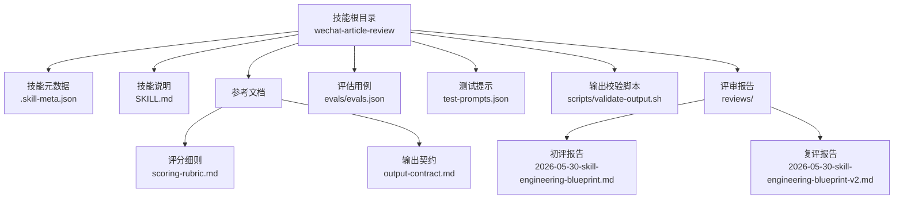
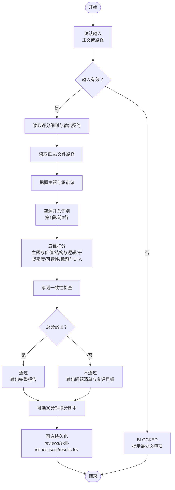
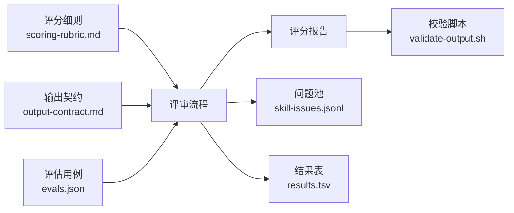

# 微信文章审核技能

<cite>
**本文引用的文件**
- [.skill-meta.json](file://plugins/frontend-team-toolkit/skills/wechat-article-review/.skill-meta.json)
- [SKILL.md](file://plugins/frontend-team-toolkit/skills/wechat-article-review/SKILL.md)
- [scoring-rubric.md](file://plugins/frontend-team-toolkit/skills/wechat-article-review/references/scoring-rubric.md)
- [output-contract.md](file://plugins/frontend-team-toolkit/skills/wechat-article-review/references/output-contract.md)
- [evals.json](file://plugins/frontend-team-toolkit/skills/wechat-article-review/evals/evals.json)
- [validate-output.sh](file://plugins/frontend-team-toolkit/skills/wechat-article-review/scripts/validate-output.sh)
- [test-prompts.json](file://plugins/frontend-team-toolkit/skills/wechat-article-review/test-prompts.json)
- [2026-05-30-skill-engineering-blueprint.md](file://plugins/frontend-team-toolkit/skills/wechat-article-review/reviews/2026-05-30-skill-engineering-blueprint.md)
- [2026-05-30-skill-engineering-blueprint-v2.md](file://plugins/frontend-team-toolkit/skills/wechat-article-review/reviews/2026-05-30-skill-engineering-blueprint-v2.md)
</cite>

## 目录
1. [简介](#简介)
2. [项目结构](#项目结构)
3. [核心组件](#核心组件)
4. [架构概览](#架构概览)
5. [详细组件分析](#详细组件分析)
6. [依赖关系分析](#依赖关系分析)
7. [性能考虑](#性能考虑)
8. [故障排查指南](#故障排查指南)
9. [结论](#结论)
10. [附录](#附录)

## 简介
本技能面向微信公众号文章的质量把关，提供结构化的 0–10 分评分与改稿审稿服务。其设计理念是“以规则驱动的五维评分 + 可执行修改清单”，确保评审结论可追溯、可复现，并与下游工作流（文案改稿、视觉设计、主编终审）无缝衔接。技能严格遵循输出契约，对不通过稿件强制输出 P0/P1/P2 修改清单与复评目标，保障内容质量与发布效率。

## 项目结构
该技能位于前端团队市场空间的技能工程套件中，采用“技能目录 + 参考文档 + 评估用例 + 复评报告”的组织方式，便于持续迭代与回归验证。

图表来源
- [SKILL.md:12-105](file://plugins/frontend-team-toolkit/skills/wechat-article-review/SKILL.md#L12-L105)
- [scoring-rubric.md:1-88](file://plugins/frontend-team-toolkit/skills/wechat-article-review/references/scoring-rubric.md#L1-L88)
- [output-contract.md:1-73](file://plugins/frontend-team-toolkit/skills/wechat-article-review/references/output-contract.md#L1-L73)
- [evals.json:1-213](file://plugins/frontend-team-toolkit/skills/wechat-article-review/evals/evals.json#L1-L213)
- [validate-output.sh:1-43](file://plugins/frontend-team-toolkit/skills/wechat-article-review/scripts/validate-output.sh#L1-L43)
- [2026-05-30-skill-engineering-blueprint.md:1-90](file://plugins/frontend-team-toolkit/skills/wechat-article-review/reviews/2026-05-30-skill-engineering-blueprint.md#L1-L90)
- [2026-05-30-skill-engineering-blueprint-v2.md:1-54](file://plugins/frontend-team-toolkit/skills/wechat-article-review/reviews/2026-05-30-skill-engineering-blueprint-v2.md#L1-L54)

章节来源
- [SKILL.md:12-105](file://plugins/frontend-team-toolkit/skills/wechat-article-review/SKILL.md#L12-L105)

## 核心组件
- 评分细则与阈值：定义五维权重、扣分参考、承诺一致性与空洞开头识别规则，形成稳定的评分基线。
- 输出契约：规范报告结构（通过/不通过/阻塞）、必须节、条件触发（承诺未兑现、30 分钟提分模式）与禁止事项。
- 评估用例：覆盖回归与能力两类场景，包括弱稿、缺正文、边界分、承诺未兑现、技术 Blueprint 改编稿等。
- 校验脚本：对报告进行结构化校验，确保结论、维度表、问题清单等关键要素齐全。
- 评审报告：提供初评与复评样例，展示从问题定位到修改闭环的完整过程。

章节来源
- [scoring-rubric.md:1-88](file://plugins/frontend-team-toolkit/skills/wechat-article-review/references/scoring-rubric.md#L1-L88)
- [output-contract.md:1-73](file://plugins/frontend-team-toolkit/skills/wechat-article-review/references/output-contract.md#L1-L73)
- [evals.json:1-213](file://plugins/frontend-team-toolkit/skills/wechat-article-review/evals/evals.json#L1-L213)
- [validate-output.sh:1-43](file://plugins/frontend-team-toolkit/skills/wechat-article-review/scripts/validate-output.sh#L1-L43)
- [2026-05-30-skill-engineering-blueprint.md:1-90](file://plugins/frontend-team-toolkit/skills/wechat-article-review/reviews/2026-05-30-skill-engineering-blueprint.md#L1-L90)
- [2026-05-30-skill-engineering-blueprint-v2.md:1-54](file://plugins/frontend-team-toolkit/skills/wechat-article-review/reviews/2026-05-30-skill-engineering-blueprint-v2.md#L1-L54)

## 架构概览
技能执行流程围绕“输入合同 → 规则读取 → 通读全文 → 维度打分 → 一致性检查 → 结论与输出”展开，同时支持条件触发（承诺未兑现、空洞开头识别、30 分钟提分模式）与持久化记录。

图表来源
- [SKILL.md:43-55](file://plugins/frontend-team-toolkit/skills/wechat-article-review/SKILL.md#L43-L55)
- [scoring-rubric.md:42-58](file://plugins/frontend-team-toolkit/skills/wechat-article-review/references/scoring-rubric.md#L42-L58)
- [output-contract.md:11-31](file://plugins/frontend-team-toolkit/skills/wechat-article-review/references/output-contract.md#L11-L31)

章节来源
- [SKILL.md:43-55](file://plugins/frontend-team-toolkit/skills/wechat-article-review/SKILL.md#L43-L55)

## 详细组件分析

### 评分标准与评判维度
- 五维权重与阈值
  - 主题与价值（25%）：强调明确的主题、清晰的价值主张与独特视角。
  - 结构与逻辑（20%）：结构清晰、逻辑自洽、过渡自然。
  - 干货密度（25%）：干货占比≥60%，案例/数据有说服力。
  - 可读性与表达（20%）：开头抓人、段落适中、表达准确。
  - 标题与 CTA（10%）：标题有吸引力、结尾有明确 CTA。
- 阈值与分级
  - ≥9.0：通过；8.5–8.9：接近未达标，仍为不通过；<8.5：明显问题，重写或大幅修改。
  - 合规风险：直接不通过。
- 扣分参考
  - 标题平淡/夸张、开头不抓人、干货不足、结构混乱、CTA 弱/无、承诺未兑现等均有典型扣分区间与修改方向。

章节来源
- [scoring-rubric.md:3-22](file://plugins/frontend-team-toolkit/skills/wechat-article-review/references/scoring-rubric.md#L3-L22)
- [scoring-rubric.md:24-41](file://plugins/frontend-team-toolkit/skills/wechat-article-review/references/scoring-rubric.md#L24-L41)

### 审核脚本实现逻辑与验证流程
- 输入合同
  - 必填：文章内容或 articles/ 路径；可选：文章类型、目标受众、发布渠道、约束（字数/口吻/合规）。
  - 缺正文时：BLOCKED，列出最少必填项。
- 规则读取
  - 读取评分细则与输出契约，确保评审与报告结构一致。
- 通读与检查
  - 把握主题、结构、承诺句；空洞开头识别（第1段/前3行）；承诺一致性检查（未兑现则进入主要问题并给出最小修复动作）。
- 打分与结论
  - 五维加权求和；≥9.0 通过；<9.0 不通过并输出 P0/P1/P2 修改清单与复评目标。
- 条件触发
  - 承诺未兑现：输出六列承诺扣分表与复评验收清单。
  - 30 分钟提分：在用户限时场景下，提供分时段执行脚本与验收句式。
- 输出与校验
  - 严格遵循输出契约；使用校验脚本进行结构化检查（结论、维度表、加权总分、问题清单等）。
- 持久化
  - 用户要求记录时，将报告写入 reviews/，问题写入 skill-issues.jsonl，结果写入 results.tsv。

章节来源
- [SKILL.md:31-55](file://plugins/frontend-team-toolkit/skills/wechat-article-review/SKILL.md#L31-L55)
- [output-contract.md:3-53](file://plugins/frontend-team-toolkit/skills/wechat-article-review/references/output-contract.md#L3-L53)
- [validate-output.sh:12-42](file://plugins/frontend-team-toolkit/skills/wechat-article-review/scripts/validate-output.sh#L12-L42)

### 使用示例与配置说明
- 示例一：弱稿不通过 + 完整问题清单
  - 场景：低质量初稿，受众为新手。
  - 预期：结论为不通过，综合评分低于 9.0，包含五维得分表、主要问题、P0/P1/P2 修改清单与复评目标。
  - 用例 ID：wechat-article-review-001。
- 示例二：缺正文 → BLOCKED
  - 场景：仅询问能否发布，未提供正文或路径。
  - 预期：BLOCKED，明确缺少正文/路径，并列出最少信息需求。
  - 用例 ID：wechat-article-review-002。
- 示例三：优质稿 ≥9.0 + 五维表
  - 场景：接近或达到 9 分边界，需说明依据。
  - 预期：输出五维得分表与加权总分，若评分在 8.5–8.9 区间，仍为不通过并说明差多少。
  - 用例 ID：wechat-article-review-003。
- 示例四：承诺未兑现 → 承诺扣分表
  - 场景：文中承诺“下文将给出 7 步清单”，但未出现。
  - 预期：标记主要问题“承诺未兑现”，输出六列承诺扣分表与最小修复动作。
  - 用例 ID：wechat-article-review-004。
- 示例五：技术 Blueprint 改编稿
  - 场景：评审仓库技术文档改编稿，关注 CTA、案例、编号一致性与“文档腔”。
  - 预期：读取文件后评分，若缺 CTA 或偏技术文档腔，应扣相应维度并低于 9.0 或边界说明。
  - 用例 ID：wechat-article-review-005。
- 示例六：空洞开头识别
  - 场景：开头铺垫式表述，缺乏痛点/数据/故事/问题。
  - 预期：指出“开头 3 秒不抓人”，并输出 P0/P1/P2 修改清单。
  - 用例 ID：wechat-article-review-007。
- 示例七：边界分（8.6/8.9）
  - 场景：评分处于边界区间。
  - 预期：8.6 分为不通过并说明差多少；8.9 分标注“接近未达标”并给出针对性建议。
  - 用例 ID：wechat-article-review-010、wechat-article-review-011。

章节来源
- [evals.json:4-23](file://plugins/frontend-team-toolkit/skills/wechat-article-review/evals/evals.json#L4-L23)
- [evals.json:24-41](file://plugins/frontend-team-toolkit/skills/wechat-article-review/evals/evals.json#L24-L41)
- [evals.json:42-60](file://plugins/frontend-team-toolkit/skills/wechat-article-review/evals/evals.json#L42-L60)
- [evals.json:61-80](file://plugins/frontend-team-toolkit/skills/wechat-article-review/evals/evals.json#L61-L80)
- [evals.json:81-100](file://plugins/frontend-team-toolkit/skills/wechat-article-review/evals/evals.json#L81-L100)
- [evals.json:101-117](file://plugins/frontend-team-toolkit/skills/wechat-article-review/evals/evals.json#L101-L117)
- [evals.json:118-136](file://plugins/frontend-team-toolkit/skills/wechat-article-review/evals/evals.json#L118-L136)
- [evals.json:137-154](file://plugins/frontend-team-toolkit/skills/wechat-article-review/evals/evals.json#L137-L154)
- [evals.json:155-175](file://plugins/frontend-team-toolkit/skills/wechat-article-review/evals/evals.json#L155-L175)
- [evals.json:176-194](file://plugins/frontend-team-toolkit/skills/wechat-article-review/evals/evals.json#L176-L194)
- [evals.json:195-211](file://plugins/frontend-team-toolkit/skills/wechat-article-review/evals/evals.json#L195-L211)

### 评审蓝图与结果分析解读
- 初评报告示例
  - 对技术 Blueprint 改编稿进行初评，识别主要问题（如无 CTA、缺完整端到端案例、标题与编号不一致、公众号可读性不足），并给出 P0/P1/P2 提分路径与复评目标。
- 复评报告示例
  - 展示修改闭环：针对首评问题逐一处理（补 CTA、修正编号、新增案例、优化表达），最终达到通过分数并给出可选优化建议。

章节来源
- [2026-05-30-skill-engineering-blueprint.md:1-90](file://plugins/frontend-team-toolkit/skills/wechat-article-review/reviews/2026-05-30-skill-engineering-blueprint.md#L1-L90)
- [2026-05-30-skill-engineering-blueprint-v2.md:1-54](file://plugins/frontend-team-toolkit/skills/wechat-article-review/reviews/2026-05-30-skill-engineering-blueprint-v2.md#L1-L54)

## 依赖关系分析
- 规则与契约耦合
  - 评分细则与输出契约共同决定报告结构与结论格式，二者强耦合，任何变更需同步调整。
- 评估用例对实现的约束
  - 评估用例覆盖多种边界与异常场景，驱动实现的健壮性与一致性。
- 校验脚本与输出契约的绑定
  - 校验脚本基于输出契约的关键正则匹配，确保报告结构符合规范。
- 报告与问题池的持久化
  - 评审完成后的问题与结果可沉淀至 skill-issues.jsonl 与 results.tsv，支撑后续回归与改进。

图表来源
- [scoring-rubric.md:1-88](file://plugins/frontend-team-toolkit/skills/wechat-article-review/references/scoring-rubric.md#L1-L88)
- [output-contract.md:1-73](file://plugins/frontend-team-toolkit/skills/wechat-article-review/references/output-contract.md#L1-L73)
- [validate-output.sh:12-42](file://plugins/frontend-team-toolkit/skills/wechat-article-review/scripts/validate-output.sh#L12-L42)
- [evals.json:1-213](file://plugins/frontend-team-toolkit/skills/wechat-article-review/evals/evals.json#L1-L213)

章节来源
- [evals.json:1-213](file://plugins/frontend-team-toolkit/skills/wechat-article-review/evals/evals.json#L1-L213)
- [output-contract.md:54-73](file://plugins/frontend-team-toolkit/skills/wechat-article-review/references/output-contract.md#L54-L73)

## 性能考虑
- 评审速度
  - 通过规则化与结构化流程，减少主观判断波动，提升评审一致性与速度。
- 数据沉淀
  - 通过 skill-issues.jsonl 与 results.tsv 的持续积累，形成可追踪的质量趋势与改进路径。
- 自动化校验
  - 校验脚本可快速识别报告缺失关键节，降低人工复核成本。

## 故障排查指南
- BLOCKED 场景
  - 现象：未提供正文或路径，输出 BLOCKED。
  - 排查：确认用户是否粘贴正文或提供 articles/ 路径；若未提供，需提示最少必填项。
- 缺少维度表或结论
  - 现象：报告缺少五维得分表或结论。
  - 排查：使用校验脚本 validate-output.sh 检查报告是否满足“结论/维度/加权总分/问题清单”等关键要素。
- 不通过但无修改清单
  - 现象：未输出 P0/P1/P2 修改清单与复评目标。
  - 排查：核对输出契约中“不通过必含节”要求，确保清单与复评目标齐全。
- 承诺未兑现未识别
  - 现象：文中存在“下文将给出”等承诺但未扣分或未输出承诺扣分表。
  - 排查：检查承诺一致性检查逻辑与输出契约中的“承诺未兑现”节。

章节来源
- [validate-output.sh:12-42](file://plugins/frontend-team-toolkit/skills/wechat-article-review/scripts/validate-output.sh#L12-L42)
- [output-contract.md:19-31](file://plugins/frontend-team-toolkit/skills/wechat-article-review/references/output-contract.md#L19-L31)

## 结论
该技能通过“规则驱动 + 结构化输出 + 持续评估”的方式，构建了微信公众号文章质量控制的标准化流水线。它不仅提供可量化的评分与可执行的修改清单，还通过评估用例与校验脚本保障评审一致性与可追溯性。在内容质量控制中，该技能扮演“第一道关卡”的角色，帮助团队在发布前快速识别问题、沉淀经验并持续改进。

## 附录

### 使用示例索引
- 弱稿不通过 + 完整问题清单：[evals.json:4-23](file://plugins/frontend-team-toolkit/skills/wechat-article-review/evals/evals.json#L4-L23)
- 缺正文 → BLOCKED：[evals.json:24-41](file://plugins/frontend-team-toolkit/skills/wechat-article-review/evals/evals.json#L24-L41)
- 优质稿 ≥9.0 + 五维表：[evals.json:42-60](file://plugins/frontend-team-toolkit/skills/wechat-article-review/evals/evals.json#L42-L60)
- 承诺未兑现 → 承诺扣分表：[evals.json:61-80](file://plugins/frontend-team-toolkit/skills/wechat-article-review/evals/evals.json#L61-L80)
- 技术 Blueprint 改编稿：[evals.json:81-100](file://plugins/frontend-team-toolkit/skills/wechat-article-review/evals/evals.json#L81-L100)
- 空洞开头识别：[evals.json:118-136](file://plugins/frontend-team-toolkit/skills/wechat-article-review/evals/evals.json#L118-L136)
- 边界分（8.6/8.9）：[evals.json:176-194](file://plugins/frontend-team-toolkit/skills/wechat-article-review/evals/evals.json#L176-L194)

### 评审蓝图与结果分析解读要点
- 初评报告解读
  - 关注维度得分与扣分原因，理解各问题对总分的影响；优先处理 P0 问题以尽快达到通过线。
- 复评报告解读
  - 对照首评问题处理清单，确认问题是否已修复；关注可选优化建议以进一步提升分数。

章节来源
- [2026-05-30-skill-engineering-blueprint.md:29-86](file://plugins/frontend-team-toolkit/skills/wechat-article-review/reviews/2026-05-30-skill-engineering-blueprint.md#L29-L86)
- [2026-05-30-skill-engineering-blueprint-v2.md:35-50](file://plugins/frontend-team-toolkit/skills/wechat-article-review/reviews/2026-05-30-skill-engineering-blueprint-v2.md#L35-L50)