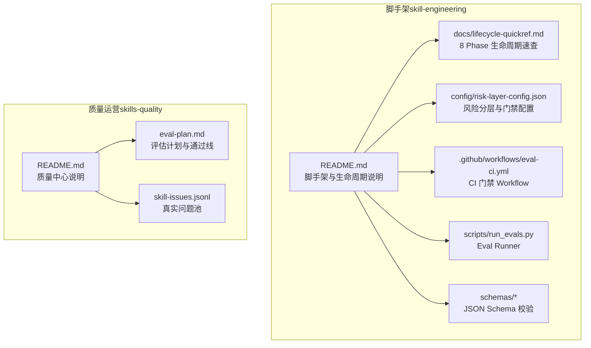
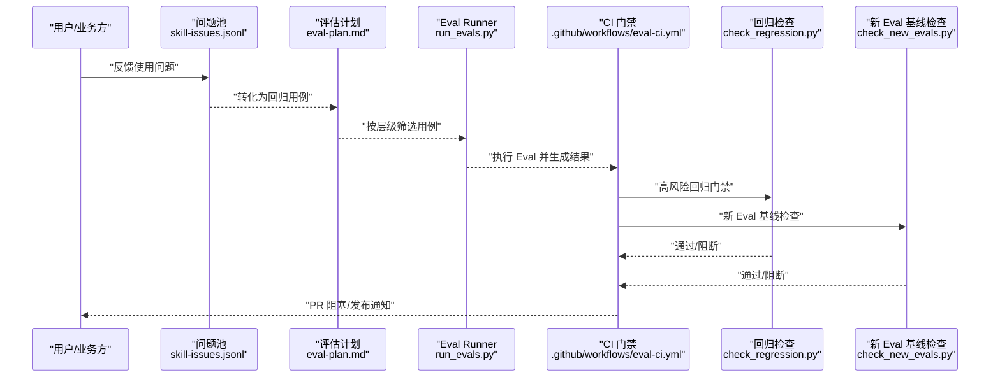
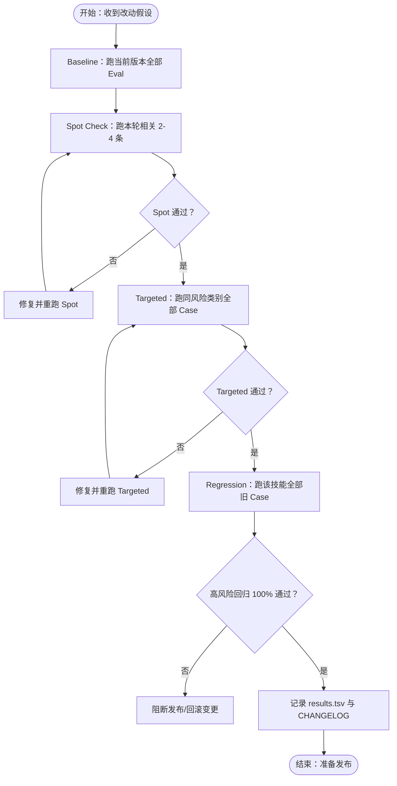
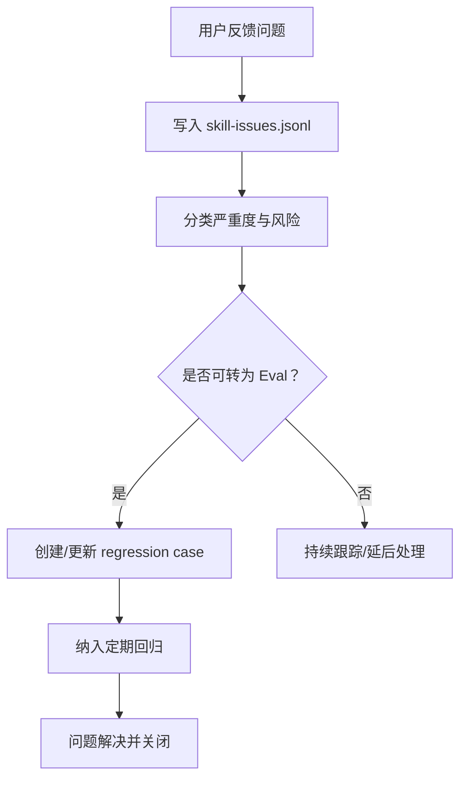
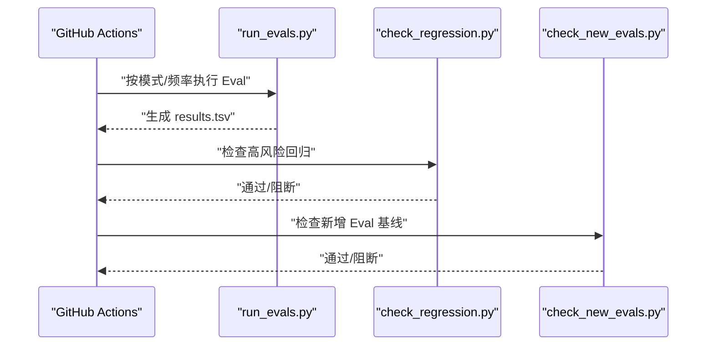
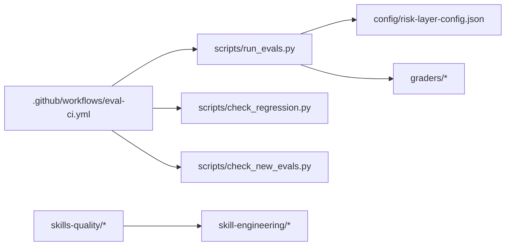

# 技能质量管控技能

<cite>
**本文档引用的文件**
- [README.md](file://plugins/frontend-team-toolkit/skills/skills-quality/README.md)
- [eval-plan.md](file://plugins/frontend-team-toolkit/skills/skills-quality/eval-plan.md)
- [skill-issues.jsonl](file://plugins/frontend-team-toolkit/skills/skills-quality/skill-issues.jsonl)
- [README.md](file://plugins/frontend-team-toolkit/skill-engineering/README.md)
- [lifecycle-quickref.md](file://plugins/frontend-team-toolkit/skill-engineering/docs/lifecycle-quickref.md)
- [risk-layer-config.json](file://plugins/frontend-team-toolkit/skill-engineering/config/risk-layer-config.json)
- [eval-ci.yml](file://.github/workflows/eval-ci.yml)
- [run_evals.py](file://plugins/frontend-team-toolkit/skill-engineering/scripts/run_evals.py)
- [check_regression.py](file://plugins/frontend-team-toolkit/skill-engineering/scripts/check_regression.py)
- [check_new_evals.py](file://plugins/frontend-team-toolkit/skill-engineering/scripts/check_new_evals.py)
- [skill-issue.schema.json](file://plugins/frontend-team-toolkit/skill-engineering/schemas/skill-issue.schema.json)
- [test-prompts.schema.json](file://plugins/frontend-team-toolkit/skill-engineering/schemas/test-prompts.schema.json)
</cite>

## 目录
1. [引言](#引言)
2. [项目结构](#项目结构)
3. [核心组件](#核心组件)
4. [架构总览](#架构总览)
5. [详细组件分析](#详细组件分析)
6. [依赖分析](#依赖分析)
7. [性能考虑](#性能考虑)
8. [故障排查指南](#故障排查指南)
9. [结论](#结论)
10. [附录](#附录)

## 引言
本文件面向开发者与质量负责人，系统化阐述“技能质量管控技能”的标准、方法与实践流程。围绕真实使用问题的闭环管理、评估计划的制定与执行、质量门禁与回归策略、问题跟踪机制以及在技能市场中的价值，提供可操作的质量管理体系指南。目标是帮助团队将“使用中体感改写”升级为“以 Eval 驱动的 SkillOps 流程”，确保技能在交付、迭代与发布过程中的稳定性与可追溯性。

## 项目结构
本仓库采用“脚手架 + 已有技能质量运营”的双轨结构：
- skill-engineering：提供标准化工程能力（模板、Schema、校验脚本、CI 门禁自动化），支撑新建与升级技能。
- skills-quality：聚焦已有技能的质量运营，包括问题池、评估计划、结果记录与发布门禁。

图表来源
- [README.md:1-294](file://plugins/frontend-team-toolkit/skill-engineering/README.md#L1-L294)
- [lifecycle-quickref.md:1-32](file://plugins/frontend-team-toolkit/skill-engineering/docs/lifecycle-quickref.md#L1-L32)
- [risk-layer-config.json:1-70](file://plugins/frontend-team-toolkit/skill-engineering/config/risk-layer-config.json#L1-L70)
- [eval-ci.yml:1-208](file://.github/workflows/eval-ci.yml#L1-L208)
- [run_evals.py:1-227](file://plugins/frontend-team-toolkit/skill-engineering/scripts/run_evals.py#L1-L227)
- [README.md:1-58](file://plugins/frontend-team-toolkit/skills/skills-quality/README.md#L1-L58)
- [eval-plan.md:1-78](file://plugins/frontend-team-toolkit/skills/skills-quality/eval-plan.md#L1-L78)
- [skill-issues.jsonl:1-8](file://plugins/frontend-team-toolkit/skills/skills-quality/skill-issues.jsonl#L1-L8)

章节来源
- [README.md:1-58](file://plugins/frontend-team-toolkit/skills/skills-quality/README.md#L1-L58)
- [README.md:1-294](file://plugins/frontend-team-toolkit/skill-engineering/README.md#L1-L294)
- [lifecycle-quickref.md:1-32](file://plugins/frontend-team-toolkit/skill-engineering/docs/lifecycle-quickref.md#L1-L32)

## 核心组件
- 评估计划与通过线：定义 Baseline、Spot Check、Targeted、Regression 四层评估粒度与通过标准，确保每次改动可追踪、可回归。
- 真实问题池（skill-issues.jsonl）：沉淀来自真实使用的症状、根因、严重度与转换状态，驱动回归用例固化。
- CI 门禁与自动化脚本：PR 触发、发布前、定期回归三阶段，结合风险分层与门禁红线，自动阻断回归退化。
- 生命周期速查（8 Phase）：从创建、边界、写 Eval、Baseline、单假设、验证、棘轮、发布、监控的闭环流程。
- JSON Schema 校验：对 test-prompts、skill-issue 等关键结构进行强约束，保障数据一致性与可解析性。

章节来源
- [eval-plan.md:1-78](file://plugins/frontend-team-toolkit/skills/skills-quality/eval-plan.md#L1-L78)
- [skill-issues.jsonl:1-8](file://plugins/frontend-team-toolkit/skills/skills-quality/skill-issues.jsonl#L1-L8)
- [README.md:168-236](file://plugins/frontend-team-toolkit/skill-engineering/README.md#L168-L236)
- [lifecycle-quickref.md:1-32](file://plugins/frontend-team-toolkit/skill-engineering/docs/lifecycle-quickref.md#L1-L32)
- [test-prompts.schema.json:1-22](file://plugins/frontend-team-toolkit/skill-engineering/schemas/test-prompts.schema.json#L1-L22)
- [skill-issue.schema.json:1-21](file://plugins/frontend-team-toolkit/skill-engineering/schemas/skill-issue.schema.json#L1-L21)

## 架构总览
下图展示“从真实问题到回归门禁”的端到端质量管控架构：

图表来源
- [eval-plan.md:1-78](file://plugins/frontend-team-toolkit/skills/skills-quality/eval-plan.md#L1-L78)
- [run_evals.py:1-227](file://plugins/frontend-team-toolkit/skill-engineering/scripts/run_evals.py#L1-L227)
- [eval-ci.yml:1-208](file://.github/workflows/eval-ci.yml#L1-L208)
- [check_regression.py](file://plugins/frontend-team-toolkit/skill-engineering/scripts/check_regression.py)
- [check_new_evals.py](file://plugins/frontend-team-toolkit/skill-engineering/scripts/check_new_evals.py)

## 详细组件分析

### 评估计划与执行流程
- 评估粒度与时机
  - Baseline：首次落地与大版本前，跑当前版本全部 Eval，形成基线。
  - Spot Check：每次小改动后，仅跑本轮相关 2-4 条，快速验证。
  - Targeted：通过 Spot 后，跑同一风险类别的所有 Case，覆盖同类问题。
  - Regression：发布前跑该技能全部旧 Case，确保无回归。
- 推荐 Baseline 顺序：按技能重要性与风险排序，优先覆盖关键路径。
- 结果记录格式：统一 TSV 字段，便于横向对比与自动化处理。
- 通过线
  - 高风险回归：发布前必须 100% 通过。
  - 中风险回归：允许明确 TBD，但不得静默失败。
  - Capability Eval：不能低于上一版；若下降，必须写明取舍理由。
  - 修改触发词时，必须额外做误触发检查。

图表来源
- [eval-plan.md:1-78](file://plugins/frontend-team-toolkit/skills/skills-quality/eval-plan.md#L1-L78)

章节来源
- [eval-plan.md:1-78](file://plugins/frontend-team-toolkit/skills/skills-quality/eval-plan.md#L1-L78)

### 真实问题池与用例转化
- 问题池结构：包含日期、技能名、任务类型、症状、根因、严重度、来源、是否已转为 Eval、对应 Eval ID、状态等字段。
- 转化规则：真实使用问题必须沉淀为回归用例，防止同类问题再次发生。
- 状态流转：open → triaged → fixed → resolved；必要时标记 wontfix 并说明原因。

图表来源
- [skill-issues.jsonl:1-8](file://plugins/frontend-team-toolkit/skills/skills-quality/skill-issues.jsonl#L1-L8)
- [skill-issue.schema.json:1-21](file://plugins/frontend-team-toolkit/skill-engineering/schemas/skill-issue.schema.json#L1-L21)

章节来源
- [skill-issues.jsonl:1-8](file://plugins/frontend-team-toolkit/skills/skills-quality/skill-issues.jsonl#L1-L8)
- [skill-issue.schema.json:1-21](file://plugins/frontend-team-toolkit/skill-engineering/schemas/skill-issue.schema.json#L1-L21)

### CI 门禁与自动化脚本
- 门禁三阶段
  - PR 触发：跑 high + medium，高风险回归挂必阻。
  - 发布前：跑全量，回归挂必阻。
  - 定期回归：每周/月/季度，发现长期退化。
- 门禁红线
  - regression 挂（high/medium）、新增 Eval 未 baseline、改 Skill 未跑 baseline。
- 自动化脚本
  - run_evals.py：按模式与频率筛选用例，调用 skill_runner 执行并返回结果。
  - check_regression.py：按风险级别检查回归门禁。
  - check_new_evals.py：检查新增 Eval 是否已 baseline。

图表来源
- [eval-ci.yml:1-208](file://.github/workflows/eval-ci.yml#L1-L208)
- [run_evals.py:1-227](file://plugins/frontend-team-toolkit/skill-engineering/scripts/run_evals.py#L1-L227)
- [check_regression.py](file://plugins/frontend-team-toolkit/skill-engineering/scripts/check_regression.py)
- [check_new_evals.py](file://plugins/frontend-team-toolkit/skill-engineering/scripts/check_new_evals.py)

章节来源
- [README.md:168-236](file://plugins/frontend-team-toolkit/skill-engineering/README.md#L168-L236)
- [risk-layer-config.json:1-70](file://plugins/frontend-team-toolkit/skill-engineering/config/risk-layer-config.json#L1-L70)
- [eval-ci.yml:1-208](file://.github/workflows/eval-ci.yml#L1-L208)
- [run_evals.py:1-227](file://plugins/frontend-team-toolkit/skill-engineering/scripts/run_evals.py#L1-L227)

### 生命周期速查（8 Phase）
- Phase 0-1：创建与边界（new-skill.sh + output-contract）
- Phase 2：写 Eval（≥3 case，先 eval 后改 skill）
- Phase 3：Baseline（with skill dry run / benchmark）
- Phase 4：单假设（只改触发/步骤/模板之一）
- Phase 5：验证（Spot → Targeted → Regression）
- Phase 6：棘轮（pass 则 keep，否则 revert）
- Phase 7：发布（CHANGELOG + meta）
- Phase 8：监控（真实任务问题）

章节来源
- [lifecycle-quickref.md:1-32](file://plugins/frontend-team-toolkit/skill-engineering/docs/lifecycle-quickref.md#L1-L32)
- [README.md:139-149](file://plugins/frontend-team-toolkit/skill-engineering/README.md#L139-L149)

### JSON Schema 与数据契约
- test-prompts.schema.json：约束 test-prompts.json 的结构，保证 id/prompt/expected 的一致性。
- skill-issue.schema.json：约束 skill-issues.jsonl 的字段集合与枚举值，确保问题池可解析与可审计。

章节来源
- [test-prompts.schema.json:1-22](file://plugins/frontend-team-toolkit/skill-engineering/schemas/test-prompts.schema.json#L1-L22)
- [skill-issue.schema.json:1-21](file://plugins/frontend-team-toolkit/skill-engineering/schemas/skill-issue.schema.json#L1-L21)

## 依赖分析
- 组件耦合
  - eval-ci.yml 依赖 run_evals.py、check_regression.py、check_new_evals.py 与 risk-layer-config.json。
  - run_evals.py 依赖 graders（rule/structure/trajectory/model）与 skill_runner。
  - skills-quality 依赖 skill-engineering 的脚手架与 Schema。
- 外部依赖
  - Python 运行时与 anthropic SDK（用于模型评分）。
  - GitHub Actions 事件与环境变量（如 SLACK_WEBHOOK_URL）。

图表来源
- [eval-ci.yml:1-208](file://.github/workflows/eval-ci.yml#L1-L208)
- [run_evals.py:1-227](file://plugins/frontend-team-toolkit/skill-engineering/scripts/run_evals.py#L1-L227)
- [risk-layer-config.json:1-70](file://plugins/frontend-team-toolkit/skill-engineering/config/risk-layer-config.json#L1-L70)

章节来源
- [eval-ci.yml:1-208](file://.github/workflows/eval-ci.yml#L1-L208)
- [run_evals.py:1-227](file://plugins/frontend-team-toolkit/skill-engineering/scripts/run_evals.py#L1-L227)

## 性能考虑
- 评估粒度控制：通过 Spot Check 与 Targeted 缩小每次改动的影响面，降低整体评估成本。
- 风险分层与随机抽样：定期回归中加入随机 Spot Check，平衡覆盖率与成本。
- 自动化与缓存：CI 中复用 artifacts 与稳定的结果格式，减少重复计算与解析时间。
- 评审与注释：results.tsv 的 reviewer 与 notes 字段便于快速定位问题与决策依据。

## 故障排查指南
- PR 被阻断
  - 检查高风险回归是否通过；若失败，回滚变更或补充修复。
  - 检查是否存在新增 Eval 未 baseline；补齐基线后再提交。
- 发布前失败
  - 全量回归必须通过；逐条核对 results.tsv 中的 fail 项与原因。
- 定期回归异常
  - 确认 risk 分层配置与频率设置是否正确；检查随机 Spot Check 数量。
- 问题池无法解析
  - 使用 skill-issue.schema.json 校验字段完整性与枚举值。
- 用例结构错误
  - 使用 test-prompts.schema.json 校验 id/prompt/expected 的格式与类型。

章节来源
- [README.md:180-205](file://plugins/frontend-team-toolkit/skill-engineering/README.md#L180-L205)
- [eval-ci.yml:159-185](file://.github/workflows/eval-ci.yml#L159-L185)
- [skill-issue.schema.json:1-21](file://plugins/frontend-team-toolkit/skill-engineering/schemas/skill-issue.schema.json#L1-L21)
- [test-prompts.schema.json:1-22](file://plugins/frontend-team-toolkit/skill-engineering/schemas/test-prompts.schema.json#L1-L22)

## 结论
通过“问题池驱动 + 分层评估 + CI 门禁”的质量管控体系，团队能够将技能从“凭感觉改”升级为“可测试、可回归、可发布”的工程资产。建议在日常工作中坚持：先写 Eval 再改技能、一轮只改一个假设、高风险回归不发布、真实问题必须沉淀为回归用例。如此，既能提升技能在技能市场的稳定性与口碑，也能显著降低长期维护成本。

## 附录

### 评估计划与问题清单使用指导
- 评估计划
  - 在每次改动前先写“改动假设模板”，明确目标、问题、预期改进与回退条件。
  - 严格遵循 Baseline → Spot → Targeted → Regression 的顺序，确保可追溯。
  - 高风险回归必须 100% 通过，中风险允许明确 TBD，但不得静默失败。
- 问题清单
  - 将真实使用问题写入 skill-issues.jsonl，标注严重度与状态。
  - 将问题转化为 regression case 并纳入定期回归，直至关闭。

章节来源
- [eval-plan.md:53-78](file://plugins/frontend-team-toolkit/skills/skills-quality/eval-plan.md#L53-L78)
- [skill-issues.jsonl:1-8](file://plugins/frontend-team-toolkit/skills/skills-quality/skill-issues.jsonl#L1-L8)

### 技能质量在技能市场中的重要性
- 用户体验：稳定的技能表现提升用户信任与复购率。
- 品牌声誉：高质量的技能减少负面反馈与差评，增强市场竞争力。
- 维护效率：以 Eval 驱动的质量体系降低回归风险与修复成本。
- 可扩展性：标准化的生命周期与门禁机制便于规模化扩展与团队协作。