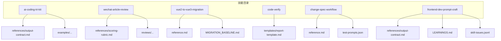
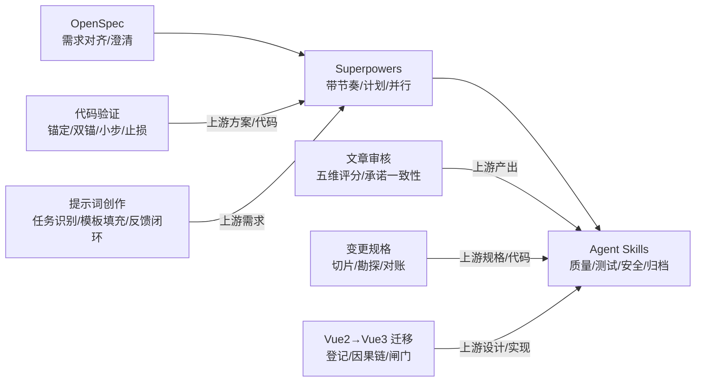
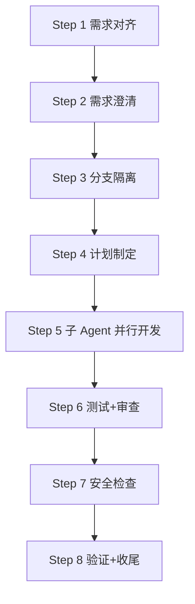
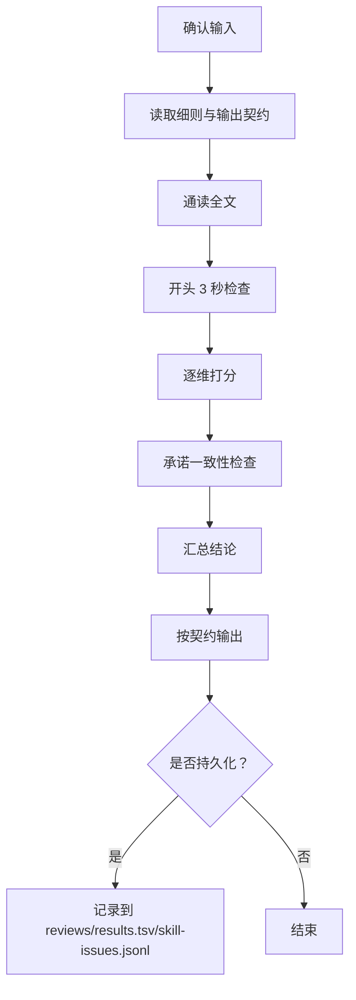
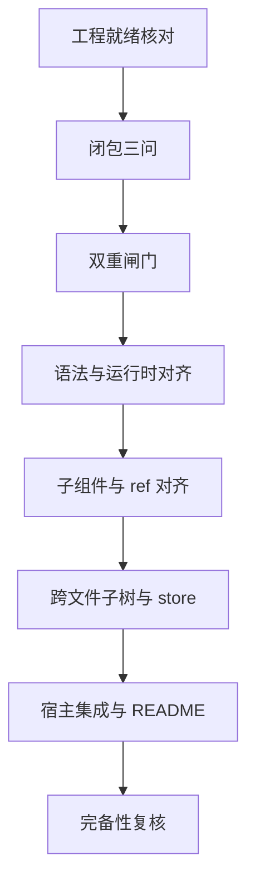
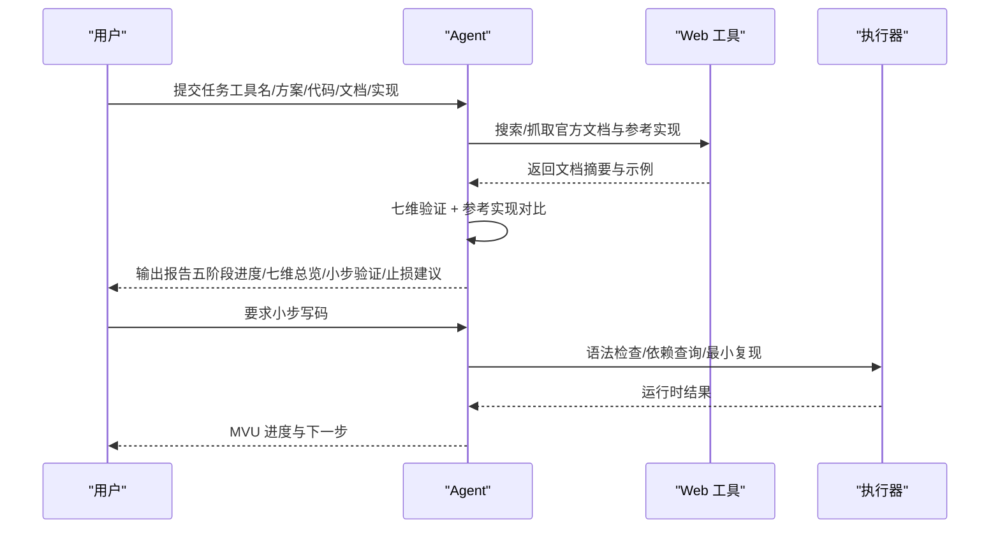
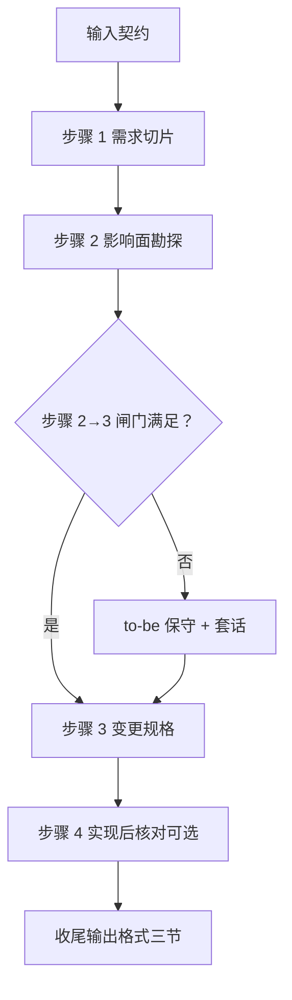
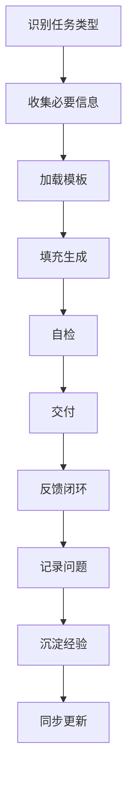
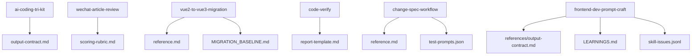

# 现有技能示例

<cite>
**本文引用的文件**
- [ai-coding-tri-kit/SKILL.md](file://plugins/frontend-team-toolkit/skills/ai-coding-tri-kit/SKILL.md)
- [ai-coding-tri-kit/references/output-contract.md](file://plugins/frontend-team-toolkit/skills/ai-coding-tri-kit/references/output-contract.md)
- [ai-coding-tri-kit/examples/feat-dashboard-csv-export-walkthrough.md](file://plugins/frontend-team-toolkit/skills/ai-coding-tri-kit/examples/feat-dashboard-csv-export-walkthrough.md)
- [wechat-article-review/SKILL.md](file://plugins/frontend-team-toolkit/skills/wechat-article-review/SKILL.md)
- [wechat-article-review/references/scoring-rubric.md](file://plugins/frontend-team-toolkit/skills/wechat-article-review/references/scoring-rubric.md)
- [wechat-article-review/reviews/2026-05-30-skill-engineering-blueprint-v2.md](file://plugins/frontend-team-toolkit/skills/wechat-article-review/reviews/2026-05-30-skill-engineering-blueprint-v2.md)
- [vue2-to-vue3-migration/SKILL.md](file://plugins/frontend-team-toolkit/skills/vue2-to-vue3-migration/SKILL.md)
- [vue2-to-vue3-migration/reference.md](file://plugins/frontend-team-toolkit/skills/vue2-to-vue3-migration/reference.md)
- [vue2-to-vue3-migration/MIGRATION_BASELINE.md](file://plugins/frontend-team-toolkit/skills/vue2-to-vue3-migration/MIGRATION_BASELINE.md)
- [code-verify/SKILL.md](file://plugins/frontend-team-toolkit/skills/code-verify/SKILL.md)
- [code-verify/templates/report-template.md](file://plugins/frontend-team-toolkit/skills/code-verify/templates/report-template.md)
- [code-verify/examples/README.md](file://plugins/frontend-team-toolkit/skills/code-verify/examples/README.md)
- [change-spec-workflow/SKILL.md](file://plugins/frontend-team-toolkit/skills/change-spec-workflow/SKILL.md)
- [change-spec-workflow/reference.md](file://plugins/frontend-team-toolkit/skills/change-spec-workflow/reference.md)
- [change-spec-workflow/test-prompts.json](file://plugins/frontend-team-toolkit/skills/change-spec-workflow/test-prompts.json)
- [frontend-dev-prompt-craft/SKILL.md](file://plugins/frontend-team-toolkit/skills/frontend-dev-prompt-craft/SKILL.md)
- [frontend-dev-prompt-craft/LEARNINGS.md](file://plugins/frontend-team-toolkit/skills/frontend-dev-prompt-craft/LEARNINGS.md)
- [frontend-dev-prompt-craft/skill-issues.jsonl](file://plugins/frontend-team-toolkit/skills/frontend-dev-prompt-craft/skill-issues.jsonl)
- [frontend-dev-prompt-craft/references/output-contract.md](file://plugins/frontend-team-toolkit/skills/frontend-dev-prompt-craft/references/output-contract.md)
- [ai-coding-tri-kit/results.tsv](file://plugins/frontend-team-toolkit/skills/ai-coding-tri-kit/results.tsv)
- [wechat-article-review/results.tsv](file://plugins/frontend-team-toolkit/skills/wechat-article-review/results.tsv)
</cite>

## 目录
1. [简介](#简介)
2. [项目结构](#项目结构)
3. [核心技能概览](#核心技能概览)
4. [架构总览](#架构总览)
5. [详细技能分析](#详细技能分析)
6. [依赖关系分析](#依赖关系分析)
7. [性能考量](#性能考量)
8. [故障排查指南](#故障排查指南)
9. [结论](#结论)
10. [附录](#附录)

## 简介
本文件系统梳理前端团队市场中的现有技能示例，围绕"AI 编程三件套""微信文章审核""Vue2 到 Vue3 迁移""代码验证""变更规格全流程""前端开发提示词创作"六大技能，从功能特性、实现原理、使用模式、评估与升级、扩展指导等维度进行深入解析，帮助读者快速掌握各技能的使用方法与最佳实践。

## 项目结构
技能与参考材料分布于 plugins/frontend-team-toolkit/skills 下，每个技能以独立目录组织，包含：
- SKILL.md：技能说明书与执行协议
- references/*：输出契约、评分细则、流程矩阵等参考文档
- examples/*：真实案例 walkthrough
- scripts/*：可选的验证脚本
- evals、results.tsv、test-prompts.json：评估与回归测试数据
- reference.md：迁移/变更规格等技能的配套参考模板
- LEARNINGS.md：经验沉淀文件
- skill-issues.jsonl：问题跟踪系统

**图表来源**
- [ai-coding-tri-kit/SKILL.md:1-301](file://plugins/frontend-team-toolkit/skills/ai-coding-tri-kit/SKILL.md#L1-L301)
- [wechat-article-review/SKILL.md:1-105](file://plugins/frontend-team-toolkit/skills/wechat-article-review/SKILL.md#L1-L105)
- [vue2-to-vue3-migration/SKILL.md:1-151](file://plugins/frontend-team-toolkit/skills/vue2-to-vue3-migration/SKILL.md#L1-L151)
- [code-verify/SKILL.md:1-369](file://plugins/frontend-team-toolkit/skills/code-verify/SKILL.md#L1-L369)
- [change-spec-workflow/SKILL.md:1-337](file://plugins/frontend-team-toolkit/skills/change-spec-workflow/SKILL.md#L1-L337)
- [frontend-dev-prompt-craft/SKILL.md:1-200](file://plugins/frontend-team-toolkit/skills/frontend-dev-prompt-craft/SKILL.md#L1-L200)

**章节来源**
- [ai-coding-tri-kit/SKILL.md:1-301](file://plugins/frontend-team-toolkit/skills/ai-coding-tri-kit/SKILL.md#L1-L301)
- [wechat-article-review/SKILL.md:1-105](file://plugins/frontend-team-toolkit/skills/wechat-article-review/SKILL.md#L1-L105)
- [vue2-to-vue3-migration/SKILL.md:1-151](file://plugins/frontend-team-toolkit/skills/vue2-to-vue3-migration/SKILL.md#L1-L151)
- [code-verify/SKILL.md:1-369](file://plugins/frontend-team-toolkit/skills/code-verify/SKILL.md#L1-L369)
- [change-spec-workflow/SKILL.md:1-337](file://plugins/frontend-team-toolkit/skills/change-spec-workflow/SKILL.md#L1-L337)
- [frontend-dev-prompt-craft/SKILL.md:1-200](file://plugins/frontend-team-toolkit/skills/frontend-dev-prompt-craft/SKILL.md#L1-L200)

## 核心技能概览
- AI 编程三件套：以 OpenSpec 定方向、Superpowers 带节奏、Agent Skills 守质量，形成 8 步主链路与强度分级、闸门与回退机制，强调"先契约、后实现、再验证"的工程化流水线。
- 微信文章审核：基于五维评分与加权阈值（≥9.0 通过），提供结构化打分、承诺一致性检查、空洞开头识别、P0/P1/P2 修改清单与复评目标。
- Vue2 到 Vue3 迁移：两阶段交付（登记与闸门自检 → 源码改写），依赖驱动与因果链双重闸门，提供语法对照、易漏项扫雷、校验清单与增量基线。
- 代码验证：以"先锚定，再迭代"为哲学，覆盖方案锚定、双锚验证（七维引擎）、小步验证、止损换策、经验沉淀，强调不可替代的运行时联调。
- 变更规格全流程：顺序执行"需求切片→影响面勘探→变更规格→（可选）实现后核对"，提供输入契约、闸门与人在回路、Reconcile 子模式与质量评分。
- 前端开发提示词创作：基于真实前端开发工作沉淀的提示词工程技能，提供任务类型识别、模板填充、反馈闭环、知识管理与问题跟踪系统。

**章节来源**
- [ai-coding-tri-kit/SKILL.md:12-301](file://plugins/frontend-team-toolkit/skills/ai-coding-tri-kit/SKILL.md#L12-L301)
- [wechat-article-review/SKILL.md:12-105](file://plugins/frontend-team-toolkit/skills/wechat-article-review/SKILL.md#L12-L105)
- [vue2-to-vue3-migration/SKILL.md:1-151](file://plugins/frontend-team-toolkit/skills/vue2-to-vue3-migration/SKILL.md#L1-L151)
- [code-verify/SKILL.md:17-369](file://plugins/frontend-team-toolkit/skills/code-verify/SKILL.md#L17-L369)
- [change-spec-workflow/SKILL.md:1-337](file://plugins/frontend-team-toolkit/skills/change-spec-workflow/SKILL.md#L1-L337)
- [frontend-dev-prompt-craft/SKILL.md:11-200](file://plugins/frontend-team-toolkit/skills/frontend-dev-prompt-craft/SKILL.md#L11-L200)

## 架构总览
六个技能在工程化流水线上形成互补：三件套提供"从 spec 到 archive"的主干流程；文章审核提供"内容质量门"；迁移技能提供"架构演进门"；代码验证提供"第三方接入门"；变更规格提供"需求与实现对账门"；前端提示词创作提供"智能提示词生成与反馈闭环"。

**图表来源**
- [ai-coding-tri-kit/SKILL.md:69-218](file://plugins/frontend-team-toolkit/skills/ai-coding-tri-kit/SKILL.md#L69-L218)
- [wechat-article-review/SKILL.md:43-54](file://plugins/frontend-team-toolkit/skills/wechat-article-review/SKILL.md#L43-L54)
- [code-verify/SKILL.md:51-69](file://plugins/frontend-team-toolkit/skills/code-verify/SKILL.md#L51-L69)
- [change-spec-workflow/SKILL.md:50-77](file://plugins/frontend-team-toolkit/skills/change-spec-workflow/SKILL.md#L50-L77)
- [vue2-to-vue3-migration/SKILL.md:10-92](file://plugins/frontend-team-toolkit/skills/vue2-to-vue3-migration/SKILL.md#L10-L92)
- [frontend-dev-prompt-craft/SKILL.md:31-56](file://plugins/frontend-team-toolkit/skills/frontend-dev-prompt-craft/SKILL.md#L31-L56)

## 详细技能分析

### AI 编程三件套（Ai Coding Tri-Kit）
- 功能特点
  - 以 OpenSpec 产出为入口，确保"先说清楚再实现"
  - Superpowers 负责流程节奏与计划制定，Agent Skills 负责质量约束与审查
  - 强度分级（Full/Standard/Lite）与步骤矩阵、闸门与回退机制保证可重复性
- 实现原理
  - 8 步主链路：需求对齐 → 需求澄清 → 分支隔离 → 计划制定 → 子 Agent 并行开发 → 测试+审查 → 安全检查 → 验证+收尾
  - 输出契约：会话摘要、进度清单、步骤明细、闸门状态、假设与未决、下一步
- 使用示例
  - 标准档位（Standard）Step 1–2 的真落盘案例：[feat-dashboard-csv-export-walkthrough.md:1-71](file://plugins/frontend-team-toolkit/skills/ai-coding-tri-kit/examples/feat-dashboard-csv-export-walkthrough.md#L1-L71)
- 配置说明
  - 强度分级与环境前置检查：见"强度分级""环境前置检查""外部依赖检查"等参考
  - 技能路由映射：见"Step → 外部 Skill"矩阵
- 扩展指导
  - 评估与升级：回归与能力用例、Fixture、Demo 仓库、问题池、升级 SOP
  - 交付物：输出契约、validate 脚本、示例 walkthrough

**图表来源**
- [ai-coding-tri-kit/SKILL.md:69-218](file://plugins/frontend-team-toolkit/skills/ai-coding-tri-kit/SKILL.md#L69-L218)

**章节来源**
- [ai-coding-tri-kit/SKILL.md:23-275](file://plugins/frontend-team-toolkit/skills/ai-coding-tri-kit/SKILL.md#L23-L275)
- [ai-coding-tri-kit/references/output-contract.md:1-97](file://plugins/frontend-team-toolkit/skills/ai-coding-tri-kit/references/output-contract.md#L1-L97)
- [ai-coding-tri-kit/examples/feat-dashboard-csv-export-walkthrough.md:1-71](file://plugins/frontend-team-toolkit/skills/ai-coding-tri-kit/examples/feat-dashboard-csv-export-walkthrough.md#L1-L71)
- [ai-coding-tri-kit/results.tsv:1-17](file://plugins/frontend-team-toolkit/skills/ai-coding-tri-kit/results.tsv#L1-L17)

### 微信文章审核（Wechat Article Review）
- 功能特点
  - 五维加权评分（主题与价值、结构与逻辑、干货密度、可读性与表达、标题与 CTA）
  - ≥9.0 通过，<9.0 输出 P0/P1/P2 修改清单与复评目标
  - 承诺一致性检查、空洞开头识别、技术 Blueprint 与领域示例处理
- 实现原理
  - 评分细则：维度权重、阈值、扣分参考、承诺一致性、空洞开头识别
  - 工作流：确认输入 → 读取细则 → 通读全文 → 开头 3 秒检查 → 逐维打分 → 承诺一致性 → 汇总结论 → 按契约输出 → 条件持久化
- 使用示例
  - 复评报告：v2 改稿从 8.4 提升至 9.2，问题闭环与承诺一致性检查
- 配置说明
  - 输入契约：文章内容或路径、类型、受众、渠道、约束
  - 输出契约：遵循输出契约模板，可选 validate 脚本
- 扩展指导
  - 评估与升级：回归与能力用例、测试提示、问题池
  - 下游：通过 → 视觉设计 → 主编终审；不通过 → 内容改稿 → 复评

**图表来源**
- [wechat-article-review/SKILL.md:43-54](file://plugins/frontend-team-toolkit/skills/wechat-article-review/SKILL.md#L43-L54)
- [wechat-article-review/references/scoring-rubric.md:1-88](file://plugins/frontend-team-toolkit/skills/wechat-article-review/references/scoring-rubric.md#L1-L88)

**章节来源**
- [wechat-article-review/SKILL.md:18-98](file://plugins/frontend-team-toolkit/skills/wechat-article-review/SKILL.md#L18-L98)
- [wechat-article-review/references/scoring-rubric.md:1-88](file://plugins/frontend-team-toolkit/skills/wechat-article-review/references/scoring-rubric.md#L1-L88)
- [wechat-article-review/reviews/2026-05-30-skill-engineering-blueprint-v2.md:1-54](file://plugins/frontend-team-toolkit/skills/wechat-article-review/reviews/2026-05-30-skill-engineering-blueprint-v2.md#L1-L54)
- [wechat-article-review/results.tsv:1-9](file://plugins/frontend-team-toolkit/skills/wechat-article-review/results.tsv#L1-L9)

### Vue2 到 Vue3 迁移（Vue2-to-Vue3 Migration）
- 功能特点
  - 两阶段交付：第一轮登记与闸门自检，第二轮批量改源码
  - 依赖驱动与因果链双重闸门，消除闭包未收敛与断因果风险
  - 提供语法对照、易漏项扫雷、校验清单与增量基线
- 实现原理
  - 工程就绪核对：package.json、锁文件、构建入口、TS 与路径、验证手段
  - 迁移原则：闭包完整、行为等价优先、路径可归因、范式统一、依赖边界清晰、可验证
  - 七阶段摘要：分析与拆解 → 目录落位 → 语法与运行时 → 子组件与 ref → 跨文件子树 → 宿主集成 → 完备性复核
- 使用示例
  - 参考模板与对照表：Options API → `<script setup>`、模板 ref/defineExpose、可选全局 store、路径别名落地、常用 API 对照
- 配置说明
  - 一页纸模板：元信息、依赖登记册、因果链登记表、隐式耦合与宿主约定、双重闸门勾选项、已知风险
  - 核心校验清单：登记 + 闸门、闭包/模板-脚本/动态 import、别名/语法/v-model/defineExpose、因果链、样式与资源、第三方 API、可选 store、构建或类型检查、交付物
- 扩展指导
  - 增量迁移：基于 Git 提交基线限定变更文件范围
  - 文档与可追溯性：固定迁移根入口、对外 props/emit、Vue 2 源路径/commit

**图表来源**
- [vue2-to-vue3-migration/SKILL.md:21-92](file://plugins/frontend-team-toolkit/skills/vue2-to-vue3-migration/SKILL.md#L21-L92)
- [vue2-to-vue3-migration/reference.md:221-269](file://plugins/frontend-team-toolkit/skills/vue2-to-vue3-migration/reference.md#L221-L269)

**章节来源**
- [vue2-to-vue3-migration/SKILL.md:10-151](file://plugins/frontend-team-toolkit/skills/vue2-to-vue3-migration/SKILL.md#L10-L151)
- [vue2-to-vue3-migration/reference.md:1-344](file://plugins/frontend-team-toolkit/skills/vue2-to-vue3-migration/reference.md#L1-L344)
- [vue2-to-vue3-migration/MIGRATION_BASELINE.md:1-29](file://plugins/frontend-team-toolkit/skills/vue2-to-vue3-migration/MIGRATION_BASELINE.md#L1-L29)

### 代码验证（Code Verify）
- 功能特点
  - "先锚定，再迭代"：在写代码前先确认方向，避免迭代幻觉
  - 覆盖方案锚定、双锚验证（七维引擎）、小步验证、止损换策、经验沉淀
- 实现原理
  - 五阶段：方案锚定 → 双锚验证（七维 + 参考实现）→ 小步验证（MVU）→ 止损换策（时间盒 + 置信度）→ 经验沉淀
  - 七维验证：文档存在性、API 签名、认证方式、依赖包、初始化顺序、版本兼容、语法检查
  - 小步验证：每次只写一个最小可验证单元，写完即测，失败协议明确
- 使用示例
  - 案例库：企业微信 JS-SDK H5 对接（初始化顺序、H5 内置浏览器对接）
- 配置说明
  - 报告模板：五阶段进度、七维验证总览、参考实现锚、小步验证进度、止损与决策、分项详情、总结与下一步、参考链接
  - 脚本入口：validate.sh 生成全链路验证骨架
- 扩展指导
  - 交付物：报告模板、检查清单模板、案例示例、版本记录
  - Agent 执行自检：覆盖五阶段与七维结果、是否默认套用示例、是否按模板落盘

**图表来源**
- [code-verify/SKILL.md:51-323](file://plugins/frontend-team-toolkit/skills/code-verify/SKILL.md#L51-L323)
- [code-verify/templates/report-template.md:1-128](file://plugins/frontend-team-toolkit/skills/code-verify/templates/report-template.md#L1-L128)

**章节来源**
- [code-verify/SKILL.md:17-369](file://plugins/frontend-team-toolkit/skills/code-verify/SKILL.md#L17-L369)
- [code-verify/templates/report-template.md:1-128](file://plugins/frontend-team-toolkit/skills/code-verify/templates/report-template.md#L1-L128)
- [code-verify/examples/README.md:1-10](file://plugins/frontend-team-toolkit/skills/code-verify/examples/README.md#L1-L10)

### 变更规格全流程（Change Spec Workflow）
- 功能特点
  - 固定顺序执行：需求切片 → 影响面勘探 → 变更规格（Change Spec）→（可选）实现后核对
  - 闸门与人在回路：to-be 保守、证据不足时贴套话、核心路径无证据处为 TBD
  - Reconcile 子模式：源文档版本演进时的对齐分析与同步
- 实现原理
  - I/O 表与子步骤：严格按序，禁止串步；仅步骤 1/2/3/4 的产出与落盘要求
  - 输入契约：规格根目录、巨仓范围；工具不可读仓库时的处理
  - 闸门与自检：步骤 2→3 闸门、to-be 套话、八块对照表、收尾三节
- 使用示例
  - 测试提示：覆盖"缺输入/顺序+闸门/落盘/子步骤/打分入口"等关键点
- 配置说明
  - 参考模板：切片与影响面勘探骨架、变更规格区块、契约/字段矩阵表头、实现后核对差异表、Reconcile 对齐分析骨架
- 扩展指导
  - 与 OpenSpec 契约技能分工：契约四文件 vs 本技能执行顺序与落盘
  - 质量评分：结构分（12 项核查）+ 效果分（6 个 test-prompts）

**图表来源**
- [change-spec-workflow/SKILL.md:50-77](file://plugins/frontend-team-toolkit/skills/change-spec-workflow/SKILL.md#L50-L77)
- [change-spec-workflow/reference.md:7-141](file://plugins/frontend-team-toolkit/skills/change-spec-workflow/reference.md#L7-L141)

**章节来源**
- [change-spec-workflow/SKILL.md:9-337](file://plugins/frontend-team-toolkit/skills/change-spec-workflow/SKILL.md#L9-L337)
- [change-spec-workflow/reference.md:1-141](file://plugins/frontend-team-toolkit/skills/change-spec-workflow/reference.md#L1-L141)
- [change-spec-workflow/test-prompts.json:1-33](file://plugins/frontend-team-toolkit/skills/change-spec-workflow/test-prompts.json#L1-L33)

### 前端开发提示词创作（Frontend Dev Prompt Craft）
- 功能特点
  - 基于真实前端开发工作沉淀的提示词工程技能
  - 提供任务类型识别、模板填充、自检与交付的完整流程
  - 包含反馈闭环、知识管理和问题跟踪系统
- 实现原理
  - 任务类型识别：8 种前端任务类型（PAGE/UI/API/ARCH/REFACTOR/DEBUG/PRD/MIGRATE）
  - 模板驱动生成：根据任务类型加载对应模板，填充用户输入
  - 反馈闭环：交付后主动收集用户反馈，持续改进提示词质量
  - 知识管理：通过 LEARNINGS.md 沉淀经验和最佳实践
  - 问题跟踪：通过 skill-issues.jsonl 记录和追踪问题
- 使用示例
  - 页面功能开发：新增页面、列表页、详情页等任务类型的具体应用
  - UI 还原：基于设计稿的页面还原任务
  - 接口对接：API 接口文档对接任务
- 配置说明
  - 输入契约：按任务类型定义的必填信息清单
  - 输出契约：完整的提示词格式规范
  - 评估与升级：结构化评估、快速实测、结果记录、问题池、经验沉淀
- 扩展指导
  - 反馈闭环规则：7 步骤反馈循环，包括追问效果、记录问题、沉淀经验、同步更新
  - 知识管理：LEARNINGS.md 模板和格式规范
  - 问题跟踪：skill-issues.jsonl 的结构和使用方法

**图表来源**
- [frontend-dev-prompt-craft/SKILL.md:31-56](file://plugins/frontend-team-toolkit/skills/frontend-dev-prompt-craft/SKILL.md#L31-L56)
- [frontend-dev-prompt-craft/SKILL.md:180-200](file://plugins/frontend-team-toolkit/skills/frontend-dev-prompt-craft/SKILL.md#L180-L200)

**章节来源**
- [frontend-dev-prompt-craft/SKILL.md:11-200](file://plugins/frontend-team-toolkit/skills/frontend-dev-prompt-craft/SKILL.md#L11-L200)
- [frontend-dev-prompt-craft/LEARNINGS.md:1-15](file://plugins/frontend-team-toolkit/skills/frontend-dev-prompt-craft/LEARNINGS.md#L1-L15)
- [frontend-dev-prompt-craft/skill-issues.jsonl:1-2](file://plugins/frontend-team-toolkit/skills/frontend-dev-prompt-craft/skill-issues.jsonl#L1-L2)
- [frontend-dev-prompt-craft/references/output-contract.md:1-69](file://plugins/frontend-team-toolkit/skills/frontend-dev-prompt-craft/references/output-contract.md#L1-L69)

## 依赖关系分析
- 技能内依赖
  - 三件套：依赖 OpenSpec、Superpowers、Agent Skills 的协同与输出契约
  - 文章审核：依赖评分细则与输出契约，复评与持久化
  - 迁移：依赖 reference.md 与 MIGRATION_BASELINE.md，两阶段与双重闸门
  - 代码验证：依赖报告模板与脚本入口，五阶段与七维
  - 变更规格：依赖 reference.md 与 test-prompts.json，输入契约与闸门
  - 提示词创作：依赖输出契约、模板库、反馈系统、知识管理系统
- 评估与升级
  - 三件套：results.tsv 展示回归与能力用例通过情况
  - 文章审核：results.tsv 展示复评前后分数变化
  - 变更规格：test-prompts.json 与 results.tsv 用于评分与认证
  - 提示词创作：results.tsv 展示评估结果，skill-issues.jsonl 用于问题跟踪

**图表来源**
- [ai-coding-tri-kit/references/output-contract.md:1-97](file://plugins/frontend-team-toolkit/skills/ai-coding-tri-kit/references/output-contract.md#L1-L97)
- [wechat-article-review/references/scoring-rubric.md:1-88](file://plugins/frontend-team-toolkit/skills/wechat-article-review/references/scoring-rubric.md#L1-L88)
- [vue2-to-vue3-migration/reference.md:1-344](file://plugins/frontend-team-toolkit/skills/vue2-to-vue3-migration/reference.md#L1-L344)
- [vue2-to-vue3-migration/MIGRATION_BASELINE.md:1-29](file://plugins/frontend-team-toolkit/skills/vue2-to-vue3-migration/MIGRATION_BASELINE.md#L1-L29)
- [code-verify/templates/report-template.md:1-128](file://plugins/frontend-team-toolkit/skills/code-verify/templates/report-template.md#L1-L128)
- [change-spec-workflow/reference.md:1-141](file://plugins/frontend-team-toolkit/skills/change-spec-workflow/reference.md#L1-L141)
- [change-spec-workflow/test-prompts.json:1-33](file://plugins/frontend-team-toolkit/skills/change-spec-workflow/test-prompts.json#L1-L33)
- [frontend-dev-prompt-craft/references/output-contract.md:1-69](file://plugins/frontend-team-toolkit/skills/frontend-dev-prompt-craft/references/output-contract.md#L1-L69)
- [frontend-dev-prompt-craft/LEARNINGS.md:1-15](file://plugins/frontend-team-toolkit/skills/frontend-dev-prompt-craft/LEARNINGS.md#L1-L15)
- [frontend-dev-prompt-craft/skill-issues.jsonl:1-2](file://plugins/frontend-team-toolkit/skills/frontend-dev-prompt-craft/skill-issues.jsonl#L1-L2)

**章节来源**
- [ai-coding-tri-kit/results.tsv:1-17](file://plugins/frontend-team-toolkit/skills/ai-coding-tri-kit/results.tsv#L1-L17)
- [wechat-article-review/results.tsv:1-9](file://plugins/frontend-team-toolkit/skills/wechat-article-review/results.tsv#L1-L9)

## 性能考量
- 三件套
  - 强度分级与 Lite 模式可降低执行成本；工作树隔离在 Full/Standard 模式下提升基线稳定性
- 文章审核
  - 评分与承诺一致性检查可前置发现结构性问题，减少返工
- 迁移
  - 双重闸门与增量基线显著降低回滚与回归风险
- 代码验证
  - 小步验证与时间盒/置信度闸门避免无效迭代，提高联调效率
- 变更规格
  - 输入契约与闸门减少无效落盘，Reconcile 子模式降低版本演进成本
- 提示词创作
  - 模板驱动的标准化流程提高生成效率，反馈闭环持续优化提示词质量

## 故障排查指南
- 三件套
  - 闸门失败（需求确认/代码评审/安全扫描）：按"Checkpoint""闸门与回退"处理，必要时降级或阻断
  - 输出不符合契约：检查输出契约与 validate 脚本
- 文章审核
  - 总分 8.5–8.9：标注"接近达标"，仍为不通过；空洞开头识别未覆盖：补检查
  - 不通过必含 P0/P1/P2 修改清单与复评目标
- 迁移
  - 闭包未收敛：先补登记再扩写代码；行为门未满足：补齐因果链差异说明
  - 增量迁移：基于基线命令列出变更文件，避免重复改写
- 代码验证
  - 七维未达标或超时：触发止损，建议官方社区/真人求助/换方案
  - 小步验证连续失败：按失败协议收集完整错误信息，要求 AI 先分析原因
- 变更规格
  - 输入契约未满足：只输出"待用户补充清单"，不编造正文
  - 闸门未过：to-be 保守并在段首贴套话；核心路径无证据处为 TBD
- 提示词创作
  - 任务类型识别错误：检查用户输入的关键信息是否足够
  - 模板填充不完整：检查必填项收集是否完整
  - 反馈闭环未执行：提醒用户参与反馈收集
  - 知识管理未更新：检查 LEARNINGS.md 格式是否正确
  - 问题跟踪异常：检查 skill-issues.jsonl 结构是否符合规范

**章节来源**
- [ai-coding-tri-kit/SKILL.md:221-231](file://plugins/frontend-team-toolkit/skills/ai-coding-tri-kit/SKILL.md#L221-L231)
- [wechat-article-review/SKILL.md:64-94](file://plugins/frontend-team-toolkit/skills/wechat-article-review/SKILL.md#L64-L94)
- [vue2-to-vue3-migration/SKILL.md:64-78](file://plugins/frontend-team-toolkit/skills/vue2-to-vue3-migration/SKILL.md#L64-L78)
- [code-verify/SKILL.md:221-251](file://plugins/frontend-team-toolkit/skills/code-verify/SKILL.md#L221-L251)
- [change-spec-workflow/SKILL.md:234-244](file://plugins/frontend-team-toolkit/skills/change-spec-workflow/SKILL.md#L234-L244)
- [frontend-dev-prompt-craft/SKILL.md:126-133](file://plugins/frontend-team-toolkit/skills/frontend-dev-prompt-craft/SKILL.md#L126-L133)

## 结论
上述六个技能共同构成前端团队的工程化"能力基座"：从需求到实现、从内容到架构、从方案到落地、从生成到反馈，形成可复制、可验证、可升级的完整流水线。建议在实际使用中：
- 三件套作为主干流程，配合输出契约与评估体系
- 文章审核作为内容质量门，确保传播效果与合规
- 迁移技能作为架构演进门，以登记与闸门保障稳定性
- 代码验证作为第三方接入门，以锚定与小步验证降低风险
- 变更规格作为需求与实现对账门，以输入契约与 Reconcile 子模式保障一致性
- 提示词创作作为智能辅助门，以任务识别、模板驱动和反馈闭环提升 AI 编码效率

## 附录
- 评估与升级
  - 三件套：results.tsv 展示回归与能力用例通过情况
  - 文章审核：results.tsv 展示复评前后分数变化
  - 变更规格：test-prompts.json 与 results.tsv 用于评分与认证
  - 提示词创作：results.tsv 展示评估结果，skill-issues.jsonl 用于问题跟踪
- 示例与模板
  - 三件套 walkthrough、文章审核复评报告、迁移参考模板与增量基线、代码验证报告模板与案例库、变更规格参考模板与测试提示、提示词创作模板库与学习笔记
- 反馈闭环系统
  - 用户反馈收集、问题记录与跟踪、经验沉淀与同步更新的完整流程

**章节来源**
- [ai-coding-tri-kit/results.tsv:1-17](file://plugins/frontend-team-toolkit/skills/ai-coding-tri-kit/results.tsv#L1-L17)
- [wechat-article-review/results.tsv:1-9](file://plugins/frontend-team-toolkit/skills/wechat-article-review/results.tsv#L1-L9)
- [change-spec-workflow/test-prompts.json:1-33](file://plugins/frontend-team-toolkit/skills/change-spec-workflow/test-prompts.json#L1-L33)
- [code-verify/examples/README.md:1-10](file://plugins/frontend-team-toolkit/skills/code-verify/examples/README.md#L1-L10)
- [frontend-dev-prompt-craft/LEARNINGS.md:1-15](file://plugins/frontend-team-toolkit/skills/frontend-dev-prompt-craft/LEARNINGS.md#L1-L15)
- [frontend-dev-prompt-craft/skill-issues.jsonl:1-2](file://plugins/frontend-team-toolkit/skills/frontend-dev-prompt-craft/skill-issues.jsonl#L1-L2)