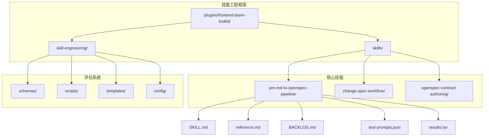
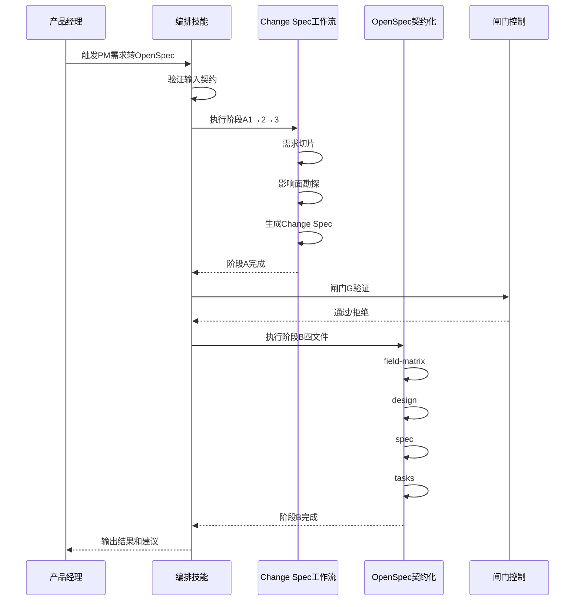
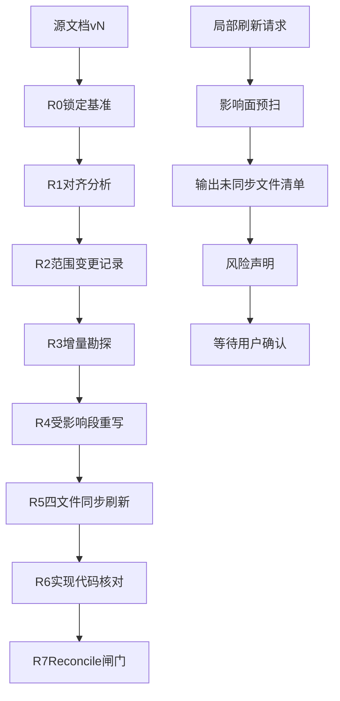
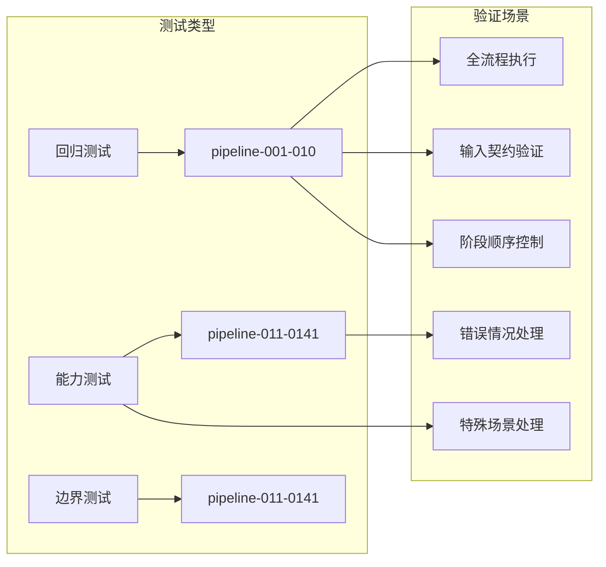
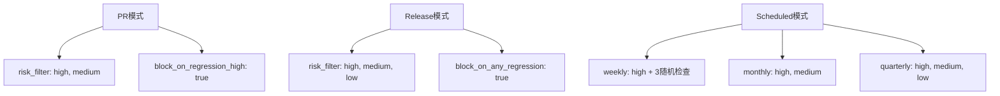
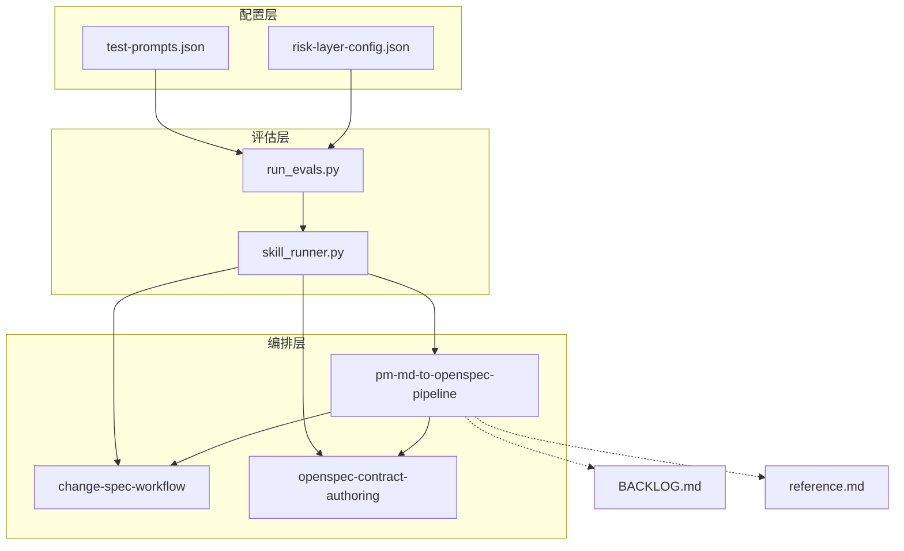
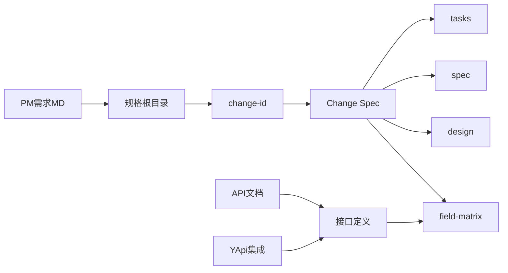
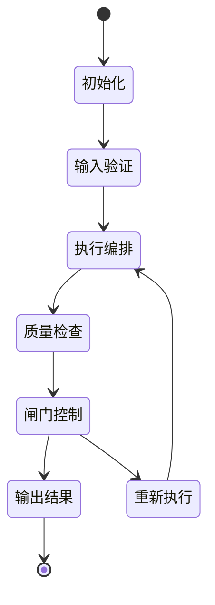

# 项目经理Markdown到OpenSpec流水线

<cite>
**本文档引用的文件**
- [SKILL.md](file://plugins/frontend-team-toolkit/skills/pm-md-to-openspec-pipeline/SKILL.md)
- [BACKLOG.md](file://plugins/frontend-team-toolkit/skills/pm-md-to-openspec-pipeline/BACKLOG.md)
- [reference.md](file://plugins/frontend-team-toolkit/skills/pm-md-to-openspec-pipeline/reference.md)
- [results.tsv](file://plugins/frontend-team-toolkit/skills/pm-md-to-openspec-pipeline/results.tsv)
- [change-spec-workflow/SKILL.md](file://plugins/frontend-team-toolkit/skills/change-spec-workflow/SKILL.md)
- [openspec-contract-authoring/SKILL.md](file://plugins/frontend-team-toolkit/skills/openspec-contract-authoring/SKILL.md)
- [skill_runner.py](file://plugins/frontend-team-toolkit/skill-engineering/scripts/skill_runner.py)
- [run_evals.py](file://plugins/frontend-team-toolkit/skill-engineering/scripts/run_evals.py)
- [risk-layer-config.json](file://plugins/frontend-team-toolkit/skill-engineering/config/risk-layer-config.json)
- [test-prompts.json](file://plugins/frontend-team-toolkit/skills/pm-md-to-openspec-pipeline/test-prompts.json)
- [change-spec-workflow/test-prompts.json](file://plugins/frontend-team-toolkit/skills/change-spec-workflow/test-prompts.json)
- [openspec-contract-authoring/test-prompts.json](file://plugins/frontend-team-toolkit/skills/openspec-contract-authoring/test-prompts.json)
</cite>

## 目录
1. [简介](#简介)
2. [项目结构](#项目结构)
3. [核心组件](#核心组件)
4. [架构概览](#架构概览)
5. [详细组件分析](#详细组件分析)
6. [依赖关系分析](#依赖关系分析)
7. [性能考虑](#性能考虑)
8. [故障排除指南](#故障排除指南)
9. [结论](#结论)
10. [附录](#附录)

## 简介

项目经理Markdown到OpenSpec流水线是一个专门设计用于将产品经理需求文档（Markdown）转换为OpenSpec规范的自动化编排系统。该流水线通过严格的两阶段转换流程，确保技术文档的标准化和质量控制。

### 流水线核心特性

- **双阶段转换架构**：从PM需求MD到Change Spec再到OpenSpec四文件
- **强制编排控制**：防止跳过关键步骤，确保文档质量
- **版本管理机制**：支持源文档版本演进和Reconcile编排
- **风险控制护栏**：包括闸门控制、局部刷新护栏和双根目录版本对齐
- **自动化评估系统**：内置测试提示和评估框架

## 项目结构

该代码库采用技能工程（Skill Engineering）架构，每个技能都是独立的功能模块：



**图表来源**
- [SKILL.md:1-329](file://plugins/frontend-team-toolkit/skills/pm-md-to-openspec-pipeline/SKILL.md#L1-L329)
- [reference.md:1-204](file://plugins/frontend-team-toolkit/skills/pm-md-to-openspec-pipeline/reference.md#L1-L204)

**章节来源**
- [SKILL.md:1-329](file://plugins/frontend-team-toolkit/skills/pm-md-to-openspec-pipeline/SKILL.md#L1-L329)
- [reference.md:1-204](file://plugins/frontend-team-toolkit/skills/pm-md-to-openspec-pipeline/reference.md#L1-L204)

## 核心组件

### 1. 编排技能（pm-md-to-openspec-pipeline）

编排技能是整个流水线的核心协调器，负责：
- 固定两阶段顺序执行
- 闸门控制和质量保证
- 版本管理和Reconcile编排
- 局部刷新护栏

### 2. 子技能模块

#### change-spec-workflow
- 需求切片和影响面勘探
- Change Spec八块规范
- 证据收集和验证

#### openspec-contract-authoring
- OpenSpec四文件契约化
- 字段矩阵和设计约束
- Gate和Evidence管理

### 3. 评估和监控系统

#### 测试提示框架
- regression测试：验证核心流程
- capability测试：评估特殊场景
- edge-case测试：边界条件验证

#### 风险层配置
- PR模式：高优先级回归测试
- Release模式：全量测试覆盖
- Scheduled模式：定期回归测试

**章节来源**
- [SKILL.md:10-329](file://plugins/frontend-team-toolkit/skills/pm-md-to-openspec-pipeline/SKILL.md#L10-L329)
- [change-spec-workflow/SKILL.md:1-200](file://plugins/frontend-team-toolkit/skills/change-spec-workflow/SKILL.md#L1-L200)
- [openspec-contract-authoring/SKILL.md:1-185](file://plugins/frontend-team-toolkit/skills/openspec-contract-authoring/SKILL.md#L1-L185)

## 架构概览

### 流水线执行架构



**图表来源**
- [SKILL.md:82-148](file://plugins/frontend-team-toolkit/skills/pm-md-to-openspec-pipeline/SKILL.md#L82-L148)

### 版本演进架构



**图表来源**
- [SKILL.md:167-241](file://plugins/frontend-team-toolkit/skills/pm-md-to-openspec-pipeline/SKILL.md#L167-L241)

## 详细组件分析

### 编排技能核心机制

#### 1. 输入契约验证

编排技能要求以下至少一项可读材料：
- PM需求MD（@docs/prd/...）
- 已有规格根目录（openspec/changes/...）

#### 2. 阶段A执行控制

阶段A严格按照以下顺序执行：
1. **需求切片**：收敛本期范围，防止任务漂移
2. **影响面勘探**：证据检索与主链路分析
3. **Change Spec生成**：可执行真相和TBD清单

#### 3. 闸门G质量控制

闸门G必须满足以下条件：
- 实操记录完整（含范围变更记录）
- Change Spec八块语义齐全
- change-id已确认
- 用户未要求仅阶段A
- Owner已确认In/Out

#### 4. 阶段B四文件生成

按照固定顺序生成OpenSpec四文件：
1. field-matrix.md（字段矩阵）
2. design.md（设计约束）
3. spec.md（规格说明）
4. tasks.md（任务和证据）

**章节来源**
- [SKILL.md:52-148](file://plugins/frontend-team-toolkit/skills/pm-md-to-openspec-pipeline/SKILL.md#L52-L148)

### Reconcile编排机制

Reconcile编排专门处理源文档版本演进：

#### 触发条件
- 源文档版本号变化（vN-1 → vN）
- 用户要求按vN重审/reconcile
- 提供剔除/新增清单进行回溯

#### 执行序列
1. **R0锁定基准**：确定vN基准和入库状态
2. **R1对齐分析**：生成三栏对齐分析表
3. **R2范围变更**：更新范围变更记录
4. **R3增量勘探**：仅影响范围内的勘探
5. **R4受影响段重写**：重写受影响的Change Spec段落
6. **R5四文件同步**：同步刷新所有契约文件
7. **R6代码核对**：实现代码差异分析
8. **R7Reconcile闸门**：最终验证和确认

**章节来源**
- [SKILL.md:167-218](file://plugins/frontend-team-toolkit/skills/pm-md-to-openspec-pipeline/SKILL.md#L167-L218)

### 局部刷新护栏

当用户仅要求刷新特定文件时，系统启用局部刷新护栏：

#### 触发条件
- 用户明确要求仅刷新某个契约文件
- 仅刷新field-matrix/design/spec/tasks之一

#### 护栏机制
1. **影响面预扫**：识别受牵连的兄弟文件
2. **输出未同步清单**：列出所有未同步文件及其风险
3. **风险声明**：明确声明未闭合的Gate
4. **用户确认**：必须获得用户明确同意

**章节来源**
- [SKILL.md:244-283](file://plugins/frontend-team-toolkit/skills/pm-md-to-openspec-pipeline/SKILL.md#L244-L283)

### 评估和监控系统

#### 测试提示框架

系统包含141个测试提示，涵盖：



**图表来源**
- [test-prompts.json:1-141](file://plugins/frontend-team-toolkit/skills/pm-md-to-openspec-pipeline/test-prompts.json#L1-L141)

#### 风险层配置



**图表来源**
- [risk-layer-config.json:1-70](file://plugins/frontend-team-toolkit/skill-engineering/config/risk-layer-config.json#L1-L70)

**章节来源**
- [test-prompts.json:1-141](file://plugins/frontend-team-toolkit/skills/pm-md-to-openspec-pipeline/test-prompts.json#L1-L141)
- [risk-layer-config.json:1-70](file://plugins/frontend-team-toolkit/skill-engineering/config/risk-layer-config.json#L1-L70)

## 依赖关系分析

### 技能间依赖关系



**图表来源**
- [run_evals.py:1-227](file://plugins/frontend-team-toolkit/skill-engineering/scripts/run_evals.py#L1-L227)
- [skill_runner.py:1-378](file://plugins/frontend-team-toolkit/skill-engineering/scripts/skill_runner.py#L1-L378)

### 数据流依赖



**图表来源**
- [SKILL.md:72-76](file://plugins/frontend-team-toolkit/skills/pm-md-to-openspec-pipeline/SKILL.md#L72-L76)

**章节来源**
- [run_evals.py:135-174](file://plugins/frontend-team-toolkit/skill-engineering/scripts/run_evals.py#L135-L174)
- [skill_runner.py:308-326](file://plugins/frontend-team-toolkit/skill-engineering/scripts/skill_runner.py#L308-L326)

## 性能考虑

### 执行效率优化

1. **并行处理能力**
   - 编排技能支持并行执行多个子任务
   - 评估系统可并行运行多个测试用例

2. **缓存机制**
   - 技能上下文缓存
   - 评估结果缓存
   - API调用缓存

3. **资源管理**
   - 超时控制（5分钟）
   - 内存使用监控
   - Token使用统计

### 风险控制策略



## 故障排除指南

### 常见问题诊断

#### 1. 技能未加载
**症状**：@pm-md-to-openspec-pipeline未出现在技能列表中

**解决方案**：
- 确认本地插件已安装
- 重启Cursor应用
- 检查marketplace.json配置

#### 2. 输入契约缺失
**症状**：仅输出待补充清单，不生成任何文件

**解决方案**：
- 提供PM需求MD或规格根目录
- 确保change-id已确认
- 指定目标仓库和勘探范围

#### 3. 版本漂移问题
**症状**：specs/和openspec/changes/目录版本不一致

**解决方案**：
- 启动Reconcile编排R1-R5
- 统一版本标识
- 更新VERSION.md文件

#### 4. 局部刷新风险
**症状**：仅刷新部分文件导致契约不一致

**解决方案**：
- 使用局部刷新护栏
- 输出未同步文件清单
- 获得用户明确同意

**章节来源**
- [reference.md:183-195](file://plugins/frontend-team-toolkit/skills/pm-md-to-openspec-pipeline/reference.md#L183-L195)
- [BACKLOG.md:1-62](file://plugins/frontend-team-toolkit/skills/pm-md-to-openspec-pipeline/BACKLOG.md#L1-L62)

## 结论

项目经理Markdown到OpenSpec流水线通过以下关键机制实现了高效的技术文档标准化：

### 核心优势

1. **严格的流程控制**：强制两阶段顺序执行，防止跳过关键步骤
2. **完善的质量保证**：多层闸门控制和风险护栏
3. **版本演进管理**：Reconcile编排支持源文档版本演进
4. **自动化评估**：全面的测试提示和风险层配置
5. **可视化监控**：详细的Backlog管理和结果分析

### 最佳实践建议

1. **建立标准化流程**
   - 制定团队内部的触发和执行规范
   - 建立Backlog管理机制
   - 定期回顾和优化流水线

2. **实施质量控制**
   - 严格执行闸门控制
   - 使用Reconcile编排处理版本变更
   - 启用局部刷新护栏保护契约完整性

3. **持续改进**
   - 基于Backlog反馈持续优化
   - 定期运行评估测试
   - 建立知识传承机制

该流水线为项目管理在技术文档标准化中发挥了关键作用，通过自动化和标准化确保了文档质量和一致性，为后续的开发和验收提供了可靠的基础。

## 附录

### 配置说明

#### 环境变量设置
- `SKILL_EXECUTION_MODE`: 执行模式（local/api/claude_code）
- `ANTHROPIC_API_KEY`: API密钥（用于API模式）
- `CLAUDE_CODE_PATH`: Claude Code CLI路径

#### 风险层配置参数
- `pr_mode`: PR触发模式配置
- `release_mode`: 发布前模式配置
- `scheduled_mode`: 定期回归模式配置

### 使用示例

#### 基本触发命令
```
@skills/pm-md-to-openspec-pipeline/SKILL.md
@docs/prd/feature-x.md
请按pm-md-to-openspec-pipeline执行：阶段A（步骤1→2→3）→ 阶段B（四文件）。
```

#### Reconcile模式触发
```
@skills/pm-md-to-openspec-pipeline/SKILL.md
@docs/prd/feature-x-v2.md
按pm-md-to-openspec-pipeline启用Reconcile编排（基准源文档v2）：
- R0~R5：阶段A对齐分析 + 实操记录/Change Spec同步 + 阶段B四文件齐刷
- R6暂不动代码（待我书面授权）
- 收尾标注"基准源文档版本：v2"
```