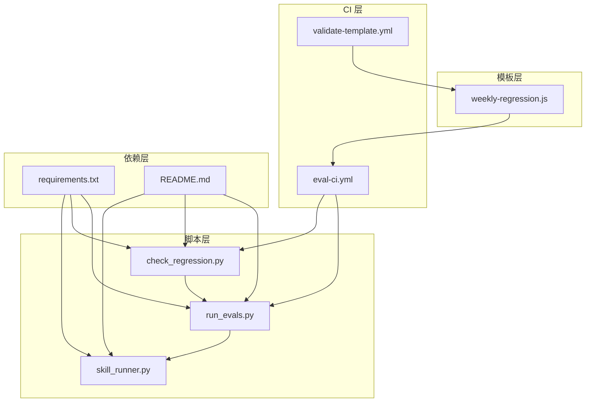
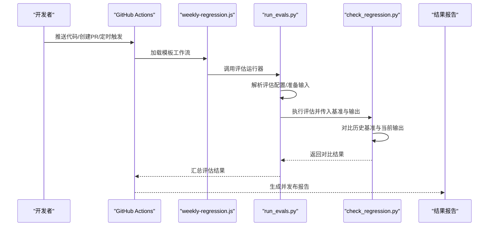
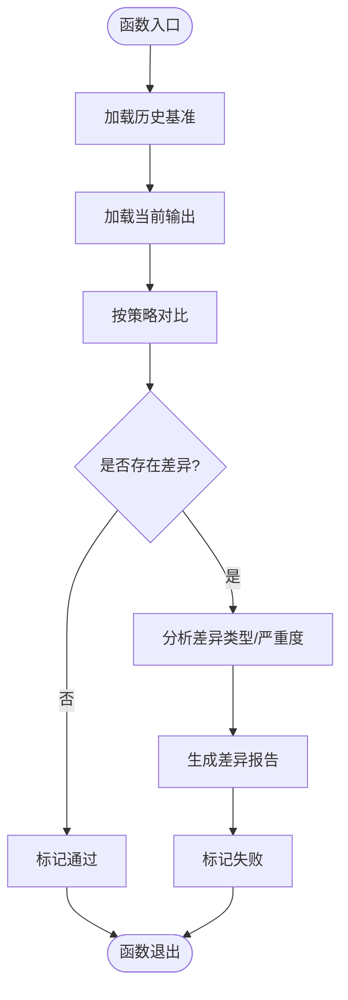
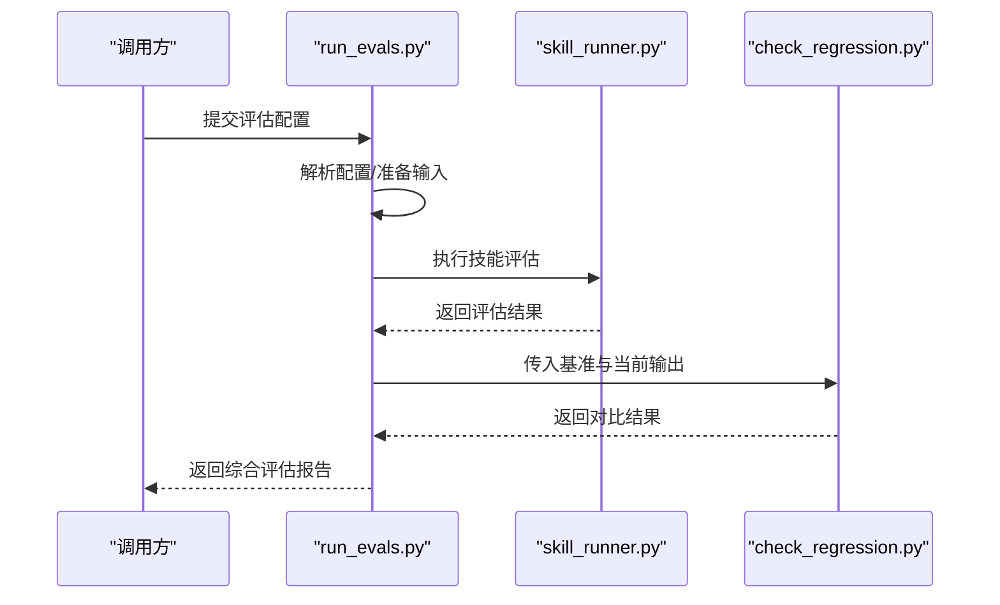
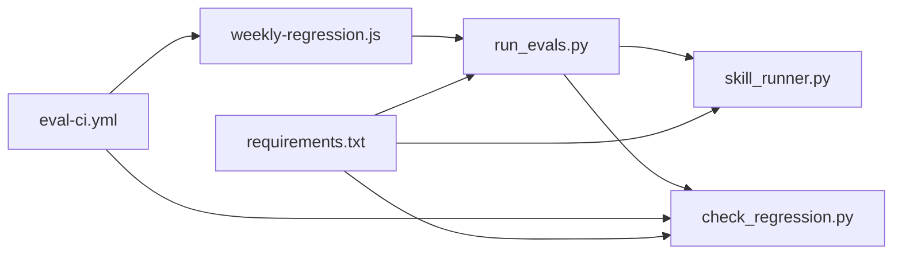

# 回归测试

<cite>
**本文引用的文件**
- [check_regression.py](file://plugins/frontend-team-toolkit/skill-engineering/scripts/check_regression.py)
- [run_evals.py](file://plugins/frontend-team-toolkit/skill-engineering/scripts/run_evals.py)
- [skill_runner.py](file://plugins/frontend-team-toolkit/skill-engineering/scripts/skill_runner.py)
- [weekly-regression.js](file://plugins/frontend-team-toolkit/skill-engineering/templates/new-skill/workflows/weekly-regression.js)
- [eval-ci.yml](file://.github/workflows/eval-ci.yml)
- [validate-template.yml](file://.github/workflows/validate-template.yml)
- [requirements.txt](file://plugins/frontend-team-toolkit/skill-engineering/requirements.txt)
- [README.md](file://plugins/frontend-team-toolkit/skill-engineering/README.md)
</cite>

## 目录
1. [简介](#简介)
2. [项目结构](#项目结构)
3. [核心组件](#核心组件)
4. [架构总览](#架构总览)
5. [详细组件分析](#详细组件分析)
6. [依赖关系分析](#依赖关系分析)
7. [性能考虑](#性能考虑)
8. [故障排查指南](#故障排查指南)
9. [结论](#结论)
10. [附录](#附录)

## 简介
本技术文档面向回归测试系统，围绕测试用例管理、执行策略、结果对比分析、配置方法、测试数据准备与结果验证流程进行深入说明，并结合模板工作流与 CI 集成，给出可操作的自动化执行方案。文档同时提供失败处理策略与常见问题排查建议，帮助团队在持续集成中稳定运行回归测试。

## 项目结构
回归测试能力主要由前端团队工具包中的技能工程脚本与模板工作流构成，配合 GitHub Actions 实现自动化执行。关键目录与文件如下：
- 脚本层：用于执行评估与回归检查的 Python 脚本
- 模板层：提供“每周回归”工作流模板，便于新技能快速落地
- CI 层：通过 GitHub Actions 工作流触发评估与回归任务
- 依赖层：Python 依赖清单，确保执行环境一致性

**图表来源**
- [check_regression.py](file://plugins/frontend-team-toolkit/skill-engineering/scripts/check_regression.py)
- [run_evals.py](file://plugins/frontend-team-toolkit/skill-engineering/scripts/run_evals.py)
- [skill_runner.py](file://plugins/frontend-team-toolkit/skill-engineering/scripts/skill_runner.py)
- [weekly-regression.js](file://plugins/frontend-team-toolkit/skill-engineering/templates/new-skill/workflows/weekly-regression.js)
- [eval-ci.yml](file://.github/workflows/eval-ci.yml)
- [validate-template.yml](file://.github/workflows/validate-template.yml)
- [requirements.txt](file://plugins/frontend-team-toolkit/skill-engineering/requirements.txt)
- [README.md](file://plugins/frontend-team-toolkit/skill-engineering/README.md)

**章节来源**
- [README.md](file://plugins/frontend-team-toolkit/skill-engineering/README.md)
- [requirements.txt](file://plugins/frontend-team-toolkit/skill-engineering/requirements.txt)

## 核心组件
- 回归检查器（check_regression.py）：负责对历史基准与当前输出进行对比，识别回归并生成报告。
- 评估运行器（run_evals.py）：统一调度评估任务，支持批量执行与结果收集。
- 技能执行器（skill_runner.py）：封装具体技能的执行逻辑，协调输入、输出与校验步骤。
- 模板工作流（weekly-regression.js）：提供“每周回归”的流水线模板，定义触发条件、执行步骤与结果上报。
- CI 工作流（eval-ci.yml、validate-template.yml）：在 PR/MR 或定时事件触发时，自动拉起评估与回归任务，保障质量门禁。

**章节来源**
- [check_regression.py](file://plugins/frontend-team-toolkit/skill-engineering/scripts/check_regression.py)
- [run_evals.py](file://plugins/frontend-team-toolkit/skill-engineering/scripts/run_evals.py)
- [skill_runner.py](file://plugins/frontend-team-toolkit/skill-engineering/scripts/skill_runner.py)
- [weekly-regression.js](file://plugins/frontend-team-toolkit/skill-engineering/templates/new-skill/workflows/weekly-regression.js)
- [eval-ci.yml](file://.github/workflows/eval-ci.yml)
- [validate-template.yml](file://.github/workflows/validate-template.yml)

## 架构总览
下图展示了从 CI 触发到回归检查与结果输出的端到端流程：

**图表来源**
- [eval-ci.yml](file://.github/workflows/eval-ci.yml)
- [weekly-regression.js](file://plugins/frontend-team-toolkit/skill-engineering/templates/new-skill/workflows/weekly-regression.js)
- [run_evals.py](file://plugins/frontend-team-toolkit/skill-engineering/scripts/run_evals.py)
- [check_regression.py](file://plugins/frontend-team-toolkit/skill-engineering/scripts/check_regression.py)

## 详细组件分析

### 回归检查器（check_regression.py）
职责与特性
- 输入：历史基准输出、当前评估输出、对比策略（阈值、字段级对比等）
- 处理：逐项对比，统计差异数量与类型，标记异常项
- 输出：回归状态（通过/失败）、差异详情、建议修复路径
- 错误处理：对缺失文件、格式错误、对比失败等情况进行分类与提示

**图表来源**
- [check_regression.py](file://plugins/frontend-team-toolkit/skill-engineering/scripts/check_regression.py)

**章节来源**
- [check_regression.py](file://plugins/frontend-team-toolkit/skill-engineering/scripts/check_regression.py)

### 评估运行器（run_evals.py）
职责与特性
- 统一入口：接收评估配置与参数，调度具体评估任务
- 数据准备：解析输入数据、准备基准与测试集
- 执行控制：并发/串行执行、超时控制、重试策略
- 结果聚合：汇总各评估项指标，生成标准化报告

**图表来源**
- [run_evals.py](file://plugins/frontend-team-toolkit/skill-engineering/scripts/run_evals.py)
- [skill_runner.py](file://plugins/frontend-team-toolkit/skill-engineering/scripts/skill_runner.py)
- [check_regression.py](file://plugins/frontend-team-toolkit/skill-engineering/scripts/check_regression.py)

**章节来源**
- [run_evals.py](file://plugins/frontend-team-toolkit/skill-engineering/scripts/run_evals.py)

### 技能执行器（skill_runner.py）
职责与特性
- 封装技能执行细节：输入预处理、调用接口或模型、后处理输出
- 与评估运行器协作：提供标准化输入/输出接口
- 可扩展性：支持不同技能类型的差异化执行策略

**章节来源**
- [skill_runner.py](file://plugins/frontend-team-toolkit/skill-engineering/scripts/skill_runner.py)

### 模板工作流（weekly-regression.js）
职责与特性
- 定义“每周回归”的执行步骤：安装依赖、拉取代码、运行评估与回归检查
- 触发条件：定时任务或 PR/MR 触发
- 结果上报：将评估与回归报告上传至制品库或评论区

**章节来源**
- [weekly-regression.js](file://plugins/frontend-team-toolkit/skill-engineering/templates/new-skill/workflows/weekly-regression.js)

### CI 工作流（eval-ci.yml、validate-template.yml）
职责与特性
- 评估与回归：在指定分支或事件上触发评估与回归检查
- 模板校验：验证模板工作流是否符合规范
- 环境隔离：使用独立的 Python 环境与依赖安装步骤

**章节来源**
- [eval-ci.yml](file://.github/workflows/eval-ci.yml)
- [validate-template.yml](file://.github/workflows/validate-template.yml)

## 依赖关系分析
- 脚本间耦合：评估运行器依赖技能执行器完成具体任务；回归检查器作为评估运行器的下游模块，负责对比与判定
- CI 与脚本：CI 工作流通过模板工作流间接调用评估与回归脚本
- 依赖管理：通过依赖清单统一安装 Python 包，保证跨平台一致性

**图表来源**
- [eval-ci.yml](file://.github/workflows/eval-ci.yml)
- [weekly-regression.js](file://plugins/frontend-team-toolkit/skill-engineering/templates/new-skill/workflows/weekly-regression.js)
- [run_evals.py](file://plugins/frontend-team-toolkit/skill-engineering/scripts/run_evals.py)
- [skill_runner.py](file://plugins/frontend-team-toolkit/skill-engineering/scripts/skill_runner.py)
- [check_regression.py](file://plugins/frontend-team-toolkit/skill-engineering/scripts/check_regression.py)
- [requirements.txt](file://plugins/frontend-team-toolkit/skill-engineering/requirements.txt)

**章节来源**
- [requirements.txt](file://plugins/frontend-team-toolkit/skill-engineering/requirements.txt)

## 性能考虑
- 并发与限流：评估运行器应支持并发执行与资源限制，避免过度占用 CI 资源
- 缓存策略：对基准数据与中间产物进行缓存，减少重复计算
- 超时与重试：为长耗时任务设置合理超时与指数退避重试，提升稳定性
- 报告压缩：仅上传必要字段与摘要，降低制品库压力

## 故障排查指南
常见问题与处理
- 基准缺失或格式错误：检查基准文件路径与格式，确保与当前输出结构一致
- 依赖安装失败：核对依赖清单版本，清理缓存后重试
- CI 超时：拆分评估任务、启用缓存、优化输入规模
- 对比失败：确认对比策略（阈值、字段白名单）是否合理，必要时放宽或细化规则

定位手段
- 查看 CI 日志：定位脚本执行阶段与错误栈
- 分步验证：将评估与回归步骤拆解，单独运行以缩小范围
- 本地复现：在本地虚拟环境中安装依赖并运行相同命令

**章节来源**
- [check_regression.py](file://plugins/frontend-team-toolkit/skill-engineering/scripts/check_regression.py)
- [run_evals.py](file://plugins/frontend-team-toolkit/skill-engineering/scripts/run_evals.py)
- [eval-ci.yml](file://.github/workflows/eval-ci.yml)

## 结论
该回归测试体系通过模板化工作流与脚本化执行，实现了从配置到执行再到结果对比的闭环。结合 CI 的自动化触发与报告输出，能够有效保障功能变更的质量与稳定性。建议在实际落地中完善对比策略、优化执行性能，并建立完善的失败处理与回滚机制。

## 附录

### 测试场景示例
- 场景一：新增功能回归
  - 准备：提供历史基准与当前输出
  - 执行：运行评估与回归检查
  - 验证：对比差异并生成报告
- 场景二：定时回归
  - 触发：每周定时任务
  - 执行：全量评估与回归
  - 验证：汇总报告并通知相关成员

### 配置方法与最佳实践
- 配置文件：在评估配置中明确输入、输出与对比策略
- 数据准备：确保基准数据与当前数据结构一致，字段命名规范
- 结果验证：以报告为依据，区分轻微漂移与严重回归
- 自动化：通过 CI 工作流实现一键触发与结果回传