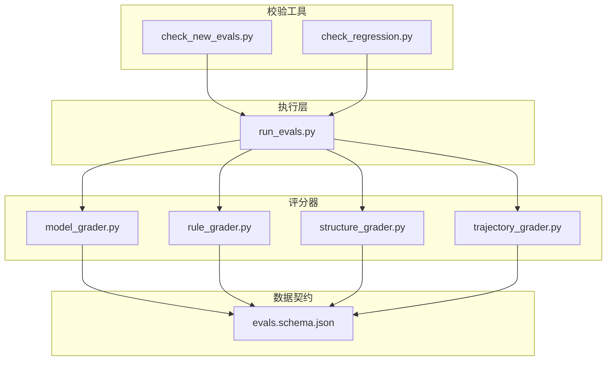
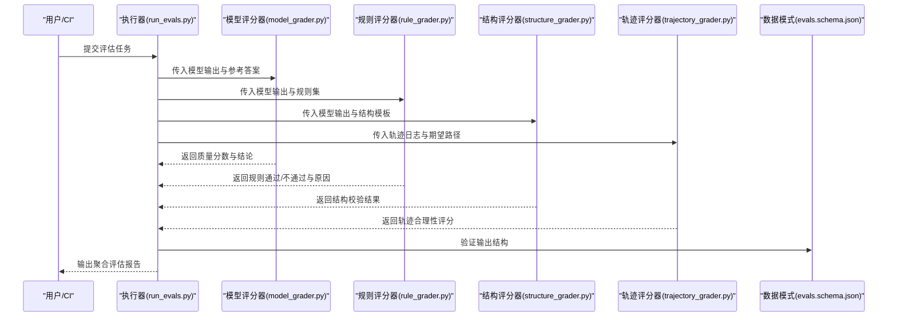
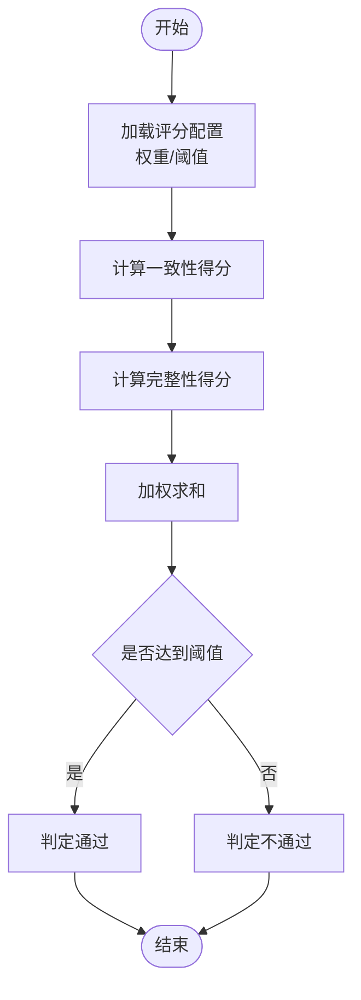
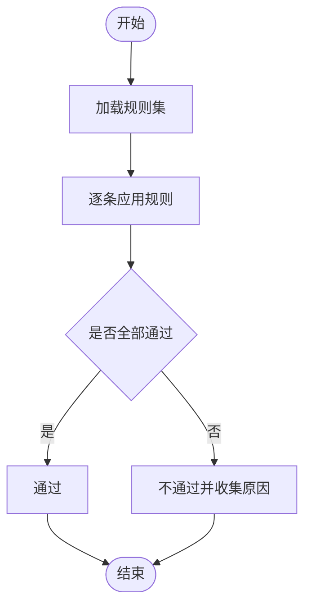
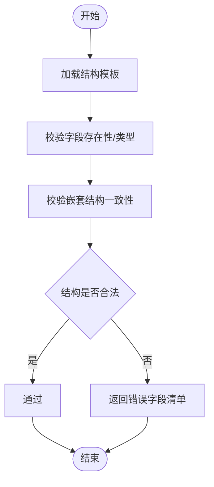
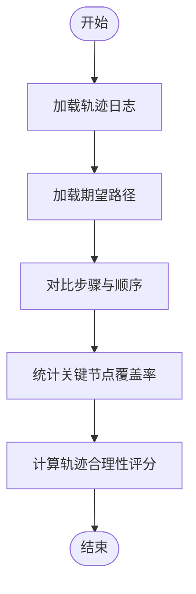
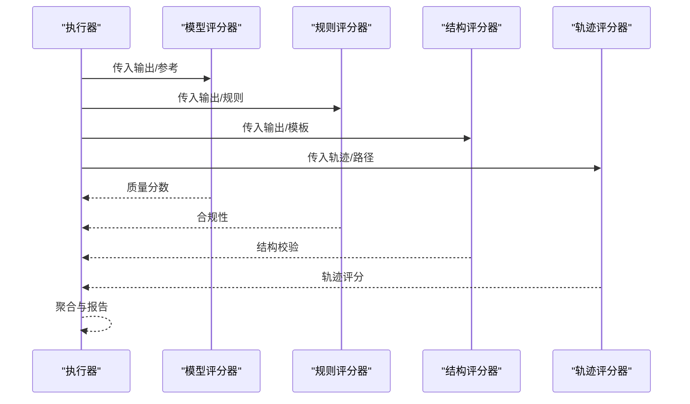
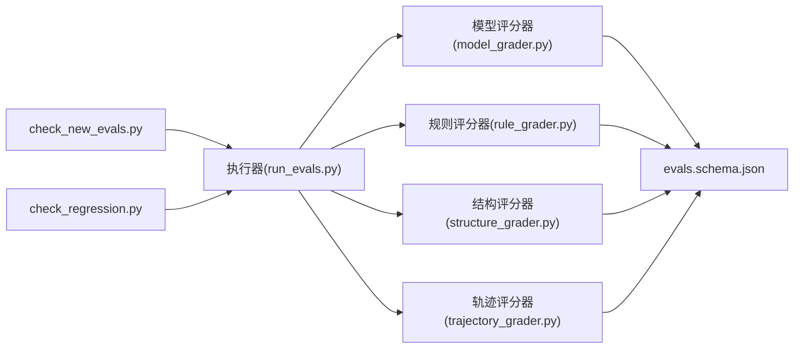

# 模型评估

<cite>
**本文引用的文件**
- [model_grader.py](file://plugins/frontend-team-toolkit/skill-engineering/scripts/graders/model_grader.py)
- [rule_grader.py](file://plugins/frontend-team-toolkit/skill-engineering/scripts/graders/rule_grader.py)
- [structure_grader.py](file://plugins/frontend-team-toolkit/skill-engineering/scripts/graders/structure_grader.py)
- [trajectory_grader.py](file://plugins/frontend-team-toolkit/skill-engineering/scripts/graders/trajectory_grader.py)
- [run_evals.py](file://plugins/frontend-team-toolkit/skill-engineering/scripts/run_evals.py)
- [check_new_evals.py](file://plugins/frontend-team-toolkit/skill-engineering/scripts/check_new_evals.py)
- [check_regression.py](file://plugins/frontend-team-toolkit/skill-engineering/scripts/check_regression.py)
- [evals.schema.json](file://plugins/frontend-team-toolkit/skill-engineering/schemas/evals.schema.json)
</cite>

## 目录
1. [简介](#简介)
2. [项目结构](#项目结构)
3. [核心组件](#核心组件)
4. [架构总览](#架构总览)
5. [详细组件分析](#详细组件分析)
6. [依赖关系分析](#依赖关系分析)
7. [性能考量](#性能考量)
8. [故障排查指南](#故障排查指南)
9. [结论](#结论)
10. [附录](#附录)

## 简介
本技术文档聚焦于“模型评估”模块，系统阐述评估器在技能工程场景下的工作原理与实现方式，涵盖模型输出质量判断、准确性评估与性能指标计算；明确评估器的配置参数、评分标准与阈值设置；给出面向不同技能类型的使用示例与最佳实践，并解释与规则、结构、轨迹等其他评估维度的协同机制与数据流转过程。

## 项目结构
评估体系由“执行器 + 多维评分器 + 校验工具 + 数据模式”构成：
- 执行器：负责调度与汇总各维度评分
- 评分器：分别对模型输出进行质量、规则、结构、轨迹层面的打分
- 校验工具：用于新评估项检查与回归检测
- 数据模式：定义评估输入/输出的数据契约

图表来源
- [run_evals.py](file://plugins/frontend-team-toolkit/skill-engineering/scripts/run_evals.py)
- [model_grader.py](file://plugins/frontend-team-toolkit/skill-engineering/scripts/graders/model_grader.py)
- [rule_grader.py](file://plugins/frontend-team-toolkit/skill-engineering/scripts/graders/rule_grader.py)
- [structure_grader.py](file://plugins/frontend-team-toolkit/skill-engineering/scripts/graders/structure_grader.py)
- [trajectory_grader.py](file://plugins/frontend-team-toolkit/skill-engineering/scripts/graders/trajectory_grader.py)
- [check_new_evals.py](file://plugins/frontend-team-toolkit/skill-engineering/scripts/check_new_evals.py)
- [check_regression.py](file://plugins/frontend-team-toolkit/skill-engineering/scripts/check_regression.py)
- [evals.schema.json](file://plugins/frontend-team-toolkit/skill-engineering/schemas/evals.schema.json)

章节来源
- [run_evals.py](file://plugins/frontend-team-toolkit/skill-engineering/scripts/run_evals.py)
- [evals.schema.json](file://plugins/frontend-team-toolkit/skill-engineering/schemas/evals.schema.json)

## 核心组件
- 模型评分器（model_grader.py）：对模型输出质量进行综合判定，结合预设阈值与权重，输出质量分数与结论。
- 规则评分器（rule_grader.py）：基于预定义规则集对输出进行合规性检查，返回通过/不通过及原因。
- 结构评分器（structure_grader.py）：验证输出结构是否符合预期格式与字段要求。
- 轨迹评分器（trajectory_grader.py）：评估推理/执行轨迹的合理性与完整性。
- 执行器（run_evals.py）：统一调度上述评分器，聚合结果并生成最终报告。
- 校验工具：check_new_evals.py 与 check_regression.py 分别用于新增评估项的校验与回归检测。
- 数据模式（evals.schema.json）：定义评估输入/输出的结构化约束，确保各组件间数据一致性。

章节来源
- [model_grader.py](file://plugins/frontend-team-toolkit/skill-engineering/scripts/graders/model_grader.py)
- [rule_grader.py](file://plugins/frontend-team-toolkit/skill-engineering/scripts/graders/rule_grader.py)
- [structure_grader.py](file://plugins/frontend-team-toolkit/skill-engineering/scripts/graders/structure_grader.py)
- [trajectory_grader.py](file://plugins/frontend-team-toolkit/skill-engineering/scripts/graders/trajectory_grader.py)
- [run_evals.py](file://plugins/frontend-team-toolkit/skill-engineering/scripts/run_evals.py)
- [check_new_evals.py](file://plugins/frontend-team-toolkit/skill-engineering/scripts/check_new_evals.py)
- [check_regression.py](file://plugins/frontend-team-toolkit/skill-engineering/scripts/check_regression.py)
- [evals.schema.json](file://plugins/frontend-team-toolkit/skill-engineering/schemas/evals.schema.json)

## 架构总览
下图展示从执行器到各评分器再到数据契约的整体流程：

图表来源
- [run_evals.py](file://plugins/frontend-team-toolkit/skill-engineering/scripts/run_evals.py)
- [model_grader.py](file://plugins/frontend-team-toolkit/skill-engineering/scripts/graders/model_grader.py)
- [rule_grader.py](file://plugins/frontend-team-toolkit/skill-engineering/scripts/graders/rule_grader.py)
- [structure_grader.py](file://plugins/frontend-team-toolkit/skill-engineering/scripts/graders/structure_grader.py)
- [trajectory_grader.py](file://plugins/frontend-team-toolkit/skill-engineering/scripts/graders/trajectory_grader.py)
- [evals.schema.json](file://plugins/frontend-team-toolkit/skill-engineering/schemas/evals.schema.json)

## 详细组件分析

### 模型评分器（model_grader.py）
职责与流程
- 输入：模型输出、参考答案、评分权重、阈值配置
- 处理：对输出质量进行量化评估，结合多指标（如一致性、完整性、准确性）加权计算
- 输出：质量分数、是否达标、详细评分明细

图表来源
- [model_grader.py](file://plugins/frontend-team-toolkit/skill-engineering/scripts/graders/model_grader.py)

章节来源
- [model_grader.py](file://plugins/frontend-team-toolkit/skill-engineering/scripts/graders/model_grader.py)

### 规则评分器（rule_grader.py）
职责与流程
- 输入：模型输出、规则集合
- 处理：逐条规则匹配与校验，记录不合规项
- 输出：通过/不通过状态、不合规规则列表、改进建议

图表来源
- [rule_grader.py](file://plugins/frontend-team-toolkit/skill-engineering/scripts/graders/rule_grader.py)

章节来源
- [rule_grader.py](file://plugins/frontend-team-toolkit/skill-engineering/scripts/graders/rule_grader.py)

### 结构评分器（structure_grader.py）
职责与流程
- 输入：模型输出、结构模板
- 处理：字段存在性、类型、嵌套结构一致性校验
- 输出：结构校验结果与缺失/错误字段清单

图表来源
- [structure_grader.py](file://plugins/frontend-team-toolkit/skill-engineering/scripts/graders/structure_grader.py)

章节来源
- [structure_grader.py](file://plugins/frontend-team-toolkit/skill-engineering/scripts/graders/structure_grader.py)

### 轨迹评分器（trajectory_grader.py）
职责与流程
- 输入：轨迹日志、期望执行路径
- 处理：路径完整性、步骤顺序、关键节点覆盖度评估
- 输出：轨迹合理性评分与异常步骤定位

图表来源
- [trajectory_grader.py](file://plugins/frontend-team-toolkit/skill-engineering/scripts/graders/trajectory_grader.py)

章节来源
- [trajectory_grader.py](file://plugins/frontend-team-toolkit/skill-engineering/scripts/graders/trajectory_grader.py)

### 执行器（run_evals.py）
职责与流程
- 统一调度各评分器
- 聚合评分结果
- 生成最终报告并进行数据契约校验

图表来源
- [run_evals.py](file://plugins/frontend-team-toolkit/skill-engineering/scripts/run_evals.py)
- [model_grader.py](file://plugins/frontend-team-toolkit/skill-engineering/scripts/graders/model_grader.py)
- [rule_grader.py](file://plugins/frontend-team-toolkit/skill-engineering/scripts/graders/rule_grader.py)
- [structure_grader.py](file://plugins/frontend-team-toolkit/skill-engineering/scripts/graders/structure_grader.py)
- [trajectory_grader.py](file://plugins/frontend-team-toolkit/skill-engineering/scripts/graders/trajectory_grader.py)

章节来源
- [run_evals.py](file://plugins/frontend-team-toolkit/skill-engineering/scripts/run_evals.py)

### 数据契约（evals.schema.json）
作用
- 定义评估输入/输出的字段、类型、必填项与约束
- 确保各评分器与执行器之间的数据一致性
- 为校验工具提供结构化依据

章节来源
- [evals.schema.json](file://plugins/frontend-team-toolkit/skill-engineering/schemas/evals.schema.json)

## 依赖关系分析
- 执行器依赖四个评分器以完成多维评估
- 各评分器独立运行，但共享数据契约以保证输出格式一致
- 校验工具依赖执行器产出的报告进行新增评估项与回归检测

图表来源
- [run_evals.py](file://plugins/frontend-team-toolkit/skill-engineering/scripts/run_evals.py)
- [model_grader.py](file://plugins/frontend-team-toolkit/skill-engineering/scripts/graders/model_grader.py)
- [rule_grader.py](file://plugins/frontend-team-toolkit/skill-engineering/scripts/graders/rule_grader.py)
- [structure_grader.py](file://plugins/frontend-team-toolkit/skill-engineering/scripts/graders/structure_grader.py)
- [trajectory_grader.py](file://plugins/frontend-team-toolkit/skill-engineering/scripts/graders/trajectory_grader.py)
- [check_new_evals.py](file://plugins/frontend-team-toolkit/skill-engineering/scripts/check_new_evals.py)
- [check_regression.py](file://plugins/frontend-team-toolkit/skill-engineering/scripts/check_regression.py)
- [evals.schema.json](file://plugins/frontend-team-toolkit/skill-engineering/schemas/evals.schema.json)

章节来源
- [run_evals.py](file://plugins/frontend-team-toolkit/skill-engineering/scripts/run_evals.py)
- [check_new_evals.py](file://plugins/frontend-team-toolkit/skill-engineering/scripts/check_new_evals.py)
- [check_regression.py](file://plugins/frontend-team-toolkit/skill-engineering/scripts/check_regression.py)
- [evals.schema.json](file://plugins/frontend-team-toolkit/skill-engineering/schemas/evals.schema.json)

## 性能考量
- 并行化：在可扩展的前提下，建议对独立评分器进行并发执行以缩短总耗时
- 缓存策略：对重复使用的规则集、结构模板与参考答案进行缓存，减少IO开销
- 批处理：对批量评估任务采用批处理模式，降低启动与初始化成本
- 资源限制：为长耗时轨迹评分设置超时与资源上限，避免阻塞整体流程

## 故障排查指南
- 数据不合法
  - 现象：执行器报错或评分器返回空结果
  - 排查：对照数据契约核对字段、类型与必填项
  - 参考：[evals.schema.json](file://plugins/frontend-team-toolkit/skill-engineering/schemas/evals.schema.json)
- 规则不匹配
  - 现象：规则评分器频繁返回不通过
  - 排查：确认规则集版本与输出格式，必要时更新规则
  - 参考：[rule_grader.py](file://plugins/frontend-team-toolkit/skill-engineering/scripts/graders/rule_grader.py)
- 结构不符
  - 现象：结构评分器提示缺失字段或类型错误
  - 排查：比对结构模板，修正输出结构
  - 参考：[structure_grader.py](file://plugins/frontend-team-toolkit/skill-engineering/scripts/graders/structure_grader.py)
- 轨迹异常
  - 现象：轨迹评分器给出低分或异常步骤定位
  - 排查：检查轨迹日志完整性与期望路径一致性
  - 参考：[trajectory_grader.py](file://plugins/frontend-team-toolkit/skill-engineering/scripts/graders/trajectory_grader.py)
- 新增评估项问题
  - 使用：[check_new_evals.py](file://plugins/frontend-team-toolkit/skill-engineering/scripts/check_new_evals.py) 进行预检
- 回归检测
  - 使用：[check_regression.py](file://plugins/frontend-team-toolkit/skill-engineering/scripts/check_regression.py) 对比历史结果

章节来源
- [evals.schema.json](file://plugins/frontend-team-toolkit/skill-engineering/schemas/evals.schema.json)
- [rule_grader.py](file://plugins/frontend-team-toolkit/skill-engineering/scripts/graders/rule_grader.py)
- [structure_grader.py](file://plugins/frontend-team-toolkit/skill-engineering/scripts/graders/structure_grader.py)
- [trajectory_grader.py](file://plugins/frontend-team-toolkit/skill-engineering/scripts/graders/trajectory_grader.py)
- [check_new_evals.py](file://plugins/frontend-team-toolkit/skill-engineering/scripts/check_new_evals.py)
- [check_regression.py](file://plugins/frontend-team-toolkit/skill-engineering/scripts/check_regression.py)

## 结论
该评估体系通过“执行器 + 多维评分器 + 校验工具 + 数据契约”的组合，实现了对模型输出在质量、规则、结构与轨迹四个维度的全面评估。执行器负责编排与聚合，评分器各自承担专业领域的判定逻辑，数据契约保障了跨组件的一致性。配合校验工具，可在开发与CI阶段持续发现与回归问题，提升技能交付质量与稳定性。

## 附录

### 配置参数与评分标准（概要）
- 模型评分器
  - 权重：一致性、完整性、准确性等指标权重
  - 阈值：综合得分阈值，决定是否通过
  - 参考：[model_grader.py](file://plugins/frontend-team-toolkit/skill-engineering/scripts/graders/model_grader.py)
- 规则评分器
  - 规则集：合规性规则清单
  - 结果：通过/不通过与原因
  - 参考：[rule_grader.py](file://plugins/frontend-team-toolkit/skill-engineering/scripts/graders/rule_grader.py)
- 结构评分器
  - 结构模板：字段、类型、嵌套结构约束
  - 结果：结构合法性与缺失字段清单
  - 参考：[structure_grader.py](file://plugins/frontend-team-toolkit/skill-engineering/scripts/graders/structure_grader.py)
- 轨迹评分器
  - 期望路径：关键步骤与顺序
  - 结果：合理性评分与异常定位
  - 参考：[trajectory_grader.py](file://plugins/frontend-team-toolkit/skill-engineering/scripts/graders/trajectory_grader.py)
- 数据契约
  - 字段与类型：统一输出格式
  - 参考：[evals.schema.json](file://plugins/frontend-team-toolkit/skill-engineering/schemas/evals.schema.json)

### 使用示例与最佳实践
- 示例A：通用技能评估
  - 步骤：准备输出与参考，运行执行器，查看聚合报告
  - 参考：[run_evals.py](file://plugins/frontend-team-toolkit/skill-engineering/scripts/run_evals.py)
- 示例B：规则驱动的合规评估
  - 步骤：配置规则集，运行规则评分器，修复不合规项
  - 参考：[rule_grader.py](file://plugins/frontend-team-toolkit/skill-engineering/scripts/graders/rule_grader.py)
- 示例C：结构化输出校验
  - 步骤：定义结构模板，运行结构评分器，修正字段与类型
  - 参考：[structure_grader.py](file://plugins/frontend-team-toolkit/skill-engineering/scripts/graders/structure_grader.py)
- 示例D：轨迹合理性评估
  - 步骤：准备轨迹日志与期望路径，运行轨迹评分器，优化执行步骤
  - 参考：[trajectory_grader.py](file://plugins/frontend-team-toolkit/skill-engineering/scripts/graders/trajectory_grader.py)
- 最佳实践
  - 在CI中集成校验工具，确保新增评估项与回归稳定性
  - 参考：[check_new_evals.py](file://plugins/frontend-team-toolkit/skill-engineering/scripts/check_new_evals.py), [check_regression.py](file://plugins/frontend-team-toolkit/skill-engineering/scripts/check_regression.py)

章节来源
- [run_evals.py](file://plugins/frontend-team-toolkit/skill-engineering/scripts/run_evals.py)
- [model_grader.py](file://plugins/frontend-team-toolkit/skill-engineering/scripts/graders/model_grader.py)
- [rule_grader.py](file://plugins/frontend-team-toolkit/skill-engineering/scripts/graders/rule_grader.py)
- [structure_grader.py](file://plugins/frontend-team-toolkit/skill-engineering/scripts/graders/structure_grader.py)
- [trajectory_grader.py](file://plugins/frontend-team-toolkit/skill-engineering/scripts/graders/trajectory_grader.py)
- [check_new_evals.py](file://plugins/frontend-team-toolkit/skill-engineering/scripts/check_new_evals.py)
- [check_regression.py](file://plugins/frontend-team-toolkit/skill-engineering/scripts/check_regression.py)
- [evals.schema.json](file://plugins/frontend-team-toolkit/skill-engineering/schemas/evals.schema.json)