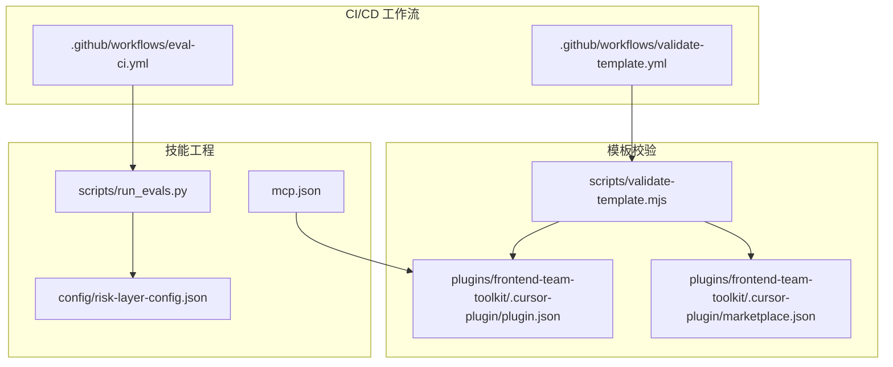
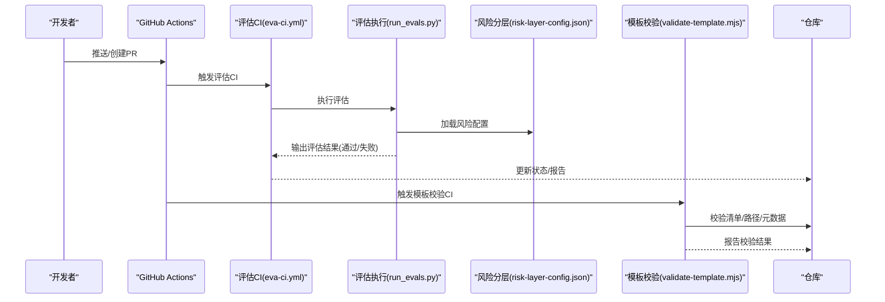
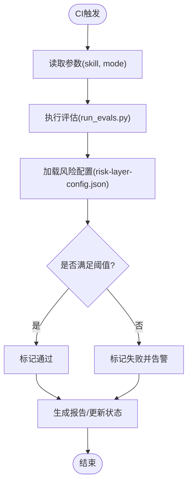
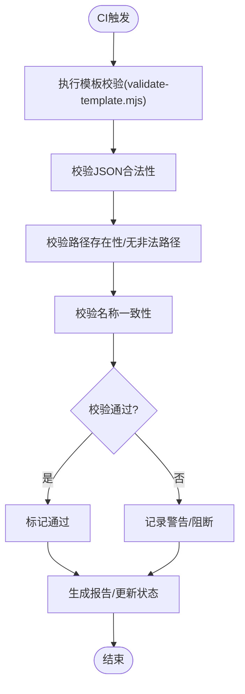
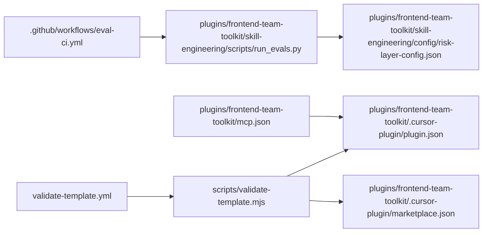

# 监控告警

<cite>
**本文档引用的文件**
- [CURSOR_TEAM_MARKETPLACE_PLUGIN_HANDBOOK.md](file://CURSOR_TEAM_MARKETPLACE_PLUGIN_HANDBOOK.md)
- [WECHAT_TEAM_MARKETPLACE_PLUGIN_GUIDE.md](file://WECHAT_TEAM_MARKETPLACE_PLUGIN_GUIDE.md)
- [README.md](file://README.md)
- [validate-template.mjs](file://scripts/validate-template.mjs)
- [eval-ci.yml](file://.github/workflows/eval-ci.yml)
- [validate-template.yml](file://.github/workflows/validate-template.yml)
- [run_evals.py](file://plugins/frontend-team-toolkit/skill-engineering/scripts/run_evals.py)
- [risk-layer-config.json](file://plugins/frontend-team-toolkit/skill-engineering/config/risk-layer-config.json)
- [mcp.json](file://plugins/frontend-team-toolkit/mcp.json)
- [plugin.json](file://plugins/frontend-team-toolkit/.cursor-plugin/plugin.json)
- [marketplace.json](file://plugins/frontend-team-toolkit/.cursor-plugin/marketplace.json)
</cite>

## 目录
1. [简介](#简介)
2. [项目结构](#项目结构)
3. [核心组件](#核心组件)
4. [架构总览](#架构总览)
5. [详细组件分析](#详细组件分析)
6. [依赖关系分析](#依赖关系分析)
7. [性能考虑](#性能考虑)
8. [故障排除指南](#故障排除指南)
9. [结论](#结论)
10. [附录](#附录)

## 简介
本项目是一个前端团队市场化的插件与技能工程体系，围绕“监控告警”目标，重点通过以下方式实现质量保障与风险控制：
- 数据采集：基于技能评估与CI流水线收集执行结果与元数据
- 实时分析：通过风险分层配置与评估脚本进行门禁判定
- 告警触发：在CI中失败或风险阈值越界时触发告警与阻断
- 可视化与历史：通过评估产物与报告文件沉淀历史趋势与对比

本技术文档聚焦于如何将该体系作为监控告警系统使用：如何定义监控指标、配置阈值与告警级别，如何在CI/CD中集成自动化监控配置，以及如何利用现有产物进行可视化与历史趋势分析。

## 项目结构
该项目采用“插件+技能工程”的组织方式，核心与监控告警相关的关键位置如下：
- CI/CD工作流：位于 .github/workflows，包含评估CI与模板校验CI
- 风险分层配置：位于 plugins/frontend-team-toolkit/skill-engineering/config，用于定义风险等级与门禁策略
- 评估执行脚本：位于 plugins/frontend-team-toolkit/skill-engineering/scripts，负责加载配置并执行评估
- 模板校验脚本：位于 scripts/validate-template.mjs，用于校验清单、路径与元数据一致性
- 插件清单与市场清单：位于 plugins/frontend-team-toolkit/.cursor-plugin，用于描述插件与市场元数据

图表来源
- [.github/workflows/eval-ci.yml](file://.github/workflows/eval-ci.yml)
- [.github/workflows/validate-template.yml](file://.github/workflows/validate-template.yml)
- [run_evals.py](file://plugins/frontend-team-toolkit/skill-engineering/scripts/run_evals.py)
- [risk-layer-config.json](file://plugins/frontend-team-toolkit/skill-engineering/config/risk-layer-config.json)
- [validate-template.mjs](file://scripts/validate-template.mjs)
- [mcp.json](file://plugins/frontend-team-toolkit/mcp.json)
- [plugin.json](file://plugins/frontend-team-toolkit/.cursor-plugin/plugin.json)
- [marketplace.json](file://plugins/frontend-team-toolkit/.cursor-plugin/marketplace.json)

章节来源
- [README.md:179-202](file://README.md#L179-L202)
- [CURSOR_TEAM_MARKETPLACE_PLUGIN_HANDBOOK.md:55-73](file://CURSOR_TEAM_MARKETPLACE_PLUGIN_HANDBOOK.md#L55-L73)
- [WECHAT_TEAM_MARKETPLACE_PLUGIN_GUIDE.md:64-144](file://WECHAT_TEAM_MARKETPLACE_PLUGIN_GUIDE.md#L64-L144)

## 核心组件
- CI/CD工作流
  - 评估CI：在PR、发布与定期回归场景触发技能评估，产出评估结果与报告，作为监控数据源
  - 模板校验CI：在提交前校验清单、路径与元数据一致性，防止不合规变更进入主干
- 风险分层配置
  - 定义风险等级与门禁阈值，驱动评估脚本的门禁判定逻辑
- 评估执行脚本
  - 加载风险分层配置，执行评估流程，输出评估结果与状态
- 模板校验脚本
  - 校验marketplace.json与plugin.json的合法性、命名一致性、路径存在性等
- 插件与市场清单
  - 描述插件与市场的元数据，作为监控与可视化展示的基础

章节来源
- [plugins/frontend-team-toolkit/skill-engineering/README.md:136-191](file://plugins/frontend-team-toolkit/skill-engineering/README.md#L136-L191)
- [plugins/frontend-team-toolkit/skill-engineering/README.md:203-210](file://plugins/frontend-team-toolkit/skill-engineering/README.md#L203-L210)
- [plugins/frontend-team-toolkit/skill-engineering/scripts/run_evals.py:137](file://plugins/frontend-team-toolkit/skill-engineering/scripts/run_evals.py#L137)
- [CURSOR_TEAM_MARKETPLACE_PLUGIN_HANDBOOK.md:141](file://CURSOR_TEAM_MARKETPLACE_PLUGIN_HANDBOOK.md#L141)
- [WECHAT_TEAM_MARKETPLACE_PLUGIN_GUIDE.md:144](file://WECHAT_TEAM_MARKETPLACE_PLUGIN_GUIDE.md#L144)

## 架构总览
下图展示了从CI触发到监控告警的端到端流程：

图表来源
- [.github/workflows/eval-ci.yml](file://.github/workflows/eval-ci.yml)
- [plugins/frontend-team-toolkit/skill-engineering/scripts/run_evals.py](file://plugins/frontend-team-toolkit/skill-engineering/scripts/run_evals.py)
- [plugins/frontend-team-toolkit/skill-engineering/config/risk-layer-config.json](file://plugins/frontend-team-toolkit/skill-engineering/config/risk-layer-config.json)
- [.github/workflows/validate-template.yml](file://.github/workflows/validate-template.yml)
- [scripts/validate-template.mjs](file://scripts/validate-template.mjs)

## 详细组件分析

### 组件A：评估CI与评估执行
- 作用
  - 在PR、发布与定期回归场景触发技能评估，收集执行结果作为监控指标
  - 评估脚本加载风险分层配置，根据阈值判定是否阻断或告警
- 关键流程
  - CI工作流读取参数（如技能名、模式），调用评估执行脚本
  - 评估执行脚本定位风险配置文件并执行评估
  - 输出评估结果，供CI状态与报告使用

图表来源
- [.github/workflows/eval-ci.yml](file://.github/workflows/eval-ci.yml)
- [plugins/frontend-team-toolkit/skill-engineering/scripts/run_evals.py](file://plugins/frontend-team-toolkit/skill-engineering/scripts/run_evals.py)
- [plugins/frontend-team-toolkit/skill-engineering/config/risk-layer-config.json](file://plugins/frontend-team-toolkit/skill-engineering/config/risk-layer-config.json)

章节来源
- [plugins/frontend-team-toolkit/skill-engineering/README.md:136-191](file://plugins/frontend-team-toolkit/skill-engineering/README.md#L136-L191)
- [plugins/frontend-team-toolkit/skill-engineering/README.md:203-210](file://plugins/frontend-team-toolkit/skill-engineering/README.md#L203-L210)
- [plugins/frontend-team-toolkit/skill-engineering/scripts/run_evals.py:137](file://plugins/frontend-team-toolkit/skill-engineering/scripts/run_evals.py#L137)

### 组件B：模板校验CI与清单一致性
- 作用
  - 在提交前校验marketplace.json与plugin.json的合法性、命名一致性、路径存在性等
  - 将校验结果作为监控数据，发现潜在配置风险
- 关键流程
  - CI触发模板校验脚本
  - 脚本校验JSON合法性、路径存在性、命名一致性等
  - 输出校验结果，供CI状态与报告使用

图表来源
- [.github/workflows/validate-template.yml](file://.github/workflows/validate-template.yml)
- [scripts/validate-template.mjs](file://scripts/validate-template.mjs)
- [plugin.json](file://plugins/frontend-team-toolkit/.cursor-plugin/plugin.json)
- [marketplace.json](file://plugins/frontend-team-toolkit/.cursor-plugin/marketplace.json)

章节来源
- [CURSOR_TEAM_MARKETPLACE_PLUGIN_HANDBOOK.md:141](file://CURSOR_TEAM_MARKETPLACE_PLUGIN_HANDBOOK.md#L141)
- [WECHAT_TEAM_MARKETPLACE_PLUGIN_GUIDE.md:144](file://WECHAT_TEAM_MARKETPLACE_PLUGIN_GUIDE.md#L144)

### 组件C：风险分层配置与阈值
- 作用
  - 定义风险等级与门禁阈值，作为评估脚本的决策依据
  - 通过配置文件集中管理阈值，便于统一治理与审计
- 关键点
  - 配置文件路径与加载逻辑由评估执行脚本维护
  - 阈值变化直接影响告警级别与阻断策略

章节来源
- [plugins/frontend-team-toolkit/skill-engineering/scripts/run_evals.py:137](file://plugins/frontend-team-toolkit/skill-engineering/scripts/run_evals.py#L137)
- [plugins/frontend-team-toolkit/skill-engineering/README.md:203](file://plugins/frontend-team-toolkit/skill-engineering/README.md#L203)

## 依赖关系分析
- CI工作流依赖评估执行脚本与风险分层配置
- 模板校验CI依赖模板校验脚本与插件/市场清单
- 评估执行脚本依赖风险分层配置文件
- 插件与市场清单影响模板校验的路径与元数据一致性

图表来源
- [.github/workflows/eval-ci.yml](file://.github/workflows/eval-ci.yml)
- [plugins/frontend-team-toolkit/skill-engineering/scripts/run_evals.py](file://plugins/frontend-team-toolkit/skill-engineering/scripts/run_evals.py)
- [plugins/frontend-team-toolkit/skill-engineering/config/risk-layer-config.json](file://plugins/frontend-team-toolkit/skill-engineering/config/risk-layer-config.json)
- [.github/workflows/validate-template.yml](file://.github/workflows/validate-template.yml)
- [scripts/validate-template.mjs](file://scripts/validate-template.mjs)
- [mcp.json](file://plugins/frontend-team-toolkit/mcp.json)
- [plugin.json](file://plugins/frontend-team-toolkit/.cursor-plugin/plugin.json)
- [marketplace.json](file://plugins/frontend-team-toolkit/.cursor-plugin/marketplace.json)

章节来源
- [plugins/frontend-team-toolkit/skill-engineering/README.md:136-191](file://plugins/frontend-team-toolkit/skill-engineering/README.md#L136-L191)
- [plugins/frontend-team-toolkit/skill-engineering/scripts/run_evals.py:137](file://plugins/frontend-team-toolkit/skill-engineering/scripts/run_evals.py#L137)
- [CURSOR_TEAM_MARKETPLACE_PLUGIN_HANDBOOK.md:141](file://CURSOR_TEAM_MARKETPLACE_PLUGIN_HANDBOOK.md#L141)

## 性能考虑
- 评估CI的执行时间受评估任务复杂度与测试集规模影响，建议：
  - 对高开销评估任务启用缓存与增量执行
  - 合理拆分评估任务，避免单次CI过长
- 模板校验的性能主要取决于清单数量与路径扫描范围，建议：
  - 仅对变更路径进行校验，减少全量扫描
  - 使用并行校验多个清单文件
- 风险分层配置的加载与解析成本较低，但建议：
  - 将配置文件保持精简，避免冗余字段
  - 在CI中复用已加载的配置，减少重复IO

## 故障排除指南
- CI评估失败
  - 检查评估CI日志，确认评估执行脚本是否正确加载风险配置
  - 确认评估产物与报告是否生成，以便后续可视化与历史分析
- 模板校验失败
  - 检查清单JSON合法性、路径存在性与命名一致性
  - 确认插件与市场清单的source路径与实际文件一致
- 阈值误判
  - 检查风险分层配置文件是否被正确加载
  - 对比不同分支的配置差异，确保阈值设置符合预期

章节来源
- [plugins/frontend-team-toolkit/skill-engineering/README.md:136-191](file://plugins/frontend-team-toolkit/skill-engineering/README.md#L136-L191)
- [plugins/frontend-team-toolkit/skill-engineering/scripts/run_evals.py:137](file://plugins/frontend-team-toolkit/skill-engineering/scripts/run_evals.py#L137)
- [CURSOR_TEAM_MARKETPLACE_PLUGIN_HANDBOOK.md:141](file://CURSOR_TEAM_MARKETPLACE_PLUGIN_HANDBOOK.md#L141)
- [WECHAT_TEAM_MARKETPLACE_PLUGIN_GUIDE.md:144](file://WECHAT_TEAM_MARKETPLACE_PLUGIN_GUIDE.md#L144)

## 结论
本项目通过“评估CI + 模板校验CI + 风险分层配置”的组合，实现了面向技能工程的质量监控与告警体系。评估CI产出的评估结果与报告可作为监控指标与历史趋势数据，模板校验CI确保清单与路径的合规性，风险分层配置提供统一的阈值与门禁策略。通过合理配置阈值与告警级别，结合CI/CD自动化，可有效提升交付质量与风险控制能力。

## 附录
- 监控指标定义建议
  - 评估通过率：评估通过数/总执行数
  - 失败任务数：评估失败的任务数量
  - 模板校验失败率：模板校验失败次数/总校验次数
  - 阈值命中率：超过阈值的评估次数/总评估次数
- 阈值配置与告警级别
  - 高风险：评估失败或阈值越界立即阻断
  - 中风险：记录警告并要求人工复核
  - 低风险：仅记录，不阻断
- 可视化与历史趋势
  - 利用评估报告与CI日志构建看板，展示趋势与对比
  - 建议按技能、日期、分支维度聚合数据，支持钻取分析