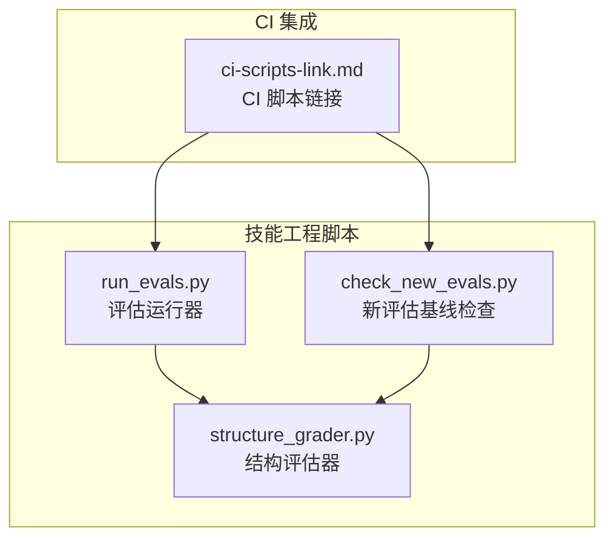
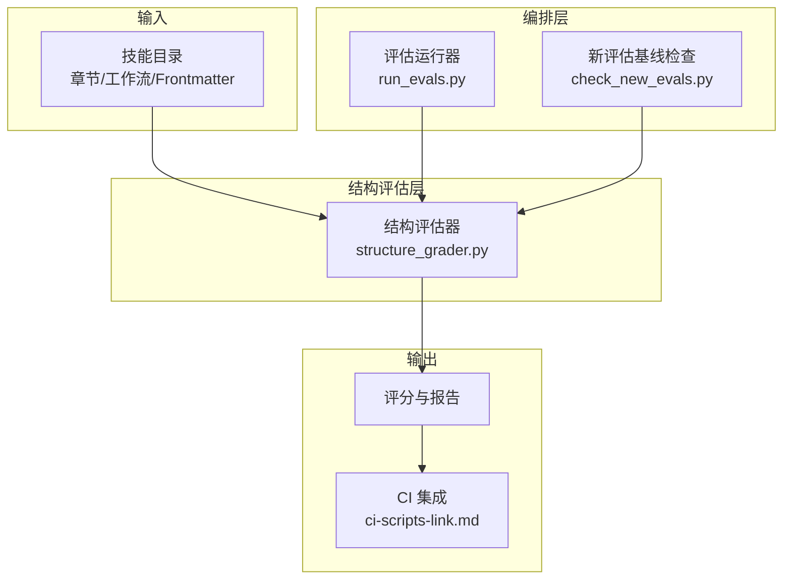
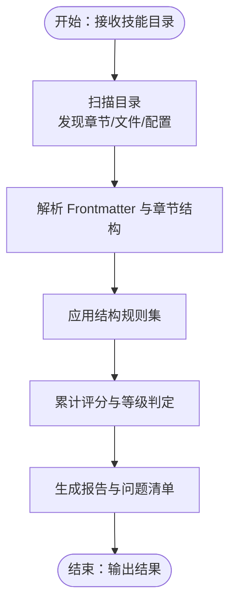
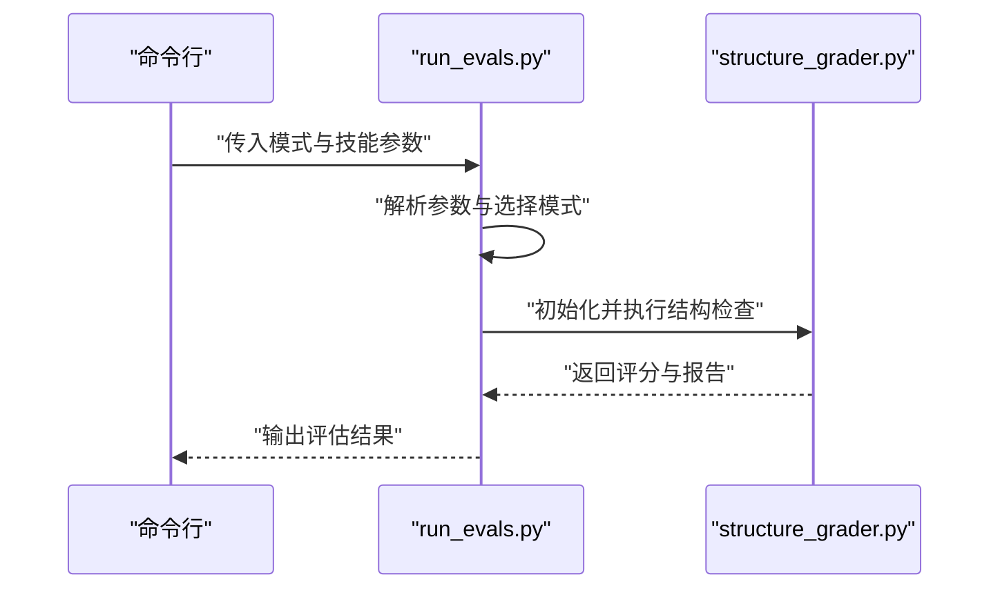
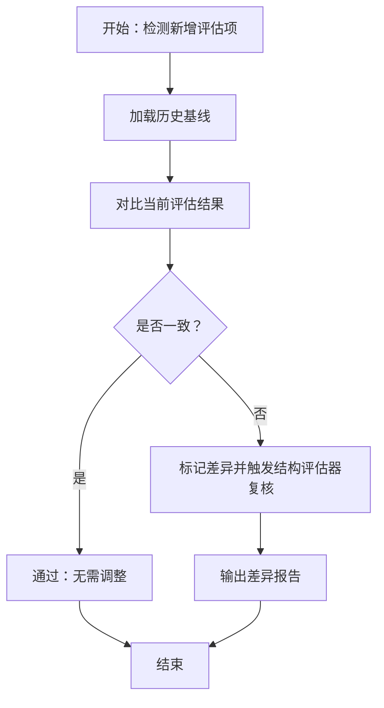
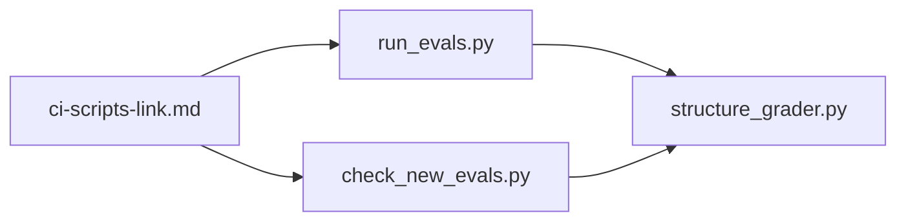

# 结构评估

<cite>
**本文引用的文件**
- [structure_grader.py](file://plugins/frontend-team-toolkit/skill-engineering/scripts/graders/structure_grader.py)
- [README.md](file://plugins/frontend-team-toolkit/skill-engineering/README.md)
- [run_evals.py](file://plugins/frontend-team-toolkit/skill-engineering/scripts/run_evals.py)
- [check_new_evals.py](file://plugins/frontend-team-toolkit/skill-engineering/scripts/check_new_evals.py)
- [ci-scripts-link.md](file://plugins/frontend-team-toolkit/skills/wechat-article-review/ci-scripts-link.md)
</cite>

## 目录
1. [引言](#引言)
2. [项目结构](#项目结构)
3. [核心组件](#核心组件)
4. [架构总览](#架构总览)
5. [详细组件分析](#详细组件分析)
6. [依赖关系分析](#依赖关系分析)
7. [性能考量](#性能考量)
8. [故障排查指南](#故障排查指南)
9. [结论](#结论)
10. [附录](#附录)

## 引言
本技术文档围绕“结构评估”模块展开，系统阐述其核心理念、技术实现与工程实践。结构评估旨在对技能（Skill）的目录结构、章节组织、Frontmatter 元数据以及工作流配置进行自动化校验，确保技能交付物在结构层面满足统一规范与质量标准。该模块通过规则驱动的检查器，结合评分与报告机制，为技能开发过程提供可量化的质量反馈，并指导后续重构与优化。

## 项目结构
结构评估位于技能工程脚本子模块中，主要由以下部分组成：
- 结构评估器：负责解析技能目录、章节与元数据，执行结构规则校验并生成评分与报告。
- 脚本入口：提供命令行接口，支持按模式运行（如 PR、Release、Scheduled），并与 CI 集成。
- 文档与规范：包含 README 中关于结构评估职责的说明，以及 CI 使用链接文档。

**图表来源**
- [structure_grader.py](file://plugins/frontend-team-toolkit/skill-engineering/scripts/graders/structure_grader.py)
- [run_evals.py](file://plugins/frontend-team-toolkit/skill-engineering/scripts/run_evals.py)
- [check_new_evals.py](file://plugins/frontend-team-toolkit/skill-engineering/scripts/check_new_evals.py)
- [ci-scripts-link.md](file://plugins/frontend-team-toolkit/skills/wechat-article-review/ci-scripts-link.md)

**章节来源**
- [README.md](file://plugins/frontend-team-toolkit/skill-engineering/README.md)
- [ci-scripts-link.md](file://plugins/frontend-team-toolkit/skills/wechat-article-review/ci-scripts-link.md)

## 核心组件
- 结构评估器（structure_grader.py）
  - 职责：解析技能目录结构、章节层级、Frontmatter 字段与工作流配置；执行结构规则校验；输出评分与问题清单。
  - 关键能力：目录扫描、文件存在性与命名规范检查、Frontmatter 合法性与完整性校验、章节顺序与嵌套一致性检查、工作流模板一致性检查。
- 评估运行器（run_evals.py）
  - 职责：按模式调度评估任务，支持 PR、Release、Scheduled 等场景；调用结构评估器并汇总结果。
- 新评估基线检查（check_new_evals.py）
  - 职责：对新增评估项进行基线对比与合规性检查，辅助结构评估器识别潜在问题。
- CI 集成文档（ci-scripts-link.md）
  - 职责：提供 CI 中调用上述脚本的参考路径与命令示例，便于自动化流水线集成。

**章节来源**
- [structure_grader.py](file://plugins/frontend-team-toolkit/skill-engineering/scripts/graders/structure_grader.py)
- [run_evals.py](file://plugins/frontend-team-toolkit/skill-engineering/scripts/run_evals.py)
- [check_new_evals.py](file://plugins/frontend-team-toolkit/skill-engineering/scripts/check_new_evals.py)
- [README.md](file://plugins/frontend-team-toolkit/skill-engineering/README.md)

## 架构总览
结构评估模块采用“评估器 + 运行器 + 检查器”的分层架构：
- 评估器层：专注于结构规则与质量指标计算。
- 运行器层：负责任务编排、模式选择与结果聚合。
- 检查器层：对新增评估项进行基线校验，保障历史变更的稳定性。
- 集成层：通过 CI 文档与脚本入口，将评估流程嵌入到持续交付管线。

**图表来源**
- [structure_grader.py](file://plugins/frontend-team-toolkit/skill-engineering/scripts/graders/structure_grader.py)
- [run_evals.py](file://plugins/frontend-team-toolkit/skill-engineering/scripts/run_evals.py)
- [check_new_evals.py](file://plugins/frontend-team-toolkit/skill-engineering/scripts/check_new_evals.py)
- [ci-scripts-link.md](file://plugins/frontend-team-toolkit/skills/wechat-article-review/ci-scripts-link.md)

## 详细组件分析

### 结构评估器（structure_grader.py）
- 功能定位
  - 对技能目录进行结构化扫描，提取章节、Frontmatter 与工作流信息。
  - 基于预定义规则集执行校验，输出结构质量评分与问题明细。
- 核心算法与流程
  - 目录遍历与文件发现：递归扫描技能根目录，识别章节文件与配置文件。
  - 规则匹配与评分：对每个规则应用权重与阈值，累计得分并生成等级。
  - 报告生成：汇总通过/失败项，标注具体文件与问题类型，便于修复。
- 质量指标与评分标准（示意）
  - 完整性：Frontmatter 字段齐全度、必要文件存在性。
  - 一致性：章节命名规范、层级嵌套规则、工作流模板一致性。
  - 可维护性：文件组织清晰度、命名语义化程度。
  - 评分方式：按规则加权计分，设定及格线与优秀线，输出等级与改进建议。
- 设计模式验证
  - 规则驱动：通过规则集扩展与替换，降低硬编码耦合。
  - 统一报告：标准化输出格式，便于上层编排与 CI 展示。
  - 可插拔扩展：支持新增规则与检查点，保持评估器内聚与稳定。

**图表来源**
- [structure_grader.py](file://plugins/frontend-team-toolkit/skill-engineering/scripts/graders/structure_grader.py)

**章节来源**
- [structure_grader.py](file://plugins/frontend-team-toolkit/skill-engineering/scripts/graders/structure_grader.py)

### 评估运行器（run_evals.py）
- 功能定位
  - 提供多模式运行能力，支持 PR、Release、Scheduled 等场景。
  - 调用结构评估器并整合结果，形成统一的评估报告。
- 工作流序列
  - 解析命令行参数，确定运行模式与目标技能。
  - 初始化评估器，执行结构检查。
  - 汇总结果并输出至控制台或文件，供 CI 或人工审阅。

**图表来源**
- [run_evals.py](file://plugins/frontend-team-toolkit/skill-engineering/scripts/run_evals.py)
- [structure_grader.py](file://plugins/frontend-team-toolkit/skill-engineering/scripts/graders/structure_grader.py)

**章节来源**
- [run_evals.py](file://plugins/frontend-team-toolkit/skill-engineering/scripts/run_evals.py)
- [README.md](file://plugins/frontend-team-toolkit/skill-engineering/README.md)

### 新评估基线检查（check_new_evals.py）
- 功能定位
  - 对新增评估项进行基线对比，确保与历史版本的一致性与稳定性。
  - 辅助结构评估器识别潜在回归与异常。
- 集成关系
  - 在评估运行前或后执行，作为前置/后置检查的一部分。

**图表来源**
- [check_new_evals.py](file://plugins/frontend-team-toolkit/skill-engineering/scripts/check_new_evals.py)
- [structure_grader.py](file://plugins/frontend-team-toolkit/skill-engineering/scripts/graders/structure_grader.py)

**章节来源**
- [check_new_evals.py](file://plugins/frontend-team-toolkit/skill-engineering/scripts/check_new_evals.py)
- [README.md](file://plugins/frontend-team-toolkit/skill-engineering/README.md)

### CI 集成（ci-scripts-link.md）
- 功能定位
  - 提供 CI 中调用评估脚本的参考路径与命令示例，便于自动化流水线集成。
- 实践要点
  - 将 run_evals.py 与 check_new_evals.py 纳入流水线阶段，确保每次提交/发布均执行结构评估。
  - 将评估报告与评分纳入质量门禁，阻断不合规变更进入下一阶段。

**章节来源**
- [ci-scripts-link.md](file://plugins/frontend-team-toolkit/skills/wechat-article-review/ci-scripts-link.md)

## 依赖关系分析
- 组件耦合
  - 评估运行器依赖结构评估器；新评估基线检查可独立运行，亦可前置/后置触发以增强稳定性。
  - CI 集成文档为外部依赖，用于指导自动化流程。
- 外部依赖
  - Python 运行时与第三方库（详见 README 的依赖声明）。
- 潜在风险
  - 规则集变更可能影响评分稳定性，需通过基线检查与版本管理控制。
  - 文件命名与路径约定若被绕过，可能导致评估器误判，需在规则集中强化约束。

**图表来源**
- [run_evals.py](file://plugins/frontend-team-toolkit/skill-engineering/scripts/run_evals.py)
- [structure_grader.py](file://plugins/frontend-team-toolkit/skill-engineering/scripts/graders/structure_grader.py)
- [check_new_evals.py](file://plugins/frontend-team-toolkit/skill-engineering/scripts/check_new_evals.py)
- [ci-scripts-link.md](file://plugins/frontend-team-toolkit/skills/wechat-article-review/ci-scripts-link.md)

**章节来源**
- [README.md](file://plugins/frontend-team-toolkit/skill-engineering/README.md)

## 性能考量
- 扫描效率
  - 对大型技能目录，建议限制扫描深度与忽略临时/缓存文件，避免不必要的 IO 开销。
- 规则复杂度
  - 复杂规则应拆分为可组合的小规则，减少单次评估时间。
- 并发策略
  - 在多技能并行评估场景下，合理划分任务与资源配额，避免竞争与超时。
- 缓存与增量
  - 对已评估过的文件或规则结果进行缓存，仅对变更文件重跑评估，提升整体吞吐。

## 故障排查指南
- 常见问题
  - 文件缺失：Frontmatter 字段不完整或工作流模板未就位，导致评分偏低。
  - 命名不规范：章节名称不符合约定，引发一致性检查失败。
  - 规则未生效：规则集未更新或版本不匹配，需核对结构评估器的规则加载逻辑。
- 排查步骤
  - 查看评估报告中的失败项与对应文件，逐条对照规则说明。
  - 使用最小化示例复现问题，缩小范围定位规则或文件问题。
  - 对比历史基线，确认是否存在回归或破坏性变更。
- 修复建议
  - 补充缺失字段与文件，遵循命名与层级规范。
  - 更新规则集或调整阈值，确保规则与实际需求一致。
  - 在 CI 中增加失败告警与人工复核环节，防止问题流入生产。

**章节来源**
- [structure_grader.py](file://plugins/frontend-team-toolkit/skill-engineering/scripts/graders/structure_grader.py)
- [check_new_evals.py](file://plugins/frontend-team-toolkit/skill-engineering/scripts/check_new_evals.py)

## 结论
结构评估模块通过规则驱动的自动化检查，为技能开发提供了结构层面的质量保障。它不仅能够量化评估结果，还能在 CI 流程中发挥质量门禁的作用。建议在团队内推广使用该模块，并结合基线检查与持续改进，逐步完善规则集与评分体系，使结构评估成为技能工程的基础设施之一。

## 附录
- 使用示例（基于 README 与 CI 文档）
  - PR 场景：通过评估运行器执行结构检查，输出评分与报告。
  - 新评估基线：在新增评估项时执行基线对比，确保稳定性。
  - CI 集成：在流水线中调用相应脚本，将评估结果纳入质量门禁。

**章节来源**
- [README.md](file://plugins/frontend-team-toolkit/skill-engineering/README.md)
- [ci-scripts-link.md](file://plugins/frontend-team-toolkit/skills/wechat-article-review/ci-scripts-link.md)